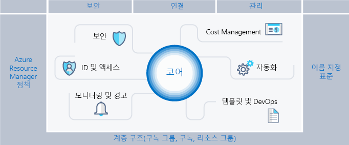
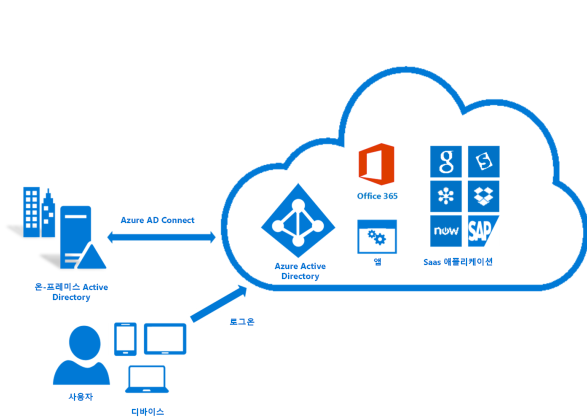
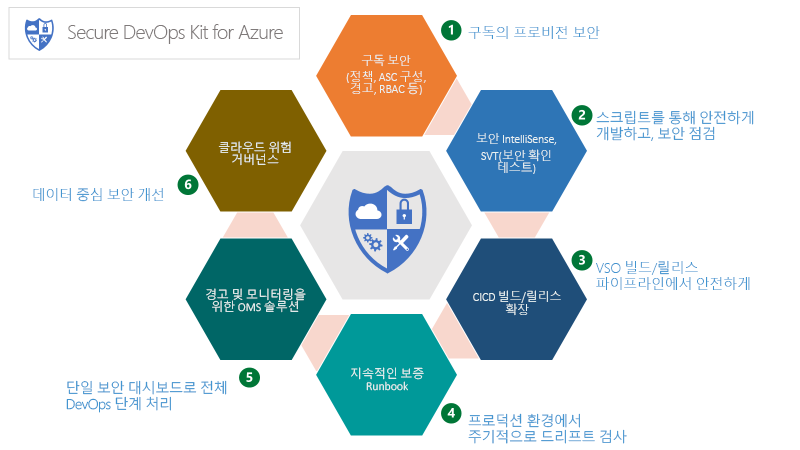
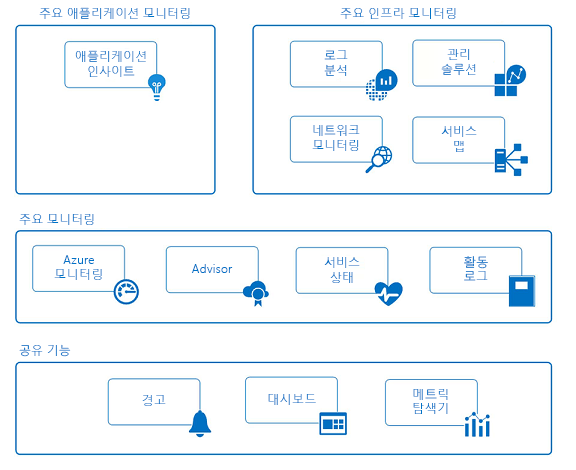

# Azure 엔터프라이즈 스캐폴드: 규범적 구독 거버넌스

기업은 민첩성과 유연성을 위해 공용 클라우드 도입을 확대하고 있습니다. 또한 수익을 창출하고 비즈니스에 맞게 리소스 사용을 최적화하는 클라우드의 장점을 활용합니다. Microsoft Azure는 광범위한 워크로드 및 애플리케이션을 처리할 구성 요소와 같이 기업에서 조합할 수 있는 다양한 서비스와 기능을 제공합니다.

Microsoft Azure 사용 결정은 클라우드의 혜택을 얻기 위한 첫 번째 단계에 지나지 않습니다. 두 번째 단계는 기업이 Azure를 효과적으로 사용하고 다음과 같이 질문에 답변하는 데 필요한 기본 기능을 파악하는 방법을 이해하는 것입니다.

* “데이터 독립성에 관심이 있습니다. 데이터와 시스템이 규정 요구 사항을 충족하도록 하려면 어떻게 하나요?”
* "내역을 확인하고 정확하게 청구할 수 있도록 모든 리소스가 지원하는 내용을 어떻게 파악하나요?"
* “공용 클라우드에서 배포하는 기능 및 수행하는 모든 작업이 보안을 최우선적으로 고려하도록 하려고 합니다. 어떻게 하는 것이 도움이 되나요?”

가드 레일이 없는 비어 있는 구독을 전망하는 것은 어렵습니다. 이 빈 공간은 Azure로의 전환에 방해가 될 수 있습니다.

이 문서는 기술 전문가가 거버넌스 요구 사항을 해결하고 민첩성 요구 사항과 균형을 맞추기 위한 시작 지점을 제공합니다. 조직이 자신의 Azure 환경을 안전한 방식으로 구현 및 관리할 수 있도록 안내해 주는 엔터프라이즈 스캐폴드 개념을 소개합니다. 또한 효과적이고 효율적인 컨트롤을 개발하기 위한 프레임워크를 제공합니다.

## 관리 필요성

Azure로 전환하는 경우 기업 내에서 클라우드를 성공적으로 사용하기 위해서는 먼저 관리 항목을 해결해야 합니다. 안타깝게도 포괄적인 관리 시스템을 만드는 데 시간과 절차가 따른다는 것은 일부 비즈니스 그룹이 엔터프라이즈 IT 적용 없이 공급업체로 직접 이동하는 것을 의미합니다. 이 방법을 사용할 경우 리소스가 제대로 관리되지 않는다면 기업은 데이터 손상 위험에 노출될 수 있습니다. 공용 클라우드의 특성인 민첩성, 유연성 및 사용량 기반 가격 책정은 고객의 요구(내부 및 외부)를 신속하게 충족시켜야 하는 비즈니스 그룹에 중요합니다. 하지만 엔터프라이즈 IT는 데이터와 시스템이 효과적으로 보호되도록 해야 합니다.

건물을 세울 때 스캐폴딩은 구조의 기반을 만드는 데 사용됩니다. 스캐폴드는 일반적인 개요를 제시하고 보다 영구적인 시스템을 탑재하기 위한 기준점을 제공합니다. 엔터프라이즈 스캐폴드는 동일합니다. 환경에 구조를 제공하고 공용 클라우드에 기본 제공되는 서비스에 대한 앵커를 제공하는 Azure 기능과 유연한 컨트롤 집합입니다. 이것은 작성자(IT 및 비즈니스 그룹)에게 제공 속도를 고려한 새로운 서비스를 만들고 연결하기 위한 기초를 제공합니다.

스캐폴드는 다양한 규모의 클라이언트와 수많은 협력을 통해 수집한 사례를 기반으로 합니다. 이러한 클라이언트는 클라우드에서 솔루션을 개발하는 작은 조직부터 대규모의 다국적 기업, 워크로드를 마이그레이션하고 클라우드 네이티브 솔루션을 개발하는 독립 소프트웨어 공급업체까지 다양합니다. 엔터프라이즈 스캐폴드는 기존의 IT 워크로드와 기민한 워크로드(예: Azure 플랫폼 기능을 토대로 SaaS(Software-as-a-Service) 애플리케이션을 작성하는 개발자)를 모두 유연하게 지원하기 위한 “용도로 작성”되었습니다.

엔터프라이즈 스캐폴드는 Azure 내에서 각각의 새로운 구독을 위한 기초로 고안된 것입니다. 따라서 관리자는 비즈니스 그룹 및 개발자가 자신의 목표를 신속하게 충족하도록 하면서도 조직의 최소 관리 요구 사항을 충족하도록 할 수 있습니다. 경험에 따르면 이러한 스캐폴드는 공용 클라우드 성장을 지연시키기보다 획기적으로 가속화하고 있는 것으로 나타나고 있습니다.

> [!NOTE]
> Microsoft는 구독 및 관리 그룹에서 공통 이미지, 템플릿, 정책 및 스크립트를 패키지, 관리 및 배포할 수 있는 [Azure Blueprints](/azure/governance/blueprints/overview)라는 새로운 기능을 미리 보기로 출시했습니다. 이 기능을 통해 스캐폴더를 참조 모델로 활용하여 조직에 배포할 수 있습니다.
>
다음 이미지는 스캐폴드의 구성 요소를 보여 줍니다. 근본적으로 관리 계층 구조 및 구독에 대한 견고한 계획을 토대로 합니다. 기본 요소는 Resource Manager 정책 및 강력한 이름 지정 표준으로 구성됩니다. 스캐폴드의 나머지는 부분은 안전하고 관리하기 쉬운 환경을 지원하고 연결하는 핵심 Azure 성능 및 기능입니다.

## 계층 구조 정의

스캐폴드의 기반은 구독 및 리소스 그룹에 대한 Azure 기업 등록계약의 계층 및 관계입니다. 기업 등록계약은 계약 관점에서 회사 내의 Azure 서비스 형태 및 사용을 정의합니다. 기업계약 내에서 환경을 조직의 구조에 맞게 부서, 계정, 최종적으로 구독 및 리소스 그룹으로 세분화할 수 있습니다.

Azure 구독은 모든 리소스가 포함된 기본 단위입니다. Azure 내에서 코어 수, 가상 네트워크 및 기타 리소스 등과 같은 한도도 정의합니다. Azure 리소스 그룹은 구독 모델을 추가로 세분화하고, 보다 자연적인 리소스 그룹을 사용하도록 설정하는 데 사용됩니다.

모든 기업은 서로 다르며 위 이미지의 계층 구조를 통해 회사 내에서 Azure가 구성되는 방식에 상당한 유연성을 허용할 수 있습니다. 청구, 리소스 관리 및 리소스 액세스에 대한 회사의 요구를 반영하도록 계층 구조를 모델링하는 것은 공용 클라우드를 시작할 때 최우선적이면서 가장 중요한 의사 결정 사항입니다.

### 부서 및 계정

Azure Enrollment에 대한 일반적인 세 가지 패턴은 다음과 같습니다.

* **기능** 패턴

    
* **사업부** 패턴

    
* **지리적** 패턴

    

이러한 각 패턴이 다양하게 활용되고 있지만 **사업부** 패턴은 유연하게 조직의 비용 모델을 모델링하고 제어 범위를 반영할 수 있으므로 점점 더 많이 채택되고 있습니다. Microsoft Core Engineering 및 Operations 그룹은 **페더럴**, **스테이트** 및 **로컬**에 따라 모델링되는 매우 효과적인 **사업부** 패턴의 하위 집합을 만들었습니다. (자세한 내용은 [엔터프라이즈 내의 구독 및 리소스 그룹 구성](https://azure.microsoft.com/blog/organizing-subscriptions-and-resource-groups-within-the-enterprise/)을 참조하세요.)

### 관리 그룹

Microsoft는 최근에 계층 구조를 모델링하는 새로운 방식인 [Azure 관리 그룹](/azure/azure-resource-manager/management-groups-overview)을 출시했습니다. 관리 그룹은 부서 및 계정보다 훨씬 더 유연하며 최대 6개 수준으로 중첩할 수 있습니다. 관리 그룹을 사용하면 리소스의 효율적인 관리를 위해 청구 계층과 분리된 계층 구조를 만들 수 있습니다. 관리 그룹은 청구 계층 구조를 미러링할 수 있으며, 기업은 이 방식으로 시작하는 경우가 많습니다. 그러나 관리 그룹의 강점은 청구 계층 구조 중 어디에 위치하는지에 관계없이 관리 그룹을 사용하여 관련 구독이 함께 그룹화되는 조직을 모델링하며, 정책 및 이니셔티브 뿐만 아니라 공통 역할도 할당되어야 하는 경우에 드러납니다. 몇 가지 예:

* **프로덕션/비프로덕션**. 일부 기업은 해당 프로덕션 및 비프로덕션 구독을 식별하기 위해 관리 그룹을 만듭니다. 관리 그룹을 사용하면 이러한 고객은 역할 및 정책을 보다 쉽게 관리할 수 있습니다. 예를 들어, 비프로덕션 구독에서는 개발자가 “참가자” 액세스 권한을 받을 수 있지만, 프로덕션 환경에서는 “읽기 권한자” 액세스 권한만 받을 수 있습니다.
* **내부 서비스/외부 서비스**. 기업은 프로덕션/비프로덕션의 경우와 마찬가지로 내부 서비스 및 외부(고객 상대) 서비스에 대해 다른 요구 사항, 정책 및 역할을 유지하는 경우가 많습니다.

잘 관리되는 관리 그룹은 Azure 정책 및 이니셔티브와 함께 효율적인 Azure 거버넌스의 토대가 됩니다.

### 구독

부서 및 계정(또는 관리 그룹)을 결정할 때는 주로 조직에 맞게 Azure 환경을 구분하는 방법을 고려하게 됩니다. 그러나 구독은 실제 작업이 발생하는 위치로, 여기에서 내리는 의사 결정은 보안, 확장성 및 청구에 영향을 줍니다.  많은 조직은 다음 패턴을 참조합니다.

* **응용 프로그램/서비스**: 구독은 응용 프로그램 또는 서비스(응용 프로그램 포트폴리오)를 나타냅니다.
* **수명 주기**: 구독은 프로덕션 또는 개발과 같은 서비스 수명 주기를 나타냅니다.
* **부서**: 구독은 조직의 부서를 나타냅니다.

처음 두 패턴이 가장 일반적으로 사용되며 둘 다 권장됩니다. 수명 주기 접근 방법은 대부분의 조직에 적합합니다. 이 경우 일반 권장 사항은 두 개의 기본 구독을 사용하는 것입니다. “프로덕션” 및 “비프로덕션”을 사용한 후 리소스 그룹을 사용하여 환경을 추가적으로 구분합니다.

### 리소스 그룹

Azure Resource Manager를 사용하면 리소스를 관리, 청구 또는 자연 선호도를 위해 의미 있는 그룹으로 배치할 수 있습니다. 리소스 그룹은 공통 수명 주기를 포함하고 “모든 SQL Server” 또는 “애플리케이션 A”와 같은 특성을 공유하는 리소스 컨테이너입니다.

리소스 그룹은 중첩될 수 없으며 리소스는 하나의 리소스 그룹에만 속할 수 있습니다. 일부 작업은 리소스 그룹의 모든 리소스에 작용할 수 있습니다. 예를 들어 리소스 그룹을 삭제하면 해당 리소스 그룹 내의 모든 리소스가 제거됩니다. 구독과 마찬가지로, 리소스 그룹을 만들 경우 공통 패턴이 있으며 “기존 IT” 워크로드부터 “기민한 IT” 워크로드까지 다양합니다.

* 가장 일반적으로 “기존 IT” 워크로드는 동일한 수명 주기(예: 애플리케이션) 내에서 항목별로 그룹화됩니다. 애플리케이션별 그룹화를 통해 개별 애플리케이션 관리가 가능합니다.
* "기민한 IT" 워크로드는 클라우드 애플리케이션을 접하는 외부 고객에 초점을 둡니다. 리소스 그룹은 종종 배포(예: 웹 계층, 앱 계층) 및 관리 계층을 반영합니다.

> [!NOTE]
> 워크로드를 이해하면 리소스 그룹 전략을 개발하는 데 도움이 됩니다. 이러한 패턴을 혼합하여 일치시킬 수 있습니다. 예를 들어, “기민한” 리소스 그룹과 동일한 구독의 공유 서비스 리소스 그룹이 있습니다.

## 이름 지정 표준

스캐폴드의 첫 번째 기본 요소는 일관된 이름 지정 표준입니다. 잘 설계된 이름 지정 표준을 통해 포털, 청구지 및 스크립트 내에서 리소스를 식별할 수 있습니다. 온-프레미스 인프라의 이름 지정 표준이 이미 있을 수 있습니다. Azure를 환경에 추가할 경우 이러한 이름 지정 표준을 Azure 리소스에 확장해야 합니다.

> [!TIP]
> 명명 규칙:
> * 가능하다면 [패턴 및 작업 방식 지침](https://docs.microsoft.com/en-us/azure/architecture/best-practices/naming-conventions)을 검토하고 도입하세요. 이 설명서를 통해 의미 있는 이름 지정 표준을 결정할 수 있으며 포괄적인 예제도 확인할 수 있습니다.
> * Resource Manager 정책을 사용하여 이름 지정 표준 적용
>
>나중에는 이름을 변경하기가 어려우므로 지금 몇 분을 투자해서 나중에 문제 해결에 필요한 시간을 단축할 수 있습니다.

일반적으로 사용되고 검색되는 리소스에 대한 이름 지정 표준을 집중적으로 살펴봅니다.  예를 들어, 모든 리소스 그룹은 명확성을 위해 강력한 표준을 준수해야 합니다.

### 리소스 태그

리소스 태그는 이름 지정 표준과 긴밀하게 연결됩니다. 구독에 리소스를 추가할 경우, 청구, 관리 및 운영 목적으로 이러한 리소스를 논리적으로 분류하는 것이 점점 더 중요해지고 있습니다. 자세한 내용은 [태그를 사용하여 Azure 리소스 구성](https://docs.microsoft.com/en-us/azure/azure-resource-manager/resource-group-using-tags)을 참조하세요.

> [!IMPORTANT]
> 태그는 개인 정보를 포함할 수 있으며 GDPR 규정이 적용될 수 있습니다. 태그 관리를 신중하게 계획하세요. GDPR에 대한 일반적인 내용은 [Service Trust Portal](https://servicetrust.microsoft.com/ViewPage/GDPRGetStarted)의 GDPR 섹션을 참조하세요.

태그는 청구 및 관리 이외의 다양한 방식에서 사용됩니다. 자동화의 일부로도 자주 사용됩니다(이후 섹션 참조). 미리 고려하지 않으면 충돌이 발생할 수 있습니다. 권장되는 방법은 엔터프라이즈 수준(예: ApplicationOwner, CostCenter)에서 모든 공통 태그를 식별하고, 자동화를 사용하여 리소스를 배포할 때 일관되게 적용하는 것입니다.

## Azure 정책 및 이니셔티브

스캐폴드의 두 번째 기본 요소는 [Azure 정책 및 이니셔티브](/azure/azure-policy/azure-policy-introduction)를 사용하여 구독의 리소스 및 서비스에 대해 규칙을 적용함으로써 위험을 관리하는 것과 관련이 있습니다. Azure 이니셔티브는 단일 목표를 달성하도록 디자인된 정책 컬렉션입니다. Azure 정책 및 이니셔티브는 특정 정책의 적용을 시작하도록 리소스 범위에 할당됩니다.
<이니셔티브/정책/할당의 IMG>

Azure 정책 및 이니셔티브를 이전에 언급한 관리 그룹과 함께 사용할 경우 더욱 강력한 효과를 발휘합니다. 관리 그룹은 이니셔티브 또는 정책을 전체 구독 집합에 할당할 수 있도록 합니다.

### Resource Manager 정책의 일반적인 사용

Azure 정책 및 이니셔티브는 Azure 도구 키트의 강력한 도구입니다. 정책을 사용하면 기업은 추가적인 위험을 초래하지 않으면서 고객 애플리케이션을 개발하는 것과 같은 “기민한” 워크로드도 허용하면서, LOB 애플리케이션에 필요한 안정성을 보장하는 “기존 IT” 워크로드용 컨트롤도 제공할 수 있습니다. 정책에 대해 볼 수 있는 가장 일반적인 패턴은 다음과 같습니다.

* **지리적 규정 준수/데이터 독립성**. Azure의 전 세계적인 지역 목록은 점점 더 증가하고 있습니다. 기업은 경우에 따라 특정 범위의 리소스가 규제 요구 사항을 충족하기 위해 지리적 지역을 벗어나지 않도록 해야 합니다.
* **서버의 공개적 노출 방지**. Azure 정책은 특정 리소스 유형의 배포를 금지할 수 있습니다. 일반적인 목적은 특정 범위 내에서 공용 IP의 생성을 거부하는 정책을 만들어 서버가 의도치 않게 인터넷에 노출되는 것을 방지하는 것입니다.
* **비용 관리 및 메타데이터**. 리소스 태그는 리소스 및 리소스 그룹(예: CostCenter, Owner 등)에 중요한 청구 데이터를 추가하는 데 주로 사용됩니다. 이러한 태그는 리소스의 정확한 청구 및 관리에 매우 유용합니다. 정책은 배포된 모든 리소스에 리소스 태그를 적용하여 보다 쉽게 관리할 수 있도록 합니다.

### 이니셔티브의 일반적인 목적

이니셔티브를 도입하면 기업은 논리적 정책을 함께 그룹화하고 전체적으로 추적할 수 있습니다. 또한 이니셔티브는 기업이 “기민한” 및 “기존” 워크로드의 요구를 해결하도록 지원합니다. 이니셔티브의 창의적 사용이 확인되었으나 주로 사용되는 이니셔티브는 다음과 같습니다.

* **Azure Security Center에서 모니터링 사용**. Azure 정책의 기본 이니셔티브로, 이니셔티브를 이해하는 데 유용한 예입니다. 이 이니셔티브는 암호화되지 않은 SQL Database, VM 취약성 및 좀 더 일반적인 보안 관련 요구를 식별하는 정책을 사용하도록 합니다.
* **규제 관련 이니셔티브**. 기업은 규제 요구 사항(예: HIPAA)에 해당하는 정책을 그룹화하여 컨트롤 및 해당 컨트롤에 대한 준수를 효율적으로 추적할 수 있도록 합니다.
* **리소스 유형 및 SKU**. 배포할 수 있는 리소스 유형 뿐만 아니라 배포할 수 있는 SKU를 제한하는 이니셔티브를 만들 경우 비용을 제어하는 데 도움이 되며, 조직에서 팀이 지원하기 위한 기술 집합 및 절차를 보유하는 리소스만 배포하도록 할 수 있습니다.

> [!TIP]
> 정책 정의 대신, 항상 이니셔티브 정의를 사용하는 것이 좋습니다. 구독 또는 관리 그룹과 같은 범위에 이니셔티브를 할당하면 할당을 변경하지 않고도 이니셔티브에 다른 정책을 쉽게 추가할 수 있습니다. 이를 통해 적용되는 정책을 훨씬 더 쉽게 이해하고 규정 준수를 편리하게 추적할 수 있습니다.

### 정책 및 이니셔티브 할당

정책을 만들고 논리적 이니셔티브로 그룹화한 후에는 관리 그룹, 구독 또는 심지어 리소스 그룹에 해당하는 범위에 정책을 할당해야 합니다. 할당을 통해 정책 할당에서 하위 범위를 제외할 수도 있습니다. 예를 들어 구독 내에서 공용 IP의 생성을 거부하는 경우, 리소스 그룹에 대한 제외를 보호된 DMZ에 연결하여 할당을 만들 수 있습니다.

이 [GitHub](https://github.com/Azure/azure-policy) 리포지토리에서 Azure 내 다양한 리소스에 정책 및 이니셔티브를 적용할 수 있는 방법을 보여 주는 여러 가지 정책 예제를 확인할 수 있습니다.

## ID 및 액세스 관리

공용 클라우드로 시작할 때 “누구에게 리소스 액세스 권한이 있어야 하는가”와 "이 액세스를 어떻게 제어할 수 있는가?"라는 의문이 들 수 있습니다. Azure Portal에 대한 액세스를 허용 또는 거부하고 포털에서 리소스에 대한 액세스를 제어하는 것은 클라우드 내 자산의 장기적인 성공 및 안전에 중요합니다.

리소스에 대한 액세스를 확보하기 위해서는 먼저 ID 공급자를 구성한 후에 역할 및 액세스를 구성합니다. 온-프레미스 Active Directory에 연결되어 있는 Azure AD(Azure Active Directory)는 Azure ID의 기반이 됩니다. 즉, Azure AD는 Active Directory가 *아니며* Azure AD 테넌트가 무엇이고 Azure 등록과 어떤 관련이 있는지를 이해하는 것이 중요합니다.  사용 가능한 [정보](../getting-started/azure-resource-access.md)를 검토하여 Azure AD 및 AD를 잘 이해하세요. Active Directory를 Azure AD에 연결하고 동기화하려면 온-프레미스에서 [AD Connect 도구](/azure/active-directory/connect/active-directory-aadconnect)를 설치하고 구성하세요.

Azure가 처음으로 릴리스되었을 때 구독에 대한 액세스 제어는 기본적인 관리자 또는 공동 관리자였습니다. 클래식 모델에서 구독에 대한 액세스에는 포털에 있는 모든 리소스에 대한 액세스를 포함합니다. 세분화된 제어가 부족하므로 Azure Enrollment에 합당한 액세스 제어 수준을 제공하기 위해 구독 수가 증가하는 단점이 있었습니다. 이제 더 이상 구독 수를 늘리지 않아도 됩니다. RBAC(역할 기반 액세스 제어)를 사용하는 경우, “소유자”, “참가자” 또는 “읽기 권한자”와 같은 공통 액세스를 제공하는 표준 역할에 사용자를 할당하거나 고유한 역할을 직접 만들 수도 있습니다.

역할 기반 액세스를 구현할 때는 다음 작업이 강력히 권장됩니다.

* 이러한 역할은 광범위한 사용 권한이 있으므로 구독의 관리자/공동 관리자를 제어합니다. Azure 클래식 배포를 관리해야 하는 경우 구독 소유자만 공동 관리자로 추가하면 됩니다.

* 관리 그룹을 사용하여 여러 구독에서 [역할](/azure/azure-resource-manager/management-groups-overview#management-group-access)을 할당하고, 구독 수준에서 관리하는 부담을 줄입니다.
* Active Directory에서 Azure 사용자를 그룹에 추가합니다(예를 들어, 애플리케이션 X 소유자). 동기화된 그룹을 사용하여 애플리케이션이 포함된 리소스 그룹을 관리하는 데 필요한 권한을 그룹 구성원에 제공합니다.
* 예상되는 작업을 수행하는 데 필요한 **최소한의 권한**을 부여하는 원리를 따릅니다.

> [!IMPORTANT]
>[Azure AD Privileged Identity Management](/azure/active-directory/privileged-identity-management/pim-configure), Azure [Multi-Factor Authentication](/azure/active-directory/authentication/howto-mfa-getstarted) 및 [조건부 액세스](/azure/active-directory/active-directory-conditional-access-azure-portal) 기능을 사용하여 Azure 구독에 대한 관리 작업에 더 나은 보안과 가시성을 제공하는 것이 좋습니다. 이러한 기능은 ID를 보다 안전하게 보호하고 관리하기 위해 유효한 Azure AD Premium 라이선스(기능에 따라)에서 제공됩니다. Azure AD PIM은 승인 워크플로와 관리자 활성화 및 활동의 전체 감사를 통해 “Just-in-Time” 관리 액세스를 허용합니다. Azure MFA는 또 다른 중요한 기능으로, Azure Portal 로그인을 2단계 인증으로 확인할 수 있도록 합니다. 조건부 액세스 컨트롤과 함께 사용하면 보안 위험을 효과적으로 관리할 수 있습니다.

ID 및 액세스 컨트롤을 계획 및 준비하고, Azure ID 관리 모범 사례([링크](/azure/security/azure-security-identity-management-best-practices))를 따르는 것이 사용할 수 있는 최적의 위험 완화 전략 중 하나이며 모든 배포에 필수적으로 고려해야 합니다.

## 보안

기본적으로 클라우드를 도입하는 데 있어 가장 큰 장애물 중 하나는 보안과 관련된 문제일 것입니다. IT 위험 관리자 및 보안 부서는 기본적으로 Azure의 리소스가 보호되고 안전하다는 것을 보장해야 합니다. Azure는 리소스를 보호하고 이러한 리소스에 대한 위협을 감지/방지하는 데 사용할 수 있는 여러 기능을 제공합니다.

### Azure Security Center

[Azure Security Center](/azure/security-center/security-center-intro)에서는 고급 위협 보호 외에도 환경에서 사용되는 리소스 보안 상태를 통합된 보기로 제공합니다. Azure Security Center는 Microsoft 파트너가 연결되는 소프트웨어를 만들고 기능을 강화할 수 있는 개방형 플랫폼입니다. Azure Security Center(무료 계층)의 기본 기능은 보안 태세를 강화하는 평가 및 권장 사항을 제공합니다. 이 센터의 유료 계층은 JIT(Just In Time) 관리 액세스 및 적응형 애플리케이션 제어(허용 목록)와 같은 중요한 추가 기능을 지원합니다.

> [!TIP]
>Azure Security Center는 위협을 감지하고 기업을 보호하기 위해 사용할 수 있는 새로운 기능을 통합하고 지속적으로 개선되는 매우 강력한 도구입니다. 항상 ASC를 사용하도록 설정하는 것이 좋습니다.

### Azure 리소스 잠금

조직에서 구독에 코어 서비스를 추가하게 되면서 이러한 서비스는 업무 중단을 방지하는 데 점점 더 중요해지고 있습니다. 자주 확인되는 한 가지 중단 유형은 Azure 구독에서 사용되는 스크립트 및 도구의 의도치 않은 결과로, 리소스가 잘못 삭제되는 상황을 가져옵니다. [리소스 잠금](/azure/azure-resource-manager/resource-group-lock-resources)을 통해 리소스를 삭제할 경우 상당한 영향을 미치는 높은 가치의 리소스에서 작업을 제한할 수 있습니다. 잠금은 구독, 리소스 그룹 또는 심지어 개별 리소스에도 적용됩니다. 일반적인 사용 사례는 가상 네트워크, 게이트웨이, 네트워크 보안 그룹 및 키 저장소 계정과 같은 기본적인 리소스에 잠금을 적용하는 것입니다.

### Secure DevOps Toolkit

“Secure DevOps Kit for Azure”(AzSK)는 원래는 Microsoft 자체 IT 팀에서 만들어 Github를 통해 OpenSource([링크](https://github.com/azsk/DevOpsKit-docs))에 릴리스한 스크립트, 도구, 확장, 자동화 등의 컬렉션입니다. AzSK는 포괄적인 자동화를 사용하고 네이티브 DevOps 워크플로에 보안을 원활하게 통합하여 팀의 종단 간 Azure 구독 및 리소스 보안 요구를 충족함으로써 다음과 같은 6가지 영역에서 보안 DevOps를 달성하는 데 도움을 줍니다.

* 구독 보안 유지
* 보안 개발 사용
* CICD에 보안 통
* 지속적인 보장
* 경고 및 모니터링
* 클라우드 위험 거버넌스

AzSK는 전체 Azure 거버넌스 계획의 중요한 부분이 되는 풍부한 도구, 스크립트 및 정보 집합으로, 이러한 항목을 스캐폴드에 통합하는 것은 조직의 위험 관리 목표를 지원하는 데 중요합니다.

### Azure 업데이트 관리

환경 안전을 유지하기 위해 수행할 수 있는 주요 태스크 중 하나는 최신 업데이트로 서버를 패치하는 것입니다. 이 작업을 수행하기 위한 많은 도구가 있지만 Azure는 중요한 OS 패치의 식별 및 롤아웃을 진행하는 [Azure 업데이트 관리](/azure/automation/automation-update-management) 솔루션을 제공합니다.  이 솔루션은 이 설명서의 뒷부분에 나오는 Azure Automation([자동화](#automate) 섹션 참조)을 활용합니다.

## 모니터 및 경고

모든 Azure 구독에서 사용 중인 활동, 성능 메트릭, 상태 및 서비스 가용성 정보를 제공하는 원격 분석을 수집하고 분석하는 작업은 애플리케이션 및 인프라를 사전에 관리하는 데 매우 중요하며, 모든 Azure 구독에서 기본적으로 필요합니다. 모든 Azure 서비스는 활동 로그, 메트릭 및 진단 로그 형태로 원격 분석을 제공합니다.

* **활동 로그**는 구독에서 리소스에 대해 수행한 모든 작업을 설명합니다.
* **메트릭**은 리소스 내에서 제공되는 수치 정보로, 리소스의 성능 및 상태를 설명합니다.
* **진단 로그**는 Azure 서비스에서 제공하며, 해당 서비스 작업에 대한 풍부한 데이터를 주기적으로 제공합니다.

이 정보는 여러 수준에서 보고, 관련 작업을 수행할 수 있으며 계속 개선됩니다. Azure는 아래 다이어그램에 설명된 서비스를 통해 Azure 리소스의 **공유**, **핵심** 및 **심층** 모니터링 기능을 제공합니다.

### 공유 기능

* **경고**: Azure 리소스에서 모든 로그, 이벤트 및 메트릭을 수집할 수 있지만, 중요한 상태 및 조치를 알리는 기능이 없으면, 이 데이터는 기록 용도 및 법적으로만 유용합니다. Azure 경고는 모든 애플리케이션 및 인프라에서 사용자가 정의하게 되는 상태를 미리 알립니다. 작업 그룹을 사용하여 수신자 집합에게 로그, 이벤트 및 메트릭과 관련된 알림을 제공하기 위한 경고 규칙을 만듭니다. 또한 작업 그룹은 웹후크와 같은 외부 작업을 사용하여 Azure Automation Runbook 및 Azure Functions를 실행함으로써 수정 작업을 자동화하는 기능도 제공합니다.

* **대시보드**: 대시보드를 사용하면 모니터링 뷰를 집계하고 여러 리소스와 구독 간에 데이터를 조합하여 Azure 리소스의 원격 분석에 엔터프라이즈 차원의 보기를 제공할 수 있습니다. 자체 보기를 만들어 구성한 후 다른 사용자와 공유할 수 있습니다. 예를 들어, DBA가 Azure SQL DB, Azure DB for PostgreSQL 및 Azure DB for MySQL을 포함하는 모든 Azure 데이터베이스 서비스에서 정보를 제공할 수 있도록 하기 위해 다양한 타일로 구성된 대시보드를 만들 수 있습니다.

* **메트릭 탐색기**: 메트릭은 리소스의 작동 및 성능에 대해 인사이트를 제공하기 위해 Azure 리소스에서 생성하는 수치 값(예: CPU 비율, 디스크 I/O)입니다. 메트릭 탐색기를 사용하여 관심 있는 메트릭을 정의하고 집계 및 분석을 위해 Log Analytics로 보낼 수 있습니다.

### 핵심 모니터링

* **Azure Monitor**: Azure Monitor는 Azure 리소스를 모니터링하는 단일 원본이 되는 핵심 플랫폼 서비스입니다. Azure Monitor의 Azure Portal 인터페이스를 사용하면 한곳에서 Application Insights, Log Analytics, 네트워크 모니터링, 관리 솔루션 및 서비스 맵의 심층 모니터링 기능을 비롯한 Azure 전반의 모든 모니터링 기능에 액세스할 수 있습니다. Azure Monitor를 통해 전체 클라우드 위치에서 Azure 리소스의 메트릭과 로그에 대해 시각화, 쿼리, 라우팅, 보관 및 작업을 수행할 수 있습니다. 포털 외에도, Monitor PowerShell Cmdlet, 플랫폼 간 CLI 또는 Azure Monitor REST API를 통해 데이터를 검색할 수 있습니다.

* **Azure Advisor**: Azure Advisor는 구독 및 환경에서 원격 분석을 지속적으로 모니터링하고, 응용 프로그램을 구성하는 리소스의 성능, 보안 및 가용성을 개선하고 비용을 절감하도록 Azure 리소스를 최적화하는 방법에 대한 모범 사례 권장 사항을 제공합니다.

* **Service Health**: Azure Service Health는 응용 프로그램에 영향을 줄 수 있는 Azure 서비스의 문제를 식별하고 예약된 유지 관리 창을 계획하는 데 도움을 줍니다.

* **활동 로그**: 활동 로그는 구독의 리소스에 대한 모든 작업을 설명합니다. 이 로그는 리소스에 대한 만들기, 업데이트, 삭제 작업의 ‘대상’, ‘주체’ 및 ‘시기’를 파악할 수 있는 감사 추적을 제공합니다. 활동 로그 이벤트는 90일 동안 플랫폼에 저장되어 쿼리에서 사용할 수 있습니다. 좀 더 장기적으로 보존하고 여러 리소스에 대해 심층 쿼리 및 분석을 수행하기 위해 활동 로그를 Log Analytics에 수집할 수 있습니다.

### 심층 애플리케이션 모니터링

* **Application Insights**: Application Insights를 사용하면 클라우드 또는 온-프레미스에서 응용 프로그램별 원격 분석을 수집하고 응용 프로그램의 성능, 가용성, 사용 현황을 모니터링할 수 있습니다. .NET, JavaScript, JAVA, Node.js, Ruby 및 Python을 비롯한 여러 언어로 지원되는 SDK를 사용하여 애플리케이션을 계측할 수 있습니다. Application Insights 이벤트는 인프라 및 보안 모니터링을 지원하는 동일한 Log Analytics 데이터 저장소에 수집되므로 풍부한 쿼리 언어를 통해 이벤트 간 상관 관계를 파악하고 시간에 따라 이벤트를 집계할 수 있습니다.

### 심층 인프라 모니터링

* **Log Analytics**: Log Analytics는 다양한 원본에서 원격 분석 및 기타 데이터를 수집하고 응용 프로그램 및 리소스의 작업에 대한 인사이트를 제공하는 쿼리 언어 및 분석 엔진을 제공하여 Azure 모니터링에서 중심적인 역할을 수행합니다. 고성능 로그 검색 및 보기를 통해 Log Analytics 데이터와 직접 상호 작용하거나 Application Insights 또는 Azure Security Center 같은 Log Analytics에 데이터를 저장하는 다른 Azure 서비스에서 분석 도구를 사용할 수도 있습니다.

* **네트워크 모니터링**: Azure의 네트워크 모니터링 서비스를 통해 네트워크 트래픽 흐름, 성능, 보안, 연결 및 병목 상태에 대한 인사이트를 얻을 수 있습니다. 잘 계획된 네트워크 디자인에는 Network Watcher 및 ExpressRoute Monitor와 같은 Azure 네트워크 모니터링 서비스의 구성 작업이 포함되어야 합니다.

* **관리 솔루션**: 관리 솔루션은 응용 프로그램 또는 서비스의 패키지된 논리, 인사이트 및 사전 정의된 Log Analytics 쿼리 집합입니다. 이러한 솔루션은 이벤트 데이터를 저장하고 분석하기 위한 토대로 Log Analytics를 활용합니다. 샘플 관리 솔루션에는 모니터링 컨테이너 및 Azure SQL Database 분석이 포함됩니다.

* **서비스 맵**: 서비스 맵은 인프라 구성 요소, 해당 프로세스 및 다른 컴퓨터와 외부 프로세스에 대한 상호 종속성을 그래픽 보기로 표시합니다. 이 기능은 이벤트, 성능 데이터 및 관리 솔루션을 Log Analytics에 통합합니다.

> [!TIP]
> 개별 경고를 만들기 전에 Azure 경고에서 사용할 수 있는 공유 작업 그룹 집합을 만들고 유지 관리합니다. 이렇게 하면 수신자 목록, 알림 제공 방법(메일, SMS 전화 번호) 및 외부 작업에 대한 웹후크(Azure Automation Runbook, Azure Functions/Logic Apps, ITSM) 수명 주기를 중앙에서 유지 관리할 수 있습니다.

## 비용 관리

온-프레미스 클라우드에서 공용 클라우드로 전환할 때 직면하게 되는 주요 변경 중 하나는 자본 지출(하드웨어 구매 )에서 운영 지출(사용한 서비스 비용)로 전환된다는 것입니다. 이러한 CAPEX에서 OPEX로의 전환은 보다 신중한 비용 관리 요구를 발생합니다. 클라우드의 장점은 필요하지 않을 때 끄거나 크기를 조정하여 사용하는 서비스 비용에 근본적으로 긍정적인 영향을 줄 수 있다는 것입니다. 분별있는 고객이라면 클라우드의 비용을 신중히 관리하는 것이 필요합니다.

Microsoft는 비용을 시각화, 추적 및 관리할 수 있는 몇 가지 도구를 제공합니다. 또한 비용 관리를 사용자 지정하고 사용자 고유의 도구 및 대시보드에 통합하는 API 풀세트도 제공합니다. 이러한 도구는 Azure Portal 기능 및 외부 기능에 느슨하게 연결됩니다.

### Azure Portal 기능

작업 수행 기능 뿐만 아니라 비용에 대한 즉각적인 정보를 제공하는 도구입니다.

* **구독 리소스 비용**: 포털에 있는 [Azure 비용 분석](/azure/cost-management/overview) 보기는 리소스 또는 리소스 그룹별로 비용과 일별 지출 정보를 간단히 표시합니다.
* **Azure 비용 관리**: 이 제품은 Microsoft가 Cloudyn을 구입하면서 확보한 제품으로, Azure 지출과 다른 공용 클라우드 공급자에서 지출한 내역을 관리 및 분석할 수 있도록 합니다. [개요](/azure/cost-management/overview)에서 제공된 것과 같은 다양한 기능을 포함하는 무료 및 유료 계층이 제공됩니다.
* **Azure 예산 및 작업 그룹** 최근까지 어떤 항목에 얼마의 비용이 드는지와 그와 관련해서 어떤 작업을 수행하고 있는지를 파악하는 일은 수동으로 진행되는 경향이 많았습니다. Azure 예산 및 해당 API를 사용하게 되면서 이제 비용이 임계값에 도달하면 작업을 만들 수 있습니다([이](https://channel9.msdn.com/Shows/Azure-Friday/Managing-costs-with-the-Azure-Budgets-API-and-Action-Groups) 예제 참조). 예를 들어, 해당 예산의 100% 또는 [다른 예제]에 도달하면 “테스트” 리소스 그룹을 종료합니다.
* **Azure Advisor** 어떤 항목에 얼마의 비용이 드는지를 아는 것은 전투의 절반에 지나지 않습니다. 나머지 절반은 이러한 정보로 무엇을 할 것인지입니다. [Azure Advisor](/azure/advisor/advisor-overview)는 돈을 절약하거나, 안정성을 향상시키거나, 보안을 강화하기 위한 권장 작업을 제공합니다.

### 외부 비용 관리 도구

* **PowerBI Azure Consumption Insights**. 조직의 정보를 자체적인 방식으로 시각화하고 싶나요? 그렇다면 PowerBI용 Azure Consumption Insights 콘텐츠 팩이 안성맞춤입니다. 이 콘텐츠 팩과 PowerBI를 사용하면 조직을 나타내고, 비용을 심층 분석하고, 보완을 위해 기타 데이터 원본을 추가할 수 있는 사용자 지정 시각화를 만들 수 있습니다.

* **Consumption API**. [Consumption API](/rest/api/consumption/)를 사용하면 예산, 예약된 인스턴스 및 Marketplace 요금에 대한 정보 외에, 비용 및 사용량 데이터에 프로그래밍 방식으로 액세스할 수 있습니다. 이러한 API는 기업등록 및 일부 웹 직접 구독에서만 액세스할 수 있지만 사용자 고유의 도구 및 데이터 웨어하우스에 비용 데이터를 통합하는 기능을 제공합니다. [여기](/cli/azure/consumption?view=azure-cli-latest)에 표시된 Azure CLI를 사용하여 이러한 API에 액세스할 수도 있습니다.

오랫동안 클라우드를 사용했으며 사용 방식이 “완성된 경지에 오른” 고객을 검토하면 매우 좋은 다양한 추천 사례를 얻게 됩니다.

* **능동적인 비용 모니터링**. 완성된 경지에 오른 Azure 사용자 조직은 비용을 지속적으로 모니터링하고 필요할 때 조치를 취합니다. 일부 조직은 전담 직원이 분석을 수행하고, 사용 변경을 제안하도록 하며, 이러한 직원들은 수개월 동안 실행되었으나 사용되지 않은 HDInsight 클러스터를 처음 찾게 될 때 기대 이상의 성과를 거두게 됩니다.
* **예약 인스턴스 사용**. 클라우드에서 비용을 관리하기 위한 또 다른 주요 테넌트는 작업에 적합한 도구를 사용하는 것입니다. 연중무휴로 작동해야 하는 IaaS VM이 있는 경우 예약 인스턴스를 사용하면 비용을 크게 절감할 수 있습니다. VM 종료 자동화와 RI 사용 간에 적절한 균형을 찾으려면 일정한 경험과 분석 능력이 필요합니다.
* **효과적인 자동화 사용**: 대부분의 워크로드는 매일 실행하지 않아도 됩니다. 매일 4시간 동안 VM을 끄기만 해도 15%의 비용을 절감할 수 있습니다. Automation은 투자 비용을 단기간에 회수할 수 있습니다.
* **가시성을 위해 리소스 태그 사용**: 이 문서의 다른 위치에서 언급된 것처럼, 리소스 태그를 사용하여 비용을 보다 잘 분석할 수 있습니다.

비용 관리는 공용 클라우드의 효과적이면서 효율적인 실행에 핵심적인 규정입니다. 비용 관리에 성공하는 기업은 비용을 제어하고, 과도한 구매 및 수요 폭증 없이 실제 수요에 맞게 비용을 지출할 수 있게 됩니다.

## 자동화

클라우드 공급자를 사용하는 조직의 성공을 가르는 여러 기능 중 하나는 통합한 자동화 수준입니다.  자동화는 절대 끝나지 않는 프로세스로, 조직이 클라우드로 전환할 때 구축을 위해 리소스와 시간을 투자해야 하는 영역입니다.  자동화는 문제 해결을 위해 리소스를 일관되게 롤아웃(다른 핵심 스캐폴드 개념, 템플릿 및 DevOps에 직접 관련됨)하는 것을 비롯한 다양한 목적으로 사용됩니다.  자동화는 Azure 스캐폴드의 “연결 조직”으로, 각 영역을 함께 연결해줍니다.

이 기능을 구축할 때 Azure Automation, EventGrid 및 AzureCLI와 같은 자사 도구부터 Terraform, Jenkins, Chef 및 Puppet 등의 광범위한 타사 도구에 이르기까지 다양한 도구를 사용할 수 있습니다. 운영 팁의 자동화 기능의 핵심에는 Azure Automation, Event Grid 및 Azure Cloud Shell이 있습니다.

* **Azure Automation**: 클라우드 기반 기능을 사용하여 Runbook을 작성하고(PowerShell 또는 Python에서), 프로세스를 자동화하고 리소스를 구성하고, 패치를 적용할 수 있도록 하는 클라우드 기반 기능입니다.  [Azure Automation](/azure/automation/automation-intro)에는 배포에 중요한 광범위한 플랫폼 간 기능이 포함되어 있지만 너무 광범위하므로 여기서는 다루지 않습니다.
* **Event Grid**: 이 [서비스](/azure/event-grid)는 Azure 환경 내의 이벤트에 대응할 수 있는 완전히 관리되는 이벤트 라우팅 시스템입니다. Automation이 완성된 클라우드 조직의 연결 조직인 것처럼, Event Grid도 적절한 자동화를 위한 연결 조직입니다. Event Grid를 사용하여 새 리소스를 만들고 해당 리소스를 데이터베이스에 해당 로깅할 때마다 관리자에게 메일을 전송하는 단순, 서버리스 작업을 만들 수 있습니다. 동일한 Event Grid는 리소스가 삭제될 때 알림을 제공하고, 데이터베이스에서 해당 항목을 제거할 수 있습니다.
* **Azure Cloud Shell**: Azure에서 리소스를 관리하기 위한 대화형 브라우저 기반 [셸](/azure/cloud-shell/overview)입니다. 스크립트를 실행할 일관된 환경을 유지하도록 필요할 때 시작(및 사용자를 위해 유지 관리)되는 완전한 PowerShell 또는 Bash용 환경을 제공합니다. Azure Cloud Shell에서는 [Azure CLI](/cli/azure/get-started-with-azure-cli?view=azure-cli-latest), [Terraform](/azure/virtual-machines/linux/terraform-install-configure) 및 컨테이너, 데이터베이스(sqlcmd) 등을 관리하기 위한 점점 더 증가하는 추가 [도구](https://azure.microsoft.com/updates/cloud-shell-new-cli-tools-and-font-size-selection/) 목록을 비롯하여 작업 환경 자동화를 위해 미리 설치된 추가 핵심 도구에 액세스할 수 있습니다.

자동화는 하루 종일 수행되는 작업으로, 클라우드 팀 내에서 가장 중요한 운영 태스크 중 하나로 빠르게 자리잡고 있습니다. “우선 자동화” 접근 방식을 따르는 조직은 다음과 같은 측면에서 Azure를 성공적으로 사용하게 됩니다.

* 비용 관리: 리소스 크기를 조정하고, 규모를 확대/축소하고, 사용하지 않은 리소스를 끄기 위한 기회를 적극적으로 모색하고 자동화를 구축합니다.
* 운영 유연성: 자동화(템플릿 및 DevOps와 함께)를 사용하여 가용성을 높이고, 보안을 강화하고, 팀이 비즈니스 문제 해결에 주력할 수 있도록 하는 반복 수준을 달성합니다.

## 템플릿 및 DevOps

자동화 섹션에서 강조한 것처럼, 조직의 목표는 원본 제어 템플릿 및 스크립트를 통해 리소스를 프로비전하고 환경의 대화식 구성을 최소화하는 것일 것입니다. 이러한 “Infrastructure as Code” 접근 방식과 지속적인 배포를 위한 규정된 DevOps 프로세스는 일관성을 보장하고 환경 전반의 드리프트를 줄일 수 있습니다. 거의 모든 Azure 리소스는 PowerShell 또는 Azure의 플랫폼 간 CLI와 Hashicorp의 Terraform(최고 수준의 지원을 제공하며 Azure Cloud Shell에 통합됨)과 같은 도구와 함께 [ARM(Azure Resource Manager) JSON 템플릿](/azure/azure-resource-manager/resource-group-template-deploy)을 통해 배포할 수 있습니다.

[이 문서](https://blogs.msdn.microsoft.com/mvpawardprogram/2018/05/01/azure-resource-manager/)와 같은 문서에서는 [Azure DevOps](/azure/devops/user-guide/?view=vsts) 도구 체인을 사용하여 ARM 템플릿에 DevOps 접근 방식을 적용하기 위한 모범 사례 및 유용한 지침을 제공합니다. 조직의 요구 사항에 고유하게 적용되는 핵심 템플릿 집합을 개발하고, DevOps 도구 체인(Azure DevOps, Jenkins, Bamboo, Teamcity, Concourse)으로 프로덕션 및 QA 환경을 위한 지속적인 업데이트 파이프라인을 개발하는 데 시간과 노력을 투입하세요. GitHub에는 템플릿의 시작점으로 사용하고 Azure DevOps로 클라우드 기반 제공 파이프라인을 빠르게 만들 수 있는 다양한 [Azure 빠른 시작 템플릿](https://github.com/Azure/azure-quickstart-templates) 라이브러리가 포함되어 있습니다.

프로덕션 구독 또는 리소스 그룹을 위한 모범 사례로, RBAC 보안을 활용하여 대화식 사용자를 기본적으로 허용하지 않고, 서비스 주체를 기준으로 하는 자동화된 지속적인 업데이트 파이프라인을 활용하여 모든 리소스를 프로비전하고 모든 애플리케이션 코드를 제공하는 것이 좋습니다. 관리자 또는 개발자는 리소스를 대화식으로 구성하기 위해 Azure Portal을 활용하지 않아야 합니다. 이 수준의 DevOps는 통합된 노력을 기울이고 Azure 스캐폴드의 모든 개념을 활용하며, 조직이 확장을 충족해야 하는 일관되고 보다 안전한 환경을 제공합니다.

> [!TIP]
> 복잡한 ARM 템플릿을 디자인하고 개발할 때 [연결된 템플릿](/azure/azure-resource-manager/resource-group-linked-templates)을 사용하여 모놀리식 JSON 파일에서 복잡한 리소스 관계를 구성하고 리팩터링합니다. 이를 통해 리소스를 개별적으로 관리하고, 좀 더 쉽게 읽고, 테스트하고, 재사용할 수 있는 템플릿을 만들 수 있습니다.

Azure는 하이퍼스케일 클라우드 공급자이므로 온-프레미스 서버 세계의 조직을 클라우드로 전환할 때 클라우드 공급자와 SaaS 애플리케이션이 사용하는 동일한 개념을 사용하여 조직이 훨씬 더 효율적인 방식으로 비즈니스 요구에 대처하도록 할 수 있습니다.

## 핵심 네트워크

Azure 스캐폴드 참조 모델의 최종 구성 요소는 조직이 안전한 방식으로 Azure에 액세스하는 데 있어서 핵심적입니다. 리소스에 대한 액세스는 내부(기업 네트워크 내부) 또는 외부(인터넷을 통함)일 수 있습니다. 조직의 사용자가 실수로 리소스를 잘못된 위치에 배치하여 잠재적으로 악의적인 액세스에 노출되기 쉽습니다. 온-프레미스 디바이스에서 기업은 적절한 제어를 추가하여 Azure 사용자가 합리적인 의사 결정을 내릴 수 있도록 해야 합니다. 구독 관리를 위해 기본적인 액세스 제어를 제공하는 핵심 리소스를 식별합니다. 코어 리소스는 다음으로 구성됩니다.

* **가상 네트워크**는 서브넷에 대한 컨테이너 개체입니다. 반드시 필요한 것은 아니지만 애플리케이션을 내부 기업 리소스에 연결할 때 주로 사용됩니다.
* **사용자 정의 경로**를 사용하여 네트워크 가상 어플라이언스를 통해 또는 피어링된 가상 네트워크의 원격 게이트웨이로 트래픽을 전송할 수 있도록 서브넷 내의 경로 테이블을 조작할 수 있습니다.
* **가상 네트워크 피어링**을 사용하여 두 개 이상의 Azure Virtual Network를 원활하게 연결하고, 좀 더 복잡한 허브 및 스포크 디자인 또는 공유 서비스 네트워크를 만들 수 있습니다.
* **서비스 엔드포인트**. 이전에는 PaaS 서비스가 가상 네트워크에서의 해당 리소스 액세스를 보호하기 위해 다른 방법에 의존했습니다. 서비스 엔드포인트를 사용하면 사용하도록 설정된 PaaS 서비스를 연결된 엔드포인트에서만 액세스하도록 보호하여 전반적인 보안을 향상시킬 수 있습니다.
* **보안 그룹**은 Azure 리소스에 대한 인바운드 및 아웃바운드 트래픽을 허용 또는 거부하는 능력을 제공하는 광범위한 규칙 집합입니다. [보안 그룹](/azure/virtual-network/security-overview)은 보안 규칙으로 구성되며, **서비스 태그**(AzureKeyVault, SQL 등과 같은 공통 Azure 서비스 정의) 및 **응용 프로그램 그룹**(WebServers, AppServer 등과 같은 응용 프로그램 구조 정의)으로 확장될 수 있는 보안 규칙으로 구성됩니다.

> [!TIP]
> 네트워크 보안 그룹의 서비스 태그 및 애플리케이션 그룹을 사용하여 영향력을 이해하는 데 중요한 규칙의 가독성을 높일 뿐만 아니라 보다 큰 서브넷 내에서 효과적인 마이크로 세그먼트화를 통해 확산을 줄이고 유연성을 높일 수 있습니다.

### 가상 데이터 센터

Azure는 효과적인 보안 태세를 유지할 수 있도록 하는 내부 기능 및 광범위한 파트너 네트워크의 타사 기능을 제공합니다. 그뿐 아니라 Microsoft는 [Azure 가상 데이터 센터](/azure/architecture/vdc/networking-virtual-datacenter) 형태로 모범 사례와 지침을 제공합니다. 단일 워크로드에서 하이브리드 기능을 활용하는 다중 워크로드로 전환하게 되면서, VDC 지침은 Azure의 워크로드 증가에 맞춰 증가하게 되는 유연한 네트워크를 지원하기 위한 “레시피”를 제공하게 될 것입니다.  

## 다음 단계

Azure의 성공을 위해서는 관리가 중요합니다. 이 문서는 엔터프라이즈 스캐폴드의 기술적 구현을 대상으로 하지만 구성 요소 간 광범위한 프로세스 및 관계만 언급합니다. 정책 관리는 위에서 아래로 흐르고 비즈니스가 달성하려는 내용에 따라 결정됩니다. 기본적으로 Azure에 대한 관리 모델 생성에는 IT의 역할이 포함되지만 무엇보다도 비즈니스 그룹 리더, 보안 및 위험 관리 역할이 더욱 중요합니다. 결과적으로 엔터프라이즈 스캐폴드는 비즈니스 위험을 완화하여 조직의 임무와 목표를 용이하게 하는 데 있습니다.

이제 구독 관리에 대해 살펴보았으며 실제 권장 사항에 대해 알아보겠습니다. [Azure 구독 관리 구현 예제](azure-scaffold-examples.md)를 참조하세요.
