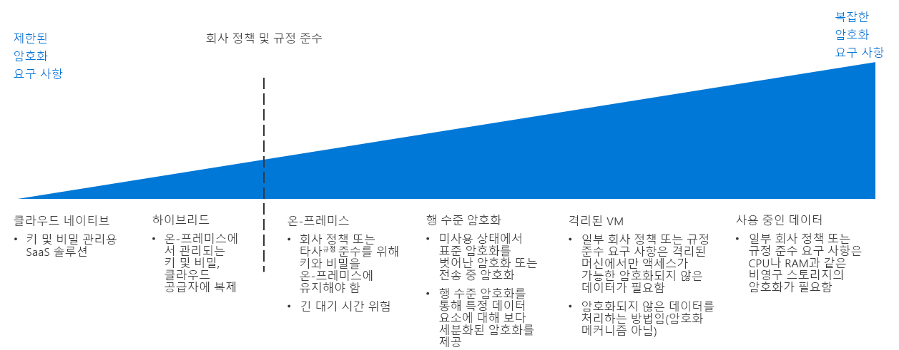

# 암호화 결정 가이드

데이터 암호화는 무단 액세스로부터 데이터를 보호합니다. 올바르게 구현된 암호화 정책은 클라우드 기반 워크로드에 대해 추가 계층 보안 및 조직과 네트워크 내외부의 공격자와 기타 무단 사용자에 대한 보호를 제공합니다.

리소스 암호화가 일반적으로 바람직하지만 암호화는 대기 시간 및 전체 리소스 사용량을 증가시킬 수 있는 비용이 수반됩니다. 까다로운 워크로드의 경우 암호화와 성능 사이의 적절한 균형은 아주 중요합니다.

이동: [키 관리](#key-management) | [데이터 암호화](#data-encryption) | [자세한 정보](#learn-more)

클라우드 암호화 전략을 결정하는 경우의 변곡점은 회사 정책 및 규정 준수 의무에 중점을 둡니다.

다양한 비용 및 복잡성을 사용하여 클라우드 환경에서 암호화를 구현하는 방법은 여러 가지입니다. 회사 정책 및 타사 규정 준수 암호화는 암호화 전략을 계획할 때 가장 중요한 동인입니다. 대부분의 클라우드 기반 솔루션은 미사용이든 전송 중이든 관계 없이 데이터를 암호화하기 위한 표준 메커니즘을 제공합니다. 그러나 표준화된 비밀 및 키 관리, 사용 중인 암호화 또는 데이터 특정 암호화와 같이 엄격한 컨트롤을 요구하는 정책 및 규정 준수 요구 사항의 경우 복잡한 솔루션을 구현해야 할 수 있습니다.

## 키 관리

최신 키 관리 시스템은 HSM(하드웨어 보안 모듈)을 사용하여 키를 저장하는 것을 지원해야 합니다. 따라서 키 관리 시스템은 암호화 키, 중요한 암호, 연결 문자열 및 기타 IT 기밀 정보를 만들고 저장하는 조직의 능력에서 중요한 위치를 차지합니다.

클라우드 마이그레이션을 계획하는 경우 다음 표에서는 안전하고 관리 가능한 클라우드 배포를 만드는 데 있어 중요한 암호화 키, 인증서 및 비밀을 저장 및 관리하는 방법을 설명합니다.

| 질문 | 클라우드 네이티브 | 하이브리드 | 온-프레미스 |
|---------------------------------------------------------------------------------------------------------------------------------------|--------------|--------|-------------|
| 조직에 중앙 집중식 키 및 비밀 관리가 부족하나요?                                                                    | 예          | 아니요     | 아니요          |
| 클라우드에서 이러한 키를 사용하는 동안 디바이스의 키와 비밀 생성을 온-프레미스 하드웨어로 제한해야 하나요? | 아니요           | 예    | 아니요          |
| 조직에는 키 및 비밀을 오프사이트에 저장하는 것을 방지하는 규칙 또는 정책이 정착됐나요?                | 아니요           | 아니요     | 예         |

### 네이티브 클라우드

클라우드 네이티브 키 관리를 사용하여 클라우드 기반 자격 증명 모음에서 모든 키와 비밀을 생성, 관리 및 저장합니다. 이 방법은 키 관리와 관련된 여러 IT 작업을 간소화합니다.

클라우드 네이티브 키 관리 가정: 클라우드 네이티브 키 관리 시스템을 사용하여 다음을 가정합니다.

- 조직의 비밀 및 키를 만들고, 관리하고 호스트하는 클라우드 키 관리 솔루션을 신뢰합니다.
- 암호화 서비스 또는 비밀에 액세스를 사용하여 클라우드 키 관리 시스템에 액세스하는 모든 온-프레미스 애플리케이션 및 서비스를 사용하도록 설정합니다.

### 하이브리드(Bring Your Own Key)

Bring Your Own Key 방식을 사용하여 온-프레미스 환경 내의 전용 HSM 하드웨어에서 키를 생성한 다음, 클라우드 리소스를 사용하기 위해 보안 클라우드 키 관리 시스템에 키를 전송합니다.

하이브리드 키 관리 가정: 하이브리드 키 관리 시스템을 사용하여 다음을 가정합니다.

- 키 및 비밀을 호스트하고 사용하기 위해 클라우드 플랫폼의 기본 보안 및 액세스 제어 인프라를 신뢰합니다.
- 온-프레미스에서 조직의 비밀 및 키의 생성과 관리를 유지하려면 규정 정책 또는 조직 정책이 필요합니다.

### 온-프레미스(사용자 고유의 키 보유)

특정 시나리오에서 공용 클라우드 서비스가 제공하는 키 관리 시스템에 키를 저장할 수 없는 규정, 정책 또는 기술적 이유가 있을 수 있습니다. 이러한 경우, 온-프레미스 하드웨어를 사용하여 키를 유지 관리하고, 클라우드 기반 리소스에서 암호화의 목적으로 이러한 키에 액세스하도록 허용하는 메커니즘을 프로비전해야 합니다. 사용자 고유의 키 보유 방법은 모든 클라우드 서비스와 호환되지 않을 수 있습니다.

온-프레미스 키 관리 가정: 온-프레미스 키 관리 시스템을 사용하여 다음을 가정합니다.

- 온-프레미스에서 조직의 비밀 및 키의 생성, 관리 및 호스팅을 유지하려면 규정 정책 또는 조직 정책이 필요합니다.
- 암호화 서비스 또는 비밀에 액세스를 사용하는 모든 클라우드 키 애플리케이션 또는 서비스는 온-프레미스 키 관리 시스템에 액세스할 수 있습니다.

## 데이터 암호화.

암호화 정책을 계획할 때 고려해야 할 다양한 암호화 요구가 있는 여러 다양한 상태의 데이터가 있습니다.

| 데이터 상태 | Data |
|-----|-----|
| 전송 중 데이터 | 내부 네트워크 트래픽, 인터넷 연결, 데이터 센터 또는 가상 네트워크 간의 연결 |
| 미사용 데이터    | 데이터베이스, 파일, 가상 드라이브, PaaS 스토리지 |
| 사용 중인 데이터     | RAM 또는 CPU 캐시에 로드된 데이터 |

### 전송 중 데이터

전송 중인 데이터란 내부의 리소스 간에, 데이터 센터 또는 외부 네트워크 간에 또는 인터넷을 통해 이동하는 데이터를 말합니다.

전송 중인 데이터 암호화는 일반적으로 트래픽에 SSL/TLS 프로토콜을 요구하여 수행됩니다. 클라우드에서 외부 네트워크 또는 공용 인터넷으로 호스팅되는 리소스 간 전송되는 트래픽은 항상 암호화되어야 합니다. 일반적으로 PaaS 리소스는 기본적으로 트래픽에 SSL/TLS 암호화를 적용합니다. 가상 네트워크 내에서 호스팅되는 IaaS 리소스 간의 트래픽에 암호화를 적용할지 여부는 일반적으로 클라우드 도입 팀 및 워크로드 소유자가 결정하는 것이 좋습니다.

**전송 중 데이터 암호화 가정**. 전송 중 데이터에 적절한 암호화 정책의 구현은 다음을 가정합니다.

- 클라우드 환경에서 공개적으로 액세스할 수 있는 모든 엔드포인트는 SSL/TLS 프로토콜을 사용하여 공용 인터넷과 통신합니다.
- 클라우드 네트워크와 온-프레미스 또는 공용 인터넷을 통해 기타 외부 네트워크를 연결하는 경우 암호화된 VPN 프로토콜을 사용합니다.
- ExpressRoute와 같은 전용 WAN 연결을 사용하여 클라우드 네트워크와 온-프레미스 또는 기타 외부 네트워크를 연결하는 경우 클라우드 네트워크에 배포된 해당 가상 VPN 또는 암호화 어플라이언스와 쌍을 이룬 VPN 또는 기타 암호화 어플라이언스 온-프레미스를 사용합니다.
- 트래픽 로그 또는 IT 직원에게 표시되는 기타 진단 보고서에 포함되지 않아야 하는 중요한 데이터가 있는 경우 가상 네트워크의 리소스 간 모든 트래픽을 암호화합니다.

### 미사용 데이터

미사용 데이터는 파일, 데이터베이스, 가상 머신 드라이브, PaaS 스토리지 계정 또는 비슷한 자산을 포함하여 적극적으로 이동하거나 처리되지 않는 모든 데이터를 말합니다. 저장된 데이터를 암호화하면 외부 네트워크 침입, 악의적인 내부 사용자 또는 실수로 인한 릴리스에서 무단 액세스로부터 가상 디바이스 또는 파일을 보호합니다.

일반적으로 PaaS 스토리지 및 데이터베이스 리소스는 기본적으로 암호화를 적용합니다. 키 관리 시스템에 저장된 암호화 키를 사용하여 가상 디스크 암호화를 통해 IaaS 가상 리소스를 보호할 수 있습니다.

미사용 데이터의 암호화는 또한 열 수준 및 행 수준 암호화와 같은 고급 데이터베이스 암호화 기술을 포함하고, 정확하게 보호되는 데이터에 대한 훨씬 강화된 제어 기능을 제공합니다.

전체 정책 및 규정 준수 요구 사항, 저장되는 데이터의 민감도 및 워크로드의 성능 요구 사항은 암호화가 필요한 자산을 결정해야 합니다.

**미사용 데이터 암호화 가정**. 미사용 데이터 암호화는 다음을 가정합니다.

- 공개 사용으로 계획되지 않은 데이터를 저장합니다.
- 워크로드는 디스크 암호화의 추가된 대기 시간 비용을 수락할 수 있습니다.

### 사용 중인 데이터

사용 중인 데이터의 암호화에는 RAM 또는 CPU 캐시와 같은 비영구 스토리지에서 데이터 보안이 포함됩니다. Intel의 SGX(Secure Guard Extensions)와 같은 Enclave 기술 및 전체 메모리 암호화와 같은 기술을 사용합니다. 또한 안전하고 신뢰할 수 있는 실행 환경을 만드는 데 사용할 수 있는 준동형 암호화와 같은 암호화 기술도 포함됩니다.

**사용 중인 데이터 암호화 가정**. 사용 중인 데이터 암호화는 다음을 가정합니다.

- RAM 및 CPU 수준에서 언제든 기본 클라우드 플랫폼과 별도로 데이터 소유권을 유지 관리할 필요가 있습니다.

## 자세한 정보

Azure 플랫폼에서 암호화 및 키 관리에 대한 자세한 내용은 다음을 참조하세요.

- [Azure 암호화 개요](/azure/security/security-azure-encryption-overview). Azure에서 미사용 데이터와 전송 중인 데이터 모두를 보안 조치하기 위해 암호화를 사용하는 방법에 대한 자세한 설명입니다.
- [Azure Key Vault](/azure/key-vault/key-vault-overview) Key Vault는 Azure 내에 암호화 키, 비밀 및 인증서를 저장하고 관리하기 위한 기본 키 관리 시스템입니다.
- [Azure의 기밀 컴퓨팅](/solutions/confidential-compute). Azure의 기밀 컴퓨팅 이니셔티브는 신뢰할 수 있는 실행 환경을 만드는 도구 및 기술 또는 사용 중인 데이터를 보호하는 기타 암호화 메커니즘을 제공합니다.

## 다음 단계

소프트웨어 정의 네트워크에서 클라우드 배포를 위해 가상화된 네트워킹 기능을 제공하는 방법을 알아봅니다.

> [!div class="nextstepaction"]
> [어떤 소프트웨어 정의 네트워크 패턴이 내 배포에 가장 적합한가요?](../software-defined-network/overview.md)
