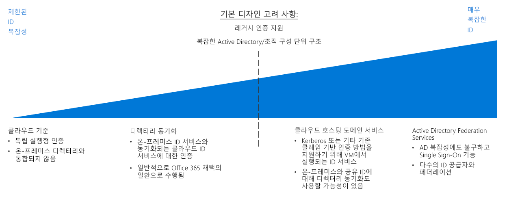

# ID 의사 결정 가이드

온-프레미스, 하이브리드 또는 클라우드 전용의 모든 환경에서 IT는 리소스에 액세스할 수 있는 관리자, 사용자 및 그룹을 제어해야 합니다. IAM(ID 및 액세스 관리) 서비스를 사용하면 클라우드에서 액세스 제어를 관리할 수 있습니다.

이동: [ID 통합 요구 사항 확인](#determine-identity-integration-requirements) | [클라우드 네이티브](#cloud-baseline) | [디렉터리 동기화](#directory-synchronization) | [클라우드 호스팅 도메인 서비스](#cloud-hosted-domain-services) | [Active Directory Federation Services](#active-directory-federation-services) | [진화하는 ID 통합](#evolving-identity-integration) | [자세한 정보](#learn-more)

클라우드 환경에서 다양한 비용과 복잡성에 따라 여러 가지 방식으로 ID를 관리할 수 있습니다. 클라우드 기반 ID 서비스를 구성하는 주요 요소는 기존 온-프레미스 ID 인프라와의 통합에 요구되는 수준입니다.

클라우드 기반 SaaS(Software as a Service) ID 솔루션은 클라우드 리소스에 대한 기본 수준의 액세스 제어 및 ID 관리를 제공합니다. 그러나 조직의 AD(Active Directory) 인프라에 복잡한 포리스트 구조 또는 사용자 지정 OU(조직 구성 단위)가 있는 경우, 클라우드 기반 워크로드에서 온-프레미스 환경과 클라우드 환경 간의 일관된 ID, 그룹 및 역할 세트에 대한 디렉터리를 클라우드로 복제하도록 요구할 수 있습니다. 글로벌 솔루션에 디렉터리 복제가 필요한 경우 복잡성이 크게 증가할 수 있습니다. 또한 레거시 인증 메커니즘에 종속된 애플리케이션을 지원하려면 도메인 서비스를 클라우드에 배포해야 할 수도 있습니다.

## ID 통합 요구 사항 확인

| 질문 | 클라우드 기준 | 디렉터리 동기화 | 클라우드 호스팅 도메인 서비스 | AD Federation Services |
|------|------|------|------|------|
| 현재 온-프레미스 디렉터리 서비스가 부족합니까? | 예 | 아니요 | 아니요 | 아니요 |
| 워크로드가 온-프레미스 ID 서비스에 대해 인증해야 합니까? | 아니요 | 예 | 아니요 | 아니요 |
| 워크로드가 Kerberos 또는 NTLM과 같은 레거시 인증 메커니즘에 종속되어 있습니까? | 아니요 | 아니요 | 예 | 아니요 |
| 클라우드와 온-프레미스 ID 서비스 간에 통합할 수 없습니까? | 아니요 | 아니요 | 예 | 아니요 |
| 여러 ID 공급자에 대해 Single Sign-On이 필요합니까? | 아니요 | 아니요 | 아니요 | 예 |

Azure로 마이그레이션 계획의 일환으로 기존 ID 관리와 클라우드 ID 서비스를 가장 효율적으로 통합하는 방법을 결정해야 합니다. 일반적인 통합 시나리오는 다음과 같습니다.

### 클라우드 기준

공용 클라우드 플랫폼은 관리 기능에 대한 액세스 권한을 사용자 및 그룹에 부여하는 기본 IAM 시스템을 제공합니다. 중요한 온-프레미스 ID 솔루션이 조직에 없고 클라우드 기반 인증 메커니즘과 호환되도록 워크로드를 마이그레이션하려면 클라우드 네이티브 ID 서비스를 사용하여 ID 인프라를 구축해야 합니다.

**클라우드 기준 가정**. 순수 클라우드 전용 ID 인프라는 다음을 전제로 하여 사용합니다.

- 클라우드 기반 리소스는 온-프레미스 디렉터리 서비스 또는 Active Directory 서버에 종속되지 않으며, 이러한 종속성을 제거하기 위해 워크로드를 수정할 수 있습니다.
- 마이그레이션되는 애플리케이션 또는 서비스 워크로드는 클라우드 ID 공급자와 호환되는 인증 메커니즘을 지원하거나 이를 지원하도록 쉽게 수정할 수 있습니다. 클라우드 네이티브 ID 공급자는 SAML, OAuth 및 OpenID Connect와 같은 인터넷 준비 인증 메커니즘을 사용합니다. Kerberos 또는 NTLM과 같은 프로토콜을 사용하는 레거시 인증 방법에 종속된 기존 워크로드는 클라우드로 마이그레이션하기 전에 리팩터링해야 할 수 있습니다.

> [!TIP]
> 대부분의 클라우드 네이티브 ID 서비스는 기존 온-프레미스 디렉터리를 완전히 대체하지 않습니다. 추가 도구 또는 서비스를 사용하지 않으면 컴퓨터 관리 또는 그룹 정책과 같은 디렉터리 기능을 사용할 수 없습니다.

ID 서비스를 클라우드 기반 공급자로 완전히 마이그레이션하면 사용자 고유의 ID 인프라를 유지 관리할 필요가 없으므로 IT 관리가 크게 간소화됩니다.

### 디렉터리 동기화

기존 ID 인프라를 있는 조직의 경우 디렉터리 동기화는 기존 사용자 및 액세스 관리를 유지하면서 클라우드 리소스 관리에 필요한 IAM 기능을 제공하는 데 가장 적합한 솔루션입니다. 이 프로세스는 클라우드 환경과 온-프레미스 환경 간에 디렉터리 정보를 지속적으로 복제하여 사용자에 대한 SSO(Single Sign-On)와 조직 전체에서 일관된 ID, 역할 및 권한 시스템을 허용합니다.

참고: Office 365를 채택한 조직에서는 이미 자체의 온-프레미스 Active Directory 인프라와 Azure Active Directory 간에 [디렉터리 동기화](/office365/enterprise/set-up-directory-synchronization)를 구현했을 수 있습니다.

**디렉터리 동기화 가정**. 동기화된 ID 솔루션은 다음을 전제로 하여 사용합니다.

- 클라우드 및 온-프레미스 IT 인프라 전반에 걸쳐 공통된 사용자 계정 및 그룹 세트를 유지해야 합니다.
- 온-프레미스 ID 서비스는 클라우드 ID 공급자를 통한 복제를 지원합니다.
- 클라우드 및 온-프레미스 ID 공급자에 액세스하는 사용자에 대한 SSO 메커니즘이 필요합니다.

> [!TIP]
> Azure AD와 같은 클라우드 기반 ID 서비스에서 지원되지 않는 레거시 인증 메커니즘을 사용하는 클라우드 기반 워크로드는 여전히 이러한 서비스를 제공하는 클라우드 환경의 온-프레미스 도메인 서비스 또는 가상 서버에 연결해야 합니다. 또한 온-프레미스 ID 서비스를 사용하면 클라우드와 온-프레미스 네트워크 간의 연결에 대한 종속성도 도입됩니다.

### 클라우드 호스팅 도메인 서비스

Kerberos 또는 NTLM과 같은 레거시 프로토콜을 통해 클레임 기반 인증을 사용하는 워크로드가 있고 SAML, OAuth 및 OpenID Connect와 같은 최신 인증 프로토콜을 허용하도록 이러한 워크로드를 리팩터링할 수 없는 경우, 클라우드 배포의 일환으로 도메인 서비스 중 일부를 클라우드로 마이그레이션해야 할 수 있습니다.

이러한 유형의 배포에서는 Active Directory를 실행하는 가상 머신을 클라우드 기반 가상 네트워크에 배포하여 도메인 서비스를 클라우드의 리소스에 제공해야 합니다. 클라우드 네트워크로 마이그레이션하는 기존 애플리케이션 및 서비스는 약간의 수정만으로 이러한 클라우드 호스팅 디렉터리 서버를 사용할 수 있어야 합니다.

기존 디렉터리 및 도메인 서비스는 온-프레미스 환경에서 계속 사용될 가능성이 높습니다. 이 시나리오에서는 디렉터리 동기화도 사용하여 클라우드 환경과 온-프레미스 환경 모두에서 공통된 사용자 및 역할 세트를 제공하는 것이 좋습니다.

**클라우드 호스팅 도메인 서비스 가정**. 디렉터리 마이그레이션은 다음을 전제로 하여 수행합니다.

- 워크로드는 Kerberos 또는 NTLM과 같은 프로토콜을 사용하는 클레임 기반 인증에 따라 달라집니다.
- 워크로드 가상 머신은 Active Directory 그룹 정책을 관리하거나 적용하기 위해 도메인에 조인해야 합니다.

> [!TIP]
> 디렉터리 마이그레이션과 클라우드 호스팅 도메인 서비스를 결합하면 기존 워크로드를 마이그레이션할 때 뛰어난 유연성을 제공하지만, 이러한 서비스를 제공하기 위해 클라우드 가상 네트워크 내에서 가상 머신을 호스팅하면 IT 관리 작업의 복잡성이 높아집니다. 클라우드 마이그레이션 환경이 완성되면 이러한 서버를 호스팅하는 데 필요한 장기 유지 관리 요구 사항을 검토하세요. Azure Active Directory와 같은 클라우드 ID 공급자와의 호환성을 위해 기존 워크로드를 리팩터링하면 이러한 클라우드 호스팅 서버에 대한 필요성을 줄일 수 있는지 여부를 고려해야 합니다.

### Active Directory Federation Services

ID 페더레이션은 공통 인증 및 권한 부여 기능을 허용하기 위해 여러 ID 관리 시스템 간에 트러스트 관계를 설정합니다. 그런 다음, 조직 내의 여러 도메인 또는 고객 또는 비즈니스 파트너가 관리하는 ID 시스템에서 Single Sign-On 기능을 지원할 수 있습니다.

Azure AD는 [AD FS(Active Directory Federation Services)](/azure/active-directory/hybrid/how-to-connect-fed-whatis)를 사용하여 온-프레미스 Active Directory 도메인의 페더레이션을 지원합니다. Azure에서 이 서비스를 구현하는 방법을 알아보려면 [Azure로 AD FS 확장](../../../reference-architectures/identity/adfs.md) 참조 아키텍처를 참조하세요.

## 진화하는 ID 통합

ID 통합은 반복적인 프로세스입니다. 초기 배포를 위해 소수의 사용자 및 해당 역할 세트를 사용하여 클라우드 네이티브 솔루션으로 시작할 수 있습니다. 마이그레이션이 완성되면 페더레이션된 모델을 채택하거나 온-프레미스 ID 서비스의 전체 디렉터리를 클라우드로 마이그레이션하는 것이 좋습니다. 마이그레이션 프로세스를 반복할 때마다 ID 전략을 다시 확인합니다.

## 자세한 정보

Azure 플랫폼의 ID 서비스에 대한 자세한 내용은 다음을 참조하세요.

- [Azure AD](https://azure.microsoft.com/services/active-directory). Azure AD는 클라우드 기반 ID 서비스를 제공합니다. 이를 통해 Azure 리소스에 대한 액세스를 관리하고, ID 관리, 디바이스 등록, 사용자 프로비전, 애플리케이션 액세스 제어 및 데이터 보호를 제어할 수 있습니다.
- [Azure AD Connect](/azure/active-directory/hybrid/whatis-hybrid-identity). Azure AD Connect 도구를 사용하면 Azure AD 인스턴스를 기존 ID 관리 솔루션과 연결하여 클라우드에서 기존 디렉터리를 동기화할 수 있습니다.
- [RBAC(역할 기반 액세스 제어)](/azure/role-based-access-control/overview). Azure AD는 관리 평면의 리소스에 대한 액세스를 효율적이고 안전하게 관리할 수 있는 RBAC를 제공합니다. 작업과 책임은 역할에 구성되며, 사용자는 이러한 역할에 할당됩니다. RBAC를 사용하면 리소스에 액세스할 수 있는 사용자와 해당 리소스에서 수행할 수 있는 작업을 제어할 수 있습니다.
- [Azure AD PIM(Privileged Identity Management)](/azure/active-directory/privileged-identity-management/pim-configure). PIM은 리소스 액세스 권한의 노출 시간을 줄이고, 보고서와 경고를 통해 해당 권한의 사용에 대한 가시성을 높입니다. 사용자가 JIT("Just-In-Time") 권한을 사용하거나 더 짧은 기간 동안 권한을 할당하여 이 기간이 지나면 해당 권한이 자동으로 철회되도록 제한합니다.
- [Azure Active Directory와 온-프레미스 Active Directory 도메인 통합](../../../reference-architectures/identity/azure-ad.md). 이 참조 아키텍처는 온-프레미스 Active Directory 도메인과 Azure AD 간의 디렉터리 동기화 예제를 제공합니다.
- [AD DS(Active Directory Domain Services)를 Azure로 확장.](../../../reference-architectures/identity/adds-extend-domain.md) 이 참조 아키텍처는 AD DS 서버를 배포하여 도메인 서비스를 클라우드 기반 리소스로 확장하는 예제를 제공합니다.
- [Azure로 AD FS(Active Directory Federation Services) 확장](../../../reference-architectures/identity/adfs.md). 이 참조 아키텍처는 Azure AD 디렉터리를 사용하여 페더레이션 인증 및 권한 부여를 수행하도록 AD FS(Active Directory Federation Services)를 구성합니다.

## 다음 단계

클라우드에서 정책 적용을 구현하는 방법에 대해 알아봅니다.

> [!div class="nextstepaction"]
> [정책 적용](../policy-enforcement/overview.md)
