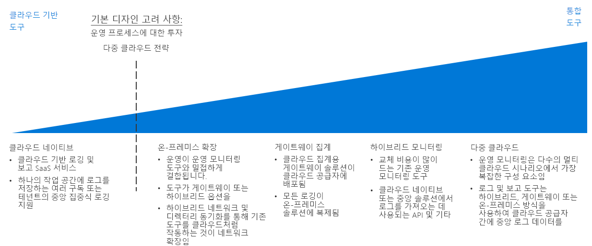

# 로깅 및 보고 의사 결정 가이드

모든 조직은 성능, 가동 시간 및 보안 문제가 심각한 문제로 발전하기 전에 이를 IT 팀에 알릴 수 있는 메커니즘이 필요합니다. 성공적인 모니터링 전략을 사용하면 워크로드 및 네트워킹 인프라를 구성하는 개별 구성 요소의 작동 방식을 이해할 수 있습니다. 공용 클라우드 마이그레이션의 컨텍스트 내에서, 조직이 가동 시간, 보안 및 정책 규정 준수 목표를 충족하려면 해당 IT 담당자에게 중요한 이벤트와 메트릭을 공개하면서 로깅 및 보고 작업을 기존의 모니터링 시스템에 통합하는 것이 중요합니다.

이동: [모니터링 인프라 계획](#planning-your-monitoring-infrastructure) | [클라우드 관련](#cloud-native) | [온-프레미스 확장](#on-premises-extension) | [게이트웨이 집계](#gateway-aggregation) | [하이브리드 모니터링(온-프레미스)](#hybrid-monitoring-on-premises) | [하이브리드 모니터링(클라우드 기반)](#hybrid-monitoring-cloud-based) | [다중 클라우드](#multi-cloud) | [자세한 정보](#learn-more)

클라우드 ID 전략을 결정할 때 조직이 운영 프로세스에서 진행해온 기존 투자가 많은 영향을 미치게 되며, 다중 클라우드 전략을 지원할 때 필요한 요구 사항도 어느 정도 고려됩니다.

클라우드에서 작업을 로깅하고 보고하는 방법은 다양합니다. 클라우드 네이티브 및 중앙 집중식 로깅은 구독 디자인과 구독 수에 따른 두 가지 일반적인 SaaS(Software as a Service) 옵션입니다.

## 모니터링 인프라 계획

배포를 계획하는 경우 로깅 데이터가 저장되는 위치와 클라우드 기반 보고 및 모니터링 서비스를 기존 프로세스 및 도구와 통합하는 방법을 고려해야 합니다.

| 질문 | 네이티브 클라우드 | 온-프레미스 확장 | 하이브리드 모니터링 | 게이트웨이 집계 |
|-----|-----|-----|-----|-----|
| 기존의 온-프레미스 모니터링 인프라를 보유하고 있나요? | 아니요 | 예 | 예 |  아니요 |
| 로그 데이터가 외부 스토리지 위치에 저장되지 않도록 해야 할 필요가 있나요? | 아니요 | 예 | 아니요 | 아니요 |
| 온-프레미스 시스템과 클라우드 모니터링을 통합해야 하나요? | 아니요 | 아니요 | 예 | 아니요 |
원격 분석 데이터를 모니터링 시스템에 제출하기 전에 처리하거나 필터링해야 하나요? | 아니요 | 아니요 | 아니요 | 예 |

### 네이티브 클라우드

현재, 조직에 설정된 로깅 및 보고 시스템이 없거나 계획된 클라우드 배포를 기존의 온-프레미스 또는 기타 외부 모니터링 시스템과 통합할 필요가 없으면 클라우드 네이티브 SaaS 솔루션이 가장 간편한 선택지입니다.

이 시나리오에서는 정보를 처리하고 IT 직원에게 제공하는 로깅 및 보고 도구를 클라우드 플랫폼의 일부로 제공하면서, 로그 데이터를 워크로드와 동일한 클라우드 환경에 기록 및 저장합니다.

클라우드 네이티브 로깅 솔루션을 보다 규모가 작거나 실험적인 배포를 위해 구독 또는 워크로드별로 임시로 구현할 수 있으며, 전체 클라우드 자산에서 중앙 집중식으로 로그 데이터를 모니터링하도록 구성합니다.

**클라우드 네이티브 가정**. 클라우드 네이티브 로깅 및 보고 시스템을 사용할 때는 다음을 전제로 작업합니다.

- 클라우드 워크로드의 로그 데이터를 기존의 온-프레미스 시스템에 통합할 필요가 없습니다.
- 온-프레미스 시스템을 모니터링할 때는 클라우드 기반 보고 시스템을 사용하지 않습니다.

### 온-프레미스 확장

하이브리드 로깅 및 보고를 지원하지 않는 온-프레미스 시스템에 클라우드 원격 분석을 통합해야 하거나, 최소한의 재개발로 애플리케이션 및 서비스를 마이그레이션해야 하는 경우에는 로그 데이터를 클라우드 환경에 저장하지 않고 온-프레미스 시스템으로 직접 보내는 모니터링 에이전트를 VM에 배포해야 합니다.

이 방법을 지원하기 위해서는 클라우드 리소스가 [하이브리드 네트워킹](../software-defined-network/hybrid.md) 및 [클라우드 호스티드 도메인 서비스](../identity/overview.md#cloud-hosted-domain-services) 조합을 통해 온-프레미스 시스템과 직접 통신할 수 있어야 합니다. 이 부분이 구현되면 클라우드 가상 네트워크는 온-프레미스 환경의 네트워크 확장으로 작동합니다. 따라서 클라우드 호스티드 워크로드는 온-프레미스 로깅 및 보고 시스템과 직접 통신할 수 있습니다.

이 방법은 클라우드에서 배포된 애플리케이션 또는 서비스를 제한적으로만 수정하면서 기존 투자를 모니터링 도구로 집중합니다. 이 방식이 리프트 앤 시프트 마이그레이션 동안 모니터링을 지원하는 가장 빠른 방법이기도 합니다. 그러나 이 방법은 클라우드 기반 SaaS 및 PaaS 리소스에서 생성된 로그 데이터를 캡처하지 않고, VM 상태와 같이 클라우드 플랫폼 자체에서 생성한 VM 관련 로그는 모두 생략합니다. 따라서 이 패턴은 보다 포괄적인 하이브리드 모니터링 솔루션이 구현될 때까지 임시로만 사용하는 것이 좋습니다.

온-프레미스 전용 가정:

- 기술 요구 사항이 지원되고 규정 또는 정책 요구 사항이 있을 때만 로그 데이터를 온-프레미스 환경에서 유지 관리해야 합니다.
- 온-프레미스 시스템은 하이브리드 로깅 및 보고 방식이나 게이트웨이 집계 솔루션을 지원하지 않습니다.
- 클라우드 기반 애플리케이션을 통해 원격 분석을 온-프레미스 로깅 시스템으로 직접 제출하거나, 온-프레미스로 제출하는 모니터링 에이전트를 워크로드 VM에 배포할 수 있습니다.
- 사용자 워크로드는 클라우드 기반 로깅 및 보고가 필요한 PaaS 또는 SaaS 서비스를 사용하지 않습니다.

### 게이트웨이 집계

클라우드 기반 원격 분석 데이터 양이 매우 많거나, 처리를 위해 먼저 기존의 온-프레미스 모니터링 시스템에서 로그 데이터를 수정해야 할 경우, 로그 데이터 [게이트웨이 집계](../../../patterns/gateway-aggregation.md) 서비스가 필요할 수 있습니다.

게이트웨이 서비스는 클라우드 공급자에게 배포됩니다. 그런 후, 원격 분석 데이터를 기본 로깅 시스템 대신 게이트웨이로 전송하도록 관련 애플리케이션 및 서비스가 구성됩니다. 그러면 게이트웨이는 수집 및 분석을 위해 모니터링 서비스로 제출하기 전에 집계, 조합 또는 서식 지정과 같은 데이터 처리를 수행할 수 있습니다.

또한 게이트웨이를 사용하여 클라우드 기본 또는 하이브리드 시스템용으로 바인딩된 원격 분석 데이터를 집계하고 전처리할 수 있습니다.

게이트웨이 집계 가정:

- 클라우드 기반 애플리케이션 또는 서비스에서 매우 높은 수준의 원격 분석 데이터를 얻을 것으로 예상합니다.
- 원격 분석 데이터를 모니터링 시스템에 제출하기 전에 먼저 서식을 지정하거나 최적화해야 합니다.
- 모니터링 시스템에는 게이트웨이에서 로그 데이터를 처리한 후에 해당 데이터를 수집하는 데 사용할 수 있는 API 또는 기타 메커니즘이 있습니다.

### 하이브리드 모니터링(온-프레미스)

하이브리드 모니터링 솔루션은 온-프레미스 및 클라우드 리소스의 로그 데이터를 통합하여 IT 자산의 운영 상태에 대한 통합된 보기를 제공합니다.

온-프레미스 모니터링 시스템에 바꾸기 어렵거나 바꿀 때 비용이 많이 드는 기존 투자가 있는 경우 클라우드 워크로드의 원격 분석을 기존의 온-프레미스 모니터링 솔루션에 통합해야 할 수 있습니다. 하이브리드 온-프레미스 모니터링 시스템에서 온-프레미스 원격 분석 데이터는 기존의 온-프레미스 모니터링 시스템을 계속 사용합니다. 클라우드 기반 원격 분석 데이터는 클라우드 모니터링 시스템으로 직접 전송되거나, 워크로드와 함께 클라우드에 저장되고 정리된 후 정기적으로 온-프레미스 시스템으로 수집됩니다.

**온-프레미스 하이브리드 모니터링 가정** 하이브리드 모니터링을 위해 온-프레미스 로깅 및 보고 시스템을 사용할 때는 다음과 같이 가정합니다.

- 기존 온-프레미스 보고 시스템을 사용하여 클라우드 워크로드를 모니터링해야 합니다.
- 로그 데이터의 소유권을 온-프레미스에서 유지 관리해야 합니다.
- 온-프레미스 관리 시스템에는 클라우드 기반 시스템에서 로그 데이터를 수집하는 데 사용할 수 있는 API 또는 기타 메커니즘이 있습니다.

> [!TIP]
> 클라우드 마이그레이션이 반복적으로 진행되므로, 고유 클라우드 네이티브 및 온-프레미스 모니터링에서 부분적인 하이브리드 방식으로 전환되기 쉽습니다. 모니터링 아키텍처를 전반적인 IT 및 운영 프로세스에 맞춰 계속 변경해야 합니다.

### 하이브리드 모니터링(클라우드 기반)

온-프레미스 모니터링 시스템을 반드시 유지해야 할 필요가 없거나 온-프레미스 모니터링 시스템을 SaaS 솔루션과 바꾸어야 할 경우, 온-프레미스 로그 데이터를 중앙 집중식 클라우드 기반 모니터링 시스템에 통합하도록 선택할 수도 있습니다.

온-프레미스 중심 방식을 반영하는 이 시나리오의 클라우드 워크로드는 해당 기본 클라우드 로깅 메커니즘을 사용하며, 온-프레미스 애플리케이션 및 서비스는 클라우드 기반 로깅 시스템에 원격 분석 디렉터리를 전송하거나 정기적으로 클라우드 시스템으로 수집하기 위해 해당 데이터를 집계합니다. 이와 같이 클라우드 기반 모니터링 시스템을 전체 IT 자산에 대한 기본 모니터링 및 보고 시스템으로 사용할 수 있습니다.

클라우드 기반 하이브리드 모니터링 가정: 하이브리드 모니터링을 위해 클라우드 기반 로깅 및 보고 시스템을 사용할 때는 다음과 같이 가정합니다.

- 기존의 온-프레미스 모니터링 시스템을 사용할 필요는 없습니다.
- 워크로드에 로그 데이터를 온-프레미스에 저장해야 한다는 규제 또는 정책 요구 사항이 없습니다.
- 클라우드 기반 모니터링 시스템에는 온-프레미스 애플리케이션 및 서비스에서 로그 데이터를 수집하는 데 사용할 수 있는 API 또는 기타 메커니즘이 있습니다.

### 다중 클라우드

여러 클라우드 플랫폼 간에 로깅 및 보고 기능을 통합하는 작업은 복잡할 수 있습니다. 플랫폼 간에 제공되는 서비스는 직접 비교할 수 없는 경우가 많으며, 이러한 서비스에서 제공하는 로깅 및 원격 분석 기능도 다릅니다.
다중 클라우드 로깅을 지원하려면 종종 하이브리드 로깅 솔루션에 데이터를 제출하기 전에 게이트웨이 서비스를 사용하여 로그 데이터를 일반적인 형식으로 처리해야 합니다.

## 자세한 정보

[Azure Monitor](/azure/azure-monitor/overview)는 Azure의 기본 보고 및 모니터링 서비스입니다. 다음과 같은 것을 제공합니다.

- 앱 원격 분석, 호스트 원격 분석(예: VM), 컨테이너 메트릭, Azure 플랫폼 메트릭 및 이벤트 로그를 수집하기 위한 통합 플랫폼
- 시각화, 쿼리, 경고 및 분석 도구. 가상 머신, 게스트 운영 체제, 가상 네트워크 및 워크로드 애플리케이션 이벤트에 대한 인사이트를 제공할 수 있습니다.
- 외부 서비스와 통합하고 모니터링 및 경고 서비스를 자동화하기 위한 [REST API](/azure/monitoring-and-diagnostics/monitoring-rest-api-walkthrough)
- 널리 사용되는 많은 타 공급업체 제품과의 [통합](/azure/monitoring-and-diagnostics/monitoring-partners)
