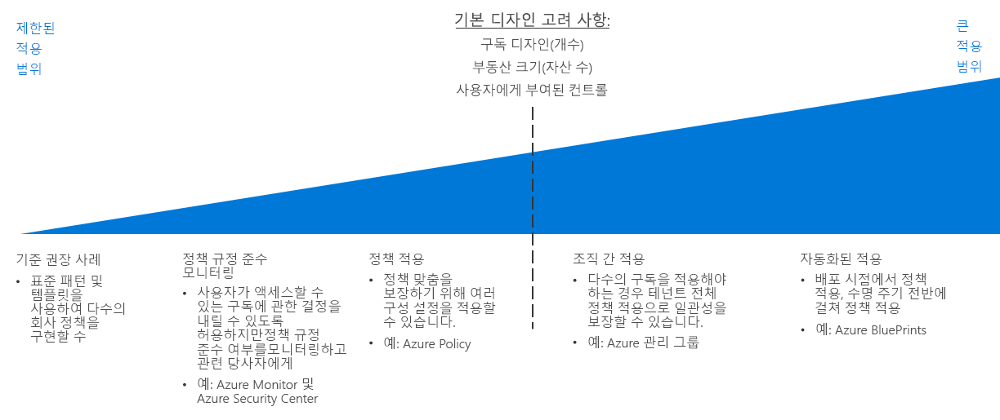

# 정책 적용 의사 결정 가이드

정책을 조직 전체에 적용하는 방법이 없으면 조직 정책을 정의하더라도 큰 효과를 기대할 수 없습니다. 클라우드 마이그레이션을 계획하는 데 있어서 핵심은 클라우드 플랫폼에서 제공하는 도구를 기존 IT 프로세스와 최대한 잘 결합하여 클라우드 자산 전체에서 정책 규정을 최대한 준수하게 만드는 것입니다.

이동: [기준 권장 사례](#baseline-recommended-practices) | [정책 준수 모니터링](#policy-compliance-monitoring) | [정책 적용](#policy-enforcement) | [조직 간 정책](#cross-organization-policy) | [적용 자동화](#automated-enforcement)

클라우드 자산이 증가하면 더 커진 리소스, 구독 및 테넌트 배열에 걸쳐 정책을 유지하고 적용해야 하는 과제에 직면하게 됩니다. 자산 규모가 클수록 지속적으로 정책을 준수하고 정책 위반을 신속하게 탐지할 수 있도록 보다 복잡한 적용 메커니즘이 필요합니다. 플랫폼이 리소스 또는 구독 수준에서 제공하는 정책 적용 메커니즘은 일반적으로 소규모 클라우드 배포에는 충분하지만, 대규모 배포 시에는 배포 표준, 리소스 그룹화 및 조직, 정책 적용과 로깅 및 보고 시스템의 통합을 제공하는 보다 정교한 메커니즘을 활용해야 합니다.

정책 적용 전략의 복잡성을 선택할 때 핵심 변곡점은 주로 [구독 디자인](../subscriptions/overview.md)에 필요한 구독 또는 테넌트 수에 집중됩니다. 클라우드 자산 내의 다양한 사용자 역할에 부여되는 제어 권한의 크기도 이러한 의사 결정에 영향을 미칠 수 있습니다.

## 기준 권장 사례

단일 구독 및 간단한 클라우드 배포의 경우 대부분의 클라우드 플랫폼에 기본적으로 제공되는 기능을 사용하여 여러 회사 정책을 적용할 수 있습니다. 이처럼 배포 복잡성이 비교적 낮은 수준에서도 CAF [의사 결정 가이드](../overview.md) 전체에서 설명한 것처럼 일관적인 패턴을 사용한다면 기본 수준의 정책 준수를 수립하는 데 도움이 됩니다.

예: 

- [배포 템플릿](../resource-consistency/overview.md)은 표준화된 구조 및 구성을 리소스에 프로비저닝할 수 있습니다.
- [태그 지정 및 이름 지정 표준](../resource-tagging/overview.md)은 작업을 구성하고 회계 및 비즈니스 요구 사항을 지원하는 데 도움이 됩니다.
- [소프트웨어 정의 네트워킹](../software-defined-network/overview.md)을 통해 트래픽 관리 및 네트워킹 제한을 구현할 수 있습니다.
- [역할 기반 액세스 제어](../identity/overview.md)로 클라우드 리소스를 보호하고 격리할 수 있습니다.

이 가이드 전체에서 설명한 표준 패턴을 적용하면 조직의 요구 사항을 충족하는 데 어떤 도움이 되는지 검사하여 클라우드 정책 적용 계획을 시작하세요.

## 정책 준수 모니터링

또 다른 핵심 요소는 클라우드 기반 애플리케이션 및 서비스가 조직 정책을 준수하는지 확인하고, 리소스가 정책을 준수하지 않는 것으로 확인되면 담당자에게 신속하게 그 사실을 알리는 기능이며, 이는 비교적 작은 클라우드 배포에도 해당합니다. 클라우드 워크로드의 규정 준수 상태를 효과적으로 [로깅 및 보고](../log-and-report/overview.md)하는 것은 회사 정책 적용 전략에서 매우 중요한 부분입니다.

클라우드 자산이 증가하면 [Azure Security Center](/azure/security-center/) 같은 추가 도구에서 통합 보안 및 위협 탐지를 제공할 수 있으며, 중앙 집중식 정책 관리를 적용하여 온-프레미스 자산과 클라우드 자산 모두에 대한 경고를 제공할 수 있습니다.

## 정책 적용

또한 정책의 적합성을 유지할 수 있도록 구독 수준에서 구성 설정 및 리소스 생성 규칙을 적용할 수 있습니다.

[Azure Policy](/azure/governance/policy/overview)는 정책을 만들고, 할당하고, 관리하는 데 사용되는 Azure 서비스입니다. 이러한 정책은 리소스에 대해 다양한 규칙과 효과를 적용하여 리소스를 회사 표준 및 서비스 수준 계약을 준수하는 상태로 유지합니다. Azure Policy는 리소스를 평가하여 할당된 정책을 준수하지 않는 리소스를 찾습니다. 예를 들어 환경 내 가상 머신의 SKU 크기를 제한하려고 합니다. 해당 정책이 구현되면 새 리소스와 기존 리소스의 규정 준수를 평가합니다. 올바른 정책을 적용하여 기존 리소스가 다시 규정을 준수하도록 만들 수 있습니다.

## 조직 간 정책

클라우드 자산이 점점 커지면서 여러 구독에 정책을 적용해야 하는 경우 정책 일관성을 보장할 수 있도록 테넌트 수준의 적용 전략에 집중해야 합니다.

[구독 디자인](../subscriptions/overview.md)에서는 조직 구조와 관련된 정책을 고려해야 합니다. 구독 디자인 내부의 복잡한 구성을 지원하는 것 외에도, [Azure 관리 그룹](../subscriptions/overview.md#management-groups)을 사용하여 여러 구독에 걸쳐 Azure Policy 규칙을 할당할 수 있습니다.

## 적용 자동화

표준화된 배포 템플릿은 소규모 배포에 효과적인 반면, [Azure Blueprints](/azure/governance/blueprints/overview)는 Azure 솔루션의 프로비전 및 오케스트레이션을 표준화하여 대규모로 수행할 수 있습니다. 만들어진 리소스에 일관적인 정책 설정을 사용하여 워크로드를 여러 구독에 배포할 수 있습니다.

클라우드 리소스와 온-프레미스 리소스를 통합하는 IT 환경의 경우 로깅 및 보고 시스템을 사용하여 하이브리드 모니터링 기능을 제공해야 할 수도 있습니다. 타사 또는 사용자 지정 작업 모니터링 시스템에서 추가 정책 적용 기능을 제공할 수도 있습니다. 복잡한 클라우드 자산의 경우 이러한 시스템을 클라우드 자산과 통합하는 가장 적합한 방법을 고려해야 합니다.

## 다음 단계

구독 디자인 및 거버넌스 목표를 지원하기 위해 리소스 일관성을 사용하여 클라우드 배포를 구성 및 표준화하는 방법을 알아봅니다.

> [!div class="nextstepaction"]
> [리소스 일관성](../resource-consistency/overview.md)
