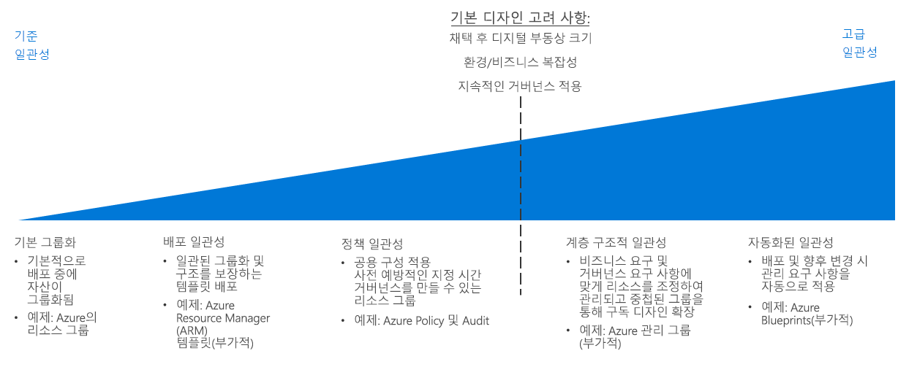

# CAF: 리소스 일관성 관련 결정 가이드

Azure [구독 디자인](../subscriptions/overview.md) 조직의 구조, 회계 사례 및 워크 로드 요구 사항을 기준으로 클라우드 자산을 구성 하는 방법을 정의 합니다. 이 수준의 구조 외에도 클라우드 자산에 걸쳐 조직 거 버 넌 스 정책 요구 사항을 해결 일관 되 게 구성, 배포 및 구독 내에서 리소스를 관리 하는 기능을 필요 합니다.

이동: [기본 그룹](#basic-grouping) | [배포 일관성](#deployment-consistency) | [정책 일관성](#policy-consistency) | [계층적 일관성](#hierarchical-consistency) | [자동화된 일관성](#automated-consistency)

이러한 요인에 따라 클라우드 자산의 리소스에 대 한 일관성 요구 사항 수준에 대 한 의사 결정은 주로: 마이그레이션 후 디지털 자산 크기, 비즈니스 또는 기존 구독 내에서 명확 하 게 맞지는 환경 요구 사항 디자인 방법 또는 리소스를 배포한 후에 시간이 지남에 따라 거 버 넌 스를 적용 해야 합니다. 

이러한 요인은 중요도 커질수록 일관 된 배포, 그룹화 및 클라우드 기반 리소스를 관리 확인의 이점을 더욱 커지고 있습니다. 자동화, 도구 및 일관성 적용에 소요 된 더 많은 노력이 필요 더 많은 고급 수준의 증가 요구 사항을 충족 하도록 리소스 일관성을 달성 하 고이 인해 추적 및 변경 관리에 소요 되는 더 많은 시간입니다.

## 기본 그룹

Azure에서 [리소스 그룹](/azure/azure-resource-manager/resource-group-overview#resource-groups)은 구독 내의 리소스를 논리적으로 그룹화하는 핵심 리소스 구성 메커니즘입니다.

리소스 그룹은 정책 또는 RBAC(역할 기반 액세스 제어) 요구 사항과 같은 공통 수명 주기 또는 공유 관리 제약 조건이 적용되는 리소스용 컨테이너로 사용됩니다. 리소스 그룹은 중첩될 수 없으며 리소스는 하나의 리소스 그룹에만 속할 수 있습니다. 일부 작업은 리소스 그룹의 모든 리소스에 작용할 수 있습니다. 예를 들어 리소스 그룹을 삭제하면 해당 그룹 내의 모든 리소스가 제거됩니다. 리소스 그룹을 만들 때 흔히 사용되는 패턴은 다음의 두 가지 범주로 구분됩니다.

- 기존 IT 워크로드: 애플리케이션 등 같은 수명 주기 내의 항목을 기준으로 그룹화되는 경우가 많습니다. 애플리케이션별 그룹화를 통해 개별 애플리케이션 관리가 가능합니다.
- Agile IT 워크로드: 외부 고객 대상 클라우드 애플리케이션을 위주로 그룹화됩니다. 이러한 리소스 그룹은 배포와 관리의 기능 계층(예: 웹 계층, 앱 계층)을 반영하는 경우가 많습니다.

## 배포 일관성

기본 리소스 그룹화 메커니즘을 기반으로 구축, Azure 플랫폼 템플릿을 사용 하 여 클라우드 환경에 리소스를 배포 하는 것에 대 한 시스템을 제공 합니다. 템플릿을 사용하면 워크로드를 배포할 때 일관된 구성 및 명명 규칙을 작성하여 리소스 배포 및 관리 디자인의 해당 요소를 적용할 수 있습니다.

[Azure Resource Manager 템플릿](/azure/azure-resource-manager/resource-group-overview#template-deployment)에서는 미리 정의된 구성 및 리소스 그룹 구조를 사용해 리소스를 일관된 상태로 반복 배포할 수 있습니다. Resource Manager 템플릿을 통해 배포 기준으로 표준 세트를 정의할 수 있습니다.

예를 들어, 웹 서버를 서버 간에 트래픽을 분산 하기 위해 부하 분산 장치를 사용 하 여 결합 된 두 개의 가상 머신을 포함 하는 웹 서버 워크 로드를 배포 하는 것에 대 한 표준 템플릿을 할 수 있습니다. 이 템플릿은 구조적으로 동일한 가상 머신 집합을 만들고이 유형의 워크 로드 필요할 때마다 부하 분산 장치를 다시 사용할 수 있습니다, 배포 이름 및 IP 주소 변경만 포함 됩니다.

또한 프로그래밍 방식으로 이러한 템플릿을 배포하고 CI/CD 시스템과 통합할 수도 있습니다.

## 정책 일관성

리소스를 만들 때 거버넌스 정책을 적용하기 위해, 리소스 그룹화 디자인의 일부분에서는 리소스 배포 시 공통 구성을 사용합니다.

리소스 그룹과 표준화된 Resource Manager 템플릿을 함께 사용하면 배포에서 필요한 설정 및 각 리소스 그룹이나 리소스에 적용되는 [Azure Policy](/azure/governance/policy/overview) 규칙과 관련한 표준을 적용할 수 있습니다.

구독 내에서 배포되는 모든 가상 머신이 중앙 IT 팀에서 관리하는 공통 서브넷에 연결해야 한다는 요구 사항이 적용되는 경우를 예로 들어 보겠습니다. 이 경우 워크로드 VM 배포용 표준 템플릿을 만들 수 있습니다. 이 템플릿은 워크로드용으로 별도의 리소스 그룹을 만들고 필요한 VM을 해당 그룹에 배포합니다. 이 리소스 그룹에는 리소스 그룹 내의 네트워크 인터페이스만 공유 서브넷에 조인할 수 있도록 하는 정책 규칙이 포함됩니다.

클라우드 배포 내에서 정책 관련 결정 사항을 적용하는 방법의 자세한 설명은 [정책 적용](../policy-enforcement/overview.md)을 참조하세요.

## 계층적 일관성

리소스 그룹을 사용 하면 Azure 정책 규칙을 적용 하는 구독 내에서 조직 내에서 계층의 추가 수준을 지원 및 리소스 그룹 수준에서 컨트롤에 액세스할 수 있습니다. 그러나 클라우드 자산 프로그램의 크기 증가 함에 따라에 Azure Enterprise Agreement Enterprise/부서/계정/구독 계층을 사용 하 여 지원할 수 있는 것 보다 더 복잡 한 구독 간 거 버 넌 스 요구 사항을 지원 해야 합니다. 

[Azure 관리 그룹](../subscriptions/overview.md#management-groups) 기업 계약의 구조에서 설정 된 다른 계층의 구독을 그룹화 하 여 보다 정교한 조직 구조로 조직 구독에 있습니다. 이 대체 계층을 사용 하면 여러 구독 및 포함 된 리소스에서 액세스 제어 및 정책 적용 메커니즘을 적용할 수 있습니다. 관리 그룹 계층 구조에 클라우드 자산 구독과 작업 또는 비즈니스 거 버 넌 스 요구 사항에 맞게 사용할 수 있습니다. 

## 자동화된 일관성

대규모 클라우드 배포의 경우에는 전역 거버넌스의 중요성과 복잡성이 더욱 증가합니다. 그러므로 리소스를 배포할 때 거버넌스 요구 사항을 자동으로 적용해야 하며 기존 배포의 업데이트된 요구 사항도 충족해야 합니다.

[Azure Blueprints](/azure/governance/blueprints/overview)를 사용하는 조직은 Azure에서 대규모 클라우드 자산의 전역 거버넌스를 지원할 수 있습니다. Blueprints는 표준 Azure Resource Manager 템플릿에서 제공하는 것 이상의 기능을 활용하여 리소스를 배포하고 정책 규칙을 적용할 수 있는 완전한 배포 오케스트레이션을 생성합니다. 또한 버전 관리, 청사진을 사용한 모든 구독에 업데이트를 적용하는 기능, 그리고 리소스 무단 작성/수정을 방지하기 위해 배포된 구독을 잠그는 기능도 지원합니다.

IT 및 개발 팀은 이러한 배포 패키지를 통해 계속해서 변화하는 조직 정책 요구 사항을 준수하는 신규 워크로드 및 네트워킹 자산을 빠르게 배포할 수 있습니다. 또한 CI/CD 파이프라인에 Blueprints를 통합하여 배포를 업데이트할 때 수정된 거버넌스 표준을 적용할 수 있습니다.

## 다음 단계

리소스 명명 및 태그 지정 기능을 사용해 클라우드 리소스를 더 자세하게 구성하고 관리하는 방법을 알아봅니다.

> [!div class="nextstepaction"]
> [리소스 명명 및 태그 지정](../resource-tagging/overview.md)
