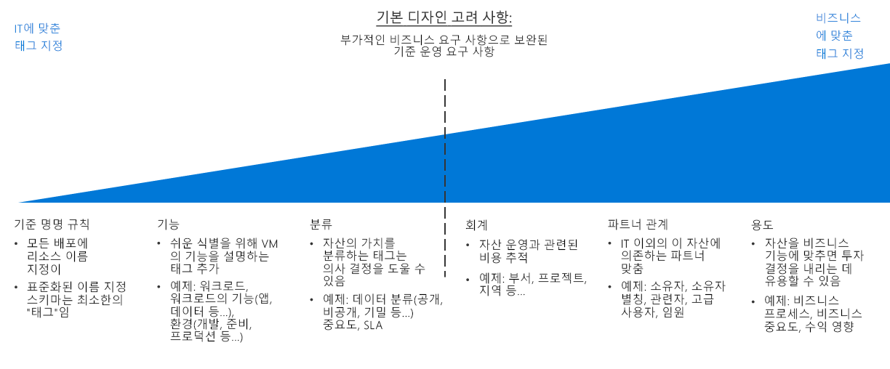

# 리소스 구성 및 태그 지정 관련 결정 가이드Resource organization and tagging decision guide

배포가 매우 단순한 경우를 제외하면 클라우드 기반 리소스 구성은 IT 팀의 가장 중요한 작업 중 하나입니다.Organizing cloud-based resources is one of the most important tasks for IT, unless you have very simple deployments. 주로 다음의 세 가지 용도를 위해 리소스 구성 작업을 진행하게 됩니다.Organizing your resources serves three primary purposes:

- **리소스 관리**.**Resource Management**. IT 팀은 특정 워크로드, 환경, 소유권 그룹 또는 기타 중요 정보와 연관된 리소스를 빠르게 찾을 수 있어야 합니다.Your IT teams will need to quickly find resources associated with specific workloads, environments, ownership groups, or other important information. 리소스 관리용 액세스 권한 및 조직 내 역할을 할당하려면 리소스를 구성해야 합니다.Organizing resources is critical to assigning organizational roles and access permissions for resource management.
- **작업****Operations**. 리소스를 적절한 체계로 구성하면 IT 팀에서 더 쉽게 관리할 수 있을 뿐 아니라 리소스와 DevOps 작성 및 운영 모니터링의 일환으로 자동화 기능을 활용할 수 있습니다.In addition to making resources easier for IT to manage, a proper organizational scheme allows you to take advantage of automation as part of resource creation, operational monitoring, and the creation of DevOps processes.
- **원활한 회계 업무 처리**.**Accounting**. 비즈니스 그룹이 클라우드 리소스 사용량을 확인할 수 있도록 하려면 IT 팀은 각 워크로드와 팀에서 사용하는 리소스를 파악해야 합니다.Making business groups aware of cloud resource consumption requires IT to understand what workloads and teams are using which resources. 차지백/쇼백 회계 등의 방식을 지원하려면 소유권과 사용량을 반영하도록 클라우드 리소스를 구성해야 합니다.To support approaches such as chargeback and showback accounting, cloud resources need to be organized to reflect ownership and usage.

## 태그 지정 관련 결정 가이드Tagging decision guide

이동: [기본 명명 규칙](#baseline-naming-conventions) | [리소스 태그 지정 패턴](#resource-tagging-patterns) | [명명 및 태그 지정 정책](#naming-and-tagging-policy) | [자세한 정보](#learn-more)Jump to: [Baseline naming conventions](#baseline-naming-conventions) | [Resource tagging patterns](#resource-tagging-patterns) | [Naming and tagging policy](#naming-and-tagging-policy) | [Learn more](#learn-more)

클라우드 워크로드를 관리하는 IT 팀을 중점적으로 지원하는 단순한 방식에서 기업 전체의 모든 요소와 관련된 정보를 통합하는 복잡한 방식까지 다양한 태그 지정 방식을 사용할 수 있습니다.Your tagging approach can be simple or complex, with the emphasis ranging from supporting IT teams managing cloud workloads to integrating information relating to all aspects of the entire business.

IT 팀 중심의 태그 지정 방식을 사용하면 복잡한 자산 모니터링 작업이 감소하며, 기능과 분류를 기준으로 하여 관리 관련 결정을 훨씬 쉽게 내릴 수 있습니다.An IT-aligned tagging focus will reduce the complexity of monitoring assets and make management decisions based on functionality and classification much easier.

IT 이외 분야의 정책도 포함하는 태그 지정 체계를 사용하려는 경우에는 시간을 더 많이 투자하여 기업의 이해 관계를 반영하는 태그 지정 표준을 작성하고 장기적으로 해당 표준을 유지 관리해야 합니다.Tagging schemes that also include non-IT policies may require a larger time investment to create tagging standards that reflect business interests and maintain those standards over time. 그러나 이 프로세스를 진행하면 IT 자산의 가치와 비용을 고려하는 향상된 기능을 제공하는 태그 지정 시스템을 구축할 수 있습니다.However, the result of this process is a tagging system providing an improved ability to account for costs and value of IT assets. 조직 내 IT 팀의 비용 센터 관련 인식을 바꾸는 과정에서 처음 수행하는 단계 중 하나가 이처럼 자산의 가치와 해당 운영 비용을 연결하는 작업입니다.This association of an asset's value to its operational cost is one of the first steps in changing the cost center perception of IT within your organization.

## 기본 명명 규칙Baseline naming conventions

클라우드에서 호스트되는 리소스를 구성하려면 먼저 명명 규칙을 표준화해야 합니다.A standardized naming convention is the starting point for organizing your cloud-hosted resources. 적절한 구조의 명명 시스템이 있으면 관리 및 회계용 리소스를 빠르게 파악할 수 있습니다.A properly structured naming system allows you to quickly identify resources for both management and accounting purposes. 조직의 다른 부서에서 기존 IT 명명 규칙을 사용하고 있다면 클라우드 리소스 명명 규칙을 이러한 기존 규칙에 맞게 조정해야 하는지, 아니면 별도의 클라우드 기반 표준을 정해야 하는지를 고려하세요.If you have existing IT naming conventions in other parts of your organization, consider whether your cloud resource naming conventions should align with them or if you should establish separate cloud-based standards.

그리고 [명명 요구 사항](../../../best-practices/naming-conventions.md#naming-rules-and-restrictions)도 각 Azure 리소스 종류별로 다릅니다.Note also that different Azure resource types have different [naming requirements](../../../best-practices/naming-conventions.md#naming-rules-and-restrictions). 이러한 명명 요구 사항에 맞는 명명 규칙을 사용해야 합니다.Your naming conventions must be compatible with these naming requirements.

## 리소스 태그 지정 패턴Resource tagging patterns

일관된 명명 규칙에서 제공되는 구성보다 더 정교하게 리소스를 구성하려는 경우를 위해 클라우드 플랫폼에서는 리소스에 태그를 지정하는 기능을 지원합니다.For more sophisticated organization than a consistent naming convention only can provide, cloud platforms support the ability to tag resources.

리소스에 연결되는 메타데이터 요소인 *태그*는*Tags* are metadata elements attached to resources. 키/값 문자열 쌍으로 구성됩니다.Tags consist of pairs of key/value strings. 이러한 쌍에는 원하는 값을 포함할 수 있습니다. 하지만 포괄적 명명/태그 지정 정책의 일부분으로 일관된 전역 태그 세트를 적용하는 작업은 전체 거버넌스 정책의 중요한 요소입니다.The values you include in these pairs is up to you, but the application of a consistent set of global tags, as part of a comprehensive naming and tagging policy, is a critical part of an overall governance policy.

아래에는 흔히 사용되는 태그 지정 패턴의 몇 가지 예가 나와 있습니다.Here are some examples of common tagging patterns:

<!-- markdownlint-disable MD033 -->

| 태그 형식Tag type | 예Examples | 설명Description |
|-----|-----|-----|
| 기능Functional            | app = catalogsearch1app = catalogsearch1  tier = webtier = web  webserver = apachewebserver = apache env = prodenv = prod  env = stagingenv = staging  env = devenv = dev                 | 워크로드 내의 용도, 배포 대상 환경 또는 기타 기능 및 운영 세부 정보와 관련하여 리소스를 분류합니다.Categorize resources in relation to their purpose within a workload, what environment they've been deployed to, or other functionality and operational details.                                 |
| 분류Classification        | confidentiality=privateconfidentiality=private sla = 24hourssla = 24hours                                 | 리소스 사용 방법 및 리소스에 적용되는 정책을 기준으로 리소스를 분류합니다.Classifies a resource by how it is used and what policies apply to it                               |
| 회계Accounting            | department = financedepartment = finance  project = catalogsearchproject = catalogsearch  region = northamericaregion = northamerica | 대금 청구용으로 조직 내 특정 그룹과 리소스를 연결할 수 있습니다.Allows resource to be associated with specific groups within an organization for billing purposes |
| 파트너 관계Partnership           | owner = jsmithowner = jsmith  contactalias = catsearchownerscontactalias = catsearchowners stakeholders = user1;user2;user3stakeholders = user1;user2;user3                        | 리소스와 관련이 있거나 기타 방식으로 리소스의 영향을 받는 IT 팀 외부 사용자 관련 정보를 제공합니다.Provides information about what people (outside of IT) are related or otherwise affected by the resource                      |
| 목적Purpose               | businessprocess=supportbusinessprocess=support businessimpact=moderatebusinessimpact=moderate revenueimpact=highrevenueimpact=high   | 투자 결정을 더욱 효율적으로 지원하기 위해 비즈니스 기능에 맞는 리소스를 설정합니다.Aligns resources to business functions to better support investment decisions  |

<!-- markdownlint-enable MD033 -->

## 명명 및 태그 지정 정책Naming and tagging policy

명명 및 태그 지정 정책은 사용 과정에서 계속해서 개선됩니다.Your naming and tagging policy will evolve over time. 하지만 클라우드 마이그레이션을 시작할 때 조직의 핵심 우선 순위를 결정해야 합니다.However, determining your core organizational priorities at the outset of a cloud migration is critical. 구체적으로 설명하자면, 계획 프로세스의 일환으로 다음 사항을 신중하게 고려해야 합니다.As part of your planning process, carefully consider the following questions:

- 명명 및 태그 지정 정책을 조직 내의 기존 명명 및 구성 정책과 가장 효율적으로 통합할 수 있는 방법How best can your naming and tagging policies integrate with existing naming and organizational policies within your organization?
- 차지백 또는 쇼백 회계 시스템 구현 여부Will you implement a chargeback or showback accounting system? 이 조직 구조에서 부서, 비즈니스 그룹 및 팀이 표시되는 방식How are your departments, business groups, and teams represented in this organizational structure?
- 모든 리소스에 필요한 태그 지정 정보와What tagging information will be required for all resources? 개별 팀이 구현 여부를 결정할 수 있는 태그 지정 정보What tagging information will be left up to individual teams to implement or not implement?
- 지정하는 태그가 리소스의 규정 준수 요구 사항과 같은 세부 정보 또는Does tagging need to represent details such regulatory compliance requirements for a resource? 작동 시간 요구 사항/패치 일정/보안 요구 사항 등의 운영 세부 정보를 나타내야 하는지 여부What about operational details such as uptime requirements, patching schedules, or security requirements?

## 자세한 정보Learn more

Azure의 명명 및 태그 지정 방식과 관련된 자세한 내용은 다음 문서를 참조하세요.For more information about naming and tagging in Azure, see:

- [Azure 리소스에 대한 명명 규칙](../../../best-practices/naming-conventions.md).[Naming conventions for Azure resources](../../../best-practices/naming-conventions.md). Azure 리소스용 권장 명명 규칙을 확인하려면 Azure 클라우드 기본 사항 사이트에서 제공되는 이 지침을 참조하세요.Refer to this guidance from the Azure Cloud Fundamentals site for recommended naming conventions for Azure resources.
- [태그를 사용하여 Azure 리소스 구성](/azure/azure-resource-manager/resource-group-using-tags?toc=/azure/billing/TOC.json).[Use tags to organize your Azure resources](/azure/azure-resource-manager/resource-group-using-tags?toc=/azure/billing/TOC.json). Azure에서는 리소스 그룹 및 개별 리소스 수준에서 모두 태그를 적용할 수 있으므로 적용되는 태그를 기준으로 회계 보고서의 세분성을 유연하게 조정할 수 있습니다.You can apply tags in Azure at both the resource group and individual resource level, giving you flexibility in the granularity of any accounting reports based on applied tags.

## 다음 단계Next steps

클라우드 환경에서 암호화를 사용하여 데이터를 보호하는 방법을 알아봅니다.Learn how encryption is used to secure data in cloud environments.

> [!div class="nextstepaction"]
> [암호화Encryption](../encryption/overview.md)
