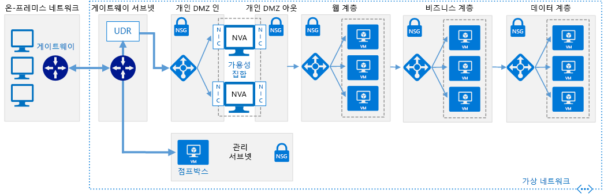

# 소프트웨어 정의 네트워크: Cloud DMZ

클라우드 DMZ 네트워크 아키텍처를 사용하면 온-프레미스 네트워크와 클라우드 기반 네트워크 간에 제한적으로 액세스하여 VPN(가상 사설망)을 통해 네트워크를 연결할 수 있습니다. DMZ는 클라우드 기반 리소스에서 온-프레미스 네트워크에 대한 액세스를 보호하기 위해 클라우드에 배포됩니다.

이 아키텍처는 조직에서 클라우드 기반 워크로드를 온-프레미스 워크로드와 통합하려고 하지만 클라우드 보안 정책이 완전히 완성되지 않았거나 두 환경 간의 보안 전용 WAN 연결이 확보되지 않았을 수 있는 시나리오를 지원하도록 설계되었습니다. 결과적으로 온-프레미스 서비스가 안전하게 보호되도록 클라우드 네트워크를 완충 영역처럼 취급해야 합니다.

DMZ는 방화벽 및 패킷 검사와 같은 보안 기능을 구현하는 NVA(네트워크 가상 어플라이언스)를 배포합니다. 온-프레미스 애플리케이션과 클라우드 기반 애플리케이션 또는 서비스 간에 전달되는 트래픽은 감사할 수 있는 DMZ를 통과해야 합니다. DMZ 네트워크를 통해 허용되는 트래픽을 결정하는 VPN 연결 및 규칙은 IT 보안 팀에서 엄격하게 제어합니다.

## 클라우드 DMZ 가정

클라우드 DMZ는 다음을 전제로 하여 배포합니다.

- 보안 팀에서 온-프레미스 및 클라우드 기반 보안 요구 사항과 정책을 완전하게 조정하지 않았습니다.
- 클라우드 기반 워크로드가 온-프레미스 또는 타사 네트워크에서 호스팅되는 서비스에 제한적으로 액세스해야 하거나, 온-프레미스 환경의 사용자 또는 애플리케이션에서 클라우드 호스팅 리소스에 제한적으로 액세스해야 합니다.
- 온-프레미스 네트워크와 클라우드 공급자 간의 VPN 연결 구현이 회사 정책, 규정 요구 사항 또는 기술 호환성 문제로 인해 방지되지 않습니다.
- 구독 리소스 제한을 무시하기 위해 워크로드에 여러 구독이 필요하지 않거나, 여러 구독이 필요하지만 여러 구독에 분산된 리소스에서 사용하는 연결 또는 공유 서비스를 중앙에서 관리할 필요가 없습니다.

클라우드 DMZ 가상 네트워킹 아키텍처의 구현을 살펴볼 때 클라우드 채택 팀에서 고려해야 하는 문제는 다음과 같습니다.

- 온-프레미스 네트워크를 클라우드 네트워크에 연결하면 보안 요구 사항이 복잡해집니다. 클라우드 네트워크와 온-프레미스 환경 간의 연결이 보호되는 경우에도 클라우드 리소스를 안전하게 보호해야 합니다.
- 클라우드 DMZ 아키텍처는 일반적으로 디딤돌로 사용되는 한편 연결의 보안이 강화되고 보안 정책이 온-프레미스 네트워크와 클라우드 네트워크 간에 조정되어 전면적인 하이브리드 네트워킹 아키텍처를 광범위하게 채택할 수 있습니다.

## 자세한 정보

Azure 플랫폼에서 클라우드 DMZ를 구현하는 방법에 대한 자세한 내용은 다음을 참조하세요.

- [Azure와 온-프레미스 데이터 센터 간의 DMZ를 구현합니다](../../../reference-architectures/dmz/secure-vnet-hybrid.md). 이 문서에서는 Azure에서 보안 하이브리드 네트워크 아키텍처를 구현하는 방법에 대해 설명합니다.
