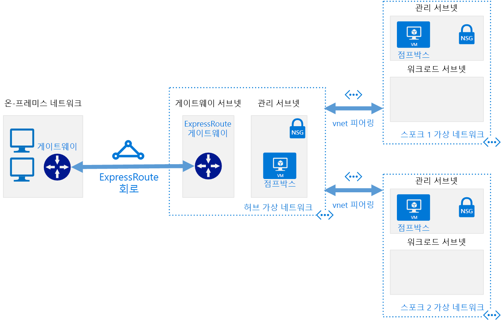

# 소프트웨어 정의 네트워크: 허브 및 스포크

허브 및 스포크 네트워킹 모델은 Azure 기반 클라우드 네트워크 인프라를 연결된 여러 가상 네트워크에 구성합니다. 이 모델을 사용하면 보다 효율적으로 일반 통신 또는 보안 요구 사항을 관리하고 잠재적인 구독 제한 사항을 처리할 수 있습니다.

허브 및 스포크 모델에서 *허브*는 외부 연결을 관리하고 여러 워크로드에서 사용된 서비스를 호스트하기 위해 중앙 위치로 작동하는 가상 네트워크입니다. *스포크*는 워크로드를 호스트하고 [가상 네트워크 피어링](/virtual-network/virtual-network-peering-overview)을 통해 중앙 허브에 연결되는 가상 네트워크입니다.

워크로드 스포크 네트워크 안팎에 전달하는 모든 트래픽은 라우팅되고, 검사되고 또는 그렇지 않으면 중앙에서 관리되는 IT 규칙 또는 프로세스에 의해 관리되는 허브 네트워크를 통해 라우팅됩니다.

이 모델의 목적은 다음과 같은 문제를 해결하는 데 있습니다.

- 비용 절감 및 관리 효율성. NVA(네트워크 가상 어플라이언스), DNS 서버와 같이 여러 워크로드에서 공유할 수 있는 서비스를 하나의 위치로 일원화하면 IT가 여러 워크로드에서 리소스 중복 및 관리 노력을 최소화할 수 있습니다.
- 구독 제한 문제를 해결합니다. 대규모 클라우드 기반 워크로드는 단일 Azure 구독 내에 허용되는 것보다 많은 리소스를 사용해야 할 수 있습니다([구독 제한](/azure/azure-subscription-service-limits) 참조). 워크로드 가상 네트워크를 서로 다른 구독에서 중앙 허브로 피어링하면 이러한 제한 문제를 해결할 수 있습니다.
- 문제 구분. 중앙 IT 팀과 워크로드 팀 간에 개별 워크로드를 배포할 수 있습니다.

다음 다이어그램에서는 중앙에서 관리되는 하이브리드 연결을 포함하여 허브 및 스포크 아키텍처 예제를 보여줍니다.

허브 및 스포크 아키텍처는 하이브리드 네트워킹 아키텍처와 함께 자주 사용되며, 여러 워크로드 간에 공유된 온-프레미스 환경에 중앙에서 관리되는 연결을 제공합니다. 이 시나리오에서 워크로드 및 온-프레미스 간에 이동하는 모든 트래픽은 관리 및 보호할 수 있는 허브를 통해 전달됩니다.

## 허브 및 스포크 가정

허브 및 스포크 가상 네트워크 아키텍처의 구현은 다음을 가정합니다.

- 클라우드 배포는 모두 DNS 또는 디렉터리 서비스와 같은 일반적인 서비스 세트를 사용하는 개발, 테스트 및 프로덕션과 같은 별도 작업 환경에서 호스팅되는 워크로드를 포함합니다.
- 워크로드는 서로 통신할 필요가 없지만 일반적인 외부 통신 및 공유된 서비스 요구 사항을 보유합니다.
- 워크로드에는 단일 Azure 구독 내에서 사용할 수 있는 것보다 많은 리소스가 필요합니다.
- 자신의 리소스에 대한 위임된 관리 권한을 작업 팀에 제공하면서 외부 연결에 대한 중앙 집중식 보안 제어를 유지해야 합니다.

## 글로벌 허브 및 스포크

허브 및 스포크 아키텍처는 일반적으로 네트워크 간 대기 시간을 최소화하기 위해 동일한 Azure 지역에 배포된 가상 네트워크를 통해 구현됩니다. 그러나 글로벌 영향력이 있는 대규모 조직은 가용성, 재해 복구 또는 규정 요구 사항을 고려해 여러 지역에 워크로드를 배포해야 할 수 있습니다. Azure [글로벌 가상 네트워크 피어링](/azure/virtual-network/virtual-network-peering-overview)을 통해 허브 및 스포크 모델은 전 세계에 분산된 워크로드를 지원하려면 지역에서 중앙 집중식 관리 및 공유 서비스를 확장할 수 있습니다.

## 자세한 정보

Azure에서 허브 및 스포크 네트워크를 구현하는 방법에 대한 예제는 Azure 참조 아키텍처 사이트의 다음 예제를 참조하세요.

- [Azure에서 허브-스포크 네트워크 토폴로지 구현](../../../reference-architectures/hybrid-networking/hub-spoke.md)
- [Azure에서 공유 서비스를 사용하여 허브-스포크 네트워크 토폴로지 구현](../../../reference-architectures/hybrid-networking/shared-services.md)
