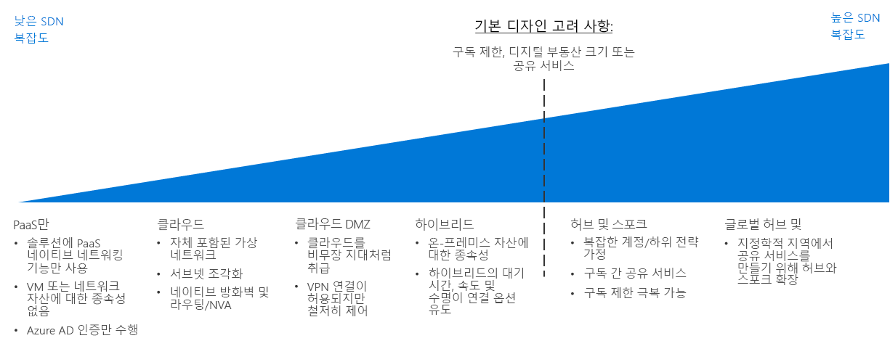

# CAF: 소프트웨어 정의 네트워크 의사 결정 가이드

SDN(소프트웨어 정의 네트워킹)은 소프트웨어를 통해 중앙에서 관리, 구성 및 수정할 수 있는 가상화된 네트워킹 기능을 허용하도록 설계된 네트워크 아키텍처입니다. SDN은 물리적 네트워킹 인프라를 통해 추상화 계층을 제공하며, 온-프레미스 네트워크에 있는 물리적 라우터, 방화벽 및 기타 네트워킹 하드웨어와 동등한 가상화를 사용할 수 있도록 합니다.

SDN을 사용하면 IT 직원이 가상화된 리소스를 사용하여 워크로드 요구 사항을 지원하는 네트워크 구조와 기능을 구성하고 배포할 수 있습니다. 소프트웨어 기반 배포 관리의 유연성을 통해 네트워킹 리소스를 빠르게 수정할 수 있으며, 민첩한 배포 모델과 기존 배포 모델을 모두 지원할 수 있습니다. SDN 기술로 만든 가상화된 네트워크는 보안 네트워크를 공용 클라우드 플랫폼에 만드는 데 매우 중요합니다.

## 네트워킹 의사 결정 가이드

이동: [PaaS 전용](paas-only.md) | [클라우드 네이티브](cloud-native.md) | | [클라우드 DMZ](cloud-dmz.md) [하이브리드](hybrid.md) | [허브/스포크 모델](hub-spoke.md) | [자세한 정보](#learn-more)

SDN은 다양한 수준의 가격 책정 및 복잡성이 있는 여러 가지 옵션을 제공합니다. 위의 검색 가이드는 특정 비즈니스 및 기술 전략에 가장 잘 부합하도록 이러한 옵션을 빠르게 개인화할 수 있는 참고 자료를 제공합니다.

이 가이드의 변곡점은 네트워킹 아키텍처를 결정하기 전에 클라우드 전략 팀에서 수행한 몇 가지 주요 결정에 따라 달라집니다. 이러한 결정 중 가장 중요한 것은 [디지털 자산 정의](../../digital-estate/overview.md) 및 [구독 설계](../subscriptions/overview.md)와 관련된 결정입니다(클라우드 계정 및 글로벌 시장 전략과 관련된 결정의 입력이 필요할 수도 있음).

VM이 1,000개 미만인 소규모 단일 지역 배포는 이 변곡점의 영향을 크게 받지 않을 수 있습니다. 반대로, 1,000개가 넘는 VM, 여러 사업부 또는 여러 지정학적 시장을 통한 대규모 채택 노력은 SDN 결정 및 이러한 주요 변곡점의 영향을 크게 받을 수 있습니다.

## 올바른 가상 네트워킹 아키텍처 선택

이 섹션에서는 올바른 가상 네트워킹 아키텍처를 선택하는 데 도움이 되는 의사 결정 가이드에 대해 자세히 설명합니다.

SDN 기술을 구현하여 클라우드 기반 가상 네트워크를 만들 수 있는 여러 가지 방법이 있습니다. 마이그레이션에 사용되는 가상 네트워크를 구성하는 방법과 해당 네트워크에서 기존 IT 인프라와 상호 작용하는 방법은 워크로드 요구 사항과 거버넌스 요구 사항의 조합에 따라 달라집니다.

클라우드 마이그레이션을 계획할 때 고려해야 할 가상 네트워킹 아키텍처 또는 아키텍처 조합을 계획하는 경우 다음 질문을 통해 조직에 적합한 것을 확인하는 것이 좋습니다.

| 질문 | PaaS 전용 | 클라우드 네이티브 | Cloud DMZ | 하이브리드 | 허브 및 스포크 |
|-----|-----|-----|-----|-----|-----|
| 워크로드에서 PaaS 서비스만 사용하고 서비스 자체에서 제공하는 기능 이외의 네트워킹 기능은 필요하지 않습니까? | 예 | 아니요 | 아니요 | 아니요 | 아니요 |
| 워크로드를 온-프레미스 애플리케이션과의 통합해야 합니까? | 아니요 | 아니요 | 예 | 예 | 예 |
| 온-프레미스 및 클라우드 네트워크 간에 완성도가 높은 보안 정책과 보안 연결을 설정했습니까? | 아니요 | 아니요 | 아니요 | 예 | 예 |
| 클라우드 ID 서비스를 통해 지원되지 않는 인증 서비스가 워크로드에 필요합니까? 아니면 온-프레미스 도메인 컨트롤러에 직접 액세스해야 합니까? | 아니요 | 아니요 | 아니요 | 예 | 예 |
| 많은 수의 VM 및 워크로드를 배포하고 관리해야 합니까? | 아니요 | 아니요 | 아니요 | 아니요 | 예 |
| 리소스에 대한 제어를 개별 워크로드 팀에 위임하면서 중앙 집중식 관리 및 온-프레미스 연결을 제공해야 합니까? | 아니요 | 아니요 | 아니요 | 아니요 | 예 |

## 가상 네트워킹 아키텍처

기본 소프트웨어 정의 네트워킹 아키텍처에 대해 자세히 알아봅니다.

- [**PaaS 전용**](paas-only.md): PaaS(Platform as a Service) 제품은 제한된 기본 제공 네트워킹 기능 세트를 지원하며, 워크로드 요구 사항을 지원하기 위해 명시적으로 정의된 소프트웨어 정의 네트워크가 필요하지 않을 수 있습니다.
- [**클라우드 네이티브**](cloud-native.md): 클라우드 네이티브 가상 네트워크는 리소스를 클라우드 플랫폼에 배포할 때의 기본적인 소프트웨어 정의 네트워킹 아키텍처입니다.
- [**클라우드 DMZ**](cloud-dmz.md): 클라우드 환경에서 완충 영역을 구현하여 보호되는 온-프레미스 네트워크와 클라우드 네트워크 간의 제한된 연결을 제공합니다.
- [**하이브리드**](hybrid.md): 하이브리드 클라우드 네트워크 아키텍처를 사용하면 가상 네트워크에서 온-프레미스 리소스에 액세스할 수 있으며, 그 반대의 경우도 마찬가지입니다.
- [**허브 및 스포크**](hub-spoke.md): 허브 및 스포크 아키텍처를 사용하면 외부 연결 및 공유 서비스를 중앙에서 관리하고, 개별 워크로드를 격리하며, 잠재적인 구독 제한을 극복할 수 있습니다.

## 자세한 정보

Azure 플랫폼의 소프트웨어 정의 네트워킹에 대한 자세한 내용은 다음을 참조하세요.

- [Azure Virtual Network](/azure/virtual-network/virtual-networks-overview). Azure에서 핵심 SDN 기능은 실제 온-프레미스 네트워크와 비슷한 클라우드 역할을 수행하는 Azure Virtual Network를 통해 제공됩니다. 또한 가상 네트워크는 플랫폼의 리소스 간에 기본 격리 경계 역할을 합니다.
- [Azure 네트워크 보안 모범 사례](/azure/security/azure-security-network-security-best-practices). 보안 취약성을 최소화하도록 가상 네트워크를 구성하는 방법에 대한 Azure 보안 팀의 추천 사항입니다.

## 다음 단계

운영 팀에서 로그, 모니터링 및 보고를 사용하여 클라우드 워크로드의 상태 및 정책 준수를 관리하는 방법에 대해 알아봅니다.

> [!div class="nextstepaction"]
> [로그 및 보고](../log-and-report/overview.md)
