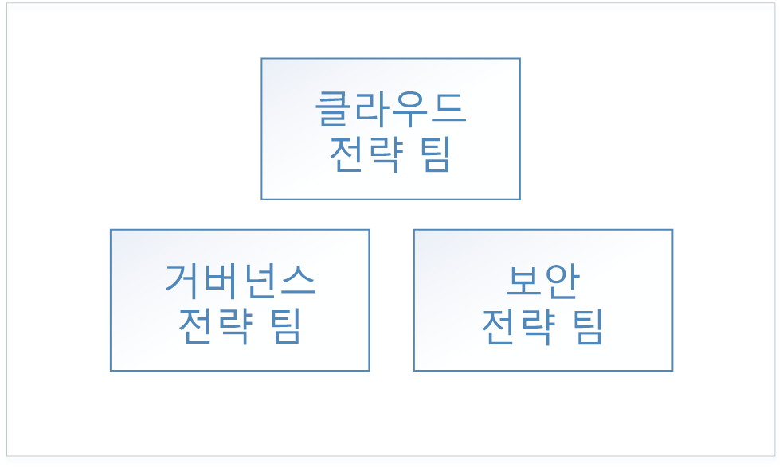
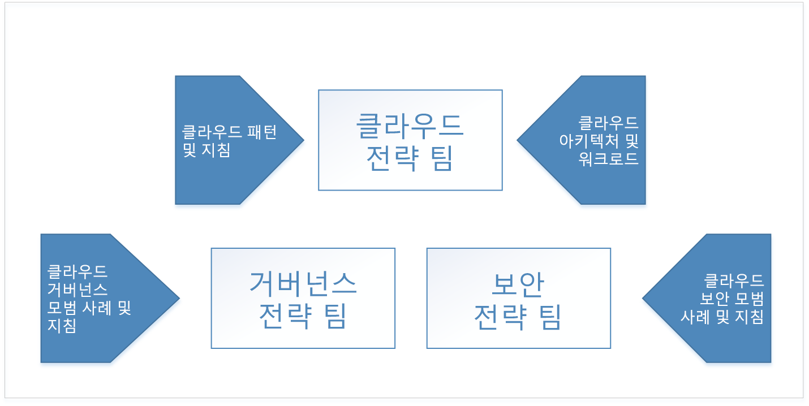
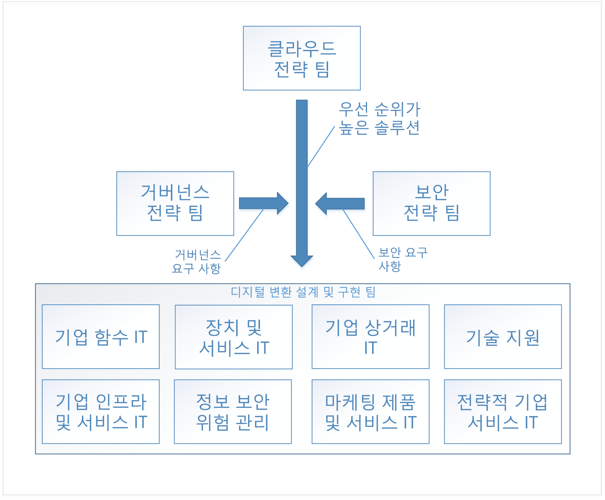

# 엔터프라이즈 클라우드 채택: 시작Enterprise Cloud Adoption: Getting started 

클라우드 컴퓨팅으로의 **디지털 변환**은 온-프레미스 운영에서 클라우드 운영으로 전환을 나타냅니다.The **digital transformation** to cloud computing represents a shift from operating on-premises to operating in the cloud. 이러한 변환에는 비즈니스를 수행하는 새로운 방식이 포함되어 있습니다. 예를 들어 디지털 변환은 소프트웨어 및 데이터 센터 하드웨어에 대한 자본 지출에서 클라우드 리소스의 사용량에 대한 운영 지출으로 전환됩니다.This shift includes new ways of doing business - for example, the digital transformation shifts from capital expenditures for software and datacenter hardware to operating expenditures for usage of cloud resources. 

## 디지털 변환: 프로세스Digital transformation: process

클라우드 채택에 성공하기 위해서 기업은 해당 조직, 사용자 및 프로세스가 디지털 변환을 준비하도록 준비해야 합니다.To be successful in adopting the cloud, an enterprise must prepare its organization, people, and processes to be ready for this digital transformation. 모든 조직의 준비 구조가 다르므로 모든 조직 준비 상황에 보편적으로 적용할 수 있는 방식은 없습니다.Every enterprise's organizational structure is different, so there is no one-size-fits-all approach to organizational readiness. 이 문서에서는 기업이 준비하기 위해 수행할 수 있는 대략적인 단계를 간략하게 설명합니다.This document outlines the high-level steps your enterprise can take to get ready. 조직은 각 나열된 단계를 수행하는 세부 계획을 개발하는 데 시간을 투자해야 합니다.Your organization will have to spend time developing a detailed plan to accomplish each of the listed steps.

디지털 변환을 위한 대략적인 프로세스는 다음과 같습니다.The high-level process for the digital transformation is:

1. 클라우드 전략 팀을 만듭니다.Create a cloud strategy team. 이 팀은 디지털 변환을 이끄는 작업을 담당합니다.This team is responsible for leading the digital transformation. 이 단계에서는 디지털 변환을 위해 거버넌스 팀 및 보안 팀을 구성하는 것도 중요합니다.It's also important at this stage to form a governance team and a security team for the digital transformation.
2. 클라우드 전략 팀의 멤버는 클라우드 기술에 대한 새로운 기능 및 다른 기능을 알아봅니다.Members of the cloud strategy team learn what's new and different about cloud technologies.  
3. 클라우드 전략 팀은 디지털 변환을 위한 비즈니스 사례를 빌드하여 기업이 준비하도록 합니다. 비즈니스 전략에서 현재의 모든 간격을 열거하고, 제거하기 위한 대략적인 솔루션을 결정합니다.The cloud strategy team prepares the enterprise by building the business case for digital transformation - enumerates all the current gaps in business strategy and determines the high-level solutions to eliminate them.
4. 비즈니스 그룹과 대략적인 솔루션을 정렬합니다.Align high-level solutions with business groups. 각 솔루션에 대한 디자인 및 구현을 소유하는 각 비즈니스 그룹의 관련자를 식별합니다.Identify stakeholders in each business group to own the design and implementation for each solution.
5. 클라우드 역할, 기술 및 프로세스를 포함하는 기존 역할, 기술 및 프로세스를 변환합니다.Translate existing roles, skills and process to include cloud roles, skills, and process.  
<!--6. Develop processes for operating in the cloud to make solutions more robust in terms of availability, resiliency, and security. 
7. Optimize solutions for performance, scalability, and cost efficiency.-->

## 1단계: 클라우드 전략 팀 만들기Step 1: create a cloud strategy team

기업 디지털 변환의 첫 번째 단계는 조직 전체에서 비즈니스 리더들이 참여하여 CST(클라우드 전략 팀)를 만드는 것입니다.The first step in your enterprise's digital transformation is engaging business leaders from across the organization to create a cloud strategy team (CST). 이 팀은 재무, IT 인프라 및 응용 프로그램 그룹의 비즈니스 리더로 구성됩니다.This team consists of business leaders from finance, IT infrastructure, and application groups. 이러한 팀은 클라우드 분석 및 실험 단계에서 도움이 됩니다.These teams can help with the cloud analysis and experimentation phase.

예를 들어 클라우드 전략 팀은 CTO에 의해 결정되고, 기업 아키텍처 팀, IT 재무, 다양한 IT 응용 프로그램 그룹(HR, 재무 등)의 선임 기술자 및 인프라, 보안 및 네트워킹 팀의 리더로 구성될 수 있습니다.For instance, a Cloud Strategy Team could be driven by the CTO and consist of members of the enterprise architecture team, IT finance, senior technologists from various IT applications groups (HR, finance, and so on), and leaders from the infrastructure, security, and networking teams.  

거버넌스 팀 및 보안 팀이라는 대략적인 두 팀을 구성하는 것도 중요합니다.It's also important to form two other high-level teams: a governance team, and a security team. 이러한 팀은 기업 거버넌스 및 보안 정책을 디자인하고, 구현하고, 지속적으로 감사하는 일을 담당합니다.These teams are responsible for designing, implementing, and the ongoing audit of the enterprise's governance and security policies. 거버넌스 팀에는 자산 보호, 비용 관리, 그룹 정책 및 관련된 토픽으로 작업한 경험이 있는 멤버가 필요합니다.The governance team requires members that have worked with asset protection, cost management, group policy and related topics. 보안 팀에는 기업의 보안 요구 사항뿐만 아니라 현재 산업 보안 표준에 익숙한 멤버가 필요합니다.The security team requires members that are well versed in current industry security standards as well as the enterprise's security requirements.

거버넌스 팀은 클라우드에서 기업 거버넌스 모델을 디자인하고 구현할 뿐만 아니라 디지털 변환의 일부인 공유 인프라 자산을 배포하고 유지 관리하는 일을 담당합니다.The governance team is responsible for designing and implementing the enterprise's governance model in the cloud, as well as deploying and maintaining the shared infrastructure assets that are part of the digital transformation. 이러한 자산에는 클라우드의 가상 네트워킹에 온-프레미스 네트워크를 연결하는 데 필요한 하드웨어, 소프트웨어 및 클라우드 리소스가 표함됩니다.These assets include hardware, software, and cloud resources necessary to connect the on-premises network to virtual networking in the cloud.

보안 팀은 거버넌스 팀과 긴밀하게 협력하여 클라우드에서 기업 보안 정책을 디자인하고 구현하는 일을 담당합니다.The security team is responsible for designing and implementing the enterprise's security policy in the cloud, working closely with the governance team. 보안 팀은 클라우드에서 가상 네트워킹을 포함하는 온-프레미스 네트워크의 보안 경계 확장을 소유합니다.The security team owns the extension of the security boundary of the on-premises network to include virtual networking in the cloud. 클라우드 가상 네트워크의 인바운드 및 아웃바운드 방화벽을 소유하고 유지 관리할 뿐만 아니라 도구 및 정책이 인증되지 않은 리소스의 배포를 방지하도록 보장하는 형식이 될 수 있습니다.This may take the form of owning and maintaining the inbound and outbound firewalls on the cloud virtual network as well as ensuring that tools and policy prevent the deployment of unauthorized resources.

## 2단계: 클라우드의 새로운 기능 알아보기Step 2: learn what's new in the cloud
 
기업 디지털 변환의 다음 단계는 클라우드 전략 팀의 멤버가 클라우드 기술이 기업의 비즈니스를 수행 방식을 변경하는 방법에 대해 알아보려는 경우입니다.The next step in your enterprise's digital transformation is for the members of the cloud strategy team to learn about how cloud technology will change the way the enterprise does business. 비즈니스, 사용자 및 기술에 대한 변경 내용을 준비하고 계획합니다.This is preparation and planning for the changes to your business, people, and technology. 클라우드 전략 팀의 멤버가 클라우드에서 새로운 기능 및 다른 기능을 온-프레미스와 비교하여 이해하는 데 필요합니다.It's important for the members of the cloud strategy team to understand what's new and different in the cloud as compared to on-premises.

클라우드를 이해하는 시작점은 대략적인 [Azure 작동 방식](what-is-azure.md)을 알아보는 것입니다.The starting point for understanding the cloud is learning [how Azure works](what-is-azure.md) at a high level. 다음으로, [리소스 액세스 관리를 이해](azure-resource-access.md)하기 위한 준비 과정으로 [Azure의 거버넌스](what-is-governance.md) 기본 사항에 대해 알아봅니다.Next, learn about the basics of [governance in Azure](what-is-governance.md) in preparation for [understanding resource access management](azure-resource-access.md).

고급 학습의 경우 거버넌스 팀은 목차의 거버넌스 섹션에서 개념 및 디자인 가이드를 검토해야 합니다.For advanced learning, the governance team should review the concepts and design guides in the governance section of the table of contents. 인프라 및 워크로드 섹션은 클라우드에서 일반적인 아키텍처 및 워크로드에 대한 학습에 유용합니다.The infrastructure and workloads sections are useful for learning about typical architectures and workloads in the cloud.

## 3단계: 비즈니스 전략의 차이 식별Step 3: identify gaps in business strategy

다음 단계는 클라우드 전략 팀이 디지털 변환 솔루션을 필요로 하는 비즈니스 문제를 열거하는 경우입니다.The next step is for the cloud strategy team to enumerate the business problems that require a digital transformation solution. 예를 들어 기업에는 교체해야 하는 수명 종료 하드웨어를 포함한 기존 온-프레미스 데이터 센터가 있을 수 있습니다.For example, an enterprise may have an existing on-premises data center with end-of-life hardware that requires replacement. 또 다른 예로 기업이 새로운 기능 및 서비스에 대한 출시 시간에 문제가 발생할 수 있고 경쟁에서 뒤쳐질 수 있습니다.In another example, an enterprise may be experiencing difficulty with time-to-market for new features and services and may be falling behind to competition. 이러한 간격은 기업 디지털 변환의 *목표*를 나타냅니다.These gaps represent the *goals* of your enterprise's digital transformation.

비즈니스 전략의 차이는 다음 범주로 분류할 수 있습니다.Gaps in business strategy can be classified into the following categories:

|CategoryCategory|설명Description|
|-----|-----|
|비용 관리Cost management|기술에 대한 기업 지불 방식의 간격을 나타냅니다.Represents a gap in the way the Enterprise pays for technology.|
|거버넌스Governance|비용 초과, 보안 문제 또는 규정 준수 문제를 일으킬 수 있는 부적절한 사용으로부터 해당 자산을 보호하기 위해 기업에서 사용하는 프로세스의 간격을 나타냅니다.Represents a gap in the processes used by the Enterprise to protect its assets from improper usage that might result in cost overruns, security issues, or compliance issues. | 
|규정 준수Compliance|기업이 고유한 내부 프로세스 및 정책뿐만 아니라 외부 법률, 규정 및 표준을 준수하는 방식의 간격을 나타냅니다.Represents a gap in the way the enterprise adheres to its own internal processes and policies as well as external laws, regulations, and standards. |
|보안Security|기업이 외부 위협으로부터 해당 기술 및 데이터 자산을 보호하는 방식의 간격을 나타냅니다.Represents a gap in the way the enterprise protects its technology and data assets from external threats. |
|데이터 거버넌스Data governance|기업이 데이터, 특히 고객 데이터를 관리하는 방식의 간격을 나타냅니다.Represents a gap in the way an enterprise manages its data, especially customer data. 예를 들어 유럽 연합의 새 GDPR(일반 데이터 보호 규정)에는 고객 데이터의 보호를 위한 엄격한 요구 사항이 있으며 여기에는 새 하드웨어 및 소프트웨어가 필요할 수 있습니다.For example, new General Data Protection Regulation (GDPR) in the European Union has strict requirements for the protection of customer data that may require new hardware and software.|    

기업이 모든 비즈니스 전략 간격을 이러한 범주로 분류하면 다음 단계에서는 각 문제에 대한 대략적인 솔루션을 결정합니다.Once your enterprise has classified all business strategy gaps into these categories, the next step is to determine a high-level solution for each problem.

다음 표에서는 여러 예제를 보여줍니다.The following table illustrates several examples:

|비즈니스 전략 간격Business strategy gap|범주 &nbsp; &nbsp; &nbsp; &nbsp; &nbsp;Category &nbsp; &nbsp; &nbsp; &nbsp; &nbsp;|솔루션 &nbsp;&nbsp;&nbsp;&nbsp;&nbsp;&nbsp;&nbsp;&nbsp;&nbsp;&nbsp;&nbsp;&nbsp;&nbsp;&nbsp;Solution &nbsp;&nbsp;&nbsp;&nbsp;&nbsp;&nbsp;&nbsp;&nbsp;&nbsp;&nbsp;&nbsp;&nbsp;&nbsp;&nbsp;|
|-----|-----|-----|
| 사용량의 약 10%인 최대 수요 시간 동안 가용성, 복원력 및 확장성과 관련된 온-프레미스 환경 문제에서 현재 호스팅되는 서비스Services currently hosted on-premises experience issues with availability, resiliency, and scalability during time of peak demand, which is approximately ten percent of usage. 온-프레미스 데이터 센터의 서버는 수명이 종료됩니다.Servers in on-premises datacenter are end-of-life. 기업 IT는 데이터 센터에 대해 최대 수요를 처리하는 사양을 가진 새로운 온-프레미스 하드웨어를 구매하도록 권장합니다.Enterprise IT recommends purchasing new on-premises hardware for datacenter with specifications to handle peak demand.| 비용 관리Cost management | 클라우드에서 영향을 받는 기존 온-프레미스 워크로드를 확장 가능한 리소스로 마이그레이션하고 사용한 만큼 요금을 지불합니다.Migrate affected existing on-premises workloads to scalable resources in the cloud, paying for usage only. |
| 외부 데이터 관리 법률 및 규정에서는 기업이 미사용 데이터 암호화를 요구하는 표준 제어 집합을 준수해야 합니다. 여기에는 새 하드웨어 및 소프트웨어가 필요합니다.External data management laws and regulations require the enterprise to adhere to set of standard controls that require encryption of data at rest, requiring new hardware and software. | 데이터 거버넌스Data governance | 미사용 데이터에 대한 Azure Storage 서비스 암호화로 데이터를 이동합니다.Move data to Azure storage service encryption for data at rest. |
| 온-프레미스 데이터 센터에서 호스팅되는 서비스에는 공용 웹 서비스에서 DDoS(distributed denial of service) 공격이 발생했습니다.Services hosted in on-premises datacenter been experiencing distributed denial of service (DDoS) attacks on public-facing services. 공격을 완화하기는 어려우며, 새 하드웨어, 소프트웨어 및 보안 담당자를 효과적으로 다루어야 합니다.The attacks are difficult to mitigate and require new hardware, software, and security personnel to deal with effectively. | 보안Security | 서비스를 Azure로 마이그레이션하고 Azure DDoS protection을 활용합니다.Migrate services to Azure, and take advantage of Azure DDoS protection.|

모든 비즈니스 전략의 간격을 열거하고 대략적인 솔루션을 결정하면 우선 순위를 지정합니다.When all of the gaps in business strategy have been enumerated and high-level solutions have been determined, prioritize the list. 각 범주에서 기업의 단기 및 장기 목표와 비즈니스 전략 간격을 맞춰서 이 목록의 우선 순위를 지정할 수 있습니다.The list can be prioritized by aligning the business strategy gaps with the enterprise's short and long-term goals in each category. 예를 들어 기업에 다음 두 회계 분기에서 IT 비용을 감소하려는 단기 목표가 있는 경우 *비용 관리* 범주의 비스니스 간격은 각각 연결된 예상 비용 절감에 의해 우선 순위가 지정될 수 있습니다.For example, if the enterprise has a short-term goal to reduce IT spend in the next two fiscal quarters, the business gaps in the *cost management* category may be prioritized by the projected cost saving associated with each.

이 프로세스의 출력은 비즈니스 범주로 정렬된 대략적인 솔루션의 스택 순위 목록입니다.The output of this process is a stack-ranked list of high-level solutions aligned with business categories. 

## 4단계: 비즈니스 그룹으로 대략적인 솔루션을 정렬하여 솔루션 디자인Step 4: align high-level solutions with business groups to design solutions 

이제 디지털 변환의 목표가 열거되고, 우선 순위가 지정되고, 대략적인 솔루션이 제안되었으므로 다음 단계는 클라우드 전략 팀이 각 비즈니스 그룹의 디자인 및 구현 팀에게 대략적인 솔루션을 각각 정렬하는 것입니다.Now that the goals of the digital transformation have been enumerated, prioritized, and high-level solutions proposed, the next step is for the cloud strategy team to align each of the high-level solutions with design and implementation teams in each of the business groups. 

팀은 우선 순위가 지정된 목록을 가져오고 각 솔루션 디자인하기 위해 대략적인 솔루션을 각각 수행합니다.The teams take the prioritized lists and work through each high-level solution to design each solution. 디자인 프로세스에는 새 인프라 및 새 워크로드의 사양이 포함됩니다.The design process will involve the specification of new infrastructure and new workloads. 수행한 사용자 역할 및 프로세스를 변경할 수도 있습니다.There may also be changes to the roles of the people and the processes they follow. 이 단계에서는 디자인 팀이 각각 디자인을 검토하기 위해 거버넌스 및 보안 팀을 모두 포함하는 것도 매우 중요합니다.It's also extremely important at this stage for each of the design teams to include both the governance and security teams for review of each design. 각 디자인은 거버넌스 및 보안 팀에서 정의된 정책 및 프로시저 내에서 설정되어야 하고, 이러한 팀은 각 디자인의 최종 로그인에 포함되어야 합니다.Each design must fall within with the policies and procedures defined by the governance and security teams, and these teams must be included in the final sign off of each design.

각 솔루션의 디자인은 특수 작업이므로 디자인이 생성될 때 다른 팀의 다른 솔루션 디자인이라는 컨텍스트에서 고려되어야 합니다.The design of each solution is a non-trivial task and as designs are created, must be considered in context with other solution designs from other teams. 예를 들어 몇몇 디자인이 기존 온-프레미스 응용 프로그램 및 서비스를 클라우드로 마이그레이션하는 결과가 발생한 경우 이러한 작업을 함께 그룹화하고 전체 마이그레이션 전략을 디자인하는 것이 더 효율적일 수 있습니다.For example, if several of the designs result in a migration of existing on-premises applications and services to the cloud, it may be more efficient to group these together and design an overall migration strategy. 또 다른 예로, 일부 기존 온-프레미스 응용 프로그램 및 서비스를 마이그레이션할 수 없을 수 있습니다. 그러면 솔루션은 새 개발 또는 타사 서비스로 교체하는 것일 수 있습니다.In another example, it may not be possible to migrate some existing on-premises applications and services and the solution may be to replace them with either new development or third-party services. 이 경우에 이러한 작업을 함께 그룹화하고 서로 겹치는지 확인하여 둘 이상의 솔루션에 대한 타사 서비스를 사용할지를 결정하는 것이 보다 효과적일 수 있습니다.In this case, it may be more efficient to group these together and determine the overlap between them to determine if a third-party service can be used for more than one solution.

솔루션의 디자인이 완료되면 팀은 각 디자인에 대한 구현 단계로 이동합니다.Once the design of the solution is complete, the team moves on to the implementation phase for each design. 표준 프로젝트 관리 프로세스를 사용하여 각 솔루션 디자인에 대한 구현 단계를 실행할 수 있습니다.The implementation phase for each solution design can be run using standard project management processes.

## 5단계: 클라우드에 대한 기존 역할, 기술 및 프로세스 변환Step 5: translate existing roles, skills, and process for the cloud

IT 업계 역사의 진화 단계에서 가장 두드러진 업계의 변화는 직원 역할의 변경에서 일어납니다.At each evolutionary phase during the history of the IT industry, the most notable industry changes are often marked by changes in staff roles. 메인프레임에서 클라이언트/서버 모델로의 전환 중에 컴퓨터 연산자의 역할은 거의 사라지고 시스템 관리자에 의해 대체됩니다.During the transition from mainframes to the client/server model, the role of the computer operator largely disappeared, replaced by the system administrator. 가상화 시대가 되면 물리적 서버를 사용하는 개인에 대한 요구 사항이 감소하고 가상화 전문가에 대한 필요로 대체됩니다.When the age of virtualization arrived, the requirement for individuals working with physical servers diminished, replaced with a need for virtualization specialists. 마찬가지로 기관이 클라우드 컴퓨팅으로 전환하면 역할도 다시 변경될 가능성이 높습니다.Similarly, as institutions shift to cloud computing, roles will likely change again. 예를 들어 데이터 센터 전문가는 클라우드 재무 분석가로 바뀔 수 있습니다.For example, datacenter specialists might be replaced with cloud financial analysts. IT 직책이 변경되지 않은 경우에도 일상 작업 역할이 크게 발전했습니다.Even in cases where IT job titles have not changed, the daily work roles have evolved significantly. 

IT 직원 멤버는 클라우드 솔루션 지원을 위해 다양한 기술이 필요하다는 것을 깨닫고 자신의 역할과 위치에 대해 우려할 수 있습니다.IT staff members may feel anxious about their roles and positions as they realize that a different set of skills is needed for the support of cloud solutions. 하지만 새 클라우드 기술을 탐색하고 학습하는 민첩한 직원은 이런 두려움을 갖지 않아도 됩니다.But agile employees who explore and learn new cloud technologies don’t need to have that fear. 클라우드 서비스를 채택하도록 이끌고 조직이 관련된 변경 내용을 이해하고 수용하는 데 도움을 줄 수 있습니다.They can lead the adoption of cloud services and help the organization understand and embrace the associated changes. 

### 고민 캡처Capturing concerns

디지털 변환 중에 각 팀에서는 직원의 고민이 발생하는 대로 캡처해야 합니다.During the digital transformation, each team should capture any staff concerns as they arise. 고민을 캡처할 때 다음을 식별합니다.When capturing concerns, identify the following: 
* 고민 형식The type of concern. 예를 들어 작업자가 디지털 변환을 수반하는 직무의 변경에 대한 반발이 있을 수 있습니다.For example, workers may be resistant to the changes in job duties that accompany the digital transformation.
* 고민이 해결되지 않는 경우 영향The impact of the concern if it is not addressed. 예를 들어 디지털 변환에 대한 반발로 인해 작업자가 필요한 변경 내용을 느리게 실행하는 결과가 발생할 수 있습니다.For example, resistance to the digital transformation may be result in workers being slow to execute the changes necessary. 
* 고민을 해결하기 위해 필요한 영역The area equipped to address the concern. 예를 들어 IT 부서의 작업자가 새로운 기술을 획득하는 데 주저하는 경우 이 고민을 해결하기 위해 IT 관련자 영역이 가장 필요합니다.For example, if workers in the IT department are reluctant to acquire new skills, the IT stakeholder's area is best equipped to address this concern. 영역을 식별하면 일부 고민을 명확하게 할 수 있으며 이러한 경우에 경영진으로 진급해야 할 수 있습니다.Identifying the area may be clear for some concerns, and in these cases you may need to escalate to executive leadership. 

### 간격 식별Identify gaps

기업 디지털 변환과 관련된 문제를 해결하는 또 다른 측면은 **간격**을 식별하는 것입니다.Another aspect of working through the issues with your enterprise's digital transformation is identifying **gaps**. 간격은 기업에 현재 존재하지 않는 디지털 변환에 필요한 역할, 기술, 또는 프로세스입니다.A gap is a role, skill, or process required for your digital transformation that does not currently exist in your enterprise. 

디지털 변환을 수반하는 새 책임을 열거하기 시작합니다. 새로운 책임 및 현재 책임에 대한 강조는 사라집니다.Begin by enumerating the new responsibilities that accompany the digital transformation, with an emphasis on new responsibilities and current responsibilities to be retired. 각 책임에 정렬된 영역을 식별합니다.Identify the area that is aligned with each responsibility. 새 책임의 경우 영역과 밀접하게 정렬된 정도를 확인합니다.For new responsibilities, determine how closely aligned it is with the area. 일부 책임은 여러 영역에 걸쳐 있을 수 있습니다. 따라서 고민으로 캡처해야 하는 내용을 보다 잘 정렬해야 합니다.Some responsibilities may span several areas, and this represents an opportunity for better alignment that should be captured as a concern. 책임 있는 영역이 식별되지 않는 경우 이를 간격으로 캡처합니다.In the case where no area is identified as being responsible, capture this as a gap.

다음으로, 책임을 지원하는 데 필요한 기술을 식별합니다.Next, identify the skills necessary to support the responsibility. 기업에 이러한 기술을 포함하는 기존 리소스가 있는지를 확인합니다.Determine if your enterprise has existing resources with these skills. 기존 리소스가 없는 경우 교육 프로그램 또는 인재 취득을 반드시 결정해야 합니다.If there are no existing resources, determine what training programs or talent acquisition is necessary. 디지털 변환이 진행되도록 지원해야 하는 책임을 기준으로 시간 프레임을 결정합니다.Determine the time frame by which the responsibility must be supported to keep your digital transformation on track.

마지막으로, 이러한 기술을 실행하는 역할을 식별합니다.Finally, identify the roles that will execute these skills. 일부 직원은 기존 역할을 일부 담당하고 다른 경우, 완전히 새로운 역할이 필요할 수 있습니다.Some of your existing workforce will assume parts of the role, and in other cases an entirely new role may be necessary. 

### 팀의 파트너Partner across teams

조직 디지털 변환의 간격을 채우는 데 필요한 기술은 일반적으로 단일 역할 또는 단일 부서로 제한될 필요가 없습니다.The skills necessary to fill the gaps in your organization's digital transformation will typically not be confined to a single role, or even a single department. 기술에는 단일 역할 또는 여러 역할에 걸쳐 있을 수 있는 관계 및 종속성이 포함되고, 해당 역할은 여러 부서에 존재할 수 있습니다.Skills will have relationships and dependencies that can span a single role or multiple roles, and those roles may exist in several departments. 예를 들어 워크로드 소유자는 구독 및 리소스 그룹과 같은 핵심 리소스를 프로비전할 IT 역할의 사용자가 필요할 수 있습니다.For example, a workload owner may require someone in an IT role to provision core resources such as subscriptions and resource groups.

이러한 종속성은 조직이 역할 간에 워크플로를 관리하기 위해 구현하게 될 새로운 프로세스를 나타냅니다.These dependencies represent new processes that your organization implements to manage the workflow between roles. 위의 예제에는 워크로드 소유자 및 IT 역할 간에 관계를 지원할 수 있는 여러 다른 형식의 프로세스가 있습니다.In the above example, there are several different types of process that can support the relationship between the workload owner and the IT role. 예를 들어 프로세스를 관리하는 워크플로 도구를 만들 수 있습니다. 또는 간단한 이메일 템플릿을 사용할 수 있습니다.For example, a workflow tool can be created to manage the process, or, a simple email template can be used.

이러한 종속성을 추적하고, 지원하는 프로세스 및 프로세스가 현재 존재하는지 여부를 기록합니다.Track these dependencies and make note of the processes that will support them, and whether or not the process currently exists. 도구를 필요로 하는 프로세스의 경우 도구를 배포하는 타임라인이 전체 디지털 변환 일정에 맞는지 확인합니다.For process that require tooling, ensure that the timeline for deploying any tools aligns with the overall digital transformation schedule.

## 다음 단계Next steps

디지털 변환은 반복 프로세스이며 각 반복에 참여하는 팀이 보다 효율적입니다.The digital transformation is an iterative process, and with each iteration the teams involved will become more efficient. 

> [!div class="nextstepaction"]
> [Azure의 작동 방식 이해Understand how Azure works](what-is-azure.md)