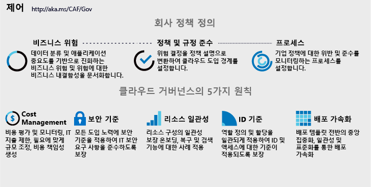

# 클라우드 거버넌스 전략 구현

<!-- markdownlint-disable MD033 -->

<ul class="panelContent cardsI">
<li style="display: flex; flex-direction: column;">
    

        

            

                

비즈니스 프로세스 또는 기술 플랫폼을 변경하면 비즈니스 위험이 발생합니다. 클라우드 거버넌스 팀은 클라우드 보유자라고도 하며, 채택 또는 혁신 노력의 중단을 최소화하면서 이러한 위험을 완화해야 합니다.  그러나 클라우드 거버넌스에는 기술 구현 이상의 것이 필요합니다. 회사의 설명이나 기업 정책을 약간만 바꾸어도 도입 업무에 큰 영향을 미칠 수 있습니다. 구현에 앞서 기업 정책을 정의하는 동안 IT 이외의 것을 고려하는 것이 중요합니다.  
                

            

        

    

</li>
<li style="display: flex; flex-direction: column;">
    <a href="../_images/operational-transformation-govern-highres.png" style="display: flex; flex-direction: column; flex: 1 0 auto;">
        

            

                

                    

 
<i>그림 1. 기업 정책 및 5개 클라우드 거버넌스 분야 그래픽</i>
                    

                

            

        

    </a>
</li>
</ul>

<!-- markdownlint-enable MD033 -->

## 기업 정책 정의

기업 정책 정의에서는 클라우드 플랫폼에 관계없이 비즈니스 위험 식별 및 완화에 초점을 맞춥니다. 양호한 클라우드 거버넌스 전략은 견고한 기업 정책에서 출발합니다. 다음 3단계 프로세스는 이러한 정책의 반복적 개발을 안내합니다.

<!-- markdownlint-disable MD033 -->

<ul  class="panelContent cardsF">
<li style="display: flex; flex-direction: column;">
    <a href="./policy-compliance/understanding-business-risk.md" style="display: flex; flex-direction: column; flex: 1 0 auto;">
        

            

                

                    

                        

                            
                        

                    

                    

                        <h3>비즈니스 위험</h3>
                        
현재 클라우드 도입 계획과 데이터 분류를 조사하여 비즈니스 위험을 식별합니다. 비즈니스와의 협력을 통해 위험 허용 범위와 완화 비용 간의 균형을 맞춥니다.

                    

                

            

        

    </a>
</li>
<li style="display: flex; flex-direction: column;">
    <a href="./policy-compliance/define-policy.md" style="display: flex; flex-direction: column; flex: 1 0 auto;">
        

            

                

                    

                        

                            
                        

                    

                    

                        <h3>정책 및 규정 준수</h3>
                        
클라우드 도입을 관리하고 위험을 완화하는 최소 간섭 정책을 알리기 위해 위험 허용 범위를 평가합니다. 일부 업종에서는 제3자 규정 준수가 최초 정책 작성에 영향을 미칠 수 있습니다.

                    

                

            

        

    </a>
</li>
<li style="display: flex; flex-direction: column;">
    <a href="./policy-compliance/processes.md" style="display: flex; flex-direction: column; flex: 1 0 auto;">
        

            

                

                    

                        

                            
                        

                    

                    

                        <h3>프로세스</h3>
                        
도입 및 혁신 업무의 전개 과정에서는 당연히 정책 위반이 발생합니다. 관련 프로세스를 실행하면 정책 준수의 모니터링 및 적용에 도움이 됩니다.

                    

                

            

        

    </a>
</li>
</ul>

<!-- markdownlint-enable MD033 -->

## 다음 단계

견고한 클라우드 거버넌스 전략은 비즈니스 위험 이해에서 출발합니다.

> [!div class="nextstepaction"]
> [비즈니스 위험 이해](./policy-compliance/understanding-business-risk.md)
