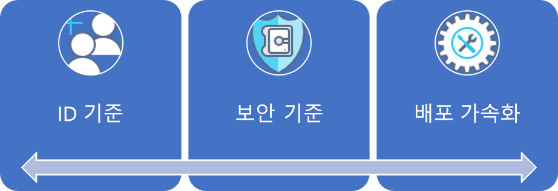
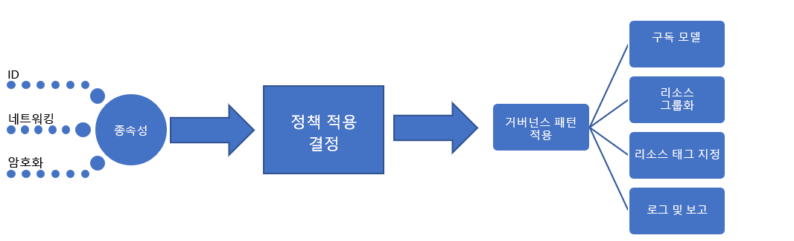

# 대기업: 설명된 모범 사례Large enterprise: Best practice explained

거버넌스 과정은 초기 [회사 정책](./initial-corporate-policy.md) 집합에서 출발합니다.The governance journey starts with a set of initial [corporate policies](./initial-corporate-policy.md). 이러한 정책은 [모범 사례](./overview.md)를 반영하는 거버넌스 MVP(최소 기능 제품)를 수립하는 데 사용됩니다.These policies are used to establish a minimum viable product (MVP) for governance that reflects [best practices](./overview.md).

이 문서에서는 MVP 거버넌스를 만드는 데 필요한 개략적인 전략을 설명합니다.In this article, we discuss the high-level strategies that are required to create a governance MVP. 거버넌스 MVP의 핵심은 [배포 가속](../../deployment-acceleration/overview.md) 분야입니다.The core of the governance MVP is the [Deployment Acceleration](../../deployment-acceleration/overview.md) discipline. 이 단계에서 적용되는 도구 및 패턴은 향후 거버넌스의 확장에 필요한 점층적 개선을 지원할 것입니다.The tools and patterns applied at this stage will enable the incremental evolutions needed to expand governance in the future.

## 거버넌스 MVP(클라우드 채택 기반)Governance MVP (Cloud Adoption Foundation)

몇 가지 간단한 원칙과 클라우드 기반 거버넌스 도구를 통해 거버넌스 및 기업 정책의 빠른 도입이 가능합니다.Rapid adoption of governance and corporate policy is achievable, thanks to a few simple principles and cloud-based governance tooling. 이것이 모든 거버넌스 프로세스에서 접근할 세 가지 거버넌스 분야의 첫 번째 분야입니다.These are the first of the three governance disciplines to approach in any governance process. 이 문서에서는 각 분야를 자세히 설명합니다.Each will be expanded upon in this article.

시작점을 정하기 위해 이 문서에서는 거버넌스 MVP를 만드는 데 필요한 ID 기준, 보안 기준, 배포 가속화의 바탕이 되는 개략적인 전략을 논의합니다. 거버넌스 MVP는 모든 채택의 토대가 됩니다.To establish the starting point, this article will discuss the high-level strategies behind Identity Baseline, Security Baseline, and Deployment Acceleration that are required to create a governance MVP, which will serve as the foundation for all adoption.

## 구현 프로세스Implementation process

거버넌스 MVP 구현은 ID, 보안 및 네트워킹에 대해 종속성이 있습니다.The implementation of the governance MVP has dependencies on Identity, Security, and Networking. 이러한 종속성이 파악되면 클라우드 거버넌스 팀은 거버넌스의 몇 가지 측면을 결정합니다.Once the dependencies are resolved, the Cloud Governance team will decide a few aspects of governance. 클라우드 거버넌스 팀 및 지원 팀이 결정한 사항은 적용 자산의 단일 패키지를 통해 구현됩니다.The decisions from the Cloud Governance team and from supporting teams will be implemented through a single package of enforcement assets.

이 구현은 간단한 검사 목록을 통해서도 설명할 수 있습니다.This implementation can also be described using a simple checklist:

1. 핵심 종속성( ID, 네트워크 및 암호화)에 관한 결정을 요청합니다.Solicit decisions regarding core dependencies: Identity, Network, and Encryption.
2. 회사 정책 적용 중에 사용할 패턴을 결정합니다.Determine the pattern to be used during corporate policy enforcement.
3. 리소스 일관성, 리소스 태그와, 로깅 및 보고 분야에 대한 적절한 거버넌스 패턴을 결정합니다.Determine the appropriate governance patterns for the Resource Consistency, Resource Tagging, and Loging and Reporting disciplines.
4. 종속 결정 및 거버넌스 결정을 적용하기 위해 선택된 정책 적용 패턴에 맞춘 거버넌스 도구를 구현합니다.Implement the governance tools aligned to the chosen policy enforcement pattern to apply the dependent decisions and governance decisions.

[!INCLUDE [implementation-process](../../../../../includes/cloud-adoption/governance/implementation-process.md)]

## 거버넌스 정의 패턴의 적용Application of governance-defined patterns

클라우드 거버넌스 팀은 다음 의사 결정 및 구현을 담당합니다.The Cloud Governance team will be responsible for the following decisions and implementations. 많은 경우 다른 팀의 입력이 필요하지만 클라우드 거버넌스 팀이 의사 결정과 구현을 모두 담당할 수 있습니다.Many will require inputs from other teams, but the Cloud Governance team is likely to own both the decision and implementation. 다음 섹션에서는 이 사용 사례에 대해 이루어지는 의사 결정과 각 결정의 세부 정보를 간략히 설명합니다.The following sections outline the decisions made for this use case and details of each decision.

### 구독 모델Subscription Model

**혼합** 패턴은 Azure 구독에 대해 선택되었습니다.The **Mixed** pattern has been chosen for Azure subscriptions.

- Azure 리소스에 대한 새로운 요청이 발생하면 각 운영 지역의 주요 사업부에 대해 "부서"가 설정됩니다.As new requests for Azure resources arise, a "Department" should be established for each major business unit in each operating geography. 각 부서 내에서 각 애플리케이션 원형에 대해 "구독"를 만들어야 합니다.Within each of the Departments, "Subscriptions" should be created for each application archetype.
- 애플리케이션 원형은 요구 사항이 유사한 애플리케이션을 그룹화하는 방법입니다.An application archetype is a means of grouping applications with similar needs. 일반적인 예제는 다음을 포함합니다. 보호되는 데이터가 있는 애플리케이션, 관리되는 애플리케이션(예: HIPAA 또는 FedRAMP), 저위험 애플리케이션, 온-프레미스 종속성/SAP/Azure의 타 메인프레임이 있는 애플리케이션, 온-프레미스 또는 메인프레임을 확장하는 애플리케이션.Common examples include: Applications with protected data, governed applications (such as HIPAA or FedRAMP), low-risk applications, applications with on-premises dependencies, SAP or other mainframes in Azure, or applications that extend on-premises SAP or mainframes. 조직마다 업무를 지원하는 애플리케이션의 유형 및 데이터 분류를 기준으로 고유한 요구 사항이 있습니다.Each organization has unique needs based on data classifications and the types of applications that support the business. 디지털 자산의 종속성 매핑은 조직에서 애플리케이션 원형을 정의하는 데 도움이 될 수 있습니다.Dependency mapping of the digital estate can help define the application archetypes in an organization.
- 공통 명명 규칙은 글머리 기호가 붙은 위의 두 항목에 따라 구독 설계의 일환으로 협의되어야 합니다.A common naming convention should be agreed upon as part of the subscription design, based on the above two bullets.

### 리소스 일관성Resource Consistency

**계층적 일관성**을 리소스 일관성 패턴으로 선택했습니다.**Hierarchical Consistency** has been chosen as a Resource Consistency pattern.

- 각 애플리케이션에 대해 리소스 그룹을 만듭니다.Resource groups should be created for each application. 각각의 애플리케이션 원형에 대해 관리 그룹을 만듭니다.Management groups should be created for each application archetype. Azure Policy을 연결된 관리 그룹의 모든 구독에 대해 적용해야 합니다.Azure Policy should be applied to all subscriptions in the associated management group.
- 배포 프로세스의 일환으로, 모든 자산에 대한 Resource Consistency 템플릿을 소스 제어에 저장해야 합니다.As part of the deployment process, Resource Consistency templates for all assets should be stored in source control.
- 각 리소스 그룹을 특정 워크로드나 애플리케이션에 맞춰야 합니다.Each resource group should align to a specific workload or application.
- 정의한 Azure 관리 그룹 계층 구조는 중첩된 그룹을 사용하여 청구 책임 및 애플리케이션 소유권을 나타내야 합니다.The Azure management group hierarchy defined should represent billing responsibility and application ownership using nested groups.
- Azure Policy의 광범위한 구현으로 인해 팀이 약속한 시한을 초과하고 당장은 큰 가치를 제공하지 못할 수 있습니다.Extensive implementation of Azure Policy could exceed the team’s time commitments and may not provide much value at this point. 그러나 초기의 일부 클라우드 거버넌스 정책 문을 시행하기 위해서는 간단한 기본 정책을 만들어 각각의 리소스 그룹에 적용해야 합니다.However, a simple default policy should be created and applied to each resource group to enforce the first few cloud governance policy statements. 이러한 정책은 특정 거버넌스 요구 사항의 구현을 정의합니다.This serves to define the implementation of specific governance requirements. 그런 다음, 이러한 구현을 모든 배포 자산에 적용할 수 있습니다.Those implementations can then be applied across all deployed assets.

### 리소스 태그 지정Resource Tagging

리소스 태그 지정을 위해 **계정** 패턴을 선택했습니다.The **Accounting** pattern has been chosen for resource tagging.

- 배포된 자산은 부서/청구 단위, 지리, 데이터 분류, 중요성, SLA, 환경, 애플리케이션 원형, 애플리케이션 및 애플리케이션 소유자의 가치에 따라 태그가 지정됩니다.Deployed assets should be tagged with values for the following: Department/Billing Unit, Geography, Data Classification, Criticality, SLA, Environment, Application Archetype, Application, and Application Owner.
- 배포된 자산과 연결된 Azure 관리 그룹 및 구독과 함께 이러한 가치는 거버넌스, 운영 및 보안 의사 결정에 작용합니다.These values along with the Azure management group and subscription associated with a deployed asset will drive governance, operations, and security decisions.

### 로깅 및 보고Logging and reporting

현재, 로그 및 보고를 위한 **하이브리드** 패턴이 권장되기는 하지만, 어떤 개발 팀에서도 해당 패턴을 반드시 사용해야 하는 것은 아닙니다.At this point, a **Hybrid** pattern for log and reporting is suggested but not required of any development team.

- 로깅 및 보고 목적으로 수집될 특정 데이터 요소와 관련해서 현재 설정된 거버넌스 요구 사항은 없습니다.No governance requirements are currently set regarding the specific data points to be collected for logging or reporting purposes. 이 내용은 이러한 가상의 설명에만 국한되며 반대 패턴을 고려해야 합니다.This is specific to this fictional narrative and should be considered an antipattern. 가능한 한 빨리 로깅 표준을 결정하고 적용해야 합니다.Logging standards should be determined and enforced as soon as possible.
- 보호된 데이터 또는 중요 업무용 워크로드를 릴리스하기 전에 추가 분석을 수행해야 합니다.Additional analysis is required before the release of any protected data or mission-critical workloads.
- 보호된 데이터 또는 중요 업무용 워크로드를 지원하기 전에, 기존 온-프레미스 운영 모니터링 솔루션에 로깅에 사용되는 작업 영역에 대한 액세스 권한을 부여해야 합니다.Prior to supporting protected data or mission-critical workloads, the existing on-premises operational monitoring solution must be granted access to the workspace used for logging. 애플리케이션은 정의된 SLA에 따라 지원될 경우 해당 테넌트의 사용과 관련된 보안 및 로깅 요구 사항을 충족해야 합니다.Applications are required to meet security and logging requirements associated with the use of that tenant, if the application is to be supported with a defined SLA.

## 거버넌스 프로세스의 진화Evolution of governance processes

자동화 도구로 제어할 수 없거나 제어해서는 안 되는 정책 문이 있습니다.Some of the policy statements cannot or should not be controlled by automated tooling. IT 보안 및 온-프레미스 ID 기준 팀이 정기적으로 관리해야 하는 정책도 있습니다.Other policies will require periodic effort from IT Security and on-premises Identity Baseline teams. 클라우드 거버넌스 팀은 다음 프로세스를 감독하여 이전 8개 정책 문을 구현해야 합니다.The Cloud Governance team will need to oversee the following processes to implement the last eight policy statements:

**회사 정책 변경**: 클라우드 거버넌스 팀은 거버넌스 MVP 디자인을 변경하여 새 정책을 도입할 것입니다.**Corporate Policy Changes**: The Cloud Governance team will make changes to the governance MVP design to adopt the new policies. 거버넌스 MVP의 가치는 새 정책의 자동 적용이 가능하다는 점에 있습니다.The value of the governance MVP is that it will allow for the automatic enforcement of the new policies.

**채택 가속화**: 클라우드 거버넌스 팀은 여러 팀의 배포 스크립트를 검토하고 있습니다.**Adoption Acceleration**: The Cloud Governance team has been reviewing deployment scripts across multiple teams. 또한 배포 템플릿으로 사용되는 스크립트 세트를 유지 관리하고 있습니다.They've maintained a set of scripts that serve as deployment templates. 클라우드 채택 팀과 DevOps 팀은 이러한 템플릿을 사용하여 배포를 더 빠르게 정의할 수 있습니다.Those templates can be used by the cloud adoption teams and DevOps teams to more quickly define deployments. 각 스크립트에는 거버넌스 정책을 적용하기 위한 요구 사항이 포함되어 있으므로 클라우드 채택 엔지니어가 힘들게 작업할 필요가 없습니다.Each script contains the requirements for enforcing governance policies, and additional effort from cloud adoption engineers is not needed. 클라우드 채택 엔지니어들은 이러한 스크립트의 큐레이터로서 정책 변경을 좀 더 빠르게 구현할 수 있습니다.As the curators of these scripts, they can implement policy changes more quickly. 또한 채택을 가속화하는 역할을 합니다.Additionally, they are viewed as accelerators of adoption. 이를 통해 엄격한 적용 규정 없이도 일관된 배포를 진행할 수 있게 됩니다.This ensures consistent deployments without strictly enforcing adherence.

**엔지니어 교육**: 클라우드 거버넌스 팀은 격월로 교육 세션을 제공하며 엔지니어를 위한 2개의 비디오를 제작했습니다.**Engineer Training**: The Cloud Governance team offers bi-monthly training sessions and has created two videos for engineers. 두 가지 리소스 모두 엔지니어들이 거버넌스 문화와 배포 수행 방법을 빠르게 숙지하도록 도와줍니다.Both resources help engineers get up to speed quickly on the governance culture and how deployments are performed. 이 팀은 프로덕션 및 비프로덕션 배포 간의 차이점을 보여 주는 교육 자산을 추가하여 엔지니어들이 새 정책이 채택에 미치는 영향을 이해할 수 있도록 하고 있습니다.The team is adding training assets to demonstrate the difference between production and non-production deployments, which helps engineers understand how the new policies affect adoption. 이를 통해 엄격한 적용 규정 없이도 일관된 배포를 진행할 수 있게 됩니다.This ensures consistent deployments without strictly enforcing adherence.

**배포 계획**: 보호되는 데이터를 포함하는 자산을 배포하기 전에, 클라우드 거버넌스 팀은 배포 스크립트를 검토하여 거버넌스 일치의 유효성을 검사합니다.**Deployment Planning**: Prior to deployment of any asset containing protected data, the Cloud Governance team will be responsible for reviewing deployment scripts to validate governance alignment. 이전에 승인된 배포가 있는 기존 팀에 대해서는 프로그래밍 방식의 도구를 사용하여 감사합니다.Existing teams with previously approved deployments will be audited using programmatic tooling.

**월별 감사 및 보고**: 매월, 클라우드 거버넌스 팀은 모든 클라우드 배포를 감사하여 정책에 잘 맞는지 지속적으로 검증합니다.**Monthly Audit and Reporting**: Each month, the Cloud Governance team runs an audit of all cloud deployments to validate continued alignment to policy. 차이가 발견되면 문서로 정리한 후 클라우드 채택 팀과 공유합니다.When deviations are discovered, they are documented and shared with the cloud adoption teams. 비즈니스 중단이나 데이터 누수의 위험이 없는 경우 정책이 자동으로 적용됩니다.When enforcement doesn't risk a business interruption or data leak, the policies are automatically enforced. 감사가 끝나면 클라우드 거버넌스 팀은 클라우드 전략 팀과 각 클라우드 채택 팀에 대한 보고서를 정리하여 전반적인 정책 준수 상황을 전달합니다.At the end of the audit, the Cloud Governance team compiles a report for the Cloud Strategy team and each cloud adoption team to communicate overall adherence to policy. 또한 이 보고서는 감사 및 법적 목적으로 저장됩니다.The report is also stored for auditing and legal purposes.

**분기별 정책 검토**: 분기마다 클라우드 거버넌스 팀과 클라우드 전략 팀은 감사 결과를 검토하고 회사 정책 변경을 제안합니다.**Quarterly Policy Review**: Each quarter, the Cloud Governance team and Cloud Strategy team to review audit results and suggest changes to corporate policy. 이러한 추천 사항의 대부분은 지속적인 개선과 사용 패턴의 관찰을 통해 얻은 것입니다.Many of those suggestions are the result of continuous improvements and the observation of usage patterns. 승인된 정책 변경 내용은 후속 감사 주기 동안 거버넌스 도구에 통합됩니다.Approved policy changes are integrated into governance tooling during subsequent audit cycles.

## 대체 패턴Alternative patterns

이 거버넌스 과정에서 선택한 패턴이 읽는 사람의 요구와 맞지 않으면 각 패턴의 대체 패턴을 사용할 수 있습니다.If any of the patterns chosen in this governance journey don't align with the reader's requirements, alternatives to each pattern are available:

- [암호화 패턴Encryption patterns](../../../decision-guides/encryption/overview.md)
- [ID 패턴Identity patterns](../../../decision-guides/identity/overview.md)
- [로깅 및 보고 패턴Logging and Reporting patterns](../../../decision-guides/log-and-report/overview.md)
- [정책 적용 패턴Policy Enforcement patterns](../../../decision-guides/policy-enforcement/overview.md)
- [리소스 일관성 패턴Resource Consistency patterns](../../../decision-guides/resource-consistency/overview.md)
- [리소스 태그 지정 패턴Resource Tagging patterns](../../../decision-guides/resource-tagging/overview.md)
- [소프트웨어 정의 네트워크 패턴Software Defined Network patterns](../../../decision-guides/software-defined-network/overview.md)
- [구독 디자인 패턴Subscription Design patterns](../../../decision-guides/subscriptions/overview.md)

## 다음 단계Next steps

이 지침을 구현하면 각 클라우드 채택 팀이 견고한 거버넌스 토대를 구축할 수 있습니다.Once this guidance is implemented, each cloud adoption team can proceed with a solid governance foundation. 클라우드 거버넌스 팀은 회사 정책 및 거버넌스 분야를 지속적으로 업데이트하기 위해 노력할 것입니다.The Cloud Governance team will work in parallel to continually update the corporate policies and governance disciplines.

두 팀은 허용 오차 지표를 사용하여 클라우드 채택을 계속 지원하는 데 필요한 차기 발전 방향을 파악하게 됩니다.Both teams will use the tolerance indicators to identify the next evolution needed to continue supporting cloud adoption. 이 과정에서 회사는 레거시 또는 타사 MFA(Multi-Factor Authentication) 요구 사항에 따라 애플리케이션을 지원할 수 있도록 거버넌스 기준을 발전시키게 됩니다.The next step for the company in this journey is to evolve their governance baseline to support applications with legacy or third-party multifactor authentication (MFA) requirements.

> [!div class="nextstepaction"]
> [ID 기준 진화Identity Baseline evolution](./identity-baseline-evolution.md)
