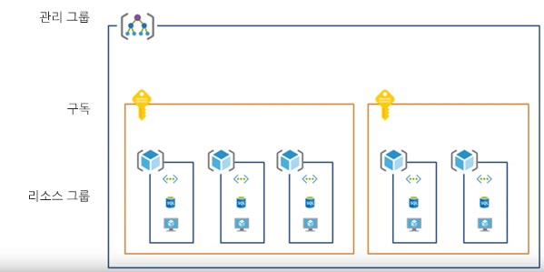
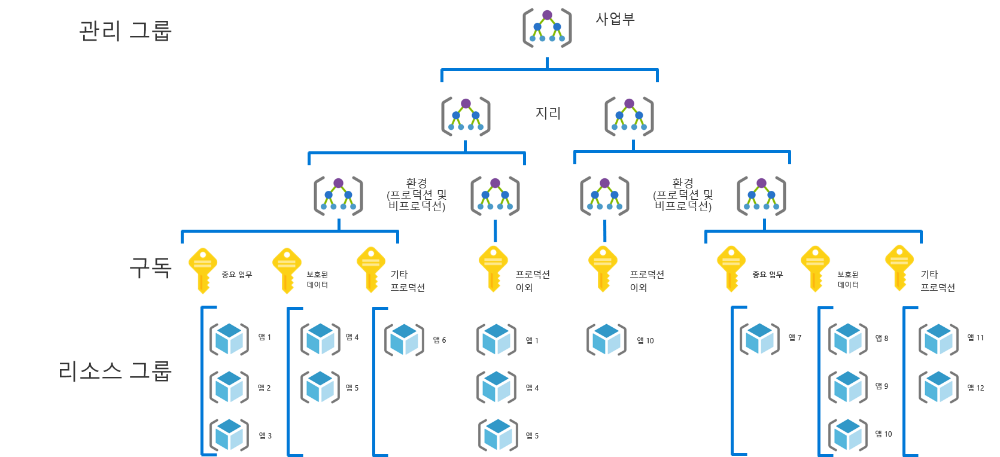
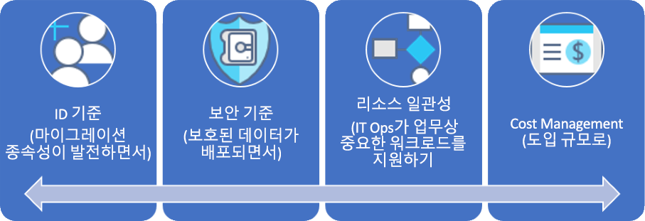

# CAF: 대규모 엔터프라이즈 거버넌스 경험CAF: Large enterprise governance journey

## 모범 사례 개요Best practice overview

이 거버넌스 경험은 거버넌스 성숙도의 여러 단계를 통해 가상 회사의 경험을 따릅니다.This governance journey follows the experiences of a fictional company through various stages of governance maturity. 실제 고객 경험에 따릅니다.It is based on real customer journeys. 제안된 모범 사례는 가상의 회사의 제약 조건 및 요구에 따릅니다.The suggested best practices are based on the constraints and needs of the fictional company.

빠른 시작점으로 이 개요는 모범 사례에 따라 거버넌스에 대한 MVP(실행 가능한 최소 제품)을 정의합니다.As a quick starting point, this overview defines a minimum viable product (MVP) for governance based on best practices. 또한 새 비즈니스 또는 기술 위험이 나타나는 경우 추가적인 모범 사례를 추가하는 일부 거버넌스 개선에 대한 링크도 제공합니다.It also provides links to some governance evolutions that add further best practices as new business or technical risks emerge.

> [!WARNING]
> 이러한 MVP는 일련의 가정 세트를 기반으로 하는 기본 시작 지점입니다.This MVP is a baseline starting point, based on a set of assumptions. 이 최소한의 모범 사례 세트도 고유한 비즈니스 위험과 위험 허용 오차에 따라 결정되는 회사 정책을 기반으로 합니다.Even this minimal set of best practices is based on corporate policies driven by unique business risks and risk tolerances. 이러한 가정이 사용자에게 적용되는지 확인하려면 이 문서 다음에 나오는 [긴 내러티브](./narrative.md)를 참조하세요.To see if these assumptions apply to you, read the [longer narrative](./narrative.md) that follows this article.

### 거버넌스 모범 사례Governance best practice

이 모범 사례는 조직이 여러 Azure 구독에 빠르고 일관되게 거버넌스 보호책을 추가하는 데 사용할 수 있는 기반으로 사용됩니다.This best practice serves as a foundation that an organization can use to quickly and consistently add governance guardrails across multiple Azure subscriptions.

### 리소스 조직Resource organization

다음 다이어그램에서는 리소스를 구성하기 위한 거버넌스 MVP 계층 구조를 보여줍니다.The following diagram shows the governance MVP hierarchy for organizing resources.

모든 애플리케이션은 관리 그룹, 구독 및 리소스 그룹 계층 구조의 적절한 영역에 배포되어야 합니다.Every application should be deployed in the proper area of the management group, subscription, and resource group hierarchy. 배포를 계획하는 동안 클라우드 거버넌스 팀은 계층 구조에서 필요한 노드를 만들어 클라우드 도입 팀의 역량을 강화합니다.During deployment planning, the Cloud Governance team will create the necessary nodes in the hierarchy to empower the cloud adoption teams.

1. 지리 및 환경(프로덕션, 비프로덕션)을 반영하는 자세한 계층 구조가 있는 각 사업부에 대한 관리 그룹입니다.A management group for each business unit with a detailed hierarchy that reflects geography then environment type (Production, Non-Production).
2. 사업부, 지리, 환경 및 "애플리케이션 분류"의 각 고유 조합에 대한 구독입니다.A subscription for each unique combination of business unit, geography, environment, and "Application Categorization."
3. 각 애플리케이션에 대한 별도의 리소스 그룹입니다.A separate resource group for each application.
4. 일관된 명명법이 그룹화 계층 구조의 각 수준에서 적용되어야 합니다.Consistent nomenclature should be applied at each level of this grouping hierarchy.

이러한 패턴은 불필요하게 계층 구조를 복잡하게 만들지 않고도 증가의 여지를 제공합니다.These patterns provide room for growth without complicating the hierarchy unnecessarily.

[!INCLUDE [governance-of-resources](../../../../../includes/cloud-adoption/governance/governance-of-resources.md)]

## 거버넌스 개선Governance evolutions

이 MVP가 배포된 후 거버넌스의 추가 계층은 환경에 신속하게 통합될 수 있습니다.Once this MVP has been deployed, additional layers of governance can be quickly incorporated into the environment. 특정 비즈니스 요구 사항을 충족하기 위해 MVP를 발전시키는 몇 가지 방법은 다음과 같습니다.Here are some ways to evolve the MVP to meet specific business needs:

- [보호된 데이터의 보안 기준Security Baseline for protected data](./security-baseline-evolution.md)
- [중요 업무용 애플리케이션의 리소스 일관성Resource configurations for mission-critical applications](./resource-consistency-evolution.md)
- [비용 관리 제어Controls for Cost Management](./cost-management-evolution.md)
- [다중 클라우드 개선 제어Controls for multi-cloud evolution](./multi-cloud-evolution.md)

<!-- markdownlint-disable MD026 -->

## 이 모범 사례가 하는 것은 무엇인가요?What does this best practice do?

MVP에서 [배포 가속](../../deployment-acceleration/overview.md) 분야의 사례 및 도구가 신속하게 회사 정책을 적용하기 위해 설정됩니다.In the MVP, practices and tools from the [Deployment Acceleration](../../deployment-acceleration/overview.md) discipline are established to quickly apply corporate policy. 특히 MVP는 Azure Blueprints, Azure Policy 및 Azure 관리 그룹을 사용하여 이 가상의 회사의 내러티브에 정의된 대로 몇 가지 기본 회사 정책을 적용합니다.In particular, the MVP uses Azure Blueprints, Azure Policy, and Azure management groups to apply a few basic corporate policies, as defined in the narrative for this fictional company. 해당 회사 정책은 ID 및 보안에 대한 아주 작은 기준을 설정하려면 Azure Resource Manager 템플릿 및 Azure Policy를 사용하여 적용합니다.Those corporate policies are applied using Azure Resource Manager templates and Azure policies to establish a very small baseline for identity and security.

## 모범 사례 발전Evolving the best practice

시간이 지남에 따라 이 거버넌스 MVP는 거버넌스 사례를 발전시키는 데 사용됩니다.Over time, this governance MVP will be used to evolve the governance practices. 도입이 진전됨에 따라 비즈니스 위험도 증가합니다.As adoption advances, business risk grows. CAF 거버넌스 모델 내의 여러 분야는 해당 위험을 완화하기 위해 발전됩니다.Various disciplines within the CAF governance model will evolve to mitigate those risks. 이 시리즈의 뒷부분에 나오는 문서에서는 가상 회사에 영향을 주는 회사 정책의 개선을 설명합니다.Later articles in this series discuss the evolution of corporate policy affecting the fictional company. 이러한 개선은 세 가지 분야에서 이뤄집니다.These evolutions happen across three disciplines:

- 내러티브에서 마이그레이션 종속성이 발전하는 경우의 ID 기준Identity Baseline, as migration dependencies evolve in the narrative
- 도입이 크기 조정하는 경우의 Cost Management입니다.Cost Management, as adoption scales.
- 보호된 데이터가 배포되는 경우의 보안 기준입니다.Security Baseline, as protected data is deployed.
- IT 운영 팀이 중요 업무용 워크로드 지원을 시작하는 경우의 리소스 일관성입니다.Resource Consistency, as IT Operations begins supporting mission-critical workloads.

## 다음 단계Next steps

이제 거버넌스 MVP에 익숙해졌고 다음의 거버넌스 개선을 이해했으므로 추가 컨텍스트에 대한 지원 내러티브를 참조하세요.Now that you’re familiar with the governance MVP and have an idea of the governance evolutions to follow, read the supporting narrative for additional context.

> [!div class="nextstepaction"]
> [지원 내러티브 참조Read the supporting narrative](./narrative.md)
