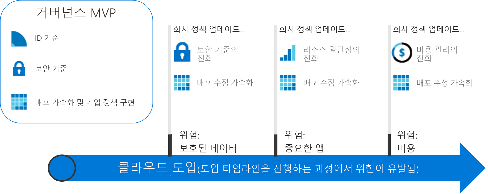

# 실행 가능한 거버넌스 경험

이 섹션의 거버넌스 경험에서는 CAF 거버넌스 모델의 증분 방식을 보여줍니다. 모든 클라우드 거버넌스 시나리오의 요구를 충족하기 위해 발전하는 민첩한 거버넌스 플랫폼을 설정할 수 있습니다.

## 클라우드 거버넌스 모범 사례 검토 및 채택

채택 경로를 시작하려면 다음 경험 중 하나를 선택합니다. 각 여정은 가상의 고객 경험 세트에 따라 일련의 모범 사례를 간략하게 설명합니다. CAF 거버넌스 모델의 증분 방식을 잘 모르는 독자의 경우 모범 사례 중 하나를 채택하기 전에 다음과 같은 수준 높은 거버넌스 이론 도입을 검토하는 것이 좋습니다.

<!-- markdownlint-disable MD033 -->

<ul class="panelContent cardsZ">
<li style="display: flex; flex-direction: column;">
    <a href="./small-to-medium-enterprise/overview.md" style="display: flex; flex-direction: column; flex: 1 0 auto;">
        

            

                

                    

                        <h3>중소 엔터프라이즈</h3>
                        
5개 미만의 데이터 센터를 소유하고 센트럴 IT 또는 쇼백 모델을 통해 비용을 관리하는 엔터프라이즈에 대한 거버넌스 경험입니다.

                    

                

            

        

    </a>
</li>
<li style="display: flex; flex-direction: column;">
    <a href="./large-enterprise/overview.md" style="display: flex; flex-direction: column; flex: 1 0 auto;">
        

            

                

                    

                        <h3>대규모 엔터프라이즈</h3>
                        
5개를 초과하는 데이터 센터를 소유하고 여러 사업부를 통해 비용을 관리하는 엔터프라이즈에 대한 거버넌스 경험입니다.

                    

                

            

        

    </a>
</li>
</ul>

<!-- markdownlint-enable MD033 -->

## 클라우드 거버넌스의 증분 방식

클라우드 채택은 대상이 아닌 경험입니다. 이 과정에서 명확한 마일스톤 및 실제적인 비즈니스 이점이 있습니다. 그러나 클라우드 도입의 최종 상태는 회사가 그 과정을 시작할 때 대개 알려지지 않습니다. 클라우드 거버넌스는 과정 전체에 걸쳐 회사가 안전한 경로를 유지하게 하는 보호책을 만듭니다.

이러한 거버넌스 경험은 실제 고객의 경험에 따라 가상 회사의 경험을 설명합니다. 각 경험은 해당 클라우드 도입의 거버넌스 측면을 통해 고객을 따릅니다.

### 종료 상태 설정

대상 없는 경험은 헤매기만 합니다. 첫 번째 단계를 수행하기 전에 최종 상태에 대한 대략적인 비전을 설정하는 것이 중요합니다. 다음 인포그래픽은 최종 상태에 대한 참조 프레임을 제공합니다. 인포그래픽은 시작점이 아니지만 잠재적인 대상을 보여줍니다.

CAF 거버넌스 모델은 경험하는 동안 주요 영역을 식별합니다. 각 영역은 많은 클라우드 서비스를 도입하므로 회사가 해결해야 하는 다양한 유형의 위험과 관련돼 있습니다. 이 프레임워크 내에서 거버넌스 경험은 클라우드 거버넌스 팀에 필요한 작업을 식별합니다. 이 과정에서 CAF 거버넌스 모델의 각 원칙이 추가로 설명됩니다. 대략적으로 다음과 같습니다.

**회사 정책**. 회사 정책은 클라우드 거버넌스를 사용합니다. 거버넌스 경험은 회사 정책의 특정 측면에 중점을 둡니다.

- 비즈니스 위험: 회사 위기를 식별하고 이해합니다.
- 정책 및 규정 준수: 위험을 규정 준수 요구 사항을 지원하는 정책 문으로 변환합니다.
- 프로세스: 명시된 정책을 준수해야 합니다.

**클라우드 거버넌스의 5분야**. 이러한 분야는 회사 정책을 지원합니다. 각 분야는 발생할 수 있는 문제에서 회사를 보호합니다.

- Cost Management
- 보안 기준
- 리소스 일관성
- ID 기준
- 배포 가속

기본적으로 회사 정책은 잠재적인 문제를 검색하는 조기 경고 시스템으로 사용됩니다. 분야는 회사가 위험을 완화하고 보호책을 만드는 데 도움이 됩니다.

### 최종 상태로 증가

거버넌스 요구 사항이 클라우드 도입 과정 전체에 걸쳐 발전하므로 거버넌스에 대한 다양한 방법이 필요합니다. 회사는 *첫 번째 단계를 수행하기 전에* 소규모 팀이 모든 고속도로에 로드맵 및 보호책을 빌드하기를 더 이상 기다릴 수 없습니다. 비즈니스 결과가 더 빠르고 원활하게 예상됩니다. IT 거버넌스는 신속하게 이동하고, 클라우드를 도입하는 동안 관련 상태를 유지하고 "섀도 IT"를 방지하기 위한 비즈니스 요구에 따라야 합니다.

**증분 거버넌스** 방법은 이러한 특성을 제공합니다. 증분 거버넌스는 도입 및 거버넌스에 대한 기반을 설정하려면 소수의 회사 정책, 프로세스 및 도구를 사용합니다. 해당 기반은 **MVP(실행 가능한 최소 제품)** 이라고 합니다. MVP는 거버넌스 팀이 도입 수명 주기 전체에 걸쳐 거버넌스를 구현에 신속하게 통합하도록 허용합니다. MVP는 클라우드 도입 프로세스 중에 언제든지 설정할 수 있습니다. 그러나 가급적 빨리 MVP를 도입하는 것이 좋습니다.

위험 변화에 신속하게 응답하는 기능을 사용하면 클라우드 거버넌스 팀이 새로운 방식으로 참여할 수 있습니다. 클라우드 거버넌스 팀은 도입 플랜과 관련된 위험을 완화하려면 정찰대로 클라우드 전략 팀에 조인하여 클라우드 도입 팀에 앞서 움직이고 경로를 계획하고 신속하게 보호책을 설정할 수 있습니다. 이러한 Just-In-Time 거버넌스 계층은 **거버넌스 발전**이라고 합니다. 이 방법을 사용하면 거버넌스 전략은 클라우드 도입 팀에 한 발 앞서 발전합니다.

다음 다이어그램은 간단한 거버넌스 MVP 및 세 가지 거버넌스 발전을 보여줍니다. 발전하는 동안 새로운 위험을 완화하려면 회사 정책을 추가로 정의합니다. 배포 가속 분야는 각 배포에서 이러한 변경 내용을 적용합니다.

> [!NOTE]
> 거버넌스는 보안, 네트워킹, ID, 재무, DevOps 또는 운영 같은 핵심 기능을 대체하지 않습니다. 그 과정에 각 기능의 구성원과 상호 작용 및 종속성이 있습니다. 해당 구성원은 결정 및 작업을 가속화하려면 클라우드 거버넌스 팀에 포함되어야 합니다.

## 거버넌스 경험 선택

경험은 거버넌스 MVP를 구현하는 방법을 보여줍니다. 거기에서 각 경험은 클라우드 거버넌스 팀이 도입 노력을 가속화하려면 파트너로서 클라우드 도입 팀보다 더 노력할 수 있습니다. CAF 거버넌스 모델은 기반에서 후속 발전까지 거버넌스의 적용을 안내합니다.

거버넌스 경험을 시작하려면 아래 두 옵션 중 하나를 선택합니다. 옵션은 합성된 고객 경험에 따릅니다. 제목은 쉬운 탐색을 위해 엔터프라이즈의 크기에 따릅니다. 그러나 독자의 의사 결정은 더 복잡할 수 있습니다. 다음 표에서 두 옵션 간의 차이를 간략하게 설명합니다.

> [!NOTE]
> 어떤 경험도 상황에 완벽히 맞출 수 없습니다. 가장 밀접한 경험을 선택하여 시작점으로 사용합니다. 경험 전체에 걸쳐 특정 기준을 충족하는 결정을 사용자 지정할 수 있도록 추가 정보를 제공합니다.

### 비즈니스 특성

|                                            | 중소 엔터프라이즈                                                                              | 대규모 엔터프라이즈                                                                                               |
|--------------------------------------------|---------------------------------------------------------------------------------------------------------|----------------------------------------------------------------------------------------------------------------|
| 지리(국가 또는 지역) | 고객이나 직원 대부분이 한 지역에 거주                                                      | 고객이나 직원이 여러 지역에 거주                                                              |
| 영향을 받는 사업부                    | 단일 사업부                                                                                    | 여러 사업부                                                                                        |
| IT 예산                                  | 단일 IT 예산                                                                                        | 사업부에 할당된 예산                                                                         |
| IT 투자                             | 자본 비용(CapEx) 기반 투자는 매년 계획되고 일반적으로 기본 유지 관리만을 다룹니다. | CapEx 기반 투자는 매년 계획되고 종종 유지 관리 및 3~5년의 새로 고침 주기를 포함합니다. |

### 클라우드 거버넌스를 도입하기 전의 현재 상태

|                                             | 중소 엔터프라이즈                                                                               | 대규모 엔터프라이즈                                                                                                          |
|---------------------------------------------|----------------------------------------------------------------------------------------------------------|---------------------------------------------------------------------------------------------------------------------------|
| 데이터 센터 또는 타사 호스팅 공급 기업 | 5개 미만의 데이터 센터                                                                                  | 5개를 초과하는 데이터 센터                                                                                                   |
| 네트워킹                                  | WAN이 없는 또는 1&ndash;2개의 WAN 공급 기업                                                                             | 복잡한 네트워크 또는 글로벌 WAN                                                                                             |
| ID                                    | 단일 포리스트, 단일 도메인. 클레임 기반 인증 또는 타사 MFA 디바이스가 필요 없습니다. | 복잡한 다중 포리스트, 여러 도메인. 애플리케이션에 클레임 기반 인증 또는 타사 MFA 디바이스가 필요합니다. |

### 클라우드 거버넌스 발전 후의 원하는 이후 상태

|                                              | 중소 엔터프라이즈                                                                        | 대규모 엔터프라이즈                                                                                        |
|----------------------------------------------|---------------------------------------------------------------------------------------------------|---------------------------------------------------------------------------------------------------------|
| Cost Management – 클라우드 계정 관리           | 쇼백 모델입니다. 청구는 IT를 통한 중앙 집중 방식입니다.                                                | 차지백 모델입니다. IT 조달을 통해 청구를 배포할 수 없습니다.                                  |
| 보안 기준 - 보호된 데이터           | 회사 재무 데이터 및 IP입니다. 제한된 고객 데이터입니다. 타사 규정 준수 요구 사항이 없습니다.     | 고객의 재무 및 PII 데이터의 여러 컬렉션입니다. 타사 규정 준수를 고려해야 할 수 있습니다. |
| 리소스 일관성 - 중요 업무용 애플리케이션 | 중단은 번거롭지만 경제적 손실은 아닙니다. 기존 IT 운영은 비교적 성숙하지 않습니다. | 중단을 통해 재무 영향을 정의하고 모니터링했습니다. IT 운영이 설정되고 성숙해집니다.         |

이러한 두 경험은 클라우드 거버넌스에 투자하는 고객 경험의 양 극단을 나타냅니다. 대부분의 회사는 위의 두 시나리오의 조합을 반영합니다. 경험을 검토한 후 CAF 거버넌스 모델을 사용하여 거버넌스 대화를 시작하고 더욱 긴밀하게 요구 사항을 충족하기 위해 기준 경험을 수정합니다.

## 다음 단계

이러한 경험 중 하나를 선택합니다.

> [!div class="nextstepaction"]
> [중소 엔터프라이즈 거버넌스 경험](./small-to-medium-enterprise/overview.md)
>
> [대규모 엔터프라이즈 거버넌스 경험](./large-enterprise/overview.md)
