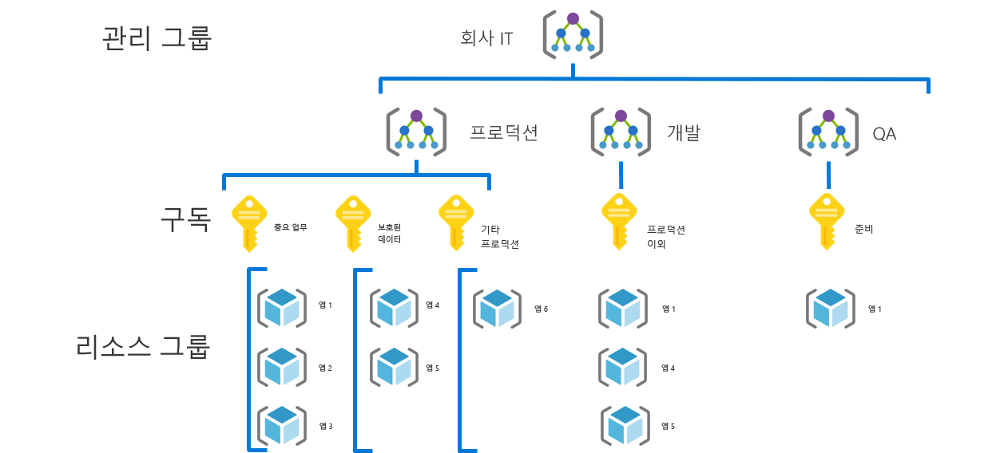
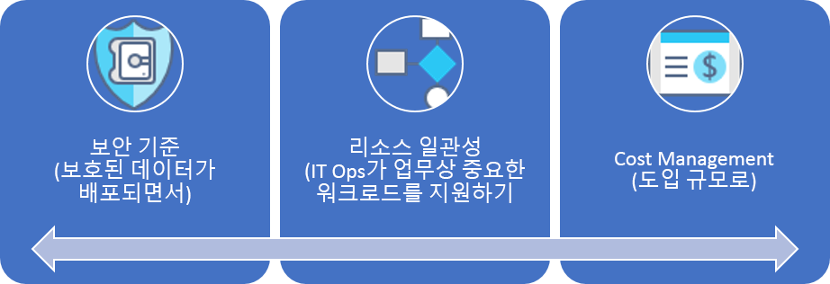

# 중소기업 거버넌스 과정

## 모범 사례 개요

이 거버넌스 과정은 거버넌스 성숙도의 여러 단계를 거치면서 가상 회사의 경험을 따릅니다. 실제 고객 경험을 기반으로 합니다. 제안된 모범 사례는 가상의 회사의 제약 조건 및 요구를 기반으로 합니다.

빠른 시작 지점인, 이 개요에서는 모범 사례를 기반으로 거버넌스에 대한 MVP(최소 실행 가능 제품)를 정의합니다. 또한 새로운 비즈니스 또는 기술 위험이 드러나면서 모범 사례를 추가하는 거버넌스 개선에 대한 링크도 제공합니다.

> [!WARNING]
> 이러한 MVP는 일련의 가정 세트를 기반으로 하는 기본 시작 지점입니다. 최소한의 모범 사례도 위험 허용 오차 및 고유의 비즈니스 위험으로 인한 기업 정책을 기반으로 합니다. 이러한 가정이 적용 가능한지 확인하려면 이 문서에 나오는 [긴 이야기](./narrative.md)를 참조하세요.

## 거버넌스 모범 사례

이 모범 사례는 조직이 여러 Azure 구독에 거버넌스 보호책을 빠르고 일관성 있게 추가하는 데 사용할 수 있는 토대의 역할을 합니다.

### 리소스 조직

다음 다이어그램은 조직 리소스에 대한 거버넌스 MVP 계층 구조를 보여줍니다.

모든 애플리케이션은 관리 그룹, 구독 및 리소스 그룹 계층 구조의 적절한 영역에 배포되어야 합니다. 배포를 계획하는 동안 클라우드 거버넌스 팀은 클라우드 도입 팀의 역량을 강화하기 위해 계층 구조에 필요한 노드를 만들게 됩니다.  

1. 환경 유형별 관리 그룹입니다(예: 프로덕션, 개발 및 테스트).
2. 각 "애플리케이션 분류"에 대한 구독입니다.
3. 각 애플리케이션에 대한 별도의 리소스 그룹입니다.
4. 그룹화 계층 구조의 각 수준에는 일관된 명명법이 적용되어야 합니다.

다음은 사용 중인 패턴의 예입니다.

이러한 패턴은 계층 구조를 쓸데없이 복잡하게 만들지 않으면서 성장의 여지를 제공합니다.

[!INCLUDE [governance-of-resources](../../../../../includes/cloud-adoption/governance/governance-of-resources.md)]

## 거버넌스 개선

이 MVP가 배포된 후 추가적인 거버넌스 계층을 환경에 신속하게 통합할 수 있습니다. 다음은 특정 비즈니스 요구 사항에 맞게 MVP를 개선하는 몇 가지 방법입니다.

- [보호된 데이터에 대한 보안 기준](./security-baseline-evolution.md)
- [중요 업무용 애플리케이션에 대한 리소스 구성](./resource-consistency-evolution.md)
- [Cost Management에 대한 제어](./cost-management-evolution.md)
- [다중 클라우드 개선을 위한 제어](./multi-cloud-evolution.md)

<!-- markdownlint-disable MD026 -->

## 이 모범 사례로 무엇을 할 수 있습니까?

MVP에는, 기업 정책을 신속히 적용할 수 있도록 [배포 가속화](../../deployment-acceleration/overview.md) 분야의 사례와 도구가 설정되어 있습니다. 특히, MVP는 가상의 회사에 대한 이야기에 정의된 대로 Azure Blueprints, Azure Policy 및 Azure 관리 그룹을 사용하여 몇 가지 기본적인 회사 정책을 적용합니다. 이러한 회사 정책은 ID와 보안에 대한 매우 작은 기준을 설정하기 위해 Resource Manager 템플릿과 Azure 정책을 사용하여 적용됩니다.

## 발전하는 모범 사례

시간이 지나면서, 거버넌스 MVP는 거버넌스 사례를 발전시키는 데 사용됩니다. 도입이 진행되면서 비즈니스 위험도 증가합니다. 이러한 위험을 완화하기 위해 CAF 거버넌스 모델 내에서 다양한 분야가 개선됩니다. 이 시리즈의 뒷부분에 나오는 문서에서는 가상의 회사에 영향을 주는 회사 정책의 발전에 대해 설명합니다. 이러한 발전은 세 가지 분야에서 진행됩니다.

- Cost Management는 도입 규모 변화와 관련됩니다.
- 보안 기준은 보호된 데이터 배포와 관련이 있습니다.
- 리소스 일관성은 IT 운영을 통해 중요 업무용 워크로드를 지원하는 것과 관련이 있습니다.

## 다음 단계

거버넌스 MPV를 이해했고 따라야 할 거버넌스 개선에 대한 아이디어를 얻었으면, 추가적인 컨텍스트를 뒷받침하는 이야기를 읽어보십시오.

> [!div class="nextstepaction"]
> [뒷받침하는 이야기 읽어보기](./narrative.md)
