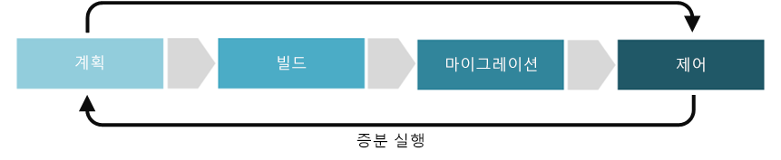

# 리소스 일관성 분야 개선

리소스 일관성 분야에서는 환경, 애플리케이션 또는 워크로드의 작업 관리와 관련된 정책을 설정하는 방법에 중점을 둡니다. 5개 클라우드 거버넌스 분야 내에서 리소스 일관성에는 애플리케이션, 워크로드 및 자산 성능에 대한 모니터링이 포함됩니다. 또한 리소스 일관성에는 확장 요구 사항을 충족하고, 성능 SLA(서비스 수준 약정) 위반을 수정하고, 자동 수정을 통해 SLA 위반을 사전에 방지하는 데 필요한 작업도 포함됩니다.

이 문서에서는 리소스 일관성 분야를 더욱 효율적으로 개발하고 완성도를 높이기 위해 회사가 수행할 수 있는 몇 가지 작업을 간략하게 설명합니다. 이러한 작업은 클라우드 솔루션을 구현하는 과정의 계획, 빌드, 도입, 운영 단계로 구분한 다음, [클라우드 거버넌스에 대한 증분 방식](../journeys/overview.md#an-incremental-approach-to-cloud-governance)의 개발을 허용하는 과정에서 이러한 단계를 반복적으로 수행하게 됩니다.

*그림 1. 클라우드 거버넌스의 증분 방식 도입 단계.*

한 문서에서 모든 비즈니스의 요구 사항을 설명할 수는 없습니다. 따라서 이 문서에서는 거버넌스 완성 프로세스의 각 단계에서 권장되는 최소 활동과 수행할 가능성이 있는 활동의 예를 간략하게 설명합니다. 이러한 활동의 초기 목표는 [정책 MVP](../journeys/overview.md#an-incremental-approach-to-cloud-governance)를 빌드하고 증분 방식 정책 개선을 위한 프레임워크를 설정하는 것입니다. 클라우드 거버넌스 팀은 리소스 일관성 거버넌스 기능을 개선하려면 이러한 활동에 투자할 비용을 결정해야 합니다.

> [!CAUTION]
> 이 문서에서 설명하는 최소 활동과 수행할 가능성이 있는 활동은 특정 기업 정책 또는 타사 규정 준수 요구 사항을 기준으로 작성된 것이 아닙니다. 이 지침은 클라우드 거버넌스 모델을 사용하여 두 요구 사항을 모두 충족하기 위한 논의를 원활하게 진행할 수 있도록 설계되었습니다.

## 계획 및 준비

이 거버넌스 완성 과정 단계에서는 서로 분리되어 있는 사업 결과와 실행 가능한 전략을 연결합니다. 이 프로세스에서는 리더십 팀이 특정 메트릭을 정의하여 디지털 자산에 매핑한 다음, 전반적인 마이그레이션 작업 계획을 시작합니다.

**최소 권장 활동:**

* [리소스 일관성 도구 체인](toolchain.md) 옵션을 평가합니다.
* 클라우드 전략에 대한 라이선스 요구 사항을 이해합니다.
* 초안 아키텍처 지침 문서를 개발하여 주요 관련자에게 배포합니다.
* 사용하는 Resource Manager에 익숙해져서 솔루션에 대한 모든 리소스를 그룹으로 배포, 관리 및 모니터링합니다.
* 아키텍처 지침 개발에서 영향을 받은 직원과 팀을 교육하고 포함합니다.
* 우선 순위가 지정된 리소스 배포 작업을 마이그레이션 백로그에 추가합니다.

**수행할 가능성이 있는 활동:**

* 비즈니스 이해 관계자 및/또는 클라우드 전략 팀을 사용하여 전체 사업부 및 조직 내에서 원하는 클라우드 계정 관리 방식 및 비용 계정 사례를 이해합니다.
* [모니터링 및 정책 적용](compliance-processes.md) 요구 사항을 정의합니다.
* 수정 정책 및 SLA 요구 사항을 정의하려면 가동 중단 비용과 비즈니스 가치를 검사합니다.
* 리소스에 대한 [간단한 워크로드](./governance-simple-workload.md) 또는 [여러 팀](./governance-multiple-teams.md)의 거버넌스 전략을 배포할지 여부를 결정합니다.
* 계획된 워크로드의 확장성 요구 사항을 확인합니다.

## 빌드 및 배포 전 단계

환경을 성공적으로 마이그레이션하려면 여러 가지 기술 및 비기술적 필수 구성 요소가 필요합니다. 이 프로세스는 의사 결정, 준비 및 마이그레이션을 진행하는 핵심 인프라에 중점을 둡니다.

**최소 권장 활동:**

* [리소스 일관성 도구 체인](toolchain.md)을 배포 전 단계에서 롤아웃하여 구현합니다.
* 아키텍처 지침 문서를 업데이트하여 주요 관계자에게 배포합니다.
* 우선 순위가 지정된 마이그레이션 백로그에서 리소스 배포 작업을 구현합니다.
* 교육 자료와 설명서, 인식 정보, 인센티브 및 기타 프로그램을 개발하여 사용자 도입을 촉진할 수 있습니다.

**수행할 가능성이 있는 활동:**

* [구독 디자인 전략](../../decision-guides/subscriptions/overview.md)을 결정하고, 조직 및 워크로드 요구에 가장 잘 맞는 구독 패턴을 선택합니다.
* [리소스 일관성 전략](../../decision-guides/resource-consistency/overview.md)을 사용하여 시간에 따라 아키텍처 지침을 적용합니다.
* 리소스가 조직 및 계정 요구 사항에 맞도록 [리소스 이름 지정 및 태그 지정 표준](../../decision-guides/resource-tagging/overview.md)을 구현합니다.
* 자동 관리 지정 시간 거버넌스를 만들려면 배포 템플릿 및 자동화를 사용하여 리소스 및 리소스 그룹을 배포하는 경우 일반적인 구성 및 일관된 그룹화 구조를 적용합니다.
* 기본적으로 사용자가 사용 권한이 없는 최소 권한의 사용 권한 모델을 설정합니다.
* 각 워크로드 및 계정을 소유하는 조직의 구성원 및 이러한 리소스를 유지 관리하거나 수정하려면 액세스해야 하는 구성원을 확인합니다. 이러한 요구 사항에 맞는 클라우드 역할 및 책임을 정의하고, 액세스 제어에 대한 기준으로 이러한 역할을 사용합니다.
* 리소스 간 종속성을 정의합니다.
* 자동화된 리소스 크기 조정을 구현하여 계획 단계에서 정의된 요구 사항에 맞춥니다.
* 수신된 서비스의 품질을 측정하려면 액세스 성능을 수행합니다.
* 구성 설정 및 리소스 생성 규칙을 사용하여 SLA 적용을 관리하려면 [정책](/azure/governance/policy/overview)을 배포하는 것이 좋습니다.

## 도입 및 마이그레이션

마이그레이션은 기존 디지털 자산의 애플리케이션이나 워크로드 이동, 테스트 및 도입에 중점을 두는 증분 방식 프로세스입니다.

**최소 권장 활동:**

* [리소스 일관성 도구 체인](toolchain.md)을 배포 전 환경에서 프로덕션 환경으로 마이그레이션합니다.
* 아키텍처 지침 문서를 업데이트하여 주요 관계자에게 배포합니다.
* 교육 자료와 설명서, 인식 정보, 인센티브 및 기타 프로그램을 개발하여 사용자 도입을 촉진할 수 있습니다.
* 기존 자동화된 재구성 스크립트나 도구를 마이그레이션하여 정의된 SLA 요구 사항을 지원합니다.

**수행할 가능성이 있는 활동:**

* 모니터링 및 보고 데이터를 완료하고 테스트합니다. 선택한 온-프레미스, 클라우드 게이트웨이 또는 하이브리드 솔루션을 사용하여.
* 리소스에 대한 SLA 또는 관리 정책을 변경해야 하는지를 결정합니다.
* 클라우드 자산에서 리소스를 효율적으로 검색하려면 쿼리 기능을 구현하여 작업을 개선합니다.
* 리소스를 비즈니스 요구 사항 및 거버넌스 요구 사항 변경에 맞춥니다.
* 가상 머신, 가상 네트워크 및 스토리지 계정이 각 릴리스 기간 동안 실제 리소스 액세스 요구 사항을 반영하고 필요에 따라 조정되는지 확인합니다.
* 자동화된 리소스의 크기 조정이 액세스 요구 사항을 충족하는지 확인합니다.
* 리소스, 리소스 그룹 및 Azure 구독에 대한 사용자 액세스를 검토하고, 필요에 따라 액세스 제어를 조정합니다.
* 리소스 액세스 계획의 변화를 모니터링하고, 관계자와 함께 추가 로그오프가 필요한지 여부의 유효성을 검사합니다.
* 실제 비용을 반영하도록 아키텍처 지침 문서의 변경 내용을 업데이트합니다.
* 사업부의 P&L에 따라 명확한 재무 조정이 조직에 필요한지 여부를 결정합니다.
* 글로벌 조직에서는 SLA 규정 준수 또는 주권 요구 사항을 구현합니다.
* 클라우드 집계의 경우 클라우드 공급 기업에 게이트웨이 솔루션을 배포합니다.
* 하이브리드 또는 게이트웨이 옵션을 허용하지 않는 도구에서는 모니터링과 작동 모니터링 도구를 긴밀하게 결합합니다.

## 작동 및 구현 후 작업

변환이 완료되면 애플리케이션이나 워크로드의 원래 수명 주기 동안 거버넌스와 관련 작업이 실행되어야 합니다. 이 거버넌스 완성 과정 단계에서는 일반적으로 솔루션이 구현되고 변환 주기가 안정화되기 시작한 후에 진행되는 활동을 중점적으로 수행합니다.

**최소 권장 활동:**

* 조직의 변화하는 Cost Management 요구 사항에 대한 업데이트에 따라 [리소스 일관성 도구 체인](toolchain.md)을 사용자 지정합니다.
* 실제 리소스 사용량을 반영하도록 알림과 보고서를 자동화하는 것이 좋습니다.
* 향후 도입 프로세스에서 참조할 수 있도록 아키텍처 지침을 구체적으로 작성합니다.
* 아키텍처 지침을 계속 준수할 수 있도록 영향을 받는 팀을 대상으로 정기 교육을 진행합니다.

**수행할 가능성이 있는 활동:**

* 실제 리소스 변경 내용을 반영하도록 분기별로 계획을 조정합니다.
* 향후 배포 시 거버넌스 요구 사항을 자동으로 적용합니다.
* 사용률이 낮은 리소스를 평가하여 계속 사용할 가치가 있는지를 결정합니다.
* 계획적 리소스 사용량 및 실제 리소스 사용량 간의 불일치 및 잘못된 부분을 검색합니다.
* 클라우드 도입 팀과 클라우드 전략 팀이 이러한 잘못된 부분을 파악하여 해결할 수 있도록 지원합니다.
* 청구 및 SLA에 대한 리소스 일관성을 변경해야 하는지를 결정합니다.
* 온-프레미스, 클라우드 게이트웨이 또는 하이브리드 솔루션에 조정이 필요한지 여부를 결정하는 로깅 및 모니터링 도구를 평가합니다.
* 사업부 및 지리적으로 분산된 그룹에서는 중앙 집중식 정책을 더 잘 적용하고 SLA 요구 사항을 충족하려면 조직이 추가 클라우드 관리 기능(예: [Azure 관리 그룹](/azure/governance/management-groups/))을 사용하는 것이 좋은지를 결정해야 합니다.

## 다음 단계

이제 클라우드 리소스 거버넌스의 개념을 이해했으므로 [단일 워크로드](governance-simple-workload.md) 또는 [여러 팀](governance-multiple-teams.md)에 대해 거버넌스 모델을 디자인하는 방법을 알아보기 위한 준비 과정으로 Azure에서 [리소스 액세스를 관리하는 방법](azure-resource-access.md)에 대해 자세히 알아보세요.

> [!div class="nextstepaction"]
> [Azure의 리소스 액세스에 대해 알아보기](azure-resource-access.md)
> [Azure의 SLA에 대해 알아보기](https://azure.microsoft.com/support/legal/sla/)
> [로깅, 보고 및 모니터링에 대해 알아보기](../../decision-guides/log-and-report/overview.md)
