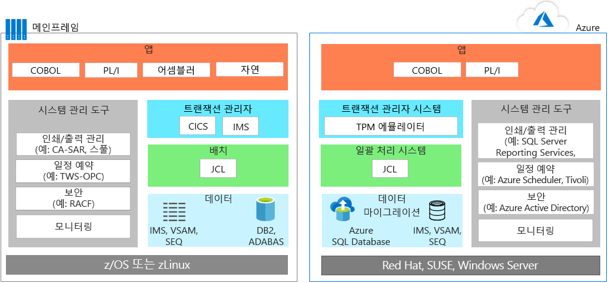
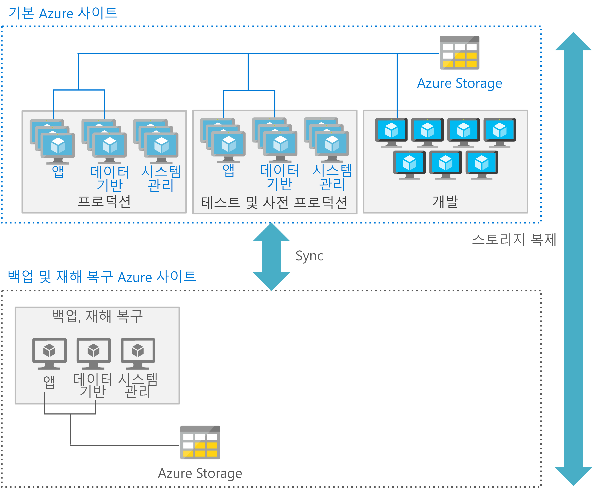

# 메인프레임 애플리케이션 마이그레이션

대다수 팀은 메인프레임 환경에서 Azure로 애플리케이션을 마이그레이션할 때 실용적인 방식을 따릅니다. 즉, 가능한 위치와 상황에서는 항상 애플리케이션을 재사용하고, 애플리케이션이 재작성되거나 교체되면 단계별 배포를 시작합니다.

애플리케이션 마이그레이션에서는 대개 다음 전략을 하나 이상 사용합니다.

- 다시 호스트: 기존 코드, 프로그램 및 애플리케이션을 메인프레임에서 이동한 다음 클라우드 인스턴스에서 호스트되는 메인프레임 에뮬레이터에서 실행할 수 있도록 코드를 다시 컴파일할 수 있습니다. 이 방식에서는 대개 클라우드 기반 에뮬레이터로 애플리케이션을 이동한 다음 클라우드 기반 데이터베이스로 데이터베이스를 마이그레이션합니다. 이 경우 데이터 및 파일 변환과 함께 엔지니어링과 리팩터링도 어느 정도 수행해야 합니다.

    기존 호스팅 공급자를 사용하여 애플리케이션을 다시 호스트할 수도 있습니다. 클라우드의 주요 이점 중 하나는 인프라 관리를 아웃소싱할 수 있다는 것입니다. 즉, 메인프레임 워크로드를 호스트할 데이터 센터 공급자를 선택할 수 있습니다. 이 모델을 사용하면 시간을 절약하고, 특정 공급업체만 사용해야 하는 위험을 줄이고, 중간 비용을 절약할 수 있습니다.

- 사용 중지: 더 이상 필요하지 않은 애플리케이션은 마이그레이션 전에 사용을 중지해야 합니다.

- 다시 빌드: 최신 기술을 사용해 프로그램을 완전히 재작성하는 조직도 있습니다. 비용과 복잡한 작업이 추가로 발생하는 이 방식은 리프트 앤 시프트 방식처럼 흔히 사용되지는 않습니다. 이러한 유형의 마이그레이션을 수행한 후에는 대개 코드 변환 엔진을 사용하여 모듈과 코드 교체를 시작하는 것이 좋습니다.

- 다음을 이 방식에서는 메인프레임 기능을 클라우드의 동일 기능으로 교체합니다. 교체 옵션의 예로는 재무/인사/제조/전사적 자원 계획 등의 기업 문제 해결 전용으로 작성된 솔루션을 사용하는 SaaS(Software as a Service)가 있습니다. 또한 이전에는 사용자 지정 메인프레임 솔루션에서 해결해야 했던 문제를 이제는 대다수 업계별 앱에서도 해결할 수 있습니다.

처음 마이그레이션할 워크로드부터 계획한 다음 관련 애플리케이션, 레거시 코드베이스 및 데이터베이스 이동을 위한 요구 사항을 결정해야 합니다.

## Azure의 메인프레임 에뮬레이션

Azure 클라우드 서비스는 기존 메인프레임 환경을 에뮬레이트할 수 있으므로 기존 메인프레임 코드와 애플리케이션을 재사용할 수 있습니다. 에뮬레이트할 수 있는 일반적인 서버 구성 요소로는 OLTP(온라인 트랜잭션 처리), 일괄 처리, 데이터 수집 시스템 등이 있습니다.

### OLTP 시스템

대부분의 메인프레임에는 매우 많은 사용자의 업데이트를 수천 건, 많게는 수백만 건까지 처리하는 OLTP 시스템이 있습니다. 이러한 애플리케이션은 대개 CICS(고객 정보 제어 시스템), IMS(정보 관리 시스템), TIP(터미널 인터페이스 프로세서)와 같은 트랜잭션 처리 및 화면 양식 처리 소프트웨어를 사용합니다.

OLTP 애플리케이션을 Azure로 이동할 때는 Azure에서 VM(가상 머신)을 사용해 메인프레임 TP(트랜잭션 처리) 모니터용 에뮬레이터를 IaaS(Infrastructure as a Service)로 실행할 수 있습니다. 또한 웹 서버에서 화면 처리 및 양식 기능을 구현할 수도 있습니다. 이 방식을 ADO(ActiveX Data Objects), ODBC(Open Database Connectivity), JDBC(Java Database Connectivity) 등의 데이터 액세스 및 트랜잭션용 데이터베이스 API와 함께 사용할 수 있습니다.

### 시간 제약이 있는 일괄 업데이트

금융, 보험, 정부의 시스템과 같은 대부분의 메인프레임 시스템은 매월 또는 매년 수백만 건의 계정 레코드 업데이트를 수행합니다. 메인프레임은 처리량이 높은 데이터 처리 시스템을 제공하여 이러한 유형의 워크로드를 처리합니다. 메인프레임 일괄 작업은 보통 직렬로 진행되며, 성능 개선을 위해 메인프레임 백본에서 제공되는 IOPS(초당 입/출력 작업)에 따라 다른 방식으로 수행됩니다.

클라우드 기반 일괄 처리 환경에서는 성능 개선을 위해 병렬 컴퓨팅 및 고속 네트워크를 사용합니다. 일괄 처리 성능을 최적화하려는 고객을 위해 Azure에서는 다양한 컴퓨팅, 스토리지 및 네트워킹 옵션을 제공합니다.

### 데이터 수집 시스템

메인프레임은 소매, 금융 서비스, 제조 및 기타 솔루션에서 대규모 데이터 배치를 처리용으로 수집합니다. Azure에서는 [AzCopy](/azure/storage/common/storage-use-azcopy) 등의 간단한 명령줄 유틸리티를 사용하여 스토리지 위치 간에 데이터를 복사할 수 있습니다. [Azure Data Factory](/azure/data-factory/introduction) 서비스를 사용할 수도 있습니다. 이 경우에는 개별 데이터 저장소의 데이터를 수집하여 데이터 기반 워크플로를 만들고 예약할 수 있습니다.

Azure에서는 에뮬레이션 환경 외에 기존 메인프레임 환경을 개선할 수 있는 PaaS(Platform as a Service) 및 분석 서비스도 제공합니다.

## Azure로 OLTP 워크로드 마이그레이션

리프트 앤 시프트 방식은 기존 애플리케이션을 Azure로 빠르게 마이그레이션할 수 있는 코드 없는 옵션입니다. 각 애플리케이션이 현재 상태대로 마이그레이션되므로 코드 변경 위험이나 비용 없이 클라우드의 혜택이 제공됩니다. Azure에서 메인프레임 TP(트랜잭션 처리) 모니터용 에뮬레이터를 사용하면 이 방식이 지원됩니다.

다양한 공급업체를 통해 구매할 수 있으며 가상 머신에서 실행되는 TP 모니터는 Azure의 IaaS(Infrastructure as a Service) 옵션입니다. 아래 다이어그램에는 IBM z/OS 메인프레임에서 DBMS(관계형 데이터베이스 관리 시스템)인 IBM DB2를 통해 지원되는 온라인 애플리케이션을 마이그레이션하기 전과 마이그레이션한 후의 상태가 나와 있습니다. z/OS용 DB2는 VSAM(가상 스토리지 액세스 방법) 파일을 사용하여 플랫 파일용 ISAM(Indexed Sequential Access Method) 및 데이터를 저장합니다. 이 아키텍처는 트랜잭션 모니터링용 CICS도 사용합니다.

Azure에서는 에뮬레이션 환경을 사용하여 JCL을 사용하는 일괄 작업과 TP 관리자를 실행합니다. 데이터 계층에서 DB2는 [Azure SQL Database](/azure/sql-database/sql-database-technical-overview)로 교체되지만 Microsoft SQL Server, DB2 LUW 또는 Oracle Database도 사용할 수 있습니다. 에뮬레이터는 IMS, VSAM 및 SEQ를 지원합니다. 메인프레임의 시스템 관리 도구는 Azure 서비스 및 VM에서 실행되는 타 공급업체의 소프트웨어로 교체됩니다.

화면 처리 및 양식 입력 기능은 보통 웹 서버를 사용하여 구현됩니다. 이러한 웹 서버는 ADO, ODBC, JDBC 등의 데이터 액세스 및 트랜잭션용 데이터베이스 API와 함께 사용할 수 있습니다. 사용해야 하는 정확한 Azure IaaS 구성 요소는 선호하는 운영 체제에 따라서 달라집니다. 예: 

- Windows 기반 VM: IIS(Internet Information Server) + 화면 처리 및 비즈니스 논리용 ASP.NET. 데이터 액세스 및 트랜잭션에는 ADO.NET을 사용합니다.

- Linux 기반 VM: Java 기반 비즈니스 기능 및 화면 처리용 Apache Tomcat 등의 사용 가능한 Java 기반 애플리케이션 서버. 데이터 액세스 및 트랜잭션에는 JDBC를 사용합니다.

## Azure로 일괄 처리 워크로드 마이그레이션

Azure의 일괄 처리 작업은 메인프레임의 일반적인 일괄 처리 환경과는 다릅니다. 메인프레임 일괄 작업은 보통 직렬로 진행되며, 성능 개선을 위해 메인프레임 백본에서 제공되는 IOPS에 따라 다른 방식으로 수행됩니다. 클라우드 기반 일괄 처리 환경에서는 성능 개선을 위해 병렬 컴퓨팅 및 고속 네트워크를 사용합니다.

Azure를 사용하여 일괄 처리 성능을 최적화하려면 다음과 같이 [컴퓨팅](/azure/virtual-machines/windows/overview), [스토리지](/azure/storage/blobs/storage-blobs-introduction), [네트워킹](https://azure.microsoft.com/blog/maximize-your-vm-s-performance-with-accelerated-networking-now-generally-available-for-both-windows-and-linux/) 및 [모니터링](/azure/azure-monitor/overview) 옵션을 사용하는 것이 좋습니다.

### 컴퓨팅

사용:

- 클록 속도가 가장 빠른 VM. 메인프레임 애플리케이션은 단일 스레드로 구성되는 경우가 많으며, 메인프레임 CPU는 클록 속도가 매우 빠릅니다.

- 데이터 및 애플리케이션 작업 영역을 캐시할 수 있는 대용량의 메모리가 포함된 VM

- 애플리케이션이 여러 스레드를 지원하는 경우 다중 스레드 처리를 활용할 수 있도록 vCPU의 밀도가 높은 VM

- 병렬 처리(Azure는 병렬 처리를 위해 스케일 아웃되기 쉬우므로 일괄 처리 실행을 위한 추가 컴퓨팅 기능을 제공해야 함)

### Storage

사용:

- IOPS를 최대한 활용할 수 있는 [Azure 프리미엄 SSD](/azure/virtual-machines/windows/premium-storage) 또는 [Azure 울트라 SSD](/azure/virtual-machines/windows/disks-ultra-ssd)

- 여러 디스크를 사용한 스트라이핑(스토리지 크기당 IOPS가 더 높아짐)

- 스토리지 분할(여러 Azure 스토리지 디바이스로 IO 분산)

### 네트워킹

- 대기 시간 최소화를 위해 [Azure 가속 네트워킹](/azure/virtual-network/create-vm-accelerated-networking-powershell)을 사용합니다.

### 모니터링

- 모니터링 도구, [Azure Monitor](/azure/azure-monitor/overview), [Azure Application Insights](/azure/application-insights/app-insights-overview)를 사용합니다. 관리자는 Azure 로그에서도 일괄 처리 실행이 과도하게 수행되는지를 모니터링하고 병목 상태를 해소할 수 있습니다.

## 개발 환경 마이그레이션

클라우드의 분산 아키텍처는 최신 사례 및 프로그래밍 언어의 이점을 제공하는 다양한 개발 도구 세트를 사용합니다. 이러한 아키텍처를 쉽게 전환하려는 경우 IBM z/OS 환경을 에뮬레이션하는 용도로 사용되는 다른 도구와 개발 환경을 함께 사용할 수 있습니다. 아래 목록에는 Microsoft 및 기타 공급업체의 옵션이 나와 있습니다.

| 구성 요소        | Azure 옵션                                                                                                                                  |
|------------------|---------------------------------------------------------------------------------------------------------------------------------------------------|
| z/OS             | Windows, Linux 또는 UNIX                                                                                                                      |
| CICS             | Micro Focus, Oracle, GT Software(Fujitsu), TmaxSoft, Raincode 및 NTT Data에서 제공하는 Azure 서비스를 사용하거나 Kubernetes를 사용하여 재작성 |
| IMS              | Micro Focus 및 Oracle에서 제공하는 Azure 서비스 사용                                                                                  |
| 어셈블러        | Raincode 및 TmaxSoft에서 제공하는 Azure 서비스를 사용하거나, COBOL/C/Java를 사용하거나, 운영 체제 함수에 매핑               |
| JCL              | JCL, PowerShell 또는 기타 스크립팅 도구 사용                                                                                                   |
| COBOL            | COBOL, C 또는 Java                                                                                                                            |
| Natural          | Natural, COBOL, C 또는 Java                                                                                                                  |
| FORTRAN 및 PL/I | FORTRAN, PL/I, COBOL, C 또는 Java                                                                                                           |
| REXX 및 PL/I    | REXX, PowerShell 또는 기타 스크립팅 도구                                                                                                  |

## 데이터베이스 및 데이터 마이그레이션

애플리케이션을 마이그레이션할 때는 보통 데이터 계층을 다시 호스트합니다. [Azure Database Migration Service](/azure/dms/dms-overview)를 사용하여 SQL Server, 오픈 소스 및 기타 관계형 데이터베이스를 [Azure SQL Database Managed Instance](/azure/sql-database/sql-database-managed-instance), [Azure Database Service for PostgreSQL](/azure/postgresql/overview) 및 [Azure Database for MySQL](/azure/mysql/overview)과 같은 Azure의 완전 관리형 솔루션으로 마이그레이션할 수 있습니다.

예를 들어 메인프레임 데이터 계층에서 다음 항목을 사용하는 경우 마이그레이션을 할 수 있습니다.

- IBM DB2 또는 IMS 데이터베이스를 사용하는 경우 Azure에서 Azure SQL Database/SQL Server/DB2 LUW/Oracle Database를 사용합니다.

- VSAM 및 기타 플랫 파일을 사용하는 경우 Azure SQL, SQL Server, DB2 LUW 또는 Oracle용 ISAM(Indexed Sequential Access Method) 플랫 파일을 사용합니다.

- GDG(Generation Date Group)를 사용하는 경우 Azure에서 GDG와 비슷한 기능을 제공하는 명명 규칙 및 파일 이름 확장을 사용하는 파일로 마이그레이션합니다.

IBM 데이터 계층에도 마이그레이션해야 하는 여러 주요 구성 요소가 포함되어 있습니다. 예를 들어 데이터베이스를 마이그레이션하는 경우에는 풀에 포함된 데이터 컬렉션도 마이그레이션해야 합니다. 이러한 각 컬렉션에는 dbextent(z/OS VSAM 데이터 세트)가 포함됩니다. 스토리지 풀의 데이터 위치를 식별하는 디렉터리를 마이그레이션에 포함해야 합니다. 또한 마이그레이션 계획에서는 데이터베이스에 대해 수행하는 작업 레코드가 포함된 데이터베이스 로그를 고려해야 합니다. 데이터베이스 하나에 로그 하나, 2개(이중 또는 대체) 또는 4개(이중 및 대체)가 포함될 수 있습니다.

데이터베이스 마이그레이션에는 다음 구성 요소도 포함됩니다.

- 데이터베이스 관리자: 데이터베이스의 데이터 액세스 권한을 제공합니다. 데이터베이스 관리자는 z/OS 환경의 자체 파티션에서 실행됩니다.

- 애플리케이션 요청자: 애플리케이션의 요청을 애플리케이션 서버로 전달하기 전에 수락합니다.

- 온라인 리소스 어댑터: CICS 트랜잭션에서 사용할 애플리케이션 요청자 구성 요소를 포함합니다.

- 일괄 처리 리소스 어댑터: z/OS 일괄 처리 애플리케이션용으로 애플리케이션 요청자 구성 요소를 구현합니다.

- ISQL(대화형 SQL): 사용자가 SQL 문이나 연산자 명령을 입력할 수 있도록 CICS 애플리케이션 및 인터페이스로 실행됩니다.

- CICS 애플리케이션: CICS에서 제공되는 리소스와 데이터 원본을 사용하여 CICS의 제어하에 실행됩니다.

- 일괄 처리 애플리케이션: 사용자와의 대화형 통신 없이 프로세스 논리를 실행하여 대량 데이터 업데이트를 생성하거나 데이터베이스에서 보고서를 생성하는 등의 작업을 수행합니다.

## Azure의 크기 조정 및 처리량 최적화

일반적으로 메인프레임은 '강화'되는 반면 클라우드는 '스케일 아웃'됩니다. Azure에서 실행되는 메인프레임 스타일 애플리케이션의 크기 조정 기능과 처리량을 최적화하려면 메인프레임이 애플리케이션을 분리하고 격리하는 방식을 이해해야 합니다. z/OS 메인프레임은 LPAR(논리 파티션) 기능을 사용하여 단일 인스턴스의 특정 애플리케이션용으로 리소스를 격리하고 관리합니다.

예를 들어 메인프레임은 COBOL 프로그램이 연결된 CICS 영역과 DB2용으로 각기 별도의 LPAR(논리 파티션)을 사용할 수 있습니다. 추가 LPAR은 개발, 테스트 및 스테이징 환경에 사용되는 경우가 많습니다.

Azure에서는 보통 이러한 용도로 별도의 VM을 사용합니다. Azure 아키텍처에서는 일반적으로 애플리케이션 계층, 데이터 계층, 개발 등을 위해 각기 별도의 VM 세트가 배포됩니다. 해당 환경에 가장 적합한 유형의 VM과 기능을 사용하면 각 처리 계층을 최적화할 수 있습니다.

또한 각 계층에서 적절한 재해 복구 서비스를 제공할 수도 있습니다. 프로덕션 VM과 데이터베이스 VM에는 핫 복구나 웜 복구가 필요한 반면 개발 및 테스트 VM은 콜드 복구를 지원하는 경우를 예로 들 수 있습니다.

아래 그림에는 기본 사이트와 보조 사이트를 사용하여 구축할 수 있는 Azure 배포가 나와 있습니다. 기본 사이트에서는 가용성이 높은 프로덕션, 사전 프로덕션 및 테스트 VM이 배포됩니다. 보조 사이트는 백업 및 재해 복구용입니다.

## Azure로의 미리 구성된 메인프레임 마이그레이션 수행

메인프레임에서 Azure로 솔루션을 이전할 때는 *미리 구성된* 마이그레이션을 수행하게 될 수 있습니다. 이 경우 일부 애플리케이션을 먼저 이전하며, 나머지 애플리케이션은 임시로 또는 영구적으로 메인프레임에 남아 있습니다. 이 방식을 사용하는 경우 일반적으로 메인프레임과 Azure 간의 애플리케이션 및 데이터베이스 상호 운용을 허용하는 시스템이 필요합니다.

이러한 방식의 일반적인 시나리오로는 애플리케이션이 사용하는 데이터는 메인프레임에 유지하고 애플리케이션만 Azure로 이동하는 경우를 들 수 있습니다. 특정 소프트웨어를 사용하여 Azure의 애플리케이션이 메인프레임의 데이터에 액세스할 수 있도록 설정합니다. Azure와 기존 메인프레임 환경 간의 통합, 하이브리드 시나리오 지원, 그리고 장기적인 마이그레이션 기능을 지원하는 솔루션이 많이 있습니다. 이 과정에서 Microsoft 파트너, ISV(Independent Software Vendor) 및 SI(시스템 통합자)의 지원을 받을 수 있습니다.

사용 가능한 지원 옵션의 예로는 [Microsoft Host Integration Server](/host-integration-server)(HIS)가 있습니다. HIS는 Azure의 애플리케이션이 메인프레임에 남아 있는 DB2의 데이터에 액세스하는 데 필요한 DRDA(분산 관계형 데이터베이스 아키텍처)를 제공하는 솔루션입니다. 메인프레임과 Azure 통합에 사용할 수 있는 기타 옵션으로는 IBM, Attunity, Codit 및 기타 공급업체에서 제공하는 솔루션과 오픈 소스 옵션 등이 있습니다.

## 파트너 솔루션

메인프레임 마이그레이션을 고려 중이라면 파트너 에코시스템에서 지원을 받을 수 있습니다.

Azure는 현재 메인프레임에서 실행되는 시스템에 사용할 수 있는 가용성과 확장성이 뛰어난 검증된 인프라를 제공합니다. 비교적 쉽게 마이그레이션할 수 있는 워크로드도 있는 반면 CICS, IMS 등 레거시 시스템 소프트웨어를 사용하는 워크로드는 파트너 솔루션을 사용하여 다시 호스트한 다음 장기적으로 Azure로 마이그레이션할 수 있습니다. 어떤 옵션을 선택하든 Microsoft와 파트너는 메인프레임 시스템 소프트웨어 기능을 유지하면서 Azure를 사용할 수 있도록 환경을 최적화하는 과정을 지원해 드립니다.

파트너 솔루션 선택과 관련한 상세 지침은 [Platform Modernization Alliance](https://www.platformmodernization.org/pages/mainframe.aspx)를 참조하세요.

## 자세한 정보

자세한 내용은 다음 리소스를 참조하세요.

- [Azure 시작](/azure)

- [Platform Modernization Alliance: 메인프레임 마이그레이션](https://www.platformmodernization.org/pages/mainframe.aspx)

- [Azure에서 IBM DB2 pureScale 배포](https://azure.microsoft.com/resources/deploy-ibm-db2-purescale-on-azure)

- [Host Integration Server(HIS) 설명서](/host-integration-server)
