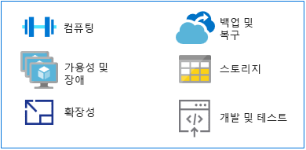

# 메인프레임에서 Azure로 전환

기존 메인프레임 애플리케이션 실행을 위한 대체 플랫폼인 Azure는 가용성이 뛰어난 환경에서 하이퍼스케일 컴퓨팅 및 스토리지를 제공합니다. 따라서 메인프레임 환경과 연관된 비용을 지출하지 않고도 최신 클라우드 기반 플랫폼의 유용한 기능과 빠른 속도를 활용할 수 있습니다.

이 섹션에서는 메인프레임 플랫폼에서 Azure로 전환하는 방법과 관련한 기술 지침을 제공합니다.

## MIPS와 vCPU 비교

메인프레임 워크로드를 실행하는 데 필요한 vCPU(가상 중앙 처리 장치)의 수를 계산할 수 있는 범용 매핑 수식은 없습니다. 그러나 Azure에서는 MIPS(Millions of Instructions Per Second) 메트릭이 vCPU 수에 매핑되는 경우가 많습니다. MPIS는 지정된 컴퓨터에 대해 초당 주기 수의 상수 값을 제공하는 방식으로 메인프레임의 전반적인 컴퓨팅 능력을 측정합니다.

소규모 조직의 경우 500MIPS 미만의 값이 필요할 수도 있지만 대규모 조직은 대개 5,000MIPS를 초과하는 명령을 사용합니다. MIPS 1개당 비용이 1,000달러라고 가정하면 대규모 조직은 MIPS가 5,000인 인프라를 배포하는 데 매년 약 5백만 달러를 지출하게 됩니다. 이러한 규모의 일반적인 Azure 배포에 대한 연간 예상 비용은 MIPS 인프라 비용의 1/10 정도에 불과합니다. 자세한 내용은 [메인프레임에서 Azure로의 마이그레이션 설명](https://azure.microsoft.com/resources/demystifying-mainframe-to-azure-migration) 백서의 표 4를 참조하세요.

Azure를 사용하는 경우 MIPS에 해당하는 vCPU 수의 정확한 계산 결과는 vCPU의 유형과 실행 중인 정확한 워크로드에 따라 달라집니다. 그러나 벤치마크 연구 결과를 참조하면 필요한 vCPU 수와 유형을 비교적 정확하게 예측할 수 있습니다. 최근 [HPE zREF 벤치마크](https://h20195.www2.hpe.com/v2/getpdf.aspx/4aa4-2452enw.pdf)에서는 다음과 같은 예상 수치를 제공하고 있습니다.

- 온라인(CICS) 작업용으로 HP Proliant 서버에서 실행되는 Intel 기반 코어당 MIPS - 288

- COBOL 일괄 작업용 Intel 코어당 MIPS - 170

이 가이드에서는 온라인 처리의 vCPU당 MIPS는 200이고 일괄 처리의 vCPU당 MIPS는 100이라고 가정합니다.

> [!NOTE]
> 이러한 예상치는 Azure에서 새로운 VM(가상 머신) 시리즈가 제공되면 변경될 수 있습니다.

## 고가용성 및 장애 조치(failover)

메인프레임 시스템은 메인프레임 커플링 및 Parallel Sysplex 사용 시 99.999%의 가용성을 제공하는 경우가 많습니다. 하지만 시스템 운영자는 유지 관리 및 IPL(시작 프로그램 로드)을 위한 가동 중지 시간을 예약해야 합니다. 그러므로 고급 Intel 기반 서버에서도 실제 가용성은 99%~99.9% 정도입니다.

반면 약정 기반 SLA(서비스 수준 계약)를 제공하는 Azure는 로컬/지역 기반 서비스 복제를 통해 최적화되므로 매우 높은 가용성이 기본적으로 보장됩니다.

Azure는 여러 스토리지 디바이스의 데이터를 로컬로 또는 다른 지역에 복제하는 방식을 통해 더욱 높은 가용성을 제공합니다. Azure 기반 장애가 발생하는 경우 컴퓨팅 리소스는 로컬 또는 지역 수준에서 복제된 데이터에 액세스할 수 있습니다.

[Azure SQL Database](/azure/sql-database/sql-database-technical-overview) 및 [Azure Cosmos Database](/azure/cosmos-db/introduction)와 같은 Azure PaaS(Platform as a Service) 리소스를 사용할 때는 Azure가 장애 조치(failover)를 자동으로 처리할 수 있습니다. Azure IaaS(Infrastructure as a Service)를 사용할 때는 SQL Server AlwaysOn 기능, 장애 조치(failover) 클러스터링 인스턴스, 가용성 그룹 등의 특정 시스템 기능이 장애 조치(failover)에 사용됩니다.

## 확장성

메인프레임은 일반적으로 강화되는 반면 클라우드 환경은 스케일 아웃됩니다. 메인프레임도 CF(커플링 기능)를 사용하면 스케일 아웃할 수는 있지만 하드웨어와 스토리지 비용이 많이 들기 때문에 스케일 아웃 비용이 매우 비쌉니다.

또한 CF는 긴밀하게 결합된 컴퓨팅 기능을 제공하는 반면 Azure의 스케일 아웃 기능은 느슨하게 결합되어 있습니다. 즉, 클라우드는 정확한 사용자 사양에 맞게 강화하거나 규모를 축소할 수 있으며 사용량 기반 청구 모델에 따라 주문형으로 컴퓨팅 기능/스토리지/서비스를 확장할 수 있습니다.

## Backup 및 복구

메인프레임 고객은 일반적으로 재해 복구 사이트를 유지 관리하거나 재해 대응을 위해 독립 메인프레임 공급자의 서비스를 이용합니다. 그리고 대개 오프라인 데이터 복사본을 사용하여 재해 복구 사이트와의 동기화를 수행합니다. 이 두 옵션은 모두 비용이 많이 듭니다.

메인프레임 커플링 기능을 통해 자동화된 지리적 중복 기능도 제공되지만, 해당 기능은 가격이 매우 비싸며 일반적으로는 중요 업무용 시스템용으로 예약됩니다. 반면 Azure에는 쉽게 구현할 수 있는 경제적인 [백업](/azure/backup/backup-introduction-to-azure-backup), [복구](/azure/site-recovery/site-recovery-overview) 및 [백업](/azure/storage/common/storage-redundancy) 옵션이 포함되어 있습니다. 로컬/지역 수준에서 또는 지리적 중복 기능을 통해 이러한 옵션을 사용할 수 있습니다.

## Storage

메인프레임 작동 방식을 이해하는 과정에서는 의미가 비슷한 여러 용어를 파악해야 합니다. 예를 들어 중앙 스토리지, 실제 메모리, 실제 스토리지, 주 스토리지 등의 용어는 대개 모두 메인프레임 프로세서에 직접 연결된 스토리지를 지칭합니다.

메인프레임 하드웨어에는 프로세서와 기타 여러 디바이스(예: DASD(직접 액세스 스토리지 디바이스), 자기 테이프 드라이브, 여러 유형의 사용자 콘솔)가 포함되어 있습니다. 테이프 및 DASD는 시스템 기능과 사용자 프로그램에 사용됩니다.

메인프레임용 실제 스토리지 유형은 다음과 같습니다.

- 중앙 스토리지: 메인프레임 프로세서에 직접 연결되어 있으며 프로세서, 실제 스토리지라고도 합니다.

- 보조 스토리지: 메인프레임과 분리되어 있으며 페이징 스토리지라고도 하는 이 스토리지 유형에는 DASD의 스토리지가 포함됩니다.

클라우드에서는 확장 가능한 유동적인 옵션을 폭넓게 제공하며, 필요한 옵션의 비용만 결제하면 됩니다. [Azure Storage](/azure/storage/common/storage-introduction)는 데이터 개체용으로 대폭 확장 가능한 개체 저장소, 클라우드용 파일 시스템 서비스, 안정적인 메시징 저장소 및 NoSQL 저장소를 제공합니다. VM의 경우에는 관리형 디스크와 비관리형 디스크에서 안전한 영구 디스크 스토리지가 제공됩니다.

## 메인프레임 개발 및 테스트

메인프레임 마이그레이션 프로젝트를 진행하는 중요한 요인 중 하나는 애플리케이션 개발 방식의 변화입니다. 조직에서는 개발 환경의 속도와 비즈니스 요구에 대한 대응 능력을 개선하고자 합니다.

메인프레임에는 일반적으로 QA 및 준비 LPAR(논리 파티션)과 같은 개발 및 테스트용의 별도 LPAR가 있습니다. 메인프레임 개발 솔루션에는 컴파일러(COBOL, PL/I, 어셈블러) 및 편집기가 포함됩니다. 가장 흔히 사용되는 솔루션은 IBM 메인프레임에서 실행되는 z/OS 운영 체제용 ISPF(Interactive System Productivity Facility)입니다. 그 외에 RPF(ROSCOE Programming Facility) 및 Computer Associates 도구(예: CA Librarian, CA-Panvalet) 등도 있습니다.

에뮬레이션 환경 및 컴파일러는 x86 플랫폼에서 사용 가능하기 때문에 일반적으로는 메인프레임에서 Azure로 마이그레이션할 때 처음으로 수행하는 워크플로에 개발 및 테스트를 포함할 수 있습니다. [Azure의 DevOps 도구](https://azure.microsoft.com/solutions/devops/)는 가용성이 뛰어나며 폭넓게 활용 가능하므로 개발 및 테스트 환경 마이그레이션을 신속하게 진행할 수 있습니다.

Azure에서 솔루션을 개발/테스트하여 메인프레임으로 배포할 준비가 되면 코드를 메인프레임에 복사하여 메인프레임에서 컴파일해야 합니다.

## 다음 단계

> [!div class="nextstepaction"]
> [메인프레임 애플리케이션 마이그레이션](application-strategies.md)
