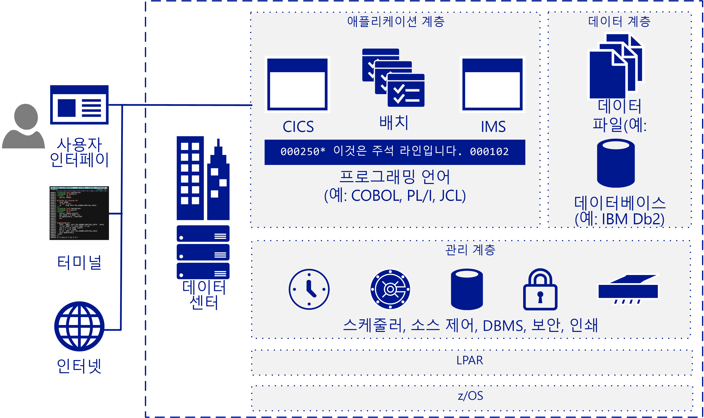

# 메인프레임 마이그레이션 개요Mainframe migration overview

대다수 회사와 조직에서는 일부 또는 모든 메인프레임 워크로드, 애플리케이션 및 데이터베이스를 클라우드로 이동하는 것이 효율적입니다.Many companies and organizations benefit from moving some or all their mainframe workloads, applications, and databases to the cloud. Azure는 메인프레임과 연관된 대부분의 단점을 방지하면서 클라우드 범위에서 메인프레임과 같은 기능을 제공합니다.Azure provides mainframe-like features at cloud scale without many of the drawbacks associated with mainframes.

메인프레임이라는 용어는 일반적으로 대형 컴퓨터 시스템을 지칭하지만, 현재 배포되는 대부분의 메인프레임은 MVS, DOS, VSE, OS/390 또는 z/OS를 실행하는 IBM System Z 서버 또는 IBM 플러그 호환 시스템입니다.The term mainframe generally refers to a large computer system, but the vast majority currently of mainframes deployed are IBM System Z servers or IBM plug-compatible systems running MVS, DOS, VSE, OS/390, or z/OS. 메인프레임 시스템은 여러 업계에서 중요한 정보 시스템을 실행하는 데 계속 사용되고 있으며 대형/대용량/트랜잭션을 많이 사용하는 IT 환경 등 매우 구체적인 시나리오에서도 사용됩니다.Mainframe systems continue to be used in many industries to run vital information systems, and they have a place in highly-specific scenarios, such as large, high-volume, transaction intensive IT environments.

클라우드로 마이그레이션하는 기업은 인프라를 현대화할 수 있습니다.Migrating to the cloud enables companies to modernize their infrastructure. 클라우드 서비스를 사용하는 경우 메인프레임 애플리케이션과 이러한 애플리케이션의 유용한 기능을 조직에서 필요할 때 언제든지 워크로드로 제공할 수 있습니다.With cloud services you can make mainframe applications, and the value that they provide, available as a workload whenever your organization needs it. 대부분의 워크로드는 데이터베이스 이름을 업데이트하는 등 코드를 약간만 변경하면 Azure로 전송할 수 있습니다.Many workloads can be transferred to Azure with only minor code changes, such as updating the names of databases. 단계적 방식을 사용하면 더 복잡한 워크로드를 마이그레이션할 수 있습니다.You can migrate more complex workloads using a phased approach.

Fortune지 선정 500대 기업 중 대부분은 중요 워크로드용으로 Azure를 이미 실행하고 있습니다.Most Fortune 500 companies are already running Azure for their critical workloads. 또한 Azure에서 제공되는 대폭 가격 할인 혜택으로 인해 다수의 마이그레이션 프로젝트가 진행되고 있습니다.Azure's significant bottom-line incentives motivate many migration projects. 기업은 대개 개발/테스트 워크로드를 Azure로 먼저 이동한 다음 DevOps, 이메일, 재해 복구 기능을 Azure로 이동하여 서비스로 제공합니다.Companies typically move development and test workloads to Azure first, followed by DevOps, email, and disaster recovery as a service.

## 대상 그룹Intended audience

IT 환경에서 사용 가능한 옵션으로 클라우드 서비스로의 마이그레이션 또는 클라우드 서비스 추가를 고려 중인 경우 이 가이드의 내용을 계속 확인하세요.If you’re considering a migration or the addition of cloud services as an option for your IT environment, this guide is for you.

IT 조직은 이 가이드의 지침에 따라 마이그레이션 관련 논의를 시작할 수 있습니다.This guidance helps IT organizations start the migration conversation. 메인프레임보다 Azure 및 클라우드 기반 인프라에 대해 더 잘 알고 있는 독자를 위해 이 가이드에서는 먼저 메인프레임의 작동 방식을 간략하게 설명한 다음, 계속해서 마이그레이션 대상과 방법을 결정하기 위한 여러 가지 전략에 대해 설명합니다.You may be more familiar with Azure and cloud-based infrastructures than you are with mainframes, so this guide starts with an overview of how mainframes work, and continues with various strategies for determining what and how to migrate.

## 메인프레임 아키텍처Mainframe architecture

메인프레임은 1950년대 말에 대량 온라인 트랜잭션 및 일괄 처리를 실행하기 위한 강화 서버로 제작되었습니다.In the late 1950s, mainframes were designed as scale-up servers to run high-volume online transactions and batch processing. 따라서 메인프레임에는 일괄 처리 실행 처리를 위한 고성능 I/O 시스템 및 온라인 트랜잭션 양식(그린 스크린이라고도 함)용 소프트웨어가 포함되어 있습니다.Because of this, mainframes have software for online transaction forms (sometimes called green screens) and high-performance I/O systems for processing batch runs.

메인프레임은 뛰어난 안정성과 가용성, 그리고 대량의 온라인 트랜잭션과 일괄 처리 작업을 실행하는 기능으로 잘 알려져 있습니다.Mainframes have a reputation for high reliability and availability, and are known for their ability to run huge online transactions and batch jobs. 트랜잭션은 보통 터미널에서 사용자 한 명이 수행하는 단일 요청을 통해 시작되는 처리의 결과입니다.A transaction results from a piece of processing initiated by a single request, typically from a user at a terminal. 다른 정보 시스템의 애플리케이션, 원격 워크스테이션, 웹 페이지 등의 기타 여러 원본에서 트랜잭션이 생성될 수도 있습니다.Transactions can also come from multiple other sources, including web pages, remote workstations, and applications from other information systems. 그리고 다음 그림과 같이 미리 정의된 시간에 트랜잭션이 자동으로 트리거될 수도 있습니다.A transaction can also be triggered automatically at a predefined time as the following figure shows.

일반적인 IBM 메인프레임 아키텍처에는 다음과 같은 공통 구성 요소가 포함됩니다.A typical IBM mainframe architecture includes these common components:

- **프런트 엔드 시스템:** 사용자는 터미널, 웹 페이지 또는 원격 워크스테이션에서 트랜잭션을 시작할 수 있습니다.**Front-end systems:** Users can initiate transactions from terminals, web pages, or remote workstations. 메인프레임 애플리케이션은 Azure로 마이그레이션한 후 보존할 수 있는 사용자 지정 사용자 인터페이스를 포함하는 경우가 많습니다.Mainframe applications often have custom user interfaces that can be preserved after migration to Azure. 이러한 시스템에서는 여전히 터미널 에뮬레이터(그린 스크린 터미널이라고도 함)를 사용하여 메인프레임 애플리케이션에 액세스합니다.Terminal emulators are still used to access mainframe applications, and are also called green-screen terminals.

- **애플리케이션 계층:** 일반적으로 메인프레임에는 IBM z/OS 메인프레임용으로 가장 유명한 트랜잭션 관리 제품군인 CICS(고객 정보 제어 시스템)가 포함됩니다. CICS는 메시지 기반 트랜잭션 관리자인 IBM IMS(Information Management System)와 함께 사용되는 경우가 많습니다.**Application tier:** Mainframes typically include a customer information control system (CICS), a leading transaction management suite for the IBM z/OS mainframe that is often used with IBM Information Management System (IMS), a message-based transaction manager. 배치 시스템은 대량의 계정 레코드에 대해 처리량이 높은 데이터 업데이트를 처리합니다.Batch systems handle high-throughput data updates for large volumes of account records.

- **코드:** 메인프레임에 사용되는 프로그래밍 언어로는 COBOL, Fortran, PL/I, Natural 등이 있습니다.**Code:** Programming languages used by mainframes include COBOL, Fortran, PL/I, and Natural. z/OS 작업 시에는 JCL(작업 제어 언어)이 사용됩니다.Job control language (JCL) is used to work with z/OS.

- **데이터베이스 계층:** 일반적인 z/OS용 관계형 DBMS(데이터베이스 관리 시스템)는 IBM DD2입니다.**Database tier:** A common relational database management system (DBMS) for z/OS is IBM DD2. IBM DD2는 테이블을 하나 이상 포함하며 *dbextent*라는 물리적 데이터 세트의 스토리지 풀에 할당되는 *dbspace* 데이터 구조를 관리합니다.It manages data structures called *dbspaces* that contain one or more tables and are assigned to storage pools of physical data sets called *dbextents*. IBM DD2의 중요한 두 가지 데이터베이스 구성 요소는 스토리지 풀의 데이터 위치를 식별하는 디렉터리와, 데이터베이스에 대해 수행되는 작업 레코드를 포함하는 로그입니다.Two important database components are the directory that identifies data locations in the storage pools, and the log that contains a record of operations performed on the database. 다양한 플랫 파일 형식이 지원됩니다.Various flat-file data formats are supported. 일반적으로 z/OS용 DB2는 VSAM(가상 스토리지 액세스 메서드) 데이터 세트를 사용해 데이터를 저장합니다.DB2 for z/OS typically uses virtual storage access method (VSAM) datasets to store the data.

- **관리 계층:** IBM 메인프레임에는 TWS-OPC 등의 예약 소프트웨어, CA-SAR 및 SPOOL 등의 인쇄 및 출력 관리용 도구, 그리고 코드용 원본 제어 시스템이 포함됩니다.**Management tier:** IBM mainframes include scheduling software such as TWS-OPC, tools for print and output management such as CA-SAR and SPOOL, and a source control system for code. RACF(리소스 액세스 제어 기능)가 z/OS의 보안 액세스 제어를 처리합니다.Secure access control for z/OS is handled by resource access control facility (RACF). z/OS 환경의 자체 파티션에서 실행되는 데이터베이스 관리자를 통해 데이터베이스의 데이터에 액세스할 수 있습니다.A database manager provides access to data in the database and runs in its own partition in a z/OS environment.

- **LPAR:** LPAR(논리 파티션)을 사용하여 컴퓨팅 리소스를 구분합니다.**LPAR:** Logical partitions, or LPARs, are used to divide compute resources. 물리적 메인프레임은 여러 LPAR로 분할됩니다.A physical mainframe is partitioned into multiple LPARs.

- **z/OS:** IBM 메인프레임에 가장 일반적으로 사용되는 64비트 운영 체제입니다.**z/OS:** A 64-bit operating system that is most commonly used for IBM mainframes.

IBM 시스템은 CICS 등의 트랜잭션 모니터를 사용하여 비즈니스 트랜잭션의 모든 부분을 추적하고 관리합니다.IBM systems use a transaction monitor such as CICS to track and manage all aspects of a business transaction. CICS는 리소스 공유, 데이터 무결성 및 실행 우선 순위 지정을 관리합니다.CICS manages the sharing of resources, the integrity of data, and prioritization of execution. 또한 사용자에게 권한을 부여하고, 리소스를 할당하고, 애플리케이션의 데이터베이스 요청을 IBM DB2와 같은 데이터베이스 관리자로 전달합니다.CICS authorizes users, allocates resources, and passes database requests by the application to a database manager, such as IBM DB2.

일반적으로는 더 정밀한 튜닝을 위해 CICS를 IMS/TM(이전 명칭 IMS/Data Communications 또는 IMS/DC)과 함께 사용합니다.For more precise tuning, CICS is commonly used with IMS/TM (formerly IMS/Data Communications or IMS/DC). 단일 데이터 복사본을 유지하는 방식을 통해 데이터 중복성을 줄이도록 설계된 IMS는IMS was designed to reduce data redundancy by maintaining a single copy of the data. 프로세스 전반에 걸쳐 상태를 유지하고 데이터 저장소에서 비즈니스 기능을 기록하는 방식을 통해 트랜잭션 모니터로 CICS를 보완합니다.It complements CICS as a transaction monitor by maintaining state throughout the process and recording business functions in a data store.

## 메인프레임 작업Mainframe operations

일반적인 메인프레임 작업은 다음과 같습니다.The following are typical mainframe operations:

- **온라인:** 워크로드에는 트랜잭션 처리, 데이터베이스 관리, 연결 등이 포함됩니다.**Online:** Workloads include transaction processing, database management, and connections. 이러한 작업은 IBM DB2, CICS 및 z/OS 커넥터를 사용하여 구현되는 경우가 많습니다.They are often implemented using IBM DB2, CICS, and z/OS connectors.

- **일괄 처리:** 작업이 일반적으로 평일 아침 등의 정기적인 일정에 따라 사용자의 상호 작용 없이 실행됩니다.**Batch:** Jobs run without user interaction, typically on a regular schedule such as every weekday morning. Micro Focus Enterprise Server 또는 BMC Control-M 소프트웨어와 같은 JCL 에뮬레이터를 사용하여 Windows 또는 Linux 기반 시스템에서 일괄 작업을 실행할 수 있습니다.Batch jobs can be run on systems based on Windows or Linux by using a JCL emulator such as Micro Focus Enterprise Server or BMC Control-M software.

- **JCL(작업 제어 언어):** 일괄 작업을 처리하는 데 필요한 리소스를 지정합니다.**Job control language (JCL):** Specify resources needed to process batch jobs. JCL은 작업 제어 문 세트를 통해 이 정보를 z/OS에 전달합니다.JCL conveys this information to z/OS through a set of job control statements. 기본 JCL에는 JOB, ASSGN, DLBL, EXTENT, LIBDEF, EXEC의 6가지 문 유형이 포함됩니다.Basic JCL contains six types of statements: JOB, ASSGN, DLBL, EXTENT, LIBDEF, and EXEC. 한 작업이 여러 EXEC 문(단계)을 포함할 수 있으며 각 단계가 여러 LIBDEF, ASSGN, DLBL, EXTENT 문을 포함할 수 있습니다.A job can contain several EXEC statements (steps), and each step could have several LIBDEF, ASSGN, DLBL, and EXTENT statements.

- **IPL(시작 프로그램 로드):**  운영 체제 복사본을 디스크에서 프로세서 실제 스토리지로 로드하여 실행하는 과정을 지칭합니다.**Initial program load (IPL):**  Refers to loading a copy of the operating system from disk into a processor’s real storage and running it. IPL은 가동 중지 시간 발생 후 복구할 때 사용됩니다.IPLs are used to recover from downtime. IPL은 Windows 또는 Linux VM에서 운영 체제를 부팅하는 과정과 같습니다.An IPL is like booting the operating system on Windows or Linux VMs.

## 다음 단계Next steps

> [!div class="nextstepaction"]
> [잘못된 정보와 실제 정보Myths and facts](myths-and-facts.md)
