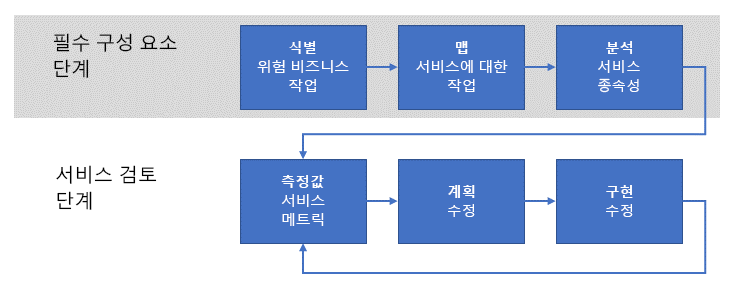

# 운영 적합성에 대한 검토 설정

회사가 Azure에서 워크로드를 운영하기 시작할 때 다음 단계는 이러한 워크로드에 대한 **비기능적** 요구 사항을 열거하고, 구현하고, 반복적으로 검토하는 **운영 적합성 검토** 프로세스를 설정하는 것입니다. _비기능적_ 요구 사항은 서비스에 필요한 운영 동작과 관련됩니다. 비기능적 요구 사항에는 [소프트웨어 품질 핵심 요소](../../guide/pillars.md)라고 하는 5가지 필수 범주, 즉 확장성, 가용성, 복원력(비즈니스 연속성 및 재해 복구 포함), 관리 및 보안이 있습니다. 운영 적합성 검토 프로세스는 중요 업무 워크로드가 품질 핵심 요소와 관련하여 비즈니스의 기대를 충족시키는지 확인하기 위한 것입니다.

이러한 이유로 회사에서는 프로덕션 환경에서 워크로드를 실행하여 발생하는 문제를 완전히 파악하고 문제를 수정하여 해결할 수 있는 방법을 결정하는 운영 적합성 평가 프로세스를 수행해야 합니다. 이 문서에서는 회사에서 이 목표를 달성하는 데 사용할 수 있는 고급 운영 적합성 검토 프로세스에 대해 간략히 설명합니다.

## Microsoft의 운영 적합성

처음부터 Azure 플랫폼 개발은 Microsoft 전체의 많은 팀에서 수행한 지속적인 개발 및 통합 프로젝트였습니다. 기본적인 비기능적 요구 사항을 정기적으로 열거하고 구현하는 강력한 프로세스가 없으면 Azure의 크기와 복잡성에 대한 프로젝트의 품질과 일관성을 보장하는 것이 매우 어려울 것입니다.

Microsoft에서 수행한 이러한 프로세스는 이 문서에서 설명하는 프로세스의 기반이 됩니다.

## 문제 파악

[시작](../../cloud-adoption/getting-started/overview.md)에서 설명한 대로 회사에서 수행되는 디지털 전환의 첫 번째 단계는 Azure를 채택하여 해결해야 할 비즈니스 문제를 파악하는 것입니다. 다음 단계는 워크로드를 클라우드로 마이그레이션하거나 클라우드 기능이 포함되도록 기존의 온-프레미스 서비스를 조정하는 것과 같은 문제에 대응할 수 있는 고급 솔루션을 결정하는 것입니다. 마지막으로, 솔루션이 설계되고 구현됩니다.

이 과정에서는 종종 서비스의 _기능_에 집중합니다. 즉 수행할 서비스에 필요한 일단의 _기능적_ 요구 사항이 있습니다. 예를 들어 제품 배달 서비스에는 제품의 출발 및 도착 위치 결정, 배달 중인 제품 추적, 고객 알림, 기타 등등의 기능이 필요합니다.

반면에 _비기능적_ 요구 사항 관련 서비스와 같은 속성 [안정성](../../reliability/index.md) 및 [확장성](../../checklist/scalability.md)합니다. 이러한 속성은 서비스 특징의 최종 기능에 직접적인 영향을 주지 않으므로 기능적 요구 사항과 다릅니다. 그러나 이러한 비기능적 요구 사항은 서비스의 _성능_ 및 _연속성_과 관련됩니다.

일부 비기능적 요구 사항은 SLA(서비스 수준 계약) 측면에서 지정할 수 있습니다. 예를 들어 서비스 연속성과 관련하여 서비스의 가용성 요구 사항은 **사용 가능한 시간의 99.99%** 와 같은 백분율로 표현할 수 있습니다. 다른 비기능적 요구 사항은 정의하기가 더 어려울 수 있으며, 프로덕션 요구 사항이 진화함에 따라 변경될 수 있습니다. 예를 들어 소비자 지향 서비스는 급증한 인기로 인해 예기치 않은 처리량 요구 사항에 직면할 수 있습니다.

! [참고] 복원 력, RPO, RTO, SLA 및 관련된 개념에 대 한 설명을 포함 하 여에 대 한 요구 사항을 정의에 더 자세히 살펴봅니다 [개발 Azure 복원 력 있는 응용 프로그램에 대 한 요구 사항](../../reliability/requirements.md)합니다.

## 운영 적합성 검토 프로세스

엔터프라이즈 서비스의 성능과 연속성을 유지하기 위한 핵심적인 요소는 _운영 적합성 검토 프로세스_를 구현하는 것입니다.

높은 수준의 프로세스에는 두 단계가 있습니다. 필수 구성 요소 단계에서는 요구 사항이 설정되고 지원되는 서비스에 매핑됩니다. 이 단계는 매년 또는 새 운영이 도입될 때와 같이 자주 발생하지 않습니다. 필수 구성 요소 단계의 출력은 흐름 단계에서 사용됩니다. 흐름 단계는 더 자주 발생하며, 매월 수행하는 것이 좋습니다.

### 필수 구성 요소 단계

이 단계는 중요한 서비스를 정기적으로 검토하는 데 필요한 요구 사항을 파악하기 위한 것입니다.

- **중요 비즈니스 운영을 식별합니다**. 회사의 중요 업무 비즈니스 운영을 식별합니다. 비즈니스 운영은 지원되는 모든 서비스 기능과는 독립적입니다. 즉 비즈니스 운영은 비즈니스에서 수행해야 하는 실제 활동을 나타내며 일단의 IT 서비스를 통해 지원됩니다. **중요 업무**(또는 **중요 비즈니스**)라는 용어는 운영에 지장을 주는 경우 비즈니스에 미치는 심각한 영향력을 반영하고 있습니다. 예를 들어 온라인 소매점에는 "고객이 쇼핑 카트에 품목을 추가할 수 있도록 지원" 또는 "신용 카드 결제 처리"와 같은 비즈니스 운영이 있을 수 있습니다. 이러한 운영 중 하나라도 실패하면 고객이 거래를 수행할 수 없으며, 회사는 판매를 실현하지 못합니다.

- **운영을 서비스에 매핑합니다**. 이러한 비즈니스 운영을 지원 서비스에 매핑합니다. 위에서 언급한 쇼핑 카트 예의 경우 인벤토리 재고 관리 서비스, 쇼핑 카트 서비스 및 기타 서비스 등 몇 가지 서비스가 포함될 수 있습니다. 위에서 언급한 신용 카드 결제 예의 경우 온-프레미스 결제 서비스는 타사 결제 처리 서비스와 상호 작용할 수 있습니다.

- **서비스 종속성을 분석합니다**. 대부분의 비즈니스 운영에는 여러 지원 서비스 간의 오케스트레이션이 필요합니다. 서비스와 이러한 서비스를 통해 중요 한 트랜잭션의 흐름 간의 종속성을 이해 하는 것이 반드시 합니다. 또한 온-프레미스 서비스와 Azure 서비스 간의 종속성도 고려해야 합니다. 쇼핑 카트의 예에서 인벤토리 재고 관리 서비스는 온-프레미스에서 호스팅되고 물리적 웨어하우스의 직원이 입력한 데이터를 수집할 수 있지만, 데이터는 Azure 서비스(예: [Azure 저장소](/azure/storage/common/storage-introduction)) 또는 데이터베이스(예: [Azure Cosmos DB](/azure/cosmos-db/introduction))에 저장할 수 있습니다.

이러한 활동의 출력은 서비스 작업에 대한 일단의 **성과 기록표 메트릭**입니다. 메트릭은 가용성, 확장성 및 재해 복구와 같은 비기능적 조건으로 분류됩니다. 성과 기록표 메트릭은 서비스에서 운영상 충족될 것으로 예상되는 조건을 나타냅니다. 이러한 메트릭은 서비스 작업에 적절한 임의의 세분화 수준으로 표현할 수 있습니다.

성과 기록표는 비즈니스 소유자와 엔지니어링 소유자 간의 의미 있는 토론을 용이하게 하기 위해 간단한 용어로 표현해야 합니다. 예를 들어 확장성 성과 기록표 메트릭은 원하는 조건에서 수행하는 경우 _녹색_으로, 원하는 조건을 충족하지 못하지만 계획된 재구성을 적극적으로 구현하는 경우 _노란색_으로, 계획이나 작업 없이 원하는 조건을 충족하지 못하는 경우 _빨간색_으로 표현할 수 있습니다.

이러한 메트릭은 비즈니스 요구 사항을 직접 반영해야 한다는 점을 강조하는 것이 중요합니다.

### 서비스 검토 단계

서비스 검토 단계는 운영 적합성 검토 프로세스의 핵심입니다.

- **서비스 메트릭을 측정합니다**. 성과 기록표 메트릭을 사용하여 비즈니스 기대를 충족하는지 확인하기 위해 서비스를 모니터링해야 합니다. 즉 서비스 모니터링이 필수적입니다. 비기능적 요구 사항과 관련하여 일단의 서비스를 모니터링할 수 없는 경우 해당 성과 기록표 메트릭을 빨간색으로 간주해야 합니다. 이 경우 재구성에 대한 첫 번째 단계는 적절한 서비스 모니터링을 구현하는 것입니다. 예를 들어 비즈니스에서 99.99% 가용성으로 서비스가 작동할 것으로 예상하지만, 가용성을 측정할 적절한 프로덕션 원격 분석이 없는 경우 요구 사항을 충족하지 못한다고 가정해야 합니다.

- **재구성을 계획합니다**. 허용되는 임계값 아래에 있는 메트릭을 사용하는 각 서비스 작업에 대해 허용되는 메트릭으로 작동하도록 서비스를 재구성하는 비용을 결정합니다. 서비스를 재구성하는 비용이 예상되는 서비스 수익 창출보다 더 큰 경우 고객 경험과 같은 무형 비용을 고려합니다. 예를 들어 고객이 서비스를 사용하여 성공적으로 주문하는 데 어려움을 겪는 경우 경쟁업체를 대신 선택할 수 있습니다.

- **재구성을 구현합니다**. 비즈니스 소유자와 엔지니어링 소유자가 계획을 수렴한 후에는 해당 계획을 구현해야 합니다. 성과 기록표 메트릭을 검토할 때마다 구현 상태를 보고해야 합니다.

이 프로세스는 반복적이며, 회사에는 이를 전적으로 소유하는 팀이 있어야 합니다. 이 팀은 정기적으로 만나 기존의 재구성 프로젝트를 검토하고, 새 워크로드에 대한 기본 검토를 시작하며, 회사의 전체 성과 기록표를 추적해야 합니다. 팀은 일정에 뒤처졌거나 메트릭을 충족하지 못하는 재구성 팀에 대한 책임을 보장할 수 있는 권한이 있어야 합니다.

## 운영 적합성 검토 팀의 구조

운영 적합성 검토 팀에 구성되는 역할은 다음과 같습니다.

1. **비즈니스 소유자**. 이 역할은 비즈니스에 대한 지식을 제공하여 각 중요 업무 비즈니스 운영을 식별하고 우선 순위를 지정합니다. 또한 비즈니스 영향에 대한 완화 비용을 비교하고 재구성에 대한 최종 결정을 추진합니다.

2. **비즈니스 중재자**. 이 역할은 비즈니스 운영을 개별 부분으로 세분화하고, 해당 부분을 온-프레미스 서비스, 클라우드 서비스 및 인프라에 매핑할 책임이 있습니다. 이 역할에는 각 비즈니스 운영과 관련된 기술에 대한 전문 지식이 필요합니다.

3. **엔지니어링 소유자**. 이 역할은 비즈니스 작업과 연결 된 서비스를 구현 하는 일을 담당 합니다. 이러한 개인은 운영 적합성 검토 팀에서 파악한 비기능적 요구 사항 문제를 해결하기 위한 솔루션의 설계, 구현 및 배포에 참여할 수 있습니다.

4. **서비스 소유자**. 이 역할은 비즈니스의 애플리케이션과 서비스를 운영할 책임이 있습니다. 이러한 개인은 이러한 애플리케이션과 서비스에 대한 로깅 및 사용 데이터를 수집합니다. 이 데이터는 모두 문제를 식별하고 배포 후의 수정을 확인하는 데 사용됩니다.

## 운영 적합성 검토 회의

운영 적합성 검토 팀은 정기적으로 만나는 것이 좋습니다. 예를 들어 팀은 월간 케이던스에 만나고, 경영진에게 상태와 메트릭을 분기별로 보고할 수 있습니다.

프로세스와 회의의 세부 정보는 특정 요구 사에 맞게 조정해야 합니다. 다음 작업을 시작 지점으로 사용하는 것이 좋습니다.

1. 비즈니스 소유자와 비즈니스 중재자는 엔지니어링 소유자와 서비스 소유자의 입력을 사용하여 각 비즈니스 운영에 대한 비기능적 요구 사항을 열거하고 결정합니다. 이전에 식별된 비즈니스 운영의 경우 우선 순위를 검토하고 확인합니다. 새 비즈니스 운영의 경우 기존 목록의 우선 순위를 할당합니다.

2. 엔지니어링 소유자와 서비스 소유자는 비즈니스 운영의 **현재 상태**를 해당 온-프레미스 서비스와 클라우드 서비스에 매핑합니다. 매핑은 각 서비스의 구성 요소 목록으로 구성되며, 위치가 종속성 트리로 확정됩니다. 목록 및 종속성 트리가 생성되면 트리를 통과하는 **중요 경로**가 결정됩니다.

3. 엔지니어링 소유자와 서비스 소유자는 이전 단계에서 나열된 서비스에 대한 운영 로깅 및 모니터링의 현재 상태를 검토합니다. 강력한 로깅 및 모니터링은 비기능적 요구 사항에 맞게 실패에 영향을 주는 서비스 구성 요소를 식별 하기 위해 중요 합니다. 로깅 및 모니터링이 충분하지 않으면 계획을 수립하여 구현해야 합니다.

4. 새 비즈니스 운영에 대한 성과 기록표 메트릭을 만듭니다. 성과 기록표는 2단계에서 식별된 각 서비스에 대해 비기능적 요구 사항에 부합하는 구성 요소 목록 및 구성 요소에서 요구 사항을 충족하는 정도를 나타내는 메트릭으로 구성됩니다.

5. 비기능적 요구 사항을 충족하지 못하는 구성 요소의 경우 고급 솔루션을 설계하고 엔지니어링 소유자를 할당합니다. 이 시점에서 비즈니스 소유자와 비즈니스 중재자는 비즈니스 운영의 예상 수익을 기준으로 재구성 작업에 대한 예산을 수립해야 합니다.

6. 마지막으로, 진행 중인 재구성 작업에 대한 검토를 수행합니다. 진행 중인 작업에 대한 성과 기록표 메트릭 각각은 예상 메트릭과 비교하여 검토합니다. 메트릭을 충족하는 구성 요소의 경우 서비스 소유자는 메트릭이 충족되는지 확인하기 위해 로깅 및 모니터링 데이터를 제공합니다. 메트릭을 충족하지 않는 구성 요소의 경우 각 엔지니어링 소유자는 메트릭에 도달하지 못하는 문제와 재구성을 위한 새 디자인을 설명합니다.

## 권장되는 리소스

- [소프트웨어 품질 핵심 요소](../../guide/pillars.md).
    Azure 애플리케이션 아키텍처 가이드의 이 섹션에서는 다음 5가지 소프트웨어 품질 핵심 요소에 대해 설명합니다. 확장성, 가용성, 복원력, 관리 및 보안
- [Azure 응용 프로그램을 위한 10가지 설계 원칙](../../guide/design-principles/index.md).
    Azure 애플리케이션 아키텍처 가이드의 이 섹션에서는 애플리케이션의 확장성, 복원력 및 관리 용이성을 높이기 위한 일단의 설계 원칙에 대해 설명합니다.
- [신뢰할 수 있는 Azure 응용 프로그램 디자인](../../reliability/index.md)합니다.
    이 가이드는 복원력 및 관련 개념을 정의하는 것으로 시작합니다. 그런 다음, 디자인 및 구현부터 배포 및 운영에 이르는 애플리케이션의 전체 수명에 걸쳐 구조화된 방법을 사용하여 복원력을 달성하는 프로세스를 설명하겠습니다.
- [클라우드 디자인 패턴](../../patterns/index.md).
    이러한 디자인 패턴은 엔지니어링 팀에서 애플리케이션을 소프트웨어 품질 핵심 요소에 구축하는 경우에 유용합니다.
