## AI 시나리오

<ul  class="panelContent cardsC">
<li style="display: flex; flex-direction: column;">
    <a href="./ai/commerce-chatbot.md" style="display: flex; flex-direction: column; flex: 1 0 auto;">
        

            

                

                    

                        

                            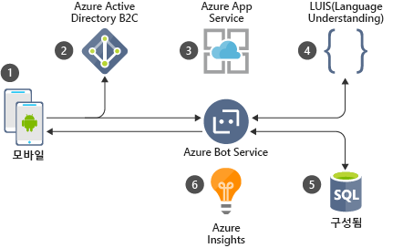
                        

                    

                    

                        <h3>Azure에서 호텔 예약을 위한 대화형 챗봇</h3>
                        
Azure Bot Service를 사용하여 상거래 응용 프로그램에 대해 대화형 챗봇을 빌드합니다.

                    

                

            

        

    </a>
</li>
<li style="display: flex; flex-direction: column;">
    <a href="./ai/intelligent-apps-image-processing.md" style="display: flex; flex-direction: column; flex: 1 0 auto;">
        

            

                

                    

                        

                            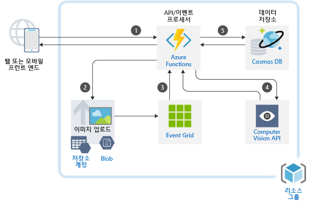
                        

                    

                    

                        <h3>Azure에서 보험 청구에 대한 이미지 분류</h3>
                        
Azure 응용 프로그램에 이미지 처리를 빌드합니다.

                    

                

            

        

    </a>
</li>
</ul>

## 응용 프로그램 시나리오

<ul  class="panelContent cardsC">
<li style="display: flex; flex-direction: column;">
    <a href="./apps/apim-api-scenario.md" style="display: flex; flex-direction: column; flex: 1 0 auto;">
        

            

                

                    

                        

                            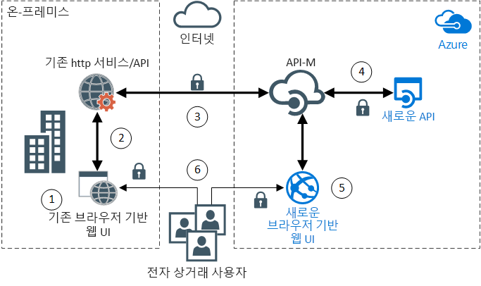
                        

                    

                    

                        <h3>Azure의 API 기반 아키텍처에 레거시 웹 응용 프로그램 마이그레이션</h3>
                        
Azure API Management를 사용하여 레거시 웹 응용 프로그램을 현대화합니다.

                    

                

            

        

    </a>
</li>
<li style="display: flex; flex-direction: column;">
    <a href="./apps/app-monitoring.md" style="display: flex; flex-direction: column; flex: 1 0 auto;">
        

            

                

                    

                        

                            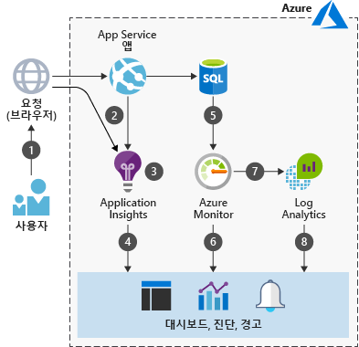
                        

                    

                    

                        <h3>Azure에서 웹 응용 프로그램 모니터링</h3>
                        
Azure App Service에 호스트되는 웹 응용 프로그램을 모니터링합니다.

                    

                

            

        

    </a>
</li>
<li style="display: flex; flex-direction: column;">
    <a href="./apps/decentralized-trust.md" style="display: flex; flex-direction: column; flex: 1 0 auto;">
        

            

                

                    

                        

                            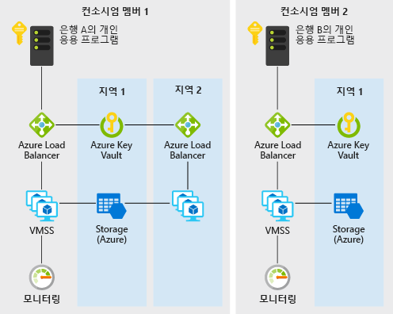
                        

                    

                    

                        <h3>Azure의 은행 간에 분산 트러스트</h3>
                        
중앙 집중식 데이터베이스로 재분류하지 않고 통신 및 정보 공유에 대해 신뢰할 수 있는 환경을 설정합니다.

                    

                

            

        

    </a>
</li>
<li style="display: flex; flex-direction: column;">
    <a href="./apps/devops-dotnet-webapp.md" style="display: flex; flex-direction: column; flex: 1 0 auto;">
        

            

                

                    

                        

                            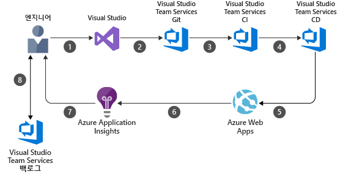
                        

                    

                    

                        <h3>Azure DevOps를 사용한 CI/CD 파이프라인</h3>
                        
Azure DevOps를 사용하여 Azure Web Apps에 .NET 앱을 빌드하고 릴리스합니다.

                    

                

            

        

    </a>
</li>
<li style="display: flex; flex-direction: column;">
    <a href="./apps/devops-with-aks.md" style="display: flex; flex-direction: column; flex: 1 0 auto;">
        

            

                

                    

                        

                            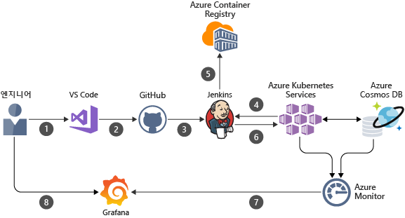
                        

                    

                    

                        <h3>컨테이너 기반 작업에 대한 CI/CD 파이프라인</h3>
                        
Jenkins, Azure Container Registry, Azure Kubernetes Service, Cosmos DB 및 Grafana를 사용하여 Node.js 웹앱에 대한 DevOps 파이프라인을 빌드합니다.

                    

                

            

        

    </a>
</li>
<li style="display: flex; flex-direction: column;">
    <a href="./apps/ecommerce-scenario.md" style="display: flex; flex-direction: column; flex: 1 0 auto;">
        

            

                

                    

                        

                            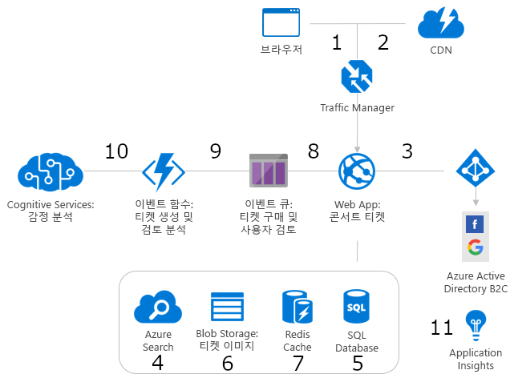
                        

                    

                    

                        <h3>Azure의 전자상거래 프런트 엔드</h3>
                        
Azure에서 전자상거래 사이트를 호스트합니다.

                    

                

            

        

    </a>
</li>
<li style="display: flex; flex-direction: column;">
    <a href="./apps/ecommerce-search.md" style="display: flex; flex-direction: column; flex: 1 0 auto;">
        

            

                

                    

                        

                            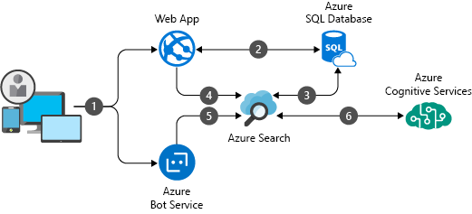
                        

                    

                    

                        <h3>전자상거래에 대한 지능형 제품 검색 엔진</h3>
                        
전자상거래 응용 프로그램에서 세계적 수준의 검색 환경을 제공합니다.

                    

                

            

        

    </a>
</li>
<li style="display: flex; flex-direction: column;">
    <a href="./apps/hpc-saas.md" style="display: flex; flex-direction: column; flex: 1 0 auto;">
        

            

                

                    

                        

                            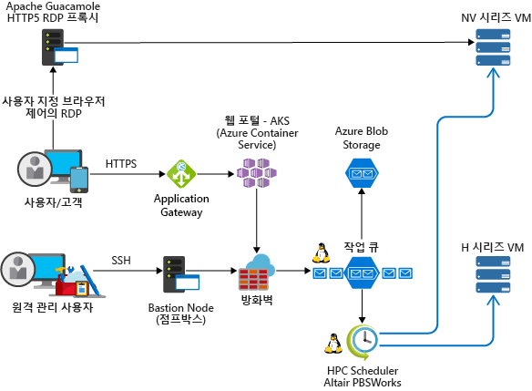
                        

                    

                    

                        <h3>Azure의 컴퓨터 지원 엔지니어링 서비스</h3>
                        
Azure에서 CAE(컴퓨터 지원 엔지니어링)에 대한 SaaS(Software-as-a-Service) 플랫폼을 제공합니다.

                    

                

            

        

    </a>
</li>
<li style="display: flex; flex-direction: column;">
    <a href="./apps/sap-dev-test.md" style="display: flex; flex-direction: column; flex: 1 0 auto;">
        

            

                

                    

                        

                            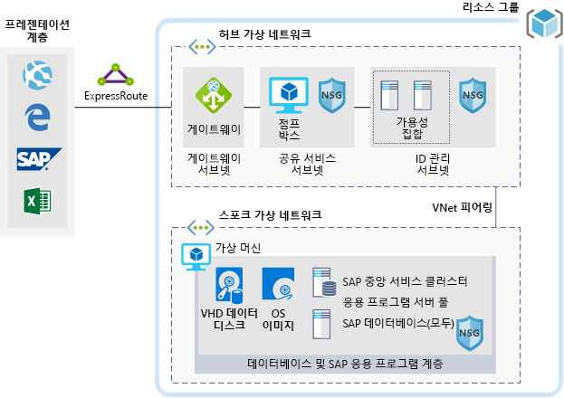
                        

                    

                    

                        <h3>Azure의 SAP 워크로드에 대한 개발/테스트 환경</h3>
                        
SAP 워크로드에 대한 개발/테스트 환경을 빌드합니다.

                    

                

            

        

    </a>
</li>
<li style="display: flex; flex-direction: column;">
    <a href="./apps/sap-production.md" style="display: flex; flex-direction: column; flex: 1 0 auto;">
        

            

                

                    

                        

                            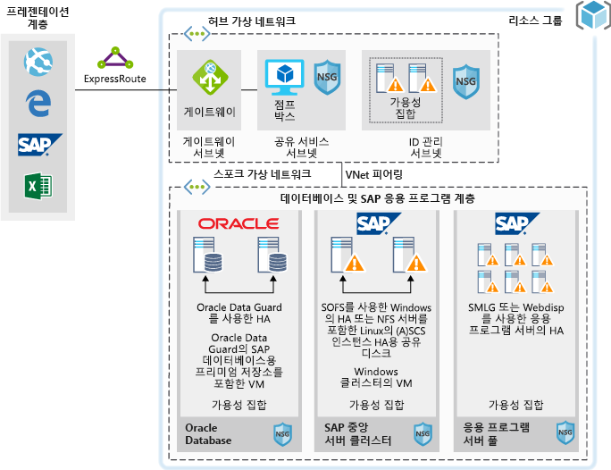
                        

                    

                    

                        <h3>Azure에서 Oracle 데이터베이스를 사용하여 SAP 프로덕션 워크로드 실행</h3>
                        
Oracle 데이터베이스를 사용하여 Azure에서 SAP 프로덕션 배포를 실행합니다.

                    

                

            

        

    </a>
</li>
</ul>

## 데이터 시나리오

<ul  class="panelContent cardsC">
<li style="display: flex; flex-direction: column;">
    <a href="./data/big-data-with-iot.md" style="display: flex; flex-direction: column; flex: 1 0 auto;">
        

            

                

                    

                        

                            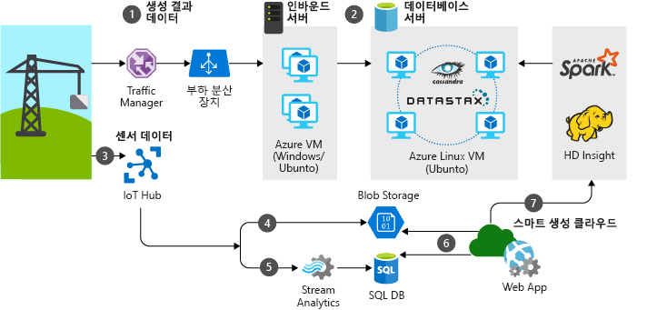
                        

                    

                    

                        <h3>건축 산업에서 IoT 및 데이터 분석</h3>
                        
IoT 장치 및 데이터 분석을 사용하여 건축 프로젝트의 포괄적인 관리 및 작업을 제공합니다.

                    

                

            

        

    </a>
</li>
<li style="display: flex; flex-direction: column;">
    <a href="./data/data-warehouse.md" style="display: flex; flex-direction: column; flex: 1 0 auto;">
        

            

                

                    

                        

                            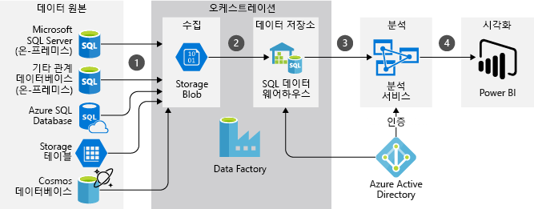
                        

                    

                    

                        <h3>영업 및 마케팅에 대한 데이터 웨어하우징 및 분석</h3>
                        
여러 원본의 데이터를 통합하고 데이터 분석을 최적화합니다.

                    

                

            

        

    </a>
</li>
<li style="display: flex; flex-direction: column;">
    <a href="./data/ecommerce-order-processing.md" style="display: flex; flex-direction: column; flex: 1 0 auto;">
        

            

                

                    

                        

                            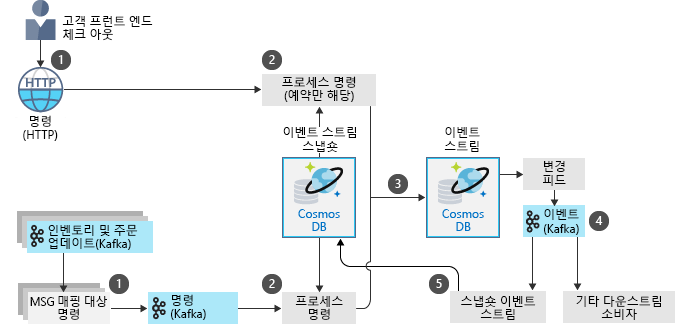
                        

                    

                    

                        <h3>Azure의 확장성 있는 주문 처리</h3>
                        
Azure Cosmos DB를 사용하여 확장성이 높은 주문 처리 파이프라인을 빌드합니다.

                    

                

            

        

    </a>
</li>
<li style="display: flex; flex-direction: column;">
    <a href="./data/fraud-detection.md" style="display: flex; flex-direction: column; flex: 1 0 auto;">
        

            

                

                    

                        

                            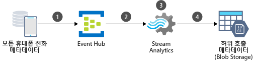
                        

                    

                    

                        <h3>Azure에서 실시간 부정 행위 감지</h3>
                        
Azure Event Hubs 및 Stream Analytics를 사용하여 부정 행위를 실시간으로 검색합니다.

                    

                

            

        

    </a>
</li>
<li style="display: flex; flex-direction: column;">
    <a href="./data/realtime-analytics-vehicle-iot.md" style="display: flex; flex-direction: column; flex: 1 0 auto;">
        

            

                

                    

                        

                            
                        

                    

                    

                        <h3>실시간 자동차 IoT 데이터의 수집 및 처리</h3>
                        
IoT를 사용하여 실시간 차량 데이터를 수집하고 처리합니다.

                    

                

            

        

    </a>
</li>
</ul>

## 인프라 시나리오

<ul  class="panelContent cardsC">
<li style="display: flex; flex-direction: column;">
    <a href="./infrastructure/hpc-cfd.md" style="display: flex; flex-direction: column; flex: 1 0 auto;">
        

            

                

                    

                        

                            
                        

                    

                    

                        <h3>Azure에서 CFD(컴퓨팅 유체 역학) 시뮬레이션 실행</h3>
                        
Azure에서 CFD(컴퓨팅 유체 역학) 시뮬레이션을 실행합니다.

                    

                

            

        

    </a>
</li>
<li style="display: flex; flex-direction: column;">
    <a href="./infrastructure/linux-vdi-citrix.md" style="display: flex; flex-direction: column; flex: 1 0 auto;">
        

            

                

                    

                        

                            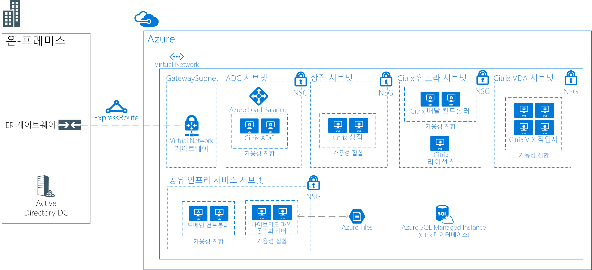
                        

                    

                    

                        <h3>Citrix를 사용한 Linux 가상 데스크톱</h3>
                        
Azure에서 Citrix를 사용하여 Linux 데스크톱에 대해 VDI 환경을 빌드합니다.

                    

                

            

        

    </a>
</li>
<li style="display: flex; flex-direction: column;">
    <a href="./infrastructure/regulated-multitier-app.md" style="display: flex; flex-direction: column; flex: 1 0 auto;">
        

            

                

                    

                        

                            
                        

                    

                    

                        <h3>규제 산업용 Windows 웹 응용 프로그램 보호</h3>
                        
확장 집합, Application Gateway 및 부하 분산 장치를 사용하여 Azure의 Windows Server에서 안전한 다중 계층 웹 응용 프로그램을 빌드합니다.

                    

                

            

        

    </a>
</li>
<li style="display: flex; flex-direction: column;">
    <a href="./infrastructure/service-fabric-microservices.md" style="display: flex; flex-direction: column; flex: 1 0 auto;">
        

            

                

                    

                        

                            
                        

                    

                    

                        <h3>Service Fabric을 사용하여 모놀리식 응용 프로그램 분해</h3>
                        
대규모 모놀리식 응용 프로그램을 마이크로 서비스로 분해합니다.

                    

                

            

        

    </a>
</li>
<li style="display: flex; flex-direction: column;">
    <a href="./infrastructure/video-rendering.md" style="display: flex; flex-direction: column; flex: 1 0 auto;">
        

            

                

                    

                        

                            
                        

                    

                    

                        <h3>Azure의 3D 비디오 렌더링</h3>
                        
Azure Batch 서비스를 사용하여 Azure에서 원시 HPC 워크로드를 실행합니다.

                    

                

            

        

    </a>
</li>
<li style="display: flex; flex-direction: column;">
    <a href="./infrastructure/wordpress.md" style="display: flex; flex-direction: column; flex: 1 0 auto;">
        

            

                

                    

                        

                            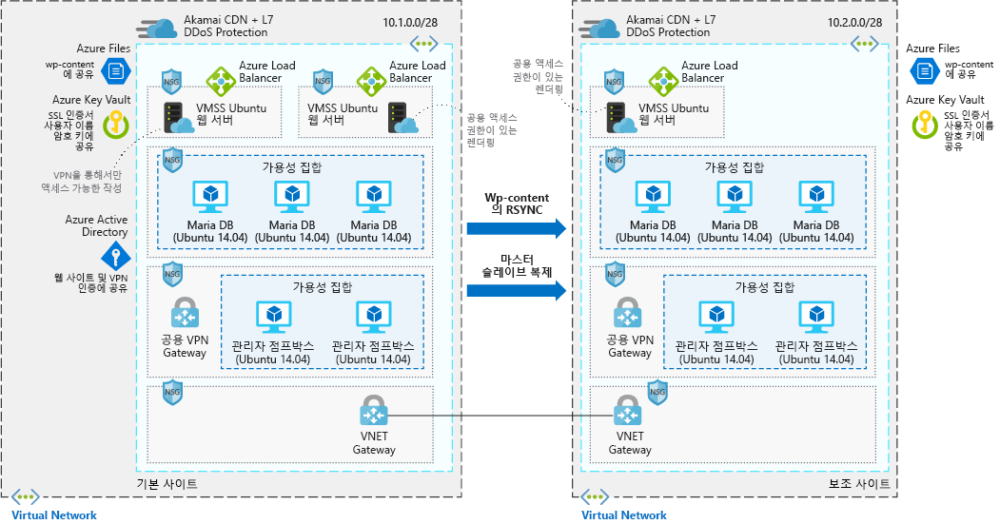
                        

                    

                    

                        <h3>확장성이 높고 안전한 Azure의 WordPress 웹 사이트</h3>
                        
미디어 이벤트에 대해 확장성이 높고 안전한 WordPress 웹 사이트를 빌드합니다.

                    

                

            

        

    </a>
</li>
</ul>

