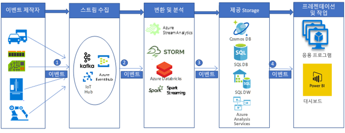

# 실시간 자동차 IoT 데이터의 수집 및 처리Ingestion and processing of real-time automotive IoT data

이 예제 시나리오에서는 IoT 장치(일반적으로 센서)에서 Azure의 빅 데이터 분석 플랫폼으로 메시지를 수집하여 처리하는 실시간 데이터 수집 및 처리 파이프라인을 빌드합니다.This example scenario builds a real time data ingestion and processing pipeline to ingest and process messages from IoT devices (in general sensors) into a big data analytic platform in Azure. 차량 텔레매틱스 수집 및 처리 플랫폼은 연결된 자동차 솔루션을 만드는 핵심입니다.Vehicle telematics ingestion and processing platforms are the key to create connected car solutions. 이 시나리오는 자동차 텔레매틱스 수집 및 처리 시스템에서 영감을 받았습니다.This specific scenario is motivated by the car telematics ingestion and processing systems. 그러나 디자인 패턴은 스마트 건물, 통신, 제조, 소매, 의료 등의 산업에서 센서를 사용하여 복잡한 시스템을 관리하고 모니터링하는 여러 산업과 관련이 있습니다.However, the design patterns are relevant for many industries using sensors to manage and monitor complex systems in industries such as smart buildings, communications, manufacturing, retail, and healthcare.

이 예제에서는 차량에 설치된 IoT 장치의 메시지에서 실시간 데이터를 수집하고 처리하는 파이프라인을 보여줍니다.This example demonstrates a real time data ingestion and processing pipeline for messages from IoT devices installed in vehicles. IoT 장치 및 센서에서 수천 수백만 개의 메시지(또는 이벤트)를 생성합니다.Thousands and millions of messages (or events) are generated by the IoT devices and sensors. 이러한 메시지를 캡처하고 분석하면 소중한 인사이트를 해독하여 적절한 조치를 취할 수 있습니다.By capturing and analyzing these messages, we can decipher valuable insights and take appropriate actions. 예를 들어 텔레매틱스 장치가 장착된 차량의 경우 장치(IoT) 메시지를 실시간으로 캡처할 수 있다면 차량의 실시간 위치를 모니터링하고, 최적의 경로를 계획하고, 드라이버 지원을 제공하고, 자동차 보험 같은 텔레매틱스 관련 산업을 지원할 수 있습니다.For example, with cars equipped telematics devices, if we can capture the device (IoT) messages in real time, we would be able to monitor the live location of vehicles, plan optimized routes, provide assistance to drivers, and support telematics-related industries such as auto insurance.

이 예제 데모에서, 한 자동차 제조 회사가 텔레매틱스 장치에서 메시지를 수집하여 처리하는 실시간 시스템을 만들려 한다고 가정해 보겠습니다.For this example demonstration, imagine a car manufacturing company that wants to create a real time system to ingest and process messages from telematics devices. 이 회사의 목표는 다음과 같습니다.The company's goals include:
* 차량 센서 및 장치에서 실시간으로 데이터를 수집 및 저장합니다.Ingest and store data in real time from vehicles sensors and devices.
* 메시지를 분석하여 차량 위치 및 다양한 종류의 센서(예: 엔진 관련 센서 및 환경 관련 센서)를 통해 전송된 다른 정보를 이해합니다.Analyze the messages to understand vehicle location, and other information emitted through different types of sensors (such as engine-related sensors and environment-related sensors).
* 분석 후에는 다른 다운스트림 처리에 사용할 수 있도록 데이터를 저장하여 실행 가능한 인사이트를 제공합니다. 예를 들어 사고 시나리오에서 보험 회사가 사고 당시 어떤 일이 있었는지 알고 싶어 할 수 있습니다.Store the data after analysis for other downstream processing to provide actionable insights (For example, in accident scenarios, insurance agencies may be interested to know what happened during an accident etc.)

## 관련 사용 사례Relevant use cases

다음 사용 사례에는 위의 목표와 함께 이 시나리오를 고려해 보세요. 텔레매틱스 수집 및 처리 시스템을 만드는 경우:Consider this scenario for the following use cases along with the above goals, when creating telematics ingestion and processing system:

* 차량 유지 관리 알림 및 경고.Vehicle maintenance reminders and alerting.
* 차량 승객에 대한 위치 기반 서비스(즉, SOS).Location-based services for the vehicle passengers (that is, SOS).
* 무인(자율 주행) 차량.Autonomous (self-driving) vehicles.

## 아키텍처Architecture

일반적인 빅 데이터 처리 파이프라인 구현에서는 데이터가 왼쪽에서 오른쪽으로 흐릅니다.In a typical big data processing pipeline implementation, the data flows from left to right. 이 실시간 빅 데이터 처리 파이프라인에서는 데이터가 다음과 같이 솔루션을 통과하여 흐릅니다.In this real time big data processing pipeline, the data flows through the solution as follows:

1. IoT 데이터 원본에서 생성된 이벤트는 Azure HDInsight Kafka를 통해 스트림 수집 레이어에 메시지를 스트림으로 전송됩니다.Events generated from the IoT data sources are sent to the stream ingestion layer through Azure HDInsight Kafka as a stream of messages. HDInsight Kafka는 구성 가능한 시간에 대한 토픽에 데이터 스트림을 저장합니다.HDInsight Kafka stores streams of data in topics for a configurable of time.
2. Kafka 소비자인 Azure Databricks는 Kafka 토픽에서 실시간으로 메시지를 선택하고, 비즈니스 논리에 따라 데이터를 처리한 다음, 서비스 레이어로 보내 저장합니다.Kafka consumer, Azure Databricks, picks up the message in real time from the Kafka topic, to process the data based on the business logic and can then send to Serving layer for storage.
3. Azure Cosmos DB, Azure SQL Data 웨어하우스 또는 Azure SQL DB 같은 다운스트림 저장소 서비스는 프레젠테이션 및 작업 레이어의 데이터 원본이 됩니다.Downstream storage services, like Azure Cosmos DB, Azure SQL Data warehouse, or Azure SQL DB, will then be a data source for presentation and action layer.
4. 비즈니스 분석가는 Microsoft Power BI를 사용하여 웨어하우징된 데이터를 분석할 수 있습니다.Business analysts can use Microsoft Power BI to analyze warehoused data. 다른 응용 프로그램 역시 서비스 레이어에 빌드할 수 있습니다.Other applications can be built upon the serving layer as well. 예를 들어 타사에서 사용할 수 있도록 서비스 레이어 데이터를 기반으로 API를 공개할 수 있습니다.For example, we can expose APIs based on the service layer data for third party uses.

### 구성 요소Components
IoT 장치에서 생성된 이벤트(데이터 또는 메시지)는 심층 분석, 프레젠테이션 및 작업에 사용할 수 있도록 다음과 같은 Azure 구성 요소를 사용하여 수집, 처리 및 저장됩니다.IoT device-generated events (data or messages) are ingested, processed, and then stored for further analysis, presentation, and action, using the following Azure components:
* [HDInsight 기반의 Apache Kafka](/azure/hdinsight/kafka/apache-kafka-introduction)는 수집 레이어입니다.[Apache Kafka on HDInsight](/azure/hdinsight/kafka/apache-kafka-introduction) is in the ingestion layer. 데이터는 Kafka 생산자 API를 사용하여 Kafka 토픽에 기록됩니다.The data is written into the Kafka topic using a Kafka producer API.
* [Azure Databricks](/services/databricks)는 변환 및 분석 레이어에 위치합니다.[Azure Databricks](/services/databricks) is located in the transformation and analytics layer. Databricks 노트북은 Kafka 토픽에서 데이터를 읽는 Kafka 소비자 API를 구현합니다.Databricks notebooks implement a Kafka consumer API to read the data from the Kafka topic.
* [Azure Cosmos DB](/services/cosmos-db), [Azure SQL Database](/azure/sql-database/sql-database-technical-overview) 및 Azure SQL Data Warehouse는 서비스 저장소 레이어에 있고, Azure Databricks는 데이터 커넥터를 통해 데이터를 쓸 수 있습니다.[Azure Cosmos DB](/services/cosmos-db), [Azure SQL Database](/azure/sql-database/sql-database-technical-overview), and Azure SQL Data Warehouse are in the Serving storage layer, where Azure Databricks can write the data via data connectors.
* [Azure SQL Data Warehouse](/azure/sql-data-warehouse/sql-data-warehouse-overview-what-is)는 대규모 데이터 집합을 저장하고 분석하는 분산 시스템입니다.[Azure SQL Data Warehouse](/azure/sql-data-warehouse/sql-data-warehouse-overview-what-is) is a distributed system for storing and analyzing large datasets. MPP(대규모 병렬 처리)를 사용하기 때문에 고성능 분석을 실행하는 데 적합합니다.Its use of massive parallel processing (MPP) makes it suitable for running high-performance analytics.
* [Power BI](https://docs.microsoft.com/power-bi) 는 데이터를 분석하고 통찰력을 공유하는 비즈니스 분석 도구 제품군입니다.[Power BI](https://docs.microsoft.com/power-bi) is a suite of business analytics tools to analyze data and share insights. Power BI는 Analysis Services에 저장된 의미 체계 모델을 쿼리할 수도 있고, SQL Data Warehouse를 직접 쿼리할 수도 있습니다.Power BI can query a semantic model stored in Analysis Services, or it can query SQL Data Warehouse directly.
* [Azure AD(Azure Active Directory)](/azure/active-directory)는 [Azure Databricks](https://azure.microsoft.com/services/databricks)에 연결할 때 사용자를 인증합니다.[Azure Active Directory (Azure AD)](/azure/active-directory) authenticates users, when connecting to [Azure Databricks](https://azure.microsoft.com/services/databricks). Azure SQL Data Warehouse 데이터 기반 모델을 기준으로 [Analysis Services](/azure/analysis-services)에서 큐브를 만드는 경우 AAD를 사용하여 Power BI를 통해 Analysis Services 서버에 연결할 수 있습니다.If we would build a cube in [Analysis Services](/azure/analysis-services) based on the model based on Azure SQL Data Warehouse data, we could use AAD to connect to the Analysis Services server through Power BI. 또한 Data Factory는 Azure AD를 사용하여 서비스 주체 또는 MSI(관리 서비스 ID)를 통해 SQL Data Warehouse를 인증할 수 있습니다.Data Factory can also use Azure AD to authenticate to SQL Data Warehouse via a service principal or Managed Service Identity (MSI).
* [Azure App Services](/azure/app-service/app-service-web-overview), 특히 [API 앱](/services/app-service/api)은 서비스 레이어에 저장된 데이터를 기반으로 타사에 데이터를 공개하는 데 사용할 수 있습니다.[Azure App Services](/azure/app-service/app-service-web-overview), in particular [API App](/services/app-service/api) can be used to expose data to third parties, based on the data stored in the Serving Layer.

## 대안Alternatives

다른 Azure 구성 요소를 사용하여 보다 일반화된 빅 데이터 파이프라인을 구현할 수 있습니다.A more generalized big data pipeline could be implemented using other Azure components.
* 스트림 수집 레이어에서 [HDInsight Kafka](/azure/hdinsight/kafka/apache-kafka-introduction) 대신 [IoT Hub](https://azure.microsoft.com/services/iot-hub) 또는 [이벤트 허브](https://azure.microsoft.com/services/event-hubs)를 사용하여 데이터를 수집할 수 있습니다.In the stream ingestion layer, we could use [IoT Hub](https://azure.microsoft.com/services/iot-hub) or [Event Hub](https://azure.microsoft.com/services/event-hubs), instead of [HDInsight Kafka](/azure/hdinsight/kafka/apache-kafka-introduction) to ingest data.
* 변환 및 분석 레이어에서 [HDInsight Storm](/azure/hdinsight/storm/apache-storm-overview), [HDInsight Spark](/azure/hdinsight/spark/apache-spark-overview) 또는 [Azure Stream Analytics](https://azure.microsoft.com/services/stream-analytics)를 사용할 수 있습니다.In the transformation and analytics layer, we could use [HDInsight Storm](/azure/hdinsight/storm/apache-storm-overview), [HDInsight Spark](/azure/hdinsight/spark/apache-spark-overview), or [Azure Stream Analytics](https://azure.microsoft.com/services/stream-analytics).
* [Analysis Services](/azure/analysis-services)는 데이터에 대한 의미 체계 모델을 제공합니다.[Analysis Services](/azure/analysis-services) provides a semantic model for your data. 또한 데이터를 분석할 때 시스템 성능을 향상합니다.It can also increase system performance when analyzing your data. Azure DW 데이터를 기반으로 모델을 빌드할 수 있습니다.You can build the model based on Azure DW data.

## 고려 사항Considerations

이 아키텍처의 기술은 이벤트 처리에 필요한 규모, 서비스의 SLA, 구성 요소의 비용 관리 및 관리 편의성을 기준으로 선택되었습니다.The technologies in this architecture were chosen based on the scale needed to process events, the SLA of the services, the cost management and ease of management of the components.
* 99.9% SLA를 제공하는 관리 [HDInsight Kafka](/azure/hdinsight/kafka/apache-kafka-introduction)는 Azure Managed Disks와 통합됩니다.Managed [HDInsight Kafka](/azure/hdinsight/kafka/apache-kafka-introduction) comes with a 99.9% SLA is integrated with Azure Managed Disks
* [Azure Databricks](/azure/azure-databricks/what-is-azure-databricks)는 처음부터 클라우드의 성능 및 비용 효율성에 최적화되었습니다.[Azure Databricks](/azure/azure-databricks/what-is-azure-databricks) is optimized from the ground up for performance and cost-efficiency in the cloud. Databricks 런타임은 Azure에서 실행할 때 성능과 비용을 10-100배 개선할 수 있는 다음과 같은 여러 핵심 기능을 Apache Spark 워크로드에 추가합니다.The Databricks Runtime adds several key capabilities to Apache Spark workloads that can increase performance and reduce costs by as much as 10-100x when running on Azure, including:
* Azure Databricks는 Azure 데이터베이스 및 저장소([Azure SQL Data Warehouse](/azure/sql-data-warehouse), [Azure Cosmos DB](https://azure.microsoft.com/services/cosmos-db), [Azure Data Lake Store](https://azure.microsoft.com/services/storage/data-lake-storage) 및 [Azure Blob Storage](https://azure.microsoft.com/services/storage/blobs))와 긴밀하게 통합됩니다.Azure Databricks integrates deeply with Azure databases and stores: [Azure SQL Data Warehouse](/azure/sql-data-warehouse), [Azure Cosmos DB](https://azure.microsoft.com/services/cosmos-db), [Azure Data Lake Storage](https://azure.microsoft.com/services/storage/data-lake-storage), and [Azure Blob Storage](https://azure.microsoft.com/services/storage/blobs)
    * Spark 클러스터가 자동으로 비용을 최소화할 수 있는 자동 크기 조정 및 자동 종료.Auto-scaling and auto-termination for Spark clusters to automatically minimize costs.
    * 캐싱, 인덱싱 및 고급 쿼리 최적화를 포함한 성능 최적화. 클라우드 또는 온-프레미스 환경에서 기존 Apache Spark 배포의 성능을 10-100배 개선할 수 있습니다.Performance optimizations including caching, indexing, and advanced query optimization, which can improve performance by as much as 10-100x over traditional Apache Spark deployments in cloud or on-premises environments.
    * Azure Active Directory와 통합하면 Azure Databricks를 사용하여 완전한 Azure 기반 솔루션을 실행할 수 있습니다.Integration with Azure Active Directory enables you to run complete Azure-based solutions using Azure Databricks.
    * Azure Databricks의 역할 기반 액세스는 노트북, 클러스터, 작업 및 데이터에 대한 세밀한 사용자 권한을 가능하게 합니다.Role-based access in Azure Databricks enables fine-grained user permissions for notebooks, clusters, jobs, and data.
    * 엔터프라이즈급 SLA 제공.Comes with Enterprise-grade SLAs.
* Azure Cosmos DB는 전 세계에 배포된 Microsoft의 멀티모델 데이터베이스입니다.Azure Cosmos DB is Microsoft’s globally distributed, multi-model database. zure Cosmos DB는 처음부터 글로벌 분산과 확장을 목표로 구축되었습니다.Azure Cosmos DB was built from the ground up with global distribution and horizontal scale at its core. 사용자가 어디에 있든 데이터를 투명하게 확장 및 복제하여 원하는 수의 Azure 지역에서 턴키 글로벌 배포를 제공합니다.It offers turnkey global distribution across any number of Azure regions by transparently scaling and replicating your data wherever your users are. 전 세계에서 처리량과 저장소를 탄력적으로 확장하고 필요한 처리량 및 저장소에 대한 비용만 지불할 수 있습니다.You can elastically scale throughput and storage worldwide, and pay only for the throughput and storage you need.
* SQL Data Warehouse의 방대한 병렬 처리 아키텍처는 우수한 확장성 및 성능을 제공합니다.The massively parallel processing architecture of SQL Data Warehouse provides scalability and high performance.
* Azure SQL Data Warehouse는 SLA를 보장하며, 고가용성을 달성하기 위한 권장 사례를 제공합니다.Azure SQL Data Warehouse has guaranteed SLAs and recommended practices for achieving high availability.
* 분석 작업이 적은 경우 회사에서 수요에 따라 Azure SQL Data Warehouse의 규모를 조정하여 계산을 줄이거나 일시 중지하여 비용을 줄일 수 있습니다.When analysis activity is low, the company can scale Azure SQL Data Warehouse on demand, reducing or even pausing compute to lower costs.
* Azure SQL Data Warehouse 보안 모델은 Azure AD 또는 SQL Server 인증과 암호화를 통해 연결 보안, 인증 및 권한 부여를 제공합니다.The Azure SQL Data Warehouse security model provides connection security, authentication, and authorization via Azure AD or SQL Server authentication, and encryption.

## 가격Pricing

Azure 가격 계산기를 통해 [Azure Databricks 가격 책정](https://azure.microsoft.com/pricing/details/databricks), [Azure HDInsight 가격 책정](https://azure.microsoft.com/pricing/details/hdinsight), [데이터 웨어하우징 시나리오의 가격 책정 샘플](https://azure.com/e/b798fb70c53e4dd19fdeacea4db78276)을 검토하세요.Review [Azure Databricks pricing](https://azure.microsoft.com/pricing/details/databricks), [Azure HDInsight pricing](https://azure.microsoft.com/pricing/details/hdinsight), [pricing sample for a data warehousing scenario](https://azure.com/e/b798fb70c53e4dd19fdeacea4db78276) via the Azure pricing calculator. 값을 조정하여 요구 사항이 비용에 미치는 영향을 확인할 수 있습니다.Adjust the values to see how your requirements affect your costs.
* [Azure HDInsight](/azure/hdinsight)는 쉽고 빠르게 비용 효율적으로 대량의 데이터를 처리할 수 있는 완전 관리형 클라우드 서비스입니다.[Azure HDInsight](/azure/hdinsight) is a fully-managed cloud service that makes it easy, fast, and cost-effective to process massive amounts of data
* [Azure Databricks](https://azure.microsoft.com/services/databricks)는 데이터 분석 워크플로에 맞게 조정된 일부 [VM 인스턴스](https://azure.microsoft.com/pricing/details/databricks/#instances)에서 두 가지 워크플로를 제공합니다. 하나는 데이터 엔지니어링 워크로드로서 데이터 엔지니어가 작업을 손쉽게 빌드하고 실행할 수 있게 해주며, 다른 하나는 데이터 분석 워크로드로서 데이터 과학자가 데이터 및 정보를 대화형으로 탐색, 시각화, 조작 및 공유할 수 있게 해줍니다.[Azure Databricks](https://azure.microsoft.com/services/databricks) offers two distinct workloads on several [VM Instances](https://azure.microsoft.com/pricing/details/databricks/#instances) tailored for your data analytics workflow—the Data Engineering workload makes it easy for data engineers to build and execute jobs, and the Data Analytics workload makes it easy for data scientists to explore, visualize, manipulate, and share data and insights interactively.
* [Azure Cosmos DB](https://azure.microsoft.com/services/cosmos-db)는 전 세계 어디서나 99 백분위 수의 한 자리 밀리초 대기 시간을 보장하고, [잘 정의된 여러 일관성 모델](/azure/cosmos-db/consistency-levels)을 제공하여 성능을 세부적으로 조정하고, 모두 업계 최고의 포괄적인 SLA([서비스 수준 계약](https://azure.microsoft.com/support/legal/sla/cosmos-db))로 지원되는 멀티 호밍 기능으로 고가용성을 보장합니다.[Azure Cosmos DB](https://azure.microsoft.com/services/cosmos-db) guarantees single-digit-millisecond latencies at the 99th percentile anywhere in the world, offers [multiple well-defined consistency models](/azure/cosmos-db/consistency-levels) to fine-tune performance, and guarantees high availability with multi-homing capabilities—all backed by industry leading comprehensive [service level agreements](https://azure.microsoft.com/support/legal/sla/cosmos-db) (SLAs).
* [Azure SQL Data Warehouse](https://azure.microsoft.com/pricing/details/sql-data-warehouse/gen2)는 계산 및 저장 수준을 독립적으로 조정할 수 있습니다.[Azure SQL Data Warehouse](https://azure.microsoft.com/pricing/details/sql-data-warehouse/gen2) allows you to scale your compute and storage levels independently. 계산 리소스는 시간당 요금이 청구되며, 수요에 따라 이러한 리소스를 조정하거나 일시 중지할 수 있습니다.Compute resources are charged per hour, and you can scale or pause these resources on demand. 저장소 리소스는 테라바이트 단위로 요금이 청구되므로 수집하는 데이터의 양이 많을수록 비용이 증가합니다.Storage resources are billed per terabyte, so your costs will increase as you ingest more data.
* [Analysis Services](https://azure.microsoft.com/pricing/details/analysis-services)는 개발자, 기본 및 표준 계층에서 사용할 수 있습니다.[Analysis Services](https://azure.microsoft.com/pricing/details/analysis-services) is available in developer, basic, and standard tiers. 인스턴스는 QPU(쿼리 처리 단위) 및 가용 메모리를 기준으로 가격이 결정됩니다.Instances are priced based on query processing units (QPUs) and available memory. 비용을 낮게 유지하려면 실행하는 쿼리 수, 쿼리에서 처리하는 데이터의 양, 쿼리가 실행되는 빈도를 최소화하세요.To keep your costs lower, minimize the number of queries you run, how much data they process, and how often they run.
* [Power BI](https://powerbi.microsoft.com/pricing)는 다양한 요구 사항에 대한 다양한 제품 옵션을 갖고 있습니다.[Power BI](https://powerbi.microsoft.com/pricing) has different product options for different requirements. [Power BI Embedded](https://azure.microsoft.com/pricing/details/power-bi-embedded)는 응용 프로그램 내부에 Power BI 기능을 포함할 수 있는 Azure 기반 옵션을 제공합니다.[Power BI Embedded](https://azure.microsoft.com/pricing/details/power-bi-embedded) provides an Azure-based option for embedding Power BI functionality inside your applications. Power BI Embedded 인스턴스는 위의 가격 책정 샘플에 포함되어 있습니다.A Power BI Embedded instance is included in the pricing sample above.

## 다음 단계Next Steps

* 빅 데이터 파이프라인 흐름을 포함하고 있는 [실시간 분석](https://azure.microsoft.com/solutions/architecture/real-time-analytics) 참조 아키텍처를 검토합니다.Review the [Real-time analytics](https://azure.microsoft.com/solutions/architecture/real-time-analytics) reference architecture that includes big data pipeline flow.
* [빅 데이터에 대한 고급 분석](https://azure.microsoft.com/solutions/architecture/advanced-analytics-on-big-data) 참조 아키텍처를 검토하여 다양한 Azure 구성 요소가 빅 데이터 파이프라인 빌드를 도와주는 원리를 알아봅니다.Review the [Advanced analytics on big data](https://azure.microsoft.com/solutions/architecture/advanced-analytics-on-big-data) reference architecture to get a peek on how different azure components can help build a big data pipeline.
* [실시간 처리](/azure/architecture/data-guide/big-data/real-time-processing) Azure 설명서를 읽고 다양한 Azure 구성 요소가 데이터 스트림을 실시간으로 처리할 수 있도록 도와주는 원리를 알아봅니다.Read the [Real time processing](/azure/architecture/data-guide/big-data/real-time-processing) Azure documentation to get a quick view of how different Azure components help in processing streams of data in real time.
* [Azure 데이터 아키텍처 가이드](/azure/architecture/data-guide)의 데이터 파이프라인, 데이터 웨어하우징, OLAP(온라인 분석 처리) 및 빅 데이터에 대한 포괄적인 아키텍처 지침을 찾아봅니다.Find comprehensive architectural guidance on data pipelines, data warehousing, online analytical processing (OLAP), and big data in the [Azure Data Architecture Guide](/azure/architecture/data-guide).
