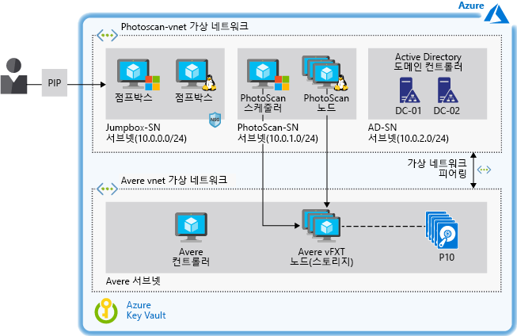

# Azure에서 디지털 이미지 기반 모델링 가속화Accelerate digital image-based modeling on Azure

이 예제 시나리오에서는 Azure IaaS(Infrastructure-as-a-Service)에서 이미지 기반 모델링을 수행하려는 모든 조직을 위한 아키텍처 및 설계 지침을 제공합니다.This example scenario provides architecture and design guidance for any organization that wants to perform image-based modeling on Azure infrastructure-as-a-service (IaaS). 이 시나리오는 처리 시간을 가속화하는 고성능 스토리지를 사용하여 Azure VM(Virtual Machine)에서 사진 측량 소프트웨어를 실행하도록 설계되었습니다.The scenario is designed for running photogrammetry software on Azure Virtual Machines (VMs) using high-performance storage that accelerates processing time. 필요에 따라 환경을 강화하거나 축소할 수 있으며, 성능을 떨어뜨리지 않고 테라바이트 단위의 스토리지를 지원할 수 있습니다.The environment can be scaled up and down as needed and supports terabytes of storage without sacrificing performance.

## 관련 사용 사례Relevant use cases

관련 사용 사례는 다음과 같습니다.Relevant use cases include:

- 건물, 엔지니어링 구조물 및 범죄 사고 현장을 모델링하고 측정합니다.Modeling and measuring buildings, engineering structures, and forensic accident scenes.
- 컴퓨터 게임과 영화에 대한 시각 효과를 만듭니다.Creating visual effects for computer games and movies.
- 디지털 이미지를 사용하여 도시 계획 및 기타 애플리케이션에서와 같이 다양한 규모의 개체에 대한 측정값을 간접적으로 생성합니다.Using digital images to indirectly generate measurements of objects of various scales as in urban planning and other applications.

## 아키텍처Architecture

이 예에서는 Avere vFXT 스토리지에서 지원하는 Agisoft PhotoScan 사진 측량 소프트웨어를 사용하는 방법에 대해 설명합니다.This example describes the use of Agisoft PhotoScan photogrammetry software backed by Avere vFXT storage. PhotoScan은 GIS(지리 정보 시스템) 애플리케이션, 문화 유산 설명서, 게임 개발 및 시각 효과 제작에서 인기가 있어 선택되었습니다.PhotoScan was chosen for its popularity in geographic information system (GIS) applications, cultural heritage documentation, game development, and visual effects production. 근거리 사진 측량 및 항공 사진 측량 모두에 적합합니다.It is suitable for both close-range photogrammetry and aerial photogrammetry.

이 문서의 개념은 인프라로 관리되는 스케줄러 및 작업자 노드를 기반으로 하는 모든 HPC(고성능 컴퓨팅) 워크로드에 적용됩니다.The concepts in this article apply to any high-performance computing (HPC) workload based on a scheduler and worker nodes managed as infrastructure.  이 워크로드의 경우 Avere vFXT가 벤치마크 테스트를 수행하는 동안 뛰어난 성능을 발휘하도록 선택되었습니다.For this workload, Avere vFXT was selected for its superior performance during benchmark tests.  그러나 시나리오는 다른 스토리지 솔루션을 사용할 수 있도록 처리와 스토리지를 분리합니다(이 문서의 뒷부분에 나오는 [대안](#alternatives) 참조).However, the scenario decouples the storage from the processing so that other storage solutions can be used (see [alternatives](#alternatives) later in this document).

또한 이 아키텍처에는 Azure 리소스에 대한 액세스를 제어하고 DNS(Domain Name System)를 통해 내부 이름 확인을 제공하는 Active Directory 도메인 컨트롤러도 포함됩니다.This architecture also includes Active Directory domain controllers to control access to Azure resources and provide internal name resolution through the Domain Name System (DNS). 점프박스는 솔루션을 실행하는 Windows 및 Linux VM에 대한 관리자 액세스 권한을 제공합니다.Jump boxes provide administrator access to the Windows and Linux VMs that run the solution.

1. 사용자는 여러 이미지를 PhotoScan에 제출합니다.User submits a number of images to PhotoScan.
2. PhotoScan 스케줄러는 헤드 노드 역할을 하고 사용자의 이미지를 처리하도록 지시하는 Windows VM에서 실행됩니다.The PhotoScan Scheduler runs on a Windows VM that serves as the head node and directs processing of the user's images.
3. PhotoScan은 사진의 공통점을 검색하고, GPU(그래픽 처리 장치)가 있는 VM에서 실행되는 PhotoScan 처리 노드를 사용하여 기하 도형(메시)을 생성합니다.PhotoScan searches for common points on the photographs and constructs the geometry (mesh) using the PhotoScan processing nodes running on VMs with graphics processing units (GPUs).
4. Avere vFXT는 Azure에서 NFSv3(네트워크 파일 시스템 버전 3) 기반의 고성능 스토리지 솔루션을 제공하며, 4개 이상의 VM으로 구성됩니다.Avere vFXT provides a high-performance storage solution on Azure based on Network File System version 3 (NFSv3) and comprised of at least four VMs.
5. PhotoScan은 모델을 렌더링합니다.PhotoScan renders the model.

### 구성 요소Components

- [Agisoft PhotoScan](http://www.agisoft.com/): PhotoScan 스케줄러는 Windows 2016 Server VM에서 실행되며, 처리 노드는 CentOS Linux 7.5를 실행하는 GPU가 있는 5개의 VM을 사용합니다.[Agisoft PhotoScan](http://www.agisoft.com/): The PhotoScan Scheduler runs on a Windows 2016 Server VM, and the processing nodes use five VMs with GPUs that run CentOS Linux 7.5.
- [Avere vFXT](/azure/avere-vfxt/avere-vfxt-overview)는 개체 스토리지와 기존 NAS(Network Attached Storage)를 사용하여 큰 데이터 세트의 스토리지를 최적화하는 파일 캐싱 솔루션입니다.[Avere vFXT](/azure/avere-vfxt/avere-vfxt-overview) is a file caching solution that uses object storage and traditional network-attached storage (NAS) to optimize storage of large datasets.  다음을 포함합니다.It includes:
  - Avere 컨트롤러.Avere Controller. 이 VM은 Avere vFXT 클러스터를 설치하고 Ubuntu 18.04 LTS를 실행하는 스크립트를 실행합니다.This VM executes the script that installs the Avere vFXT cluster and runs Ubuntu 18.04 LTS. 나중에 이 VM을 사용하여 클러스터 노드를 추가하거나 제거하고 클러스터를 삭제할 수도 있습니다.The VM can be used later to add or remove cluster nodes and to destroy the cluster as well.
  - vFXT 클러스터.vFXT cluster. Avere OS 5.0.2.1 기반의 Avere vFXT 노드 각각에 대해 하나씩, 3개 이상의 VM이 사용됩니다.At least three VMs are used, one for each of the Avere vFXT nodes based on Avere OS 5.0.2.1. 이러한 VM은 Azure Blob 스토리지에 연결된 vFXT 클러스터를 형성합니다.These VMs form the vFXT cluster, which is attached to Azure Blob storage.
- [Microsoft Active Directory 도메인 컨트롤러](/windows/desktop/ad/active-directory-domain-services)를 사용하면 호스트에서 도메인 리소스에 액세스하고 DNS 이름 확인을 제공할 수 있습니다.[Microsoft Active Directory domain controllers](/windows/desktop/ad/active-directory-domain-services) allow the host access to domain resources and provide DNS name resolution. Avere vFXT는 여러 개의 A 레코드를 추가합니다. 예를 들어 vFXT 클러스터의 각 A 레코드는 각 Avere vFXT 노드의 IP 주소를 가리킵니다.Avere vFXT adds a number of A records—for example, each A record in a vFXT cluster points to the IP address of each Avere vFXT node. 이 설정에서는 모든 VM이 라운드 로빈 패턴을 사용하여 vFXT 내보내기에 액세스합니다.In this setup, all VMs use the round-robin pattern to access vFXT exports.
- [다른 VM](/azure/virtual-machines/)은 관리자가 스케줄러와 처리 노드에 액세스하는 데 사용하는 점프박스 역할을 합니다.[Other VMs](/azure/virtual-machines/) serve as jump boxes used by the administrator to access the scheduler and processing nodes. 관리자가 원격 데스크톱 프로토콜을 통해 헤드 노드에 액세스할 수 있게 하려면 Windows 점프박스가 필수적입니다.The Windows jumpbox is mandatory to allow the administrator to access the head node via remote desktop protocol. 두 번째 점프박스는 선택 사항이며 작업자 노드 관리를 위해 Linux를 실행합니다.The second jumpbox is optional and runs Linux for administration of the worker nodes.
- [NSG](/azure/virtual-network/manage-network-security-group)(네트워크 보안 그룹)는 PIP(공용 IP 주소)에 대한 액세스를 제한하고, 3389 및 22 포트에서 점프박스 서브넷에 연결된 VM에 액세스할 수 있도록 허용합니다.[Network security groups](/azure/virtual-network/manage-network-security-group) (NSGs) limit access to the public IP address (PIP) and allow ports 3389 and 22 for access to the VMs attached to the Jumpbox subnet.
- [가상 네트워크 피어링](/azure/virtual-network/virtual-network-peering-overview)은 PhotoScan 가상 네트워크를 Avere 가상 네트워크에 연결합니다.[Virtual network peering](/azure/virtual-network/virtual-network-peering-overview) connects a PhotoScan virtual network to an Avere virtual network.
- [Azure Blob 스토리지](/azure/storage/blobs/storage-blobs-introduction)는 Avere vFXT를 코어 파일러로 사용하여 처리 중인 커밋된 데이터를 저장합니다.[Azure Blob storage](/azure/storage/blobs/storage-blobs-introduction) works with Avere vFXT as the core filer to store the committed data being processed. Avere vFXT는 Azure Blob에 저장된 활성 데이터를 식별하고, PhotoScan 작업이 실행되는 동안 컴퓨팅 노드에서 캐싱에 사용되는 SSD(반도체 드라이브)에 계층화합니다.Avere vFXT identifies the active data stored in Azure Blob and tiers it into solid-state drives (SSD) used for caching in its compute nodes while a PhotoScan job is running. 변경되면 데이터가 코어 파일러에 비동기적으로 다시 커밋됩니다.If changes are made, the data is asynchronously committed back to the core filer.
- [Azure Key Vault](/azure/key-vault/key-vault-overview)는 관리자 암호와 PhotoScan 활성화 코드를 저장하는 데 사용됩니다.[Azure Key Vault](/azure/key-vault/key-vault-overview) is used to store the administrator passwords and PhotoScan activation code.

### 대안Alternatives

- Azure 서비스를 활용하여 HPC 클러스터를 관리하려면 템플릿 또는 스크립트를 통해 리소스를 관리하는 대신 Azure CycleCloud 또는 Azure Batch와 같은 도구를 사용합니다.To take advantage of Azure services for managing an HPC cluster, use tools such as Azure CycleCloud or Azure Batch instead of managing the resources through templates or scripts.
- Avere vFXT 대신 BeeGFS 병렬 가상 파일 시스템을 백 엔드 스토리지로 Azure에 배포합니다.Deploy the BeeGFS parallel virtual file system as the back-end storage on Azure instead of Avere vFXT. 이 엔드투엔드 솔루션을 Azure에 배포하려면 [BeeGFS 템플릿](https://github.com/paulomarquesc/beegfs-template)을 사용합니다.Use the [BeeGFS template](https://github.com/paulomarquesc/beegfs-template) to deploy this end-to-end solution on Azure.
- GlusterFS, Lustre 또는 Windows 스토리지 공간 다이렉트와 같이 원하는 스토리지 솔루션을 배포합니다.Deploy the storage solution of your choice, such as GlusterFS, Lustre, or Windows Storage Spaces Direct. 이렇게 하려면 원하는 스토리지 솔루션을 사용하도록 [PhotoScan 템플릿](https://github.com/paulomarquesc/photoscan-template)을 편집합니다.To do this, edit the [PhotoScan template](https://github.com/paulomarquesc/photoscan-template) to work with the storage solution you want.
- 기본 옵션인 Linux 대신 Windows 운영 체제를 사용하여 작업자 노드를 배포합니다.Deploy the worker nodes with the Windows operating system instead of Linux, the default option. Windows 노드를 선택할 때 스토리지 통합 옵션은 배포 템플릿에서 실행되지 않습니다.When choosing Windows nodes, storage integration options are not executed by the deployment templates. [리포지토리](https://github.com/paulomarquesc/photoscan-template/blob/master/docs/AverePostDeploymentSteps.md)에서 설명한 대로 환경을 기존 스토리지 솔루션과 수동으로 통합하거나 이러한 자동화 기능을 제공하도록 PhotoScan 템플릿을 사용자 지정해야 합니다.You must manually integrate the environment with an existing storage solution, or customize the PhotoScan template to provide such automation, as described in the [repository](https://github.com/paulomarquesc/photoscan-template/blob/master/docs/AverePostDeploymentSteps.md).

## 고려 사항Considerations

이 시나리오는 Windows 또는 Linux에 배포되었는지 여부에 관계없이 HPC 워크로드용 고성능 스토리지를 제공하기 위해 특별히 설계되었습니다.This scenario is designed specifically to provide high-performance storage for an HPC workload, whether it is deployed on Windows or Linux. 일반적으로 HPC 워크로드의 스토리지 구성은 온-프레미스 배포에 사용되는 적절한 모범 사례와 일치해야 합니다.In general, the storage configuration of the HPC workload should match the appropriate best practices used for on-premises deployments.

배포 고려 사항은 사용되는 애플리케이션과 서비스에 따라 다르지만 다음과 같은 몇 가지 참고 사항이 적용됩니다.Deployment considerations depend on the applications and services used, but a few notes apply:

- 고성능 애플리케이션을 구축하는 경우 Azure Premium Storage를 사용하고 [애플리케이션 계층을 최적화](/azure/virtual-machines/windows/premium-storage-performance)합니다.When building high-performance applications, use Azure Premium Storage and [optimize the application layer](/azure/virtual-machines/windows/premium-storage-performance). Azure Blob [핫 계층 액세스](/azure/storage/blobs/storage-blob-storage-tiers)를 사용하여 자주 액세스할 수 있도록 스토리지를 최적화합니다.Optimize storage for frequent access using Azure Blob [hot tier access](/azure/storage/blobs/storage-blob-storage-tiers).
- 가용성 및 성능 요구 사항이 충족되는 스토리지 [복제 옵션](/azure/storage/common/storage-redundancy)을 사용합니다.Use a storage [replication option](/azure/storage/common/storage-redundancy) that that meets your availability and performance requirements. 이 예에서는 고가용성을 위해 LRS(로컬 중복 스토리지)가 있는 Avere vFXT가 기본적으로 구성되어 있습니다.In this example, Avere vFXT is configured for high availability by default, with locally redundant storage (LRS). 부하 분산의 경우 이 설정의 모든 VM에서 라운드 로빈 패턴을 사용하여 vFXT 내보내기에 액세스합니다.For load balancing, all VMs in this setup use the round-robin pattern to access vFXT exports.
- 백 엔드 스토리지가 Windows 클라이언트와 Linux 클라이언트 모두에서 사용되는 경우 Samba 서버를 사용하여 Windows 노드를 지원합니다.If the backend storage will be consumed by both Windows clients and Linux clients, use Samba servers to support the Windows nodes. BeeGFS를 기반으로 하는 이 예제 시나리오의 [버전](https://github.com/paulomarquesc/beegfs-template)은 Samba를 사용하여 Windows에서 실행되는 HPC 워크로드(PhotoScan)의 스케줄러 노드를 지원합니다.A [version](https://github.com/paulomarquesc/beegfs-template) of this example scenario based on BeeGFS uses Samba to support the scheduler node of the HPC workload (PhotoScan) running on Windows. 부하 분산 장치가 DNS 라운드 로빈에 대한 스마트 대안으로 작동하도록 배포됩니다.A load balancer is deployed to act like a smart replacement for DNS round robin.
- [Windows](/azure/virtual-machines/windows/sizes-hpc) 또는 [Linux](/azure/virtual-machines/linux/sizes?toc=%2fazure%2fvirtual-machines%2flinux%2ftoc.json) 워크로드에 가장 적합한 VM 유형을 사용하여 HPC 애플리케이션을 실행합니다.Run HPC applications using the VM type best suited for your [Windows](/azure/virtual-machines/windows/sizes-hpc) or [Linux](/azure/virtual-machines/linux/sizes?toc=%2fazure%2fvirtual-machines%2flinux%2ftoc.json) workload.
- HPC 워크로드를 스토리지 리소스에서 격리하려면 각각 자체의 가상 네트워크에 배포한 다음, 가상 네트워크 [피어링](/azure/virtual-network/virtual-network-peering-overview)을 사용하여 두 네트워크를 연결합니다.To isolate the HPC workload from the storage resources, deploy each in its own virtual network, then use virtual network [peering](/azure/virtual-network/virtual-network-peering-overview) to connect the two. 피어링은 서로 다른 가상 네트워크의 리소스 간에 대기 시간이 짧은 고대역폭 연결을 만들고, 사설 IP 주소를 통해서만 Microsoft 백본 인프라를 통해 트래픽을 라우팅합니다.Peering creates a low-latency, high-bandwidth connection between resources in different virtual networks and routes traffic through the Microsoft backbone infrastructure through private IP addresses only.

### 보안Security

이 예에서는 HPC 워크로드용 고성능 스토리지 솔루션을 배포하는 데 중점을 두고 있으며 보안 솔루션이 아닙니다.This example focuses on deploying a high-performance storage solution for an HPC workload and is not a security solution. 모든 변경에는 보안 팀이 참여해야 합니다.Make sure to involve your security team for any changes.

보안을 강화하기 위해 이 인프라 예를 사용하면 모든 Windows VM이 도메인에 조인될 수 있으며 Active Directory를 중앙 인증에 사용할 수 있습니다.For added security, this example infrastructure enables all the Windows VMs to be domain-joined and uses Active Directory for central authentication. 또한 모든 VM에 대한 사용자 지정 DNS 서비스도 제공합니다.It also provides custom DNS services for all VMs. 환경을 보호하기 위해 이 템플릿은 [NSG(네트워크 보안 그룹)](/azure/virtual-network/security-overview)를 사용합니다.To help protect the environment, this template relies on [network security groups (NSGs)](/azure/virtual-network/security-overview). NSG는 기본 트래픽 필터와 보안 규칙을 제공합니다.NSGs offer basic traffic filters and security rules.

이 시나리오에서 보안을 더 강화하려면 다음 옵션을 고려합니다.Consider the following options to further improve security in this scenario:

- Fortinet, Checkpoint 및 Juniper와 같은 네트워크 가상 어플라이언스를 사용합니다.Use network virtual appliances such as Fortinet, Checkpoint, and Juniper.
- 리소스 그룹에 [역할 기반 액세스 제어](/azure/role-based-access-control/overview)를 적용합니다.Apply [role-based access control](/azure/role-based-access-control/overview) to the resource groups.
- 인터넷을 통해 점프박스에 액세스하는 경우 VM [JIT](/azure/security-center/security-center-just-in-time) 액세스를 사용하도록 설정합니다.Enable VM [JIT](/azure/security-center/security-center-just-in-time) access if jump boxes are accessed via the Internet.
- [Azure Key Vault](/azure/key-vault/quick-create-portal)를 사용하여 관리자 계정에서 사용되는 암호를 저장합니다.Use [Azure Key Vault](/azure/key-vault/quick-create-portal) to store the passwords used by administrator accounts.

## 가격Pricing

이 시나리오를 실행하는 데 드는 비용은 여러 요인에 따라 크게 달라질 수 있습니다.The cost of running this scenario can vary greatly depending on on multiple factors.  VM의 수와 크기, 필요한 스토리지 양 및 작업 완료 시간에 따라 비용이 결정됩니다.The number and size of VMs, how much storage is required, and the amount of time to complete a job will determine your cost.

다음과 같은 [Azure 가격 계산기](https://azure.com/e/42362ddfd2e245a28a8e78bc609c80f3)의 비용 프로필 샘플은 Avere vFXT 및 PhotoScan에 대한 일반적인 구성을 기반으로 합니다.The following sample cost profile in the [Azure pricing calculator](https://azure.com/e/42362ddfd2e245a28a8e78bc609c80f3) is based on a typical configuration for Avere vFXT and PhotoScan:

- 1개 A1\_v2 Ubuntu VM - Avere 컨트롤러를 실행합니다.1 A1\_v2 Ubuntu VM to run the Avere controller.
- 3개 D16s\_v3 Avere OS VM - vFXT 클러스터를 형성하는 Avere vFXT 노드마다 하나씩 있어야 합니다.3 D16s\_v3 Avere OS VMs, one for each of the Avere vFXT nodes that form the vFXT cluster.
- 5개 NC24\_v2 Linux VM - PhotoScan 처리 노드에 필요한 GPU를 제공합니다.5 NC24\_v2 Linux VMs to provide the GPUs needed by the PhotoScan processing nodes.
- 1개 D8s\_v3 CentOS VM - PhotoScan 스케줄러 노드에 사용합니다.1 D8s\_v3 CentOS VM for the PhotoScan scheduler node.
- 1개 DS2\_v2 CentOS - 관리자 점프박스로 사용됩니다.1 DS2\_v2 CentOS used as administrator jumpbox.
- 2개 DS2\_v2 VM - Active Directory 도메인 컨트롤러에 사용합니다.2 DS2\_v2 VMs for the Active Directory domain controllers.
- 프리미엄 관리 디스크Premium managed disks.
- GPv2(범용 v2) Blob 스토리지(LRS 및 핫 계층 액세스 사용) - GPv2 스토리지 계정만 액세스 계층 특성을 공개합니다.General purpose v2 (GPv2) Blob storage with LRS and hot tier access (only GPv2 storage accounts expose the Access Tier attribute).
- 10TB 데이터 전송을 지원하는 가상 네트워크Virtual network with support for 10 TB data transfer.

이 아키텍처에 대한 자세한 내용은 이 [전자책](https://azure.microsoft.com/en-us/resources/deploy-agisoft-photoscan-on-azure-with-azere-vfxt-for-azure-or-beegfs/)을 참조하세요.For details about this architecture, see the [ebook](https://azure.microsoft.com/en-us/resources/deploy-agisoft-photoscan-on-azure-with-azere-vfxt-for-azure-or-beegfs/). 특정 사용 사례에 따라 변하는 가격을 확인하려면 가격 계산기에서 예상 배포와 일치하는 다른 VM 크기를 선택합니다.To see how the pricing would change for your particular use case, choose different VM sizes in the pricing calculator to match your expected deployment.

## 배포Deployment

Avere FxT 또는 BeeGFS를 사용하기 위한 모든 필수 구성 요소를 포함하여 이 아키텍처를 배포하기 위한 단계별 지침을 살펴보려면 다음 전자책을 다운로드합니다. [Avere vFXT for Azure 또는 Avere vFXT for BeeGFS를 사용하여 Azure에 Agisoft PhotoScan 배포](https://azure.microsoft.com/en-us/resources/deploy-agisoft-photoscan-on-azure-with-azere-vfxt-for-azure-or-beegfs/)For step-by-step instructions for deploying this architecture, including all the prerequisites for using either Avere FxT or BeeGFS, download the ebook: [Deploy Agisoft PhotoScan on Azure With Avere vFXT for Azure or BeeGFS](https://azure.microsoft.com/en-us/resources/deploy-agisoft-photoscan-on-azure-with-azere-vfxt-for-azure-or-beegfs/).

## 관련 리소스Related resources

이 시나리오에서 활용되는 구성 요소에 대한 자세한 정보를 Azure의 배치 컴퓨팅에 대한 대체 방법과 함께 제공하는 리소스는 다음과 같습니다.The following resources will provide more information on the components utilized in this scenario, along with alternative approaches for batch computing on Azure.

- [Avere vFXT for Azure](/azure/avere-vfxt/avere-vfxt-overview) 개요Overview of [Avere vFXT for Azure](/azure/avere-vfxt/avere-vfxt-overview)
- [Agisoft PhotoScan](https://www.agisoft.com/) 홈 페이지[Agisoft PhotoScan](https://www.agisoft.com/) home Page
- [Azure Storage 성능 및 확장성 검사 목록Azure Storage Performance and Scalability Checklist](/azure/storage/common/storage-performance-checklist)
- [Microsoft Azure의 병렬 가상 파일 시스템: Lustre, GlusterFS 및 BeeGFS의 성능 테스트](https://azure.microsoft.com/mediahandler/files/resourcefiles/parallel-virtual-file-systems-on-microsoft-azure/Parallel_Virtual_File_Systems_on_Microsoft_Azure.pdf)(PDF)[Parallel Virtual File Systems on Microsoft Azure: Performance tests of Lustre, GlusterFS, and BeeGFS](https://azure.microsoft.com/mediahandler/files/resourcefiles/parallel-virtual-file-systems-on-microsoft-azure/Parallel_Virtual_File_Systems_on_Microsoft_Azure.pdf) (PDF)
- Azure의 [CAE(컴퓨터 지원 엔지니어링) 예제 시나리오](/azure/architecture/example-scenario/apps/hpc-saas)An example scenario for [computer-aided engineering (CAE) on Azure](/azure/architecture/example-scenario/apps/hpc-saas)
- [Azure의 HPC](https://azure.microsoft.com/en-us/solutions/high-performance-computing/) 홈 페이지[HPC on Azure](https://azure.microsoft.com/en-us/solutions/high-performance-computing/) home page
- [빅 컴퓨팅: HPC &amp; Microsoft Batch](https://azure.microsoft.com/en-us/solutions/big-compute/) 개요Overview of [Big Compute: HPC &amp; Microsoft Batch](https://azure.microsoft.com/en-us/solutions/big-compute/)