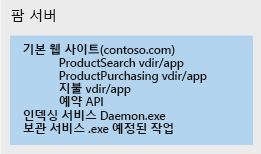
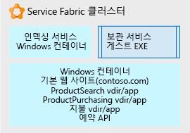

# Service Fabric을 사용하여 모놀리식 애플리케이션 분해

이 예제 시나리오에서는 [Service Fabric](/azure/service-fabric/service-fabric-overview)을 다루기 어려운 모놀리식 애플리케이션을 분해하기 위한 플랫폼으로 사용하는 방법을 살펴봅니다. 여기서는 IIS/ASP.NET 웹 사이트를 여러 개의 관리 가능한 마이크로 서비스로 구성된 애플리케이션으로 분해하는 반복적인 방법을 고려합니다.

모놀리식 아키텍처에서 마이크로 서비스 아키텍처로 전환하면 다음과 같은 이점이 있습니다.

- 작고 이해하기 쉬운 하나의 코드 단위를 변경하고 해당 단위만 배포할 수 있습니다.
- 각 코드 단위를 몇 분 안에 배포할 수 있습니다.
- 해당 작은 단위에 오류가 있는 경우 전체 애플리케이션이 아니라 해당 단위만 작동을 중지합니다.
- 작은 코드 단위를 여러 개발 팀에 개별적으로 쉽게 배포할 수 있습니다.
- 새 개발자가 각 단위의 개별 기능을 빠르고 쉽게 파악할 수 있습니다.

이 예제에서는 서버 팜의 대규모 IIS 애플리케이션이 사용되지만, 반복적인 분해 및 호스팅에 대한 개념은 모든 유형의 대규모 애플리케이션에 사용할 수 있습니다. 이 솔루션은 Windows를 사용하지만, Linux에서도 Service Fabric을 실행할 수 있습니다. 온-프레미스, Azure 또는 원하는 클라우드 공급자의 VM 노드에서 실행할 수 있습니다.

## 관련 사용 사례

이 시나리오는 다음과 같은 상황이 발생한 대규모 모놀리식 웹 애플리케이션을 사용하는 있는 조직과 관련이 있습니다.

- 사소한 코드 변경 오류로 인해 전체 사이트가 손상됩니다.
- 웹 사이트 전체를 릴리스 업데이트해야 하므로 릴리스에 며칠이 걸립니다.
- 코드 베이스가 복잡하여 새로운 개발자 또는 팀이 적응하는 데 오래 걸리고, 한 개인이 실현 가능한 것보다 더 많은 것을 알고 있어야 합니다.

## 아키텍처

Service Fabric을 호스팅 플랫폼으로 사용하면 아래와 같이 대규모 IIS 웹 사이트를 마이크로 서비스 컬렉션으로 변환할 수 있습니다.

위의 그림에서 대규모 IIS 애플리케이션의 모든 부분을 다음과 같이 분해했습니다.

- 들어오는 브라우저 요청을 수락하고, 구문 분석하여 처리할 서비스를 결정하고, 요청을 해당 서비스에 전달하는 라우팅 또는 게이트웨이 서비스.
- ASP.NET 애플리케이션으로 실행되는 단일 IIS 사이트 아래에 있는 공식적인 가상 디렉터리였던 4개의 ASP.NET Core 애플리케이션. 애플리케이션은 고유의 독립 마이크로 서비스로 분리되었습니다. 이에 따라 개별적으로 변경, 버전 관리 및 업그레이드할 수 있습니다. 이 예에서는 .Net Core 및 ASP.NET Core를 사용하여 각 애플리케이션을 다시 작성했습니다. 이 서비스는 전체 Service Fabric 플랫폼 기능 및 이점(통신 서비스, 상태 보고서, 알림 등)에 기본적으로 액세스할 수 있도록 [Reliable Services](/azure/service-fabric/service-fabric-reliable-services-introduction)로 작성되었습니다.
- *인덱싱 서비스*라고 하는 Windows 서비스. Windows 컨테이너에 배치되어 더 이상 기본 서버의 레지스트리를 직접 변경하지 않지만, 자체 포함형으로 실행하고 모든 종속성을 단일 단위로 사용하여 배포할 수 있습니다.
- 보관 서비스. 일정에 따라 실행되고 사이트에 대한 몇 가지 작업을 수행하는 단순한 실행 파일입니다. 수정 없이 수행해야 하는 작업을 수행할 수 있으며 변경하는 데 투자할 가치가 없다고 판단했으므로 독립 실행형 실행 파일로 직접 호스팅됩니다.

## 고려 사항

첫 번째 과제는 모놀리스에서 분해할 수 있는 더 작은 비트의 코드를 모놀리스에서 호출할 수 있는 마이크로 서비스로 식별하는 것입니다. 모놀리스는 시간이 지남에 따라 반복적으로 개발자가 쉽게 이해하고, 변경하고, 낮은 위험에서 빠르게 배포할 수 있는 이러한 마이크로 서비스의 모음으로 분해됩니다.

Service Fabric은 다양한 형태의 모든 마이크로 서비스를 실행하도록 지원할 수 있으므로 선택되었습니다. 예를 들어 독립 실행형 실행 파일, 새 소규모 웹 사이트, 새 소규모 API 및 컨테이너화된 서비스 등을 혼합하여 사용할 수도 있습니다. Service Fabric은 이러한 모든 서비스 유형을 단일 클러스터에 결합할 수 있습니다.

이와 같이 최종적으로 분해된 애플리케이션에 도달하기 위해 반복적인 접근 방식을 사용했습니다. 서버 팜에 있는 대규모 IIS/ASP.Net 웹 사이트로 시작했습니다. 서버 팜의 단일 노드는 아래에 나와 있습니다. 여기에는 여러 가상 디렉터리가 있는 원래 웹 사이트, 사이트에서 호출하는 추가 Windows 서비스 및 일부 사이트 보관 파일 유지 관리를 정기적으로 수행하는 실행 파일이 포함되어 있습니다.

첫 번째 개발 반복에서 IIS 사이트와 가상 디렉터리는 [Windows 컨테이너](/azure/service-fabric/service-fabric-containers-overview)에 배치되었습니다. 이렇게 하면 사이트에서 운영 상태를 유지할 수 있지만 기본 서버 노드 OS에 바인딩되지는 않습니다. 컨테이너는 기본 Service Fabric 노드에서 실행되고 오케스트레이션되지만, 노드에는 레지스트리 항목, 파일 등에 종속된 상태의 사이트가 있을 필요가 없습니다. 이 모든 항목은 컨테이너에 있습니다. 또한 같은 이유로 Windows 컨테이너에 인덱싱 서비스를 배치했습니다. 컨테이너는 독립적으로 배포, 버전 관리 및 크기 조정할 수 있습니다. 마지막으로, Archive Service는 특별한 요구 사항이 없는 자체 포함된 exe이므로 이를 간단한 [독립 실행형 실행 파일](/azure/service-fabric/service-fabric-guest-executables-introduction)로 호스팅했습니다.

아래 그림에서는 이제 대규모 웹 사이트가 독립적인 단위로 부분적으로 분해되어 시간이 지날수록 더 많은 부분으로 분해할 준비가 되었음을 보여줍니다.

추가 개발에서는 위에 표시된 단일 대규모 기본 웹 사이트 컨테이너를 분리하는 데 중점을 둡니다. 각 가상 네트워크 ASP.NET 앱은 컨테이너에서 한 번에 하나씩 제거되고, ASP.NE Core [신뢰할 수 있는 서비스](/azure/service-fabric/service-fabric-reliable-services-introduction)로 이식됩니다.

각 가상 디렉터리가 분해되면 기본 웹 사이트가 들어오는 브라우저 요청을 수락하고, 이를 올바른 ASP.NET 앱으로 라우팅하는 ASP.NET Core 신뢰할 수 있는 서비스로 작성됩니다.

### 가용성, 확장성 및 보안

Service Fabric은 동일한 클러스터에서 상호 간의 호출을 빠르고 간단하게 유지할 수 있는 [다양한 형태의 마이크로 서비스를 지원](/azure/service-fabric/service-fabric-choose-framework)할 수 있습니다. Service Fabric은 컨테이너, 실행 파일을 실행할 수 있는 [내결함성](/azure/service-fabric/service-fabric-availability-services) 자체 복구 클러스터이며, 여기에는 마이크로 서비스를 직접 작성할 수 있는 네이티브 API(위에서 'Reliable Services'로 언급됨)도 있습니다. 플랫폼은 각 마이크로 서비스의 롤링 업그레이드 및 버전 관리를 용이하게 합니다. 필요한 마이크로 서비스만 [확장 또는 축소](/azure/service-fabric/service-fabric-concepts-scalability)하기 위해 Service Fabric 클러스터 전체에 분산되어 있는 특정 마이크로 서비스를 더 많거나 적게 실행하도록 플랫폼에 지시할 수 있습니다.

Service Fabric은 네트워킹, 저장소 및 운영 체제가 있는 가상(또는 물리적) 노드 인프라를 기반으로 하는 클러스터입니다. 따라서 일련의 관리, 유지 관리 및 모니터링 작업이 있습니다.

또한 클러스터에 대한 거버넌스 및 제어도 고려해야 합니다. 사람들이 임의로 데이터베이스를 프로덕션 데이터베이스 서버에 배포하지 못하도록 하려는 것처럼, 감독 없이도 사람들이 Service Fabric 클러스터에 애플리케이션을 배포하지 못하도록 해야 합니다.

Service Fabric은 다양한 [애플리케이션 시나리오](/azure/service-fabric/service-fabric-application-scenarios)를 호스팅할 수 있으므로 시나리오에 적용되는 애플리케이션을 확인하는 데 약간의 시간이 걸립니다.

## 가격

Azure에서 호스팅되는 Service Fabric 클러스터의 경우 비용의 가장 큰 부분은 클러스터에 있는 노드의 수와 크기입니다. Azure를 사용하면 지정한 기본 노드 크기로 구성된 클러스터를 빠르고 간단하게 만들 수 있지만, 계산 요금은 노드 크기에 노드 수를 곱한 값을 기반으로 합니다.

비용이 적게 드는 다른 구성 요소는 각 노드의 가상 디스크에 대한 저장소 요금 및 Azure의 네트워크 IO 송신(예: Azure에서 사용자 브라우저로의 네트워크 트래픽) 요금입니다.

비용을 알아볼 수 있도록 클러스터 크기, 네트워킹 및 스토리지에 대한 몇 가지 기본값을 사용하는 예제가 제공되었으므로, [요금 계산기](https://azure.com/e/52dea096e5844d5495a7b22a9b2ccdde)를 살펴보세요. 이 기본 계산기의 값을 각자의 상황에 맞는 값으로 자유롭게 업데이트하세요.

## 다음 단계

플랫폼에 익숙해지도록 잠시 시간을 내어 [설명서](/azure/service-fabric/service-fabric-overview)를 살펴보고 Service Fabric에 대한 다양한 [애플리케이션 시나리오](/azure/service-fabric/service-fabric-application-scenarios)를 검토합니다. 이 설명서에서는 클러스터의 구성 요소, 실행할 수 있는 항목, 소프트웨어 아키텍처 및 유지 관리에 대해 설명합니다.

기존 .NET 애플리케이션에 대한 Service Fabric 데모를 보려면 Service Fabric [빠른 시작](/azure/service-fabric/service-fabric-quickstart-dotnet)을 배포합니다.

현재 애플리케이션의 관점에서 다양한 함수를 고려합니다. 그 중 하나를 선택하고 전체에서 이 함수만 분리할 수 있는 방법을 고려합니다. 개별적으로 이해할 수 있는 조각을 한 번에 하나씩 가져옵니다.

## 관련 리소스

- [Azure에서 마이크로 서비스 구축](/azure/architecture/microservices)
- [Service Fabric 개요](/azure/service-fabric/service-fabric-overview)
- [Service Fabric 프로그래밍 모델](/azure/service-fabric/service-fabric-choose-framework)
- [Service Fabric 가용성](/azure/service-fabric/service-fabric-availability-services)
- [Service Fabric 크기 조정](/azure/service-fabric/service-fabric-concepts-scalability)
- [Service Fabric에서 컨테이너 호스팅](/azure/service-fabric/service-fabric-containers-overview)
- [Service Fabric에서 독립 실행형 실행 파일 호스팅](/azure/service-fabric/service-fabric-guest-executables-introduction)
- [Service Fabric 네이티브 Reliable Services](/azure/service-fabric/service-fabric-reliable-services-introduction)
- [Service Fabric 애플리케이션 시나리오](/azure/service-fabric/service-fabric-application-scenarios)