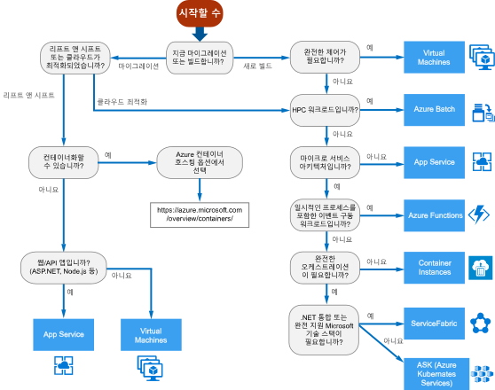

# Azure 계산 서비스에 대한 의사 결정 트리Decision tree for Azure compute services

Azure는 애플리케이션 코드를 호스트하는 다양한 방법을 제공합니다.Azure offers a number of ways to host your application code. *계산*이라는 용어는 애플리케이션이 실행되는 계산 리소스의 호스팅 모델을 말합니다.The term *compute* refers to the hosting model for the computing resources that your application runs on. 다음 순서도는 애플리케이션에 대한 계산 서비스를 선택하는 데 도움이 됩니다.The following flowchart will help you to choose a compute service for your application. 순서도는 권장 사항에 연결할 주요 의사 결정 기준의 집합을 안내합니다.The flowchart guides you through a set of key decision criteria to reach a recommendation.

**이 순서도를 시작점으로 처리합니다.****Treat this flowchart as a starting point.** 모든 애플리케이션에는 고유한 요구 사항이 있으므로 권장 사항을 시작점으로 처리합니다.Every application has unique requirements, so use the recommendation as a starting point. 그런 다음, 다음과 같은 측면을 살펴보는 보다 자세한 평가를 수행합니다.Then perform a more detailed evaluation, looking at aspects such as:

- 기능 집합Feature set
- [서비스 한도Service limits](/azure/azure-subscription-service-limits)
- [비용Cost](https://azure.microsoft.com/pricing/)
- [SLASLA](https://azure.microsoft.com/support/legal/sla/)
- [국가별 가용성Regional availability](https://azure.microsoft.com/global-infrastructure/services/)
- 개발자 에코시스템 및 팀 기술Developer ecosystem and team skills
- [계산 비교 표Compute comparison tables](./compute-comparison.md)

애플리케이션이 여러 워크로드로 구성된 경우 각 워크로드를 개별적으로 평가합니다.If your application consists of multiple workloads, evaluate each workload separately. 완벽한 솔루션은 두 개 이상의 계산 서비스를 통합할 수 있습니다.A complete solution may incorporate two or more compute services.

Azure에서 컨테이너 호스팅을 위한 옵션에 대한 자세한 내용은 [Azure 컨테이너](https://azure.microsoft.com/overview/containers/)를 참조하세요.For more information about your options for hosting containers in Azure, see [Azure Containers](https://azure.microsoft.com/overview/containers/).

## 순서도Flowchart

## 정의Definitions

- **리프트 앤 시프트**는 애플리케이션을 다시 디자인하거나 코드를 변경하지 않고 워크로드를 클라우드로 마이그레이션하는 전략입니다.**Lift and shift** is a strategy for migrating a workload to the cloud without redesigning the application or making code changes. *재 호스팅*이라고도 합니다.Also called *rehosting*. 자세한 내용은 [Azure 마이그레이션 센터](https://azure.microsoft.com/migration/)를 참조하세요.For more information, see [Azure migration center](https://azure.microsoft.com/migration/).

- **클라우드 최적화**는 클라우드 고유 기능 및 성능을 활용하도록 애플리케이션을 리팩터링하여 클라우드로 마이그레이션하는 전략입니다.**Cloud optimized** is a strategy for migrating to the cloud by refactoring an application to take advantage of cloud-native features and capabilities.

## 다음 단계Next steps

고려해야 할 추가 기준은 [Azure 계산 서비스를 선택하기 위한 조건](./compute-comparison.md)을 참조하세요.For additional criteria to consider, see [Criteria for choosing an Azure compute service](./compute-comparison.md).
