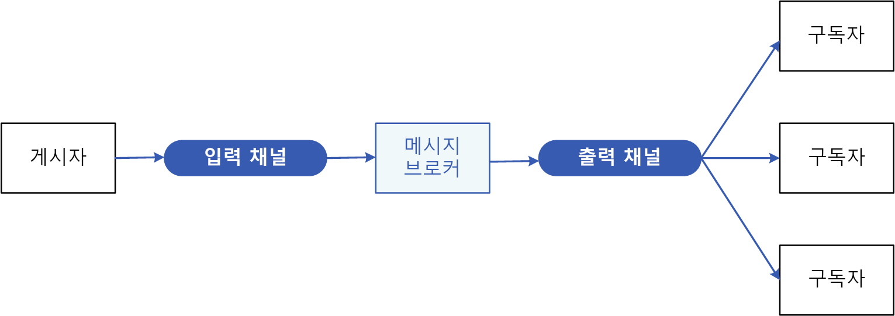
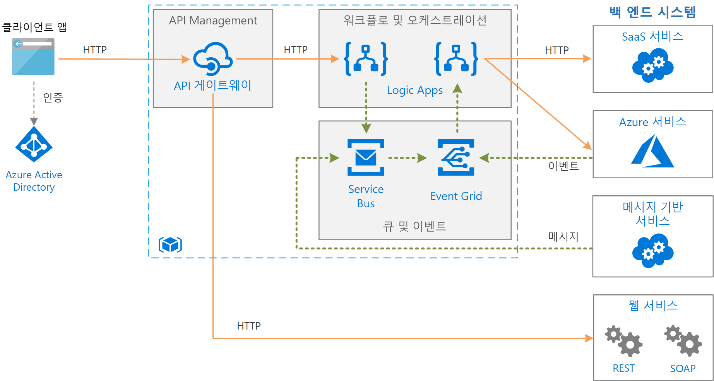

# 게시자-구독자 패턴

발신자는 수신자에 게 결합 하지 않고 비동기적으로 이벤트를 관심 있는 여러 소비자에 게 발표할 응용 프로그램을 사용 합니다.

**또 다른 명칭**: 게시/구독 메시지

## 컨텍스트 및 문제점

클라우드 기반 및 분산 애플리케이션에서는 이벤트가 발생하면 종종 시스템 구성 요소가 다른 구성 요소에 정보를 제공해야 합니다.

비동기 메시지는 발신자를 소비자로부터 분리하고, 발신자가 응답을 기다리지 않게 해주는 효과적인 방법입니다. 그러나 각 소비자에게 전용 메시지 큐를 사용하면 여러 소비자에 맞게 효과적으로 크기가 조정되지 않습니다. 또한 일부 소비자는 특정 정보에만 관심이 있을 수도 있습니다. 발신자가 소비자의 ID를 모르더라도 관심이 있는 모든 소비자에게 이벤트를 알리려면 어떻게 해야 할까요?

## 해결 방법

다음을 포함하는 비동기 메시지 하위 시스템을 도입합니다.

- 발신자가 사용하는 입력 메시지 채널. 발신자는 알려진 메시지 형식을 사용하여 이벤트를 메시지에 패키징하고, 입력 채널을 통해 이러한 메시지를 보냅니다. 이 패턴의 발신자를 *게시자*라고도 합니다.

  > [!NOTE]
  > *메시지*는 데이터 패킷입니다. *이벤트*는 발생한 변경 내용 또는 작업에 대해 다른 구성 요소에 알리는 메시지입니다.

- 소비자마다 출력 메시지 채널이 하나씩 있습니다. 소비자를 *구독자*라고 합니다.

- 입력 채널의 각 메시지를 해당 메시지에 관심이 있는 모든 구독자의 출력 채널로 복사하는 메커니즘입니다. 이 작업은 일반적으로 메시지 브로커 또는 이벤트 버스 같은 중간자가 처리합니다.

다음 다이어그램은 이 패턴의 논리적 구성 요소를 보여줍니다.

 
게시/구독 메시지에는 다음과 같은 혜택이 있습니다.

- 여전히 통신이 필요한 하위 시스템을 분리합니다. 하위 시스템을 독립적으로 관리할 수 있으며, 하나 이상의 수신기가 오프라인이어도 메시지를 올바르게 관리할 수 있습니다.

- 확장성이 향상되고 발신자의 응답성이 개선됩니다. 발신자는 신속하게 단일 메시지를 입력 채널로 보낸 다음, 핵심 처리 업무로 돌아갈 수 있습니다. 메시지 인프라는 관심이 있는 구독자에게 메시지를 전달하는 책임을 맡습니다.

- 안정성을 향상시킵니다. 비동기 메시지는 증가된 부하 하에서도 애플리케이션이 계속해서 원활하게 실행되고 일시적 오류를 보다 효과적으로 처리할 수 있게 도와줍니다.

- 지연된 또는 예약된 처리를 허용합니다. 구독자는 사용량이 적은 시간까지 메시지 선택을 미룰 수 있으며, 특정 일정에 따라 메시지를 라우팅 또는 처리할 수도 있습니다.

- 여러 플랫폼, 프로그래밍 언어 또는 통신 프로토콜을 사용하여 시스템을 간단하게 통합할 수 있을 뿐 아니라 온-프레미스 시스템과 클라우드에서 실행 중인 애플리케이션 간의 통합도 가능합니다.

- 기업 전체에서 비동기 워크플로를 지원합니다.

- 테스트 가능성이 향상됩니다. 전체 통합 테스트 전략의 일부로 채널을 모니터링하고 메시지를 검사 또는 기록할 수 있습니다.

- 애플리케이션의 문제를 분리합니다. 각 애플리케이션은 핵심 기능에 집중할 수 있고, 메시지 인프라는 메시지를 여러 소비자에게 안정적으로 라우팅하는 데 필요한 모든 것을 처리합니다. 

## 문제 및 고려 사항

이 패턴을 구현할 방법을 결정할 때 다음 사항을 고려하세요.

- **기존 기술.** 게시-구독 모델을 지원하는 시중의 메시지 제품 및 서비스를 사용할 것을 강력하게 권장합니다. Azure에서는 [Service Bus](/azure/service-bus-messaging/) 또는 [Event Grid](/azure/event-grid/)를 사용하는 방안을 고려해 보세요. 게시/구독 메시지에 사용할 수 있는 다른 기술로는 Redis, RabbitMQ 및 Apache Kafka가 있습니다.

- **구독 처리.** 메시지 인프라는 소비자가 사용 가능한 채널에서 구독 또는 구독 취소할 수 있는 메커니즘을 제공해야 합니다.

- **보안.** 권한이 없는 사용자 또는 애플리케이션이 도청할 수 없도록 보안 정책을 통해 모든 메시지 채널에 대한 연결을 제한해야 합니다.

- **메시지 하위 집합.** 구독자는 일반적으로 게시자가 배포하는 메시지 하위 집합에만 관심이 있습니다. 메시지 서비스는 종종 구독자가 다음 방법을 통해 수신 메시지의 범위를 좁힐 수 있도록 허용합니다.

  - **토픽.** 각 토픽에는 전용 출력 채널이 있으며, 각 소비자는 모든 관련 토픽을 구독할 수 있습니다.
  - **콘텐츠 필터링.** 각 메시지의 콘텐츠에 따라 메시지를 검사하고 분산합니다. 각 구독자는 관심이 있는 콘텐츠를 지정할 수 있습니다.

- **와일드카드 구독자.** 구독자가 와일드카드를 통해 여러 토픽을 구독하는 것을 허용하는 방안을 고려해 보세요.

- **양방향 통신.** 게시-구독 시스템의 채널은 단방향으로 취급됩니다. 특정 구독자가 게시자에게 확인 메시지를 보내거나 상태 정보를 전달해야 하는 경우 [요청/회신 패턴](http://www.enterpriseintegrationpatterns.com/patterns/messaging/RequestReply.html)을 고려해 보세요. 이 패턴은 구독자에게 메시지를 보내는 데 한 채널을 사용하고, 게시자와 통신하는 데 별도의 회신 채널을 사용합니다.

- **메시지 정렬.** 소비자 인스턴스가 메시지를 수신하는 순서는 확정되지 않으며 메시지가 만들어진 순서를 반드시 반영하는 것은 아닙니다. 메시지 처리 순서에 대한 의존성을 제거할 수 있도록 메시지 처리가 멱등적인 시스템을 디자인하세요.

- **메시지 우선 순위.** 일부 솔루션은 메시지를 특정 순서대로 처리해야 합니다. [우선 순위 큐 패턴](priority-queue.md)은 특정 메시지를 다른 메시지보다 먼저 전달하는 메커니즘을 제공합니다.

- **포이즌 메시지.** 잘못된 형식의 메시지 또는 사용할 수 없는 리소스에 액세스를 요구하는 작업은 서비스 인스턴스의 실패를 초래할 수 있습니다. 시스템에서는 메시지가 큐로 반환되는 것을 막아야 합니다. 그 대신, 필요한 경우 이러한 메시지를 분석할 수 있도록 메시지 세부 정보를 캡처하여 다른 곳에 저장하세요.

- **반복 메시지.** 같은 메시지를 여러 번 보낼 수 있습니다. 예를 들어 발신자가 메시지를 게시한 후 실패할 수 있습니다. 그 후 발신자의 새 인스턴스가 시작되어 메시지를 반복할 수 있습니다. 메시지 인프라는 메시지를 최대 1회(at-most-once) 제공할 수 있도록 메시지 ID를 기반으로 중복 메시지 감지 및 제거(중복 제거라고도 함)를 구현해야 합니다.

- **메시지 만료.** 메시지 수명이 제한되어 있을 수 있습니다. 이 기간 내에 처리되지 않는 메시지는 더 이상 관련이 없으므로 삭제해야 합니다. 발신자는 메시지에 있는 데이터의 일부로 만료 시간을 지정할 수 있습니다. 수신자는 이 정보를 검사한 후 메시지와 연결된 비즈니스 논리를 수행할 것인지 결정할 수 있습니다.

- **메시지 예약.** 메시지에 일시적으로 엠바고가 내려져 특정 날짜 및 시간까지 처리하면 안 되는 경우가 있을 수 있습니다. 이 시간까지는 수신자에게 메시지를 제공하면 안 됩니다.

## 이 패턴을 사용해야 하는 경우

다음 경우에 이 패턴을 사용합니다.

- 애플리케이션이 수많은 소비자에게 정보를 브로드캐스트해야 합니다.

- 애플리케이션이 독립적으로 개발된 하나 이상의 애플리케이션 또는 서비스와 통신해야 하며, 이러한 애플리케이션 또는 서비스는 다양한 플랫폼, 프로그래밍 언어 및 통신 프로토콜을 사용할 수 있습니다.

- 애플리케이션이 소비자의 실시간 응답을 요구하지 않고도 소비자에게 정보를 보낼 수 있습니다.

- 통합되는 시스템은 데이터에 대한 결과적 일관성 모델을 지원하도록 설계됩니다.

- 애플리케이션이 여러 소비자에게 정보를 전달해야 하며, 소비자의 가용성 요구 사항 또는 가동 시간 일정이 발신자와 다를 수 있습니다.

다음의 경우에는 이 패턴이 유용하지 않습니다.

- 애플리케이션의 소비자가 소수이며 소비자가 요구하는 정보가 생산 애플리케이션과 매우 다릅니다.

- 애플리케이션이 소비자와 거의 실시간으로 상호 작용해야 합니다.

## 예

다음 다이어그램은 Service Bus를 사용하여 워크플로를 조정하고 Event Grid를 사용하여 하위 시스템에 발생하는 이벤트에 대해 알리는 엔터프라이즈 통합 아키텍처를 보여줍니다. 자세한 내용은 [Azure에서 메시지 큐 및 이벤트를 사용하여 엔터프라이즈 통합](../reference-architectures/enterprise-integration/queues-events.md)을 참조하세요.

## 관련 패턴 및 지침

이 패턴을 구현할 때 다음 패턴 및 지침도 관련이 있을 수 있습니다.

- [메시지를 전송하는 Azure 서비스 중에서 선택](/azure/event-grid/compare-messaging-services)

- [이벤트 기반 아키텍처 스타일](../guide/architecture-styles/event-driven.md)은 게시/구독 메시지를 사용하는 아키텍처 스타일입니다.

- [비동기 메시징 입문](https://msdn.microsoft.com/library/dn589781.aspx). 메시지 큐는 비동기 통신 메커니즘입니다. 소비자 서비스가 회신을 애플리케이션에 전송해야 하는 경우 특정 형태의 응답 메시징을 구현해야 할 수 있습니다. 비동기 메시징 입문서에서는 메시지 큐를 사용하여 요청/회신 메시징을 구현하는 방법에 대한 정보를 제공합니다.

- [관찰자 패턴](https://en.wikipedia.org/wiki/Observer_pattern). 게시-구독 패턴은 비동기 메시지를 통해 관찰자를 주체로부터 분리하여 관찰자 패턴을 기반으로 구현됩니다.

- [메시지 브로커 패턴](https://en.wikipedia.org/wiki/Message_broker). 많은 메시징 하위 시스템을 지 원하는 게시-구독 모델을 메시지 브로커를 통해 구현 됩니다.
