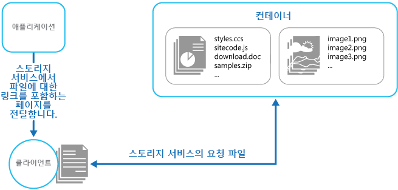

# <a name="static-content-hosting-pattern"></a>정적 콘텐츠 호스팅 패턴

정적 콘텐츠를 클라이언트에 직접 제공할 수 있는 클라우드 기반 저장소 서비스에 배포합니다. 이렇게 하면 잠재적으로 비용이 많이 들 수 있는 계산 인스턴스에 대한 필요성이 줄어듭니다.

## <a name="context-and-problem"></a>컨텍스트 및 문제점

웹 애플리케이션에는 일반적으로 일부 정적 콘텐츠 요소가 포함되어 있습니다. 이 정적 콘텐츠에는 HTML 페이지, 그리고 HTML 페이지의 일부(예: 인라인 이미지, 스타일시트 및 클라이언트 쪽 JavaScript 파일) 혹은 별도의 다운로드(예: PDF 문서)로 클라이언트에서 사용할 수 있는 이미지 및 문서와 같은 기타 리소스가 포함될 수 있습니다.

웹 서버가 동적 렌더링 및 출력 캐시에 최적화되더라도 정적 콘텐츠 다운로드에 대한 요청을 계속 처리해야 합니다. 이를 위해 소비되는 처리 주기는 실상 다른 목적을 위해 보다 효율적으로 사용될 수 있습니다.

## <a name="solution"></a>해결 방법

대부분의 클라우드 호스팅 환경에서 일부 애플리케이션의 리소스 및 정적 페이지를 스토리지 서비스에 배치할 수 있습니다. 스토리지 서비스는 이러한 리소스에 대한 요청을 처리함으로써 다른 웹 요청을 처리하는 컴퓨팅 리소스에 대한 부하를 줄일 수 있습니다. 클라우드에 호스트된 저장소의 비용은 일반적으로 계산 인스턴스의 경우보다 훨씬 저렴합니다.

애플리케이션의 일부를 스토리지 서비스에 호스트할 때 주요 고려 사항은 애플리케이션의 배포와, 그리고 익명 사용자의 사용을 의도하지 않는 리소스의 보안과 관련되어 있습니다.

## <a name="issues-and-considerations"></a>문제 및 고려 사항

이 패턴을 구현할 방법을 결정할 때 다음 사항을 고려하세요.

- 호스트된 저장소 서비스는 사용자가 정적 리소스를 다운로드하기 위해 액세스할 수 있는 HTTP 엔드포인트를 노출해야 합니다. 일부 저장소 서비스는 HTTPS도 지원하므로 SSL이 필요한 리소스를 저장소 서비스에 호스트할 수 있습니다.

- 최대 성능 및 가용성을 위해, CDN(콘텐츠 전송 네트워크)을 사용하여 전 세계에 있는 여러 데이터 센터에 저장소 컨테이너의 콘텐츠를 캐시하는 것이 좋습니다. 그렇지만 CDN 사용 비용을 지불해야 할 수 있습니다.

- 저장소 계정은 데이터 센터에 영향을 줄 수 있는 이벤트에 대한 복원력을 제공하기 위해 기본적으로 지리적으로 복제되는 경우가 많습니다. 즉, IP 주소는 변경될 수 있지만 URL은 동일하게 유지됩니다.

- 스토리지 계정에 있는 콘텐츠도 있고, 호스트된 컴퓨팅 인스턴스에 있는 콘텐츠도 있는 경우, 애플리케이션을 배포하고 업데이트하는 것이 더 어려워집니다. 정적 콘텐츠에 스크립트 파일 또는 UI 구성 요소가 포함되어 있는 경우에 특히, 보다 쉬운 관리를 위해 별도 배포를 수행하고, 애플리케이션 및 콘텐츠의 버전을 관리해야 할 수 있습니다. 그러나 정적 리소스만 업데이트해야 할 경우에는, 애플리케이션 패키지를 다시 배포하지 않고도 해당 리소스를 저장소 계정에 업로드하기만 하면 됩니다.

- 저장소 서비스는 사용자 지정 도메인 이름의 사용을 지원하지 않을 수 있습니다. 이 경우, 리소스가 링크를 포함하는 동적으로 생성된 콘텐츠와는 다른 도메인에 포함되므로, 리소스의 전체 URL을 링크에 지정해야 합니다.

- 저장소 컨테이너는 공용 읽기 액세스용으로 구성해야 하며, 공용 쓰기 액세스용으로 구성하지 않아야 합니다. 사용자가 콘텐츠를 업로드하지 못하게 해야 하기 때문입니다.

- 발레 키 또는 토큰을 사용해서 익명으로 사용해서는 안 되는 리소스에 대한 액세스를 제어하는 것이 좋습니다. 자세한 내용은 [발레 키 패턴](./valet-key.md)을 참조하세요.

## <a name="when-to-use-this-pattern"></a>이 패턴을 사용해야 하는 경우

이 패턴은 다음의 경우에 유용합니다.

- 정적 리소스를 일부 포함한 웹 사이트 및 애플리케이션에 대한 호스팅 비용을 최소화할 경우

- 정적 콘텐츠 및 리소스만으로 구성된 웹 사이트에 대한 호스팅 비용을 최소화할 경우. 호스팅 공급 기업의 스토리지 시스템 기능에 따라, 완전 정적인 웹 사이트를 스토리지 계정에 전적으로 호스트할 수도 있습니다.

- 다른 호스팅 환경 또는 온-프레미스 서버에서 실행되는 애플리케이션에 대한 정적 리소스 및 콘텐츠를 노출할 경우

- 전 세계 여러 데이터 센터에 저장소 계정의 콘텐츠를 캐시하는 콘텐츠 전송 네트워크를 사용하여 둘 이상의 지리적 영역에 콘텐츠를 배치할 경우

- 비용 및 대역폭 사용량을 모니터링할 경우. 정적 콘텐츠의 일부나 전체에 대해 별도 저장소 계정을 사용하면 호스팅 및 런타임 비용에서 콘텐츠 비용을 보다 쉽게 분리할 수 있습니다.

이 패턴은 다음과 같은 상황에서는 유용하지 않을 수 있습니다.

- 애플리케이션은 정적 콘텐츠를 클라이언트에 배달하기 전에 몇 가지 처리를 수행해야 합니다. 예를 들어, 문서에 타임스탬프를 추가해야 할 수도 있습니다.

- 정적 콘텐츠의 양이 매우 작습니다. 이 콘텐츠를 별도 저장소에서 가져올 때 발생하는 오버헤드가 계산 리소스에서 이 콘텐츠를 별도로 관리할 때 파생되는 비용 혜택보다 클 우려가 있을 수 있습니다.

## <a name="example"></a>예

Azure Storage는 스토리지 컨테이너에서 직접 정적 콘텐츠 제공을 지원합니다. 파일은 익명 액세스 요청을 통해 제공됩니다. 기본적으로 파일에는 `https://contoso.z4.web.core.windows.net/image.png`와 같이 `core.windows.net`의 하위 도메인에 URL이 있습니다. 사용자 지정 도메인 이름을 구성하고 Azure CDN을 사용하여 HTTPS를 통해 파일에 액세스할 수 있습니다. 자세한 내용은 [Azure Storage에서 정적 웹 사이트 호스팅](/azure/storage/blobs/storage-blob-static-website)을 참조하세요.



정적 웹 사이트 호스팅은 파일을 익명으로 액세스할 수 있도록 합니다. 파일에 액세스 권한이 있는 사용자를 제어해야 하는 경우 Azure Blob Storage에 파일을 저장한 다음, [공유 액세스 서명](/azure/storage/common/storage-dotnet-shared-access-signature-part-1)을 생성하여 액세스를 제한할 수 있습니다.

클라이언트에 전달된 페이지의 링크는 리소스의 전체 URL을 반드시 지정해야 합니다. 리소스가 공유 액세스 서명과 같이 발레 키를 사용하여 보호되는 경우 이 서명은 URL에 포함되어야 합니다.

정적 리소스에 대해 외부 스토리지를 사용하는 방법을 설명하는 샘플 애플리케이션을 [GitHub][sample-app]에서 확인할 수 있습니다. 이 샘플에서는 스토리지 계정을 지정하는 구성 파일과, 정적 콘텐츠를 포함하는 컨테이너가 포함되어 있습니다.

```xml
<Setting name="StaticContent.StorageConnectionString"
         value="UseDevelopmentStorage=true" />
<Setting name="StaticContent.Container" value="static-content" />
```

StaticContentHosting.Web 프로젝트의 Settings.cs 파일에 있는 `Settings` 클래스는 이러한 값을 추출하고 클라우드 저장소 계정 컨테이너 URL을 포함하는 문자열 값을 작성하기 위한 메서드를 포함합니다.

```csharp
public class Settings
{
  public static string StaticContentStorageConnectionString {
    get
    {
      return RoleEnvironment.GetConfigurationSettingValue(
                              "StaticContent.StorageConnectionString");
    }
  }

  public static string StaticContentContainer
  {
    get
    {
      return RoleEnvironment.GetConfigurationSettingValue("StaticContent.Container");
    }
  }

  public static string StaticContentBaseUrl
  {
    get
    {
      var account = CloudStorageAccount.Parse(StaticContentStorageConnectionString);

      return string.Format("{0}/{1}", account.BlobEndpoint.ToString().TrimEnd('/'),
                                      StaticContentContainer.TrimStart('/'));
    }
  }
}
```

StaticContentUrlHtmlHelper.cs 파일의 `StaticContentUrlHtmlHelper` 클래스는 전달된 URL이 ASP.NET 루트 경로 문자(~)로 시작하는 경우 클라우드 저장소 계정에 대한 경로를 포함한 URL을 생성하는 `StaticContentUrl`이라는 메서드를 노출합니다.

```csharp
public static class StaticContentUrlHtmlHelper
{
  public static string StaticContentUrl(this HtmlHelper helper, string contentPath)
  {
    if (contentPath.StartsWith("~"))
    {
      contentPath = contentPath.Substring(1);
    }

    contentPath = string.Format("{0}/{1}", Settings.StaticContentBaseUrl.TrimEnd('/'),
                                contentPath.TrimStart('/'));

    var url = new UrlHelper(helper.ViewContext.RequestContext);

    return url.Content(contentPath);
  }
}
```

Views\Home 폴더의 Index.cshtml에는 `StaticContentUrl` 메서드를 사용하여 해당 `src` 특성에 대한 URL을 만드는 이미지 요소가 포함되어 있습니다.

```html

```

## <a name="related-patterns-and-guidance"></a>관련 패턴 및 지침

- [정적 콘텐츠 호스팅 샘플][sample-app]. 이 패턴을 설명하는 샘플 애플리케이션입니다.
- [발레 키 패턴](./valet-key.md). 대상 리소스를 익명 사용자가 사용할 수 없도록 하려면 이 패턴을 사용하여 직접 액세스를 제한합니다.
- [Azure의 서버리스 웹 애플리케이션](../reference-architectures/serverless/web-app.md). 서버리스 웹앱을 구현하기 위해 Azure Functions를 통해 정적 웹 사이트 호스팅을 사용하는 참조 아키텍처입니다.

[sample-app]: https://github.com/mspnp/cloud-design-patterns/tree/master/static-content-hosting
