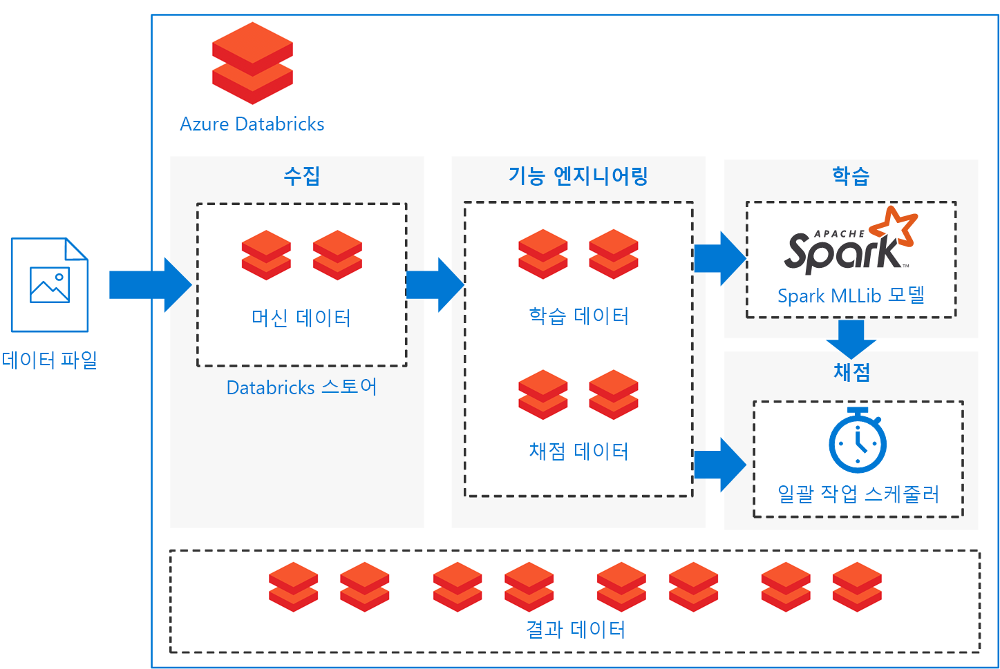

# Azure Databricks에서 Spark 기계 학습 모델 점수 매기기 배치Batch scoring of Spark machine learning models on Azure Databricks

이 참조 아키텍처에는 Azure용으로 최적화된 Apache Spark 기반 분석 플랫폼인 Azure Databricks를 사용하여 일정에 따라 Apache Spark 분류 모델의 일괄 처리 점수 매기기를 수행하는 확장 가능한 솔루션을 빌드하는 방법을 소개합니다.This reference architecture shows how to build a scalable solution for batch scoring an Apache Spark classification model on a schedule using Azure Databricks, an Apache Spark-based analytics platform optimized for Azure. 이 솔루션은 다른 시나리오에도 일반적으로 사용할 수 있는 템플릿으로 사용 가능합니다.The solution can be used as a template that can be generalized to other scenarios.

이 아키텍처에 대한 참조 구현은  [GitHub][github]에서 사용할 수 있습니다.A reference implementation for this architecture is available on [GitHub][github].

**시나리오**: 자산을 많이 사용하는 업계의 한 기업이 예기치 않은 기계 오류와 연관된 비용과 가동 중지 시간을 최소화하고자 합니다.**Scenario**: A business in an asset-heavy industry wants to minimize the costs and downtime associated with unexpected mechanical failures. 이 기업은 기계에서 수집된 IoT 데이터를 사용해 예측 유지 관리 모델을 만들 수 있습니다.Using IoT data collected from their machines, they can create a predictive maintenance model. 이 모델을 통해 구성 요소를 사전에 유지 관리하고 오류가 발생하기 전에 수리할 수 있습니다.This model enables the business to maintain components proactively and repair them before they fail. 기계 구성 요소의 사용률을 최대화하면 비용을 제어하고 가동 중지 시간을 줄일 수 있습니다.By maximizing mechanical component use, they can control costs and reduce downtime.

예측 유지 관리 모델은 기계에서 데이터를 수집하고 구성 요소 오류의 예제 기록을 보존합니다.A predictive maintenance model collects data from the machines and retains historical examples of component failures. 그리고 나면 이 모델을 사용하여 구성 요소의 현재 상태를 모니터링하고 지정된 구성 요소에서 조만간 오류가 발생할지 여부를 예측할 수 있습니다.The model can then be used to monitor the current state of the components and predict if a given component will fail in the near future. 일반적인 사용 사례와 모델링 방식은 [예측 유지 관리 솔루션에 대한 Azure AI 가이드][ai-guide]를 참조하세요.For common use cases and modeling approaches, see [Azure AI guide for predictive maintenance solutions][ai-guide].

이 참조 아키텍처는 구성 요소 기계에 새 데이터가 있으면 트리거되는 워크로드용으로 설계되었습니다.This reference architecture is designed for workloads that are triggered by the presence of new data from the component machines. 처리에는 다음 단계가 포함됩니다.Processing involves the following steps:

1. 외부 데이터 저장소의 데이터를 Azure Databricks 데이터 저장소로 수집합니다.Ingest the data from the external data store onto an Azure Databricks data store.

2. 데이터를 학습 데이터 세트로 변환한 다음 Spark MLlib 모델을 작성하여 기계 학습 모델을 학습시킵니다.Train a machine learning model by transforming the data into a training data set, then building a Spark MLlib model. MLlib는 Spark 데이터 확장성 기능을 활용할 수 있도록 최적화된 가장 일반적인 기계 학습 알고리즘과 유틸리티로 구성되어 있습니다.MLlib consists of most common machine learning algorithms and utilities optimized to take advantage of Spark data scalability capabilities.

3. 데이터를 점수 매기기 데이터 세트로 변환하여 구성 요소 오류를 예측(분류)하기 위해 학습된 모델을 적용합니다.Apply the trained model to predict (classify) component failures by transforming the data into a scoring data set. Spark MLLib 모델을 사용하여 데이터의 점수를 매깁니다.Score the data with the Spark MLLib model.

4. 사후 처리에 사용할 수 있도록 Databricks 데이터 저장소에 결과를 저장합니다.Store results on the Databricks data store for post-processing consumption.

이러한 각 작업을 수행하기 위한 Notebook은  [GitHub][github]에서 제공됩니다.Notebooks are provided on [GitHub][github] to perform each of these tasks.

## 아키텍처Architecture

이 아키텍처는 순차적으로 실행되는 [Notebook][notebooks] 세트를 기준으로 하여 [Azure Databricks][databricks] 내에 완전히 포함되는 데이터 흐름을 정의하며,The architecture defines a data flow that is entirely contained within [Azure Databricks][databricks] based on a set of sequentially executed [notebooks][notebooks]. 다음 구성 요소로 구성됩니다.It consists of the following components:

**[데이터 파일][github]**.**[Data files][github]**. 참조 구현에서는 정적 데이터 파일 5개에 포함된 시뮬레이션된 데이터 세트를 사용합니다.The reference implementation uses a simulated data set contained in five static data files.

**[수집][notebooks]**.**[Ingestion][notebooks]**. 데이터 수집 Notebook은 입력 데이터 파일을 Databrick 데이터 세트 컬렉션에 다운로드합니다.The data ingestion notebook downloads the input data files into a collection of Databricks data sets. 실제 시나리오에서는 IoT 장치의 데이터가 Azure SQL Server 또는 Azure Blob Storage와 같은 Databricks에서 액세스 가능한 스토리지로 스트리밍됩니다.In a real-world scenario, data from IoT devices would stream onto Databricks-accessible storage such as Azure SQL Server or Azure Blob storage. Databricks는 여러 [데이터 원본][data-sources]을 지원합니다.Databricks supports multiple [data sources][data-sources].

**학습 파이프라인**.**Training pipeline**. 이 Notebook은 기능 엔지니어링 Notebook을 실행하여 수집된 데이터에서 분석 데이터 세트를 만듭니다.This notebook executes the feature engineering notebook to create an analysis data set from the ingested data. 그런 다음 [Apache Spark MLlib][mllib] 확장 가능 기계 학습 라이브러리를 사용해 기계 학습 모델을 학습시키는 모델 빌드 Notebook을 실행합니다.It then executes a model building notebook that trains the machine learning model using the [Apache Spark MLlib][mllib] scalable machine learning library.

**점수 매기기 파이프라인**.**Scoring pipeline**. 이 Notebook은 기능 엔지니어링 Notebook을 실행하여 수집된 데이터에서 점수 매기기 데이터 세트를 만들고 점수 매기기 Notebook을 실행합니다.This notebook executes the feature engineering notebook to create scoring data set from the ingested data and executes the scoring notebook. 점수 매기기 Notebook은 학습된 [Spark MLlib][mllib-spark] 모델을 사용해 점수 매기기 데이터 세트에서 관찰된 내용에 대한 예측 정보를 생성합니다.The scoring notebook uses the trained [Spark MLlib][mllib-spark] model to generate predictions for the observations in the scoring data set. 예측 정보는 Databricks 데이터 저장소의 새로운 데이터 세트인 결과 저장소에 저장됩니다.The predictions are stored in the results store, a new data set on the Databricks data store.

**스케줄러**.**Scheduler**. 예약된 Databricks [작업][job]이 Spark 모델을 사용하여 일괄 처리 점수 매기기를 처리합니다.A scheduled Databricks [job][job] handles batch scoring with the Spark model. 이 작업은 점수 매기기 파이프라인 Notebook을 실행하며, Notebook 매개 변수를 통해 변수 인수를 전달하여 점수 매기기 데이터 세트 생성을 위한 세부 정보와 결과 데이터 세트를 저장할 위치를 지정합니다.The job executes the scoring pipeline notebook, passing variable arguments through notebook parameters to specify the details for constructing the scoring data set and where to store the results data set.

해당 시나리오는 파이프라인 흐름으로 생성됩니다.The scenario is constructed as a pipeline flow. 각 Notebook은 각 작업(수집, 기능 엔지니어링, 모델 빌드, 모델 점수 매기기)을 수행할 수 있도록 최적화되어 있습니다.Each notebook is optimized to perform in a batch setting for each of the operations: ingestion, feature engineering, model building, and model scorings. 이 작업을 수행하기 위해 기능 엔지니어링 Notebook은 학습, 보정, 테스트 또는 점수 매기기 작업용으로 일반 데이터 세트를 생성하도록 설계되어 있습니다.To accomplish this, the feature engineering notebook is designed to generate a general data set for any of the training, calibration, testing, or scoring operations. 이 시나리오에서는 이러한 작업에 임시 분할 전략을 사용하므로 Notebook 매개 변수를 사용하여 날짜 범위 필터링을 설정합니다.In this scenario, we use a temporal split strategy for these operations, so the notebook parameters are used to set date-range filtering.

이 시나리오에서는 일괄 처리 파이프라인을 작성하므로 파이프라인 Notebook의 출력을 살펴볼 수 있도록 검사 Notebook 세트(선택 사항)가 제공됩니다.Because the scenario creates a batch pipeline, we provide a set of optional examination notebooks to explore the output of the pipeline notebooks. 이러한 Notebook 세트는 GitHub 리포지토리에서 확인할 수 있습니다.You can find these in the GitHub repository:

- `1a_raw-data_exploring`
- `2a_feature_exploration`
- `2b_model_testing`
- `3b_model_scoring_evaluation`

## 권장 사항Recommendations

Databricks는 학습된 모델을 로드 및 배포하여 새 데이터로 예측을 할 수 있도록 설정되어 있습니다.Databricks is set up so you can load and deploy your trained models to make predictions with new data. 이 시나리오에서는 다음과 같은 이점이 추가로 제공되므로 Databricks를 사용합니다.We used Databricks for this scenario because it provides these additional advantages:

- Azure Active Directory 자격 증명을 사용하는 Single Sign-On 지원Single sign-on support using Azure Active Directory credentials.
- 프로덕션 파이프라인에 대해 작업을 실행할 수 있는 작업 스케줄러Job scheduler to execute jobs for production pipelines.
- 공동 작업, 대시보드, REST API가 포함된 완벽한 대화형 NotebookFully interactive notebook with collaboration, dashboards, REST APIs.
- 무제한 클러스터 제공(어떤 크기로든 확장 가능)Unlimited clusters that can scale to any size.
- 고급 보안, 역할 기반 액세스 제어 및 감사 로그Advanced security, role-based access controls, and audit logs.

Azure Databricks 서비스와 상호 작용하려는 경우 웹 브라우저나 [CLI(명령줄 인터페이스)][cli]에서 [작업 영역][workspace] 인터페이스를 사용합니다.To interact with the Azure Databricks service, use the Databricks [Workspace][workspace] interface in a web browser or the [command-line interface][cli] (CLI). Python 2.7.9~3.6을 지원하는 플랫폼에서 Databricks CLI에 액세스합니다.Access the Databricks CLI from any platform that supports Python 2.7.9 to 3.6.

참조 구현에서는 [Notebook][notebooks]을 사용하여 작업을 순차적으로 실행합니다.The reference implementation uses [notebooks][notebooks] to execute tasks in sequence. 각 Notebook은 중간 데이터 아티팩트(학습, 테스트, 점수 매기기 또는 결과 데이터 세트)를 입력 데이터와 같은 데이터 저장소에 저장합니다.Each notebook stores intermediate data artifacts (training, test, scoring, or results data sets) to the same data store as the input data. 따라서 특정 사용 사례에 필요한 대로 Notebook을 쉽게 사용할 수 있습니다.The goal is to make it easy for you to use it as needed in your particular use case. 실제로는 Notebook이 스토리지를 직접 읽고 스토리지에 쓰기 저장할 수 있도록 데이터 원본을 Azure Databricks 인스턴스에 연결합니다.In practice, you would connect your data source to your Azure Databricks instance for the notebooks to read and write directly back into your storage.

Databricks 사용자 인터페이스, 데이터 저장소 또는 Databricks [CLI][cli]를 통해 필요에 따라 작업 실행을 모니터링할 수 있습니다.You can monitor job execution through the Databricks user interface, the data store, or the Databricks [CLI][cli] as necessary. Databricks에서 제공되는 [이벤트 로그][log] 및 기타 [메트릭][metrics]을 사용하여 클러스터를 모니터링합니다.Monitor the cluster using the [event log][log] and other [metrics][metrics] that Databricks provides.

## 성능 고려 사항Performance considerations

Azure Databricks 클러스터는 기본적으로 자동 크기 조정이 가능하므로, Databricks는 작업 특성에 맞게 작업자를 계정에 동적으로 재할당합니다.An Azure Databricks cluster enables autoscaling by default so that during runtime, Databricks dynamically reallocates workers to account for the characteristics of your job. 파이프라인의 특정 부분에서는 다른 부분보다 컴퓨팅이 더 많이 수행될 수도 있습니다.Certain parts of your pipeline may be more computationally demanding than others. Databricks는 작업의 이러한 단계 중에 작업자를 더 추가하며 작업자가 더 이상 필요하지 않을 때는 제거합니다.Databricks adds additional workers during these phases of your job (and removes them when they’re no longer needed). 자동 크기 조정 기능을 사용하면 [클러스터 사용률][cluster]을 더 쉽게 높일 수 있습니다. 워크로드와 일치하는 클러스터를 프로비전할 필요가 없기 때문입니다.Autoscaling makes it easier to achieve high [cluster utilization][cluster], because you don’t need to provision the cluster to match a workload.

또한 [Azure Data Factory][adf]를 Azure Databricks와 함게 사용하면 더 복잡한 예약 파이프라인을 개발할 수 있습니다.Additionally, more complex scheduled pipelines can be developed by using [Azure Data Factory][adf] with Azure Databricks.

## 저장소 고려 사항Storage considerations

이 참조 구현에서는 작업을 간편하게 수행할 수 있도록 데이터가 Databricks 내에 직접 저장됩니다.In this reference implementation, the data is stored directly within Databricks storage for simplicity. 하지만 프로덕션 설정에서는 [Azure Blob Storage][blob] 등의 클라우드 데이터 스토리지에 데이터를 저장할 수 있습니다.In a production setting, however, the data can be stored on cloud data storage such as [Azure Blob Storage][blob]. [Databricks][databricks-connect]는 Azure Data Lake Store, Azure SQL Data Warehouse, Azure Cosmos DB, Apache Kafka 및 Hadoop도 지원합니다.[Databricks][databricks-connect] also supports Azure Data Lake Store, Azure SQL Data Warehouse, Azure Cosmos DB, Apache Kafka, and Hadoop.

## 비용 고려 사항Cost considerations

Azure Databricks는 관련 비용이 부과되는 프리미엄 Spark 제품입니다.Azure Databricks is a premium Spark offering with an associated cost. 또한 표준 및 프리미엄 Databricks [가격 책정 계층][pricing]이 제공됩니다.In addition, there are standard and premium Databricks [pricing tiers][pricing].

이 시나리오에서는 표준 가격 책정 계층을 사용해도 충분합니다.For this scenario, the standard pricing tier is sufficient. 그러나 특정 애플리케이션에 규모가 더 큰 워크로드를 처리하기 위해 자동으로 크기가 조정되는 클러스터나 대화형 Databricks 대시보드가 필요한 경우 프리미엄 수준을 선택하면 비용이 더 증가합니다.However, if your specific application requires automatically scaling clusters to handle larger workloads or interactive Databricks dashboards, the premium level could increase costs further.

솔루션 Notebook은 최소한의 편집을 수행해 Databricks 관련 패키지를 제거하면 모든 Spark 기반 플랫폼에서 실행할 수 있습니다.The solution notebooks can run on any Spark-based platform with minimal edits to remove the Databricks-specific packages. 다양한 Azure 플랫폼용으로 제공되는 다음의 유사한 솔루션을 참조하세요.See the following similar solutions for various Azure platforms:

- [Azure Machine Learning Studio의 Python][python-aml][Python on Azure Machine Learning Studio][python-aml]
- [SQL Server R Services][sql-r][SQL Server R services][sql-r]
- [Azure Data Science Virtual Machine의 PySpark][py-dvsm][PySpark on an Azure Data Science Virtual Machine][py-dvsm]

## 솔루션 배포Deploy the solution

이 참조 아키텍처를 배포하려면  [GitHub][github] 리포지토리에 설명되어 있는 단계에 따라 Azure Databricks에서 일괄 처리를 통해 Spark 모델의 점수를 매기는 확장 가능한 솔루션을 빌드합니다.To deploy this reference architecture, follow the steps described in the [GitHub][github] repository to build a scalable solution for scoring Spark models in batch on Azure Databricks.

## 관련 아키텍처Related architectures

Spark를 사용하여 미리 계산된 오프라인 점수로 [실시간 추천 시스템][recommendation]을 빌드하는 참조 아키텍처도 빌드되었습니다.We have also built a reference architecture that uses Spark for building [real-time recommendation systems][recommendation] with offline, pre-computed scores. 이러한 추천 시스템은 점수가 일괄 처리되는 일반적인 시나리오입니다.These recommendation systems are common scenarios where scores are batch-processed.

[adf]: https://azure.microsoft.com/blog/operationalize-azure-databricks-notebooks-using-data-factory/
[ai-guide]: /azure/machine-learning/team-data-science-process/cortana-analytics-playbook-predictive-maintenance
[blob]: https://docs.databricks.com/spark/latest/data-sources/azure/azure-storage.html
[cli]: https://docs.databricks.com/user-guide/dev-tools/databricks-cli.html
[cluster]: https://docs.azuredatabricks.net/user-guide/clusters/sizing.html
[databricks]: /azure/azure-databricks/
[databricks-connect]: /azure/azure-databricks/databricks-connect-to-data-sources
[data-sources]: https://docs.databricks.com/spark/latest/data-sources/index.html
[github]: https://github.com/Azure/BatchSparkScoringPredictiveMaintenance
[job]: https://docs.databricks.com/user-guide/jobs.html
[log]: https://docs.databricks.com/user-guide/clusters/event-log.html
[metrics]: https://docs.databricks.com/user-guide/clusters/metrics.html
[mllib]: https://docs.databricks.com/spark/latest/mllib/index.html
[mllib-spark]: https://docs.databricks.com/spark/latest/mllib/index.html#apache-spark-mllib
[notebooks]: https://docs.databricks.com/user-guide/notebooks/index.html
[pricing]: https://azure.microsoft.com/en-us/pricing/details/databricks/
[python-aml]: https://gallery.azure.ai/Notebook/Predictive-Maintenance-Modelling-Guide-Python-Notebook-1
[py-dvsm]: https://gallery.azure.ai/Tutorial/Predictive-Maintenance-using-PySpark
[recommendation]: /azure/architecture/reference-architectures/ai/real-time-recommendation
[sql-r]: https://gallery.azure.ai/Tutorial/Predictive-Maintenance-Modeling-Guide-using-SQL-R-Services-1
[workspace]: https://docs.databricks.com/user-guide/workspace.html
