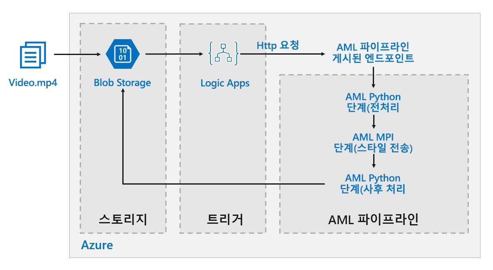

# Azure의 Deep Learning 모델 일괄 채점Batch scoring on Azure for deep learning models

이 참조 아키텍처는 Azure Machine Learning를 사용하여 동영상에 신경망 스타일 전송을 적용하는 방법을 보여줍니다.This reference architecture shows how to apply neural style transfer to a video, using Azure Machine Learning. *스타일 전송*은 기존 이미지를 다른 이미지의 스타일로 구성하는 Deep Learning 기술입니다.*Style transfer* is a deep learning technique that composes an existing image in the style of another image. 이 아키텍처는 Deep Learning에 일괄 채점을 사용하는 모든 시나리오에 대해 일반화할 수 있습니다.This architecture can be generalized for any scenario that uses batch scoring with deep learning. [**이 솔루션을 배포합니다**](#deploy-the-solution).[**Deploy this solution**](#deploy-the-solution).

**시나리오**: 미디어 조직에는 변경하려는 스타일이 특정 그림처럼 보이는 동영상이 있습니다.**Scenario**: A media organization has a video whose style they want to change to look like a specific painting. 조직은 시기적절하게 자동화된 방식으로 모든 동영상 프레임에 이 스타일을 적용할 수 있기 바랍니다.The organization wants to be able to apply this style to all frames of the video in a timely manner and in an automated fashion. 신경망 스타일 전송 알고리즘에 대한 자세한 내용은 [나선형 신경망을 사용한 이미지 스타일 전송][image-style-transfer](PDF)을 참조하세요.For more background about neural style transfer algorithms, see [Image Style Transfer Using Convolutional Neural Networks][image-style-transfer] (PDF).

| 스타일 이미지:Style image: | 입력/콘텐츠 동영상:Input/content video: | 출력 동영상:Output video: |
|--------|--------|---------|
|  |  *동영상을 보려면 클릭* *click to view video* |  *동영상을 보려면 클릭* *click to view video* |

이 참조 아키텍처는 Azure Storage의 새 미디어 존재로 인해 트리거되는 워크로드용으로 설계되었습니다.This reference architecture is designed for workloads that are triggered by the presence of new media in Azure storage.

처리에는 다음 단계가 포함됩니다.Processing involves the following steps:

1. 동영상 파일을 스토리지에 업로드합니다.Upload a video file to storage.
1. 동영상 파일은 논리 앱을 트리거하여 Azure Machine Learning 파이프라인에 게시된 엔드포인트에 요청을 전송합니다.The video file triggers a Logic App to send a request to the Azure Machine Learning pipeline published endpoint.
1. 파이프라인은 동영상을 처리하고, MPI로 스타일 전송을 적용하며, 동영상을 사후 처리합니다.The pipeline processes the video, applies style transfer with MPI, and postprocesses the video.
1. 출력은 파이프라인이 완료되면 Blob Storage에 다시 저장됩니다.The output is saved back to blob storage once the pipeline is completed.

## 아키텍처Architecture

이 아키텍처는 다음과 같은 구성 요소로 구성됩니다.This architecture consists of the following components.

### 컴퓨팅Compute

**[Azure Machine Learning Service][amls]** 는 Azure Machine Learning 파이프라인을 사용하여 재현 가능하며 관리가 쉬운 계산 시퀀스를 만듭니다.**[Azure Machine Learning Service][amls]** uses Azure Machine Learning Pipelines to create reproducible and easy-to-manage sequences of computation. 또한 기계 학습 모델을 학습, 배포 및 채점하기 위해 [Azure Machine Learning 컴퓨팅][aml-compute]이라는 관리형 컴퓨팅 대상(파이프라인 계산에서 실행할 수 있음)을 제공합니다.It also offers a managed compute target (on which a pipeline computation can run) called [Azure Machine Learning Compute][aml-compute] for training, deploying, and scoring machine learning models. 

### StorageStorage

**[Blob Storage][blob-storage]** 는 모든 이미지(입력 이미지, 스타일 이미지 및 출력 이미지)를 저장하는 데 사용됩니다.**[Blob storage][blob-storage]** is used to store all images (input images, style images, and output images). Azure Machine Learning Service는 Blob Storage와 통합되므로 사용자가 수동으로 컴퓨팅 플랫폼과 Blob Storage 간에 데이터를 이동하지 않아도 됩니다.Azure Machine Learning Service integrates with Blob storage so that users do not have to manually move data across compute platforms and Blob storage. 그뿐 아니라 Blob Storage는 이 워크로드에 필요한 성능에 비해 매우 비용 효율적입니다.Blob storage is also very cost-effective for the performance that this workload requires.

### 트리거/예약Trigger / scheduling

**[Azure Logic Apps][logic-apps]** 는 워크플로를 트리거하는 데 사용됩니다.**[Azure Logic Apps][logic-apps]** is used to trigger the workflow. 논리 앱이 컨테이너에 Blob이 추가되었음을 감지하면 Azure Machine Learning 파이프라인을 트리거합니다.When the Logic App detects that a blob has been added to the container, it triggers the Azure Machine Learning Pipeline. Logic Apps는 Blob Storage에 대한 변경을 쉽게 감지하고 트리거를 변경하는 간단한 프로세스를 제공하므로 이 참조 아키텍처에 적합합니다.Logic Apps is a good fit for this reference architecture because it's an easy way to detect changes to blob storage and provides an easy process for changing the trigger.

### 데이터 전처리 및 사후 처리Preprocessing and postprocessing our data

이 참조 아키텍처는 나무 위의 오랑우탄 동영상 장면을 사용합니다.This reference architecture uses video footage of an orangutan in a tree. [여기][source-video]에서 장면을 다운로드할 수 있습니다.You can download the footage from [here][source-video].

1. [FFmpeg][ffmpeg]를 사용하여 동영상 장면에서 오디오 파일을 추출한 후 오디오 파일을 나중에 출력 동영상으로 다시 연결할 수 있습니다.Use [FFmpeg][ffmpeg] to extract the audio file from the video footage, so that the audio file can be stitched back into the output video later.
1. FFmpeg를 사용하여 동영상을 개별 프레임으로 나눕니다.Use FFmpeg to break the video into individual frames. 프레임은 병렬로 독립적으로 처리됩니다.The frames will be processed independently, in parallel.
1. 이 시점에서 신경망 스타일 전송을 각 개별 프레임에 병렬로 적용할 수 있습니다.At this point, we can apply neural style transfer to each individual frame in parallel.
1. 각 프레임이 처리되면 FFmpeg를 사용하여 프레임을 다시 연결해야 합니다.One each frame has been processed, we need to use FFmpeg to restitch the frames back together.
1. 마지막으로 다시 연결한 장면에 오디오 파일을 다시 연결합니다.Finally we reattach the audio file to the restitched footage.

## 성능 고려 사항Performance considerations

### GPU 및 CPUGPU vs CPU

Deep Learning 워크로드의 경우, GPU는 CPU를 훨씬 더 능가하는 성능을 발휘하며, 이러한 성능을 얻기 위해서는 크기 조정 가능 CPU 클러스터가 더 많이 필요합니다.For deep learning workloads, GPUs will generally out-perform CPUs by a considerable amount, to the extent that a sizeable cluster of CPUs is usually needed to get comparable performance. 이 아키텍처에서 CPU만 사용할 수도 있지만, GPU가 훨씬 더 나은 비용/성능 프로필을 제공합니다.While it's an option to use only CPUs in this architecture, GPUs will provide a much better cost/performance profile. GPU 최적화 VM의 최신 [NCv3 시리즈]vm-sizes-gpu를 사용하는 것이 좋습니다.We recommend using the latest [NCv3 series]vm-sizes-gpu of GPU optimized VMs.

기본적으로 GPU는 일부 지역에서 사용할 수 없습니다.GPUs are not enabled by default in all regions. GPU가 지원되는 지역을 선택해야 합니다.Make sure to select a region with GPUs enabled. 또한 구독에는 GPU 최적화 VM에 대한 코어가 기본적으로 0으로 할당되어 있습니다.In addition, subscriptions have a default quota of zero cores for GPU-optimized VMs. 지원 요청을 열어 이 할당량을 높일 수 있습니다.You can raise this quota by opening a support request. 구독에 워크로드를 실행할 충분한 할당량이 있는지 확인하세요.Make sure that your subscription has enough quota to run your workload.

### VM 및 코어에서의 병렬 처리Parallelizing across VMs vs cores

스타일 전송 프로세스를 일괄 작업으로 실행할 때 주로 GPU에서 실행되는 작업은 VM에서 병렬 처리되어야 합니다.When running a style transfer process as a batch job, the jobs that run primarily on GPUs will have to be parallelized across VMs. 두 가지 방법이 가능합니다. 즉, 단일 GPU가 있는 VM을 사용하는 더 큰 클러스터를 만들거나 많은 GPU가 있는 VM을 사용하는 좀 더 작은 클러스터를 만들 수 있습니다.Two approaches are possible: You can create a larger cluster using VMs that have a single GPU, or create a smaller cluster using VMs with many GPUs.

이 워크로드에서 이러한 두 옵션은 필적할만한 성능을 제공합니다.For this workload, these two options will have comparable performance. VM당 더 많은 GPU가 있는 더 적은 수의 VM을 사용하면 데이터 이동을 줄일 수 있습니다.Using fewer VMs with more GPUs per VM can help to reduce data movement. 그러나 이 워크로드의 작업당 데이터 볼륨은 그리 크지 않으므로 Blob Storage에 따라 크게 제한되는 것이 확인되지 않습니다.However, the data volume per job for this workload is not very big, so you won't observe much throttling by blob storage.

### MPI 단계MPI step 

Azure Machine Learning에서 파이프라인을 만들 때 병렬 계산을 수행하는 데 사용된 단계 중 하나가 MPI 단계입니다.When creating the pipeline in Azure Machine Learning, one of the steps used to perform parallel computation is the MPI step. MPI 단계는 사용 가능한 노드 간에 데이터를 균등하게 분할하는 데 도움이 됩니다.The MPI step will help split the data evenly across the available nodes. MPI 단계는 요청된 모든 노드가 준비될 때까지 실행되지 않습니다.The MPI step will not executed until all the requested nodes are ready. 한 개 노드가 실패하거나 선취되면(우선 순위가 낮은 가상 머신인 경우), MPI 단계를 다시 실행해야 합니다.Should one node fail or get pre-empted (if it is a low-priority virtual machine), the MPI step will have to be re-run. 

## 보안 고려 사항Security considerations

### Azure Blob Storage에 대한 액세스 제한Restricting access to Azure blob storage

이 참조 아키텍처에서 Azure Blob Storage는 보호해야 하는 주 스토리지 구성 요소입니다.In this reference architecture, Azure blob storage is the main storage component that needs to be protected. GitHub 리포지토리에 표시된 기본 배포는 스토리지 계정 키를 사용하여 Blob Storage에 액세스합니다.The baseline deployment shown in the GitHub repo uses storage account keys to access the blob storage. 추가 제어 및 보호를 위해 SAS(공유 액세스 서명)를 대신 사용하는 것을 고려하세요.For further control and protection, consider using a shared access signature (SAS) instead. 이 기능은 계정 키를 하드 코딩하거나 일반 텍스트로 저장할 필요 없이 스토리지의 개체에 대해 제한된 액세스를 부여합니다.This grants limited access to objects in storage, without needing to hard code the account keys or save them in plaintext. 계정 키가 논리 앱의 디자이너 인터페이스 내에서 일반 텍스트로 표시되므로 이 접근 방식은 특히 유용합니다.This approach is especially useful because account keys are visible in plaintext inside of Logic App's designer interface. 또한 SAS를 사용하면 스토리지 계정에 적절한 거버넌스가 유지되고, 의도한 사용자에게만 액세스 권한을 부여할 수도 있습니다.Using an SAS also helps to ensure that the storage account has proper governance, and that access is granted only to the people intended to have it.

보다 중요한 데이터가 있는 시나리오의 경우, 이러한 키가 워크로드의 모든 입력 및 출력 데이터에 대해 모든 액세스 권한을 부여하므로 모든 스토리지 키가 보호될 수 있습니다.For scenarios with more sensitive data, make sure that all of your storage keys are protected, because these keys grant full access to all input and output data from the workload.

### 데이터 암호화 및 데이터 이동Data encryption and data movement

이 참조 아키텍처는 일괄 채점 프로세스의 예로 스타일 전송을 사용합니다.This reference architecture uses style transfer as an example of a batch scoring process. 데이터가 좀 더 중요한 시나리오에서는 스토리지의 데이터를 미사용 시에도 암호화해야 합니다.For more data-sensitive scenarios, the data in storage should be encrypted at rest. 데이터가 한 위치에서 다음 위치로 이동될 때마다 SSL을 사용하여 데이터 전송의 보안을 유지합니다.Each time data is moved from one location to the next, use SSL to secure the data transfer. 자세한 내용은 [Azure Storage 보안 가이드][storage-security]를 참조하세요.For more information, see [Azure Storage security guide][storage-security].

### 가상 네트워크의 계산 보호Securing your computation in a virtual network

Machine Learning 컴퓨팅 클러스터를 배포할 때 [가상 네트워크][virtual-network]의 서브넷 내에서 프로비저닝되도록 클러스터를 구성할 수 있습니다.When deploying your Machine Learning compute cluster, you can configure your cluster to be provisioned inside a subnet of a [virtual network][virtual-network]. 이렇게 하면 클러스터의 컴퓨팅 노드가 다른 가상 머신과 안전하게 통신할 수 있습니다.This allows the compute nodes in the cluster to communicate securely with other virtual machines. 

### 악의적인 활동으로부터 보호Protecting against malicious activity

여러 사용자가 있는 시나리오에서는 악의적인 활동으로부터 중요한 데이터를 보호해야 합니다.In scenarios where there are multiple users, make sure that sensitive data is protected against malicious activity. 다른 사용자에게 입력 데이터를 사용자 지정할 수 있게 이 배포에 대한 액세스 권한을 부여하는 경우, 다음 주의 사항 및 고려 사항에 유의하세요.If other users are given access to this deployment to customize the input data, take note of the following precautions and considerations:

- RBAC를 사용하여 필요한 리소스로만 사용자 액세스를 제한합니다.Use RBAC to limit users' access to only the resources they need.
- 두 개의 개별 스토리지 계정을 프로비전합니다.Provision two separate storage accounts. 입력 및 출력 데이터를 첫 번째 계정에 저장합니다.Store input and output data in the first account. 외부 사용자에게 이 계정에 대한 액세스 권한을 부여할 수 있습니다.External users can be given access to this account. 실행 가능한 스크립트 및 출력 로그 파일은 다른 계정에 저장합니다.Store executable scripts and output log files in the other account. 외부 사용자는 이 계정에 액세스할 수 없습니다.External users should not have access to this account. 이렇게 하면 외부 사용자가 실행 파일을 수정할 수 없으며(악성 코드 삽입을 위해), 중요한 정보를 포함할 수 있는 로그 파일에 액세스할 수 없게 됩니다.This will ensure that external users cannot modify any executable files (to inject malicious code), and don't have access to logfiles, which could hold sensitive information.
- 악의적인 사용자는 작업 큐에 대해 DDOS 공격을 수행하거나 작업 큐에 잘못된 형식의 포이즌 메시지를 삽입하여 시스템을 잠그거나 큐 대기 해제 오류를 발생시킬 수 있습니다.Malicious users can DDOS the job queue or inject malformed poison messages in the job queue, causing the system to lock up or causing dequeuing errors.

## 모니터링 및 로깅Monitoring and logging

### 일괄 처리 작업 모니터링Monitoring Batch jobs

작업을 실행하는 동안 진행 상황을 모니터링하고 예상대로 작동하는지 확인하는 것이 중요합니다.While running your job, it's important to monitor the progress and make sure that things are working as expected. 그러나 활성 노드의 클러스터를 모니터링할 경우 어려움이 있을 수 있습니다.However, it can be a challenge to monitor across a cluster of active nodes.

클러스터의 전반적인 상태를 파악하려면 Azure Portal의 Machine Learning 블레이드로 이동하여 클러스터의 노드 상태를 검사합니다.To get a sense of the overall state of the cluster, go to the Machine Learning blade of the Azure Portal to inspect the state of the nodes in the cluster. 노드가 비활성 상태이거나 작업이 실패한 경우 오류 로그가 Blob Storage에 저장되며 Azure Portal에서도 액세스할 수 있습니다.If a node is inactive or a job has failed, the error logs are saved to blob storage, and are also accessible in the Azure Portal.

Application Insights에 로그를 연결하거나 클러스터 및 해당 작업의 상태를 폴링하기 위한 별도의 프로세스를 실행하여 모니터링을 추가로 보완할 수 있습니다.Monitoring can be further enriched by connecting logs to Application Insights or by running separate processes to poll for the state of the cluster and its jobs.

### Azure Machine Learning으로 로깅Logging with Azure Machine Learning

Azure Machine Learing은 모든 stdout/stderr을 관련 Blob Storage 계정에 자동으로 기록합니다.Azure Machine Learing will automatically log all stdout/stderr to the associate blob storage account. 달리 지정하지 않는 한, Azure Machine Learning 작업 영역은 스토리지 계정을 자동으로 프로비저닝하고 로그를 덤프합니다.Unless otherwise specified, your Azure Machine Learning Workspace will automatically provision a storage account and dump your logs into it. Storage 탐색기와 같은 스토리지 탐색 도구를 사용하면 로그 파일 탐색을 위한 보다 간편한 환경이 구현됩니다.You can also use a storage navigation tool such as Storage Explorer which will provide a much easier experience for navigating log files.

## 비용 고려 사항Cost considerations

스토리지 및 예약 구성 요소와 비교할 때, 지금까지 이 참조 아키텍처에 사용된 계산 리소스가 비용 발생에 가장 큰 부분을 차지합니다.Compared to the storage and scheduling components, the compute resources used in this reference architecture by far dominate in terms of costs. 주요 난제 중 하나는 GPU 지원 머신의 클러스터 전체에서 작업을 효과적으로 병렬 처리하는 것입니다.One of the main challenges is effectively parallelizing the work across a cluster of GPU-enabled machines.

Machine Learning 컴퓨팅 클러스터 크기는 큐의 작업에 따라 자동으로 확장 및 축소될 수 있습니다.The Machine Learning Compute cluster size can automatically scale up and down depending on the jobs in the queue. 최소 및 최대 노드를 설정하여 자동 크기 조정을 프로그래밍 방식으로 활성화할 수 있습니다.You can enable auto-scale programmatically by setting the minimum and maximum nodes.

즉각적인 처리가 필요하지 않은 작업의 경우, 기본 상태(최소)가 0 노드의 클러스터가 되도록 자동 크기 조정을 구성합니다.For work that doesn't require immediate processing, configure auto-scale so the default state (minimum) is a cluster of zero nodes. 이 구성을 사용하면 클러스터는 0개 노드로 시작하고 큐에서 작업을 감지할 때만 규모가 확장됩니다.With this configuration, the cluster starts with zero nodes and only scales up when it detects jobs in the queue. 일괄 채점 프로세스가 하루에 몇 번 또는 그 이하로만 발생할 경우 이 설정을 통해 비용을 크게 절감할 수 있습니다.If the batch scoring process only happens a few times a day or less, this setting enables significant cost savings.

자동 크기 조정은 서로 너무 가깝게 위치하는 일괄 처리 작업에는 적절하지 않을 수 있습니다.Auto-scaling may not be appropriate for batch jobs that happen too close to each other. 클러스터가 스핀 업 및 스핀 다운되는 데 걸리는 시간도 비용을 발생할 수 있으므로, 일괄 처리 워크로드가 이전 작업이 종료되고 몇 분 안에 시작될 경우 작업 중간에 클러스터를 계속 실행하도록 하는 것이 좀 더 비용 효율적일 수 있습니다.The time that it takes for a cluster to spin up and spin down also incur a cost, so if a batch workload begins only a few minutes after the previous job ends, it might be more cost effective to keep the cluster running between jobs.

또한 Machine Learning 컴퓨팅은 우선 순위가 낮은 가상 머신도 지원합니다.Machine Learning Compute also supports low-priority virtual machines. 이를 통해 할인된 가상 머신에서 계산을 실행할 수 있습니다. 단, 해당 가상 머신은 언제든지 선취될 수 있습니다.This allows you to run your computation on discounted virtual machines, with the caveat that they may be pre-empted at any time. 우선 순위가 낮은 가상 머신은 중요도가 낮은 일괄 채점 워크로드에 적합합니다.Low-priority virtual machines are ideal for non-critical batch scoring workloads.

## 솔루션 배포Deploy the solution

이 참조 아키텍처를 배포하려면 [GitHub 리포지토리][deployment]에 설명된 단계를 따르세요.To deploy this reference architecture, follow the steps described in the [GitHub repo][deployment].

> [!NOTE]
> 또한 Azure Kubernetes Service를 사용하여 딥 러닝 모델을 위한 일괄 채점 아키텍처를 배포할 수 있습니다.You can also deploy a batch scoring architecture for deep learning models using the Azure Kubernetes Service. [Github 리포지토리][deployment2]에 설명된 단계를 따릅니다.Follow the steps described in this [Github repo][deployment2].

<!-- links -->

[aml-compute]: /azure/machine-learning/service/how-to-set-up-training-targets#amlcompute
[amls]: /azure/machine-learning/service/overview-what-is-azure-ml
[azcopy]: /azure/storage/common/storage-use-azcopy-linux
[blob-storage]: /azure/storage/blobs/storage-blobs-introduction
[container-instances]: /azure/container-instances/
[container-registry]: /azure/container-registry/
[deployment]: https://github.com/Azure/Batch-Scoring-Deep-Learning-Models-With-AML
[deployment2]: https://github.com/Azure/Batch-Scoring-Deep-Learning-Models-With-AKS
[ffmpeg]: https://www.ffmpeg.org/
[image-style-transfer]: https://www.cv-foundation.org/openaccess/content_cvpr_2016/papers/Gatys_Image_Style_Transfer_CVPR_2016_paper.pdf
[logic-apps]: /azure/logic-apps/
[source-video]: https://happypathspublic.blob.core.windows.net/videos/orangutan.mp4
[storage-security]: /azure/storage/common/storage-security-guide
[vm-sizes-gpu]: /azure/virtual-machines/windows/sizes-gpu
[virtual-network]: /azure/machine-learning/service/how-to-enable-virtual-network
