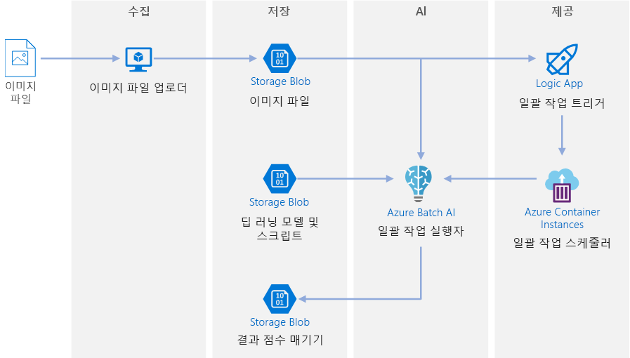
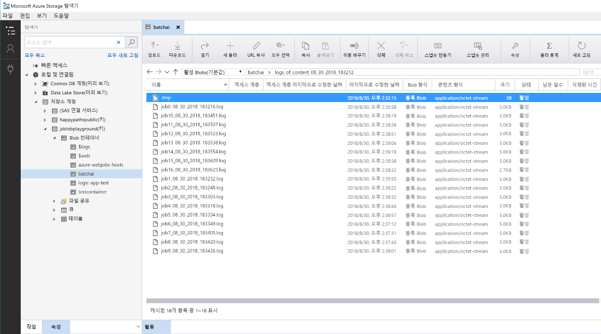

# Azure의 Deep Learning 모델 일괄 채점Batch scoring on Azure for deep learning models

이 참조 아키텍처는 Azure Batch AI를 사용하여 비디오에 신경망 스타일을 전송하는 방법을 보여 줍니다.This reference architecture shows how to apply neural style transfer to a video, using Azure Batch AI. *스타일 전송*은 기존 이미지를 다른 이미지의 스타일로 구성하는 Deep Learning 기술입니다.*Style transfer* is a deep learning technique that composes an existing image in the style of another image. 이 아키텍처는 Deep Learning에 일괄 채점을 사용하는 모든 시나리오에 대해 일반화할 수 있습니다.This architecture can be generalized for any scenario that uses batch scoring with deep learning. [**이 솔루션을 배포합니다**](#deploy-the-solution).[**Deploy this solution**](#deploy-the-solution).

**시나리오**: 미디어 조직에는 변경하려는 스타일이 특정 그림처럼 보이는 동영상이 있습니다.**Scenario**: A media organization has a video whose style they want to change to look like a specific painting. 조직은 시기적절하게 자동화된 방식으로 모든 비디오 프레임에 이 스타일을 적용할 수 있기 바랍니다.The organization wants to be able to apply this style to all frames of the video in a timely manner and in an automated fashion. 신경망 스타일 전송 알고리즘에 대한 자세한 내용은 [나선형 신경망을 사용한 이미지 스타일 전송][image-style-transfer](PDF)을 참조하세요.For more background about neural style transfer algorithms, see [Image Style Transfer Using Convolutional Neural Networks][image-style-transfer] (PDF).

| 스타일 이미지:Style image: | 입력/콘텐츠 비디오:Input/content video: | 출력 비디오:Output video: |
|--------|--------|---------|
|  |  *비디오를 보려면 클릭* *click to view video* |  *비디오를 보려면 클릭* *click to view video* |

이 참조 아키텍처는 Azure Storage의 새 미디어 존재로 인해 트리거되는 워크로드용으로 디자인되었습니다.This reference architecture is designed for workloads that are triggered by the presence of new media in Azure storage. 처리에는 다음 단계가 포함됩니다.Processing involves the following steps:

1. 선택한 스타일 이미지(예: Van Gogh 그림) 및 스타일 전송 스크립트를 Blob Storage로 업로드합니다.Upload a selected style image (like a Van Gogh painting) and a style transfer script to Blob Storage.
1. 시작할 준비가 된 자동 크기 조정 Batch AI 클러스터를 만듭니다.Create an autoscaling Batch AI cluster that is ready to start taking work.
1. 비디오 파일을 개별 프레임으로 분할하고 해당 프레임을 Blob Storage에 업로드합니다.Split the video file into individual frames and upload those frames into Blob Storage.
1. 모든 프레임이 업로드되면 트리거 파일을 Blob Storage에 업로드합니다.Once all frames are uploaded, upload a trigger file to Blob Storage.
1. 이 파일은 Azure Container Instances에서 실행되는 컨테이너를 만드는 논리 앱을 트리거합니다.This file triggers a Logic App that creates a container running in Azure Container Instances.
1. 이 컨테이너는 Batch AI 작업을 만드는 스크립트를 실행합니다.The container runs a script that creates the Batch AI jobs. 각 작업은 Batch AI 클러스터의 노드에서 병렬로 신경망 스타일 전송을 적용합니다.Each job applies the neural style transfer in parallel across the nodes of the Batch AI cluster.
1. 이미지가 생성되면 Blob Storage에 다시 저장됩니다.Once the images are generated, they are saved back to Blob Storage.
1. 생성된 프레임을 다운로드하고 이미지를 비디오로 다시 연결합니다.Download the generated frames, and stitch back the images into a video.

## 아키텍처Architecture

이 아키텍처는 다음과 같은 구성 요소로 구성됩니다.This architecture consists of the following components.

### 컴퓨팅Compute

**[Azure Batch AI][batch-ai]** 는 신경망 스타일 전송 알고리즘을 실행하는 데 사용됩니다.**[Azure Batch AI][batch-ai]** is used to run the neural style transfer algorithm. Batch AI는 GPU 지원 VM에서 Deep Learning 프레임워크용으로 사전 구성된 컨테이너화된 환경을 제공하여 Deep Learning 워크로드를 지원합니다.Batch AI supports deep learning workloads by providing containerized environments that are pre-configured for deep learning frameworks, on GPU-enabled VMs. 또한 Batch AI는 계산 클러스터를 Blob Storage에 연결할 수도 있습니다.Batch AI can also connect the compute cluster to Blob storage.

### StorageStorage

**[Blob Storage][blob-storage]** 는 모든 이미지(입력 이미지, 스타일 이미지 및 출력 이미지)와 Batch AI에서 생성된 모든 로그를 저장하는 데 사용됩니다.**[Blob storage][blob-storage]** is used to store all images (input images, style images, and output images) as well as all logs produced from Batch AI. Blob Storage는 Blob Storage에서 지원하는 오픈 소스 가상 파일 시스템인 [blobfuse][blobfuse]를 통해 Batch AI와 통합됩니다.Blob storage integrates with Batch AI via [blobfuse][blobfuse], an open-source virtual filesystem that is backed by Blob storage. 그뿐 아니라 Blob Storage는 이 워크로드에 필요한 성능에 비해 매우 비용 효율적입니다.Blob storage is also very cost-effective for the performance that this workload requires.

### 트리거/예약Trigger / scheduling

**[Azure Logic Apps][logic-apps]** 는 워크플로를 트리거하는 데 사용됩니다.**[Azure Logic Apps][logic-apps]** is used to trigger the workflow. 논리 앱이 컨테이너에 Blob이 추가되었음을 감지하면 Batch AI 프로세스를 트리거합니다.When the Logic App detects that a blob has been added to the container, it triggers the Batch AI process. Logic Apps는 Blob Storage에 대한 변경을 쉽게 감지하고 트리거를 변경하는 간단한 프로세스를 제공하므로 이 참조 아키텍처에 적합합니다.Logic Apps is a good fit for this reference architecture because it's an easy way to detect changes to blob storage and provides an easy process for changing the trigger.

**[Azure Container Instances][container-instances]** 는 Batch AI 작업을 만드는 Python 스크립트를 실행하는 데 사용됩니다.**[Azure Container Instances][container-instances]** is used to run the Python scripts that create the Batch AI jobs. Docker 컨테이너 내에서 이러한 스크립트를 실행하는 것은 요청 시 실행하는 편리한 방법입니다.Running these scripts inside a Docker container is a convenient way to run them on demand. 이 아키텍처에서는 논리 앱이 Batch AI 작업을 트리거할 수 있도록 하는 미리 빌드된 논리 앱 커넥터가 있으므로 Container Instances를 사용합니다.For this architecture, we use Container Instances because there is a pre-built Logic App connector for it, which allows the Logic App to trigger the Batch AI job. Container Instances는 상태 비저장 프로세스를 신속하게 스핀 업할 수 있습니다.Container Instances can spin up stateless processes quickly.

**[DockerHub][dockerhub]** 는 Container Instances가 작업 만들기 프로세스를 실행하는 데 사용하는 Docker 이미지를 저장하는 데 사용됩니다.**[DockerHub][dockerhub]** is used to store the Docker image that Container Instances uses to execute the job creation process. 이 아키텍처에서는 DockerHub가 사용하기 쉽고 Docker 사용자의 기본 이미지 리포지토리이므로 이 항목을 선택했습니다.DockerHub was chosen for this architecture because it's easy to use and is the default image repository for Docker users. [Azure Container Registry][container-registry]를 사용할 수도 있습니다.[Azure Container Registry][container-registry] can also be used.

### 데이터 준비Data preparation

이 참조 아키텍처는 나무 위의 오랑우탄 비디오 장면을 사용합니다.This reference architecture uses video footage of an orangutan in a tree. [여기][source-video]에서 장면을 다운로드한 후 다음 단계에 따라 워크플로용으로 처리할 수 있습니다.You can download the footage from [here][source-video] and process it for the workflow by following these steps:

1. [AzCopy][azcopy]를 사용하여 공용 Blob에서 비디오를 다운로드합니다.Use [AzCopy][azcopy] to download the video from the public blob.
2. [FFmpeg][ffmpeg]를 사용하여 오디오 파일을 추출한 후 나중에 출력 비디오로 다시 연결할 수 있습니다.Use [FFmpeg][ffmpeg] to extract the audio file, so that the audio file can be stitched back into the output video later.
3. FFmpeg를 사용하여 비디오를 개별 프레임으로 나눕니다.Use FFmpeg to break the video into individual frames. 프레임은 병렬로 독립적으로 처리됩니다.The frames will be processed independently, in parallel.
4. AzCopy를 사용하여 개별 프레임을 Blob 컨테이너에 복사합니다.Use AzCopy to copy the individual frames into your blob container.

이 단계에서 비디오 장면은 신경망 스타일 전송에 사용할 수 있는 형태가 됩니다.At this stage, the video footage is in a form that can be used for neural style transfer.

## 성능 고려 사항Performance considerations

### GPU 및 CPUGPU vs CPU

Deep Learning 워크로드의 경우, GPU는 CPU를 훨씬 더 능가하는 성능을 발휘하며, 이러한 성능을 얻기 위해서는 크기 조정 가능 CPU 클러스터가 더 많이 필요합니다.For deep learning workloads, GPUs will generally out-perform CPUs by a considerable amount, to the extent that a sizeable cluster of CPUs is usually needed to get comparable performance. 이 아키텍처에서 CPU만 사용할 수도 있지만, GPU가 훨씬 더 나은 비용/성능 프로필을 제공합니다.While it's an option to use only CPUs in this architecture, GPUs will provide a much better cost/performance profile. GPU 최적화 VM의 최신 [NCv3 시리즈]vm-sizes-gpu를 사용하는 것이 좋습니다.We recommend using the latest [NCv3 series]vm-sizes-gpu of GPU optimized VMs.

기본적으로 GPU는 일부 지역에서 사용할 수 없습니다.GPUs are not enabled by default in all regions. GPU가 지원되는 지역을 선택해야 합니다.Make sure to select a region with GPUs enabled. 또한 구독에는 GPU 최적화 VM에 대한 코어가 기본적으로 0으로 할당되어 있습니다.In addition, subscriptions have a default quota of zero cores for GPU-optimized VMs. 지원 요청을 열어 이 할당량을 높일 수 있습니다.You can raise this quota by opening a support request. 구독에 워크로드를 실행할 충분한 할당량이 있는지 확인하세요.Make sure that your subscription has enough quota to run your workload.

### VM 및 코어에서의 병렬 처리Parallelizing across VMs vs cores

스타일 전송 프로세스를 일괄 작업으로 실행할 때 주로 GPU에서 실행되는 작업은 VM에서 병렬 처리되어야 합니다.When running a style transfer process as a batch job, the jobs that run primarily on GPUs will have to be parallelized across VMs. 두 가지 방법이 가능합니다. 즉, 단일 GPU가 있는 VM을 사용하는 더 큰 클러스터를 만들거나 많은 GPU가 있는 VM을 사용하는 좀 더 작은 클러스터를 만들 수 있습니다.Two approaches are possible: You can create a larger cluster using VMs that have a single GPU, or create a smaller cluster using VMs with many GPUs.

이 워크로드에서 이러한 두 옵션은 필적할만한 성능을 제공합니다.For this workload, these two options will have comparable performance. VM당 더 많은 GPU가 있는 더 적은 수의 VM을 사용하면 데이터 이동을 줄일 수 있습니다.Using fewer VMs with more GPUs per VM can help to reduce data movement. 그러나 이 워크로드의 작업당 데이터 볼륨은 그리 크지 않으므로 Blob Storage에 따라 크게 제한되는 것이 확인되지 않습니다.However, the data volume per job for this workload is not very big, so you won't observe much throttling by blob storage.

### Batch AI 작업당 이미지 일괄 처리 크기Images batch size per Batch AI job

구성해야 하는 또 다른 매개변수는 Batch AI 작업당 처리할 이미지의 수입니다.Another parameter that must be configured is the number of images to process per Batch AI job. 경우에 따라 작업을 전체 노드에 광범위하게 분산하여 한 작업이 실패해도 너무 많은 이미지를 다시 시도할 필요가 없게 하고 싶을 수 있습니다.On the one hand, you want to ensure that work is spread broadly across the nodes and that if a job fails, you don't have to retry too many images. 이를 위해 많은 Batch AI 작업, 작업당 처리할 많은 수의 이미지를 유지할 수 있습니다.That points to having many Batch AI jobs and thus a low number of images to process per job. 반면에, 작업당 이미지 수가 너무 적으면 설정/시작 시간이 불균형적으로 커지게 됩니다.On the other hand, if too few images are processed per job, the setup/startup time becomes disproportionately large. 작업 수를 클러스터의 최대 노드 수와 같게 설정할 수 있습니다.You can set the number of jobs to equal the maximum number of nodes in the cluster. 이러한 방식은 설정/시작 비용을 최소화하므로 작업이 절대 실패하지 않을 것이라는 전제 하에 가장 뛰어난 성능을 보장합니다.This will be the most performant assuming that no jobs fail, because it minimizes the amount of setup/startup cost. 그러나 작업이 실패하면 많은 이미지를 다시 처리해야 할 수 있습니다.However, if a job fails, a large number of images might need to be reprocessed.

### 파일 서버File servers

Batch AI를 사용하는 경우 시나리오에 필요한 처리량에 따라 여러 저장소 옵션을 선택할 수 있습니다.When using Batch AI, you can choose multiple storage options depending on the throughput needed for your scenario. 필요한 처리량 수준이 낮은 워크로드의 경우, Blob Storage(blobfuse를 통해)를 사용하는 것으로 충분합니다.For workloads with low throughput requirements, using blob storage (via blobfuse) should be enough. 또는 Batch AI는 중앙에서 액세스할 수 있는 작업용 저장소 위치를 제공하기 위해 클러스터 노드에 자동으로 탑재될 수 있는 관리되는 단일 노드 NFS인 Batch AI 파일 서버도 지원합니다.Alternatively, Batch AI also supports a Batch AI File Server, a managed single-node NFS, which can be automatically mounted on cluster nodes to provide a centrally accessible storage location for jobs. 대부분의 경우 하나의 작업 영역에서 하나의 파일 서버만 필요하며, 학습 작업용 데이터는 다른 디렉터리로 분리할 수 있습니다.For most cases, only one file server is needed in a workspace, and you can separate data for your training jobs into different directories. 단일 노드 NFS가 워크로드에 적합하지 않은 경우 Batch AI는 Azure 파일 또는 사용자 지정 솔루션(예: Gluster 또는 Lustre 파일 시스템)을 비롯한 다른 저장소 옵션을 지원합니다.If a single-node NFS isn't appropriate for your workloads, Batch AI supports other storage options, including Azure Files or custom solutions such as a Gluster or Lustre file system.

## 보안 고려 사항Security considerations

### Azure Blob Storage에 대한 액세스 제한Restricting access to Azure blob storage

이 참조 아키텍처에서 Azure Blob Storage는 보호해야 하는 주 스토리지 구성 요소입니다.In this reference architecture, Azure blob storage is the main storage component that needs to be protected. GitHub 리포지토리에 표시된 기본 배포는 스토리지 계정 키를 사용하여 Blob Storage에 액세스합니다.The baseline deployment shown in the GitHub repo uses storage account keys to access the blob storage. 추가 제어 및 보호를 위해 SAS(공유 액세스 서명)를 대신 사용하는 것을 고려하세요.For further control and protection, consider using a shared access signature (SAS) instead. 이 기능은 계정 키를 하드 코딩하거나 일반 텍스트로 저장할 필요 없이 저장소의 개체에 대해 제한된 액세스를 부여합니다.This grants limited access to objects in storage, without needing to hard code the account keys or save them in plaintext. 계정 키가 논리 앱의 디자이너 인터페이스 내에서 일반 텍스트로 표시되므로 이 접근 방식은 특히 유용합니다.This approach is especially useful because account keys are visible in plaintext inside of Logic App's designer interface. 또한 SAS는 저장소 계정에 적절한 거버넌스가 유지되고, 의도한 사용자에게만 액세스 권한이 부여되도록 하는 데도 도움이 됩니다.Using an SAS also helps to ensure that the storage account has proper governance, and that access is granted only to the people intended to have it.

보다 중요한 데이터가 있는 시나리오의 경우, 이러한 키가 워크로드의 모든 입력 및 출력 데이터에 대해 모든 액세스 권한을 부여하므로 모든 저장소 키가 보호될 수 있습니다.For scenarios with more sensitive data, make sure that all of your storage keys are protected, because these keys grant full access to all input and output data from the workload.

### 데이터 암호화 및 데이터 이동Data encryption and data movement

이 참조 아키텍처는 일괄 채점 프로세스의 예로 스타일 전송을 사용합니다.This reference architecture uses style transfer as an example of a batch scoring process. 데이터가 좀 더 중요한 시나리오에서는 저장소의 데이터를 미사용 시에도 암호화해야 합니다.For more data-sensitive scenarios, the data in storage should be encrypted at rest. 데이터가 한 위치에서 다음 위치로 이동될 때마다 SSL을 사용하여 데이터 전송의 보안을 유지합니다.Each time data is moved from one location to the next, use SSL to secure the data transfer. 자세한 내용은 [Azure Storage 보안 가이드][storage-security]를 참조하세요.For more information, see [Azure Storage security guide][storage-security].

### 가상 네트워크의 데이터 보안Securing data in a virtual network

Batch AI 클러스터를 배포할 때 가상 네트워크의 서브넷 내에서 프로비전되도록 클러스터를 구성할 수 있습니다.When deploying your Batch AI cluster, you can configure your cluster to be provisioned inside a subnet of a virtual network. 이렇게 하면 클러스터의 계산 노드가 다른 가상 머신이나 온-프레미스 네트워크와 안전하게 통신할 수 있습니다.This allows the compute nodes in the cluster to communicate securely with other virtual machines, or even with an on-premises network. 또한 Blob Storage에 [서비스 엔드포인트][service-endpoints]를 사용하여 가상 네트워크에서 액세스하기 위한 권한을 부여하거나, VNET 내의 단일 노드 NFS와 Batch AI를 함께 사용하여 데이터가 항상 보호되도록 할 수 있습니다.You can also use [service endpoints][service-endpoints] with blob storage to grant access from a virtual network or use a single-node NFS inside the VNET with Batch AI to ensure that the data is always protected.

### 악의적인 활동으로부터 보호Protecting against malicious activity

여러 사용자가 있는 시나리오에서는 악의적인 활동으로부터 중요한 데이터를 보호해야 합니다.In scenarios where there are multiple users, make sure that sensitive data is protected against malicious activity. 다른 사용자에게 입력 데이터를 사용자 지정할 수 있게 이 배포에 대한 액세스 권한을 부여하는 경우, 다음 주의 사항 및 고려 사항에 유의하세요.If other users are given access to this deployment to customize the input data, take note of the following precautions and considerations:

- RBAC를 사용하여 필요한 리소스로만 사용자 액세스를 제한합니다.Use RBAC to limit users' access to only the resources they need.
- 두 개의 개별 저장소 계정을 프로비전합니다.Provision two separate storage accounts. 입력 및 출력 데이터를 첫 번째 계정에 저장합니다.Store input and output data in the first account. 외부 사용자에게 이 계정에 대한 액세스 권한을 부여할 수 있습니다.External users can be given access to this account. 실행 가능한 스크립트 및 출력 로그 파일은 다른 계정에 저장합니다.Store executable scripts and output log files in the other account. 외부 사용자는 이 계정에 액세스할 수 없습니다.External users should not have access to this account. 이렇게 하면 외부 사용자가 실행 파일을 수정할 수 없으며(악성 코드 삽입을 위해), 중요한 정보를 포함할 수 있는 로그 파일에 액세스할 수 없게 됩니다.This will ensure that external users cannot modify any executable files (to inject malicious code), and don't have access to logfiles, which could hold sensitive information.
- 악의적인 사용자는 작업 큐에 대해 DDOS 공격을 수행하거나 작업 큐에 잘못된 형식의 포이즌 메시지를 삽입하여 시스템이 잠기거나 큐 대기 해제 오류가 발생하도록 할 수 있습니다.Malicious users can DDOS the job queue or inject malformed poison messages in the job queue, causing the system to lock up or causing dequeuing errors.

## 모니터링 및 로깅Monitoring and logging

### Batch AI 작업 모니터링Monitoring Batch AI jobs

작업을 실행하는 동안 진행 상황을 모니터링하고 예상대로 작동하는지 확인하는 것이 중요합니다.While running your job, it's important to monitor the progress and make sure that things are working as expected. 그러나 활성 노드의 클러스터를 모니터링할 경우 어려움이 있을 수 있습니다.However, it can be a challenge to monitor across a cluster of active nodes.

클러스터의 전반적인 상태를 파악하려면 Azure Portal의 Batch AI 블레이드로 이동하여 클러스터의 노드 상태를 검사합니다.To get a sense of the overall state of the cluster, go to the Batch AI blade of the Azure Portal to inspect the state of the nodes in the cluster. 노드가 비활성이거나 작업이 실패한 경우 오류 로그가 Blob Storage에 저장되며 Azure Portal의 작업 블레이드에서도 액세스할 수 있습니다.If a node is inactive or a job has failed, the error logs are saved to blob storage, and are also accessible in the Jobs blade in the Azure Portal.

Application Insights에 로그를 연결하거나 Batch AI 클러스터 및 해당 작업의 상태를 폴링하기 위한 별도의 프로세스를 실행하여 모니터링을 추가로 보완할 수 있습니다.Monitoring can be further enriched by connecting logs to Application Insights or by running separate processes to poll for the state of the Batch AI cluster and its jobs.

### Batch AI에서 로깅Logging in Batch AI

Batch AI는 모든 stdout/stderr를 관련 Blob Storage 계정에 자동으로 로깅합니다.Batch AI will automatically log all stdout/stderr to the associate blob storage account. Storage 탐색기와 같은 스토리지 탐색 도구를 사용하면 로그 파일 탐색을 위한 보다 간편한 환경이 구현됩니다.Using a storage navigation tool such as Storage Explorer will provide a much easier experience for navigating log files.

이 참조 아키텍처의 배포 단계는 또한 아래에 표시된 것처럼 여러 작업에 대한 모든 로그가 Blob 컨테이너의 동일한 디렉터리에 저장되는 것과 같은 보다 간단한 로깅 시스템을 설정하는 방법을 보여 줍니다.The deployment steps for this reference architecture also shows how to set up a more simple logging system, such that all the logs across the different jobs are saved to the same directory in your blob container, as shown below. 이러한 로그를 사용하여 각 작업 및 각 이미지를 처리하는 데 걸리는 시간을 모니터링합니다.Use these logs to monitor how long it takes for each job and each image to process. 이를 통해 프로세스를 좀 더 최적화하는 방법을 더 잘 이해할 수 있습니다.This will give you a better sense of how to optimize the process even further.

## 비용 고려 사항Cost considerations

저장소 및 예약 구성 요소와 비교할 때, 지금까지 이 참조 아키텍처에 사용된 계산 리소스가 비용 발생에 가장 큰 부분을 차지합니다.Compared to the storage and scheduling components, the compute resources used in this reference architecture by far dominate in terms of costs. 주요 난제 중 하나는 GPU 지원 머신의 클러스터 전체에서 작업을 효과적으로 병렬 처리하는 것입니다.One of the main challenges is effectively parallelizing the work across a cluster of GPU-enabled machines.

Batch AI 클러스터 크기는 큐의 작업에 따라 자동으로 확장 및 축소될 수 있습니다.The Batch AI cluster size can automatically scale up and down depending on the jobs in the queue. 두 가지 방법 중 하나로 Batch AI를 통한 자동 크기 조정을 사용하도록 설정할 수 있습니다.You can enable auto-scale with Batch AI in one of two ways. 이 작업을 프로그래밍 방식으로 수행하여 [배포 단계][deployment]의 일부로 `.env` 파일에 구성하거나, 클러스터가 만들어진 후 포털에서 직접 크기 조정 수식을 변경할 수 있습니다.You can do so programmatically, which can be configured in the `.env` file that is part of the [deployment steps][deployment], or you can change the scale formula directly in the portal after the cluster is created.

즉각적인 처리가 필요하지 않은 작업의 경우, 기본 상태(최소)가 0 노드의 클러스터가 되도록 자동 크기 조정 수식을 구성합니다.For work that doesn't require immediate processing, configure the auto-scale formula so the default state (minimum) is a cluster of zero nodes. 이 구성을 사용하면 클러스터는 0개 노드로 시작하고 큐에서 작업을 감지할 때만 규모가 확장됩니다.With this configuration, the cluster starts with zero nodes and only scales up when it detects jobs in the queue. 일괄 채점 프로세스가 하루에 몇 번 또는 그 이하로만 발생할 경우 이 설정을 통해 비용을 크게 절감할 수 있습니다.If the batch scoring process only happens a few times a day or less, this setting enables significant cost savings.

자동 크기 조정은 서로 너무 가깝게 위치하는 일괄 처리 작업에는 적절하지 않을 수 있습니다.Auto-scaling may not be appropriate for batch jobs that happen too close to each other. 클러스터가 스핀 업 및 스핀 다운되는 데 걸리는 시간도 비용을 발생할 수 있으므로, 일괄 처리 워크로드가 이전 작업이 종료되고 몇 분 안에 시작될 경우 작업 중간에 클러스터를 계속 실행하도록 하는 것이 좀 더 비용 효율적일 수 있습니다.The time that it takes for a cluster to spin up and spin down also incur a cost, so if a batch workload begins only a few minutes after the previous job ends, it might be more cost effective to keep the cluster running between jobs.

## 솔루션 배포Deploy the solution

이 참조 아키텍처를 배포하려면 [GitHub 리포지토리][deployment]에 설명된 단계를 따르세요.To deploy this reference architecture, follow the steps described in the [GitHub repo][deployment].

<!-- links -->

[azcopy]: /azure/storage/common/storage-use-azcopy-linux
[batch-ai]: /azure/batch-ai/
[blobfuse]: https://github.com/Azure/azure-storage-fuse
[blob-storage]: /azure/storage/blobs/storage-blobs-introduction
[container-instances]: /azure/container-instances/
[container-registry]: /azure/container-registry/
[deployment]: https://github.com/Azure/batch-scoring-for-dl-models
[dockerhub]: https://hub.docker.com/
[ffmpeg]: https://www.ffmpeg.org/
[image-style-transfer]: https://www.cv-foundation.org/openaccess/content_cvpr_2016/papers/Gatys_Image_Style_Transfer_CVPR_2016_paper.pdf
[logic-apps]: /azure/logic-apps/
[service-endpoints]: /azure/storage/common/storage-network-security?toc=%2fazure%2fvirtual-network%2ftoc.json#grant-access-from-a-virtual-network
[source-video]: https://happypathspublic.blob.core.windows.net/videos/orangutan.mp4
[storage-security]: /azure/storage/common/storage-security-guide
[vm-sizes-gpu]: /azure/virtual-machines/windows/sizes-gpu