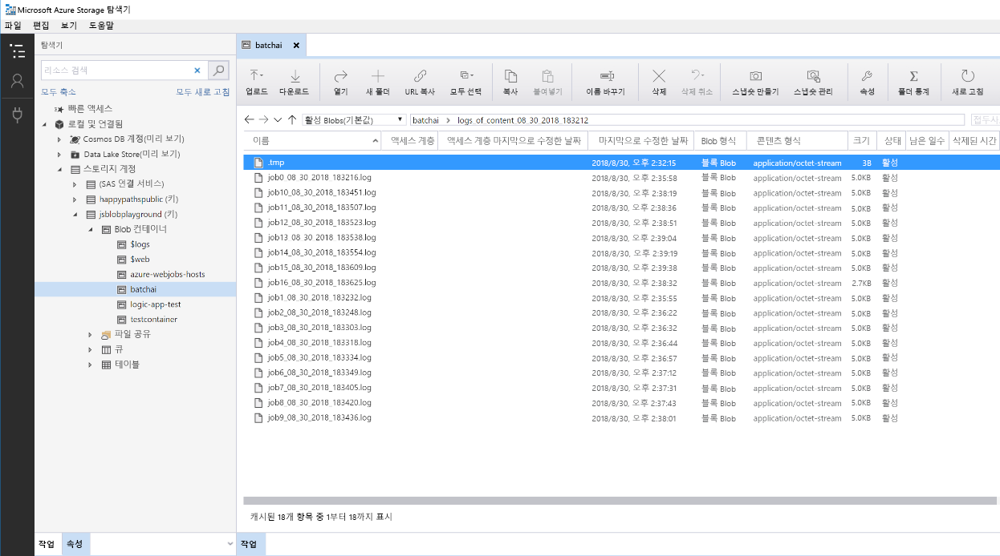

# Azure에서 Python 모델 일괄 채점Batch scoring of Python models on Azure

이 참조 아키텍처에서는 Azure Batch AI를 사용하여 정기적으로 여러 모델을 동시에 일괄 채점하기 위한 확장 가능한 솔루션을 빌드하는 방법을 보여줍니다.This reference architecture shows how to build a scalable solution for batch scoring many models on a schedule in parallel using Azure Batch AI. 솔루션은 템플릿으로 사용할 수 있으며 여러 문제에 맞게 일반화할 수 있습니다.The solution can be used as a template and can generalize to different problems.

이 아키텍처에 대한 참조 구현은  [GitHub][github]에서 사용할 수 있습니다.A reference implementation for this architecture is available on [GitHub][github].

**시나리오**: 이 솔루션은 각 디바이스가 센서 판독값을 지속적으로 전송하는 IoT 환경에서 여러 디바이스의 작동을 모니터링합니다.**Scenario**: This solution monitors the operation of a large number of devices in an IoT setting where each device sends sensor readings continuously. 각 디바이스는 사전 정의된 시간 간격 동안 집계된 일련의 측정값이 변칙에 해당하는지 여부를 예측하는 데 사용되어야 하는 사전 학습된 변칙 검색 모델을 포함하고 있는 것으로 간주됩니다.Each device is assumed to have pre-trained anomaly detection models that need to be used to predict whether a series of measurements, that are aggregated over a predefined time interval, correspond to an anomaly or not. 실제 시나리오에서 이는 학습 또는 실시간 채점에 사용되기 전에 필터링되고 집계되어야 하는 센서 판독값 스트림이 될 수 있습니다.In real-world scenarios, this could be a stream of sensor readings that need to be filtered and aggregated before being used in training or real-time scoring. 이 솔루션은 채점 작업 실행 시 간소화를 위해 동일한 데이터 파일을 사용합니다.For simplicity, the solution uses the same data file when executing scoring jobs.

## 아키텍처Architecture

이 아키텍처는 다음과 같은 구성 요소로 구성됩니다.This architecture consists of the following components:

[Azure Event Hubs][event-hubs].[Azure Event Hubs][event-hubs]. 이 메시지 수집 서비스는 초당 수백만 개의 이벤트 메시지를 수집할 수 있습니다.This message ingestion service can ingest millions of event messages per second. 이 아키텍처에서 센서는 데이터 스트림을 이벤트 허브로 보냅니다.In this architecture, sensors send a stream of data to the event hub.

[Azure Stream Analytics][stream-analytics].[Azure Stream Analytics][stream-analytics]. 이벤트 처리 엔진입니다.An event-processing engine. Stream Analytics 작업은 이벤트 허브에서 데이터 스트림을 읽고 스트림 처리를 수행합니다.A Stream Analytics job reads the data streams from the event hub and performs stream processing.

[Azure Batch AI][batch-ai].[Azure Batch AI][batch-ai]. 이 분산 컴퓨팅 엔진은 Azure에서 대규모로 기계 학습 및 AI 모델을 학습시키고 테스트하는 데 사용됩니다.This distributed computing engine is used to train and test machine learning and AI models at scale in Azure. Batch AI는 자동 크기 조정 옵션을 사용하여 필요 시 가상 머신을 만들고, Batch AI 클러스터의 각 노드는 특정 센서에 대한 채점 작업을 실행합니다.Batch AI creates virtual machines on demand with an automatic scaling option, where each node in the Batch AI cluster runs a scoring job for a specific sensor. 채점용 Python [스크립트][python-script]는 클러스터의 각 노드에 생성된 Docker 컨테이너에서 실행되며, 관련 센서 데이터를 읽고, 예측 항목을 생성하여 Blob Storage에 저장합니다.The scoring Python [script][python-script] runs in Docker containers that are created on each node of the cluster, where it reads the relevant sensor data, generates predictions and stores them in Blob storage.

[Azure Blob Storage][storage].[Azure Blob Storage][storage]. Blob 컨테이너는 미리 학습된 모델, 데이터 및 출력 예측 항목을 저장하는 데 사용됩니다.Blob containers are used to store the pretrained models, the data, and the output predictions. 모델은 [create\_resources.ipynb][create-resources] 노트북의 Blob Storage에 업로드됩니다.The models are uploaded to Blob storage in the [create\_resources.ipynb][create-resources] notebook. 이러한 [1클래스 SVM][one-class-svm] 모델은 여러 디바이스의 다양한 센서 값을 나타내는 데이터를 학습합니다.These [one-class SVM][one-class-svm] models are trained on data that represents values of different sensors for different devices. 이 솔루션에서는 데이터 값이 고정된 시간 간격에 걸쳐 집계된다고 가정합니다.This solution assumes that the data values are aggregated over a fixed interval of time.

[Azure Logic Apps][logic-apps].[Azure Logic Apps][logic-apps]. 이 솔루션은 매 시간 Batch AI 작업을 실행하는 논리 앱을 만듭니다.This solution creates a Logic App that runs hourly Batch AI jobs. Logic Apps는 런타임 워크플로를 만들고 솔루션에 대한 일정을 예약하는 쉬운 방법을 제공합니다.Logic Apps provides an easy way to create the runtime workflow and scheduling for the solution. Batch AI 작업은 Docker 컨테이너에서도 실행되는 Python [스크립트][script]를 사용하여 제출됩니다.The Batch AI jobs are submitted using a Python [script][script] that also runs in a Docker container.

[Azure Container Registry][acr].[Azure Container Registry][acr]. Docker 이미지는 Batch AI 및 Logic Apps 모두에서 사용되며 [create\_resources.ipynb][create-resources] 노트북에서 생성된 후 Container Registry에 푸시됩니다.Docker images are used in both Batch AI and Logic Apps and are created in the [create\_resources.ipynb][create-resources] notebook, then pushed to Container Registry. 이렇게 하면 이 솔루션에서 Logic Apps 및 Batch AI와 같은 다른 Azure 서비스를 통해 간편하게 이미지를 호스팅하고 컨테이너를 인스턴스화할 수 있습니다.This provides a convenient way to host images and instantiate containers through other Azure services—Logic Apps and Batch AI in this solution.

## 성능 고려 사항Performance considerations

표준 Python 모델의 경우 일반적으로 워크로드를 처리할 CPU가 충분하다고 여겨집니다.For standard Python models, it's generally accepted that CPUs are sufficient to handle the workload. 이 아키텍처에서는 CPU를 사용합니다.This architecture uses CPUs. 하지만 [딥 러닝 워크로드][deep]의 경우, GPU는 일반적으로 CPU를 훨씬 더 능가하는 성능을 발휘하며, 이러한 성능을 얻기 위해서는 크기 조정 가능 CPU 클러스터가 더 많이 필요합니다.However, for [deep learning workloads][deep], GPUs generally outperform CPUs by a considerable amount—a sizeable cluster of CPUs is usually needed to get comparable performance.

### VM 및 코어에서의 병렬 처리Parallelizing across VMs vs cores

일괄 처리 모드로 여러 모델의 채점 프로세스를 실행할 때는 VM 전체에서 작업을 병렬 처리해야 합니다.When running scoring processes of many models in batch mode, the jobs need to be parallelized across VMs. 두 가지 방법이 가능합니다.Two approaches are possible:

* 저비용 VM을 사용하여 대규모 클러스터를 만듭니다.Create a larger cluster using low-cost VMs.

* 각각 추가 코어가 제공되는 고성능 VM을 사용하여 소규모 클러스터를 만듭니다.Create a smaller cluster using high performing VMs with more cores available on each.

일반적으로 표준 Python 모델을 채점하는 작업은 딥 러닝 모델을 채점하는 것만큼 까다롭지 않으며, 소규모 클러스터가 큐에 저장된 여러 모델을 효율적으로 처리할 수 있어야 합니다.In general, scoring of standard Python models is not as demanding as scoring of deep learning models, and a small cluster should be able to handle a large number of queued models efficiently. 데이터 세트 크기가 증가함에 따라 클러스터 노드 수를 늘릴 수 있습니다.You can increase the number of cluster nodes as the dataset sizes increase.

이 시나리오에서는 편의상 단일 Batch AI 작업 내에서 하나의 채점 작업이 제출됩니다.For convenience in this scenario, one scoring task is submitted within a single Batch AI job. 그러나 동일한 Batch AI 작업 내에서 여러 데이터 청크를 채점하는 것이 더 효율적일 수 있습니다.However, it can be more efficient to score multiple data chunks within the same Batch AI job. 이러한 경우 여러 데이터 세트에서 읽을 사용자 지정 코드를 작성하고, 단일 Batch AI 작업 실행 중에 이에 대한 채점 스크립트를 실행하세요.In those cases, write custom code to read in multiple datasets and execute the scoring script for those during a single Batch AI job execution.

### 파일 서버File servers

Batch AI를 사용하는 경우 시나리오에 필요한 처리량에 따라 여러 스토리지 옵션을 선택할 수 있습니다.When using Batch AI, you can choose multiple storage options depending on the throughput needed for your scenario. 필요한 처리량 수준이 낮은 워크로드의 경우, Blob Storage를 사용하는 것으로 충분합니다.For workloads with low throughput requirements, using blob storage should be enough. 또는 Batch AI는 중앙에서 액세스할 수 있는 작업용 스토리지 위치를 제공하기 위해, 클러스터 노드에 자동으로 탑재가 가능한 관리형 단일 노드 NFS인 [Batch AI 파일 서버][bai-file-server]도 지원합니다.Alternatively, Batch AI also supports a [Batch AI File Server][bai-file-server], a managed, single-node NFS, which can be automatically mounted on cluster nodes to provide a centrally accessible storage location for jobs. 대부분의 경우 하나의 작업 영역에는 하나의 파일 서버만 필요하며, 학습 작업용 데이터는 다른 디렉터리로 구분할 수 있습니다.For most cases, only one file server is needed in a workspace, and you can separate data for your training jobs into different directories.

단일 노드 NFS가 워크로드에 적합하지 않은 경우 Batch AI는 [Azure 파일][azure-files] 및 사용자 지정 솔루션(예: Gluster 또는 Lustre 파일 시스템)을 비롯한 다른 스토리지 옵션을 지원합니다.If a single-node NFS isn't appropriate for your workloads, Batch AI supports other storage options, including [Azure Files][azure-files] and custom solutions such as a Gluster or Lustre file system.

## 관리 고려 사항Management considerations

### Batch AI 작업 모니터링Monitoring Batch AI jobs

실행 중인 작업의 진행률을 모니터링하는 것이 중요하지만 활성 노드의 클러스터 전체를 모니터링하기는 어려울 수 있습니다.It's important to monitor the progress of running jobs, but it can be a challenge to monitor across a cluster of active nodes. 클러스터의 전반적인 상태를 파악하려면 [Azure Portal][portal]의 **Batch AI** 블레이드로 이동하여 클러스터의 노드 상태를 검사합니다.To get a sense of the overall state of the cluster, go to the **Batch AI** blade of the [Azure Portal][portal] to inspect the state of the nodes in the cluster. 노드가 비활성이거나 작업이 실패한 경우 오류 로그가 Blob Storage에 저장되며 포털의 **작업** 블레이드에서도 액세스할 수 있습니다.If a node is inactive or a job has failed, the error logs are saved to blob storage, and are also accessible in the **Jobs** blade of the portal.

모니터링을 추가로 보완하려면 [Application Insights][ai]에 로그를 연결하거나 Batch AI 클러스터 및 해당 작업의 상태를 폴링하기 위한 별도의 프로세스를 실행하세요.For richer monitoring, connect logs to [Application Insights][ai], or run separate processes to poll for the state of the Batch AI cluster and its jobs.

### Batch AI에서 로깅Logging in Batch AI

Batch AI는 모든 stdout/stderr을 관련 Azure Storage 계정에 기록합니다.Batch AI logs all stdout/stderr to the associated Azure storage account. 로그 파일을 쉽게 탐색하려면 [Azure Storage 탐색기][explorer]와 같은 스토리지 탐색 도구를 사용하세요.For easy navigation of the log files, use a storage navigation tool such as [Azure Storage Explorer][explorer].

이 참조 아키텍처를 배포하면 간단한 로깅 시스템을 설정할 수 있습니다.When you deploy this reference architecture, you have the option to set up a simpler logging system. 이 옵션을 사용하면 아래 표시된 것과 같이 여러 작업의 모든 로그가 BLOB 컨테이너의 동일한 디렉터리에 저장됩니다.With this option, all the logs across the different jobs are saved to the same directory in your blob container as shown below. 이러한 로그를 사용하여 각 작업과 각 이미지를 처리하는 데 걸리는 시간을 모니터링하여 프로세스를 최적화하는 방법을 더 잘 파악할 수 있습니다.Use these logs to monitor how long it takes for each job and each image to process, so you have a better sense of how to optimize the process.

## 비용 고려 사항Cost considerations

이 참조 아키텍처에서 사용된 가장 광범위한 구성 요소는 컴퓨팅 리소스입니다.The most expensive components used in this reference architecture are the compute resources.

Batch AI 클러스터 크기는 큐의 작업에 따라 확장 및 축소됩니다.The Batch AI cluster size scales up and down depending on the jobs in the queue. 두 가지 방법 중 하나로 Batch AI를 통한 [자동 크기 조정][automatic-scaling]을 사용하도록 설정할 수 있습니다.You can enable [automatic scaling][automatic-scaling] with Batch AI in one of two ways. 이 작업을 프로그래밍 방식으로 수행하여 [배포 단계][github]의 일부로 .env 파일에 구성하거나, 클러스터가 만들어진 후 포털에서 직접 크기 조정 수식을 변경할 수 있습니다.You can do so programmatically, which can be configured in the .env file that is part of the [deployment steps][github], or you can change the scale formula directly in the portal after the cluster is created.

즉각적인 처리가 필요하지 않은 작업의 경우, 기본 상태(최소)가 0 노드의 클러스터가 되도록 자동 크기 조정 수식을 구성합니다.For work that doesn't require immediate processing, configure the automatic scaling formula so the default state (minimum) is a cluster of zero nodes. 이 구성을 사용하면 클러스터는 0개 노드로 시작하고 큐에서 작업을 감지할 때만 규모가 확장됩니다.With this configuration, the cluster starts with zero nodes and only scales up when it detects jobs in the queue. 일괄 채점 프로세스가 하루에 몇 번 또는 그 이하로만 발생할 경우 이 설정을 통해 비용을 크게 절감할 수 있습니다.If the batch scoring process only happens a few times a day or less, this setting enables significant cost savings.

자동 크기 조정은 서로 너무 가깝게 위치하는 일괄 처리 작업에는 적절하지 않을 수 있습니다.Automatic scaling may not be appropriate for batch jobs that happen too close to each other. 클러스터가 스핀 업 및 스핀 다운되는 데 걸리는 시간도 비용을 발생할 수 있으므로, 일괄 처리 워크로드가 이전 작업이 종료되고 몇 분 안에 시작될 경우 작업 중간에 클러스터를 계속 실행하도록 하는 것이 좀 더 비용 효율적일 수 있습니다.The time that it takes for a cluster to spin up and spin down also incur a cost, so if a batch workload begins only a few minutes after the previous job ends, it might be more cost effective to keep the cluster running between jobs. 이는 채점 프로세스가 매우 자주(예: 매 시간) 실행되도록 예약되었는지, 아니면 가끔(예: 매달) 실행되도록 예약되었는지에 따라 달라집니다.That depends on whether scoring processes are scheduled to run at a high frequency (every hour, for example), or less frequently (once a month, for example).

## 솔루션 배포Deploy the solution

이 참조 아키텍처 구현은 [GitHub][github]에서 제공됩니다.The reference implementation of this architecture is available on [GitHub][github]. 여기에 나와 있는 설정 단계를 따라 Batch AI를 사용하여 여러 모델을 동시에 채점하는 확장 가능한 솔루션을 빌드하세요.Follow the setup steps there to build a scalable solution for scoring many models in parallel using Batch AI.

[acr]: /azure/container-registry/container-registry-intro
[ai]: /azure/application-insights/app-insights-overview
[automatic-scaling]: /azure/batch/batch-automatic-scaling
[azure-files]: /azure/storage/files/storage-files-introduction
[batch-ai]: /azure/batch-ai/
[bai-file-server]: /azure/batch-ai/resource-concepts#file-server
[create-resources]: https://github.com/Azure/BatchAIAnomalyDetection/blob/master/create_resources.ipynb
[deep]: /azure/architecture/reference-architectures/ai/batch-scoring-deep-learning
[event-hubs]: /azure/event-hubs/event-hubs-geo-dr
[explorer]: https://azure.microsoft.com/en-us/features/storage-explorer/
[github]: https://github.com/Azure/BatchAIAnomalyDetection
[logic-apps]: /azure/logic-apps/logic-apps-overview
[one-class-svm]: http://scikit-learn.org/stable/modules/generated/sklearn.svm.OneClassSVM.html
[portal]: https://portal.azure.com
[python-script]: https://github.com/Azure/BatchAIAnomalyDetection/blob/master/batchai/predict.py
[script]: https://github.com/Azure/BatchAIAnomalyDetection/blob/master/sched/submit_jobs.py
[storage]: /azure/storage/blobs/storage-blobs-overview
[stream-analytics]: /azure/stream-analytics/
