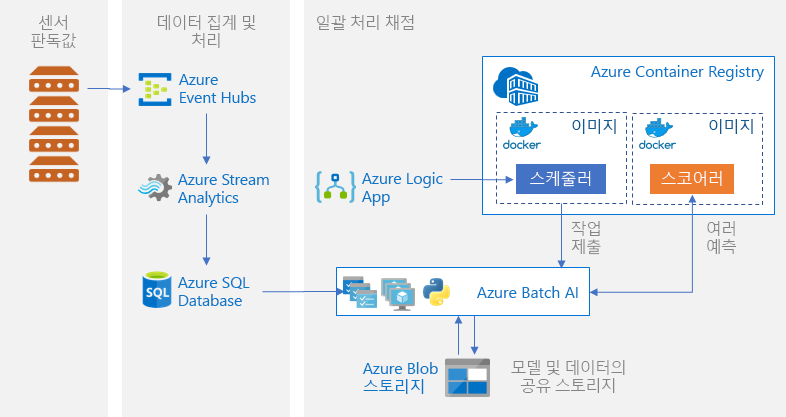

# Azure에서 Python 모델 일괄 채점Batch scoring of Python models on Azure

이 참조 아키텍처에서는 Azure Machine Learning Service를 사용하여 정기적으로 여러 모델을 병렬로 일괄 채점하기 위한 확장 가능한 솔루션을 빌드하는 방법을 보여줍니다.This reference architecture shows how to build a scalable solution for batch scoring many models on a schedule in parallel using Azure Machine Learning Service. 솔루션은 템플릿으로 사용할 수 있으며 여러 문제에 맞게 일반화할 수 있습니다.The solution can be used as a template and can generalize to different problems.

이 아키텍처에 대한 참조 구현은 [GitHub][github]에서 사용할 수 있습니다.A reference implementation for this architecture is available on [GitHub][github].

**시나리오**: 이 솔루션은 각 디바이스가 센서 판독값을 지속적으로 전송하는 IoT 환경에서 여러 디바이스의 작동을 모니터링합니다.**Scenario**: This solution monitors the operation of a large number of devices in an IoT setting where each device sends sensor readings continuously. 각 디바이스는 사전 정의된 시간 간격 동안 집계된 일련의 측정값이 변칙에 해당하는지 여부를 예측하는 데 사용되어야 하는 사전 학습된 변칙 검색 모델과 관련이 있는 것으로 간주됩니다.Each device is assumed to be associated with pretrained anomaly detection models that need to be used to predict whether a series of measurements, that are aggregated over a predefined time interval, correspond to an anomaly or not. 실제 시나리오에서 이는 학습 또는 실시간 채점에 사용되기 전에 필터링되고 집계되어야 하는 센서 판독값 스트림이 될 수 있습니다.In real-world scenarios, this could be a stream of sensor readings that need to be filtered and aggregated before being used in training or real-time scoring. 이 솔루션은 채점 작업 실행 시 간소화를 위해 동일한 데이터 파일을 사용합니다.For simplicity, this solution uses the same data file when executing scoring jobs.

이 참조 아키텍처는 정기적으로 트리거되는 워크로드용으로 설계되었습니다.This reference architecture is designed for workloads that are triggered on a schedule. 처리에는 다음 단계가 포함됩니다.Processing involves the following steps:
1.  Azure Event Hubs로 수집을 위한 센서 판독값을 전송합니다.Send sensor readings for ingestion to Azure Event Hubs.
2.  스트림 처리를 수행하고 원시 데이터를 저장합니다.Perform stream processing and store the raw data.
3.  작업을 시작할 준비가 된 Machine Learning 클러스터에 데이터를 전송합니다.Send the data to a Machine Learning cluster that is ready to start taking work. 클러스터의 각 노드는 특정 센서에 대한 점수 매기기 작업을 실행합니다.Each node in the cluster runs a scoring job for a specific sensor. 
4.  Machine Learning Python 스크립트를 사용하여 병렬로 점수 매기기 작업을 실행하는 점수 매기기 파이프라인을 실행합니다.Execute the scoring pipeline, which runs the scoring jobs in parallel using Machine Learning Python scripts. 파이프라인은 미리 정의된 기간에 실행되도록 생성, 게시 및 예약됩니다.The pipeline is created, published, and scheduled to run on a predefined interval of time.
5.  예측을 생성하고 나중에 사용할 수 있도록 Blob Storage에 저장합니다.Generate predictions and store them in Blob storage for later consumption.

## 아키텍처Architecture

이 아키텍처는 다음과 같은 구성 요소로 구성됩니다.This architecture consists of the following components:

[Azure Event Hubs][event-hubs].[Azure Event Hubs][event-hubs]. 이 메시지 수집 서비스는 초당 수백만 개의 이벤트 메시지를 수집할 수 있습니다.This message ingestion service can ingest millions of event messages per second. 이 아키텍처에서 센서는 데이터 스트림을 이벤트 허브로 보냅니다.In this architecture, sensors send a stream of data to the event hub.

[Azure Stream Analytics][stream-analytics].[Azure Stream Analytics][stream-analytics]. 이벤트 처리 엔진입니다.An event-processing engine. Stream Analytics 작업은 이벤트 허브에서 데이터 스트림을 읽고 스트림 처리를 수행합니다.A Stream Analytics job reads the data streams from the event hub and performs stream processing.

[Azure SQL Database][sql-database].[Azure SQL Database][sql-database]. 센서 판독값의 데이터가 SQL Database에 로드됩니다.Data from the sensor readings is loaded into SQL Database. SQL이 처리, 스트리밍된 데이터(테이블 형식 및 구조적)를 저장하는 친숙한 방식이지만 다른 데이터 저장소도 사용할 수 있습니다.SQL is a familiar way to store the processed, streamed data (which is tabular and structured), but other data stores can be used.

[Azure Machine Learning Service][amls].[Azure Machine Learning Service][amls]. Machine Learning은 기계 학습 모델을 규모에 맞게 학습, 점수 매기기, 배포 및 관리하기 위한 클라우드 서비스입니다.Machine Learning is a cloud service for training, scoring, deploying, and managing machine learning models at scale. 일괄 채점의 컨텍스트에서 Machine Learning은 자동 크기 조정 옵션을 사용하여 필요 시 가상 머신의 클러스터를 만들고, 클러스터의 각 노드는 특정 센서에 대한 채점 작업을 실행합니다.In the context of batch scoring, Machine Learning creates a cluster of virtual machines on demand with an automatic scaling option, where each node in the cluster runs a scoring job for a specific sensor. 점수 매기기 작업은 Machine Learning을 통해 큐에 대기되고 관리되는 Python 스크립트 단계와 병렬로 실행됩니다.The scoring jobs are executed in parallel as Python-script steps that are queued and managed by Machine Learning. 이러한 단계는 미리 정의된 시간 간격으로 실행하도록 생성, 게시 및 예정된 Machine Learning 파이프라인의 일부입니다.These steps are part of a Machine Learning pipeline that is created, published, and scheduled to run on a predefined interval of time.

[Azure Blob Storage][storage].[Azure Blob Storage][storage]. Blob 컨테이너는 미리 학습된 모델, 데이터 및 출력 예측 항목을 저장하는 데 사용됩니다.Blob containers are used to store the pretrained models, the data, and the output predictions. 모델은 [01_create_resources.ipynb][create-resources] 노트북의 Blob Storage에 업로드됩니다.The models are uploaded to Blob storage in the [01_create_resources.ipynb][create-resources] notebook. 이러한 [1클래스 SVM][one-class-svm] 모델은 여러 디바이스의 다양한 센서 값을 나타내는 데이터를 학습합니다.These [one-class SVM][one-class-svm] models are trained on data that represents values of different sensors for different devices. 이 솔루션에서는 데이터 값이 고정된 시간 간격에 걸쳐 집계된다고 가정합니다.This solution assumes that the data values are aggregated over a fixed interval of time.

[Azure Container Registry][acr].[Azure Container Registry][acr]. 채점용 Python [스크립트][pyscript]는 클러스터의 각 노드에 생성된 Docker 컨테이너에서 실행되며, 관련 센서 데이터를 읽고, 예측 항목을 생성하여 Blob Storage에 저장합니다.The scoring Python [script][pyscript] runs in Docker containers that are created on each node of the cluster, where it reads the relevant sensor data, generates predictions and stores them in Blob storage.

## 성능 고려 사항Performance considerations

표준 Python 모델의 경우 일반적으로 워크로드를 처리할 CPU가 충분하다고 여겨집니다.For standard Python models, it's generally accepted that CPUs are sufficient to handle the workload. 이 아키텍처에서는 CPU를 사용합니다.This architecture uses CPUs. 하지만 [딥 러닝 워크로드][deep]의 경우, GPU는 일반적으로 CPU를 훨씬 더 능가하는 성능을 발휘하며, 이러한 성능을 얻기 위해서는 크기 조정 가능 CPU 클러스터가 더 많이 필요합니다.However, for [deep learning workloads][deep], GPUs generally outperform CPUs by a considerable amount—a sizeable cluster of CPUs is usually needed to get comparable performance.

### VM 및 코어에서의 병렬 처리Parallelizing across VMs vs cores

일괄 처리 모드로 여러 모델의 채점 프로세스를 실행할 때는 VM 전체에서 작업을 병렬 처리해야 합니다.When running scoring processes of many models in batch mode, the jobs need to be parallelized across VMs. 두 가지 방법이 가능합니다.Two approaches are possible:

* 저비용 VM을 사용하여 대규모 클러스터를 만듭니다.Create a larger cluster using low-cost VMs.

* 각각 추가 코어가 제공되는 고성능 VM을 사용하여 소규모 클러스터를 만듭니다.Create a smaller cluster using high performing VMs with more cores available on each.

일반적으로 표준 Python 모델을 채점하는 작업은 딥 러닝 모델을 채점하는 것만큼 까다롭지 않으며, 소규모 클러스터가 큐에 저장된 여러 모델을 효율적으로 처리할 수 있어야 합니다.In general, scoring of standard Python models is not as demanding as scoring of deep learning models, and a small cluster should be able to handle a large number of queued models efficiently. 데이터 세트 크기가 증가함에 따라 클러스터 노드 수를 늘릴 수 있습니다.You can increase the number of cluster nodes as the dataset sizes increase.

이 시나리오에서는 편의상 단일 Machine Learning 파이프라인 단계 내에서 하나의 채점 작업이 제출됩니다.For convenience in this scenario, one scoring task is submitted within a single Machine Learning pipeline step. 그러나 동일한 파이프라인 단계 내에서 여러 데이터 청크를 채점하는 것이 더 효율적일 수 있습니다.However, it can be more efficient to score multiple data chunks within the same pipeline step. 이러한 경우 여러 데이터 세트에서 읽을 사용자 지정 코드를 작성하고, 단일 단계 실행 중에 이에 대한 채점 스크립트를 실행합니다.In those cases, write custom code to read in multiple datasets and execute the scoring script for those during a single-step execution.

## 관리 고려 사항Management considerations

- **작업 모니터링**.**Monitor jobs**. 실행 중인 작업의 진행률을 모니터링하는 것이 중요하지만 활성 노드의 클러스터 전체를 모니터링하기는 어려울 수 있습니다.It's important to monitor the progress of running jobs, but it can be a challenge to monitor across a cluster of active nodes. 클러스터의 노드 상태를 검사하려면 [Azure Portal][portal]을 사용하여 [기계 학습 작업 영역][ml-workspace]을 관리합니다.To inspect the state of the nodes in the cluster, use the [Azure Portal][portal] to manage the [machine learning workspace][ml-workspace]. 노드가 비활성 상태이거나 작업이 실패한 경우 오류 로그가 Blob Storage에 저장되며 파이프라인 섹션에서도 액세스할 수 있습니다.If a node is inactive or a job has failed, the error logs are saved to blob storage, and are also accessible in the Pipelines section. 모니터링을 추가로 보완하려면 [Application Insights][app-insights]에 로그를 연결하거나 클러스터 및 해당 작업의 상태를 폴링하기 위한 별도의 프로세스를 실행합니다.For richer monitoring, connect logs to [Application Insights][app-insights], or run separate processes to poll for the state of the cluster and its jobs.
-   **로깅****Logging**. Machine Learning Service는 모든 stdout/stderr을 관련 Azure Storage 계정에 기록합니다.Machine Learning Service logs all stdout/stderr to the associated Azure Storage account. 로그 파일을 손쉽게 보려면 [Azure Storage 탐색기][explorer]와 같은 스토리지 탐색 도구를 사용합니다.To easily view the log files, use a storage navigation tool such as [Azure Storage Explorer][explorer].

## 비용 고려 사항Cost considerations

이 참조 아키텍처에서 사용된 가장 광범위한 구성 요소는 컴퓨팅 리소스입니다.The most expensive components used in this reference architecture are the compute resources. 컴퓨팅 클러스터 크기는 큐의 작업에 따라 확장 및 축소됩니다.The compute cluster size scales up and down depending on the jobs in the queue. 컴퓨팅의 프로비전 구성을 수정하여 Python SDK를 통해 자동 크기 조정을 프로그래밍 방식으로 활성화합니다.Enable automatic scaling programmatically through the Python SDK by modifying the compute’s provisioning configuration. 또는 [Azure CLI][cli]를 사용하여 클러스터의 자동 크기 조정 매개 변수를 설정합니다.Or use the [Azure CLI][cli] to set the automatic scaling parameters of the cluster.

즉각적인 처리가 필요하지 않은 작업의 경우, 기본 상태(최소)가 0 노드의 클러스터가 되도록 자동 크기 조정 수식을 구성합니다.For work that doesn't require immediate processing, configure the automatic scaling formula so the default state (minimum) is a cluster of zero nodes. 이 구성을 사용하면 클러스터는 0개 노드로 시작하고 큐에서 작업을 감지할 때만 규모가 확장됩니다.With this configuration, the cluster starts with zero nodes and only scales up when it detects jobs in the queue. 일괄 채점 프로세스가 하루에 몇 번 또는 그 이하로만 발생할 경우 이 설정을 통해 비용을 크게 절감할 수 있습니다.If the batch scoring process happens only a few times a day or less, this setting enables significant cost savings.

자동 크기 조정은 서로 너무 가깝게 위치하는 일괄 처리 작업에는 적절하지 않을 수 있습니다.Automatic scaling may not be appropriate for batch jobs that happen too close to each other. 클러스터가 스핀 업 및 스핀 다운되는 데 걸리는 시간도 비용을 발생할 수 있으므로, 일괄 처리 워크로드가 이전 작업이 종료되고 몇 분 안에 시작될 경우 작업 중간에 클러스터를 계속 실행하도록 하는 것이 좀 더 비용 효율적일 수 있습니다.The time that it takes for a cluster to spin up and spin down also incurs a cost, so if a batch workload begins only a few minutes after the previous job ends, it might be more cost effective to keep the cluster running between jobs. 이는 채점 프로세스가 매우 자주(예: 매 시간) 실행되도록 예약되었는지, 아니면 가끔(예: 매달) 실행되도록 예약되었는지에 따라 달라집니다.That depends on whether scoring processes are scheduled to run at a high frequency (every hour, for example), or less frequently (once a month, for example).

## 배포Deployment

이 참조 아키텍처를 배포하려면 [GitHub 리포지토리][github]에 설명된 단계를 따르세요.To deploy this reference architecture, follow the steps described in the [GitHub repo][github].

[acr]: /azure/container-registry/container-registry-intro
[ai]: /azure/application-insights/app-insights-overview
[aml-compute]: /azure/machine-learning/service/how-to-set-up-training-targets#amlcompute
[amls]: /azure/machine-learning/service/overview-what-is-azure-ml
[automatic-scaling]: /azure/batch/batch-automatic-scaling
[azure-files]: /azure/storage/files/storage-files-introduction
[cli]: https://docs.microsoft.com/en-us/cli/azure
[create-resources]: https://github.com/Microsoft/AMLBatchScoringPipeline/blob/master/01_create_resources.ipynb
[deep]: /azure/architecture/reference-architectures/ai/batch-scoring-deep-learning
[event-hubs]: /azure/event-hubs/event-hubs-geo-dr
[explorer]: https://azure.microsoft.com/en-us/features/storage-explorer/
[github]: https://github.com/Microsoft/AMLBatchScoringPipeline
[one-class-svm]: http://scikit-learn.org/stable/modules/generated/sklearn.svm.OneClassSVM.html
[portal]: https://portal.azure.com
[ml-workspace]: https://docs.microsoft.com/en-us/azure/machine-learning/studio/create-workspace
[python-script]: https://github.com/Azure/BatchAIAnomalyDetection/blob/master/batchai/predict.py
[pyscript]: https://github.com/Microsoft/AMLBatchScoringPipeline/blob/master/scripts/predict.py
[storage]: /azure/storage/blobs/storage-blobs-overview
[stream-analytics]: /azure/stream-analytics/
[sql-database]: https://docs.microsoft.com/en-us/azure/sql-database/
[app-insights]: https://docs.microsoft.com/en-us/azure/application-insights/app-insights-overview
