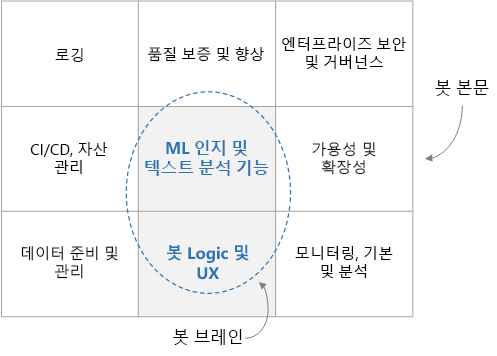

# 엔터프라이즈급 대화형 봇

이 참조 아키텍처는 [Azure Bot Framework][bot-framework]를 사용하는 엔터프라이즈급 대화형 봇(챗봇)을 빌드하는 방법에 대해 설명합니다. 각 봇은 서로 다르지만, 알고 있어야 하는 몇 가지 일반적인 패턴, 워크플로 및 기술이 있습니다. 특히 봇에서 엔터프라이즈 워크로드를 처리하는 경우 핵심 기능 외에도 설계상의 여러 가지 고려 사항이 있습니다. 이 문서에서는 가장 필수적인 설계 측면을 다루며, 강력하고 안전하며 적극적으로 학습하는 봇을 빌드하는 데 필요한 도구를 소개합니다.

[![아키텍처 다이어그램][0]][0]

이 아키텍처에서 사용되는 모범 사례 유틸리티 예제는 완벽히 오픈 소스이며 [GitHub][git-repo-base]에서 제공됩니다. 

## 아키텍처

여기에 표시된 아키텍처에서 사용하는 Azure 서비스는 다음과 같습니다. 사용자 고유의 봇에서 이러한 서비스를 모두 사용할 수 없거나 추가 서비스를 통합할 수 있습니다.

### 봇 논리 및 사용자 환경

- **[BFS][bot-framework-service]**(Bot Framework Service). 봇을 Cortana, Facebook Messenger, Slack과 같은 통신 앱에 연결합니다. 봇과 사용자 간의 통신을 용이하게 합니다.
- **[Azure App Service][app-service]**. 봇 애플리케이션 논리를 호스팅합니다.

### 봇 인지 및 인텔리전스

- **[LUIS][luis]**(Language Understanding). [Azure Cognativity Services][cognitive-services]의 일부인 LUIS를 사용하면 봇에서 사용자 의도와 엔터티를 식별하여 자연어를 인식할 수 있습니다.
- **[Azure Search][search]**. 빠르게 검색할 수 있는 문서 인덱스를 제공하는 관리형 서비스입니다.
- **[QnA Maker][qna-maker]**. QnA Maker는 데이터 위에 대화형 질문 및 답변 레이어를 만드는 클라우드 기반 API 서비스입니다. 일반적으로 FAQ와 같은 반정형 콘텐츠가 로드됩니다. 이 서비스를 사용하여 자연어 질문에 답변하기 위한 기술 자료를 만듭니다.
- **[웹앱][webapp]**. 기존 서비스에서 제공하지 않는 AI 솔루션이 봇에 필요한 경우 사용자 지정 AI를 구현하여 웹앱으로 호스팅할 수 있습니다. 이렇게 하면 봇에서 호출할 수 있는 웹 엔드포인트가 제공됩니다.

### 데이터 수집

봇은 수집하고 준비해야 하는 원시 데이터를 사용합니다. 이 프로세스를 오케스트레이션하려면 다음 옵션 중 하나를 사용하는 것이 좋습니다.

- **[Azure Data Factory][data-factory]**. 데이터 이동 및 데이터 변환을 오케스트레이션하고 자동화합니다.
- **[Logic Apps][logic-apps]**. 애플리케이션, 데이터 및 서비스를 통합하는 워크플로를 작성하기 위한 서버리스 플랫폼입니다. Logic Apps는 Office 365를 포함한 많은 애플리케이션에 대한 데이터 커넥터를 제공합니다.
- **[Azure Functions][functions]**. Azure Functions를 사용하여 [트리거][functions-triggers](예: 문서를 Blob 스토리지 또는 Cosmos DB에 추가할 때마다)에서 호출되는 사용자 지정 서버리스 코드를 작성할 수 있습니다.

### 로깅 및 모니터링

- **[Application Insights][app-insights]**. Application Insights를 사용하여 모니터링, 진단 및 분석 목적으로 봇의 애플리케이션 메트릭을 기록합니다.
- **[Azure Blob Storage][blob]**. Blob Storage는 대량의 비정형 데이터를 저장하도록 최적화되어 있습니다.
- **[Cosmos DB][cosmosdb]**. Cosmos DB는 대화와 같은 반정형 로그 데이터를 저장하는 데 적합합니다.
- **[Power BI][power-bi]**. Power BI를 사용하여 봇에 대한 모니터링 대시보드를 만듭니다.

### 보안 및 거버넌스

- **[Azure AD][aad]**(Azure Active Directory). 사용자가 Azure AD와 같은 ID 공급자를 통해 인증합니다. Bot Service는 인증 흐름과 OAuth 토큰 관리를 처리합니다. [Azure Bot Service를 통해 봇에 인증 추가][bot-authentication]를 참조하세요.
- **[Azure Key Vault][key-vault]**. Key Vault를 사용하여 자격 증명 및 기타 비밀을 저장합니다.

### 품질 보증 및 향상

- **[Azure DevOps][devops]**. 원본 제어, 빌드, 테스트, 배포 및 프로젝트 추적을 포함한 다양한 앱 관리 서비스를 제공합니다.
- **[VS Code][vscode]**. 앱 개발용 간단한 코드 편집기입니다. 비슷한 기능을 갖춘 다른 IDE를 사용할 수 있습니다.

## 디자인 고려 사항

대화형 봇은 더 높은 수준에서 봇 기능("뇌")과 일단의 주변 요구 사항("몸")으로 나눌 수 있습니다. 뇌는 봇 논리와 ML 기능을 포함한 도메인 인식 구성 요소를 포함합니다. 다른 구성 요소는 도메인에 구애받지 않고 CI/CD, 품질 보증 및 보안과 같은 비기능적 요구 사항을 해결합니다.

이 아키텍처의 세부 정보를 살펴보기 전에 먼저 설계의 각 하위 구성 요소를 통한 데이터 흐름부터 시작해 보겠습니다. 데이터 흐름에는 사용자 시작 및 시스템 시작 데이터 흐름이 포함됩니다.

### 사용자 메시지 흐름

**인증**. 사용자는 봇과의 통신 채널에서 제공되는 모든 메커니즘을 사용하여 자신을 인증함으로써 시작합니다. 봇 프레임워크는 Cortana, Microsoft Teams, Facebook Messenger, Kik 및 Slack을 포함한 다양한 통신 채널을 지원합니다. 채널 목록은 [채널에 봇 연결](/azure/bot-service/bot-service-manage-channels)을 참조하세요. Azure Bot Service를 사용하여 봇을 만들면 [웹 채팅][webchat] 채널이 자동으로 구성됩니다. 이 채널을 통해 사용자는 웹 페이지에서 봇과 직접 상호 작용할 수 있습니다. 또한 [직접 회선](/azure/bot-service/bot-service-channel-connect-directline) 채널을 사용하여 봇을 사용자 지정 앱에 연결할 수도 있습니다. 사용자의 ID는 역할 기반 액세스 제어와 맞춤형 콘텐츠를 제공하는 데 사용됩니다.

**사용자 메시지**. 인증되면 사용자는 봇에 메시지를 보냅니다. 봇에서 메시지를 읽고 이를 [LUIS](/azure/cognitive-services/luis/)와 같은 자연어 인식 서비스로 라우팅합니다. 이 단계에서는 **의도**(사용자가 수행하려는 작업)와 **엔터티**(사용자가 관심 있는 항목)를 가져옵니다. 그런 다음, 봇에서 [Azure Search][search](문서 검색용), [QnA Maker](https://www.qnamaker.ai/)(FAQ용) 또는 사용자 지정 기술 자료와 같은 정보를 제공하는 서비스에 전달하는 쿼리를 작성합니다. 봇은 이러한 결과를 사용하여 응답을 생성합니다. 지정된 쿼리에 대한 최상의 결과를 제공하기 위해 봇에서 이러한 원격 서비스를 전후로 여러 번 호출할 수 있습니다.

**응답**. 이 시점에서 봇은 최적의 응답을 결정하여 사용자에게 보냅니다. 가장 일치하는 답변의 신뢰도 점수가 낮으면 응답은 명확성에 대한 질문이거나 봇에서 적절하게 회신할 수 없다는 답신일 수 있습니다.

**로깅** 사용자 요청을 받거나 응답을 보내면 모든 대화 작업이 로깅 저장소에 기록되고 성능 메트릭 및 외부 서비스의 일반적인 오류도 기록되어야 합니다. 이러한 로그는 나중에 문제를 진단하고 시스템을 향상시킬 때 유용합니다.

**피드백**. 또 다른 좋은 방법은 사용자 피드백과 만족도 점수를 수집하는 것입니다. 봇의 최종 응답에 대한 후속 작업으로, 봇에서 사용자가 회신에 대한 자신의 만족도를 평가하도록 요구해야 합니다. 피드백은 자연어 인식에 대한 콜드 시작 문제를 해결하고 응답의 정확도를 지속적으로 향상시키는 데 도움이 될 수 있습니다.

### 시스템 데이터 흐름

**ETL**. 봇은 백 엔드의 ETL 프로세스에서 원시 데이터로부터 추출된 정보와 지식을 사용합니다. 이 데이터는 정형(SQL 데이터베이스), 반정형(CRM 시스템, FAQ) 또는 비정형(Word 문서, PDF, 웹 로그)일 수 있습니다. ETL 하위 시스템에서는 고정된 일정에 따라 데이터를 추출합니다. 콘텐츠는 변환되고 보강된 다음, Cosmos DB 또는 Azure Blob Storage와 같은 중간 데이터 저장소에 로드됩니다.

그런 다음, 중간 저장소의 데이터는 문서 검색을 위해 Azure Search에 인덱싱되고, QnA Maker에 로드되어 질문 및 대답 쌍을 만들거나 비정형 텍스트 처리를 위해 사용자 지정 웹앱에 로드됩니다. 이 데이터는 의도 및 엔터티 추출을 위해 LUIS 모델을 학습하는 데도 사용됩니다.

**품질 보증**. 대화 로그는 버그를 진단 및 수정하고, 봇을 사용하는 방법에 대한 인사이트를 제공하고, 전반적인 성능을 추적하는 데 사용됩니다. 피드백 데이터는 AI 모델을 재학습하여 봇 성능을 향상시키는 데 유용합니다.

## 봇 빌드

한 줄의 코드를 작성하기 전에 기능 사양을 작성해야 하므로 개발 팀은 봇에서 수행할 작업을 명확히 파악하고 있습니다. 사양에는 다양한 기술 자료 도메인에 있는 사용자 입력 및 예상되는 봇 응답에 대한 상당히 포괄적인 목록이 포함되어야 합니다. 생명력 있는 이 문서는 봇을 개발하고 테스트하는 데 있어 매우 유용한 지침이 됩니다.

### 데이터 수집

다음으로, 봇에서 사용자와 지능적으로 상호 작용할 수 있도록 하는 데이터 원본을 식별합니다. 앞에서 설명한 대로 이러한 데이터 원본에는 정형, 반정형 또는 비정형 데이터 세트가 포함될 수 있습니다. 시작할 때 Cosmos DB 또는 Azure Storage와 같은 중앙 저장소에 데이터의 일회성 복사본을 만드는 것이 좋습니다. 진행 중에 이 데이터를 최신 상태로 유지하기 위해 자동화된 데이터 수집 파이프라인을 만들어야 합니다. 자동화된 수집 파이프라인에 대한 옵션에는 Data Factory, Functions 및 Logic Apps가 포함됩니다. 데이터 저장소와 스키마에 따라 이러한 방법을 조합하여 사용할 수 있습니다.

시작할 때 Azure Portal을 사용하여 Azure 리소스를 수동으로 만드는 것이 좋습니다. 나중에 이러한 리소스의 배포를 자동화하는 데 있어 더 많은 요소를 고려해야 합니다.

### 핵심 봇 논리 및 UX

사양과 일부 데이터가 있으면 이제 봇을 실제로 구현할 차례입니다. 핵심 봇 논리에 집중하겠습니다. 이 논리는 라우팅 논리, 명확성 논리 및 로깅을 포함하여 사용자와의 대화를 처리하는 코드입니다. 먼저 다음 항목을 포함하여 [Bot Framework][bot-framework]에 대해 숙지합니다.

- 프레임워크에서 사용되는 기본 개념과 용어(특히 [변환], [턴] 및 [활동])
- 봇과 채널 간의 네트워킹을 처리하는 [Bot 커넥터 서비스](/azure/bot-service/rest-api/bot-framework-rest-connector-quickstart)
- 대화 [상태](/azure/bot-service/bot-builder-concept-state)가 메모리 내 또는 더 효율적으로 저장소(예: Azure Blob Storage 또는 Azure Cosmos DB)에서 유지되는 방법
- [미들웨어](/azure/bot-service/bot-builder-basics#middleware) 및 이를 사용하여 외부 서비스(예: Cognativity Services)와 봇을 후크하는 방법

풍부한 [사용자 환경](/azure/bot-service/bot-service-design-user-experience)에는 여러 가지 옵션이 있습니다.

- [카드](/azure/bot-service/bot-service-design-user-experience#cards)를 사용하여 단추, 이미지, 캐러셀 및 메뉴를 포함할 수 있습니다.
- 봇에서 음성을 지원할 수 있습니다.
- 봇을 앱 또는 웹 사이트에 포함하고 이를 호스팅하는 앱의 기능을 사용할 수도 있습니다.

시작하려면 사용 가능한 C# 및 Node.js 템플릿에서 선택하여 [Azure Bot Service](/azure/bot-service/bot-service-quickstart)를 통해 봇을 온라인으로 빌드할 수 있습니다. 그러나 봇이 점점 정교해짐에 따라 봇을 로컬로 만든 다음, 웹에 배포해야 합니다. Visual Studio 또는 Visual Studio Code와 같은 IDE 및 프로그래밍 언어를 선택합니다. SDK에서 사용할 수 있는 언어는 다음과 같습니다.

- [C#](https://github.com/microsoft/botbuilder-dotnet)
- [JavaScript](https://github.com/microsoft/botbuilder-js)
- [Java](https://github.com/microsoft/botbuilder-java)(미리 보기)
- [Python](https://github.com/microsoft/botbuilder-python)(미리 보기)

시작 지점으로 Azure Bot Service를 사용하여 만든 봇에 대한 소스 코드를 다운로드할 수 있습니다. 또한 간단한 에코 봇에서 다양한 AI 서비스와 통합될 수 있는 더 정교한 봇까지 다양한 [샘플 코드](https://github.com/Microsoft/BotBuilder-Samples/blob/master/README.md)도 찾을 수 있습니다.

### 봇에 스마트 기능 추가

잘 정의된 명령 목록이 있는 간단한 봇의 경우 규칙 기반 접근 방식을 사용하여 정규식을 통해 사용자 입력을 구문 분석할 수 있습니다. 여기에는 결정적이고 이해할 수 있는 이점이 있습니다. 그러나 봇에서 더 향상된 자연어 메시지의 의도와 엔터티를 인식해야 하는 경우 도움이 될 수 있는 AI 서비스가 있습니다.

- LUIS는 사용자 의도와 엔터티를 인식하도록 특별히 설계되었습니다. 관련 [사용자 입력](/azure/cognitive-services/luis/luis-concept-utterance)과 원하는 응답을 적절한 크기로 수집하여 학습하면 사용자가 지정한 메시지에 대한 의도와 엔터티가 반환됩니다.

- Azure Search는 LUIS와 함께 사용할 수 있습니다. Search를 사용하면 모든 관련 데이터에 대해 검색 가능한 인덱스를 만들 수 있습니다. 봇은 LUIS에서 추출한 엔터티에 대해 이러한 인덱스를 쿼리합니다. 또한 Azure Search는 [동의어][synonyms]를 지원하여 올바른 단어 매핑의 범위를 확장할 수 있습니다.

- QnA Maker는 지정된 질문에 대한 답변을 반환하도록 설계된 또 다른 서비스입니다. 일반적으로 FAQ와 같은 반정형 데이터를 학습합니다.

봇은 다른 AI 서비스를 사용하여 사용자 환경을 더욱 풍부하게 강화할 수 있습니다. [미리 빌드된 AI 서비스의 Cognitive Services 제품군](https://azure.microsoft.com/en-us/services/cognitive-services/?v=18.44a)(LUIS 및 QnA Maker 포함)에는 비전, 음성, 언어, 검색 및 위치 서비스가 있습니다. 언어 번역, 맞춤법 검사, 감정 분석, OCR, 위치 인식 및 콘텐츠 조정과 같은 기능을 빠르게 추가할 수 있습니다. 이러한 서비스는 미들웨어 모듈로 봇에 연결되어 더 자연스럽고 지능적으로 사용자와 상호 작용할 수 있습니다.

또 다른 옵션은 사용자 고유의 사용자 지정 AI 서비스를 통합하는 것입니다. 이 방법은 더 복잡하지만 기계 학습 알고리즘, 학습 및 모델 측면에서 완벽한 유연성을 제공합니다. 예를 들어 [LDA][lda]와 같은 사용자 고유의 토픽 모델링 및 알고리즘을 구현하여 비슷하거나 관련된 문서를 찾을 수 있습니다. 사용자 지정 AI 솔루션을 웹 서비스 엔드포인트로 공개하고 핵심 봇 논리에서 엔드포인트를 호출하는 것이 좋습니다. 웹 서비스는 App Service 또는 VM 클러스터에서 호스팅할 수 있습니다. [Azure Machine Learning][aml]은 모델 [ 학습](https://github.com/Azure/MachineLearningNotebooks/tree/master/how-to-use-azureml/training) 및 [배포](https://github.com/Azure/MachineLearningNotebooks/tree/master/how-to-use-azureml/deployment)에서 지원하는 다양한 서비스와 라이브러리를 제공합니다.

## 품질 보증 및 향상

**로깅** 기본 성능 메트릭 및 오류를 포함하여 봇과의 사용자 대화를 기록합니다. 이러한 로그는 문제를 디버그하고, 사용자 상호 작용을 이해하고, 시스템을 향상시키는 데 매우 유용한 것으로 입증됩니다. 서로 다른 데이터 저장소가 서로 다른 유형의 로그에 적합할 수 있습니다. 예를 들어 웹 로그에는 Application Insights, 대화에는 Cosmos DB, 큰 페이로드에는 Azure Storage를 사용하는 것이 좋습니다. [Azure Storage에 직접 작성][transcript-storage]을 참조하세요.

**피드백**. 사용자가 봇 상호 작용에 대한 자신의 만족도를 파악하는 것도 중요합니다. 사용자 피드백에 대한 기록이 있는 경우 이 데이터를 사용하여 특정 상호 작용을 향상시키고 성능 향상을 위해 AI 모델을 재학습하는 데 집중할 수 있습니다. 피드백을 사용하여 시스템에서 LUIS와 같은 모델을 재학습합니다.

**테스트**. 봇 테스트에는 단위 테스트, 통합 테스트, 재발 테스트 및 기능 테스트가 있습니다. 테스트를 위해 Azure Search 또는 QnA Maker와 같은 외부 서비스의 실제 HTTP 응답을 기록하여 단위 테스트 중에 외부 서비스에 대한 실제 네트워크를 호출하지 않고도 재생할 수 있도록 하는 것이 좋습니다.

>[!NOTE]
> 개발을 이러한 영역에 연결하여 시작하려면 [JavaScript용 Botbuilder 유틸리티][git-repo-base]를 살펴보세요. 이 리포지토리에는 [Microsoft Bot Framework v4][bot-framework]를 사용하여 빌드하고 Node.js를 실행하는 봇용 유틸리티 코드 샘플이 포함되어 있습니다. 포함된 패키지는 다음과 같습니다.
>
> - [Cosmos DB 로깅 저장소][cosmosdb-logger]. Cosmos DB에서 봇 로그를 저장하고 쿼리하는 방법을 보여줍니다.
> - [Application Insights 로깅 저장소][appinsights-logger]. Application Insights에서 봇 로그를 저장하고 쿼리하는 방법을 보여줍니다.
> - [피드백 컬렉션 미들웨어][feedback-util]. 봇 사용자 피드백 요청 메커니즘을 제공하는 미들웨어 샘플입니다.
> - [Http 테스트 레코더][testing util]. 외부 서비스에서 봇으로의 HTTP 트래픽을 기록합니다. LUIS, Azure Search 및 QnAMaker에 대한 지원으로 미리 빌드되어 제공되지만, 모든 서비스를 지원하기 위해 확장을 사용할 수 있습니다. 봇 테스트를 자동화하는 데 유용합니다.
>
> 이러한 패키지는 유틸리티 코드 샘플로 제공되며, 지원 또는 업데이트는 보장하지 않습니다.

## 가용성 고려 사항

새로운 기능이나 버그 수정을 봇에 롤아웃하는 경우 준비 및 프로덕션과 같은 여러 배포 환경을 사용하는 것이 가장 좋습니다. [Azure DevOps][devops]의 배포 [슬롯][slots]을 사용하면 가동 중지 없이 이 작업을 수행할 수 있습니다. 프로덕션 환경으로 전환하기 전에 준비 환경에서 최신 업그레이드를 테스트할 수 있습니다. 부하를 처리하는 측면에서 App Service는 수동 또는 자동으로 강화하거나 확장할 수 있도록 설계되었습니다. 봇이 Microsoft의 글로벌 데이터 센터 인프라에서 호스팅되므로 App Service SLA는 고가용성을 보장합니다.

## 보안 고려 사항

다른 애플리케이션과 마찬가지로 봇은 중요한 데이터를 처리하도록 설계될 수 있습니다. 따라서 로그인할 수 있는 사용자와 봇을 사용할 수 있는 사용자를 제한합니다. 또한 사용자의 ID 또는 역할에 따라 액세스할 수 있는 데이터를 제한합니다. Azure AD를 사용하여 ID와 액세스를 제어하고, Key Vault를 사용하여 키와 비밀을 관리합니다.

## 관리 효율성 고려 사항

### 모니터링 및 보고

봇이 프로덕션 환경에서 실행되는 경우 이러한 방식으로 해당 봇을 유지하려면 DevOps 팀이 필요합니다. 시스템을 지속적으로 모니터링하여 봇이 최고 성능으로 작동하는지 확인합니다. Application Insights 또는 Cosmos DB에 보낸 로그를 사용하여 Application Insights 자체, Power BI 또는 사용자 지정 웹앱 대시보드를 사용하는 모니터링 대시보드를 만듭니다. 심각한 오류가 발생하거나 성능이 허용되는 임계값 미만으로 떨어지는 DevOps 팀에 경고를 보냅니다.

### 자동화된 리소스 배포

봇 자체는 최신 데이터를 제공하고 적절한 작동을 보장하는 더 큰 시스템의 일부일 뿐입니다. 이러한 다른 모든 Azure 리소스(Data Factory와 같은 데이터 오케스트레이션 서비스, Cosmos DB와 같은 스토리지 서비스 등)를 모두 배포해야 합니다. Azure Resource Manager는 Azure Portal, PowerShell 또는 Azure CLI를 통해 액세스할 수 있는 일관된 관리 계층을 제공합니다. 속도와 일관성을 위해 이러한 방법 중 하나를 사용하여 배포를 자동화하는 것이 가장 좋습니다.

### 지속적인 봇 배포

봇 논리는 IDE 또는 명령줄(예: Azure CLI)에서 직접 배포할 수 있습니다. 그러나 봇이 성장함에 따라 [지속적인 배포 설정](/azure/bot-service/bot-service-build-continuous-deployment) 문서에서 설명한 대로 Azure DevOps와 같은 CI/CD 솔루션을 사용하여 지속적인 배포 프로세스를 사용하는 것이 가장 좋습니다. 이는 가까운 프로덕션 환경에서 새로운 기능과 수정을 테스트할 때의 마찰을 완화할 수 있는 좋은 방법입니다. 또한 일반적으로 적어도 준비 및 프로덕션 환경과 같이 여러 배포 환경을 갖추는 것도 좋습니다. Azure DevOps는 이 방법을 지원합니다.

<!-- links -->

[0]: ./_images/conversational-bot.png
[aad]: /azure/active-directory/
[활동]: /azure/bot-service/rest-api/bot-framework-rest-connector-activities
[aml]: /azure/machine-learning/service/
[app-insights]: /azure/azure-monitor/app/app-insights-overview
[app-service]: /azure/app-service/
[blob]: /azure/storage/blobs/storage-blobs-introduction
[bot-authentication]: /azure/bot-service/bot-builder-authentication
[bot-framework]: https://dev.botframework.com/
[bot-framework-service]: /azure/bot-service/bot-builder-basics
[cognitive-services]: /azure/cognitive-services/welcome
[변환]: /azure/bot-service/bot-service-design-conversation-flow
[cosmosdb]: /azure/cosmos-db/
[data-factory]: /azure/data-factory/
[data-factory-ref-arch]: ../data/enterprise-bi-adf.md
[devops]: https://azure.microsoft.com/solutions/devops/
[functions]: /azure/azure-functions/
[functions-triggers]: /azure/azure-functions/functions-triggers-bindings
[git-repo-appinsights-logger]: https://github.com/Microsoft/botbuilder-utils-js/tree/master/packages/botbuilder-transcript-app-insights
[git-repo-base]: https://github.com/Microsoft/botbuilder-utils-js
[git-repo-cosmosdb-logger]: https://github.com/Microsoft/botbuilder-utils-js/tree/master/packages/botbuilder-transcript-cosmosdb
[git-repo-feedback-util]: https://github.com/Microsoft/botbuilder-utils-js/tree/master/packages/botbuilder-feedback
[git-repo-testing-util]: https://github.com/Microsoft/botbuilder-utils-js/tree/master/packages/botbuilder-http-test-recorder
[testing-util]: https://github.com/Microsoft/botbuilder-utils-js/tree/master/packages/botbuilder-http-test-recorder
[key-vault]: /azure/key-vault/
[lda]: https://wikipedia.org/wiki/Latent_Dirichlet_allocation/
[logic-apps]: /azure/logic-apps/logic-apps-overview
[luis]: /azure/cognitive-services/luis/
[power-bi]: /power-bi/
[qna-maker]: /azure/cognitive-services/QnAMaker/
[search]: /azure/search/
[slots]: /azure/app-service/deploy-staging-slots/
[synonyms]: /azure/search/search-synonyms
[transcript-storage]: /azure/bot-service/bot-builder-howto-v4-storage
[턴]: /azure/bot-service/bot-builder-basics#defining-a-turn
[vscode]: https://azure.microsoft.com/products/visual-studio-code/
[webapp]: /azure/app-service/overview
[webchat]: /azure/bot-service/bot-service-channel-connect-webchat?view=azure-bot-service-4.0/

[cosmosdb-logger]: https://github.com/Microsoft/botbuilder-utils-js/tree/master/packages/botbuilder-transcript-cosmosdb
[appinsights-logger]: https://github.com/Microsoft/botbuilder-utils-js/tree/master/packages/botbuilder-transcript-app-insights
[feedback-util]: https://github.com/Microsoft/botbuilder-utils-js/tree/master/packages/botbuilder-feedback
[testing util]: https://github.com/Microsoft/botbuilder-utils-js/tree/master/packages/botbuilder-http-test-recorder

