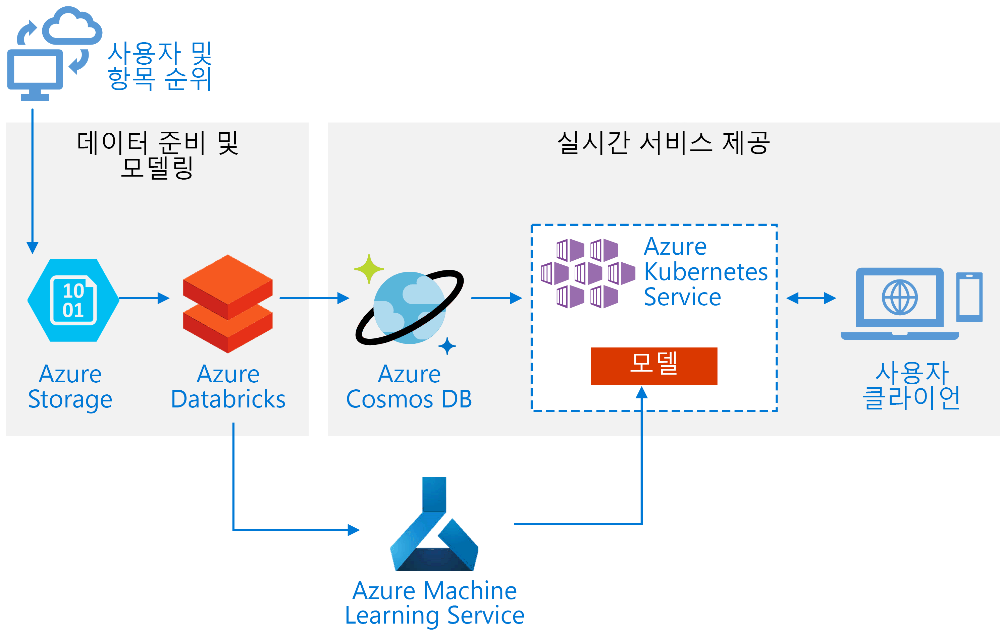
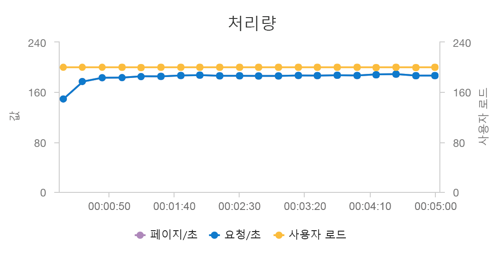

# <a name="build-a-real-time-recommendation-api-on-azure"></a><span data-ttu-id="7c21c-103">Azure에서 실시간 추천 API 빌드</span><span class="sxs-lookup"><span data-stu-id="7c21c-103">Build a real-time recommendation API on Azure</span></span>

<span data-ttu-id="7c21c-104">이 참조 아키텍처에서는 Azure Databricks를 사용하여 추천 모델을 학습시키고 Azure Cosmos DB, Azure Machine Learning, Azure Kubernetes Service(AKS)를 사용하여 API로 배포하는 방법을 보여줍니다.</span><span class="sxs-lookup"><span data-stu-id="7c21c-104">This reference architecture shows how to train a recommendation model using Azure Databricks and deploy it as an API by using Azure Cosmos DB, Azure Machine Learning, and Azure Kubernetes Service (AKS).</span></span> <span data-ttu-id="7c21c-105">이 아키텍처는 제품, 동영상, 뉴스 추천 등 대부분의 추천 엔진 시나리오에 맞게 일반화할 수 있습니다.</span><span class="sxs-lookup"><span data-stu-id="7c21c-105">This architecture can be generalized for most recommendation engine scenarios, including recommendations for products, movies, and news.</span></span>

<span data-ttu-id="7c21c-106">이 아키텍처에 대한 참조 구현은 [GitHub](https://github.com/Microsoft/Recommenders/blob/master/notebooks/05_operationalize/als_movie_o16n.ipynb)에서 사용할 수 있습니다.</span><span class="sxs-lookup"><span data-stu-id="7c21c-106">A reference implementation for this architecture is available on [GitHub](https://github.com/Microsoft/Recommenders/blob/master/notebooks/05_operationalize/als_movie_o16n.ipynb).</span></span>



<span data-ttu-id="7c21c-108">**시나리오**: 한 미디어 조직에서 사용자에게 동영상 추천을 제공하려고 합니다.</span><span class="sxs-lookup"><span data-stu-id="7c21c-108">**Scenario**: A media organization wants to provide movie or video recommendations to its users.</span></span> <span data-ttu-id="7c21c-109">이 조직에서는 개인 맞춤형 추천을 제공하여 클릭률 증가, 사이트 참여 증가, 사용자 만족도 증가를 포함한 몇 가지 비즈니스 목표를 충족합니다.</span><span class="sxs-lookup"><span data-stu-id="7c21c-109">By providing personalized recommendations, the organization meets several business goals, including increased click-through rates, increased engagement on site, and higher user satisfaction.</span></span>

<span data-ttu-id="7c21c-110">이 참조 아키텍처는 특정 사용자에게 상위 10개의 동영상 추천을 제공할 수 있는 실시간 추천 서비스 API를 학습시키고 배포하는 데 사용됩니다.</span><span class="sxs-lookup"><span data-stu-id="7c21c-110">This reference architecture is for training and deploying a real-time recommender service API that can provide the top 10 movie recommendations for a given user.</span></span>

<span data-ttu-id="7c21c-111">이 추천 모델의 데이터 흐름은 다음과 같습니다.</span><span class="sxs-lookup"><span data-stu-id="7c21c-111">The data flow for this recommendation model is as follows:</span></span>

1. <span data-ttu-id="7c21c-112">사용자 동작을 추적합니다.</span><span class="sxs-lookup"><span data-stu-id="7c21c-112">Track user behaviors.</span></span> <span data-ttu-id="7c21c-113">예를 들어, 사용자가 동영상을 평가하거나 제품 또는 뉴스 기사를 클릭할 때 백 엔드 서비스가 이를 기록할 수 있습니다.</span><span class="sxs-lookup"><span data-stu-id="7c21c-113">For example, a backend service might log when a user rates a movie or clicks a product or news article.</span></span>

2. <span data-ttu-id="7c21c-114">사용 가능한 [데이터 원본][data-source]에서 Azure Databricks로 데이터를 로드합니다.</span><span class="sxs-lookup"><span data-stu-id="7c21c-114">Load the data into Azure Databricks from an available [data source][data-source].</span></span>

3. <span data-ttu-id="7c21c-115">데이터를 준비하고 학습 및 테스트 집합으로 분할하여 모델을 학습시킵니다.</span><span class="sxs-lookup"><span data-stu-id="7c21c-115">Prepare the data and split it into training and testing sets to train the model.</span></span> <span data-ttu-id="7c21c-116">([이 가이드][guide]에서는 데이터 분할 옵션을 설명합니다.)</span><span class="sxs-lookup"><span data-stu-id="7c21c-116">([This guide][guide] describes options for splitting data.)</span></span>

4. <span data-ttu-id="7c21c-117">[Spark Collaborative Filtering][als] 모델을 데이터에 맞춥니다.</span><span class="sxs-lookup"><span data-stu-id="7c21c-117">Fit the [Spark Collaborative Filtering][als] model to the data.</span></span>

5. <span data-ttu-id="7c21c-118">등급 및 순위 메트릭을 사용하여 모델의 품질을 평가합니다.</span><span class="sxs-lookup"><span data-stu-id="7c21c-118">Evaluate the quality of the model using rating and ranking metrics.</span></span> <span data-ttu-id="7c21c-119">([이 가이드][eval-guide]에서는 추천 시스템을 평가하는 데 기준으로 사용할 수 있는 메트릭에 대한 세부 정보를 제공합니다.)</span><span class="sxs-lookup"><span data-stu-id="7c21c-119">([This guide][eval-guide] provides details about the metrics you can evaluate your recommender on.)</span></span>

6. <span data-ttu-id="7c21c-120">사용자별 상위 10개 추천 항목을 미리 계산하고 Azure Cosmos DB에 캐시로 저장합니다.</span><span class="sxs-lookup"><span data-stu-id="7c21c-120">Precompute the top 10 recommendations per user and store as a cache in Azure Cosmos DB.</span></span>

7. <span data-ttu-id="7c21c-121">API를 컨테이너화하고 배포하는 Azure Machine Learning API를 사용하여 AKS에 API 서비스를 배포합니다.</span><span class="sxs-lookup"><span data-stu-id="7c21c-121">Deploy an API service to AKS using the Azure Machine Learning APIs to containerize and deploy the API.</span></span>

8. <span data-ttu-id="7c21c-122">백 엔드 서비스가 사용자로부터 요청을 받으면 AKS에서 호스팅되는 추천 API를 호출하여 상위 10개 추천 항목을 가져와 사용자에게 표시하세요.</span><span class="sxs-lookup"><span data-stu-id="7c21c-122">When the backend service gets a request from a user, call the recommendations API hosted in AKS to get the top 10 recommendations and display them to the user.</span></span>

## <a name="architecture"></a><span data-ttu-id="7c21c-123">아키텍처</span><span class="sxs-lookup"><span data-stu-id="7c21c-123">Architecture</span></span>

<span data-ttu-id="7c21c-124">이 아키텍처는 다음과 같은 구성 요소로 구성됩니다.</span><span class="sxs-lookup"><span data-stu-id="7c21c-124">This architecture consists of the following components:</span></span>

<span data-ttu-id="7c21c-125">[Azure Databricks][databricks].</span><span class="sxs-lookup"><span data-stu-id="7c21c-125">[Azure Databricks][databricks].</span></span> <span data-ttu-id="7c21c-126">Databricks는 입력 데이터를 준비하고 추천 모델에게 Spark 클러스터를 학습시키는 데 사용되는 개발 환경입니다.</span><span class="sxs-lookup"><span data-stu-id="7c21c-126">Databricks is a development environment used to prepare input data and train the recommender model on a Spark cluster.</span></span> <span data-ttu-id="7c21c-127">Azure Databricks는 또한 데이터 처리 또는 기계 학습 작업을 위해 노트북에서 실행하고 공동 작업을 수행할 수 있는 대화형 작업 영역을 제공합니다.</span><span class="sxs-lookup"><span data-stu-id="7c21c-127">Azure Databricks also provides an interactive workspace to run and collaborate on notebooks for any data processing or machine learning tasks.</span></span>

<span data-ttu-id="7c21c-128">[Azure Kubernetes Service][aks](AKS).</span><span class="sxs-lookup"><span data-stu-id="7c21c-128">[Azure Kubernetes Service][aks] (AKS).</span></span> <span data-ttu-id="7c21c-129">AKS는 Kubernetes 클러스터에서 기계 학습 모델 서비스 API를 배포하고 운영하는 데 사용됩니다.</span><span class="sxs-lookup"><span data-stu-id="7c21c-129">AKS is used to deploy and operationalize a machine learning model service API on a Kubernetes cluster.</span></span> <span data-ttu-id="7c21c-130">AKS는 컨테이너화된 모델을 호스팅하고, 처리량 요구 사항에 맞는 확장성, ID 및 액세스 관리, 로깅 및 상태 모니터링을 제공합니다.</span><span class="sxs-lookup"><span data-stu-id="7c21c-130">AKS hosts the containerized model, providing scalability that meets your throughput requirements, identity and access management, and logging and health monitoring.</span></span>

<span data-ttu-id="7c21c-131">[Azure Cosmos DB][cosmosdb].</span><span class="sxs-lookup"><span data-stu-id="7c21c-131">[Azure Cosmos DB][cosmosdb].</span></span> <span data-ttu-id="7c21c-132">Cosmos DB는 각 사용자를 위한 상위 10개 추천 동영상을 저장하는 데 사용되는 글로벌 분산 데이터베이스 서비스입니다.</span><span class="sxs-lookup"><span data-stu-id="7c21c-132">Cosmos DB is a globally distributed database service used to store the top 10 recommended movies for each user.</span></span> <span data-ttu-id="7c21c-133">Azure Cosmos DB는 특정 사용자를 위한 상위 추천 항목을 읽을 때 대기 시간이 짧으므로(99%의 확률로 10ms) 이러한 시나리오에 매우 적합합니다.</span><span class="sxs-lookup"><span data-stu-id="7c21c-133">Azure Cosmos DB is well-suited for this scenario, because it provides low latency (10 ms at 99th percentile) to read the top recommended items for a given user.</span></span>

<span data-ttu-id="7c21c-134">[Azure Machine Learning Service][mls].</span><span class="sxs-lookup"><span data-stu-id="7c21c-134">[Azure Machine Learning Service][mls].</span></span> <span data-ttu-id="7c21c-135">이 서비스는 기계 학습 모델을 추적 및 관리하고, 이러한 모델을 패키징하여 확장 가능한 AKS 환경에 배포하는 데 사용됩니다.</span><span class="sxs-lookup"><span data-stu-id="7c21c-135">This service is used to track and manage machine learning models, and then package and deploy these models to a scalable AKS environment.</span></span>

<span data-ttu-id="7c21c-136">[Microsoft 추천 시스템][github].</span><span class="sxs-lookup"><span data-stu-id="7c21c-136">[Microsoft Recommenders][github].</span></span> <span data-ttu-id="7c21c-137">이 오픈 소스 리포지토리에는 사용자가 추천 시스템 빌드, 평가, 운영을 시작하는 데 도움이 되는 유틸리티 코드와 샘플이 포함되어 있습니다.</span><span class="sxs-lookup"><span data-stu-id="7c21c-137">This open-source repository contains utility code and samples to help users get started in building, evaluating, and operationalizing a recommender system.</span></span>

## <a name="performance-considerations"></a><span data-ttu-id="7c21c-138">성능 고려 사항</span><span class="sxs-lookup"><span data-stu-id="7c21c-138">Performance considerations</span></span>

<span data-ttu-id="7c21c-139">실시간 추천 항목에서 성능은 주된 고려 사항입니다. 추천 항목은 일반적으로 사용자가 사이트에서 수행하는 요청의 중요 경로에 속하기 때문입니다.</span><span class="sxs-lookup"><span data-stu-id="7c21c-139">Performance is a primary consideration for real-time recommendations, because recommendations usually fall in the critical path of the request a user makes on your site.</span></span>

<span data-ttu-id="7c21c-140">AKS와 Azure Cosmos DB의 조합은 이러한 아키텍처가 최소한의 오버헤드로 중간 규모 워크로드에 추천 항목을 제공하는 데 좋은 시작점이 되도록 합니다.</span><span class="sxs-lookup"><span data-stu-id="7c21c-140">The combination of AKS and Azure Cosmos DB enables this architecture to provide a good starting point to provide recommendations for a medium-sized workload with minimal overhead.</span></span> <span data-ttu-id="7c21c-141">동시 사용자가 200명인 부하 테스트에서 이 아키텍처는 약 60ms의 평균 대기 시간으로 추천 항목을 제공하고, 초당 180개 요청을 처리할 수 있습니다.</span><span class="sxs-lookup"><span data-stu-id="7c21c-141">Under a load test with 200 concurrent users, this architecture provides recommendations at a median latency of about 60 ms and performs at a throughput of 180 requests per second.</span></span> <span data-ttu-id="7c21c-142">이 부하 테스트는 기본 배포 구성(Azure Cosmos DB용으로 프로비전된 vCPU 12개, 메모리 42GB, [초당 요청 단위(RU)][ru] 11,000개를 지원하는 D3 v2 AKS 클러스터 3개)을 대상으로 실행되었습니다.</span><span class="sxs-lookup"><span data-stu-id="7c21c-142">The load test was run against the default deployment configuration (a 3x D3 v2 AKS cluster with 12 vCPUs, 42 GB of memory, and 11,000 [Request Units (RUs) per second][ru] provisioned for Azure Cosmos DB).</span></span>




<span data-ttu-id="7c21c-145">Azure Cosmos DB는 턴키 글로벌 배포 및 앱의 모든 데이터베이스 요구 사항을 충족하는 유용성 때문에 권장됩니다.</span><span class="sxs-lookup"><span data-stu-id="7c21c-145">Azure Cosmos DB is recommended for its turnkey global distribution and usefulness in meeting any database requirements your app has.</span></span> <span data-ttu-id="7c21c-146">약간 [더 짧은 대기 시간][latency]이 필요할 경우 Azure Cosmos DB를 사용하여 조회 기능을 제공하는 대신 [Azure Redis Cache][redis]를 사용하는 것이 좋습니다.</span><span class="sxs-lookup"><span data-stu-id="7c21c-146">For slightly [faster latency][latency], consider using [Azure Redis Cache][redis] instead of Azure Cosmos DB to serve lookups.</span></span> <span data-ttu-id="7c21c-147">Redis Cache는 백 엔드 저장소의 데이터에 크게 의존하는 시스템의 성능을 개선할 수 있습니다.</span><span class="sxs-lookup"><span data-stu-id="7c21c-147">Redis Cache can improve performance of systems that rely highly on data in back-end stores.</span></span>

## <a name="scalability-considerations"></a><span data-ttu-id="7c21c-148">확장성 고려 사항</span><span class="sxs-lookup"><span data-stu-id="7c21c-148">Scalability considerations</span></span>

<span data-ttu-id="7c21c-149">Spark를 사용할 계획이 없거나 분산이 필요 없는 소규모 워크로드를 보유하고 있을 경우 Azure Databricks 대신 [Data Science Virtual Machine][dsvm](DSVM)을 사용하는 것이 좋습니다.</span><span class="sxs-lookup"><span data-stu-id="7c21c-149">If you don't plan to use Spark, or you have a smaller workload where you don't need distribution, consider using [Data Science Virtual Machine][dsvm] (DSVM) instead of Azure Databricks.</span></span> <span data-ttu-id="7c21c-150">DSVM은 기계 학습 및 데이터 과학을 위한 딥 러닝 프레임워크 및 도구를 사용하는 Azure 가상 머신입니다.</span><span class="sxs-lookup"><span data-stu-id="7c21c-150">DSVM is an Azure virtual machine with deep learning frameworks and tools for machine learning and data science.</span></span> <span data-ttu-id="7c21c-151">Azure Databricks와 마찬가지로 DSVM에서 만든 모델도 Azure Machine Learning을 통해 AKS에서 서비스로 운영할 수 있습니다.</span><span class="sxs-lookup"><span data-stu-id="7c21c-151">As with Azure Databricks, any model you create in a DSVM can be operationalized as a service on AKS via Azure Machine Learning.</span></span>

<span data-ttu-id="7c21c-152">학습 중에는 Azure Databricks에 대규모 고정 크기의 Spark 클러스터를 프로비전하거나 [자동 확장][autoscaling]을 구성합니다.</span><span class="sxs-lookup"><span data-stu-id="7c21c-152">During training, provision a larger fixed-size Spark cluster in Azure Databricks or configure [autoscaling][autoscaling].</span></span> <span data-ttu-id="7c21c-153">자동 크기 조정을 사용할 경우 Databricks가 클러스터의 부하를 모니터링하고 필요 시 규모를 확장하거나 축소합니다.</span><span class="sxs-lookup"><span data-stu-id="7c21c-153">When autoscaling is enabled, Databricks monitors the load on your cluster and scales up and downs when required.</span></span> <span data-ttu-id="7c21c-154">대규모의 데이터가 있고 데이터 준비나 모델링 작업에 걸리는 시간을 줄이려는 경우 대규모 클러스터를 프로비전하거나 확장하세요.</span><span class="sxs-lookup"><span data-stu-id="7c21c-154">Provision or scale out a larger cluster if you have a large data size and you want to reduce the amount of time it takes for data preparation or modeling tasks.</span></span>

<span data-ttu-id="7c21c-155">성능 및 처리량 요구 사항에 맞게 AKS 클러스터를 확장하세요.</span><span class="sxs-lookup"><span data-stu-id="7c21c-155">Scale the AKS cluster to meet your performance and throughput requirements.</span></span> <span data-ttu-id="7c21c-156">클러스터를 완전히 활용할 수 있게 [Pod][scale] 수를 확장하고, 서비스의 필요에 맞게 클러스터의 [노드][nodes]를 확장하도록 유의하세요.</span><span class="sxs-lookup"><span data-stu-id="7c21c-156">Take care to scale up the number of [pods][scale] to fully utilize the cluster, and to scale the [nodes][nodes] of the cluster to meet the demand of your service.</span></span> <span data-ttu-id="7c21c-157">추천 시스템 서비스의 성능 및 처리량 요구 사항에 맞게 클러스터를 확장하는 방법에 대한 자세한 내용은 [Azure Container Service 카탈로그 확장][blog]을 참조하세요.</span><span class="sxs-lookup"><span data-stu-id="7c21c-157">For more information on how to scale your cluster to meet the performance and throughput requirements of your recommender service, see [Scaling Azure Container Service Clusters][blog].</span></span>

<span data-ttu-id="7c21c-158">Azure Cosmos DB 성능을 관리하려면 초당 필요한 읽기 수를 측정하고, 필요한 [초당 RU][ru] 수(처리량)를 프로비전하세요.</span><span class="sxs-lookup"><span data-stu-id="7c21c-158">To manage Azure Cosmos DB performance, estimate the number of reads required per second, and provision the number of [RUs per second][ru] (throughput) needed.</span></span> <span data-ttu-id="7c21c-159">[분할 및 수평 확장][partition-data]에 대한 모범 사례를 따르세요.</span><span class="sxs-lookup"><span data-stu-id="7c21c-159">Use best practices for [partitioning and horizontal scaling][partition-data].</span></span>

## <a name="cost-considerations"></a><span data-ttu-id="7c21c-160">비용 고려 사항</span><span class="sxs-lookup"><span data-stu-id="7c21c-160">Cost considerations</span></span>

<span data-ttu-id="7c21c-161">이 시나리오의 주요 비용 동인은 다음과 같습니다.</span><span class="sxs-lookup"><span data-stu-id="7c21c-161">The main drivers of cost in this scenario are:</span></span>

- <span data-ttu-id="7c21c-162">학습에 필요한 Azure Databricks 클러스터 크기.</span><span class="sxs-lookup"><span data-stu-id="7c21c-162">The Azure Databricks cluster size required for training.</span></span>
- <span data-ttu-id="7c21c-163">성능 요구 사항을 충족하는 데 필요한 AKS 클러스터 크기.</span><span class="sxs-lookup"><span data-stu-id="7c21c-163">The AKS cluster size required to meet your performance requirements.</span></span>
- <span data-ttu-id="7c21c-164">성능 요구 사항에 맞게 프로비전된 Azure Cosmos DB RU.</span><span class="sxs-lookup"><span data-stu-id="7c21c-164">Azure Cosmos DB RUs provisioned to meet your performance requirements.</span></span>

<span data-ttu-id="7c21c-165">Spark 클러스터를 사용하지 않을 때 자주 재학습시키지 않고 끄는 방법으로 Azure Databricks 비용을 관리하세요.</span><span class="sxs-lookup"><span data-stu-id="7c21c-165">Manage the Azure Databricks costs by retraining less frequently and turning off the Spark cluster when not in use.</span></span> <span data-ttu-id="7c21c-166">AKS 및 Azure Cosmos DB 비용은 사이트의 처리량 및 성능 요구 사항과 관련이 있으며, 사이트로 들어오는 트래픽의 양에 따라 확장 및 축소됩니다.</span><span class="sxs-lookup"><span data-stu-id="7c21c-166">The AKS and Azure Cosmos DB costs are tied to the throughput and performance required by your site and will scale up and down depending on the volume of traffic to your site.</span></span>

## <a name="deploy-the-solution"></a><span data-ttu-id="7c21c-167">솔루션 배포</span><span class="sxs-lookup"><span data-stu-id="7c21c-167">Deploy the solution</span></span>

<span data-ttu-id="7c21c-168">이 아키텍처를 배포하려면 먼저 Azure Databricks 환경을 만들어 데이터를 준비하고 추천 시스템 모델을 학습시키세요.</span><span class="sxs-lookup"><span data-stu-id="7c21c-168">To deploy this architecture, first create an Azure Databricks environment to prepare data and train a recommender model:</span></span>

1. <span data-ttu-id="7c21c-169">[Azure Databricks 작업 영역][workspace]을 만듭니다.</span><span class="sxs-lookup"><span data-stu-id="7c21c-169">Create an [Azure Databricks workspace][workspace].</span></span>

2. <span data-ttu-id="7c21c-170">Azure Databricks에 새 클러스터를 만듭니다.</span><span class="sxs-lookup"><span data-stu-id="7c21c-170">Create a new cluster in Azure Databricks.</span></span> <span data-ttu-id="7c21c-171">다음과 같은 구성이 필요합니다.</span><span class="sxs-lookup"><span data-stu-id="7c21c-171">The following configuration is required:</span></span>

    - <span data-ttu-id="7c21c-172">클러스터 모드: Standard</span><span class="sxs-lookup"><span data-stu-id="7c21c-172">Cluster mode: Standard</span></span>
    - <span data-ttu-id="7c21c-173">Databricks 런타임 버전: 4.1(Apache Spark 2.3.0, Scala 2.11 포함)</span><span class="sxs-lookup"><span data-stu-id="7c21c-173">Databricks Runtime Version: 4.1 (includes Apache Spark 2.3.0, Scala 2.11)</span></span>
    - <span data-ttu-id="7c21c-174">Python 버전: 3</span><span class="sxs-lookup"><span data-stu-id="7c21c-174">Python Version: 3</span></span>
    - <span data-ttu-id="7c21c-175">드라이버 유형: 표준\_DS3\_v2</span><span class="sxs-lookup"><span data-stu-id="7c21c-175">Driver Type: Standard\_DS3\_v2</span></span>
    - <span data-ttu-id="7c21c-176">작업자 유형: 표준\_DS3\_v2(필요에 따라 최소 및 최대 구성)</span><span class="sxs-lookup"><span data-stu-id="7c21c-176">Worker Type: Standard\_DS3\_v2 (min and max as required)</span></span>
    - <span data-ttu-id="7c21c-177">자동 종료: (필요 시)</span><span class="sxs-lookup"><span data-stu-id="7c21c-177">Auto Termination: (as required)</span></span>
    - <span data-ttu-id="7c21c-178">Spark 구성: (필요 시)</span><span class="sxs-lookup"><span data-stu-id="7c21c-178">Spark Config: (as required)</span></span>
    - <span data-ttu-id="7c21c-179">환경 변수: (필요 시)</span><span class="sxs-lookup"><span data-stu-id="7c21c-179">Environment Variables: (as required)</span></span>

3. <span data-ttu-id="7c21c-180">로컬 컴퓨터에 [Microsoft 추천 시스템][github] 리포지토리를 복제합니다.</span><span class="sxs-lookup"><span data-stu-id="7c21c-180">Clone the [Microsoft Recommenders][github] repository on your local computer.</span></span>

4. <span data-ttu-id="7c21c-181">추천 시스템 폴더 안에 콘텐츠의 압축을 풉니다.</span><span class="sxs-lookup"><span data-stu-id="7c21c-181">Zip the content inside the Recommenders folder:</span></span>

    ```console
    cd Recommenders
    zip -r Recommenders.zip
    ```

5. <span data-ttu-id="7c21c-182">다음과 같이 클러스터에 추천 시스템 라이브러리를 연결합니다.</span><span class="sxs-lookup"><span data-stu-id="7c21c-182">Attach the Recommenders library to your cluster as follows:</span></span>

    1. <span data-ttu-id="7c21c-183">다음 메뉴에서 라이브러리를 가져오는 옵션("jar 또는 egg와 같은 라이브러리를 가져오려면 여기를 클릭")을 사용하고 **여기를 클릭**을 누릅니다.</span><span class="sxs-lookup"><span data-stu-id="7c21c-183">In the next menu, use the option to import a library ("To import a library, such as a jar or egg, click here") and press **click here**.</span></span>

    2. <span data-ttu-id="7c21c-184">첫 번째 드롭다운 메뉴에서 **Python egg 또는 PyPI 업로드** 옵션을 선택합니다.</span><span class="sxs-lookup"><span data-stu-id="7c21c-184">At the first drop-down menu, select the **Upload Python egg or PyPI** option.</span></span>

    3. <span data-ttu-id="7c21c-185">**업로드할 라이브러리 egg 여기에 놓기**를 선택하고 방금 전에 만든 Recommenders.zip 파일을 선택합니다.</span><span class="sxs-lookup"><span data-stu-id="7c21c-185">Select **Drop library egg here to upload** and select the Recommenders.zip file you just created.</span></span>

    4. <span data-ttu-id="7c21c-186">**라이브러리 만들기**를 선택하여 .zip 파일을 업로드하고 작업 영역에서 사용할 수 있게 합니다.</span><span class="sxs-lookup"><span data-stu-id="7c21c-186">Select **Create library** to upload the .zip file and make it available in your workspace.</span></span>

    5. <span data-ttu-id="7c21c-187">다음 메뉴에서 클러스터에 라이브러리를 연결합니다.</span><span class="sxs-lookup"><span data-stu-id="7c21c-187">In the next menu, attach the library to your cluster.</span></span>

6. <span data-ttu-id="7c21c-188">작업 영역에서 [ALS Movie Operationalization 예][als-example]를 가져옵니다.</span><span class="sxs-lookup"><span data-stu-id="7c21c-188">In your workspace, import the [ALS Movie Operationalization example][als-example].</span></span>

7. <span data-ttu-id="7c21c-189">ALS Movie Operationalization 노트북을 실행하여 특정 사용자를 위한 상위 10개 동영상 추천 항목을 제공하는 추천 API를 만드는 데 필요한 리소스를 만듭니다.</span><span class="sxs-lookup"><span data-stu-id="7c21c-189">Run the ALS Movie Operationalization notebook to create the resources required to create a recommendation API that provides the top-10 movie recommendations for a given user.</span></span>

## <a name="related-architectures"></a><span data-ttu-id="7c21c-190">관련 아키텍처</span><span class="sxs-lookup"><span data-stu-id="7c21c-190">Related architectures</span></span>

<span data-ttu-id="7c21c-191">Spark 및 Azure Databricks를 사용하여 예약된 [일괄 처리 점수 매기기 프로세스][batch-scoring]를 실행하는 참조 아키텍처도 구축했습니다.</span><span class="sxs-lookup"><span data-stu-id="7c21c-191">We have also built a reference architecture that uses Spark and Azure Databricks to execute scheduled [batch-scoring processes][batch-scoring].</span></span> <span data-ttu-id="7c21c-192">새 추천 사항을 정기적으로 생성하는 데 추천되는 방법을 이해하려면 해당 참조 아키텍처를 참조하세요.</span><span class="sxs-lookup"><span data-stu-id="7c21c-192">See that reference architecture to understand a recommended approach for generating new recommendations routinely.</span></span>

<!-- links -->
[aci]: /azure/container-instances/container-instances-overview
[aad]: /azure/active-directory-b2c/active-directory-b2c-overview
[aks]: /azure/aks/intro-kubernetes
[als]: https://spark.apache.org/docs/latest/ml-collaborative-filtering.html
[als-example]: https://github.com/Microsoft/Recommenders/blob/master/notebooks/04_operationalize/als_movie_o16n.ipynb
[autoscaling]: https://docs.azuredatabricks.net/user-guide/clusters/sizing.html
[autoscale]: https://docs.azuredatabricks.net/user-guide/clusters/sizing.html#autoscaling
[availability]: /azure/architecture/checklist/availability
[batch-scoring]: /azure/architecture/reference-architectures/ai/batch-scoring-databricks
[blob]: /azure/storage/blobs/storage-blobs-introduction
[blog]: https://blogs.technet.microsoft.com/machinelearning/2018/03/20/scaling-azure-container-service-cluster/
[clusters]: https://docs.azuredatabricks.net/user-guide/clusters/configure.html
[cosmosdb]: /azure/cosmos-db/introduction
[data-source]: https://docs.azuredatabricks.net/spark/latest/data-sources/index.html
[databricks]: /azure/azure-databricks/what-is-azure-databricks
[dsvm]: /azure/machine-learning/data-science-virtual-machine/overview
[dsvm-ubuntu]: /azure/machine-learning/data-science-virtual-machine/dsvm-ubuntu-intro
[eval-guide]: https://github.com/Microsoft/Recommenders/blob/master/notebooks/03_evaluate/evaluation.ipynb
[free]: https://azure.microsoft.com/free/?WT.mc_id=A261C142F
[github]: https://github.com/Microsoft/Recommenders
[guide]: https://github.com/Microsoft/Recommenders/blob/master/notebooks/01_prepare_data/data_split.ipynb
[latency]: https://github.com/jessebenson/azure-performance
[mls]: /azure/machine-learning/service/
[n-tier]: /azure/architecture/reference-architectures/n-tier/n-tier-cassandra
[ndcg]: https://en.wikipedia.org/wiki/Discounted_cumulative_gain
[nodes]: /azure/aks/scale-cluster
[notebook]: https://github.com/Microsoft/Recommenders/notebooks/00_quick_start/als_pyspark_movielens.ipynb
[partition-data]: /azure/cosmos-db/partition-data
[redis]: /azure/redis-cache/cache-overview
[regions]: https://azure.microsoft.com/global-infrastructure/services/?products=virtual-machines&regions=all
[resiliency]: /azure/architecture/resiliency/
[ru]: /azure/cosmos-db/request-units
[sec-docs]: /azure/security/
[setup]: https://github.com/Microsoft/Recommenders/blob/master/SETUP.md%60
[scale]: /azure/aks/tutorial-kubernetes-scale
[sla]: https://azure.microsoft.com/support/legal/sla/virtual-machines/v1_8/
[vm-size]: /azure/virtual-machines/virtual-machines-linux-change-vm-size
[workspace]: https://docs.azuredatabricks.net/getting-started/index.html
