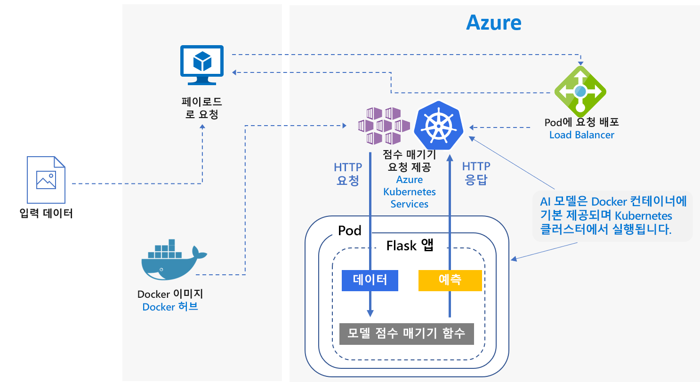
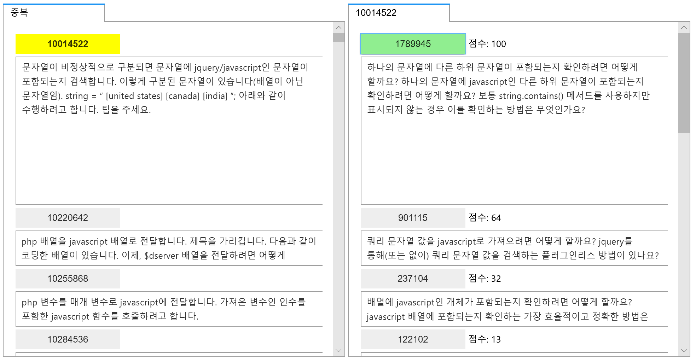
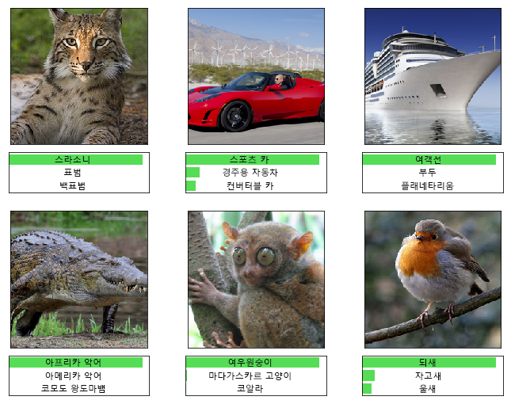

# Azure의 Python Scikit-Learn 및 딥러닝 모델의 실시간 채점Real-time scoring of Python Scikit-Learn and deep learning models on Azure

이 참조 아키텍처에서는 Python 모델을 웹 서비스로 배포하여 실시간으로 예측하는 방법을 보여줍니다.This reference architecture shows how to deploy Python models as web services to make real-time predictions. 두 시나리오에서는 정규 Python 모델을 배포하는 방법 및 딥 러닝 모델을 배포하는 특정 요구 사항을 다룹니다.Two scenarios are covered: deploying regular Python models, and the specific requirements of deploying deep learning models. 시나리오는 모두 표시된 아키텍처를 사용합니다.Both scenarios use the architecture shown.

이 아키텍처의 두 참조 구현은 GitHub에서 지원됩니다([정규 Python 모델][github-python] 및 [딥 러닝 모델][github-dl]에 각각 하나씩).Two reference implementations for this architecture are available on GitHub, one for [regular Python models][github-python] and one for [deep learning models][github-dl].

## 시나리오Scenarios

참조 구현은이 아키텍처를 사용하는 두 가지 시나리오를 보여줍니다.The reference implementations demonstrate two scenarios using this architecture.

**시나리오 1: FAQ 일치**.**Scenario 1: FAQ matching**. 이 시나리오에서는 FAQ(질문과 대답) 일치 모델을 웹 서비스로 배포하여 사용자 질문에 대한 예측을 제공하는 방법을 보여줍니다.This scenario shows how to deploy a frequently asked questions (FAQ) matching model as a web service to provide predictions for user questions. 이 시나리오의 경우 아키텍처 다이어그램의 "입력 데이터"는 FAQ 목록과 일치하는 사용자 질문을 포함한 텍스트 문자열을 가리킵니다.For this scenario, "Input Data" in the architecture diagram refers to text strings containing user questions to match with a list of FAQs. 이 시나리오는 Python용 [scikit-learn][scikit] 기계 학습 라이브러리에 대해 설계되었지만 Python 모델을 사용하여 실시간으로 예측하는 모든 시나리오에 일반화될 수 있습니다.This scenario is designed for the [scikit-learn][scikit] machine learning library for Python, but can be generalized to any scenario that uses Python models to make real-time predictions.

이 시나리오에서는 JavaScript, 해당 중복 질문 및 대답으로 태그가 지정된 원래 질문이 포함된 Stack Overflow 질문 데이터의 하위 집합을 사용합니다.This scenario uses a subset of Stack Overflow question data that includes original questions tagged as JavaScript, their duplicate questions, and their answers. 원래 질문 각각과 중복 질문의 일치 확률을 예측하기 위해 scikit-learn 파이프라인을 학습합니다.It trains a scikit-learn pipeline to predict the match probability of a duplicate question with each of the original questions. REST API 엔드포인트를 사용하여 실시간으로 이러한 예측을 수행합니다.These predictions are made in real time using a REST API endpoint.

이 아키텍처에 대한 애플리케이션 흐름은 다음과 같습니다.The application flow for this architecture is as follows:

1. 클라이언트는 인코딩된 질문 데이터를 포함한 HTTP POST 요청을 보냅니다.The client sends an HTTP POST request with the encoded question data.

2. Flask 앱은 요청에서 질문을 추출합니다.The Flask app extracts the question from the request.

3. 기능화 및 점수 매기기를 위해 질문을 scikit-learn 파이프라인 모델에 보냅니다.The question is sent to the scikit-learn pipeline model for featurization and scoring.

4. 해당 점수를 포함한 일치 FAQ 질문은 JSON 개체로 파이핑되며 클라이언트에 반환됩니다.The matching FAQ questions with their scores are piped into a JSON object and returned to the client.

결과를 사용하는 예제 앱의 스크린샷은 다음과 같습니다.Here is a screenshot of the example app that consumes the results:

**시나리오 2: 이미지 분류**.**Scenario 2: Image classification**. 이 시나리오에서는 CNN(나선형 신경망) 모델을 웹 서비스로 배포하여 이미지에 대한 예측을 제공하는 방법을 보여줍니다.This scenario shows how to deploy a Convolutional Neural Network (CNN) model as a web service to provide predictions on images. 이 시나리오의 경우 아키텍처 다이어그램의 "입력 데이터"는 이미지 파일을 가리킵니다.For this scenario, "Input Data" in the architecture diagram refers to image files. CNN은 이미지 분류 및 개체 검색과 같은 작업의 컴퓨터 비전에서 매우 효과적입니다.CNNs are very effective in computer vision for tasks such as image classification and object detection. 이 시나리오는 TensorFlow, Keras(TensorFlow 백 엔드 포함) 및 PyTorch 프레임워크를 위해 설계되었습니다.This scenario is designed for the frameworks TensorFlow, Keras (with the TensorFlow back end), and PyTorch. 그러나 딥 러닝 모델을 사용하여 실시간으로 예측하는 모든 시나리오에 일반화될 수 있습니다.However, it can be generalized to any scenario that uses deep learning models to make real-time predictions.

이 시나리오에서는 ImageNet-1K(1,000개 클래스) 데이터 세트에서 학습된 ResNet-152 미리 학습된 모델을 사용하여 이미지가 속한 범주(아래 그림 참조)를 예측합니다.This scenario uses a pre-trained ResNet-152 model trained on ImageNet-1K (1,000 classes) dataset to predict which category (see figure below) an image belongs to. REST API 엔드포인트를 사용하여 실시간으로 이러한 예측을 수행합니다.These predictions are made in real time using a REST API endpoint.

딥 러닝 모델의 애플리케이션 흐름은 다음과 같습니다.The application flow for the deep learning model is as follows:

1. 클라이언트는 인코딩된 이미지 데이터를 포함한 HTTP POST 요청을 보냅니다.The client sends an HTTP POST request with the encoded image data.

2. Flask 앱은 요청에서 이미지를 추출합니다.The Flask app extracts the image from the request.

3. 이미지는 전처리되고 점수 매기기를 위해 모델로 보내집니다.The image is preprocessed and sent to the model for scoring.

4. 점수 매기기 결과는 JSON 개체로 파이핑되고 클라이언트에 반환됩니다.The scoring result is piped into a JSON object and returned to the client.

## 아키텍처Architecture

이 아키텍처는 다음과 같은 구성 요소로 구성됩니다.This architecture consists of the following components.

VM(**[가상 머신][vm]**)**[Virtual machine][vm]** (VM). VM은 HTTP 요청을 보낼 수 있는 &mdash; 로컬 또는 &mdash; 클라우드 디바이스의 예제로 표시됩니다.The VM is shown as an example of a device &mdash; local or in the cloud &mdash; that can send an HTTP request.

AKS(**[Azure Kubernetes Service][aks]**)는 Kubernetes 클러스터에서 애플리케이션을 배포하는 데 사용됩니다.**[Azure Kubernetes Service][aks]** (AKS) is used to deploy the application on a Kubernetes cluster. AKS는 Kubernetes의 배포 및 작업을 간소화합니다.AKS simplifies the deployment and operations of Kubernetes. 정규 Python 모델의 경우 CPU 전용 VM을 사용하고 딥 러닝 모델의 경우 GPU 설정 VM을 사용하여 클러스터를 구성할 수 있습니다.The cluster can be configured using CPU-only VMs for regular Python models or GPU-enabled VMs for deep learning models.

**[부하 분산 장치][lb]****[Load balancer][lb]**. AKS에서 프로비전된 부하 분산 장치는 외부에서 서비스를 노출하는 데 사용됩니다.A load balancer, provisioned by AKS, is used to expose the service externally. 부하 분산 장치의 트래픽은 백 엔드 pod에 전달됩니다.Traffic from the load balancer is directed to the back-end pods.

**[Docker 허브][docker]** 는 Kubernetes 클러스터에 배포된 Docker 이미지를 저장하는 데 사용됩니다.**[Docker Hub][docker]** is used to store the Docker image that is deployed on Kubernetes cluster. 이 아키텍처에서는 Docker 허브를 사용하기 쉽고 Docker 사용자의 기본 이미지 리포지토리이므로 이 항목을 선택했습니다.Docker Hub was chosen for this architecture because it's easy to use and is the default image repository for Docker users. 이 아키텍처에 [Azure Container Registry][acr]를 사용할 수도 있습니다.[Azure Container Registry][acr] can also be used for this architecture.

## 성능 고려 사항Performance considerations

실시간 점수 매기기 아키텍처의 경우 처리량 성능은 중요한 고려 사항입니다.For real-time scoring architectures, throughput performance becomes a dominant consideration. 정규 Python 모델의 경우 일반적으로 워크로드를 처리할 CPU가 충분하다고 여겨집니다.For regular Python models, it's generally accepted that CPUs are sufficient to handle the workload.

그러나 딥 러닝 워크로드의 경우 속도가 병목 상태가 되면 GPU는 CPU에 비해 일반적으로 뛰어난 [성능][gpus-vs-cpus]을 제공합니다.However for deep learning workloads, when speed is a bottleneck, GPUs generally provide better [performance][gpus-vs-cpus] compared to CPUs. CPU를 사용하여 GPU 성능을 충족하려면 일반적으로 다수의 CPU를 포함한 클러스터가 필요합니다.To match GPU performance using CPUs, a cluster with large number of CPUs is usually needed.

두 경우 모두 이 아키텍처에 CPU를 사용할 수 있지만 딥 러닝 모델의 경우 GPU는 유사한 비용의 CPU 클러스터에 비해 상당히 높은 처리량 값을 제공합니다.You can use CPUs for this architecture in either scenario, but for deep learning models, GPUs provide significantly higher throughput values compared to a CPU cluster of similar cost. AKS는 GPU를 사용하도록 지원합니다. 이 점은 이 아키텍처에서 AKS를 사용하는 장점 중 하나입니다.AKS supports the use of GPUs, which is one advantage of using AKS for this architecture. 또한 딥 러닝 배포는 일반적으로 다수의 매개 변수를 포함한 모델을 사용합니다.Also, deep learning deployments typically use models with a high number of parameters. GPU를 사용하면 CPU 전용 배포에서 발생하는 문제인 모델과 웹 서비스 간의 리소스에 대한 경합을 방지합니다.Using GPUs prevents contention for resources between the model and the web service, which is an issue in CPU-only deployments.

## 확장성 고려 사항Scalability considerations

AKS 클러스터가 CPU 전용 VM을 사용하여 프로비전되는 정규 Python 모델의 경우 [pod 수를 확장][manually-scale-pods]할 때 주의하세요.For regular Python models, where AKS cluster is provisioned with CPU-only VMs, take care when [scaling out the number of pods][manually-scale-pods]. 목표는 클러스터를 완벽하게 활용하는 것입니다.The goal is to fully utilize the cluster. 크기 조정은 pod에 정의된 CPU 요청 및 제한에 따라 달라집니다.Scaling depends on the CPU requests and limits defined for the pods. Kubernetes는 pod의 [자동 크기 조정][autoscale-pods]을 지원하여 CPU 사용률 또는 다른 선택 메트릭에 따라 배포에서 pod 수를 조정할 수도 있습니다.Kubernetes also supports [autoscaling][autoscale-pods] of the pods to adjust the number of pods in a deployment depending on CPU utilization or other select metrics. [클러스터 자동 크기 조정기][autoscaler](미리 보기 상태)는 보류 중인 pod에 따라 에이전트 노드 크기를 조정할 수 있습니다.The [cluster autoscaler][autoscaler] (in preview) can scale agent nodes based on pending pods.

GPU 지원 VM을 사용하는 딥 러닝 시나리오의 경우 pod에 대한 리소스 제한은 하나의 pod에 하나의 GPU를 할당하는 것과 같습니다.For deep learning scenarios, using GPU-enabled VMs, resource limits on pods are such that one GPU is assigned to one pod. 사용된 VM의 형식에 따라 [클러스터의 노드를 크기 조정][scale-cluster]하여 서비스에 대한 수요를 충족해야 합니다.Depending on the type of VM used, you must [scale the nodes of the cluster][scale-cluster] to meet the demand for the service. Azure CLI 및 kubectl을 사용하여 쉽게 수행할 수 있습니다.You can do this easily using the Azure CLI and kubectl.

## 모니터링 및 로깅 고려 사항Monitoring and logging considerations

### AKS 모니터링AKS monitoring

AKS 성능에 대한 가시성은 [컨테이너용 Azure Monitor][monitor-containers] 기능을 사용합니다.For visibility into AKS performance, use the [Azure Monitor for containers][monitor-containers] feature. Metrics API를 통해 Kubernetes에서 사용할 수 있는 컨트롤러, 노드 및 컨테이너의 메모리 및 프로세서 메트릭을 수집합니다.It collects memory and processor metrics from controllers, nodes, and containers that are available in Kubernetes through the Metrics API.

애플리케이션을 배포하는 동안 AKS 클러스터를 모니터링하여 예상대로 작동하는지, 모든 노드가 작동하는지 및 모든 pods가 실행되는지 확인합니다.While deploying your application, monitor the AKS cluster to make sure it's working as expected, all the nodes are operational, and all pods are running. [kubectl][kubectl] 명령줄 도구를 사용하여 pod 상태를 검색할 수 있지만 Kubernetes에는 클러스터 상태 및 관리를 기본적으로 모니터링하는 웹 대시보드도 포함됩니다.Although you can use the [kubectl][kubectl] command-line tool to retrieve pod status, Kubernetes also includes a web dashboard for basic monitoring of the cluster status and management.

클러스터 및 노드의 전반적인 상태를 확인하려면 Kubernetes 대시보드의 **노드** 섹션으로 이동합니다.To see the overall state of the cluster and nodes, go to the **Nodes** section of the Kubernetes dashboard. 노드가 비활성화되거나 실패한 경우 해당 페이지의 오류 로그를 표시할 수 있습니다.If a node is inactive or has failed, you can display the error logs from that page. 마찬가지로, pod 수 및 배포의 상태에 대한 정보는 **Pod** 및 **배포** 섹션으로 이동합니다.Similarly, go to the **Pods** and **Deployments** sections for information about the number of pods and status of your deployment.

### AKS 로그AKS logs

AKS는 클러스터의 pod 로그에 모든 stdout/stderr을 자동으로 기록합니다.AKS automatically logs all stdout/stderr to the logs of the pods in the cluster. kubectl을 사용하여 이러한 기록 및 노드 수준 이벤트 및 로그를 확인합니다.Use kubectl to see these and also node-level events and logs. 자세한 내용은 배포 단계를 참조하세요.For details, see the deployment steps.

[컨테이너용 Azure Monitor][monitor-containers]를 사용하여 Linux용 Log Analytics 에이전트의 컨테이너화된 버전을 통해 메트릭 및 로그를 수집합니다. 이 내용은 Log analytics 작업 영역에 저장됩니다.Use [Azure Monitor for containers][monitor-containers] to collect metrics and logs through a containerized version of the Log Analytics agent for Linux, which is stored in your Log Analytics workspace.

## 보안 고려 사항Security considerations

[Azure Security Center][security-center]를 사용하여 Azure 리소스의 보안 상태를 중앙에서 살펴볼 수 있습니다.Use [Azure Security Center][security-center] to get a central view of the security state of your Azure resources. Security Center는 잠재적인 보안 문제를 모니터링하고 배포의 보안 상태에 대한 종합적인 그림을 제공합니다. 하지만 AKS 에이전트 노드는 모니터링하지 않습니다.Security Center monitors potential security issues and provides a comprehensive picture of the security health of your deployment, although it doesn't monitor AKS agent nodes. 보안 센터는 각 Azure 구독을 기준으로 구성됩니다.Security Center is configured per Azure subscription. [Security Center 표준에 Azure 구독 온보딩][get-started]에서 설명된 대로 보안 데이터 컬렉션을 활성화합니다.Enable security data collection as described in [Onboard your Azure subscription to Security Center Standard][get-started]. 데이터 수집이 사용되도록 설정되면 보안 센터는 해당 구독에서 만든 모든 VM을 자동으로 검색합니다.When data collection is enabled, Security Center automatically scans any VMs created under that subscription.

**작업****Operations**. Azure AD(Azure Active Directory) 인증 토큰을 사용하여 AKS 클러스터에 로그인하려면 [사용자 인증][aad-auth]에 대해 Azure AD를 사용하도록 AKS를 구성합니다.To sign in to an AKS cluster using your Azure Active Directory (Azure AD) authentication token, configure AKS to use Azure AD for [user authentication][aad-auth]. 클러스터 관리자는 사용자 ID 또는 디렉터리 그룹 멤버 자격에 따라 Kubernetes RBAC(역할 기반 액세스 제어)를 구성할 수도 있습니다.Cluster administrators can also configure Kubernetes role-based access control (RBAC) based on a user's identity or directory group membership.

[RBAC][rbac]를 사용하여 배포하는 Azure 리소스에 대한 액세스를 제어합니다.Use [RBAC][rbac] to control access to the Azure resources that you deploy. RBAC를 통해 DevOps 팀의 구성원에게 권한 역할을 할당할 수 있습니다.RBAC lets you assign authorization roles to members of your DevOps team. 한 명의 사용자가 여러 역할에 할당될 수 있으며 좀 더 세분화된 [사용 권한]의 사용자 지정 역할을 만들 수도 있습니다.A user can be assigned to multiple roles, and you can create custom roles for even more fine-grained [permissions].

**HTTPS****HTTPS**. 보안을 극대화하려면 애플리케이션에서는 HTTPS를 적용하고 HTTP 요청을 리디렉션해야 합니다.As a security best practice, the application should enforce HTTPS and redirect HTTP requests. [수신 컨트롤러][ingress-controller]를 사용하여 SSL을 종료하고 HTTP 요청을 리디렉션하는 역방향 프록시를 배포합니다.Use an [ingress controller][ingress-controller] to deploy a reverse proxy that terminates SSL and redirects HTTP requests. 자세한 내용은 [AKS(Azure Kubernetes Service)에 HTTPS 수신 컨트롤러 만들기][https-ingress]를 참조하세요.For more information, see [Create an HTTPS ingress controller on Azure Kubernetes Service (AKS)][https-ingress].

**인증**.**Authentication**. 이 솔루션은 엔드포인트에 대한 액세스를 제한하지 않습니다.This solution doesn't restrict access to the endpoints. 엔터프라이즈 환경에서 아키텍처를 배포하려면 API 키를 통해 엔드포인트를 보호하고, 클라이언트 애플리케이션에 특정 형태의 사용자 인증을 추가합니다.To deploy the architecture in an enterprise setting, secure the endpoints through API keys and add some form of user authentication to the client application.

**컨테이너 레지스트리****Container registry**. 이 솔루션에서는 Docker 이미지를 저장하는 데 공개 레지스트리를 사용합니다.This solution uses a public registry to store the Docker image. 애플리케이션에서 사용하는 코드 및 모델은 이 이미지에 포함됩니다.The code that the application depends on, and the model, are contained within this image. 엔터프라이즈 애플리케이션은 비공개 레지스트리를 사용하여 악의적인 코드 실행으로부터 보호하고 컨테이너 내의 정보를 손상되지 않도록 유지해야 합니다.Enterprise applications should use a private registry to help guard against running malicious code and to help keep the information inside the container from being compromised.

**DDoS 보호****DDoS protection**. [DDoS Protection 표준][ddos]을 사용하는 것이 좋습니다.Consider enabling [DDoS Protection Standard][ddos]. 기본 DDoS 보호가 Azure 플랫폼의 일부로 활성화되어 있지만 DDoS Protection 표준은 Azure Virtual Network 리소스에 맞게 조정된 완화 기능을 제공합니다.Although basic DDoS protection is enabled as part of the Azure platform, DDoS Protection Standard provides mitigation capabilities that are tuned specifically to Azure virtual network resources.

**로깅****Logging**. 보안 사기에 사용될 수 있는 사용자 암호 및 기타 정보를 삭제하는 등 로그 데이터를 저장하기 전에 모범 사례를 사용합니다.Use best practices before storing log data, such as scrubbing user passwords and other information that could be used to commit security fraud.

## 배포Deployment

이 참조 아키텍처를 배포하려면 GitHub 리포지토리에 설명된 단계를 따르세요.To deploy this reference architecture, follow the steps described in the GitHub repos:

- [정규 Python 모델][github-python][Regular Python models][github-python]
- [딥 러닝 모델][github-dl][Deep learning models][github-dl]

<!-- links -->

[aad-auth]: /azure/aks/aad-integration
[acr]: /azure/container-registry/
[something]: https://kubernetes.io/docs/reference/access-authn-authz/authentication/
[aks]: /azure/aks/intro-kubernetes
[autoscaler]: /azure/aks/autoscaler
[autoscale-pods]: /azure/aks/tutorial-kubernetes-scale#autoscale-pods
[azcopy]: /azure/storage/common/storage-use-azcopy-linux
[ddos]: /azure/virtual-network/ddos-protection-overview
[docker]: https://hub.docker.com/
[get-started]: /azure/security-center/security-center-get-started
[github-python]: https://github.com/Azure/MLAKSDeployment
[github-dl]: https://github.com/Microsoft/AKSDeploymentTutorial
[gpus-vs-cpus]: https://azure.microsoft.com/en-us/blog/gpus-vs-cpus-for-deployment-of-deep-learning-models/
[https-ingress]: /azure/aks/ingress-tls
[ingress-controller]: https://kubernetes.io/docs/concepts/services-networking/ingress/
[kubectl]: https://kubernetes.io/docs/tasks/tools/install-kubectl/
[lb]: /azure/load-balancer/load-balancer-overview
[manually-scale-pods]: /azure/aks/tutorial-kubernetes-scale#manually-scale-pods
[monitor-containers]: /azure/monitoring/monitoring-container-insights-overview
[사용 권한]: /azure/aks/concepts-identity
[permissions]: /azure/aks/concepts-identity
[rbac]: /azure/active-directory/role-based-access-control-what-is
[scale-cluster]: /azure/aks/scale-cluster
[scikit]: https://pypi.org/project/scikit-learn/
[security-center]: /azure/security-center/security-center-intro
[vm]: /azure/virtual-machines/
