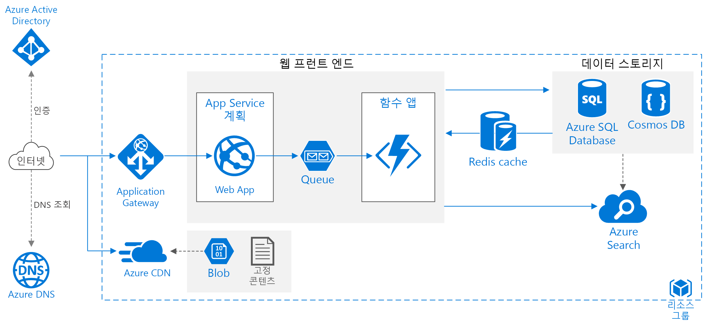

# Azure 웹 애플리케이션에서 확장성 향상Improve scalability in an Azure web application

이 참조 아키텍처는 Azure App Service 웹 애플리케이션의 확장성과 성능 향상을 위한 검증된 사례를 보여 줍니다.This reference architecture shows proven practices for improving scalability and performance in an Azure App Service web application.

*이 아키텍처의 [Visio 파일][visio-download]을 다운로드합니다.**Download a [Visio file][visio-download] of this architecture.*

## 아키텍처Architecture

이 아키텍처는 [기본 웹 애플리케이션][basic-web-app]에 표시된 아키텍처를 기반으로 합니다.This architecture builds on the one shown in [Basic web application][basic-web-app]. 다음 구성 요소가 포함되어 있습니다.It includes the following components:

- **리소스 그룹**.**Resource group**. [리소스 그룹][resource-group]은 Azure 리소스에 대한 논리적 컨테이너입니다.A [resource group][resource-group] is a logical container for Azure resources.
- **[웹앱][app-service-web-app]**.**[Web app][app-service-web-app]**. 일반적인 최신 애플리케이션에는 웹 사이트와 하나 이상의 RESTful 웹 API가 모두 포함되어 있을 수 있습니다.A typical modern application might include both a website and one or more RESTful web APIs. AJAX를 통한 브라우저 클라이언트, 기본 클라이언트 애플리케이션 또는 서버 쪽 애플리케이션에서 웹 API를 사용할 수 있습니다.A web API might be consumed by browser clients through AJAX, by native client applications, or by server-side applications. 웹 API 디자인에 대한 고려 사항은 [API 디자인 지침][api-guidance]을 참조하세요.For considerations on designing web APIs, see [API design guidance][api-guidance].
- **Function App**.**Function App**. [Function App][functions]을 사용하여 백그라운드 작업을 실행합니다.Use [Function Apps][functions] to run background tasks. 함수는 큐에 배치되는 타이머 이벤트 또는 메시지와 같은 트리거에 의해 호출됩니다.Functions are invoked by a trigger, such as a timer event or a message being placed on queue. 장기 실행 상태 저장 작업의 경우 [Durable Functions][durable-functions]를 사용합니다.For long-running stateful tasks, use [Durable Functions][durable-functions].
- **큐**.**Queue**. 여기에 표시된 아키텍처에서는 애플리케이션이 [Azure Queue Storage][queue-storage] 큐에 메시지를 넣어 백그라운드 작업을 큐에 넣습니다.In the architecture shown here, the application queues background tasks by putting a message onto an [Azure Queue storage][queue-storage] queue. 메시지가 함수 앱을 트리거합니다.The message triggers a function app. 또는 Service Bus 큐를 사용할 수 있습니다.Alternatively, you can use Service Bus queues. 비교하려면 [Azure 큐 및 Service Bus 큐 - 비교 및 대조][queues-compared]를 참조하세요.For a comparison, see [Azure Queues and Service Bus queues - compared and contrasted][queues-compared].
- **캐시**.**Cache**. [Azure Redis Cache][azure-redis]의 반정적 데이터를 저장합니다.Store semi-static data in [Azure Redis Cache][azure-redis].
- **CDN**.**CDN**. [Azure CDN(Content Delivery Network)][azure-cdn]을 사용하여 지연 시간을 단축하고 더 신속한 콘텐츠 배달을 위해 공개적으로 사용 가능한 콘텐츠를 캐시합니다.Use [Azure Content Delivery Network][azure-cdn] (CDN) to cache publicly available content for lower latency and faster delivery of content.
- **데이터 저장소**.**Data storage**. 관계형 데이터의 경우 [Azure SQL Database][sql-db]를 사용합니다.Use [Azure SQL Database][sql-db] for relational data. 비관계형 데이터의 경우 [Cosmos DB][cosmosdb]를 사용하는 것이 좋습니다.For non-relational data, consider [Cosmos DB][cosmosdb].
- **Azure Search**.**Azure Search**. [Azure Search][azure-search]를 사용하여 검색 제안, 유사 항목 검색 및 언어별 검색과 같은 검색 기능을 추가합니다.Use [Azure Search][azure-search] to add search functionality such as search suggestions, fuzzy search, and language-specific search. Azure Search는 일반적으로 다른 데이터 저장소와 함께 사용되는데, 특히 기본 데이터 저장소에 엄격한 일관성이 필요한 경우 그렇습니다.Azure Search is typically used in conjunction with another data store, especially if the primary data store requires strict consistency. 이러한 접근 방식에서는 신뢰할 수 있는 데이터를 다른 데이터 저장소에 저장하고 검색 인덱스를 Azure Search에 저장합니다.In this approach, store authoritative data in the other data store and the search index in Azure Search. 또한 Azure Search는 여러 데이터 저장소의 단일 검색 인덱스를 통합하는 데 사용할 수 있습니다.Azure Search can also be used to consolidate a single search index from multiple data stores.
- **Azure DNS**.**Azure DNS**. [Azure DNS][azure-dns]는 Microsoft Azure 인프라를 사용하여 이름 확인을 제공하는 DNS 도메인에 대한 호스팅 서비스입니다.[Azure DNS][azure-dns] is a hosting service for DNS domains, providing name resolution using Microsoft Azure infrastructure. Azure에 도메인을 호스트하면 다른 Azure 서비스와 동일한 자격 증명, API, 도구 및 대금 청구를 사용하여 DNS 레코드를 관리할 수 있습니다.By hosting your domains in Azure, you can manage your DNS records using the same credentials, APIs, tools, and billing as your other Azure services.
- **Application Gateway****Application gateway**. [Application Gateway](/azure/application-gateway/)는 계층 7 부하 분산 장치입니다.[Application Gateway](/azure/application-gateway/) is a layer 7 load balancer. 이 아키텍처에서 HTTP 요청을 웹 프런트 엔드로 라우팅합니다.In this architecture, it routes HTTP requests to the web front end. 또한 application Gateway는 일반적인 악용 및 취약점으로부터 애플리케이션을 보호하는 WAF([웹 애플리케이션 방화벽](/azure/application-gateway/waf-overview))을 제공합니다.Application Gateway also provides a [web application firewall](/azure/application-gateway/waf-overview) (WAF) that protects the application from common exploits and vulnerabilities.

## 권장 사항Recommendations

개발자의 요구 사항이 여기에 설명된 아키텍처와 다를 수 있습니다.Your requirements might differ from the architecture described here. 이 섹션의 권장 사항을 시작점으로 사용합니다.Use the recommendations in this section as a starting point.

### App Service 앱App Service apps

웹 애플리케이션과 웹 API를 별도의 App Service 앱으로 만드는 것이 좋습니다.We recommend creating the web application and the web API as separate App Service apps. 이렇게 디자인하면 이들을 별도의 App Service 계획에서 실행할 수 있으므로 독립적으로 확장할 수 있습니다.This design lets you run them in separate App Service plans so they can be scaled independently. 처음에 이러한 수준의 확장성이 필요하지 않은 경우 앱을 동일한 계획에 배포하고 필요한 경우 나중에 별도의 계획으로 이동할 수 있습니다.If you don't need that level of scalability initially, you can deploy the apps into the same plan and move them into separate plans later if necessary.

> [!NOTE]
> Basic, Standard 및 Premium 계획은 앱 단위가 아니라 계획의 VM 인스턴스에 대해 청구됩니다.For the Basic, Standard, and Premium plans, you are billed for the VM instances in the plan, not per app. [App Service 가격 책정][app-service-pricing]을 참조하세요.See [App Service Pricing][app-service-pricing]
>

### 캐시Cache

[Azure Redis Cache][azure-redis]를 사용하여 일부 데이터를 캐시하면 성능과 확장성을 향상할 수 있습니다.You can improve performance and scalability by using [Azure Redis Cache][azure-redis] to cache some data. 다음에 대해 Redis Cache 사용을 고려합니다.Consider using Redis Cache for:

- 반정적 트랜잭션 데이터Semi-static transaction data.
- 세션 상태Session state.
- HTML 출력HTML output. 이는 복잡한 HTML 출력을 렌더링하는 애플리케이션에 유용할 수 있습니다.This can be useful in applications that render complex HTML output.

캐싱 전략 디자인에 대한 자세한 지침은 [캐싱 지침][caching-guidance]을 참조하세요.For more detailed guidance on designing a caching strategy, see [Caching guidance][caching-guidance].

### CDNCDN

[Azure CDN][azure-cdn]을 사용하여 정적 콘텐츠를 캐시합니다.Use [Azure CDN][azure-cdn] to cache static content. CDN의 주요 이점은 사용자의 대기 시간이 줄어드는 것인데 그 이유는 콘텐츠가 사용자와 지리적으로 가까운 에지 서버에 캐시되기 때문입니다.The main benefit of a CDN is to reduce latency for users, because content is cached at an edge server that is geographically close to the user. 또한 애플리케이션에 의해 트래픽이 처리되지 않기 때문에 CDN은 애플리케이션의 부하를 줄일 수 있습니다.CDN can also reduce load on the application, because that traffic is not being handled by the application.

앱이 대부분 정적 페이지로 구성된 경우 [전체 앱을 캐시하는 데 CDN][cdn-app-service] 사용을 고려합니다.If your app consists mostly of static pages, consider using [CDN to cache the entire app][cdn-app-service]. 그렇지 않은 경우에는 이미지, CSS, HTML 파일 등의 정적 콘텐츠를 [Azure Storage에 넣고 CDN을 사용하여 이러한 파일을 캐시합니다][cdn-storage-account].Otherwise, put static content such as images, CSS, and HTML files, into [Azure Storage and use CDN to cache those files][cdn-storage-account].

> [!NOTE]
> Azure CDN은 인증이 필요한 콘텐츠를 제공할 수 없습니다.Azure CDN cannot serve content that requires authentication.
>

자세한 지침은 [CDN(콘텐츠 배달 네트워크) 지침][cdn-guidance]을 참조하세요.For more detailed guidance, see [Content Delivery Network (CDN) guidance][cdn-guidance].

### StorageStorage

최신 애플리케이션은 종종 많은 양의 데이터를 처리합니다.Modern applications often process large amounts of data. 클라우드에 대한 크기를 조정하려면 올바른 저장소 유형을 선택해야 합니다.In order to scale for the cloud, it's important to choose the right storage type. 다음은 몇 가지 기본 권장 사항입니다.Here are some baseline recommendations.

| 저장 형식What you want to store | 예Example | 권장 저장소Recommended storage |
| --- | --- | --- |
| 파일Files |이미지, 문서, PDFImages, documents, PDFs |Azure Blob StorageAzure Blob Storage |
| 키/값 쌍Key/Value pairs |사용자 ID로 조회된 사용자 프로필 데이터User profile data looked up by user ID |Azure Table StorageAzure Table storage |
| 추가 처리를 트리거할 짧은 메시지Short messages intended to trigger further processing |주문 요청Order requests |Azure Queue Storage, Service Bus 큐 또는 Service Bus 항목Azure Queue storage, Service Bus queue, or Service Bus topic |
| 기본 쿼리를 요구하는 유연한 스키마를 사용하는 비관계형 데이터Non-relational data with a flexible schema requiring basic querying |제품 카탈로그Product catalog |Azure Cosmos DB, MongoDB 또는 Apache CouchDB와 같은 문서 데이터베이스Document database, such as Azure Cosmos DB, MongoDB, or Apache CouchDB |
| 보다 풍부한 쿼리 지원, 엄격한 스키마 및/또는 강력한 일관성이 필요한 관계형 데이터Relational data requiring richer query support, strict schema, and/or strong consistency |제품 인벤토리Product inventory |Azure SQL DatabaseAzure SQL Database |

[적절한 데이터 저장소 선택][datastore]을 참조하세요.See [Choose the right data store][datastore].

## 확장성 고려 사항Scalability considerations

Azure App Service의 주요 이점은 부하에 따라 애플리케이션을 확장할 수 있다는 점입니다.A major benefit of Azure App Service is the ability to scale your application based on load. 다음은 애플리케이션 확장을 계획할 때 염두에 둘 몇 가지 고려 사항입니다.Here are some considerations to keep in mind when planning to scale your application.

### App Service 앱App Service app

솔루션에 여러 App Service 앱이 포함되어 있는 경우 App Service 계획이 분리되도록 배포하는 것을 고려합니다.If your solution includes several App Service apps, consider deploying them to separate App Service plans. 이러한 방식을 사용하면 개별 인스턴스에서 실행되므로 개별적으로 확장할 수 있습니다.This approach enables you to scale them independently because they run on separate instances.

마찬가지로, 백그라운드 작업이 HTTP 요청을 처리하는 동일한 인스턴스에서 실행되지 않도록 함수 앱을 고유한 계획에 배치하는 것이 좋습니다.Similarly, consider putting a function app into its own plan so that background tasks don't run on the same instances that handle HTTP requests. 백그라운드 작업을 일시적으로 실행하는 경우 [소비 계획][functions-consumption-plan]을 사용하는 것이 좋습니다. 그러면 매시간이 아닌 실행의 수를 기준으로 요금이 청구됩니다.If background tasks run intermittently, consider using a [consumption plan][functions-consumption-plan], which is billed based on the number of executions, rather than hourly.

### SQL DatabaseSQL Database

데이터베이스를 *분할*하여 SQL데이터베이스의 확장성을 높입니다.Increase scalability of a SQL database by *sharding* the database. 분할은 데이터베이스를 가로로 분할합니다.Sharding refers to partitioning the database horizontally. 분할을 사용하면 [Elastic Database 도구][sql-elastic]로 데이터베이스를 가로로 확장할 수 있습니다.Sharding allows you to scale out the database horizontally using [Elastic Database tools][sql-elastic]. 분할의 잠재적 이점은 다음과 같습니다.Potential benefits of sharding include:

- 트랜잭션 처리량이 늘어납니다.Better transaction throughput.
- 쿼리가 데이터의 하위 집합에서 더 빨리 실행될 수 있습니다.Queries can run faster over a subset of the data.

### Azure SearchAzure Search

Azure Search는 주요 데이터 저장소에서 복잡한 데이터 검색을 수행하는 데 따른 오버헤드를 제거하므로 부하를 처리하도록 확장할 수 있습니다.Azure Search removes the overhead of performing complex data searches from the primary data store, and it can scale to handle load. [Azure Search의 쿼리 및 인덱싱 작업을 위한 리소스 수준 확장][azure-search-scaling]을 참조하세요.See [Scale resource levels for query and indexing workloads in Azure Search][azure-search-scaling].

## 보안 고려 사항Security considerations

이 섹션에는 이 문서에 설명된 Azure 서비스와 관련된 보안 고려 사항이 나와 있습니다.This section lists security considerations that are specific to the Azure services described in this article. 보안 모범 사례가 완전히 다 나와 있는 것은 아닙니다.It's not a complete list of security best practices. 몇 가지 추가 보안 고려 사항은 [Azure App Service에서 앱 보안][app-service-security]을 참조하세요.For some additional security considerations, see [Secure an app in Azure App Service][app-service-security].

### CORS(크로스-원본 자원 공유)Cross-Origin Resource Sharing (CORS)

웹 사이트와 웹 API를 별도의 앱으로 만드는 경우 CORS를 사용하도록 설정하지 않으면 클라이언트 쪽 AJAX에서 API를 호출할 수 없습니다.If you create a website and web API as separate apps, the website cannot make client-side AJAX calls to the API unless you enable CORS.

> [!NOTE]
> 브라우저 보안은 웹 페이지에서 다른 도메인으로 AJAX 요청을 수행하지 못하도록 방지합니다.Browser security prevents a web page from making AJAX requests to another domain. 이렇게 제한하는 것을 동일 원본 정책이라고 하며, 악성 사이트에서 다른 사이트의 중요한 데이터를 읽을 수 없도록 합니다.This restriction is called the same-origin policy, and prevents a malicious site from reading sentitive data from another site. CORS는 서버에서 동일 원본 정책을 완화하고 크로스-원본 요청을 일부는 허용하고 일부는 거부할 수 있는 W3C표준입니다.CORS is a W3C standard that allows a server to relax the same-origin policy and allow some cross-origin requests while rejecting others.
>

App Services에서는 애플리케이션 코드를 작성할 필요 없이 기본적으로 CORS를 지원합니다.App Services has built-in support for CORS, without needing to write any application code. [CORS를 사용하여 JavaScript에서 API 앱 사용][cors]을 참조하세요.See [Consume an API app from JavaScript using CORS][cors]. API에 대해 허용되는 원본 목록에 웹 사이트를 추가합니다.Add the website to the list of allowed origins for the API.

### SQL Database 암호화SQL Database encryption

데이터베이스에서 미사용 데이터를 암호화해야 하는 경우 [투명한 데이터 암호화][sql-encryption]를 사용합니다.Use [Transparent Data Encryption][sql-encryption] if you need to encrypt data at rest in the database. 이 기능은 전체 데이터베이스(백업 및 트랜잭션 로그 파일 포함)의 실시간 암호화 및 암호 해독을 수행하며 애플리케이션을 변경할 필요가 없습니다.This feature performs real-time encryption and decryption of an entire database (including backups and transaction log files) and requires no changes to the application. 암호화를 수행하면 대기 시간이 늘어나므로, 고유한 데이터베이스에 보호해야 하는 데이터를 분리하고 해당 데이터베이스에 대해서만 암호화를 사용하도록 설정하는 것이 좋습니다.Encryption does add some latency, so it's a good practice to separate the data that must be secure into its own database and enable encryption only for that database.

<!-- links -->

[api-guidance]: ../../best-practices/api-design.md
[app-service-security]: /azure/app-service-web/web-sites-security
[app-service-web-app]: /azure/app-service-web/app-service-web-overview
[app-service-api-app]: /azure/app-service-api/app-service-api-apps-why-best-platform
[app-service-pricing]: https://azure.microsoft.com/pricing/details/app-service/
[azure-cdn]: https://azure.microsoft.com/services/cdn/
[azure-dns]: /azure/dns/dns-overview
[azure-redis]: https://azure.microsoft.com/services/cache/
[azure-search]: /azure/search
[azure-search-scaling]: /azure/search/search-capacity-planning
[basic-web-app]: basic-web-app.md
[basic-web-app-scalability]: basic-web-app.md#scalability-considerations
[caching-guidance]: ../../best-practices/caching.md
[cdn-app-service]: /azure/app-service-web/cdn-websites-with-cdn
[cdn-storage-account]: /azure/cdn/cdn-create-a-storage-account-with-cdn
[cdn-guidance]: ../../best-practices/cdn.md
[cors]: /azure/app-service-api/app-service-api-cors-consume-javascript
[cosmosdb]: /azure/cosmos-db/
[datastore]: ../..//guide/technology-choices/data-store-overview.md
[durable-functions]: /azure/azure-functions/durable-functions-overview
[functions]: /azure/azure-functions/functions-overview
[functions-consumption-plan]: /azure/azure-functions/functions-scale#consumption-plan
[queue-storage]: /azure/storage/storage-dotnet-how-to-use-queues
[queues-compared]: /azure/service-bus-messaging/service-bus-azure-and-service-bus-queues-compared-contrasted
[resource-group]: /azure/azure-resource-manager/resource-group-overview#resource-groups
[sql-db]: /azure/sql-database/
[sql-elastic]: /azure/sql-database/sql-database-elastic-scale-introduction
[sql-encryption]: https://msdn.microsoft.com/library/dn948096.aspx
[tm]: https://azure.microsoft.com/services/traffic-manager/
[visio-download]: https://archcenter.blob.core.windows.net/cdn/app-service-reference-architectures.vsdx
[web-app-multi-region]: ./multi-region.md
