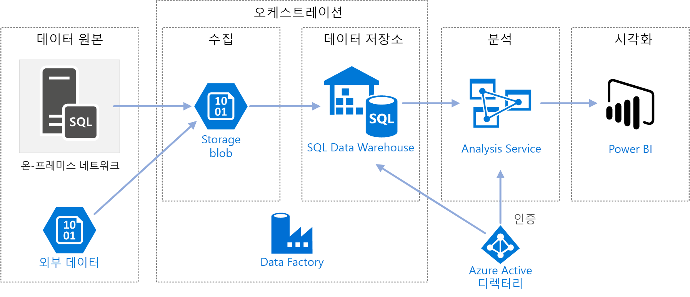
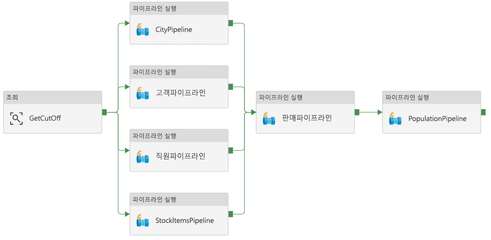
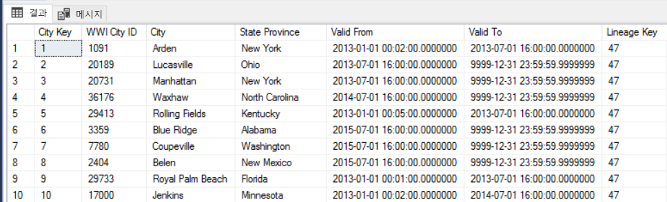
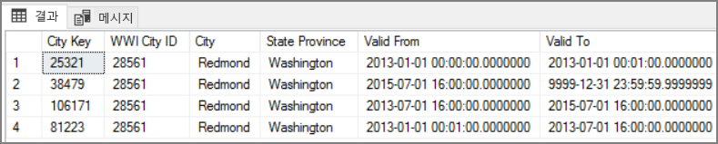

# <a name="automated-enterprise-bi-with-sql-data-warehouse-and-azure-data-factory"></a><span data-ttu-id="4ec9d-103">SQL Data Warehouse 및 Azure Data Factory를 사용하는 자동화된 Enterprise BI</span><span class="sxs-lookup"><span data-stu-id="4ec9d-103">Automated enterprise BI with SQL Data Warehouse and Azure Data Factory</span></span>

<span data-ttu-id="4ec9d-104">이 참조 아키텍처는 [ELT(추출, 로드, 변환)](../../data-guide/relational-data/etl.md#extract-load-and-transform-elt) 파이프라인에서 증분 로드를 수행하는 방법을 보여줍니다.</span><span class="sxs-lookup"><span data-stu-id="4ec9d-104">This reference architecture shows how to perform incremental loading in an [extract, load, and transform (ELT)](../../data-guide/relational-data/etl.md#extract-load-and-transform-elt) pipeline.</span></span> <span data-ttu-id="4ec9d-105">Azure Data Factory를 사용하여 ELT 파이프라인을 자동화합니다.</span><span class="sxs-lookup"><span data-stu-id="4ec9d-105">It uses Azure Data Factory to automate the ELT pipeline.</span></span> <span data-ttu-id="4ec9d-106">파이프라인은 증분 방식으로 최신 OLTP 데이터를 온-프레미스 SQL Server 데이터베이스에서 SQL Data Warehouse로 이동합니다.</span><span class="sxs-lookup"><span data-stu-id="4ec9d-106">The pipeline incrementally moves the latest OLTP data from an on-premises SQL Server database into SQL Data Warehouse.</span></span> <span data-ttu-id="4ec9d-107">트랜잭션 데이터는 분석을 위해 테이블 형식 모델로 변환됩니다.</span><span class="sxs-lookup"><span data-stu-id="4ec9d-107">Transactional data is transformed into a tabular model for analysis.</span></span>

> [!VIDEO https://www.microsoft.com/en-us/videoplayer/embed/RE2Gnz2]

<span data-ttu-id="4ec9d-108">이 아키텍처에 대한 참조 구현은 [GitHub][github]에서 사용할 수 있습니다.</span><span class="sxs-lookup"><span data-stu-id="4ec9d-108">A reference implementation for this architecture is available on [GitHub][github].</span></span>



<span data-ttu-id="4ec9d-110">이 아키텍처는 [SQL Data Warehouse를 사용한 Enterprise BI](./enterprise-bi-sqldw.md)에 표시된 아키텍처 위에 빌드하지만 엔터프라이즈 데이터 웨어하우징 시나리오에 대해 중요한 일부 기능을 추가합니다.</span><span class="sxs-lookup"><span data-stu-id="4ec9d-110">This architecture builds on the one shown in [Enterprise BI with SQL Data Warehouse](./enterprise-bi-sqldw.md), but adds some features that are important for enterprise data warehousing scenarios.</span></span>

- <span data-ttu-id="4ec9d-111">Data Factory를 사용하여 파이프라인의 자동화.</span><span class="sxs-lookup"><span data-stu-id="4ec9d-111">Automation of the pipeline using Data Factory.</span></span>
- <span data-ttu-id="4ec9d-112">증분 로드.</span><span class="sxs-lookup"><span data-stu-id="4ec9d-112">Incremental loading.</span></span>
- <span data-ttu-id="4ec9d-113">다중 데이터 원본 통합.</span><span class="sxs-lookup"><span data-stu-id="4ec9d-113">Integrating multiple data sources.</span></span>
- <span data-ttu-id="4ec9d-114">지리 공간 데이터 및 이미지 같은 이진 데이터 로드.</span><span class="sxs-lookup"><span data-stu-id="4ec9d-114">Loading binary data such as geospatial data and images.</span></span>

## <a name="architecture"></a><span data-ttu-id="4ec9d-115">아키텍처</span><span class="sxs-lookup"><span data-stu-id="4ec9d-115">Architecture</span></span>

<span data-ttu-id="4ec9d-116">이 아키텍처는 다음 구성 요소로 구성됩니다.</span><span class="sxs-lookup"><span data-stu-id="4ec9d-116">The architecture consists of the following components.</span></span>

### <a name="data-sources"></a><span data-ttu-id="4ec9d-117">데이터 원본</span><span class="sxs-lookup"><span data-stu-id="4ec9d-117">Data sources</span></span>

<span data-ttu-id="4ec9d-118">**온-프레미스 SQL Server**.</span><span class="sxs-lookup"><span data-stu-id="4ec9d-118">**On-premises SQL Server**.</span></span> <span data-ttu-id="4ec9d-119">원본 데이터는 SQL Server 데이터베이스 온-프레미스에 위치합니다.</span><span class="sxs-lookup"><span data-stu-id="4ec9d-119">The source data is located in a SQL Server database on premises.</span></span> <span data-ttu-id="4ec9d-120">온-프레미스 환경을 시뮬레이션하기 위해 이 아키텍처에 대한 배포 스크립트는 설치된 SQL Server를 사용하여 Azure에서 가상 머신을 프로비전합니다.</span><span class="sxs-lookup"><span data-stu-id="4ec9d-120">To simulate the on-premises environment, the deployment scripts for this architecture provision a virtual machine in Azure with SQL Server installed.</span></span> <span data-ttu-id="4ec9d-121">[Wide World Importers OLTP 예제 데이터베이스][wwi]는 원본 데이터베이스로 사용됩니다.</span><span class="sxs-lookup"><span data-stu-id="4ec9d-121">The [Wide World Importers OLTP sample database][wwi] is used as the source database.</span></span>

<span data-ttu-id="4ec9d-122">**외부 데이터**.</span><span class="sxs-lookup"><span data-stu-id="4ec9d-122">**External data**.</span></span> <span data-ttu-id="4ec9d-123">데이터 웨어하우스에 대한 일반적인 시나리오는 여러 데이터 원본을 통합하는 것입니다.</span><span class="sxs-lookup"><span data-stu-id="4ec9d-123">A common scenario for data warehouses is to integrate multiple data sources.</span></span> <span data-ttu-id="4ec9d-124">이 참조 아키텍처는 연도별 도시 인구를 포함하는 외부 데이터 집합을 로드하여 OLTP 데이터베이스의 데이터와 통합합니다.</span><span class="sxs-lookup"><span data-stu-id="4ec9d-124">This reference architecture loads an external data set that contains city populations by year, and integrates it with the data from the OLTP database.</span></span> <span data-ttu-id="4ec9d-125">"각 지역의 매출 증가가 인구 증가와 일치하거나 초과합니까?" 같은 인사이트에 이 데이터를 사용할 수 있습니다.</span><span class="sxs-lookup"><span data-stu-id="4ec9d-125">You can use this data for insights such as: "Does sales growth in each region match or exceed population growth?"</span></span>

### <a name="ingestion-and-data-storage"></a><span data-ttu-id="4ec9d-126">수집 및 데이터 저장소</span><span class="sxs-lookup"><span data-stu-id="4ec9d-126">Ingestion and data storage</span></span>

<span data-ttu-id="4ec9d-127">**Blob Storage**</span><span class="sxs-lookup"><span data-stu-id="4ec9d-127">**Blob Storage**.</span></span> <span data-ttu-id="4ec9d-128">Blob 저장소는 SQL Data Warehouse로 로딩하기 전에 원본 데이터에 대한 준비 영역으로 사용됩니다.</span><span class="sxs-lookup"><span data-stu-id="4ec9d-128">Blob storage is used as a staging area for the source data before loading it into SQL Data Warehouse.</span></span>

<span data-ttu-id="4ec9d-129">**Azure SQL Data Warehouse**</span><span class="sxs-lookup"><span data-stu-id="4ec9d-129">**Azure SQL Data Warehouse**.</span></span> <span data-ttu-id="4ec9d-130">[SQL Data Warehouse](/azure/sql-data-warehouse/)는 대규모 데이터 분석을 수행하도록 설계되고 배포된 시스템입니다.</span><span class="sxs-lookup"><span data-stu-id="4ec9d-130">[SQL Data Warehouse](/azure/sql-data-warehouse/) is a distributed system designed to perform analytics on large data.</span></span> <span data-ttu-id="4ec9d-131">고성능 분석을 실행하는 데 적합하도록 하는 MPP(대규모 병렬 처리)를 지원합니다.</span><span class="sxs-lookup"><span data-stu-id="4ec9d-131">It supports massive parallel processing (MPP), which makes it suitable for running high-performance analytics.</span></span>

<span data-ttu-id="4ec9d-132">**Azure Data Factory**.</span><span class="sxs-lookup"><span data-stu-id="4ec9d-132">**Azure Data Factory**.</span></span> <span data-ttu-id="4ec9d-133">[Data Factory][adf]는 데이터 이동 및 데이터 변환을 오케스트레이션하고 자동화하는 관리되는 서비스입니다.</span><span class="sxs-lookup"><span data-stu-id="4ec9d-133">[Data Factory][adf] is a managed service that orchestrates and automates data movement and data transformation.</span></span> <span data-ttu-id="4ec9d-134">이 아키텍처에서 다양한 단계의 ELT 프로세스를 조정합니다.</span><span class="sxs-lookup"><span data-stu-id="4ec9d-134">In this architecture, it coordinates the various stages of the ELT process.</span></span>

### <a name="analysis-and-reporting"></a><span data-ttu-id="4ec9d-135">분석 및 보고</span><span class="sxs-lookup"><span data-stu-id="4ec9d-135">Analysis and reporting</span></span>

<span data-ttu-id="4ec9d-136">**Azure Analysis Services**.</span><span class="sxs-lookup"><span data-stu-id="4ec9d-136">**Azure Analysis Services**.</span></span> <span data-ttu-id="4ec9d-137">[Analysis Services](/azure/analysis-services/)는 데이터 모델링 기능을 제공하는 완전히 관리되는 서비스입니다.</span><span class="sxs-lookup"><span data-stu-id="4ec9d-137">[Analysis Services](/azure/analysis-services/) is a fully managed service that provides data modeling capabilities.</span></span> <span data-ttu-id="4ec9d-138">의미 체계 모델은 Analysis Services에 로드됩니다.</span><span class="sxs-lookup"><span data-stu-id="4ec9d-138">The semantic model is loaded into Analysis Services.</span></span>

<span data-ttu-id="4ec9d-139">**Power BI**.</span><span class="sxs-lookup"><span data-stu-id="4ec9d-139">**Power BI**.</span></span> <span data-ttu-id="4ec9d-140">Power BI는 비즈니스 정보에 대한 데이터를 분석하는 비즈니스 분석 도구 제품군입니다.</span><span class="sxs-lookup"><span data-stu-id="4ec9d-140">Power BI is a suite of business analytics tools to analyze data for business insights.</span></span> <span data-ttu-id="4ec9d-141">이 아키텍처에서 Analysis Services에 저장된 의미 체계 모델을 쿼리합니다.</span><span class="sxs-lookup"><span data-stu-id="4ec9d-141">In this architecture, it queries the semantic model stored in Analysis Services.</span></span>

### <a name="authentication"></a><span data-ttu-id="4ec9d-142">인증</span><span class="sxs-lookup"><span data-stu-id="4ec9d-142">Authentication</span></span>

<span data-ttu-id="4ec9d-143">**Azure Active Directory**(Azure AD)는 Power BI를 통해 Analysis Services 서버에 연결하는 사용자를 인증합니다.</span><span class="sxs-lookup"><span data-stu-id="4ec9d-143">**Azure Active Directory** (Azure AD) authenticates users who connect to the Analysis Services server through Power BI.</span></span>

<span data-ttu-id="4ec9d-144">Data Factory는 서비스 주체 또는 MSI(관리되는 서비스 ID)를 사용하여 SQL Data Warehouse를 인증하려면 Azure AD를 사용할 수 있습니다.</span><span class="sxs-lookup"><span data-stu-id="4ec9d-144">Data Factory can use also use Azure AD to authenticate to SQL Data Warehouse, by using a service principal or Managed Service Identity (MSI).</span></span> <span data-ttu-id="4ec9d-145">간소화를 위해 예제 배포는 SQL Server 인증을 사용합니다.</span><span class="sxs-lookup"><span data-stu-id="4ec9d-145">For simplicity, the example deployment uses SQL Server authentication.</span></span>

## <a name="data-pipeline"></a><span data-ttu-id="4ec9d-146">데이터 파이프라인</span><span class="sxs-lookup"><span data-stu-id="4ec9d-146">Data pipeline</span></span>

<span data-ttu-id="4ec9d-147">[Azure Data Factory][adf]에서 파이프라인은 이 경우에 &mdash; 작업을 조정하는 데 사용된 활동의 논리적 그룹화로서 데이터를 SQL Data Warehouse로 로드하고 변환합니다.</span><span class="sxs-lookup"><span data-stu-id="4ec9d-147">In [Azure Data Factory][adf], a pipeline is a logical grouping of activities used to coordinate a task &mdash; in this case, loading and transforming data into SQL Data Warehouse.</span></span>

<span data-ttu-id="4ec9d-148">이 참조 아키텍처에서는 자식 파이프라인의 시퀀스를 실행하는 마스터 파이프라인을 정의합니다.</span><span class="sxs-lookup"><span data-stu-id="4ec9d-148">This reference architecture defines a master pipeline that runs a sequence of child pipelines.</span></span> <span data-ttu-id="4ec9d-149">각 자식 파이프라인은 하나 이상의 데이터 웨어하우스 테이블에 데이터를 로드합니다.</span><span class="sxs-lookup"><span data-stu-id="4ec9d-149">Each child pipeline loads data into one or more data warehouse tables.</span></span>



## <a name="incremental-loading"></a><span data-ttu-id="4ec9d-151">증분 로드</span><span class="sxs-lookup"><span data-stu-id="4ec9d-151">Incremental loading</span></span>

<span data-ttu-id="4ec9d-152">자동화된 ETL 또는 ELT 프로세스를 실행하는 경우 이전 실행 이후에 변경된 데이터만 로드하는 것이 가장 효율적입니다.</span><span class="sxs-lookup"><span data-stu-id="4ec9d-152">When you run an automated ETL or ELT process, it's most efficient to load only the data that changed since the previous run.</span></span> <span data-ttu-id="4ec9d-153">이는 모든 데이터를 로드하는 전체 로드와 달리 *증분 로드*라고 합니다.</span><span class="sxs-lookup"><span data-stu-id="4ec9d-153">This is called an *incremental load*, as opposed to a full load that loads all of the data.</span></span> <span data-ttu-id="4ec9d-154">증분 로드를 수행하려면 데이터가 변경되었음을 식별하는 방법이 필요합니다.</span><span class="sxs-lookup"><span data-stu-id="4ec9d-154">To perform an incremental load, you need a way to identify which data has changed.</span></span> <span data-ttu-id="4ec9d-155">가장 일반적인 방법은 날짜/시간 열이든 고유 정수 열이든 원본 테이블에서 일부 열의 최신 값을 추적하는 것을 의미하는 *상위 워터 마크* 값을 사용하는 것입니다.</span><span class="sxs-lookup"><span data-stu-id="4ec9d-155">The most common approach is to use a *high water mark* value, which means tracking the latest value of some column in the source table, either a datetime column or a unique integer column.</span></span>

<span data-ttu-id="4ec9d-156">SQL Server 2016부터 [임시 테이블](/sql/relational-databases/tables/temporal-tables)을 사용할 수 있습니다.</span><span class="sxs-lookup"><span data-stu-id="4ec9d-156">Starting with SQL Server 2016, you can use [temporal tables](/sql/relational-databases/tables/temporal-tables).</span></span> <span data-ttu-id="4ec9d-157">이들은 데이터 변경 내용의 전체 기록을 유지하는 시스템 버전이 지정된 테이블이 있습니다.</span><span class="sxs-lookup"><span data-stu-id="4ec9d-157">These are system-versioned tables that keep a full history of data changes.</span></span> <span data-ttu-id="4ec9d-158">데이터베이스 엔진은 별도 기록 테이블의 모든 변경 기록을 자동으로 레코드합니다.</span><span class="sxs-lookup"><span data-stu-id="4ec9d-158">The database engine automatically records the history of every change in a separate history table.</span></span> <span data-ttu-id="4ec9d-159">FOR SYSTEM_TIME 절을 쿼리에 추가하여 기록 데이터를 쿼리할 수 있습니다.</span><span class="sxs-lookup"><span data-stu-id="4ec9d-159">You can query the historical data by adding a FOR SYSTEM_TIME clause to a query.</span></span> <span data-ttu-id="4ec9d-160">내부적으로 데이터베이스 엔진은 기록 테이블을 쿼리하지만 애플리케이션에 대해서는 투명합니다.</span><span class="sxs-lookup"><span data-stu-id="4ec9d-160">Internally, the database engine queries the history table, but this is transparent to the application.</span></span>

> [!NOTE]
> <span data-ttu-id="4ec9d-161">이전 버전의 SQL Server의 경우 [변경 데이터 캡처](/sql/relational-databases/track-changes/about-change-data-capture-sql-server)(CDC)를 사용할 수 있습니다.</span><span class="sxs-lookup"><span data-stu-id="4ec9d-161">For earlier versions of SQL Server, you can use [Change Data Capture](/sql/relational-databases/track-changes/about-change-data-capture-sql-server) (CDC).</span></span> <span data-ttu-id="4ec9d-162">이 방법은 별도 변경 테이블을 쿼리해야 하고 변경 내용이 타임스탬프보다는 로그 시퀀스 번호로 추적되기 때문에 임시 테이블보다 더 불편합니다.</span><span class="sxs-lookup"><span data-stu-id="4ec9d-162">This approach is less convenient than temporal tables, because you have to query a separate change table, and changes are tracked by a log sequence number, rather than a timestamp.</span></span>
>

<span data-ttu-id="4ec9d-163">임시 테이블은 시간이 지남에 따라 변경될 수 있는 차원 데이터에 유용합니다.</span><span class="sxs-lookup"><span data-stu-id="4ec9d-163">Temporal tables are useful for dimension data, which can change over time.</span></span> <span data-ttu-id="4ec9d-164">팩트 테이블은 대개 시스템 버전 기록을 유지하는 것이 사리에 맞지 않은 경우에 판매 같은 변경이 불가능한 트랜잭션을 나타냅니다.</span><span class="sxs-lookup"><span data-stu-id="4ec9d-164">Fact tables usually represent an immutable transaction such as a sale, in which case keeping the system version history doesn't make sense.</span></span> <span data-ttu-id="4ec9d-165">대신 트랜잭션에는 대개 워터 마크 값으로 사용될 수 있는 트랜잭션 날짜를 나타내는 열이 있습니다.</span><span class="sxs-lookup"><span data-stu-id="4ec9d-165">Instead, transactions usually have a column that represents the transaction date, which can be used as the watermark value.</span></span> <span data-ttu-id="4ec9d-166">예를 들어 Wide World Importers OLTP 데이터베이스에서 Sales.Invoices 및 Sales.InvoiceLines 테이블에는 `sysdatetime()`을 기본값으로 하는 `LastEditedWhen` 필드가 있습니다.</span><span class="sxs-lookup"><span data-stu-id="4ec9d-166">For example, in the Wide World Importers OLTP database, the Sales.Invoices and Sales.InvoiceLines tables have a `LastEditedWhen` field that defaults to `sysdatetime()`.</span></span>

<span data-ttu-id="4ec9d-167">ELT 파이프라인의 일반적인 흐름은 다음과 같습니다.</span><span class="sxs-lookup"><span data-stu-id="4ec9d-167">Here is the general flow for the ELT pipeline:</span></span>

1. <span data-ttu-id="4ec9d-168">원본 데이터베이스의 각 테이블의 경우 마지막 ELT 작업이 실행될 때 마감 시간을 추적하여,</span><span class="sxs-lookup"><span data-stu-id="4ec9d-168">For each table in the source database, track the cutoff time when the last ELT job ran.</span></span> <span data-ttu-id="4ec9d-169">데이터 웨어하우스에 이 정보를 저장합니다.</span><span class="sxs-lookup"><span data-stu-id="4ec9d-169">Store this information in the data warehouse.</span></span> <span data-ttu-id="4ec9d-170">(초기 설치 시 항상 시간은 '1900-1-1'로 설정돼 있습니다.)</span><span class="sxs-lookup"><span data-stu-id="4ec9d-170">(On initial setup, all times are set to '1-1-1900'.)</span></span>

2. <span data-ttu-id="4ec9d-171">데이터 내보내기 단계 중 마감 시간은 원본 데이터베이스의 저장 프로시저 집합에 매개 변수로 전달됩니다.</span><span class="sxs-lookup"><span data-stu-id="4ec9d-171">During the data export step, the cutoff time is passed as a parameter to a set of stored procedures in the source database.</span></span> <span data-ttu-id="4ec9d-172">이러한 저장 프로시저는 마감 시간 이후 변경되거나 생성된 모든 레코드에 대해 쿼리합니다.</span><span class="sxs-lookup"><span data-stu-id="4ec9d-172">These stored procedures query for any records that were changed or created after the cutoff time.</span></span> <span data-ttu-id="4ec9d-173">판매 팩트 테이블에 대해 `LastEditedWhen` 열을 사용하고,</span><span class="sxs-lookup"><span data-stu-id="4ec9d-173">For the Sales fact table, the `LastEditedWhen` column is used.</span></span> <span data-ttu-id="4ec9d-174">차원 데이터에 대해 시스템 버전이 있는 임시 테이블을 사용합니다.</span><span class="sxs-lookup"><span data-stu-id="4ec9d-174">For the dimension data, system-versioned temporal tables are used.</span></span>

3. <span data-ttu-id="4ec9d-175">데이터 마이그레이션이 완료되면 마감 시간을 저장하는 테이블을 업데이트합니다.</span><span class="sxs-lookup"><span data-stu-id="4ec9d-175">When the data migration is complete, update the table that stores the cutoff times.</span></span>

<span data-ttu-id="4ec9d-176">또한 각 ELT 실행에 대해 *계보*를 레코드하는 것이 유용합니다.</span><span class="sxs-lookup"><span data-stu-id="4ec9d-176">It's also useful to record a *lineage* for each ELT run.</span></span> <span data-ttu-id="4ec9d-177">지정된 레코드에 대해 계보는 데이터를 생성한 ELT 실행을 사용하여 해당 레코드와 연결합니다.</span><span class="sxs-lookup"><span data-stu-id="4ec9d-177">For a given record, the lineage associates that record with the ELT run that produced the data.</span></span> <span data-ttu-id="4ec9d-178">각 ETL 실행의 경우 새 계보 레코드가 모든 테이블에 대해 만들어져 시작 및 종료 로드 시간을 보여줍니다.</span><span class="sxs-lookup"><span data-stu-id="4ec9d-178">For each ETL run, a new lineage record is created for every table, showing the starting and ending load times.</span></span> <span data-ttu-id="4ec9d-179">각 레코드에 대한 계보 키는 차원 및 팩트 테이블에 저장됩니다.</span><span class="sxs-lookup"><span data-stu-id="4ec9d-179">The lineage keys for each record are stored in the dimension and fact tables.</span></span>



<span data-ttu-id="4ec9d-181">새 일괄 처리 데이터가 웨어하우스에 로드된 후 Analysis Services 테이블 형식 모델을 새로 고칩니다.</span><span class="sxs-lookup"><span data-stu-id="4ec9d-181">After a new batch of data is loaded into the warehouse, refresh the Analysis Services tabular model.</span></span> <span data-ttu-id="4ec9d-182">[REST API를 사용한 비동기 새로 고침](/azure/analysis-services/analysis-services-async-refresh)을 참조합니다.</span><span class="sxs-lookup"><span data-stu-id="4ec9d-182">See [Asynchronous refresh with the REST API](/azure/analysis-services/analysis-services-async-refresh).</span></span>

## <a name="data-cleansing"></a><span data-ttu-id="4ec9d-183">데이터 정리</span><span class="sxs-lookup"><span data-stu-id="4ec9d-183">Data cleansing</span></span>

<span data-ttu-id="4ec9d-184">데이터 정리는 ELT 프로세스의 일부여야 합니다.</span><span class="sxs-lookup"><span data-stu-id="4ec9d-184">Data cleansing should be part of the ELT process.</span></span> <span data-ttu-id="4ec9d-185">이 참조 아키텍처에서 잘못된 데이터 원본 하나는 아마도 사용할 수 있는 데이터가 없기 때문에 일부 도시에 인구가 없는 도시 인구 테이블입니다.</span><span class="sxs-lookup"><span data-stu-id="4ec9d-185">In this reference architecture, one source of bad data is the city population table, where some cities have zero population, perhaps because no data was available.</span></span> <span data-ttu-id="4ec9d-186">처리 동안 ELT 파이프라인은 도시 인구 테이블에서 해당 도시를 제거합니다.</span><span class="sxs-lookup"><span data-stu-id="4ec9d-186">During processing, the ELT pipeline removes those cities from the city population table.</span></span> <span data-ttu-id="4ec9d-187">외부 테이블보다는 준비 테이블에서 데이터 정리를 수행하세요.</span><span class="sxs-lookup"><span data-stu-id="4ec9d-187">Perform data cleansing on staging tables, rather than external tables.</span></span>

<span data-ttu-id="4ec9d-188">도시 인구 테이블에서 인구가 없는 도시를 제거하는 저장 프로시저는 다음과 같습니다.</span><span class="sxs-lookup"><span data-stu-id="4ec9d-188">Here is the stored procedure that removes the cities with zero population from the City Population table.</span></span> <span data-ttu-id="4ec9d-189">([여기](https://github.com/mspnp/reference-architectures/blob/master/data/enterprise_bi_sqldw_advanced/azure/sqldw_scripts/citypopulation/%5BIntegration%5D.%5BMigrateExternalCityPopulationData%5D.sql)에서 소스 파일을 찾을 수 있습니다.)</span><span class="sxs-lookup"><span data-stu-id="4ec9d-189">(You can find the source file [here](https://github.com/mspnp/reference-architectures/blob/master/data/enterprise_bi_sqldw_advanced/azure/sqldw_scripts/citypopulation/%5BIntegration%5D.%5BMigrateExternalCityPopulationData%5D.sql).)</span></span>

```sql
DELETE FROM [Integration].[CityPopulation_Staging]
WHERE RowNumber in (SELECT DISTINCT RowNumber
FROM [Integration].[CityPopulation_Staging]
WHERE POPULATION = 0
GROUP BY RowNumber
HAVING COUNT(RowNumber) = 4)
```

## <a name="external-data-sources"></a><span data-ttu-id="4ec9d-190">외부 데이터 원본</span><span class="sxs-lookup"><span data-stu-id="4ec9d-190">External data sources</span></span>

<span data-ttu-id="4ec9d-191">데이터 웨어하우스는 종종 여러 소스의 데이터를 통합합니다.</span><span class="sxs-lookup"><span data-stu-id="4ec9d-191">Data warehouses often consolidate data from multiple sources.</span></span> <span data-ttu-id="4ec9d-192">이 참조 아키텍처는 인구 통계 데이터를 포함하는 외부 데이터 원본을 로드합니다.</span><span class="sxs-lookup"><span data-stu-id="4ec9d-192">This reference architecture loads an external data source that contains demographics data.</span></span> <span data-ttu-id="4ec9d-193">이 데이터 세트는 [WorldWideImportersDW](https://github.com/Microsoft/sql-server-samples/tree/master/samples/databases/wide-world-importers/sample-scripts/polybase) 샘플의 일부로 Azure Blob Storage에서 사용할 수 있습니다.</span><span class="sxs-lookup"><span data-stu-id="4ec9d-193">This dataset is available in Azure blob storage as part of the [WorldWideImportersDW](https://github.com/Microsoft/sql-server-samples/tree/master/samples/databases/wide-world-importers/sample-scripts/polybase) sample.</span></span>

<span data-ttu-id="4ec9d-194">Azure Data Factory는 [Blob Storage 커넥터](/azure/data-factory/connector-azure-blob-storage)를 사용하여 Blob Storage에서 직접 복사할 수 있습니다.</span><span class="sxs-lookup"><span data-stu-id="4ec9d-194">Azure Data Factory can copy directly from blob storage, using the [blob storage connector](/azure/data-factory/connector-azure-blob-storage).</span></span> <span data-ttu-id="4ec9d-195">그러나 커넥터는 연결 문자열 또는 공유 액세스 서명이 필요하므로 공용 읽기 액세스를 사용하여 BLOB을 복사하는 데 사용할 수 없습니다.</span><span class="sxs-lookup"><span data-stu-id="4ec9d-195">However, the connector requires a connection string or a shared access signature, so it can't be used to copy a blob with public read access.</span></span> <span data-ttu-id="4ec9d-196">해결 방법으로 PolyBase를 사용하여 Blob 저장소에서 외부 테이블을 만든 다음, 외부 테이블을 SQL Data Warehouse에 복사할 수 있습니다.</span><span class="sxs-lookup"><span data-stu-id="4ec9d-196">As a workaround, you can use PolyBase to create an external table over Blob storage and then copy the external tables into SQL Data Warehouse.</span></span>

## <a name="handling-large-binary-data"></a><span data-ttu-id="4ec9d-197">큰 이진 데이터 처리</span><span class="sxs-lookup"><span data-stu-id="4ec9d-197">Handling large binary data</span></span>

<span data-ttu-id="4ec9d-198">원본 데이터베이스에서 도시 테이블에는 [geography](/sql/t-sql/spatial-geography/spatial-types-geography) 공간 데이터 형식을 보유하는 위치 열이 있습니다.</span><span class="sxs-lookup"><span data-stu-id="4ec9d-198">In the source database, the Cities table has a Location column that holds a [geography](/sql/t-sql/spatial-geography/spatial-types-geography) spatial data type.</span></span> <span data-ttu-id="4ec9d-199">SQL Data Warehouse는 기본적으로 **geography** 형식을 지원하지 않으므로 이 필드는 로딩 동안 **varbinary** 형식으로 변환됩니다.</span><span class="sxs-lookup"><span data-stu-id="4ec9d-199">SQL Data Warehouse doesn't support the **geography** type natively, so this field is converted to a **varbinary** type during loading.</span></span> <span data-ttu-id="4ec9d-200">([지원되지 않는 데이터 형식에 대한 해결 방법](/azure/sql-data-warehouse/sql-data-warehouse-tables-data-types#unsupported-data-types)을 참조합니다.)</span><span class="sxs-lookup"><span data-stu-id="4ec9d-200">(See [Workarounds for unsupported data types](/azure/sql-data-warehouse/sql-data-warehouse-tables-data-types#unsupported-data-types).)</span></span>

<span data-ttu-id="4ec9d-201">하지만 PolyBase는 `varbinary(8000)`의 최대 열 크기를 지원하여 일부 데이터가 잘릴 수도 있습니다.</span><span class="sxs-lookup"><span data-stu-id="4ec9d-201">However, PolyBase supports a maximum column size of `varbinary(8000)`, which means some data could be truncated.</span></span> <span data-ttu-id="4ec9d-202">이 문제에 대한 해결 방법은 다음과 같이 내보내기 중에 데이터를 청크로 분할한 다음, 청크를 다시 어셈블하는 것입니다.</span><span class="sxs-lookup"><span data-stu-id="4ec9d-202">A workaround for this problem is to break the data up into chunks during export, and then reassemble the chunks, as follows:</span></span>

1. <span data-ttu-id="4ec9d-203">위치 열에 대해 임시 준비 테이블을 만듭니다.</span><span class="sxs-lookup"><span data-stu-id="4ec9d-203">Create a temporary staging table for the Location column.</span></span>

2. <span data-ttu-id="4ec9d-204">각 도시의 경우 위치 데이터를 8000바이트 청크로 분할하여 그 결과 각 도시에 대해 1 &ndash; N 행이 됩니다.</span><span class="sxs-lookup"><span data-stu-id="4ec9d-204">For each city, split the location data into 8000-byte chunks, resulting in 1 &ndash; N rows for each city.</span></span>

3. <span data-ttu-id="4ec9d-205">청크를 다시 어셈블하려면 T-SQL [PIVOT](/sql/t-sql/queries/from-using-pivot-and-unpivot) 연산자를 사용하여 행을 열로 변환한 다음, 각 도시에 대해 열 값을 연결합니다.</span><span class="sxs-lookup"><span data-stu-id="4ec9d-205">To reassemble the chunks, use the T-SQL [PIVOT](/sql/t-sql/queries/from-using-pivot-and-unpivot) operator to convert rows into columns and then concatenate the column values for each city.</span></span>

<span data-ttu-id="4ec9d-206">문제는 각 도시가 지리 데이터의 크기에 따라 다른 수의 행으로 분할된다는 것입니다.</span><span class="sxs-lookup"><span data-stu-id="4ec9d-206">The challenge is that each city will be split into a different number of rows, depending on the size of geography data.</span></span> <span data-ttu-id="4ec9d-207">PIVOT 연산자가 작동하려면 모든 도시에 동일한 수의 행이 있어야 합니다.</span><span class="sxs-lookup"><span data-stu-id="4ec9d-207">For the PIVOT operator to work, every city must have the same number of rows.</span></span> <span data-ttu-id="4ec9d-208">이 작업을 수행하려면 피벗 후에 모든 도시가 동일한 수의 열을 가질 수 있도록 T-SQL 쿼리([여기][MergeLocation]서 확인 가능)가 빈 값이 있는 행을 채우기 위한 몇 가지 트릭을 수행합니다.</span><span class="sxs-lookup"><span data-stu-id="4ec9d-208">To make this work, the T-SQL query (which you can view [here][MergeLocation]) does some tricks to pad out the rows with blank values, so that every city has the same number of columns after the pivot.</span></span> <span data-ttu-id="4ec9d-209">결과 쿼리는 한 번에 하나씩 행을 반복하는 것보다 훨씬 더 빠른 것으로 밝혀졌습니다.</span><span class="sxs-lookup"><span data-stu-id="4ec9d-209">The resulting query turns out to be much faster than looping through the rows one at a time.</span></span>

<span data-ttu-id="4ec9d-210">동일한 방식이 이미지 데이터에 사용됩니다.</span><span class="sxs-lookup"><span data-stu-id="4ec9d-210">The same approach is used for image data.</span></span>

## <a name="slowly-changing-dimensions"></a><span data-ttu-id="4ec9d-211">느린 변경 차원</span><span class="sxs-lookup"><span data-stu-id="4ec9d-211">Slowly changing dimensions</span></span>

<span data-ttu-id="4ec9d-212">차원 데이터는 상대적으로 정적이지만 변경될 수 있습니다.</span><span class="sxs-lookup"><span data-stu-id="4ec9d-212">Dimension data is relatively static, but it can change.</span></span> <span data-ttu-id="4ec9d-213">예를 들어 제품이 다른 제품 범주에 다시 할당될 수 있습니다.</span><span class="sxs-lookup"><span data-stu-id="4ec9d-213">For example, a product might get reassigned to a different product category.</span></span> <span data-ttu-id="4ec9d-214">느린 변경 차원을 처리하는 방법은 여러 가지가 있습니다.</span><span class="sxs-lookup"><span data-stu-id="4ec9d-214">There are several approaches to handling slowly changing dimensions.</span></span> <span data-ttu-id="4ec9d-215">[유형 2](https://wikipedia.org/wiki/Slowly_changing_dimension#Type_2:_add_new_row)라는 일반 기술은 차원이 변경될 때마다 새 레코드를 추가하는 것입니다.</span><span class="sxs-lookup"><span data-stu-id="4ec9d-215">A common technique, called [Type 2](https://wikipedia.org/wiki/Slowly_changing_dimension#Type_2:_add_new_row), is to add a new record whenever a dimension changes.</span></span>

<span data-ttu-id="4ec9d-216">유형 2 방법을 구현하려면 차원 테이블은 지정된 레코드의 유효 날짜 범위를 지정하는 추가 열이 필요합니다.</span><span class="sxs-lookup"><span data-stu-id="4ec9d-216">In order to implement the Type 2 approach, dimension tables need additional columns that specify the effective date range for a given record.</span></span> <span data-ttu-id="4ec9d-217">또한 원본 데이터베이스의 기본 키가 중복되게 되므로 차원 테이블에 인공적인 기본 키가 있어야 합니다.</span><span class="sxs-lookup"><span data-stu-id="4ec9d-217">Also, primary keys from the source database will be duplicated, so the dimension table must have an artificial primary key.</span></span>

<span data-ttu-id="4ec9d-218">다음 이미지에서는 Dimension.City 테이블을 보여줍니다.</span><span class="sxs-lookup"><span data-stu-id="4ec9d-218">The following image shows the Dimension.City table.</span></span> <span data-ttu-id="4ec9d-219">`WWI City ID` 열은 원본 데이터베이스의 기본 키입니다.</span><span class="sxs-lookup"><span data-stu-id="4ec9d-219">The `WWI City ID` column is the primary key from the source database.</span></span> <span data-ttu-id="4ec9d-220">`City Key` 열은 ETL 파이프라인 도중 생성된 인공 키입니다.</span><span class="sxs-lookup"><span data-stu-id="4ec9d-220">The `City Key` column is an artificial key generated during the ETL pipeline.</span></span> <span data-ttu-id="4ec9d-221">또한 테이블에는 각 행이 유효한 경우 범위를 정의하는 `Valid From` 및 `Valid To` 열이 있습니다.</span><span class="sxs-lookup"><span data-stu-id="4ec9d-221">Also notice that the table has `Valid From` and `Valid To` columns, which define the range when each row was valid.</span></span> <span data-ttu-id="4ec9d-222">현재 값에는 '9999-12-31'과 동일한 `Valid To`가 있습니다.</span><span class="sxs-lookup"><span data-stu-id="4ec9d-222">Current values have a `Valid To` equal to '9999-12-31'.</span></span>


<span data-ttu-id="4ec9d-224">이 방식의 장점은 분석에 중요할 수 있는 기록 데이터를 보존한다는 것입니다.</span><span class="sxs-lookup"><span data-stu-id="4ec9d-224">The advantage of this approach is that it preserves historical data, which can be valuable for analysis.</span></span> <span data-ttu-id="4ec9d-225">그러나 동일한 엔터티에 대해 여러 행이 있다는 의미이기도 합니다.</span><span class="sxs-lookup"><span data-stu-id="4ec9d-225">However, it also means there will be multiple rows for the same entity.</span></span> <span data-ttu-id="4ec9d-226">예를 들어 `WWI City ID` = 28561과 일치하는 레코드는 다음과 같습니다.</span><span class="sxs-lookup"><span data-stu-id="4ec9d-226">For example, here are the records that match `WWI City ID` = 28561:</span></span>



<span data-ttu-id="4ec9d-228">각 판매 팩트의 경우 송장 날짜에 해당하는 도시 차원 테이블의 단일 행과 해당 팩트를 연결하려 합니다.</span><span class="sxs-lookup"><span data-stu-id="4ec9d-228">For each Sales fact, you want to associate that fact with a single row in City dimension table, corresponding to the invoice date.</span></span> <span data-ttu-id="4ec9d-229">ETL 프로세스의 일부로 다음과 같은 추가 열을 만듭니다.</span><span class="sxs-lookup"><span data-stu-id="4ec9d-229">As part of the ETL process, create an additional column that</span></span> 

<span data-ttu-id="4ec9d-230">다음 T-SQL 쿼리는 도시 차원 테이블에서 올바른 도시 키와 각 송장을 연결하는 임시 테이블을 만듭니다.</span><span class="sxs-lookup"><span data-stu-id="4ec9d-230">The following T-SQL query creates a temporary table that associates each invoice with the correct City Key from the City dimension table.</span></span>

```sql
CREATE TABLE CityHolder
WITH (HEAP , DISTRIBUTION = HASH([WWI Invoice ID]))
AS
SELECT DISTINCT s1.[WWI Invoice ID] AS [WWI Invoice ID],
                c.[City Key] AS [City Key]
    FROM [Integration].[Sale_Staging] s1
    CROSS APPLY (
                SELECT TOP 1 [City Key]
                    FROM [Dimension].[City]
                WHERE [WWI City ID] = s1.[WWI City ID]
                    AND s1.[Last Modified When] > [Valid From]
                    AND s1.[Last Modified When] <= [Valid To]
                ORDER BY [Valid From], [City Key] DESC
                ) c

```

<span data-ttu-id="4ec9d-231">이 테이블은 판매 팩트 테이블의 열을 채우는 데 사용됩니다.</span><span class="sxs-lookup"><span data-stu-id="4ec9d-231">This table is used to populate a column in the Sales fact table:</span></span>

```sql
UPDATE [Integration].[Sale_Staging]
SET [Integration].[Sale_Staging].[WWI Customer ID] =  CustomerHolder.[WWI Customer ID]
```

<span data-ttu-id="4ec9d-232">이 열을 사용하면 Power BI 쿼리가 지정된 판매 송장에 대해 올바른 도시 레코드를 찾을 수 있습니다.</span><span class="sxs-lookup"><span data-stu-id="4ec9d-232">This column enables a Power BI query to find the correct City record for a given sales invoice.</span></span>

## <a name="security-considerations"></a><span data-ttu-id="4ec9d-233">보안 고려 사항</span><span class="sxs-lookup"><span data-stu-id="4ec9d-233">Security considerations</span></span>

<span data-ttu-id="4ec9d-234">추가 보안을 위해 [Virtual Network 서비스 엔드포인트](/azure/virtual-network/virtual-network-service-endpoints-overview)를 사용하여 가상 네트워크에 대해서만 Azure 서비스 리소스를 보호할 수 있습니다.</span><span class="sxs-lookup"><span data-stu-id="4ec9d-234">For additional security, you can use [Virtual Network service endpoints](/azure/virtual-network/virtual-network-service-endpoints-overview) to secure Azure service resources to only your virtual network.</span></span> <span data-ttu-id="4ec9d-235">이렇게 함으로써 해당 리소스에 대한 공용 인터넷 액세스를 완전히 제거하여 가상 네트워크의 트래픽만 허용하게 됩니다.</span><span class="sxs-lookup"><span data-stu-id="4ec9d-235">This fully removes public Internet access to those resources, allowing traffic only from your virtual network.</span></span>

<span data-ttu-id="4ec9d-236">이 방법을 사용하여 Azure에서 VNet을 만든 다음, Azure 서비스에 대한 개인 서비스 엔드포인트를 만듭니다.</span><span class="sxs-lookup"><span data-stu-id="4ec9d-236">With this approach, you create a VNet in Azure and then create private service endpoints for Azure services.</span></span> <span data-ttu-id="4ec9d-237">그러면 이러한 서비스는 해당 가상 네트워크의 트래픽으로 제한됩니다.</span><span class="sxs-lookup"><span data-stu-id="4ec9d-237">Those services are then restricted to traffic from that virtual network.</span></span> <span data-ttu-id="4ec9d-238">게이트웨이를 통해 온-프레미스 네트워크에서 이 서비스에 연결할 수도 있습니다.</span><span class="sxs-lookup"><span data-stu-id="4ec9d-238">You can also reach them from your on-premises network through a gateway.</span></span>

<span data-ttu-id="4ec9d-239">다음과 같은 제한 사항을 고려해야 합니다.</span><span class="sxs-lookup"><span data-stu-id="4ec9d-239">Be aware of the following limitations:</span></span>

- <span data-ttu-id="4ec9d-240">이 참조 아키텍처가 만들어졌을 때 VNet 서비스 엔드포인트는 Azure Analysis Service를 제외한 Azure Storage 및 Azure SQL Data Warehouse에 대해 지원됩니다.</span><span class="sxs-lookup"><span data-stu-id="4ec9d-240">At the time this reference architecture was created, VNet service endpoints are supported for Azure Storage and Azure SQL Data Warehouse, but not for Azure Analysis Service.</span></span> <span data-ttu-id="4ec9d-241">[여기](https://azure.microsoft.com/updates/?product=virtual-network)에서 최신 상태를 확인합니다.</span><span class="sxs-lookup"><span data-stu-id="4ec9d-241">Check the latest status [here](https://azure.microsoft.com/updates/?product=virtual-network).</span></span>

- <span data-ttu-id="4ec9d-242">Azure Storage에 대해 서비스 엔드포인트가 사용하도록 설정된 경우 PolyBase는 Storage의 데이터를 SQL Data Warehouse에 복사할 수 없습니다.</span><span class="sxs-lookup"><span data-stu-id="4ec9d-242">If service endpoints are enabled for Azure Storage, PolyBase cannot copy data from Storage into SQL Data Warehouse.</span></span> <span data-ttu-id="4ec9d-243">이 문제에 대한 완화 방법이 있습니다.</span><span class="sxs-lookup"><span data-stu-id="4ec9d-243">There is a mitigation for this issue.</span></span> <span data-ttu-id="4ec9d-244">자세한 내용은 [Azure 저장소에서 VNet 서비스 엔드포인트 사용의 영향](/azure/sql-database/sql-database-vnet-service-endpoint-rule-overview?toc=%2fazure%2fvirtual-network%2ftoc.json#impact-of-using-vnet-service-endpoints-with-azure-storage)을 참조합니다.</span><span class="sxs-lookup"><span data-stu-id="4ec9d-244">For more information, see [Impact of using VNet Service Endpoints with Azure storage](/azure/sql-database/sql-database-vnet-service-endpoint-rule-overview?toc=%2fazure%2fvirtual-network%2ftoc.json#impact-of-using-vnet-service-endpoints-with-azure-storage).</span></span>

- <span data-ttu-id="4ec9d-245">온-프레미스에서 Azure Storage로 데이터를 이동하려면 온-프레미스 또는 ExpressRoute에서 공용 IP 주소를 허용 목록에 추가해야 합니다.</span><span class="sxs-lookup"><span data-stu-id="4ec9d-245">To move data from on-premises into Azure Storage, you will need to whitelist public IP addresses from your on-premises or ExpressRoute.</span></span> <span data-ttu-id="4ec9d-246">자세한 내용은 [Virtual Network에 대한 Azure 서비스 보호](/azure/virtual-network/virtual-network-service-endpoints-overview#securing-azure-services-to-virtual-networks)를 참조합니다.</span><span class="sxs-lookup"><span data-stu-id="4ec9d-246">For details, see [Securing Azure services to virtual networks](/azure/virtual-network/virtual-network-service-endpoints-overview#securing-azure-services-to-virtual-networks).</span></span>

- <span data-ttu-id="4ec9d-247">SQL Data Warehouse에서 데이터를 읽기 위해 Analysis Services를 사용하려면 SQL Data Warehouse 서비스 엔드포인트를 포함하는 가상 네트워크에 Windows VM을 배포합니다.</span><span class="sxs-lookup"><span data-stu-id="4ec9d-247">To enable Analysis Services to read data from SQL Data Warehouse, deploy a Windows VM to the virtual network that contains the SQL Data Warehouse service endpoint.</span></span> <span data-ttu-id="4ec9d-248">이 VM에 [Azure 온-프레미스 데이터 게이트웨이](/azure/analysis-services/analysis-services-gateway)를 설치합니다.</span><span class="sxs-lookup"><span data-stu-id="4ec9d-248">Install [Azure On-premises Data Gateway](/azure/analysis-services/analysis-services-gateway) on this VM.</span></span> <span data-ttu-id="4ec9d-249">그런 다음, 데이터 게이트웨이에 Azure Analysis 서비스를 연결합니다.</span><span class="sxs-lookup"><span data-stu-id="4ec9d-249">Then connect your Azure Analysis service to the data gateway.</span></span>

## <a name="deploy-the-solution"></a><span data-ttu-id="4ec9d-250">솔루션 배포</span><span class="sxs-lookup"><span data-stu-id="4ec9d-250">Deploy the solution</span></span>

<span data-ttu-id="4ec9d-251">참조 구현을 배포하고 실행하려면 [GitHub readme][github]의 단계를 따릅니다.</span><span class="sxs-lookup"><span data-stu-id="4ec9d-251">To the deploy and run the reference implementation, follow the steps in the [GitHub readme][github].</span></span> <span data-ttu-id="4ec9d-252">다음을 배포합니다.</span><span class="sxs-lookup"><span data-stu-id="4ec9d-252">It deploys the following:</span></span>

- <span data-ttu-id="4ec9d-253">온-프레미스 데이터베이스 서버를 시뮬레이션하는 Windows VM</span><span class="sxs-lookup"><span data-stu-id="4ec9d-253">A Windows VM to simulate an on-premises database server.</span></span> <span data-ttu-id="4ec9d-254">Power BI Desktop과 함께 SQL Server 2017 및 관련된 도구를 포함합니다.</span><span class="sxs-lookup"><span data-stu-id="4ec9d-254">It includes SQL Server 2017 and related tools, along with Power BI Desktop.</span></span>
- <span data-ttu-id="4ec9d-255">SQL Server 데이터베이스에서 가져온 데이터를 저장할 Blob 저장소를 제공하는 Azure 저장소 계정</span><span class="sxs-lookup"><span data-stu-id="4ec9d-255">An Azure storage account that provides Blob storage to hold data exported from the SQL Server database.</span></span>
- <span data-ttu-id="4ec9d-256">Azure SQL Data Warehouse 인스턴스</span><span class="sxs-lookup"><span data-stu-id="4ec9d-256">An Azure SQL Data Warehouse instance.</span></span>
- <span data-ttu-id="4ec9d-257">Azure Analysis Services 인스턴스</span><span class="sxs-lookup"><span data-stu-id="4ec9d-257">An Azure Analysis Services instance.</span></span>
- <span data-ttu-id="4ec9d-258">ELT 작업에 대한 Azure Data Factory 및 Data Factory 파이프라인</span><span class="sxs-lookup"><span data-stu-id="4ec9d-258">Azure Data Factory and the Data Factory pipeline for the ELT job.</span></span>

## <a name="related-resources"></a><span data-ttu-id="4ec9d-259">관련 리소스</span><span class="sxs-lookup"><span data-stu-id="4ec9d-259">Related resources</span></span>

<span data-ttu-id="4ec9d-260">동일한 기술 중 일부를 사용하여 특정 솔루션을 보여주는 다음 [Azure 예제 시나리오](/azure/architecture/example-scenario)를 검토해 보세요.</span><span class="sxs-lookup"><span data-stu-id="4ec9d-260">You may want to review the following [Azure example scenarios](/azure/architecture/example-scenario) that demonstrate specific solutions using some of the same technologies:</span></span>

- [<span data-ttu-id="4ec9d-261">영업 및 마케팅에 대한 데이터 웨어하우징 및 분석</span><span class="sxs-lookup"><span data-stu-id="4ec9d-261">Data warehousing and analytics for sales and marketing</span></span>](/azure/architecture/example-scenario/data/data-warehouse)
- [<span data-ttu-id="4ec9d-262">기존 온-프레미스 SSIS와 Azure Data Factory를 사용한 하이브리드 ETL</span><span class="sxs-lookup"><span data-stu-id="4ec9d-262">Hybrid ETL with existing on-premises SSIS and Azure Data Factory</span></span>](/azure/architecture/example-scenario/data/hybrid-etl-with-adf)

<!-- links -->

[adf]: /azure/data-factory
[github]: https://github.com/mspnp/azure-data-factory-sqldw-elt-pipeline
[MergeLocation]: https://github.com/mspnp/reference-architectures/blob/master/data/enterprise_bi_sqldw_advanced/azure/sqldw_scripts/city/%5BIntegration%5D.%5BMergeLocation%5D.sql
[wwi]: /sql/sample/world-wide-importers/wide-world-importers-oltp-database
