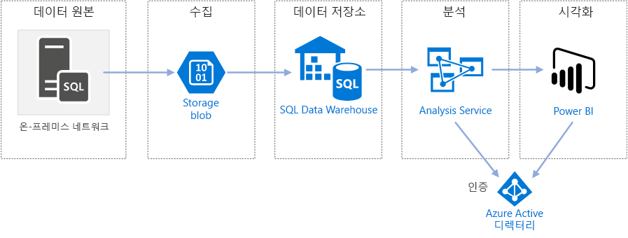

# SQL Data Warehouse를 사용하는 Azure의 Enterprise BIEnterprise BI in Azure with SQL Data Warehouse

이 참조 아키텍처는 온-프레미스 SQL Server 데이터베이스에서 SQL Data Warehouse로 데이터를 이동하고 분석을 위해 데이터를 변경하는 [ELT(추출 부하 변형)](../../data-guide/relational-data/etl.md#extract-load-and-transform-elt) 파이프라인을 구현합니다.This reference architecture implements an [extract, load, and transform (ELT)](../../data-guide/relational-data/etl.md#extract-load-and-transform-elt) pipeline that moves data from an on-premises SQL Server database into SQL Data Warehouse and transforms the data for analysis.

이 아키텍처에 대한 참조 구현은 [GitHub][github-folder]에서 사용할 수 있습니다.A reference implementation for this architecture is available on [GitHub][github-folder].

**시나리오**: 조직에는 SQL Server 데이터베이스 온-프레미스에 저장된 대규모 OLTP 데이터 세트가 있습니다.**Scenario**: An organization has a large OLTP data set stored in a SQL Server database on premises. 조직은 Power BI를 사용하여 분석을 수행하기 위해 SQL Data Warehouse를 사용하려고 합니다.The organization wants to use SQL Data Warehouse to perform analysis using Power BI.

이 참조 아키텍처는 일회성 또는 주문형 작업을 위해 설계되었습니다.This reference architecture is designed for one-time or on-demand jobs. 지속적으로(매시간 또는 매일) 데이터를 이동해야 하는 경우 Azure Data Factory를 사용하여 자동화된 워크플로를 정의하는 것이 좋습니다.If you need to move data on a continuing basis (hourly or daily), we recommend using Azure Data Factory to define an automated workflow. Data Factory를 사용하는 참조 아키텍처는 [SQL Data Warehouse 및 Azure Data Factory를 사용하는 자동화된 엔터프라이즈 BI][adf-ra]를 참조하세요.For a reference architecture that uses Data Factory, see [Automated enterprise BI with SQL Data Warehouse and Azure Data Factory][adf-ra].

## 아키텍처Architecture

이 아키텍처는 다음 구성 요소로 구성됩니다.The architecture consists of the following components.

### 데이터 원본Data source

**SQL Server**.**SQL Server**. 원본 데이터는 SQL Server 데이터베이스 온-프레미스에 위치합니다.The source data is located in a SQL Server database on premises. 온-프레미스 환경을 시뮬레이션하기 위해 이 아키텍처에 대한 배포 스크립트는 설치된 SQL Server를 사용하여 Azure에서 VM을 프로비전합니다.To simulate the on-premises environment, the deployment scripts for this architecture provision a VM in Azure with SQL Server installed. [Wide World Importers OLTP 예제 데이터베이스][wwi]는 원본 데이터로 사용됩니다.The [Wide World Importers OLTP sample database][wwi] is used as the source data.

### 수집 및 데이터 저장소Ingestion and data storage

**Blob Storage****Blob Storage**. Blob Storage는 SQL Data Warehouse로 로딩하기 전에 데이터를 복사하는 준비 영역으로 사용됩니다.Blob storage is used as a staging area to copy the data before loading it into SQL Data Warehouse.

**Azure SQL Data Warehouse****Azure SQL Data Warehouse**. [SQL Data Warehouse](/azure/sql-data-warehouse/)는 대규모 데이터 분석을 수행하도록 설계되고 배포된 시스템입니다.[SQL Data Warehouse](/azure/sql-data-warehouse/) is a distributed system designed to perform analytics on large data. 고성능 분석을 실행하는 데 적합하도록 하는 MPP(대규모 병렬 처리)를 지원합니다.It supports massive parallel processing (MPP), which makes it suitable for running high-performance analytics.

### 분석 및 보고Analysis and reporting

**Azure Analysis Services**.**Azure Analysis Services**. [Analysis Services](/azure/analysis-services/)는 데이터 모델링 기능을 제공하는 완전히 관리되는 서비스입니다.[Analysis Services](/azure/analysis-services/) is a fully managed service that provides data modeling capabilities. Analysis Services를 사용하여 사용자가 쿼리할 수 있는 의미 체계 모델을 만듭니다.Use Analysis Services to create a semantic model that users can query. Analysis Services는 BI 대시보드 시나리오에서 특히 유용합니다.Analysis Services is especially useful in a BI dashboard scenario. 이 아키텍처에서 Analysis Services는 의미 체계 모델을 처리하도록 데이터 웨어하우스에서 데이터를 읽고, 대시보드 쿼리를 효율적으로 처리합니다.In this architecture, Analysis Services reads data from the data warehouse to process the semantic model, and efficiently serves dashboard queries. 또한 신속한 쿼리 처리에 대한 복제본을 확장하여 탄력적 동시성을 지원합니다.It also supports elastic concurrency, by scaling out replicas for faster query processing.

현재 Azure Analysis Services는 테이블 형식 모델을 지원하지만 다차원 모델을 지원하지는 않습니다.Currently, Azure Analysis Services supports tabular models but not multidimensional models. 테이블 형식 모델은 관계형 모델링 구문(테이블 및 열)을 사용하는 반면 다차원 모델은 OLAP 모델링 구문(큐브, 차원 및 측정값)을 사용합니다.Tabular models use relational modeling constructs (tables and columns), whereas multidimensional models use OLAP modeling constructs (cubes, dimensions, and measures). 다차원 모델이 필요한 경우 SSAS(SQL Server Analysis Services)를 사용합니다.If you require multidimensional models, use SQL Server Analysis Services (SSAS). 자세한 내용은 [테이블 형식 및 다차원 솔루션 비교](/sql/analysis-services/comparing-tabular-and-multidimensional-solutions-ssas)를 참조하세요.For more information, see [Comparing tabular and multidimensional solutions](/sql/analysis-services/comparing-tabular-and-multidimensional-solutions-ssas).

**Power BI**.**Power BI**. Power BI는 비즈니스 정보에 대한 데이터를 분석하는 비즈니스 분석 도구 제품군입니다.Power BI is a suite of business analytics tools to analyze data for business insights. 이 아키텍처에서 Analysis Services에 저장된 의미 체계 모델을 쿼리합니다.In this architecture, it queries the semantic model stored in Analysis Services.

### AuthenticationAuthentication

**Azure Active Directory**(Azure AD)는 Power BI를 통해 Analysis Services 서버에 연결하는 사용자를 인증합니다.**Azure Active Directory (Azure AD)** authenticates users who connect to the Analysis Services server through Power BI.

## 데이터 파이프라인Data pipeline

이 참조 아키텍처는 데이터 원본으로 [WorldWideImporters](/sql/sample/world-wide-importers/wide-world-importers-oltp-database) 샘플 데이터베이스를 사용합니다.This reference architecture uses the [WorldWideImporters](/sql/sample/world-wide-importers/wide-world-importers-oltp-database) sample database as a data source. 데이터 파이프라인에는 다음 단계가 있습니다.The data pipeline has the following stages:

1. SQL Server에서 플랫 파일로 데이터를 내보냅니다(bcp 유틸리티).Export the data from SQL Server to flat files (bcp utility).
2. Azure Blob Storage로 플랫 파일을 복사합니다(AzCopy).Copy the flat files to Azure Blob Storage (AzCopy).
3. SQL Data Warehouse로 데이터를 로드합니다(PolyBase).Load the data into SQL Data Warehouse (PolyBase).
4. 데이터를 별모양 스키마로 변환합니다(T-SQL).Transform the data into a star schema (T-SQL).
5. 의미 체계 모델을 Analysis Services로 로드합니다(SQL Server Data Tools).Load a semantic model into Analysis Services (SQL Server Data Tools).

> [!NOTE]
> 1&ndash;3단계의 경우 Redgate Data Platform Studio를 사용하는 것이 좋습니다.For steps 1 &ndash; 3, consider using Redgate Data Platform Studio. Data Platform Studio는 가장 적합한 호환성 수정 및 최적화를 적용하므로 SQL Data Warehouse를 시작하는 가장 빠른 방법입니다.Data Platform Studio applies the most appropriate compatibility fixes and optimizations, so it's the quickest way to get started with SQL Data Warehouse. 자세한 내용은 [Redgate Data Platform Studio를 사용하여 데이터 로드](/azure/sql-data-warehouse/sql-data-warehouse-load-with-redgate)를 참조하세요.For more information, see [Load data with Redgate Data Platform Studio](/azure/sql-data-warehouse/sql-data-warehouse-load-with-redgate).
>

다음 섹션에서는 이러한 단계를 자세히 설명합니다.The next sections describe these stages in more detail.

### SQL Server에서 데이터 내보내기Export data from SQL Server

[bcp](/sql/tools/bcp-utility)(대량 복사 프로그램) 유틸리티는 SQL 테이블에서 플랫 텍스트 파일을 만드는 신속한 방법입니다.The [bcp](/sql/tools/bcp-utility) (bulk copy program) utility is a fast way to create flat text files from SQL tables. 이 단계에서는 내보내려는 열을 선택하지만 데이터를 변환하지 않습니다.In this step, you select the columns that you want to export, but don't transform the data. 모든 데이터 변환은 SQL Data Warehouse에서 수행되어야 합니다.Any data transformations should happen in SQL Data Warehouse.

**권장 사항:****Recommendations:**

가능하면 프로덕션 환경에서 리소스 경합을 최소화하기 위해 사용량이 적은 시간에 데이터 추출을 예약합니다.If possible, schedule data extraction during off-peak hours, to minimize resource contention in the production environment.

데이터베이스 서버에서 bcp를 실행하지 않습니다.Avoid running bcp on the database server. 대신 다른 컴퓨터에서 실행합니다.Instead, run it from another machine. 로컬 드라이브에 파일을 씁니다.Write the files to a local drive. 동시 쓰기를 처리하기에 충분한 I/O 리소스가 있는지 확인합니다.Ensure that you have sufficient I/O resources to handle the concurrent writes. 최상의 성능을 위해서 전용 고속 저장소 드라이브에 파일을 내보냅니다.For best performance, export the files to dedicated fast storage drives.

Gzip 압축된 형식으로 내보낸 데이터를 저장하여 네트워크 전송 속도를 높일 수 있습니다.You can speed up the network transfer by saving the exported data in Gzip compressed format. 그러나 압축된 파일을 웨어하우스로 로드하는 것은 압축되지 않은 파일을 로드하는 것보다 느리므로 더 빠른 네트워크 전송과 더 빠른 로딩 간에 균형 유지가 있습니다.However, loading compressed files into the warehouse is slower than loading uncompressed files, so there is a tradeoff between faster network transfer versus faster loading. Gzip 압축을 사용하려는 경우 단일 Gzip 파일을 만들지 마십시오.If you decide to use Gzip compression, don't create a single Gzip file. 대신 여러 개의 압축된 파일로 데이터를 분할합니다.Instead, split the data into multiple compressed files.

### 플랫 파일을 Blob Storage에 복사Copy flat files into blob storage

[AzCopy](/azure/storage/common/storage-use-azcopy) 유틸리티는 Azure Blob Storage로 데이터의 고성능 복사를 위해 설계되었습니다.The [AzCopy](/azure/storage/common/storage-use-azcopy) utility is designed for high-performance copying of data into Azure blob storage.

**권장 사항:****Recommendations:**

원본 데이터의 위치 근처 지역에서 저장소 계정을 만듭니다.Create the storage account in a region near the location of the source data. 동일한 지역에 저장소 계정 및 SQL Data Warehouse 인스턴스를 배포합니다.Deploy the storage account and the SQL Data Warehouse instance in the same region.

CPU 및 I/O 사용은 프로덕션 작업에 영향을 줄 수 있으므로 프로덕션 작업을 실행하는 동일한 컴퓨터에서 AzCopy를 실행하지 마십시오.Don't run AzCopy on the same machine that runs your production workloads, because the CPU and I/O consumption can interfere with the production workload.

업로드 속도를 확인하려면 먼저 업로드를 테스트합니다.Test the upload first to see what the upload speed is like. AzCopy에서 /NC 옵션을 사용하여 동시 복사 작업의 수를 지정할 수 있습니다.You can use the /NC option in AzCopy to specify the number of concurrent copy operations. 기본 값으로 시작한 다음, 이 설정으로 실험하여 성능을 조정합니다.Start with the default value, then experiment with this setting to tune the performance. 저대역폭 환경에서는 많은 수의 동시 작업으로 네트워크 연결에 과부하가 걸려 작업이 성공적으로 실행되지 못할 수 있습니다.In a low-bandwidth environment, too many concurrent operations can overwhelm the network connection and prevent the operations from completing successfully.

AzCopy는 공용 인터넷을 통해 저장소로 데이터를 이동합니다.AzCopy moves data to storage over the public internet. 충분히 빠르지 않은 경우 [ExpressRoute](/azure/expressroute/) 회로 설정을 고려합니다.If this isn't fast enough, consider setting up an [ExpressRoute](/azure/expressroute/) circuit. ExpressRoute는 Azure에 대한 전용 비공개 연결을 통해 데이터를 라우팅하는 서비스입니다.ExpressRoute is a service that routes your data through a dedicated private connection to Azure. 네트워크 연결 속도가 너무 느린 경우 다른 옵션은 디스크의 데이터를 Azure 데이터 센터로 물리적으로 배달하는 것입니다.Another option, if your network connection is too slow, is to physically ship the data on disk to an Azure datacenter. 자세한 내용은 [Azure 간 데이터 전송](/azure/architecture/data-guide/scenarios/data-transfer)을 참조하세요.For more information, see [Transferring data to and from Azure](/azure/architecture/data-guide/scenarios/data-transfer).

복사 작업 중 AzCopy는 임시 저널 파일을 만듭니다. 이를 통해 중단되는 경우(예: 네트워크 오류로 인해) AzCopy에서 작업을 다시 시작할 수 있습니다.During a copy operation, AzCopy creates a temporary journal file, which enables AzCopy to restart the operation if it gets interrupted (for example, due to a network error). 저널 파일을 저장할 디스크 공간이 충분한지 확인합니다.Make sure there is enough disk space to store the journal files. /Z 옵션을 사용하여 저널 파일이 기록되는 위치를 지정할 수 있습니다.You can use the /Z option to specify where the journal files are written.

### SQL Data Warehouse로 데이터 로드Load data into SQL Data Warehouse

[PolyBase](/sql/relational-databases/polybase/polybase-guide)를 사용하여 Blob Storage에서 데이터 웨어하우스로 파일을 로드합니다.Use [PolyBase](/sql/relational-databases/polybase/polybase-guide) to load the files from blob storage into the data warehouse. PolyBase는 SQL Data Warehouse의 MPP(대규모 병렬 처리) 아키텍처를 활용하도록 디자인되었으며 가장 빠르게 SQL Data Warehouse로 데이터를 로드할 수 있게 합니다.PolyBase is designed to leverage the MPP (Massively Parallel Processing) architecture of SQL Data Warehouse, which makes it the fastest way to load data into SQL Data Warehouse.

데이터 로드는 두 단계 프로세스로 이루어집니다.Loading the data is a two-step process:

1. 데이터에 대한 외부 테이블 집합을 만듭니다.Create a set of external tables for the data. 외부 테이블은 웨어하우스의 외부에 저장된 데이터를 가리키는 테이블 정의이며 &mdash; 이 경우 Blob Storage의 플랫 파일입니다.An external table is a table definition that points to data stored outside of the warehouse &mdash; in this case, the flat files in blob storage. 이 단계는 데이터를 웨어하우스로 이동하지 않습니다.This step does not move any data into the warehouse.
2. 준비 테이블을 만들고, 준비 테이블로 데이터를 로드합니다.Create staging tables, and load the data into the staging tables. 이 단계는 데이터를 웨어하우스로 복사합니다.This step copies the data into the warehouse.

**권장 사항:****Recommendations:**

많은 양의 데이터(1TB 이상)가 있고 병렬 처리를 활용하는 분석 워크 로드를 실행하는 경우 SQL Data Warehouse를 고려합니다.Consider SQL Data Warehouse when you have large amounts of data (more than 1 TB) and are running an analytics workload that will benefit from parallelism. SQL Data Warehouse는 OLTP 워크로드 또는 소량의 데이터 집합(< 250GB)에 잘 맞지 않습니다.SQL Data Warehouse is not a good fit for OLTP workloads or smaller data sets (< 250GB). 250GB보다 작은 데이터 집합의 경우 Azure SQL Database 또는 SQL Server를 고려합니다.For data sets less than 250GB, consider Azure SQL Database or SQL Server. 자세한 내용은 [데이터 웨어하우징](../../data-guide/relational-data/data-warehousing.md)을 참조하세요.For more information, see [Data warehousing](../../data-guide/relational-data/data-warehousing.md).

힙 테이블로 인덱싱되지 않은 준비 테이블을 만듭니다.Create the staging tables as heap tables, which are not indexed. 프로덕션 테이블을 만드는 쿼리는 전체 테이블 검색이 발생하므로 준비 테이블을 인덱싱할 이유가 없습니다.The queries that create the production tables will result in a full table scan, so there is no reason to index the staging tables.

PolyBase는 웨어하우스에서 자동으로 병렬 처리를 활용합니다.PolyBase automatically takes advantage of parallelism in the warehouse. 로드 성능은 DWU를 늘리면 확장합니다.The load performance scales as you increase DWUs. 최상의 성능을 위해 단일 로드 작업을 사용합니다.For best performance, use a single load operation. 입력 데이터를 청크로 분리하고 여러 동시 로드를 실행하는 성능 이점이 없습니다.There is no performance benefit to breaking the input data into chunks and running multiple concurrent loads.

PolyBase는 Gzip 압축된 파일을 읽을 수 있습니다.PolyBase can read Gzip compressed files. 그러나 파일 압축 풀기는 단일 스레드 작업이므로 압축된 파일당 단일 판독기만 사용됩니다.However, only a single reader is used per compressed file, because uncompressing the file is a single-threaded operation. 따라서 대량의 단일 압축된 파일을 로드하지 않도록 합니다.Therefore, avoid loading a single large compressed file. 대신 병렬 처리를 활용하기 위해 여러 개의 압축된 파일로 데이터를 분할합니다.Instead, split the data into multiple compressed files, in order to take advantage of parallelism.

다음과 같은 제한 사항을 고려해야 합니다.Be aware of the following limitations:

- PolyBase는 `varchar(8000)`, `nvarchar(4000)` 또는 `varbinary(8000)`의 최대 열 크기를 지원합니다.PolyBase supports a maximum column size of `varchar(8000)`, `nvarchar(4000)`, or `varbinary(8000)`. 이러한 한도를 초과하는 데이터가 있는 경우 한 가지 옵션은 내보낼 때 데이터를 청크로 분리한 다음, 가져온 후 청크를 다시 어셈블하는 것입니다.If you have data that exceeds these limits, one option is to break the data up into chunks when you export it, and then reassemble the chunks after import.

- PolyBase는 \n 또는 새 줄의 고정된 행 종결자를 사용합니다.PolyBase uses a fixed row terminator of \n or newline. 새 줄 문자가 원본 데이터에 표시되는 경우 문제가 발생할 수 있습니다.This can cause problems if newline characters appear in the source data.

- 원본 데이터 스키마는 SQL Data Warehouse에서 지원되지 않는 데이터 형식을 포함할 수 있습니다.Your source data schema might contain data types that are not supported in SQL Data Warehouse.

이러한 제한 사항을 해결하기 위해 필요한 전환을 수행하는 저장 프로시저를 만들 수 있습니다.To work around these limitations, you can create a stored procedure that performs the necessary conversions. bcp를 실행할 때 이 저장 프로시저를 참조합니다.Reference this stored procedure when you run bcp. 또는 [Redgate Data Platform Studio](/azure/sql-data-warehouse/sql-data-warehouse-load-with-redgate)에서 SQL Data Warehouse에서 지원되지 않는 데이터 형식을 자동으로 변환합니다.Alternatively, [Redgate Data Platform Studio](/azure/sql-data-warehouse/sql-data-warehouse-load-with-redgate) automatically converts data types that aren’t supported in SQL Data Warehouse.

자세한 내용은 다음 문서를 참조하세요.For more information, see the following articles:

- [Azure SQL Data Warehouse에 데이터를 로드하는 모범 사례](/azure/sql-data-warehouse/guidance-for-loading-data)[Best practices for loading data into Azure SQL Data Warehouse](/azure/sql-data-warehouse/guidance-for-loading-data).
- [SQL Data Warehouse로 스키마 마이그레이션Migrate your schemas to SQL Data Warehouse](/azure/sql-data-warehouse/sql-data-warehouse-migrate-schema)
- [SQL Data Warehouse의 테이블에 대한 데이터 형식을 정의하기 위한 지침Guidance for defining data types for tables in SQL Data Warehouse](/azure/sql-data-warehouse/sql-data-warehouse-tables-data-types)

### 데이터 변환Transform the data

데이터를 변환하고 프로덕션 테이블로 이동합니다.Transform the data and move it into production tables. 이 단계에서 데이터는 의미 체계 모델링에 적합한 차원 테이블 및 팩트 테이블을 사용하여 별모양 스키마로 변환됩니다.In this step, the data is transformed into a star schema with dimension tables and fact tables, suitable for semantic modeling.

전반적으로 최적의 쿼리 성능을 제공하는 클러스터형 columnstore 인덱스가 포함된 프로덕션 테이블을 만듭니다.Create the production tables with clustered columnstore indexes, which offer the best overall query performance. Columnstore 인덱스는 많은 레코드를 검색하는 쿼리에 최적화됩니다.Columnstore indexes are optimized for queries that scan many records. Columnstore 인덱스는 싱글톤 조회(즉, 단일 행 조회)도 수행하지 않습니다.Columnstore indexes don't perform as well for singleton lookups (that is, looking up a single row). 자주 싱글톤 조회를 수행해야 하는 경우 테이블에 비클러스터형 인덱스를 추가할 수 있습니다.If you need to perform frequent singleton lookups, you can add a non-clustered index to a table. 싱글톤 조회는 비클러스터형 인덱스를 사용하여 훨씬 더 빠르게 실행할 수 있습니다.Singleton lookups can run significantly faster using a non-clustered index. 그러나 싱글톤 조회는 일반적으로 OLTP 작업보다 데이터 웨어하우스 시나리오에서 덜 일반적입니다.However, singleton lookups are typically less common in data warehouse scenarios than OLTP workloads. 자세한 내용은 [SQL Data Warehouse의 테이블 인덱싱](/azure/sql-data-warehouse/sql-data-warehouse-tables-index)을 참조하세요.For more information, see [Indexing tables in SQL Data Warehouse](/azure/sql-data-warehouse/sql-data-warehouse-tables-index).

> [!NOTE]
> 클러스터형 columnstore 테이블은 `varchar(max)`, `nvarchar(max)` 또는 `varbinary(max)` 데이터 형식을 지원하지 않습니다.Clustered columnstore tables do not support `varchar(max)`, `nvarchar(max)`, or `varbinary(max)` data types. 이 경우 힙 또는 클러스터형 인덱스를 고려합니다.In that case, consider a heap or clustered index. 별도 테이블에 해당 열을 넣을 수 있습니다.You might put those columns into a separate table.

샘플 데이터베이스는 매우 크지 않으므로 파티션이 없는 복제된 테이블을 만들었습니다.Because the sample database is not very large, we created replicated tables with no partitions. 프로덕션 작업의 경우 분산 테이블을 사용하면 쿼리 성능을 개선할 수 있습니다.For production workloads, using distributed tables is likely to improve query performance. [Azure SQL Data Warehouse의 분산 테이블 디자인 지침](/azure/sql-data-warehouse/sql-data-warehouse-tables-distribute)을 참조하세요.See [Guidance for designing distributed tables in Azure SQL Data Warehouse](/azure/sql-data-warehouse/sql-data-warehouse-tables-distribute). 예제 스크립트는 정적 [리소스 클래스](/azure/sql-data-warehouse/resource-classes-for-workload-management)를 사용하여 쿼리를 실행합니다.Our example scripts run the queries using a static [resource class](/azure/sql-data-warehouse/resource-classes-for-workload-management).

### 의미 체계 모델 로드Load the semantic model

Azure Analysis Services에서 테이블 형식 모델로 데이터를 로드합니다.Load the data into a tabular model in Azure Analysis Services. 이 단계에서는 SSDT(SQL Server Data Tools)를 사용하여 의미 체계 데이터 모델을 만듭니다.In this step, you create a semantic data model by using SQL Server Data Tools (SSDT). 또한 Power BI Desktop 파일에서 가져와서 모델을 만들 수도 있습니다.You can also create a model by importing it from a Power BI Desktop file. SQL Data Warehouse는 외래 키를 지원하지 않으므로 테이블에서 조인할 수 있도록 관계를 의미 체계 모델에 추가해야 합니다.Because SQL Data Warehouse does not support foreign keys, you must add the relationships to the semantic model, so that you can join across tables.

### Power BI를 사용하여 데이터 시각화Use Power BI to visualize the data

Power BI는 Azure Analysis Services에 연결하기 위한 두 가지 옵션을 지원합니다.Power BI supports two options for connecting to Azure Analysis Services:

- 가져오기Import. 데이터를 Power BI 모델로 가져옵니다.The data is imported into the Power BI model.
- 라이브 연결Live Connection. 데이터를 Analysis Services에서 직접 가져옵니다.Data is pulled directly from Analysis Services.

Power BI 모델로 데이터를 복사할 필요가 없기 때문에 라이브 연결을 권장합니다.We recommend Live Connection because it doesn't require copying data into the Power BI model. 또한 DirectQuery를 사용하면 결과는 항상 최신 원본 데이터와 일치하게 됩니다.Also, using DirectQuery ensures that results are always consistent with the latest source data. 자세한 내용은 [Power BI로 연결](/azure/analysis-services/analysis-services-connect-pbi)을 참조하세요.For more information, see [Connect with Power BI](/azure/analysis-services/analysis-services-connect-pbi).

**권장 사항:****Recommendations:**

데이터 웨어하우스에 대해 직접 BI 대시보드 쿼리를 실행하지 마십시오.Avoid running BI dashboard queries directly against the data warehouse. BI 대시보드는 웨어하우스에 대한 직접 쿼리가 충족할 수 없는 매우 낮은 응답 시간이 필요합니다.BI dashboards require very low response times, which direct queries against the warehouse may be unable to satisfy. 또한 대시보드를 새로 고치면 성능에 영향을 줄 수 있는 동시 쿼리 수에 불리하게 간주됩니다.Also, refreshing the dashboard will count against the number of concurrent queries, which could impact performance.

Azure Analysis Services는 BI 대시보드의 쿼리 요구 사항을 처리하도록 설계되었으므로 Power BI에서 Analysis Services를 쿼리하는 것이 좋습니다.Azure Analysis Services is designed to handle the query requirements of a BI dashboard, so the recommended practice is to query Analysis Services from Power BI.

## 확장성 고려 사항Scalability considerations

### SQL Data WarehouseSQL Data Warehouse

SQL Data Warehouse를 사용하여 주문형 계산 리소스를 확장할 수 있습니다.With SQL Data Warehouse, you can scale out your compute resources on demand. 쿼리 엔진은 계산 노드 수에 따라 병렬 처리에 대한 쿼리를 최적화하고, 필요에 따라 노드 간에 데이터를 이동합니다.The query engine optimizes queries for parallel processing based on the number of compute nodes, and moves data between nodes as necessary. 자세한 내용은 [Azure SQL Data Warehouse에서 계산 관리](/azure/sql-data-warehouse/sql-data-warehouse-manage-compute-overview)를 참조하세요.For more information, see [Manage compute in Azure SQL Data Warehouse](/azure/sql-data-warehouse/sql-data-warehouse-manage-compute-overview).

### Analysis ServicesAnalysis Services

프로덕션 작업의 경우 Azure Analysis Services에 대한 표준 계층은 분할 및 DirectQuery를 지원하므로 이를 권장합니다.For production workloads, we recommend the Standard Tier for Azure Analysis Services, because it supports partitioning and DirectQuery. 계층 내에서 인스턴스 크기는 메모리 및 처리 용량을 결정합니다.Within a tier, the instance size determines the memory and processing power. 처리 능력은 QPU(쿼리 처리 단위)로 측정됩니다.Processing power is measured in Query Processing Units (QPUs). QPU 사용량을 모니터링하여 적절한 크기를 선택합니다.Monitor your QPU usage to select the appropriate size. 자세한 내용은 [서버 메트릭 모니터링](/azure/analysis-services/analysis-services-monitor)을 참조하세요.For more information, see [Monitor server metrics](/azure/analysis-services/analysis-services-monitor).

높은 부하 상태에서 쿼리 성능은 쿼리 동시성으로 인해 저하될 수 있습니다.Under high load, query performance can become degraded due to query concurrency. 더 많은 쿼리를 동시에 수행할 수 있도록 쿼리를 처리하는 복제본의 풀을 만들어 Analysis Services를 확장할 수 있습니다.You can scale out Analysis Services by creating a pool of replicas to process queries, so that more queries can be performed concurrently. 데이터 모델 처리 작업은 항상 주 서버에서 발생합니다.The work of processing the data model always happens on the primary server. 기본적으로 주 서버도 쿼리를 처리합니다.By default, the primary server also handles queries. 필요에 따라 쿼리 풀이 모든 쿼리를 처리하도록 단독으로 처리를 실행하도록 주 서버를 지정할 수 있습니다.Optionally, you can designate the primary server to run processing exclusively, so that the query pool handles all queries. 높은 처리 요구 사항이 있는 경우 쿼리 풀에서 처리를 구분해야 합니다.If you have high processing requirements, you should separate the processing from the query pool. 높은 쿼리 부하와 상대적으로 약한 처리가 있는 경우 쿼리 풀에 주 서버를 포함할 수 있습니다.If you have high query loads, and relatively light processing, you can include the primary server in the query pool. 자세한 내용은 [Azure Analysis Services 확장](/azure/analysis-services/analysis-services-scale-out)을 참조하세요.For more information, see [Azure Analysis Services scale-out](/azure/analysis-services/analysis-services-scale-out).

불필요한 처리 시간을 줄이기 위해 테이블 형식 모델을 논리적 부분으로 분할하는 데 파티션을 사용하는 것이 좋습니다.To reduce the amount of unnecessary processing, consider using partitions to divide the tabular model into logical parts. 각 파티션은 개별적으로 처리될 수 있습니다.Each partition can be processed separately. 자세한 내용은 [파티션](/sql/analysis-services/tabular-models/partitions-ssas-tabular)을 참조하세요.For more information, see [Partitions](/sql/analysis-services/tabular-models/partitions-ssas-tabular).

## 보안 고려 사항Security considerations

### Analysis Services 클라이언트의 IP 허용 목록IP whitelisting of Analysis Services clients

클라이언트 IP 주소를 허용 목록에 추가하는 데 Analysis Services 방화벽 기능을 사용하는 것이 좋습니다.Consider using the Analysis Services firewall feature to whitelist client IP addresses. 활성화된 경우 방화벽은 방화벽 규칙에 지정된 것 이외의 모든 클라이언트 연결을 차단합니다.If enabled, the firewall blocks all client connections other than those specified in the firewall rules. 기본 규칙은 Power BI 서비스를 허용 목록에 추가하지만 필요한 경우 이 규칙을 비활성화할 수 있습니다.The default rules whitelist the Power BI service, but you can disable this rule if desired. 자세한 내용은 [새 방화벽 기능을 사용하여 Azure Analysis Services 보안 강화](https://azure.microsoft.com/blog/hardening-azure-analysis-services-with-the-new-firewall-capability/)를 참조하세요.For more information, see [Hardening Azure Analysis Services with the new firewall capability](https://azure.microsoft.com/blog/hardening-azure-analysis-services-with-the-new-firewall-capability/).

### 권한 부여Authorization

Azure Analysis Services는 Azure AD(Azure Active Directory)를 사용하여 Analysis Services 서버에 연결하는 사용자를 인증합니다.Azure Analysis Services uses Azure Active Directory (Azure AD) to authenticate users who connect to an Analysis Services server. 역할을 만든 다음, 해당 역할에 Azure AD 사용자 또는 그룹을 할당하여 특정 사용자가 볼 수 있는 데이터를 제한할 수 있습니다.You can restrict what data a particular user is able to view, by creating roles and then assigning Azure AD users or groups to those roles. 각 역할의 경우 다음을 수행할 수 있습니다.For each role, you can:

- 테이블 또는 개별 열을 보호합니다.Protect tables or individual columns.
- 필터 식에 따라 개별 행을 보호합니다.Protect individual rows based on filter expressions.

자세한 내용은 [데이터베이스 역할 및 사용자 관리](/azure/analysis-services/analysis-services-database-users)를 참조하세요.For more information, see [Manage database roles and users](/azure/analysis-services/analysis-services-database-users).

## 솔루션 배포Deploy the solution

참조 구현을 배포하고 실행하려면 [GitHub readme][github-folder]의 단계를 따릅니다.To the deploy and run the reference implementation, follow the steps in the [GitHub readme][github-folder]. 다음을 배포합니다.It deploys the following:

- 온-프레미스 데이터베이스 서버를 시뮬레이션하는 Windows VMA Windows VM to simulate an on-premises database server. Power BI Desktop과 함께 SQL Server 2017 및 관련된 도구를 포함합니다.It includes SQL Server 2017 and related tools, along with Power BI Desktop.
- SQL Server 데이터베이스에서 가져온 데이터를 저장할 Blob Storage를 제공하는 Azure 스토리지 계정An Azure storage account that provides Blob storage to hold data exported from the SQL Server database.
- Azure SQL Data Warehouse 인스턴스An Azure SQL Data Warehouse instance.
- Azure Analysis Services 인스턴스An Azure Analysis Services instance.

## 다음 단계Next steps

- Azure Data Factory를 사용하여 ELT 파이프라인을 자동화합니다.Use Azure Data Factory to automate the ELT pipeline. [SQL Data Warehouse 및 Azure Data Factory를 사용하는 자동화된 Enterprise BI][adf-ra]를 참조하세요.See [Automated enterprise BI with SQL Data Warehouse and Azure Data Factory][adf-ra].

## 관련 리소스Related resources

동일한 기술 중 일부를 사용하여 특정 솔루션을 보여주는 다음 [Azure 예제 시나리오](/azure/architecture/example-scenario)를 검토해 보세요.You may want to review the following [Azure example scenarios](/azure/architecture/example-scenario) that demonstrate specific solutions using some of the same technologies:

- [영업 및 마케팅에 대한 데이터 웨어하우징 및 분석Data warehousing and analytics for sales and marketing](/azure/architecture/example-scenario/data/data-warehouse)
- [기존 온-프레미스 SSIS와 Azure Data Factory를 사용한 하이브리드 ETLHybrid ETL with existing on-premises SSIS and Azure Data Factory](/azure/architecture/example-scenario/data/hybrid-etl-with-adf)

<!-- links -->

[adf-ra]: ./enterprise-bi-adf.md
[github-folder]: https://github.com/mspnp/reference-architectures/tree/master/data/enterprise_bi_sqldw
[wwi]: /sql/sample/world-wide-importers/wide-world-importers-oltp-database
