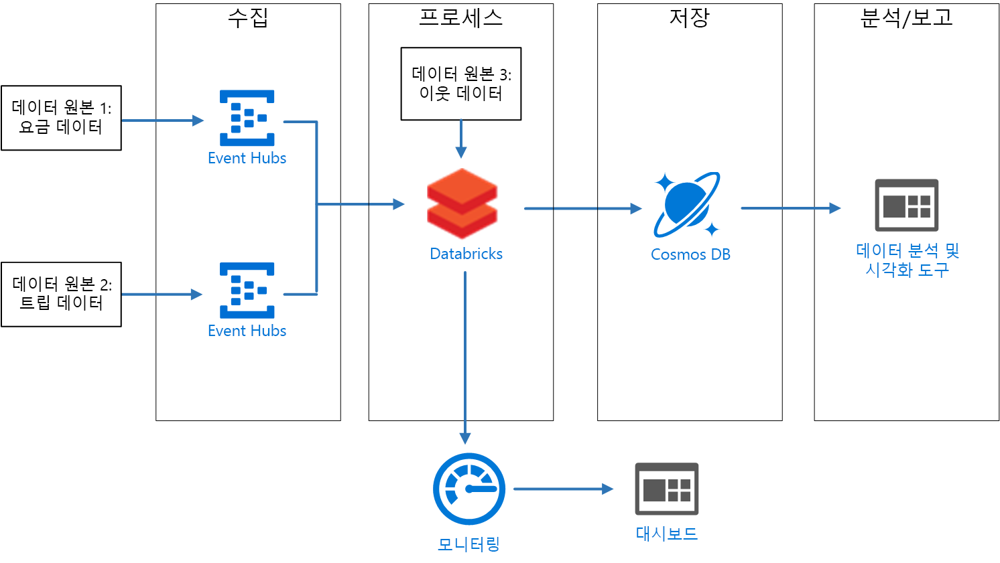
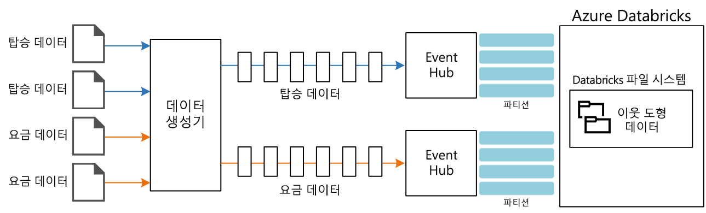

# <a name="create-a-stream-processing-pipeline-with-azure-databricks"></a><span data-ttu-id="7fddd-103">Azure Databricks를 사용하는 스트림 처리 파이프라인 만들기</span><span class="sxs-lookup"><span data-stu-id="7fddd-103">Create a stream processing pipeline with Azure Databricks</span></span>

<span data-ttu-id="7fddd-104">이 참조 아키텍처는 엔드투엔드 [스트림 처리](/azure/architecture/data-guide/big-data/real-time-processing) 파이프라인을 보여줍니다.</span><span class="sxs-lookup"><span data-stu-id="7fddd-104">This reference architecture shows an end-to-end [stream processing](/azure/architecture/data-guide/big-data/real-time-processing) pipeline.</span></span> <span data-ttu-id="7fddd-105">이 유형의 파이프라인은 수집, 처리, 저장, 분석 및 보고의 4단계로 구성됩니다.</span><span class="sxs-lookup"><span data-stu-id="7fddd-105">This type of pipeline has four stages: ingest, process, store, and analysis and reporting.</span></span> <span data-ttu-id="7fddd-106">이 참조 아키텍처의 경우 파이프라인은 실시간으로 두 원본에서 데이터를 수집하고, 각 스트림의 관련 레코드에 대해 조인을 수행하고, 결과를 보강하고, 평균을 계산합니다.</span><span class="sxs-lookup"><span data-stu-id="7fddd-106">For this reference architecture, the pipeline ingests data from two sources, performs a join on related records from each stream, enriches the result, and calculates an average in real time.</span></span> <span data-ttu-id="7fddd-107">추가 분석을 위해 결과가 저장됩니다.</span><span class="sxs-lookup"><span data-stu-id="7fddd-107">The results are stored for further analysis.</span></span> <span data-ttu-id="7fddd-108">[**이 솔루션을 배포합니다**](#deploy-the-solution).</span><span class="sxs-lookup"><span data-stu-id="7fddd-108">[**Deploy this solution**](#deploy-the-solution).</span></span>



<span data-ttu-id="7fddd-110">**시나리오**: 한 택시 회사에서 각 택시 운행 데이터를 수집합니다.</span><span class="sxs-lookup"><span data-stu-id="7fddd-110">**Scenario**: A taxi company collects data about each taxi trip.</span></span> <span data-ttu-id="7fddd-111">이 시나리오의 경우 두 개의 별도 디바이스가 데이터를 전송하고 있다고 가정합니다.</span><span class="sxs-lookup"><span data-stu-id="7fddd-111">For this scenario, we assume there are two separate devices sending data.</span></span> <span data-ttu-id="7fddd-112">택시에는 각 승객 &mdash; 기간, 거리, 승차 및 하차 위치에 대한 정보를 전송하는 미터가 있습니다.</span><span class="sxs-lookup"><span data-stu-id="7fddd-112">The taxi has a meter that sends information about each ride &mdash; the duration, distance, and pickup and dropoff locations.</span></span> <span data-ttu-id="7fddd-113">별도 디바이스는 고객의 지불을 수락하고 요금에 대한 데이터를 보냅니다.</span><span class="sxs-lookup"><span data-stu-id="7fddd-113">A separate device accepts payments from customers and sends data about fares.</span></span> <span data-ttu-id="7fddd-114">택시 회사는 승객 추세를 파악하기 위해 각 환경의 마일당 평균 팁을 실시간으로 계산하려고 합니다.</span><span class="sxs-lookup"><span data-stu-id="7fddd-114">To spot ridership trends, the taxi company wants to calculate the average tip per mile driven, in real time, for each neighborhood.</span></span>

## <a name="architecture"></a><span data-ttu-id="7fddd-115">아키텍처</span><span class="sxs-lookup"><span data-stu-id="7fddd-115">Architecture</span></span>

<span data-ttu-id="7fddd-116">이 아키텍처는 다음 구성 요소로 구성됩니다.</span><span class="sxs-lookup"><span data-stu-id="7fddd-116">The architecture consists of the following components.</span></span>

<span data-ttu-id="7fddd-117">**데이터 원본**.</span><span class="sxs-lookup"><span data-stu-id="7fddd-117">**Data sources**.</span></span> <span data-ttu-id="7fddd-118">이 아키텍처에는 실시간으로 데이터 스트림을 생성하는 두 개의 데이터 원본이 있습니다.</span><span class="sxs-lookup"><span data-stu-id="7fddd-118">In this architecture, there are two data sources that generate data streams in real time.</span></span> <span data-ttu-id="7fddd-119">첫 번째 스트림에는 승객 정보가 포함되고 두 번째 스트림에는 요금 정보가 포함됩니다.</span><span class="sxs-lookup"><span data-stu-id="7fddd-119">The first stream contains ride information, and the second contains fare information.</span></span> <span data-ttu-id="7fddd-120">참조 아키텍처에는 정적 파일 집합을 읽고 Event Hubs에 데이터를 푸시하는 시뮬레이트된 데이터 생성기가 포함됩니다.</span><span class="sxs-lookup"><span data-stu-id="7fddd-120">The reference architecture includes a simulated data generator that reads from a set of static files and pushes the data to Event Hubs.</span></span> <span data-ttu-id="7fddd-121">실제 애플리케이션의 데이터 원본은 택시에 설치되는 디바이스입니다.</span><span class="sxs-lookup"><span data-stu-id="7fddd-121">The data sources in a real application would be devices installed in the taxi cabs.</span></span>

<span data-ttu-id="7fddd-122">**Azure Event Hubs** -</span><span class="sxs-lookup"><span data-stu-id="7fddd-122">**Azure Event Hubs**.</span></span> <span data-ttu-id="7fddd-123">[Event Hubs](/azure/event-hubs/)는 이벤트 수집 서비스입니다.</span><span class="sxs-lookup"><span data-stu-id="7fddd-123">[Event Hubs](/azure/event-hubs/) is an event ingestion service.</span></span> <span data-ttu-id="7fddd-124">이 아키텍처는 각 데이터 원본에 대해 하나씩 두 개의 이벤트 허브 인스턴스를 사용합니다.</span><span class="sxs-lookup"><span data-stu-id="7fddd-124">This architecture uses two event hub instances, one for each data source.</span></span> <span data-ttu-id="7fddd-125">각 데이터 원본은 연결된 이벤트 허브에 데이터 스트림을 보냅니다.</span><span class="sxs-lookup"><span data-stu-id="7fddd-125">Each data source sends a stream of data to the associated event hub.</span></span>

<span data-ttu-id="7fddd-126">**Azure Databricks**.</span><span class="sxs-lookup"><span data-stu-id="7fddd-126">**Azure Databricks**.</span></span> <span data-ttu-id="7fddd-127">[Databricks](/azure/azure-databricks/)는 Microsoft Azure Cloud Services 플랫폼에 대해 최적화된 Apache Spark 기반 분석 플랫폼입니다.</span><span class="sxs-lookup"><span data-stu-id="7fddd-127">[Databricks](/azure/azure-databricks/) is an Apache Spark-based analytics platform optimized for the Microsoft Azure cloud services platform.</span></span> <span data-ttu-id="7fddd-128">Databricks는 Databricks 파일 시스템에 저장된 환경 데이터를 사용하여 택시 운행과 요금 데이터 간의 상관 관계를 지정하고 상관 관계 데이터를 보강하는 데 사용됩니다.</span><span class="sxs-lookup"><span data-stu-id="7fddd-128">Databricks is used to correlate of the taxi ride and fare data, and also to enrich the correlated data with neighborhood data stored in the Databricks file system.</span></span>

<span data-ttu-id="7fddd-129">**Cosmos DB**</span><span class="sxs-lookup"><span data-stu-id="7fddd-129">**Cosmos DB**.</span></span> <span data-ttu-id="7fddd-130">Azure Databricks 작업의 출력은 Cassandra API를 사용하여 [Cosmos DB](/azure/cosmos-db/)에 기록되는 일련의 레코드입니다.</span><span class="sxs-lookup"><span data-stu-id="7fddd-130">The output from Azure Databricks job is a series of records, which are written to [Cosmos DB](/azure/cosmos-db/) using the Cassandra API.</span></span> <span data-ttu-id="7fddd-131">Cassandra API를 사용하는 이유는 시계열 데이터 모델링을 지원하기 때문입니다.</span><span class="sxs-lookup"><span data-stu-id="7fddd-131">The Cassandra API is used because it supports time series data modeling.</span></span>

<span data-ttu-id="7fddd-132">**Azure Log Analytics**.</span><span class="sxs-lookup"><span data-stu-id="7fddd-132">**Azure Log Analytics**.</span></span> <span data-ttu-id="7fddd-133">[Azure Monitor](/azure/monitoring-and-diagnostics/)를 통해 수집되는 애플리케이션 로그 데이터는 [Log Analytics 작업 영역](/azure/log-analytics)에 저장됩니다.</span><span class="sxs-lookup"><span data-stu-id="7fddd-133">Application log data collected by [Azure Monitor](/azure/monitoring-and-diagnostics/) is stored in a [Log Analytics workspace](/azure/log-analytics).</span></span> <span data-ttu-id="7fddd-134">Log Analytics 쿼리는 메트릭을 분석 및 시각화하고 로그 메시지를 검사하여 애플리케이션 내부의 문제를 식별하는 데 사용할 수 있습니다.</span><span class="sxs-lookup"><span data-stu-id="7fddd-134">Log Analytics queries can be used to analyze and visualize metrics and inspect log messages to identify issues within the application.</span></span>

## <a name="data-ingestion"></a><span data-ttu-id="7fddd-135">데이터 수집</span><span class="sxs-lookup"><span data-stu-id="7fddd-135">Data ingestion</span></span>

<!-- markdownlint-disable MD033 -->

<span data-ttu-id="7fddd-136">데이터 원본을 시뮬레이션하기 위해 이 참조 아키텍처는 [뉴욕시 택시 데이터](https://uofi.app.box.com/v/NYCtaxidata/folder/2332218797) 데이터 세트<sup>[[1]](#note1)</sup>를 사용합니다.</span><span class="sxs-lookup"><span data-stu-id="7fddd-136">To simulate a data source, this reference architecture uses the [New York City Taxi Data](https://uofi.app.box.com/v/NYCtaxidata/folder/2332218797) dataset<sup>[[1]](#note1)</sup>.</span></span> <span data-ttu-id="7fddd-137">이 데이터 세트에는 4년(2010&ndash;2013) 간의 뉴욕시 택시 운행 데이터가 포함됩니다.</span><span class="sxs-lookup"><span data-stu-id="7fddd-137">This dataset contains data about taxi trips in New York City over a four-year period (2010 &ndash; 2013).</span></span> <span data-ttu-id="7fddd-138">두 가지 유형의 레코드를 포함합니다. 그것은 바로 승객 데이터와 요금 데이터입니다.</span><span class="sxs-lookup"><span data-stu-id="7fddd-138">It contains two types of record: Ride data and fare data.</span></span> <span data-ttu-id="7fddd-139">승객 데이터에는 여정 기간, 여정 거리 및 승차 및 하차 위치가 포함됩니다.</span><span class="sxs-lookup"><span data-stu-id="7fddd-139">Ride data includes trip duration, trip distance, and pickup and dropoff location.</span></span> <span data-ttu-id="7fddd-140">요금 데이터에는 요금, 세금 및 팁 금액이 포함됩니다.</span><span class="sxs-lookup"><span data-stu-id="7fddd-140">Fare data includes fare, tax, and tip amounts.</span></span> <span data-ttu-id="7fddd-141">레코드 형식 모두의 공통 필드에는 등록 번호, 택시 라이선스 및 공급 업체 ID가 포함됩니다.</span><span class="sxs-lookup"><span data-stu-id="7fddd-141">Common fields in both record types include medallion number, hack license, and vendor ID.</span></span> <span data-ttu-id="7fddd-142">이러한 세 필드는 택시와 드라이버를 고유하게 식별합니다.</span><span class="sxs-lookup"><span data-stu-id="7fddd-142">Together these three fields uniquely identify a taxi plus a driver.</span></span> <span data-ttu-id="7fddd-143">데이터가 CSV 형식으로 저장됩니다.</span><span class="sxs-lookup"><span data-stu-id="7fddd-143">The data is stored in CSV format.</span></span>

> <span data-ttu-id="7fddd-144">[1] <span id="note1">Donovan, Brian; Work, Dan(2016): 뉴욕시 택시 운행 데이터(2010-2013).</span><span class="sxs-lookup"><span data-stu-id="7fddd-144">[1] <span id="note1">Donovan, Brian; Work, Dan (2016): New York City Taxi Trip Data (2010-2013).</span></span> <span data-ttu-id="7fddd-145">University of Illinois at Urbana-Champaign</span><span class="sxs-lookup"><span data-stu-id="7fddd-145">University of Illinois at Urbana-Champaign.</span></span> <https://doi.org/10.13012/J8PN93H8>

<!-- markdownlint-enable MD033 -->

<span data-ttu-id="7fddd-146">데이터 생성기는 레코드를 읽고 Azure Event Hubs로 전송하는 .NET Core 애플리케이션입니다.</span><span class="sxs-lookup"><span data-stu-id="7fddd-146">The data generator is a .NET Core application that reads the records and sends them to Azure Event Hubs.</span></span> <span data-ttu-id="7fddd-147">생성기는 승객 데이터를 JSON 형식으로 보내고, 요금 데이터를 CSV 형식으로 전송합니다.</span><span class="sxs-lookup"><span data-stu-id="7fddd-147">The generator sends ride data in JSON format and fare data in CSV format.</span></span>

<span data-ttu-id="7fddd-148">Event Hubs는 [파티션](/azure/event-hubs/event-hubs-features#partitions)을 사용하여 데이터를 분할합니다.</span><span class="sxs-lookup"><span data-stu-id="7fddd-148">Event Hubs uses [partitions](/azure/event-hubs/event-hubs-features#partitions) to segment the data.</span></span> <span data-ttu-id="7fddd-149">파티션을 사용하면 소비자가 각 파티션을 병렬로 읽을 수 있습니다.</span><span class="sxs-lookup"><span data-stu-id="7fddd-149">Partitions allow a consumer to read each partition in parallel.</span></span> <span data-ttu-id="7fddd-150">Event Hubs에 데이터를 보낼 때 파티션 키를 명시적으로 지정할 수 있습니다.</span><span class="sxs-lookup"><span data-stu-id="7fddd-150">When you send data to Event Hubs, you can specify the partition key explicitly.</span></span> <span data-ttu-id="7fddd-151">그렇지 않으면 레코드는 라운드 로빈 방식으로 파티션에 할당됩니다.</span><span class="sxs-lookup"><span data-stu-id="7fddd-151">Otherwise, records are assigned to partitions in round-robin fashion.</span></span>

<span data-ttu-id="7fddd-152">이 시나리오에서 승객 데이터 및 요금 데이터는 지정된 택시에 대해 동일한 파티션 ID를 사용해야 합니다.</span><span class="sxs-lookup"><span data-stu-id="7fddd-152">In this scenario, ride data and fare data should end up with the same partition ID for a given taxi cab.</span></span> <span data-ttu-id="7fddd-153">그러면 Databricks가 두 스트림의 상관 관계를 지정할 때 일정 수준의 병렬 처리를 적용할 수 있습니다.</span><span class="sxs-lookup"><span data-stu-id="7fddd-153">This enables Databricks to apply a degree of parallelism when it correlates the two streams.</span></span> <span data-ttu-id="7fddd-154">승객 데이터의 *n* 파티션에 있는 레코드는 요금 데이터의 *n* 파티션에 있는 레코드와 일치합니다.</span><span class="sxs-lookup"><span data-stu-id="7fddd-154">A record in partition *n* of the ride data will match a record in partition *n* of the fare data.</span></span>



<span data-ttu-id="7fddd-156">데이터 생성기에서 두 레코드 형식에 대한 공통 데이터 모델에는 `Medallion`, `HackLicense` 및 `VendorId`의 연결인 `PartitionKey` 속성이 있습니다.</span><span class="sxs-lookup"><span data-stu-id="7fddd-156">In the data generator, the common data model for both record types has a `PartitionKey` property that is the concatenation of `Medallion`, `HackLicense`, and `VendorId`.</span></span>

```csharp
public abstract class TaxiData
{
    public TaxiData()
    {
    }

    [JsonProperty]
    public long Medallion { get; set; }

    [JsonProperty]
    public long HackLicense { get; set; }

    [JsonProperty]
    public string VendorId { get; set; }

    [JsonProperty]
    public DateTimeOffset PickupTime { get; set; }

    [JsonIgnore]
    public string PartitionKey
    {
        get => $"{Medallion}_{HackLicense}_{VendorId}";
    }
```

<span data-ttu-id="7fddd-157">이 속성을 사용하여 Event Hubs로 전송하는 경우 명시적인 파티션 키를 제공합니다.</span><span class="sxs-lookup"><span data-stu-id="7fddd-157">This property is used to provide an explicit partition key when sending to Event Hubs:</span></span>

```csharp
using (var client = pool.GetObject())
{
    return client.Value.SendAsync(new EventData(Encoding.UTF8.GetBytes(
        t.GetData(dataFormat))), t.PartitionKey);
}
```

### <a name="event-hubs"></a><span data-ttu-id="7fddd-158">Event Hubs</span><span class="sxs-lookup"><span data-stu-id="7fddd-158">Event Hubs</span></span>

<span data-ttu-id="7fddd-159">Event Hubs의 처리량 용량은 [처리량 단위](/azure/event-hubs/event-hubs-features#throughput-units)로 제어됩니다.</span><span class="sxs-lookup"><span data-stu-id="7fddd-159">The throughput capacity of Event Hubs is measured in [throughput units](/azure/event-hubs/event-hubs-features#throughput-units).</span></span> <span data-ttu-id="7fddd-160">[자동 팽창](/azure/event-hubs/event-hubs-auto-inflate)을 사용하도록 설정하여 이벤트 허브를 자동 크기 조정할 수 있습니다. 그러면 트래픽에 따라 처리량 단위를 구성된 최댓값까지 자동으로 크기 조정합니다.</span><span class="sxs-lookup"><span data-stu-id="7fddd-160">You can autoscale an event hub by enabling [auto-inflate](/azure/event-hubs/event-hubs-auto-inflate), which automatically scales the throughput units based on traffic, up to a configured maximum.</span></span>

## <a name="stream-processing"></a><span data-ttu-id="7fddd-161">스트림 처리</span><span class="sxs-lookup"><span data-stu-id="7fddd-161">Stream processing</span></span>

<span data-ttu-id="7fddd-162">Azure Databricks에서 데이터 처리는 작업을 통해 수행됩니다.</span><span class="sxs-lookup"><span data-stu-id="7fddd-162">In Azure Databricks, data processing is performed by a job.</span></span> <span data-ttu-id="7fddd-163">작업은 클러스터에 할당되고 클러스터에서 실행됩니다.</span><span class="sxs-lookup"><span data-stu-id="7fddd-163">The job is assigned to and runs on a cluster.</span></span> <span data-ttu-id="7fddd-164">작업은 Java로 작성된 사용자 지정 코드이거나 Spark [Notebook](https://docs.databricks.com/user-guide/notebooks/index.html)입니다.</span><span class="sxs-lookup"><span data-stu-id="7fddd-164">The job can either be custom code written in Java, or a Spark [notebook](https://docs.databricks.com/user-guide/notebooks/index.html).</span></span>

<span data-ttu-id="7fddd-165">이 참조 아키텍처의 작업은 클래스가 Java 및 Scala로 작성된 Java 아카이브입니다.</span><span class="sxs-lookup"><span data-stu-id="7fddd-165">In this reference architecture, the job is a Java archive with classes written in both Java and Scala.</span></span> <span data-ttu-id="7fddd-166">Databricks 작업의 Java 아카이브를 지정할 때 Databricks 클러스터의 실행에 대한 클래스가 지정됩니다.</span><span class="sxs-lookup"><span data-stu-id="7fddd-166">When specifying the Java archive for a Databricks job, the class is specified for execution by the Databricks cluster.</span></span> <span data-ttu-id="7fddd-167">여기서 **com.microsoft.pnp.TaxiCabReader** 클래스의 **주** 메서드에는 데이터 처리 논리가 포함됩니다.</span><span class="sxs-lookup"><span data-stu-id="7fddd-167">Here, the **main** method of the **com.microsoft.pnp.TaxiCabReader** class contains the data processing logic.</span></span>

### <a name="reading-the-stream-from-the-two-event-hub-instances"></a><span data-ttu-id="7fddd-168">두 이벤트 허브 인스턴스에서 스트림 읽기</span><span class="sxs-lookup"><span data-stu-id="7fddd-168">Reading the stream from the two event hub instances</span></span>

<span data-ttu-id="7fddd-169">데이터 처리 논리는 [Spark 구조적 스트리밍](https://spark.apache.org/docs/2.1.2/structured-streaming-programming-guide.html)을 사용하여 두 Azure 이벤트 허브 인스턴스에서 스트림을 읽습니다.</span><span class="sxs-lookup"><span data-stu-id="7fddd-169">The data processing logic uses [Spark structured streaming](https://spark.apache.org/docs/2.1.2/structured-streaming-programming-guide.html) to read from the two Azure event hub instances:</span></span>

```scala
val rideEventHubOptions = EventHubsConf(rideEventHubConnectionString)
      .setConsumerGroup(conf.taxiRideConsumerGroup())
      .setStartingPosition(EventPosition.fromStartOfStream)
    val rideEvents = spark.readStream
      .format("eventhubs")
      .options(rideEventHubOptions.toMap)
      .load

    val fareEventHubOptions = EventHubsConf(fareEventHubConnectionString)
      .setConsumerGroup(conf.taxiFareConsumerGroup())
      .setStartingPosition(EventPosition.fromStartOfStream)
    val fareEvents = spark.readStream
      .format("eventhubs")
      .options(fareEventHubOptions.toMap)
      .load
```

### <a name="enriching-the-data-with-the-neighborhood-information"></a><span data-ttu-id="7fddd-170">환경 정보를 사용하여 데이터 보강</span><span class="sxs-lookup"><span data-stu-id="7fddd-170">Enriching the data with the neighborhood information</span></span>

<span data-ttu-id="7fddd-171">승객 데이터에는 승차 및 하차 위치의 위도와 경도 좌표가 포함됩니다.</span><span class="sxs-lookup"><span data-stu-id="7fddd-171">The ride data includes the latitude and longitude coordinates of the pick up and drop off locations.</span></span> <span data-ttu-id="7fddd-172">이러한 좌표는 유용하기는 하지만 분석에 쉽게 사용하기 어렵습니다.</span><span class="sxs-lookup"><span data-stu-id="7fddd-172">While these coordinates are useful, they are not easily consumed for analysis.</span></span> <span data-ttu-id="7fddd-173">따라서 [셰이프 파일](https://en.wikipedia.org/wiki/Shapefile)에서 읽은 환경 데이터를 사용하여 이 데이터를 보강합니다.</span><span class="sxs-lookup"><span data-stu-id="7fddd-173">Therefore, this data is enriched with neighborhood data that is read from a [shapefile](https://en.wikipedia.org/wiki/Shapefile).</span></span>

<span data-ttu-id="7fddd-174">셰이프 파일 형식은 이진이고 간단하게 구문 분석할 수 없지만, [GeoTools](http://geotools.org/) 라이브러리에서 셰이프 파일 형식을 사용하는 지리 공간 데이터를 분석할 수 있는 도구를 제공합니다.</span><span class="sxs-lookup"><span data-stu-id="7fddd-174">The shapefile format is binary and not easily parsed, but the [GeoTools](http://geotools.org/) library provides tools for geospatial data that use the shapefile format.</span></span> <span data-ttu-id="7fddd-175">이 라이브러리는 **com.microsoft.pnp.GeoFinder** 클래스에 사용되어 승차 및 하차 좌표를 기준으로 환경 이름을 확인합니다.</span><span class="sxs-lookup"><span data-stu-id="7fddd-175">This library is used in the **com.microsoft.pnp.GeoFinder** class to determine the neighborhood name based on the pick up and drop off coordinates.</span></span>

```scala
val neighborhoodFinder = (lon: Double, lat: Double) => {
      NeighborhoodFinder.getNeighborhood(lon, lat).get()
    }
```

### <a name="joining-the-ride-and-fare-data"></a><span data-ttu-id="7fddd-176">승객 및 요금 데이터 조인</span><span class="sxs-lookup"><span data-stu-id="7fddd-176">Joining the ride and fare data</span></span>

<span data-ttu-id="7fddd-177">먼저 승객 및 요금 데이터가 변환됩니다.</span><span class="sxs-lookup"><span data-stu-id="7fddd-177">First the ride and fare data is transformed:</span></span>

```scala
    val rides = transformedRides
      .filter(r => {
        if (r.isNullAt(r.fieldIndex("errorMessage"))) {
          true
        }
        else {
          malformedRides.add(1)
          false
        }
      })
      .select(
        $"ride.*",
        to_neighborhood($"ride.pickupLon", $"ride.pickupLat")
          .as("pickupNeighborhood"),
        to_neighborhood($"ride.dropoffLon", $"ride.dropoffLat")
          .as("dropoffNeighborhood")
      )
      .withWatermark("pickupTime", conf.taxiRideWatermarkInterval())

    val fares = transformedFares
      .filter(r => {
        if (r.isNullAt(r.fieldIndex("errorMessage"))) {
          true
        }
        else {
          malformedFares.add(1)
          false
        }
      })
      .select(
        $"fare.*",
        $"pickupTime"
      )
      .withWatermark("pickupTime", conf.taxiFareWatermarkInterval())
```

<span data-ttu-id="7fddd-178">그런 다음, 승객 데이터가 요금 데이터에 조인됩니다.</span><span class="sxs-lookup"><span data-stu-id="7fddd-178">And then the ride data is joined with the fare data:</span></span>

```scala
val mergedTaxiTrip = rides.join(fares, Seq("medallion", "hackLicense", "vendorId", "pickupTime"))
```

### <a name="processing-the-data-and-inserting-into-cosmos-db"></a><span data-ttu-id="7fddd-179">데이터를 처리하여 Cosmos DB에 삽입</span><span class="sxs-lookup"><span data-stu-id="7fddd-179">Processing the data and inserting into Cosmos DB</span></span>

<span data-ttu-id="7fddd-180">지정된 시간 간격마다 각 환경의 평균 요금이 계산됩니다.</span><span class="sxs-lookup"><span data-stu-id="7fddd-180">The average fare amount for each neighborhood is calculated for a given time interval:</span></span>

```scala
val maxAvgFarePerNeighborhood = mergedTaxiTrip.selectExpr("medallion", "hackLicense", "vendorId", "pickupTime", "rateCode", "storeAndForwardFlag", "dropoffTime", "passengerCount", "tripTimeInSeconds", "tripDistanceInMiles", "pickupLon", "pickupLat", "dropoffLon", "dropoffLat", "paymentType", "fareAmount", "surcharge", "mtaTax", "tipAmount", "tollsAmount", "totalAmount", "pickupNeighborhood", "dropoffNeighborhood")
      .groupBy(window($"pickupTime", conf.windowInterval()), $"pickupNeighborhood")
      .agg(
        count("*").as("rideCount"),
        sum($"fareAmount").as("totalFareAmount"),
        sum($"tipAmount").as("totalTipAmount")
      )
      .select($"window.start", $"window.end", $"pickupNeighborhood", $"rideCount", $"totalFareAmount", $"totalTipAmount")
```

<span data-ttu-id="7fddd-181">계산된 요금은 Cosmos DB에 삽입됩니다.</span><span class="sxs-lookup"><span data-stu-id="7fddd-181">Which is then inserted into Cosmos DB:</span></span>

```scala
maxAvgFarePerNeighborhood
      .writeStream
      .queryName("maxAvgFarePerNeighborhood_cassandra_insert")
      .outputMode(OutputMode.Append())
      .foreach(new CassandraSinkForeach(connector))
      .start()
      .awaitTermination()
```

## <a name="security-considerations"></a><span data-ttu-id="7fddd-182">보안 고려 사항</span><span class="sxs-lookup"><span data-stu-id="7fddd-182">Security considerations</span></span>

<span data-ttu-id="7fddd-183">Azure Database 작업 영역에 대한 액세스는 [관리자 콘솔](https://docs.databricks.com/administration-guide/admin-settings/index.html)을 사용하여 제어됩니다.</span><span class="sxs-lookup"><span data-stu-id="7fddd-183">Access to the Azure Database workspace is controlled using the [administrator console](https://docs.databricks.com/administration-guide/admin-settings/index.html).</span></span> <span data-ttu-id="7fddd-184">관리자 콘솔에는 사용자를 추가하고, 사용자 권한을 관리하고, Single Sign-On을 설정하는 기능이 포함되어 있습니다.</span><span class="sxs-lookup"><span data-stu-id="7fddd-184">The administrator console includes functionality to add users, manage user permissions, and set up single sign-on.</span></span> <span data-ttu-id="7fddd-185">관리자 콘솔을 통해 작업 영역, 클러스터, 작업 및 테이블에 대한 액세스 제어를 설정할 수도 있습니다.</span><span class="sxs-lookup"><span data-stu-id="7fddd-185">Access control for workspaces, clusters, jobs, and tables can also be set through the administrator console.</span></span>

### <a name="managing-secrets"></a><span data-ttu-id="7fddd-186">암호 관리</span><span class="sxs-lookup"><span data-stu-id="7fddd-186">Managing secrets</span></span>

<span data-ttu-id="7fddd-187">Azure Databricks에는 연결 문자열, 액세스 키, 사용자 이름 및 암호를 포함하여 비밀을 저장하는 데 사용되는 [비밀 저장소](https://docs.azuredatabricks.net/user-guide/secrets/index.html)가 포함되어 있습니다.</span><span class="sxs-lookup"><span data-stu-id="7fddd-187">Azure Databricks includes a [secret store](https://docs.azuredatabricks.net/user-guide/secrets/index.html) that is used to store secrets, including connection strings, access keys, user names, and passwords.</span></span> <span data-ttu-id="7fddd-188">Azure Databricks 비밀 저장소의 비밀은 **범위**에 따라 분할됩니다.</span><span class="sxs-lookup"><span data-stu-id="7fddd-188">Secrets within the Azure Databricks secret store are partitioned by **scopes**:</span></span>

```bash
databricks secrets create-scope --scope "azure-databricks-job"
```

<span data-ttu-id="7fddd-189">비밀은 범위 수준에서 추가됩니다.</span><span class="sxs-lookup"><span data-stu-id="7fddd-189">Secrets are added at the scope level:</span></span>

```bash
databricks secrets put --scope "azure-databricks-job" --key "taxi-ride"
```

> [!NOTE]
> <span data-ttu-id="7fddd-190">기본 Azure Databricks 범위 대신 Azure Key Vault에서 지원되는 범위를 사용할 수 있습니다.</span><span class="sxs-lookup"><span data-stu-id="7fddd-190">An Azure Key Vault-backed scope can be used instead of the native Azure Databricks scope.</span></span> <span data-ttu-id="7fddd-191">자세한 내용은 [Azure Key Vault에서 지원하는 범위](https://docs.azuredatabricks.net/user-guide/secrets/secret-scopes.html#azure-key-vault-backed-scopes)를 참조하세요.</span><span class="sxs-lookup"><span data-stu-id="7fddd-191">To learn more, see [Azure Key Vault-backed scopes](https://docs.azuredatabricks.net/user-guide/secrets/secret-scopes.html#azure-key-vault-backed-scopes).</span></span>

<span data-ttu-id="7fddd-192">코드에서 비밀은 Azure Databricks [비밀 유틸리티](https://docs.databricks.com/user-guide/dev-tools/dbutils.html#secrets-utilities)를 통해 액세스됩니다.</span><span class="sxs-lookup"><span data-stu-id="7fddd-192">In code, secrets are accessed via the Azure Databricks [secrets utilities](https://docs.databricks.com/user-guide/dev-tools/dbutils.html#secrets-utilities).</span></span>

## <a name="monitoring-considerations"></a><span data-ttu-id="7fddd-193">모니터링 고려 사항</span><span class="sxs-lookup"><span data-stu-id="7fddd-193">Monitoring considerations</span></span>

<span data-ttu-id="7fddd-194">Azure Databricks는 Apache Spark를 기반으로 하며, 둘 다 로깅의 표준 라이브러리로 [log4j](https://logging.apache.org/log4j/2.x/)를 사용합니다.</span><span class="sxs-lookup"><span data-stu-id="7fddd-194">Azure Databricks is based on Apache Spark, and both use [log4j](https://logging.apache.org/log4j/2.x/) as the standard library for logging.</span></span> <span data-ttu-id="7fddd-195">Apache Spark에서 제공하는 기본 로깅 외에도, 이 참조 아키텍처는 [Azure Log Analytics](/azure/log-analytics/)로 로그 및 메트릭을 전송합니다.</span><span class="sxs-lookup"><span data-stu-id="7fddd-195">In addition to the default logging provided by Apache Spark, this reference architecture sends logs and metrics to [Azure Log Analytics](/azure/log-analytics/).</span></span>

<span data-ttu-id="7fddd-196">**com.microsoft.pnp.TaxiCabReader** 클래스는 **log4j.properties** 파일의 값을 사용하여 Azure Log Analytics로 로그를 보내도록 Apache Spark 로깅 시스템을 구성합니다.</span><span class="sxs-lookup"><span data-stu-id="7fddd-196">The **com.microsoft.pnp.TaxiCabReader** class configures the Apache Spark logging system to send its logs to Azure Log Analytics using the values in the **log4j.properties** file.</span></span> <span data-ttu-id="7fddd-197">Apache Spark 로거 메시지는 문자열이지만, Azure Log Analytics는 로그 메시지 형식으로 JSON을 요구합니다.</span><span class="sxs-lookup"><span data-stu-id="7fddd-197">While the Apache Spark logger messages are strings, Azure Log Analytics requires log messages to be formatted as JSON.</span></span> <span data-ttu-id="7fddd-198">**com.microsoft.pnp.log4j.LogAnalyticsAppender** 클래스는 이러한 메시지를 JSON으로 변환합니다.</span><span class="sxs-lookup"><span data-stu-id="7fddd-198">The **com.microsoft.pnp.log4j.LogAnalyticsAppender** class transforms these messages to JSON:</span></span>

```scala

    @Override
    protected void append(LoggingEvent loggingEvent) {
        if (this.layout == null) {
            this.setLayout(new JSONLayout());
        }

        String json = this.getLayout().format(loggingEvent);
        try {
            this.client.send(json, this.logType);
        } catch(IOException ioe) {
            LogLog.warn("Error sending LoggingEvent to Log Analytics", ioe);
        }
    }

```

<span data-ttu-id="7fddd-199">**com.microsoft.pnp.TaxiCabReader** 클래스가 승객 및 요금 메시지를 처리할 때 둘 중 하나의 형식이 잘못되어 유효하지 않을 수 있습니다.</span><span class="sxs-lookup"><span data-stu-id="7fddd-199">As the **com.microsoft.pnp.TaxiCabReader** class processes ride and fare messages, it's possible that either one may be malformed and therefore not valid.</span></span> <span data-ttu-id="7fddd-200">프로덕션 환경에서는 신속히 문제를 해결하여 데이터 손실을 방지할 수 있도록 이처럼 잘못된 형식의 메시지를 분석하여 데이터 원본의 문제를 파악하는 것이 중요합니다.</span><span class="sxs-lookup"><span data-stu-id="7fddd-200">In a production environment, it's important to analyze these malformed messages to identify a problem with the data sources so it can be fixed quickly to prevent data loss.</span></span> <span data-ttu-id="7fddd-201">**com.microsoft.pnp.TaxiCabReader** 클래스는 형식이 잘못된 요금 및 승객 레코드 수를 추적하는 Apache Spark 누적기를 등록합니다.</span><span class="sxs-lookup"><span data-stu-id="7fddd-201">The **com.microsoft.pnp.TaxiCabReader** class registers an Apache Spark Accumulator that keeps track of the number of malformed fare and ride records:</span></span>

```scala
    @transient val appMetrics = new AppMetrics(spark.sparkContext)
    appMetrics.registerGauge("metrics.malformedrides", AppAccumulators.getRideInstance(spark.sparkContext))
    appMetrics.registerGauge("metrics.malformedfares", AppAccumulators.getFareInstance(spark.sparkContext))
    SparkEnv.get.metricsSystem.registerSource(appMetrics)
```

<span data-ttu-id="7fddd-202">Apache Spark는 Dropwizard 라이브러리를 사용하여 메트릭을 보내며, 네이티브 Dropwizard 메트릭 필드 중 일부는 Azure Log Analytics와 호환되지 않습니다.</span><span class="sxs-lookup"><span data-stu-id="7fddd-202">Apache Spark uses the Dropwizard library to send metrics, and some of the native Dropwizard metrics fields are incompatible with Azure Log Analytics.</span></span> <span data-ttu-id="7fddd-203">이러한 이유로 이 참조 아키텍처에는 사용자 지정 Dropwizard 싱크 및 보고자가 포함되어 있습니다.</span><span class="sxs-lookup"><span data-stu-id="7fddd-203">Therefore, this reference architecture includes a custom Dropwizard sink and reporter.</span></span> <span data-ttu-id="7fddd-204">사용자 지정 Dropwizard 싱크 및 보고자는 Azure Log Analytics에서 예상하는 형식으로 메트릭을 포맷합니다.</span><span class="sxs-lookup"><span data-stu-id="7fddd-204">It formats the metrics in the format expected by Azure Log Analytics.</span></span> <span data-ttu-id="7fddd-205">Apache Spark가 메트릭을 보고할 때 잘못된 승객 및 요금 데이터에 대한 사용자 지정 메트릭도 전송됩니다.</span><span class="sxs-lookup"><span data-stu-id="7fddd-205">When Apache Spark reports metrics, the custom metrics for the malformed ride and fare data are also sent.</span></span>

<span data-ttu-id="7fddd-206">Azure Log Analytics 작업 영역에 기록할 마지막 메트릭은 Spark 구조적 스트림 작업 진행률의 누적 진행률입니다.</span><span class="sxs-lookup"><span data-stu-id="7fddd-206">The last metric to be logged to the Azure Log Analytics workspace is the cumulative progress of the Spark Structured Streaming job progress.</span></span> <span data-ttu-id="7fddd-207">이 작업은 **com.microsoft.pnp.StreamingMetricsListener** 클래스에 구현된 사용자 지정 StreamingQuery 수신기를 사용하여 수행됩니다.</span><span class="sxs-lookup"><span data-stu-id="7fddd-207">This is done using a custom StreamingQuery listener implemented in the **com.microsoft.pnp.StreamingMetricsListener** class.</span></span> <span data-ttu-id="7fddd-208">이 클래스는 작업이 실행될 때 Apache Spark 세션에 등록됩니다.</span><span class="sxs-lookup"><span data-stu-id="7fddd-208">This class is registered to the Apache Spark Session when the job runs:</span></span>

```scala
spark.streams.addListener(new StreamingMetricsListener())
```

<span data-ttu-id="7fddd-209">StreamingMetricsListener의 메서드는 구조적 스트리밍 이벤트가 발생할 때마다 Apache Spark 런타임에 의해 호출되어 Azure Log Analytics 작업 영역으로 메시지 및 메트릭을 전송합니다.</span><span class="sxs-lookup"><span data-stu-id="7fddd-209">The methods in the StreamingMetricsListener are called by the Apache Spark runtime whenever a structured steaming event occurs, sending log messages and metrics to the Azure Log Analytics workspace.</span></span> <span data-ttu-id="7fddd-210">작업 영역에서 다음 쿼리를 사용하여 애플리케이션을 모니터링할 수 있습니다.</span><span class="sxs-lookup"><span data-stu-id="7fddd-210">You can use the following queries in your workspace to monitor the application:</span></span>

### <a name="latency-and-throughput-for-streaming-queries"></a><span data-ttu-id="7fddd-211">스트리밍 쿼리의 대기 시간 및 처리량</span><span class="sxs-lookup"><span data-stu-id="7fddd-211">Latency and throughput for streaming queries</span></span>

```shell
taxijob_CL
| where TimeGenerated > startofday(datetime(<date>)) and TimeGenerated < endofday(datetime(<date>))
| project  mdc_inputRowsPerSecond_d, mdc_durationms_triggerExecution_d
| render timechart
```

### <a name="exceptions-logged-during-stream-query-execution"></a><span data-ttu-id="7fddd-212">스트림 쿼리를 실행하는 동안 기록된 예외</span><span class="sxs-lookup"><span data-stu-id="7fddd-212">Exceptions logged during stream query execution</span></span>

```shell
taxijob_CL
| where TimeGenerated > startofday(datetime(<date>)) and TimeGenerated < endofday(datetime(<date>))
| where Level contains "Error"
```

### <a name="accumulation-of-malformed-fare-and-ride-data"></a><span data-ttu-id="7fddd-213">잘못된 형식의 요금 및 승객 데이터의 누적</span><span class="sxs-lookup"><span data-stu-id="7fddd-213">Accumulation of malformed fare and ride data</span></span>

```shell
SparkMetric_CL
| where TimeGenerated > startofday(datetime(<date>)) and TimeGenerated < endofday(datetime(<date>))
| render timechart
| where name_s contains "metrics.malformedrides"

SparkMetric_CL
| where TimeGenerated > startofday(datetime(<date>)) and TimeGenerated < endofday(datetime(<date>))
| render timechart
| where name_s contains "metrics.malformedfares"
```

### <a name="job-execution-to-trace-resiliency"></a><span data-ttu-id="7fddd-214">복원력을 추적하는 작업 실행</span><span class="sxs-lookup"><span data-stu-id="7fddd-214">Job execution to trace resiliency</span></span>

```shell
SparkMetric_CL
| where TimeGenerated > startofday(datetime(<date>)) and TimeGenerated < endofday(datetime(<date>))
| render timechart
| where name_s contains "driver.DAGScheduler.job.allJobs"
```

## <a name="deploy-the-solution"></a><span data-ttu-id="7fddd-215">솔루션 배포</span><span class="sxs-lookup"><span data-stu-id="7fddd-215">Deploy the solution</span></span>

<span data-ttu-id="7fddd-216">참조 구현을 배포하고 실행하려면 [GitHub readme](https://github.com/mspnp/azure-databricks-streaming-analytics)의 단계를 따릅니다.</span><span class="sxs-lookup"><span data-stu-id="7fddd-216">To the deploy and run the reference implementation, follow the steps in the [GitHub readme](https://github.com/mspnp/azure-databricks-streaming-analytics).</span></span>
