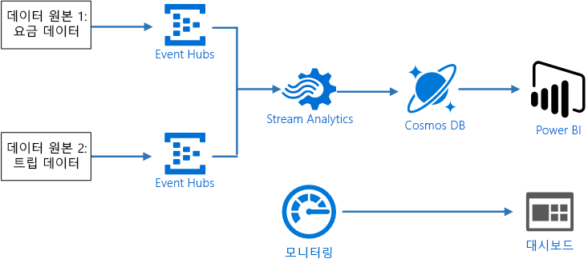
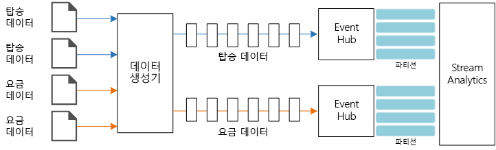
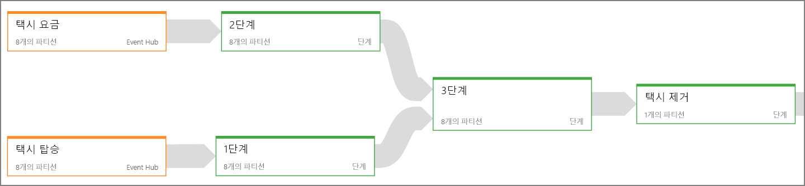
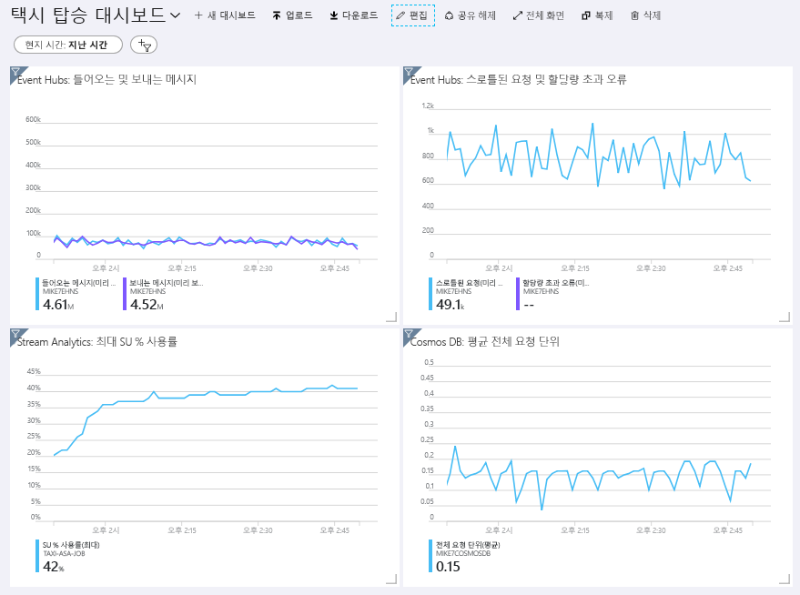
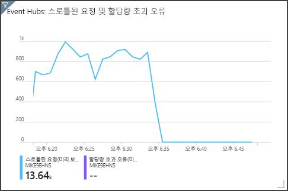

# <a name="create-a-stream-processing-pipeline-with-azure-stream-analytics"></a><span data-ttu-id="a5afd-103">Azure Stream Analytics를 사용하는 스트림 처리 파이프라인 만들기</span><span class="sxs-lookup"><span data-stu-id="a5afd-103">Create a stream processing pipeline with Azure Stream Analytics</span></span>

<span data-ttu-id="a5afd-104">이 참조 아키텍처는 엔드투엔드 [스트림 처리](/azure/architecture/data-guide/big-data/real-time-processing) 파이프라인을 보여줍니다.</span><span class="sxs-lookup"><span data-stu-id="a5afd-104">This reference architecture shows an end-to-end [stream processing](/azure/architecture/data-guide/big-data/real-time-processing) pipeline.</span></span> <span data-ttu-id="a5afd-105">파이프라인은 두 원본에서 데이터를 수집하고, 두 스트림에 있는 레코드의 상관 관계를 만들고, 시간 범위에서 이동 평균을 계산합니다.</span><span class="sxs-lookup"><span data-stu-id="a5afd-105">The pipeline ingests data from two sources, correlates records in the two streams, and calculates a rolling average across a time window.</span></span> <span data-ttu-id="a5afd-106">추가 분석을 위해 결과가 저장됩니다.</span><span class="sxs-lookup"><span data-stu-id="a5afd-106">The results are stored for further analysis.</span></span>

<span data-ttu-id="a5afd-107">이 아키텍처에 대한 참조 구현은 [GitHub][github]에서 사용할 수 있습니다.</span><span class="sxs-lookup"><span data-stu-id="a5afd-107">A reference implementation for this architecture is available on [GitHub][github].</span></span>



<span data-ttu-id="a5afd-109">**시나리오**: 한 택시 회사에서 각 택시 운행 데이터를 수집합니다.</span><span class="sxs-lookup"><span data-stu-id="a5afd-109">**Scenario**: A taxi company collects data about each taxi trip.</span></span> <span data-ttu-id="a5afd-110">이 시나리오의 경우 두 개의 별도 디바이스가 데이터를 전송하고 있다고 가정합니다.</span><span class="sxs-lookup"><span data-stu-id="a5afd-110">For this scenario, we assume there are two separate devices sending data.</span></span> <span data-ttu-id="a5afd-111">택시에는 각 승객 &mdash; 기간, 거리, 승차 및 하차 위치에 대한 정보를 전송하는 미터가 있습니다.</span><span class="sxs-lookup"><span data-stu-id="a5afd-111">The taxi has a meter that sends information about each ride &mdash; the duration, distance, and pickup and dropoff locations.</span></span> <span data-ttu-id="a5afd-112">별도 디바이스는 고객의 지불을 수락하고 요금에 대한 데이터를 보냅니다.</span><span class="sxs-lookup"><span data-stu-id="a5afd-112">A separate device accepts payments from customers and sends data about fares.</span></span> <span data-ttu-id="a5afd-113">택시 회사는 추세를 파악하기 위해 실시간으로 마일당 평균 팁을 계산하려고 합니다.</span><span class="sxs-lookup"><span data-stu-id="a5afd-113">The taxi company wants to calculate the average tip per mile driven, in real time, in order to spot trends.</span></span>

## <a name="architecture"></a><span data-ttu-id="a5afd-114">아키텍처</span><span class="sxs-lookup"><span data-stu-id="a5afd-114">Architecture</span></span>

<span data-ttu-id="a5afd-115">이 아키텍처는 다음 구성 요소로 구성됩니다.</span><span class="sxs-lookup"><span data-stu-id="a5afd-115">The architecture consists of the following components.</span></span>

<span data-ttu-id="a5afd-116">**데이터 원본**.</span><span class="sxs-lookup"><span data-stu-id="a5afd-116">**Data sources**.</span></span> <span data-ttu-id="a5afd-117">이 아키텍처에는 실시간으로 데이터 스트림을 생성하는 두 개의 데이터 원본이 있습니다.</span><span class="sxs-lookup"><span data-stu-id="a5afd-117">In this architecture, there are two data sources that generate data streams in real time.</span></span> <span data-ttu-id="a5afd-118">첫 번째 스트림에는 승객 정보가 포함되고 두 번째 스트림에는 요금 정보가 포함됩니다.</span><span class="sxs-lookup"><span data-stu-id="a5afd-118">The first stream contains ride information, and the second contains fare information.</span></span> <span data-ttu-id="a5afd-119">참조 아키텍처에는 정적 파일 집합을 읽고 Event Hubs에 데이터를 푸시하는 시뮬레이트된 데이터 생성기가 포함됩니다.</span><span class="sxs-lookup"><span data-stu-id="a5afd-119">The reference architecture includes a simulated data generator that reads from a set of static files and pushes the data to Event Hubs.</span></span> <span data-ttu-id="a5afd-120">실제 애플리케이션에서 데이터 원본은 택시에 설치된 장치입니다.</span><span class="sxs-lookup"><span data-stu-id="a5afd-120">In a real application, the data sources would be devices installed in the taxi cabs.</span></span>

<span data-ttu-id="a5afd-121">**Azure Event Hubs** -</span><span class="sxs-lookup"><span data-stu-id="a5afd-121">**Azure Event Hubs**.</span></span> <span data-ttu-id="a5afd-122">[Event Hubs](/azure/event-hubs/)는 이벤트 수집 서비스입니다.</span><span class="sxs-lookup"><span data-stu-id="a5afd-122">[Event Hubs](/azure/event-hubs/) is an event ingestion service.</span></span> <span data-ttu-id="a5afd-123">이 아키텍처는 각 데이터 원본에 대해 하나씩 두 개의 이벤트 허브 인스턴스를 사용합니다.</span><span class="sxs-lookup"><span data-stu-id="a5afd-123">This architecture uses two event hub instances, one for each data source.</span></span> <span data-ttu-id="a5afd-124">각 데이터 원본은 연결된 이벤트 허브에 데이터 스트림을 보냅니다.</span><span class="sxs-lookup"><span data-stu-id="a5afd-124">Each data source sends a stream of data to the associated event hub.</span></span>

<span data-ttu-id="a5afd-125">**Azure Stream Analytics** -</span><span class="sxs-lookup"><span data-stu-id="a5afd-125">**Azure Stream Analytics**.</span></span> <span data-ttu-id="a5afd-126">[Stream Analytics](/azure/stream-analytics/)는 이벤트 처리 엔진입니다.</span><span class="sxs-lookup"><span data-stu-id="a5afd-126">[Stream Analytics](/azure/stream-analytics/) is an event-processing engine.</span></span> <span data-ttu-id="a5afd-127">Stream Analytics 작업은 두 개의 이벤트 허브에서 데이터 스트림을 읽고 스트림 처리를 수행합니다.</span><span class="sxs-lookup"><span data-stu-id="a5afd-127">A Stream Analytics job reads the data streams from the two event hubs and performs stream processing.</span></span>

<span data-ttu-id="a5afd-128">**Cosmos DB**</span><span class="sxs-lookup"><span data-stu-id="a5afd-128">**Cosmos DB**.</span></span> <span data-ttu-id="a5afd-129">Stream Analytics 작업의 출력은 일련의 레코드이며 JSON 문서로 Cosmos DB 문서 데이터베이스에 기록됩니다.</span><span class="sxs-lookup"><span data-stu-id="a5afd-129">The output from the Stream Analytics job is a series of records, which are written as JSON documents to a Cosmos DB document database.</span></span>

<span data-ttu-id="a5afd-130">**Microsoft Power BI**</span><span class="sxs-lookup"><span data-stu-id="a5afd-130">**Microsoft Power BI**.</span></span> <span data-ttu-id="a5afd-131">Power BI는 비즈니스 정보에 대한 데이터를 분석하는 비즈니스 분석 도구 제품군입니다.</span><span class="sxs-lookup"><span data-stu-id="a5afd-131">Power BI is a suite of business analytics tools to analyze data for business insights.</span></span> <span data-ttu-id="a5afd-132">이 아키텍처에서는 Cosmos DB에서 데이터를 로드합니다.</span><span class="sxs-lookup"><span data-stu-id="a5afd-132">In this architecture, it loads the data from Cosmos DB.</span></span> <span data-ttu-id="a5afd-133">따라서 사용자가 수집된 기록 데이터의 전체 집합을 분석할 수 있습니다.</span><span class="sxs-lookup"><span data-stu-id="a5afd-133">This allows users to analyze the complete set of historical data that's been collected.</span></span> <span data-ttu-id="a5afd-134">데이터의 실시간 보기에 대해 Stream Analytics에서 Power BI로 직접 결과를 스트리밍할 수도 있습니다.</span><span class="sxs-lookup"><span data-stu-id="a5afd-134">You could also stream the results directly from Stream Analytics to Power BI for a real-time view of the data.</span></span> <span data-ttu-id="a5afd-135">자세한 내용은 [Power BI의 실시간 스트리밍](/power-bi/service-real-time-streaming)을 참조하세요.</span><span class="sxs-lookup"><span data-stu-id="a5afd-135">For more information, see [Real-time streaming in Power BI](/power-bi/service-real-time-streaming).</span></span>

<span data-ttu-id="a5afd-136">**Azure Monitor**</span><span class="sxs-lookup"><span data-stu-id="a5afd-136">**Azure Monitor**.</span></span> <span data-ttu-id="a5afd-137">[Azure Monitor](/azure/monitoring-and-diagnostics/)는 솔루션에 배포된 Azure 서비스에 대한 성능 메트릭을 수집합니다.</span><span class="sxs-lookup"><span data-stu-id="a5afd-137">[Azure Monitor](/azure/monitoring-and-diagnostics/) collects performance metrics about the Azure services deployed in the solution.</span></span> <span data-ttu-id="a5afd-138">대시보드에서 이를 시각화하여 솔루션의 상태에 대한 인사이트를 얻을 수 있습니다.</span><span class="sxs-lookup"><span data-stu-id="a5afd-138">By visualizing these in a dashboard, you can get insights into the health of the solution.</span></span>

## <a name="data-ingestion"></a><span data-ttu-id="a5afd-139">데이터 수집</span><span class="sxs-lookup"><span data-stu-id="a5afd-139">Data ingestion</span></span>

<!-- markdownlint-disable MD033 -->

<span data-ttu-id="a5afd-140">데이터 원본을 시뮬레이션하기 위해 이 참조 아키텍처는 [뉴욕시 택시 데이터](https://uofi.app.box.com/v/NYCtaxidata/folder/2332218797) 데이터 세트<sup>[[1]](#note1)</sup>를 사용합니다.</span><span class="sxs-lookup"><span data-stu-id="a5afd-140">To simulate a data source, this reference architecture uses the [New York City Taxi Data](https://uofi.app.box.com/v/NYCtaxidata/folder/2332218797) dataset<sup>[[1]](#note1)</sup>.</span></span> <span data-ttu-id="a5afd-141">이 데이터 세트에는 4년(2010 &ndash; 2013) 동안 뉴욕시의 택시 여정에 대한 데이터가 포함됩니다.</span><span class="sxs-lookup"><span data-stu-id="a5afd-141">This dataset contains data about taxi trips in New York City over a 4-year period (2010 &ndash; 2013).</span></span> <span data-ttu-id="a5afd-142">두 가지 유형의 레코드를 포함합니다. 그것은 바로 승객 데이터와 요금 데이터입니다.</span><span class="sxs-lookup"><span data-stu-id="a5afd-142">It contains two types of record: Ride data and fare data.</span></span> <span data-ttu-id="a5afd-143">승객 데이터에는 여정 기간, 여정 거리 및 승차 및 하차 위치가 포함됩니다.</span><span class="sxs-lookup"><span data-stu-id="a5afd-143">Ride data includes trip duration, trip distance, and pickup and dropoff location.</span></span> <span data-ttu-id="a5afd-144">요금 데이터에는 요금, 세금 및 팁 금액이 포함됩니다.</span><span class="sxs-lookup"><span data-stu-id="a5afd-144">Fare data includes fare, tax, and tip amounts.</span></span> <span data-ttu-id="a5afd-145">레코드 형식 모두의 공통 필드에는 등록 번호, 택시 라이선스 및 공급 업체 ID가 포함됩니다.</span><span class="sxs-lookup"><span data-stu-id="a5afd-145">Common fields in both record types include medallion number, hack license, and vendor ID.</span></span> <span data-ttu-id="a5afd-146">이러한 세 필드는 택시와 드라이버를 고유하게 식별합니다.</span><span class="sxs-lookup"><span data-stu-id="a5afd-146">Together these three fields uniquely identify a taxi plus a driver.</span></span> <span data-ttu-id="a5afd-147">데이터가 CSV 형식으로 저장됩니다.</span><span class="sxs-lookup"><span data-stu-id="a5afd-147">The data is stored in CSV format.</span></span>

<span data-ttu-id="a5afd-148"><span id="note1">[1]</span> Donovan, Brian; Work, Dan (2016): 뉴욕시 택시 운행 데이터(2010-2013).</span><span class="sxs-lookup"><span data-stu-id="a5afd-148"><span id="note1">[1]</span> Donovan, Brian; Work, Dan (2016): New York City Taxi Trip Data (2010-2013).</span></span> <span data-ttu-id="a5afd-149">University of Illinois at Urbana-Champaign</span><span class="sxs-lookup"><span data-stu-id="a5afd-149">University of Illinois at Urbana-Champaign.</span></span> <span data-ttu-id="a5afd-150">https://doi.org/10.13012/J8PN93H8</span><span class="sxs-lookup"><span data-stu-id="a5afd-150">https://doi.org/10.13012/J8PN93H8</span></span>

<!-- markdownlint-enable MD033 -->

<span data-ttu-id="a5afd-151">데이터 생성기는 레코드를 읽고 Azure Event Hubs로 전송하는 .NET Core 애플리케이션입니다.</span><span class="sxs-lookup"><span data-stu-id="a5afd-151">The data generator is a .NET Core application that reads the records and sends them to Azure Event Hubs.</span></span> <span data-ttu-id="a5afd-152">생성기는 승객 데이터를 JSON 형식으로 보내고, 요금 데이터를 CSV 형식으로 전송합니다.</span><span class="sxs-lookup"><span data-stu-id="a5afd-152">The generator sends ride data in JSON format and fare data in CSV format.</span></span>

<span data-ttu-id="a5afd-153">Event Hubs는 [파티션](/azure/event-hubs/event-hubs-features#partitions)을 사용하여 데이터를 분할합니다.</span><span class="sxs-lookup"><span data-stu-id="a5afd-153">Event Hubs uses [partitions](/azure/event-hubs/event-hubs-features#partitions) to segment the data.</span></span> <span data-ttu-id="a5afd-154">파티션을 사용하면 소비자가 각 파티션을 병렬로 읽을 수 있습니다.</span><span class="sxs-lookup"><span data-stu-id="a5afd-154">Partitions allow a consumer to read each partition in parallel.</span></span> <span data-ttu-id="a5afd-155">Event Hubs에 데이터를 보낼 때 파티션 키를 명시적으로 지정할 수 있습니다.</span><span class="sxs-lookup"><span data-stu-id="a5afd-155">When you send data to Event Hubs, you can specify the partition key explicitly.</span></span> <span data-ttu-id="a5afd-156">그렇지 않으면 레코드는 라운드 로빈 방식으로 파티션에 할당됩니다.</span><span class="sxs-lookup"><span data-stu-id="a5afd-156">Otherwise, records are assigned to partitions in round-robin fashion.</span></span>

<span data-ttu-id="a5afd-157">이 특정 시나리오에서 승객 데이터 및 요금 데이터는 지정된 택시에 대해 동일한 파티션 ID를 사용해야 합니다.</span><span class="sxs-lookup"><span data-stu-id="a5afd-157">In this particular scenario, ride data and fare data should end up with the same partition ID for a given taxi cab.</span></span> <span data-ttu-id="a5afd-158">그러면 Stream Analytics에서 두 스트림의 상관 관계를 만드는 경우 병렬 처리 수준을 적용할 수 있습니다.</span><span class="sxs-lookup"><span data-stu-id="a5afd-158">This enables Stream Analytics to apply a degree of parallelism when it correlates the two streams.</span></span> <span data-ttu-id="a5afd-159">승객 데이터의 *n* 파티션에 있는 레코드는 요금 데이터의 *n* 파티션에 있는 레코드와 일치합니다.</span><span class="sxs-lookup"><span data-stu-id="a5afd-159">A record in partition *n* of the ride data will match a record in partition *n* of the fare data.</span></span>



<span data-ttu-id="a5afd-161">데이터 생성기에서 두 레코드 형식에 대한 공통 데이터 모델에는 `Medallion`, `HackLicense` 및 `VendorId`의 연결인 `PartitionKey` 속성이 있습니다.</span><span class="sxs-lookup"><span data-stu-id="a5afd-161">In the data generator, the common data model for both record types has a `PartitionKey` property which is the concatenation of `Medallion`, `HackLicense`, and `VendorId`.</span></span>

```csharp
public abstract class TaxiData
{
    public TaxiData()
    {
    }

    [JsonProperty]
    public long Medallion { get; set; }

    [JsonProperty]
    public long HackLicense { get; set; }

    [JsonProperty]
    public string VendorId { get; set; }

    [JsonProperty]
    public DateTimeOffset PickupTime { get; set; }

    [JsonIgnore]
    public string PartitionKey
    {
        get => $"{Medallion}_{HackLicense}_{VendorId}";
    }
```

<span data-ttu-id="a5afd-162">이 속성을 사용하여 Event Hubs로 전송하는 경우 명시적인 파티션 키를 제공합니다.</span><span class="sxs-lookup"><span data-stu-id="a5afd-162">This property is used to provide an explicit partition key when sending to Event Hubs:</span></span>

```csharp
using (var client = pool.GetObject())
{
    return client.Value.SendAsync(new EventData(Encoding.UTF8.GetBytes(
        t.GetData(dataFormat))), t.PartitionKey);
}
```

## <a name="stream-processing"></a><span data-ttu-id="a5afd-163">스트림 처리</span><span class="sxs-lookup"><span data-stu-id="a5afd-163">Stream processing</span></span>

<span data-ttu-id="a5afd-164">스트림 처리 작업은 일부 고유 단계를 포함한 SQL 쿼리를 사용하여 정의됩니다.</span><span class="sxs-lookup"><span data-stu-id="a5afd-164">The stream processing job is defined using a SQL query with several distinct steps.</span></span> <span data-ttu-id="a5afd-165">처음 두 단계는 단순히 두 개의 입력 스트림에서 레코드를 선택합니다.</span><span class="sxs-lookup"><span data-stu-id="a5afd-165">The first two steps simply select records from the two input streams.</span></span>

```sql
WITH
Step1 AS (
    SELECT PartitionId,
           TRY_CAST(Medallion AS nvarchar(max)) AS Medallion,
           TRY_CAST(HackLicense AS nvarchar(max)) AS HackLicense,
           VendorId,
           TRY_CAST(PickupTime AS datetime) AS PickupTime,
           TripDistanceInMiles
    FROM [TaxiRide] PARTITION BY PartitionId
),
Step2 AS (
    SELECT PartitionId,
           medallion AS Medallion,
           hack_license AS HackLicense,
           vendor_id AS VendorId,
           TRY_CAST(pickup_datetime AS datetime) AS PickupTime,
           tip_amount AS TipAmount
    FROM [TaxiFare] PARTITION BY PartitionId
),
```

<span data-ttu-id="a5afd-166">다음 단계는 두 개의 입력 스트림을 조인하여 각 스트림에서 일치하는 레코드를 선택합니다.</span><span class="sxs-lookup"><span data-stu-id="a5afd-166">The next step joins the two input streams to select matching records from each stream.</span></span>

```sql
Step3 AS (
  SELECT
         tr.Medallion,
         tr.HackLicense,
         tr.VendorId,
         tr.PickupTime,
         tr.TripDistanceInMiles,
         tf.TipAmount
    FROM [Step1] tr
    PARTITION BY PartitionId
    JOIN [Step2] tf PARTITION BY PartitionId
      ON tr.Medallion = tf.Medallion
     AND tr.HackLicense = tf.HackLicense
     AND tr.VendorId = tf.VendorId
     AND tr.PickupTime = tf.PickupTime
     AND tr.PartitionId = tf.PartitionId
     AND DATEDIFF(minute, tr, tf) BETWEEN 0 AND 15
)
```

<span data-ttu-id="a5afd-167">이 쿼리는 일치하는 레코드를 고유하게 식별하는 필드 집합의 레코드를 조인합니다(Medallion, HackLicense, VendorId 및 PickupTime).</span><span class="sxs-lookup"><span data-stu-id="a5afd-167">This query joins records on a set of fields that uniquely identify matching records (Medallion, HackLicense, VendorId, and PickupTime).</span></span> <span data-ttu-id="a5afd-168">`JOIN` 문에는 파티션 ID도 포함됩니다.</span><span class="sxs-lookup"><span data-stu-id="a5afd-168">The `JOIN` statement also includes the partition ID.</span></span> <span data-ttu-id="a5afd-169">언급했듯이 여기서는 일치하는 레코드에 항상 이 시나리오에서 동일한 파티션 ID가 있다는 사실을 활용합니다.</span><span class="sxs-lookup"><span data-stu-id="a5afd-169">As mentioned, this takes advantage of the fact that matching records always have the same partition ID in this scenario.</span></span>

<span data-ttu-id="a5afd-170">Stream Analytics에서 조인은 *일시적*입니다. 즉, 레코드가 특정 기간 내에 조인됩니다.</span><span class="sxs-lookup"><span data-stu-id="a5afd-170">In Stream Analytics, joins are *temporal*, meaning records are joined within a particular window of time.</span></span> <span data-ttu-id="a5afd-171">그렇지 않으면 작업이 일치 항목을 무기한 대기해야 합니다.</span><span class="sxs-lookup"><span data-stu-id="a5afd-171">Otherwise, the job might need to wait indefinitely for a match.</span></span> <span data-ttu-id="a5afd-172">[DATEDIFF](https://msdn.microsoft.com/azure/stream-analytics/reference/join-azure-stream-analytics) 함수는 일치 항목에서 시간 내에 일치하는 두 개의 레코드를 분리할 수 있는 거리를 지정합니다.</span><span class="sxs-lookup"><span data-stu-id="a5afd-172">The [DATEDIFF](https://msdn.microsoft.com/azure/stream-analytics/reference/join-azure-stream-analytics) function specifies how far two matching records can be separated in time for a match.</span></span>

<span data-ttu-id="a5afd-173">작업의 마지막 단계는 5분이라는 도약 창에서 그룹화되는 마일당 평균 팁을 계산합니다.</span><span class="sxs-lookup"><span data-stu-id="a5afd-173">The last step in the job computes the average tip per mile, grouped by a hopping window of 5 minutes.</span></span>

```sql
SELECT System.Timestamp AS WindowTime,
       SUM(tr.TipAmount) / SUM(tr.TripDistanceInMiles) AS AverageTipPerMile
  INTO [TaxiDrain]
  FROM [Step3] tr
  GROUP BY HoppingWindow(Duration(minute, 5), Hop(minute, 1))
```

<span data-ttu-id="a5afd-174">Stream Analytics에서는 몇 가지 [기간 함수](/azure/stream-analytics/stream-analytics-window-functions)를 제공합니다.</span><span class="sxs-lookup"><span data-stu-id="a5afd-174">Stream Analytics provides several [windowing functions](/azure/stream-analytics/stream-analytics-window-functions).</span></span> <span data-ttu-id="a5afd-175">도약 창은 고정된 기간별로(이 경우에 도약당 1분) 시간 내에서 앞으로 이동합니다.</span><span class="sxs-lookup"><span data-stu-id="a5afd-175">A hopping window moves forward in time by a fixed period, in this case 1 minute per hop.</span></span> <span data-ttu-id="a5afd-176">결과는 지난 5분 동안 이동 평균을 계산하는 것입니다.</span><span class="sxs-lookup"><span data-stu-id="a5afd-176">The result is to calculate a moving average over the past 5 minutes.</span></span>

<span data-ttu-id="a5afd-177">여기에 표시된 아키텍처에서 Stream Analytics 작업의 결과만 Cosmos DB에 저장됩니다.</span><span class="sxs-lookup"><span data-stu-id="a5afd-177">In the architecture shown here, only the results of the Stream Analytics job are saved to Cosmos DB.</span></span> <span data-ttu-id="a5afd-178">빅 데이터 시나리오의 경우 [Event Hubs 캡처](/azure/event-hubs/event-hubs-capture-overview)를 사용하여 원시 이벤트 데이터를 Azure Blob Storage에 저장하는 것이 좋습니다.</span><span class="sxs-lookup"><span data-stu-id="a5afd-178">For a big data scenario, consider also using [Event Hubs Capture](/azure/event-hubs/event-hubs-capture-overview) to save the raw event data into Azure Blob storage.</span></span> <span data-ttu-id="a5afd-179">원시 데이터를 유지하면 데이터에서 새로운 인사이트를 파생하기 위해 나중에 기록 데이터에 대해 일괄 처리 쿼리를 실행할 수 있습니다.</span><span class="sxs-lookup"><span data-stu-id="a5afd-179">Keeping the raw data will allow you to run batch queries over your historical data at later time, in order to derive new insights from the data.</span></span>

## <a name="scalability-considerations"></a><span data-ttu-id="a5afd-180">확장성 고려 사항</span><span class="sxs-lookup"><span data-stu-id="a5afd-180">Scalability considerations</span></span>

### <a name="event-hubs"></a><span data-ttu-id="a5afd-181">Event Hubs</span><span class="sxs-lookup"><span data-stu-id="a5afd-181">Event Hubs</span></span>

<span data-ttu-id="a5afd-182">Event Hubs의 처리량 용량은 [처리량 단위](/azure/event-hubs/event-hubs-features#throughput-units)로 제어됩니다.</span><span class="sxs-lookup"><span data-stu-id="a5afd-182">The throughput capacity of Event Hubs is measured in [throughput units](/azure/event-hubs/event-hubs-features#throughput-units).</span></span> <span data-ttu-id="a5afd-183">[자동 팽창](/azure/event-hubs/event-hubs-auto-inflate)을 사용하도록 설정하여 이벤트 허브를 자동 크기 조정할 수 있습니다. 그러면 트래픽에 따라 처리량 단위를 구성된 최댓값까지 자동으로 크기 조정합니다.</span><span class="sxs-lookup"><span data-stu-id="a5afd-183">You can autoscale an event hub by enabling [auto-inflate](/azure/event-hubs/event-hubs-auto-inflate), which automatically scales the throughput units based on traffic, up to a configured maximum.</span></span>

### <a name="stream-analytics"></a><span data-ttu-id="a5afd-184">Stream Analytics</span><span class="sxs-lookup"><span data-stu-id="a5afd-184">Stream Analytics</span></span>

<span data-ttu-id="a5afd-185">Stream Analytics의 경우 작업에 할당된 컴퓨팅 리소스는 스트리밍 단위로 측정됩니다.</span><span class="sxs-lookup"><span data-stu-id="a5afd-185">For Stream Analytics, the computing resources allocated to a job are measured in Streaming Units.</span></span> <span data-ttu-id="a5afd-186">작업을 병렬 처리할 수 있는 경우 Stream Analytics 작업은 크기를 조정하는 것이 최선입니다.</span><span class="sxs-lookup"><span data-stu-id="a5afd-186">Stream Analytics jobs scale best if the job can be parallelized.</span></span> <span data-ttu-id="a5afd-187">이런 방식으로 Stream Analytics는 여러 계산 노드에서 작업을 배포할 수 있습니다.</span><span class="sxs-lookup"><span data-stu-id="a5afd-187">That way, Stream Analytics can distribute the job across multiple compute nodes.</span></span>

<span data-ttu-id="a5afd-188">Event Hubs 입력의 경우 `PARTITION BY` 키워드를 사용하여 Stream Analytics 작업을 분할합니다.</span><span class="sxs-lookup"><span data-stu-id="a5afd-188">For Event Hubs input, use the `PARTITION BY` keyword to partition the Stream Analytics job.</span></span> <span data-ttu-id="a5afd-189">데이터는 Event Hubs 파티션에 따라 하위 집합으로 구분됩니다.</span><span class="sxs-lookup"><span data-stu-id="a5afd-189">The data will be divided into subsets based on the Event Hubs partitions.</span></span>

<span data-ttu-id="a5afd-190">기간 이동 함수 및 일시 조인에는 추가 SU가 필요합니다.</span><span class="sxs-lookup"><span data-stu-id="a5afd-190">Windowing functions and temporal joins require additional SU.</span></span> <span data-ttu-id="a5afd-191">사용 가능한 경우 `PARTITION BY`를 사용하여 각 파티션에서 개별적으로 처리됩니다.</span><span class="sxs-lookup"><span data-stu-id="a5afd-191">When possible, use `PARTITION BY` so that each partition is processed separately.</span></span> <span data-ttu-id="a5afd-192">자세한 내용은 [스트리밍 단위 이해 및 조정](/azure/stream-analytics/stream-analytics-streaming-unit-consumption#windowed-aggregates)을 참조하세요.</span><span class="sxs-lookup"><span data-stu-id="a5afd-192">For more information, see [Understand and adjust Streaming Units](/azure/stream-analytics/stream-analytics-streaming-unit-consumption#windowed-aggregates).</span></span>

<span data-ttu-id="a5afd-193">전체 Stream Analytics 작업을 병렬 처리할 수 없는 경우 하나 이상의 병렬 단계부터 여러 단계로 작업을 중단하려고 합니다.</span><span class="sxs-lookup"><span data-stu-id="a5afd-193">If it's not possible to parallelize the entire Stream Analytics job, try to break the job into multiple steps, starting with one or more parallel steps.</span></span> <span data-ttu-id="a5afd-194">따라서 첫 번째 단계는 병렬로 실행할 수 있습니다.</span><span class="sxs-lookup"><span data-stu-id="a5afd-194">That way, the first steps can run in parallel.</span></span> <span data-ttu-id="a5afd-195">예를 들어 이 참조 아키텍처에서:</span><span class="sxs-lookup"><span data-stu-id="a5afd-195">For example, in this reference architecture:</span></span>

- <span data-ttu-id="a5afd-196">1 및 2단계는 단순히 단일 파티션 내에서 레코드를 선택하는 `SELECT` 문입니다.</span><span class="sxs-lookup"><span data-stu-id="a5afd-196">Steps 1 and 2 are simple `SELECT` statements that select records within a single partition.</span></span>
- <span data-ttu-id="a5afd-197">3단계에서는 두 입력 스트림에 분할된 조인을 수행합니다.</span><span class="sxs-lookup"><span data-stu-id="a5afd-197">Step 3 performs a partitioned join across two input streams.</span></span> <span data-ttu-id="a5afd-198">이 단계에서는 일치하는 레코드가 동일한 파티션 키를 공유한다는 사실을 활용하므로 각 입력 스트림에서 같은 파티션 ID를 갖도록 보장됩니다.</span><span class="sxs-lookup"><span data-stu-id="a5afd-198">This step takes advantage of the fact that matching records share the same partition key, and so are guaranteed to have the same partition ID in each input stream.</span></span>
- <span data-ttu-id="a5afd-199">4단계에서는 모든 파티션을 통해 집계합니다.</span><span class="sxs-lookup"><span data-stu-id="a5afd-199">Step 4 aggregates across all of the partitions.</span></span> <span data-ttu-id="a5afd-200">이 단계는 병렬 처리될 수 없습니다.</span><span class="sxs-lookup"><span data-stu-id="a5afd-200">This step cannot be parallelized.</span></span>

<span data-ttu-id="a5afd-201">Stream Analytics [작업 다이어그램](/azure/stream-analytics/stream-analytics-job-diagram-with-metrics)을 사용하여 작업에서 각 단계에 할당되는 파티션 수를 확인합니다.</span><span class="sxs-lookup"><span data-stu-id="a5afd-201">Use the Stream Analytics [job diagram](/azure/stream-analytics/stream-analytics-job-diagram-with-metrics) to see how many partitions are assigned to each step in the job.</span></span> <span data-ttu-id="a5afd-202">다음 다이어그램은 이 참조 아키텍처에 대한 작업 다이어그램을 보여줍니다.</span><span class="sxs-lookup"><span data-stu-id="a5afd-202">The following diagram shows the job diagram for this reference architecture:</span></span>



### <a name="cosmos-db"></a><span data-ttu-id="a5afd-204">Cosmos DB</span><span class="sxs-lookup"><span data-stu-id="a5afd-204">Cosmos DB</span></span>

<span data-ttu-id="a5afd-205">Cosmos DB에 대한 처리량 용량은 RU([요청 단위](/azure/cosmos-db/request-units))로 측정됩니다.</span><span class="sxs-lookup"><span data-stu-id="a5afd-205">Throughput capacity for Cosmos DB is measured in [Request Units](/azure/cosmos-db/request-units) (RU).</span></span> <span data-ttu-id="a5afd-206">10,000RU를 넘는 Cosmos DB 컨테이너의 크기를 조정하려면 컨테이너를 만들 때 [파티션 키](/azure/cosmos-db/partition-data)를 지정하고, 모든 문서에서 파티션 키를 포함해야 합니다.</span><span class="sxs-lookup"><span data-stu-id="a5afd-206">In order to scale a Cosmos DB container past 10,000 RU, you must specify a [partition key](/azure/cosmos-db/partition-data) when you create the container, and include the partition key in every document.</span></span>

<span data-ttu-id="a5afd-207">이 참조 아키텍처에서는 새 문서가 분당 한 번씩 만들어지므로(도약 창 간격) 처리량 요구 사항이 매우 낮습니다.</span><span class="sxs-lookup"><span data-stu-id="a5afd-207">In this reference architecture, new documents are created only once per minute (the hopping window interval), so the throughput requirements are quite low.</span></span> <span data-ttu-id="a5afd-208">따라서 이 시나리오에서는 파티션 키를 할당할 필요가 없습니다.</span><span class="sxs-lookup"><span data-stu-id="a5afd-208">For that reason, there's no need to assign a partition key in this scenario.</span></span>

## <a name="monitoring-considerations"></a><span data-ttu-id="a5afd-209">모니터링 고려 사항</span><span class="sxs-lookup"><span data-stu-id="a5afd-209">Monitoring considerations</span></span>

<span data-ttu-id="a5afd-210">스트림 처리 솔루션을 사용하여 시스템의 성능 및 상태를 모니터링해야 합니다.</span><span class="sxs-lookup"><span data-stu-id="a5afd-210">With any stream processing solution, it's important to monitor the performance and health of the system.</span></span> <span data-ttu-id="a5afd-211">[Azure Monitor](/azure/monitoring-and-diagnostics/)는 아키텍처에 사용된 Azure 서비스에 대한 메트릭 및 진단 로그를 수집합니다.</span><span class="sxs-lookup"><span data-stu-id="a5afd-211">[Azure Monitor](/azure/monitoring-and-diagnostics/) collects metrics and diagnostics logs for the Azure services used in the architecture.</span></span> <span data-ttu-id="a5afd-212">Azure Monitor는 Azure 플랫폼에 빌드되고 애플리케이션에서 추가 코드를 필요로 하지 않습니다.</span><span class="sxs-lookup"><span data-stu-id="a5afd-212">Azure Monitor is built into the Azure platform and does not require any additional code in your application.</span></span>

<span data-ttu-id="a5afd-213">다음 경고 신호는 관련 Azure 리소스를 확장해야 함을 나타냅니다.</span><span class="sxs-lookup"><span data-stu-id="a5afd-213">Any of the following warning signals indicate that you should scale out the relevant Azure resource:</span></span>

- <span data-ttu-id="a5afd-214">Event Hubs가 요청을 제한하거나 일일 메시지 할당량에 가깝습니다.</span><span class="sxs-lookup"><span data-stu-id="a5afd-214">Event Hubs throttles requests or is close to the daily message quota.</span></span>
- <span data-ttu-id="a5afd-215">Stream Analytics 작업은 지속적으로 할당된 SU(스트리밍 단위)의 80%를 초과하여 사용합니다.</span><span class="sxs-lookup"><span data-stu-id="a5afd-215">The Stream Analytics job consistently uses more than 80% of allocated Streaming Units (SU).</span></span>
- <span data-ttu-id="a5afd-216">Cosmos DB는 요청을 제한하기 시작합니다.</span><span class="sxs-lookup"><span data-stu-id="a5afd-216">Cosmos DB begins to throttle requests.</span></span>

<span data-ttu-id="a5afd-217">참조 아키텍처에는 Azure Portal에 배포되는 사용자 지정 대시보드가 포함됩니다.</span><span class="sxs-lookup"><span data-stu-id="a5afd-217">The reference architecture includes a custom dashboard, which is deployed to the Azure portal.</span></span> <span data-ttu-id="a5afd-218">아키텍처를 배포하면 [Azure Portal](https://portal.azure.com)을 열고 대시보드 목록에서 `TaxiRidesDashboard`를 선택하여 대시보드를 볼 수 있습니다.</span><span class="sxs-lookup"><span data-stu-id="a5afd-218">After you deploy the architecture, you can view the dashboard by opening the [Azure Portal](https://portal.azure.com) and selecting `TaxiRidesDashboard` from list of dashboards.</span></span> <span data-ttu-id="a5afd-219">Azure Portal에서 사용자 지정 대시보드를 만들고 배포하는 방법에 대한 자세한 내용은 [Azure 대시보드를 프로그래밍 방식으로 만들기](/azure/azure-portal/azure-portal-dashboards-create-programmatically)를 참조하세요.</span><span class="sxs-lookup"><span data-stu-id="a5afd-219">For more information about creating and deploying custom dashboards in the Azure portal, see [Programmatically create Azure Dashboards](/azure/azure-portal/azure-portal-dashboards-create-programmatically).</span></span>

<span data-ttu-id="a5afd-220">다음 이미지에서는 약 1시간 동안 Stream Analytics 작업을 실행한 후에 대시보드를 표시합니다.</span><span class="sxs-lookup"><span data-stu-id="a5afd-220">The following image shows the dashboard after the Stream Analytics job ran for about an hour.</span></span>



<span data-ttu-id="a5afd-222">왼쪽 아래의 패널에서는 처음 15분 동안 Stream Analytics 작업에 대한 SU 사용이 증가한 다음, 감소된다고 표시합니다.</span><span class="sxs-lookup"><span data-stu-id="a5afd-222">The panel on the lower left shows that the SU consumption for the Stream Analytics job climbs during the first 15 minutes and then levels off.</span></span> <span data-ttu-id="a5afd-223">작업이 안정된 상태에 도달하는 경우 일반적인 패턴입니다.</span><span class="sxs-lookup"><span data-stu-id="a5afd-223">This is a typical pattern as the job reaches a steady state.</span></span>

<span data-ttu-id="a5afd-224">Event Hubs가 오른쪽 위 패널에 표시된 대로 요청을 제한합니다.</span><span class="sxs-lookup"><span data-stu-id="a5afd-224">Notice that Event Hubs is throttling requests, shown in the upper right panel.</span></span> <span data-ttu-id="a5afd-225">제한 오류를 수신할 때 Event Hubs 클라이언트 SDK가 자동으로 다시 시도하기 때문에 필요에 따른 제한된 요청은 문제가 되지 않습니다.</span><span class="sxs-lookup"><span data-stu-id="a5afd-225">An occasional throttled request is not a problem, because the Event Hubs client SDK automatically retries when it receives a throttling error.</span></span> <span data-ttu-id="a5afd-226">그러나 일관된 제한 오류가 표시되는 경우 이벤트 허브에 추가 처리량 단위가 필요합니다.</span><span class="sxs-lookup"><span data-stu-id="a5afd-226">However, if you see consistent throttling errors, it means the event hub needs more throughput units.</span></span> <span data-ttu-id="a5afd-227">다음 그래프에서는 Event Hubs 자동 팽창 기능을 사용하는 테스트 실행을 보여줍니다. 여기서는 필요에 따라 처리량 단위를 자동으로 확장합니다.</span><span class="sxs-lookup"><span data-stu-id="a5afd-227">The following graph shows a test run using the Event Hubs auto-inflate feature, which automatically scales out the throughput units as needed.</span></span>



<span data-ttu-id="a5afd-229">자동 팽창은 6시 35분경에 설정되었습니다.</span><span class="sxs-lookup"><span data-stu-id="a5afd-229">Auto-inflate was enabled at about the 06:35 mark.</span></span> <span data-ttu-id="a5afd-230">Event Hubs가 최대 3개의 처리량 단위로 자동으로 강화되면 제한된 요청에서 삭제가 표시됩니다.</span><span class="sxs-lookup"><span data-stu-id="a5afd-230">You can see the p drop in throttled requests, as Event Hubs automatically scaled up to 3 throughput units.</span></span>

<span data-ttu-id="a5afd-231">흥미롭게도 Stream Analytics 작업에서 SU 사용률이 증가하는 부작용이 있었습니다.</span><span class="sxs-lookup"><span data-stu-id="a5afd-231">Interestingly, this had the side effect of increasing the SU utilization in the Stream Analytics job.</span></span> <span data-ttu-id="a5afd-232">제한으로 인해 Event Hubs는 Stream Analytics 작업에 대한 수집 속도를 인위적으로 감소시켰습니다.</span><span class="sxs-lookup"><span data-stu-id="a5afd-232">By throttling, Event Hubs was artificially reducing the ingestion rate for the Stream Analytics job.</span></span> <span data-ttu-id="a5afd-233">실제로 하나의 성능 병목 상태를 해결하면 다른 병목 상태가 발생하는 경우가 많습니다.</span><span class="sxs-lookup"><span data-stu-id="a5afd-233">It's actually common that resolving one performance bottleneck reveals another.</span></span> <span data-ttu-id="a5afd-234">이 경우에 Stream Analytics 작업에 대한 추가 SU를 할당하면 문제가 해결되었습니다.</span><span class="sxs-lookup"><span data-stu-id="a5afd-234">In this case, allocating additional SU for the Stream Analytics job resolved the issue.</span></span>

## <a name="deploy-the-solution"></a><span data-ttu-id="a5afd-235">솔루션 배포</span><span class="sxs-lookup"><span data-stu-id="a5afd-235">Deploy the solution</span></span>

<span data-ttu-id="a5afd-236">참조 구현을 배포하고 실행하려면 [GitHub readme][github]의 단계를 따릅니다.</span><span class="sxs-lookup"><span data-stu-id="a5afd-236">To the deploy and run the reference implementation, follow the steps in the [GitHub readme][github].</span></span>

## <a name="related-resources"></a><span data-ttu-id="a5afd-237">관련 리소스</span><span class="sxs-lookup"><span data-stu-id="a5afd-237">Related resources</span></span>

<span data-ttu-id="a5afd-238">동일한 기술 중 일부를 사용하여 특정 솔루션을 보여주는 다음 [Azure 예제 시나리오](/azure/architecture/example-scenario)를 검토해 보세요.</span><span class="sxs-lookup"><span data-stu-id="a5afd-238">You may wish to review the following [Azure example scenarios](/azure/architecture/example-scenario) that demonstrate specific solutions using some of the same technologies:</span></span>

- [<span data-ttu-id="a5afd-239">건축 산업에서 IoT 및 데이터 분석</span><span class="sxs-lookup"><span data-stu-id="a5afd-239">IoT and data analytics in the construction industry</span></span>](/azure/architecture/example-scenario/data/big-data-with-iot)
- [<span data-ttu-id="a5afd-240">실시간 사기 감지</span><span class="sxs-lookup"><span data-stu-id="a5afd-240">Real-time fraud detection</span></span>](/azure/architecture/example-scenario/data/fraud-detection)

<!-- links -->

[github]: https://github.com/mspnp/azure-stream-analytics-data-pipeline

