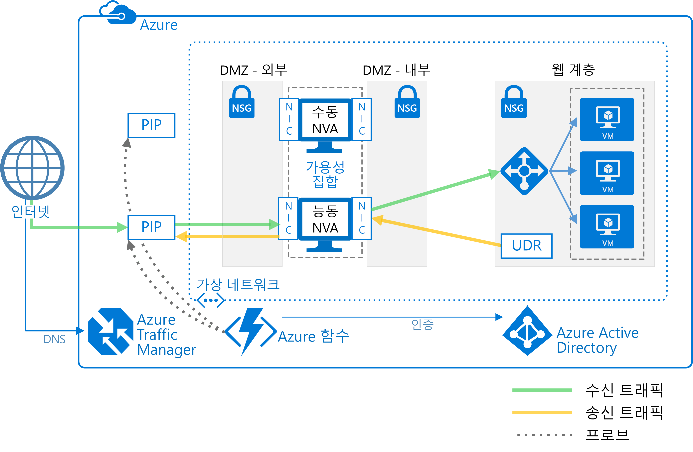

# 고가용성 네트워크 가상 어플라이언스 배포Deploy highly available network virtual appliances

이 문서는 Azure에서 고가용성을 위한 일련의 NVA(네트워크 가상 어플라이언스)를 배포하는 방법을 보여 줍니다.This article shows how to deploy a set of network virtual appliances (NVAs) for high availability in Azure. NVA는 DMZ로 불리는 경계 네트워크로부터 다른 네트워크나 서브넷으로의 네트워크 트래픽 흐름을 제어하기 위해 주로 사용됩니다.An NVA is typically used to control the flow of network traffic from a perimeter network, also known as a DMZ, to other networks or subnets. Azure에서 DMZ를 구현하는 방법에 대한 자세한 내용은 [Microsoft Cloud Services 및 네트워크 보안][cloud-security]을 참조하세요.To learn about implementing a DMZ in Azure, see [Microsoft cloud services and network security][cloud-security]. 이 문서에는 수신 전용, 송신 전용 및 송수신용 예제 아키텍처가 포함되어 있습니다.The article includes example architectures for ingress only, egress only, and both ingress and egress.

**필수 조건:** 이 문서는 [Azure Load Balancer][lb-overview] 및 UDR([사용자 정의 경로][udr-overview])에 대한 기본적인 이해를 전제로 합니다.**Prerequisites:** This article assumes a basic understanding of Azure networking, [Azure load balancers][lb-overview], and [user-defined routes][udr-overview] (UDRs).

## 아키텍처 다이어그램Architecture diagrams

NVA는 다양한 아키텍처의 DMZ에 배포할 수 있습니다.An NVA can be deployed to a DMZ in many different architectures. 예를 들어, 다음 그림은 수신을 위한 [단일 NVA][nva-scenario]의 사용을 보여 줍니다.For example, the following figure illustrates the use of a [single NVA][nva-scenario] for ingress.

![[0]][0]![[0]][0]

이 아키텍처에서 NVA는 모든 들어오고 나가는 네트워크 트래픽을 검사하여 네트워크 보안 규칙을 만족하는 트래픽만을 통과시킴으로써 안전한 네트워크 경계를 제공합니다.In this architecture, the NVA provides a secure network boundary by checking all inbound and outbound network traffic and passing only the traffic that meets network security rules. 그러나 모든 네트워크 트래픽이 NVA를 거쳐야 하므로 NVA는 네트워크 내 단일 장애 지점이 됩니다.However, the fact that all network traffic must pass through the NVA means that the NVA is a single point of failure in the network. NVA에 장애가 발생할 경우 네트워크 트래픽을 위한 다른 경로가 존재하지 않고 모든 백 엔드 서브넷은 이용할 수 없게 됩니다.If the NVA fails, there is no other path for network traffic and all the back-end subnets are unavailable.

NVA의 가용성을 높이려면 가용성 집합에 여러 NVA를 배포합니다.To make an NVA highly available, deploy more than one NVA into an availability set.

다음 아키텍처는 고가용성 NVA에 필요한 리소스와 구성을 보여 줍니다.The following architectures describe the resources and configuration necessary for highly available NVAs:

<!-- markdownlint-disable MD033 -->

| 해결 방법Solution | 이점Benefits | 고려 사항Considerations |
| --- | --- | --- |
| [수신용 레이어 7 NVA][ingress-with-layer-7][Ingress with layer 7 NVAs][ingress-with-layer-7] |모든 NVA 노드가 활성 상태All NVA nodes are active |연결을 종료하고 SNAT을 사용할 수 있는 NVA가 필요Requires an NVA that can terminate connections and use SNAT  인터넷과 Azure로부터 오는 트래픽을 위한 별도의 NVA 집합이 필요Requires a separate set of NVAs for traffic coming from the Internet and from Azure   Azure 외부에서 오는 트래픽에 대해서만 사용 가능Can only be used for traffic originating outside Azure |
| [송신용 레이어 7 NVA][egress-with-layer-7][Egress with layer 7 NVAs][egress-with-layer-7] |모든 NVA 노드가 활성 상태All NVA nodes are active | 연결을 종료하고 소스 네트워크 주소 변환(SNAT)을 수행할 수 있는 NVA가 필요Requires an NVA that can terminate connections and implements source network address translation (SNAT)
| [수신-송신 레이어 7 NVA][ingress-egress-with-layer-7][Ingress-Egress with layer 7 NVAs][ingress-egress-with-layer-7] |모든 노드가 활성 상태All nodes are active Azure에서 발생한 트래픽을 처리할 수 있음Able to handle traffic originated in Azure |연결을 종료하고 SNAT을 사용할 수 있는 NVA가 필요Requires an NVA that can terminate connections and use SNAT 인터넷과 Azure로부터 오는 트래픽을 위한 별도의 NVA 집합이 필요Requires a separate set of NVAs for traffic coming from the Internet and from Azure |
| [PIP-UDR 전환][pip-udr-switch][PIP-UDR switch][pip-udr-switch] |단일 NVA 집합으로 모든 트래픽 처리Single set of NVAs for all traffic (포트 규칙 제한 없이) 모든 트래픽 처리Can handle all traffic (no limit on port rules) |활성-수동Active-passive 장애 조치(Failover) 프로세스가 필요Requires a failover process |
| [SNAT가 없는 PIP-UDRPIP-UDR without SNAT](#pip-udr-nvas-without-snat) | 단일 NVA 집합으로 모든 트래픽 처리Single set of NVAs for all traffic (포트 규칙 제한 없이) 모든 트래픽 처리Can handle all traffic (no limit on port rules) 인바운드 요청에 대한 SNAT를 구성할 필요 없음Does not require configuring SNAT for inbound requests |활성-수동Active-passive 장애 조치(Failover) 프로세스가 필요Requires a failover process 가상 네트워크 외부에서 실행되는 프로빙 및 장애 조치(failover) 논리Probing and failover logic run outside the virtual network |

<!-- markdown-enable MD033 -->

## 수신용 레이어 7 NVAIngress with layer 7 NVAs

다음 그림은 인터넷 연결 부하 분산 장치 뒤에 수신 DMZ를 구현하는 고가용성 아키텍처를 보여 줍니다.The following figure shows a high availability architecture that implements an ingress DMZ behind an internet-facing load balancer. 이 아키텍처는 HTTP나 HTTPS와 같은 레이어 7 트래픽을 위한 Azure 워크로드에 대한 연결성을 제공하도록 설계된 아키텍처입니다.This architecture is designed to provide connectivity to Azure workloads for layer 7 traffic, such as HTTP or HTTPS:

![[1]][1]![[1]][1]

이 아키텍처의 장점은 모든 NVA가 활성 상태이고, 하나의 NVA에 장애가 발생하면 부하 분산 장치가 네트워크 트래픽을 다른 NVA로 보내준다는 점입니다.The benefit of this architecture is that all NVAs are active, and if one fails the load balancer directs network traffic to the other NVA. 두 NVA 모두 트래픽을 내부 부하 분산 장치로 라우팅하므로 하나의 NVA가 활성 상태를 유지하기만 하면 트래픽은 중단 없이 흐르게 됩니다.Both NVAs route traffic to the internal load balancer so as long as one NVA is active, traffic continues to flow. 이러한 NVA는 웹 계층 VM을 위해 의도된 SSL 트래픽을 종료해야 합니다.The NVAs are required to terminate SSL traffic intended for the web tier VMs. 온-프레미스를 처리하기 위해 이 NVA들을 확장해서는 안 됩니다. 온-프레미스 트래픽에 대해서는 자체 네트워크 경로를 가진 다른 전용 NVA 집합이 필요해지기 때문입니다.These NVAs cannot be extended to handle on-premises traffic because on-premises traffic requires another dedicated set of NVAs with their own network routes.

> [!NOTE]
> 이 아키텍처는 [AAzure와 온-프레미스 데이터 센터 간의 DMZ][dmz-on-prem] 참조 아키텍처와 [Azure와 인터넷 간의 DMZ][dmz-internet] 참조 아키텍처에 사용됩니다.This architecture is used in the [DMZ between Azure and your on-premises datacenter][dmz-on-prem] reference architecture and the [DMZ between Azure and the Internet][dmz-internet] reference architecture. 이러한 참조 아키텍처들은 각각 실제로 사용할 수 있는 배포 솔루션을 포함합니다.Each of these reference architectures includes a deployment solution that you can use. 자세한 내용은 아래 링크를 클릭하여 확인하시기 바랍니다.Follow the links for more information.

## 송신용 레이어 7 NVAEgress with layer 7 NVAs

앞서 소개한 아키텍처는 Azure 워크로드에서 발생하는 요청을 위한 송신 DMZ를 제공하도록 확장할 수 있습니다.The previous architecture can be expanded to provide an egress DMZ for requests originating in the Azure workload. 다음 아키텍처는 HTTP나 HTTPS와 같은 레이어7 트래픽을 위한 DMZ 내 NVA의 고가용성을 제공하도록 설계된 아키텍처입니다.The following architecture is designed to provide high availability of the NVAs in the DMZ for layer 7 traffic, such as HTTP or HTTPS:

![[2]][2]![[2]][2]

이 아키텍처는 Azure에서 발생하는 모든 트래픽을 내부 부하 분산 장치로 라우팅합니다.In this architecture, all traffic originating in Azure is routed to an internal load balancer. 부하 분산 장치는 나가는 요청을 하나의 집합 내에 있는 NVA들 사이에 분산시킵니다.The load balancer distributes outgoing requests between a set of NVAs. 이러한 NVA는 개별 공용 IP 주소를 사용하여 트래픽을 인터넷으로 보냅니다.These NVAs direct traffic to the Internet using their individual public IP addresses.

> [!NOTE]
> 이 아키텍처는 [AAzure와 온-프레미스 데이터 센터 간의 DMZ][dmz-on-prem] 참조 아키텍처와 [Azure와 인터넷 간의 DMZ][dmz-internet] 참조 아키텍처에 사용됩니다.This architecture is used in the [DMZ between Azure and your on-premises datacenter][dmz-on-prem] reference architecture and the [DMZ between Azure and the Internet][dmz-internet] reference architecture. 이러한 참조 아키텍처들은 각각 실제로 사용할 수 있는 배포 솔루션을 포함합니다.Each of these reference architectures includes a deployment solution that you can use. 자세한 내용은 아래 링크를 클릭하여 확인하시기 바랍니다.Follow the links for more information.

## 수신-송신 레이어 7 NVAIngress-egress with layer 7 NVAs

앞의 두 아키텍처의 경우 수신 DMZ와 송신 DMZ가 각각 존재했습니다.In the two previous architectures, there was a separate DMZ for ingress and egress. 다음 아키텍처는 HTTP나 HTTPS와 같은 레이어7 트래픽의 송수신에 모두 사용되는 DMZ를 생성하는 방법을 보여 줍니다.The following architecture demonstrates how to create a DMZ that can be used for both ingress and egress for layer 7 traffic, such as HTTP or HTTPS:

![[4]][4]

이 아키텍처에서 NVA(네트워크 가상 어플라이언스)는 애플리케이션 게이트웨이로부터 오는 요청을 처리합니다.In this architecture, the NVAs process incoming requests from the application gateway. 또한 NVA는 부하 분산 장치의 백엔드 풀의 워크로드 VM으로부터 나가는 요청도 처리합니다.The NVAs also process outgoing requests from the workload VMs in the back-end pool of the load balancer. 들어오는 트래픽은 애플리케이션 게이트웨이를 통해 라우팅되고 나가는 트래픽은 부하 분산 장치를 통해 라우팅되므로 NVA는 세션 선호도를 유지하는 역할을 합니다.Because incoming traffic is routed with an application gateway and outgoing traffic is routed with a load balancer, the NVAs are responsible for maintaining session affinity. 즉, 애플리케이션 게이트웨이는 수신 및 송신 요청의 매핑을 유지하므로 정확한 응답을 요청자에게 전달할 수 있습니다.That is, the application gateway maintains a mapping of inbound and outbound requests so it can forward the correct response to the original requestor. 그러나 내부 부하 분산 장치는 애플리케이션 게이트웨이 매핑에 액세스할 수 있고 자체 논리를 통해 NVA에 응답을 전송합니다.However, the internal load balancer does not have access to the application gateway mappings, and uses its own logic to send responses to the NVAs. 부하 분산 장치는 처음에 애플리케이션 게이트웨이로부터 요청을 받지 않은 NVA에 응답을 전송할 수 있습니다.It's possible the load balancer could send a response to an NVA that did not initially receive the request from the application gateway. 이 경우 NVA가 서로 응답을 통신하고 전송하여 정확한 NVA가 응답을 애플리케이션 게이트웨이로 전달할 수 있어야 합니다.In this case, the NVAs must communicate and transfer the response between them so the correct NVA can forward the response to the application gateway.

> [!NOTE]
> 또한 NVA가 인바운드 SNAT(Source Network Address Translation)를 수행하도록 하여 비대칭 라우팅 문제를 해결할 수도 있습니다.You can also solve the asymmetric routing issue by ensuring the NVAs perform inbound source network address translation (SNAT). 이를 통해 요청자의 원본 IP가 인바운드 흐름에 사용되는 NVA의 IP 주소 중 하나로 바뀝니다.This would replace the original source IP of the requestor to one of the IP addresses of the NVA used on the inbound flow. 또한 경로 대칭을 유지하면서 한 번에 여러 NVA를 사용할 수 있습니다.This ensures that you can use multiple NVAs at a time, while preserving the route symmetry.

## 레이어 4 NVA를 사용한 PIP-UDR 전환PIP-UDR switch with layer 4 NVAs

다음 아키텍처는 하나의 활성 NVA와 수동 NVA가 있는 아키텍처를 보여 줍니다.The following architecture demonstrates an architecture with one active and one passive NVA. 이 아키텍처는 레이어 4 트래픽의 수신 및 송신을 모두 처리합니다.This architecture handles both ingress and egress for layer 4 traffic:

![[3]][3]![[3]][3]

> [!TIP]
> 이 아키텍처를 위한 전체 솔루션은 [GitHub][pnp-ha-nva]에서 사용할 수 있습니다.A complete solution for this architecture is available on [GitHub][pnp-ha-nva].

이 아키텍처는 이 문서에서 소개된 첫 번째 아키텍처와 유사합니다.This architecture is similar to the first architecture discussed in this article. 이 아키텍처는 들어오는 레이어 4 요청을 수용하고 필터링하는 단일 NVA를 포함합니다.That architecture included a single NVA accepting and filtering incoming layer 4 requests. 이 아키텍처의 경우 가용성을 높이기 위해 또 다른 수동 NVA를 추가합니다.This architecture adds a second passive NVA to provide high availability. 활성 NVA에 장애가 발생하면 수동 NVA가 활성 상태가 되고 UDR과 PIP는 활성 상태가 된 NVA의 네트워크 인터페이스를 가리키도록 변경됩니다.If the active NVA fails, the passive NVA is made active and the UDR and PIP are changed to point to the NICs on the now active NVA. 이러한 UDR 및 PIP의 변경은 수동으로 또는 자동화된 프로세스를 통해 수행할 수 있습니다.These changes to the UDR and PIP can either be done manually or using an automated process. 자동화된 프로세스는 주로 디먼 또는 Azure에서 실행되는 다른 모니터링 서비스입니다.The automated process is typically daemon or other monitoring service running in Azure. 이 프로세스는 활성 NVA의 상태 프로브에 쿼리를 수행하고 NVA 장애 감지 시 UDR 및 PIP 변경을 수행합니다.It queries a health probe on the active NVA and performs the UDR and PIP switch when it detects a failure of the NVA.

앞의 그림은 고가용성 디먼을 제공하는 [Zookeeper][ zookeeper] 클러스터를 보여 줍니다.The preceding figure shows an example [ZooKeeper][zookeeper] cluster providing a high availability daemon. ZooKeeper 클러스터 내에서 노드 쿼럼으로 리더를 선출합니다.Within the ZooKeeper cluster, a quorum of nodes elects a leader. 리더에 장애가 발생할 경우, 나머지 노드들이 새 리더를 선출합니다.If the leader fails, the remaining nodes hold an election to elect a new leader. 이 아키텍처에서 리더 노드는 NVA의 상태 엔드포인트에 쿼리를 수행하는 디먼을 실행합니다.For this architecture, the leader node executes the daemon that queries the health endpoint on the NVA. NVA가 상태 프로브 응답에 실패할 경우, 디먼은 수동 NVA를 활성 상태로 변경합니다.If the NVA fails to respond to the health probe, the daemon activates the passive NVA. 그런 다음 디먼이 Azure REST API를 호출하여 실패한 NVA로부터 PIP를 제거하여 활성 상태로 변경된 NVA에 연결합니다.The daemon then calls the Azure REST API to remove the PIP from the failed NVA and attaches it to newly activated NVA. 다시 디먼은 UDR이 새로운 액티브 NVA의 내부 IP 주소를 가리키도록 UDR을 변경합니다.The daemon then modifies the UDR to point to the newly activated NVA's internal IP address.

ZooKeeper 노드를 해당 NVA를 포함하는 루트를 사용해서만 액세스할 수 있는 서브넷에 포함시키면 안 됩니다.Do not include the ZooKeeper nodes in a subnet that is only accessible using a route that includes the NVA. 그렇지 않으면 NVA 장애 시 ZooKeeper 노드에 액세스할 수 없습니다.Otherwise, the ZooKeeper nodes are inaccessible if the NVA fails. 무슨 이유로든 디먼에 장애가 발생한다면 문제 진단을 위해 ZooKeepr 노드에 액세스할 수 없게 됩니다.Should the daemon fail for any reason, you won't be able to access any of the ZooKeeper nodes to diagnose the problem.

샘플 코드를 포함한 전체 솔루션을 보려면 [GitHub 리포지토리][pnp-ha-nva]의 파일을 참조하세요.To see the complete solution including sample code, see the files in the [GitHub repository][pnp-ha-nva].

## SNAT가 없는 PIP-UDR NVAPIP-UDR NVAs without SNAT

이 아키텍처는 Azure 가상 머신 두 개를 사용하여 자동화된 장애 조치(failover)를 지원하되 SNAT(Source Network Address Translation)가 필요 없는 활성-수동 구성에서 NVA 방화벽을 호스트합니다.This architecture uses two Azure virtual machines to host the NVA firewall in an active-passive configuration that supports automated failover but does not require Source Network Address Translation (SNAT).

> [!TIP]
> 이 아키텍처를 위한 전체 솔루션은 [GitHub][ha-nva-fo]에서 사용할 수 있습니다.A complete solution for this architecture is available on [GitHub][ha-nva-fo].

이 솔루션은 NVA 방화벽에 인바운드 요청을 위한 SNAT를 구성할 수 없는 Azure 고객을 위해 설계되었습니다.This solution is designed for Azure customers who cannot configure SNAT for inbound requests on their NVA firewalls. SNAT는 원래의 원본 클라이언트 IP 주소를 숨깁니다.SNAT hides the original source client IP address. 원래의 IP를 로깅해야 하거나 NVA 뒤에 있는 다른 계층형 보안 구성 요소 내에서 사용한 경우 이 솔루션이 기본적인 접근법을 제공합니다.If you need to log the original IPs or used them within other layered security components behind your NVAs, this solution offers a basic approach.

UDR 테이블 항목의 장애 조치(failover)는 활성 NVA 방화벽 가상 머신에서 인터페이스의 IP 주소로 설정되는 다음 홉 주소를 통해 자동화됩니다.The failover of UDR table entries is automated by a next-hop address set to the IP address of an interface on the active NVA firewall virtual machine. 자동화된 장애 조치(failover) 논리는 [Azure Functions](/azure/azure-functions/)를 사용하여 만든 함수 앱에서 호스트됩니다.The automated failover logic is hosted in a function app that you create using [Azure Functions](/azure/azure-functions/). 장애 조치(failover) 코드는 Azure Functions 내에서 서버리스 함수로 실행됩니다.The failover code runs as a serverless function inside Azure Functions. 배포는 편리하고, 경제적이며, 유지 관리 및 사용자 지정이 용이합니다.Deployment is convenient, cost-effective, and easy to maintain and customize. 또한 함수 앱은 Azure Functions 내에서 호스트되므로 가상 네트워크에 대한 종속성이 없습니다.In addition, the function app is hosted within Azure Functions, so it has no dependencies on the virtual network. 가상 네트워크에 대한 변경 사항이 NVA 방화벽에 영향을 줄 경우 함수 앱이 계속 개별적으로 실행됩니다.If changes to the virtual network impact the NVA firewalls, the function app continues to run independently. 테스트는 인바운드 클라이언트 요청과 동일한 경로를 사용하여 가상 네트워크 외부에서 수행되므로 더 정확합니다.Testing is more accurate as well, because it takes place outside the virtual network using the same route as the inbound client requests.

함수 앱 코드는 두 가지 방법 중 하나로 NVA 방화벽의 가용성을 확인합니다.To check the availability of the NVA firewall, the function app code probes it in one of two ways:

- NVA 방화벽을 호스트하는 Azure Virtual Machines의 상태 모니터링.By monitoring the state of the Azure virtual machines hosting the NVA firewall.

- 방화벽을 통해 백 엔드 웹 서버에 열려 있는 포트가 있는지 테스트.By testing whether there is an open port through the firewall to the back-end web server. 이 옵션의 경우 NVA가 함수 앱 코드가 테스트할 소켓을 PIP를 통해 공개해야 합니다.For this option, the NVA must expose a socket via PIP for the function app code to test.

함수 앱을 구성할 때 사용하려는 프로브 유형을 선택합니다.You choose the type of probe you want to use when you configure the function app. 샘플 코드를 포함한 전체 솔루션을 보려면 [GitHub 리포지토리][ha-nva-fo]의 파일을 참조하세요.To see the complete solution including sample code, see the files in the [GitHub repository][ha-nva-fo].

## 다음 단계Next steps

- 레이어 7 NVA를 사용하여 [Azure와 온-프레미스 데이터 센터 간의 DMZ 구현][dmz-on-prem] 방법을 알아보세요.Learn how to [implement a DMZ between Azure and your on-premises datacenter][dmz-on-prem] using layer-7 NVAs.
- 레이어 7 NVA를 사용하여 [Azure와 인터넷 간의 DMZ 구현][dmz-internet] 방법을 알아보세요.Learn how to [implement a DMZ between Azure and the Internet][dmz-internet] using layer-7 NVAs.
- [Azure의 네트워크 가상 어플라이언스 문제 해결Troubleshoot network virtual appliance issues in Azure](/azure/virtual-network/virtual-network-troubleshoot-nva)

<!-- links -->

[cloud-security]: /azure/best-practices-network-security
[dmz-on-prem]: ./secure-vnet-hybrid.md
[dmz-internet]: ./secure-vnet-dmz.md
[egress-with-layer-7]: #egress-with-layer-7-nvas
[ingress-with-layer-7]: #ingress-with-layer-7-nvas
[ingress-egress-with-layer-7]: #ingress-egress-with-layer-7-nvas
[lb-overview]: /azure/load-balancer/load-balancer-overview/
[nva-scenario]: /azure/virtual-network/virtual-network-scenario-udr-gw-nva/
[pip-udr-switch]: #pip-udr-switch-with-layer-4-nvas
[udr-overview]: /azure/virtual-network/virtual-networks-udr-overview/
[zookeeper]: https://zookeeper.apache.org/
[pnp-ha-nva]: https://github.com/mspnp/ha-nva
[ha-nva-fo]: https://aka.ms/ha-nva-fo

<!-- images -->

[0]: ./images/nva-ha/single-nva.png "단일 NVA 아키텍처"
[1]: ./images/nva-ha/l7-ingress.png "수신 레이어 7"
[2]: ./images/nva-ha/l7-ingress-egress.png "송신 레이어 7"
[3]: ./images/nva-ha/active-passive.png "능동-수동 클러스터"
[4]: ./images/nva-ha/l7-ingress-egress-ag.png
