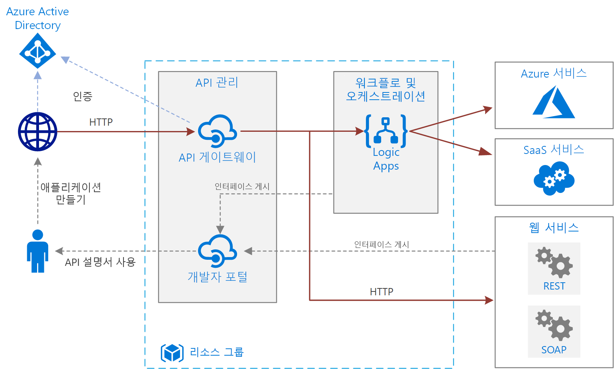

# Azure에서 기본 엔터프라이즈 통합Basic enterprise integration on Azure

이 참조 아키텍처는 [Azure Integration Services][integration-services]를 사용하여 엔터프라이즈 백 엔드 시스템에 대한 호출을 오케스트레이션합니다.This reference architecture uses [Azure Integration Services][integration-services] to orchestrate calls to enterprise backend systems. 백 엔드 시스템에는 SaaS(Software as a Service) 시스템, Azure 서비스 및 기업의 기존 웹 서비스가 포함될 수 있습니다.The backend systems may include software as a service (SaaS) systems, Azure services, and existing web services in your enterprise.

Azure Integration Services는 응용 프로그램과 데이터를 통합하기 위한 서비스 컬렉션입니다.Azure Integration Services is a collection of services for integrating applications and data. 이 아키텍처는 워크플로를 오케스트레이션하는 [Logic Apps][logic-apps] 및 API 카탈로그를 만드는 [API Management][apim]라는 두 가지 서비스를 사용합니다.This architecture uses two of those services: [Logic Apps][logic-apps] to orchestrate workflows, and [API Management][apim] to create catalogs of APIs. 이 아키텍처는 백 엔드 서비스에 대한 비동기 호출로 인해 워크플로가 트리거되는 기본 통합 시나리오에 충분합니다.This architecture is sufficient for basic integration scenarios where the workflow is triggered by synchronous calls to backend services. [큐 및 이벤트](./queues-events.md)를 사용하는 더 정교한 아키텍처는 이러한 기본 카키텍처를 기반으로 합니다.A more sophisticated architecture using [queues and events](./queues-events.md) builds on this basic architecture.

## 아키텍처Architecture

이 아키텍처의 구성 요소는 다음과 같습니다.The architecture has the following components:

- **백 엔드 시스템**.**Backend systems**. 다이어그램의 오른쪽에는 기업에서 배포한 또는 사용하는 다양한 백 엔드 시스템이 나와 있습니다.The right-hand side of the diagram shows the various backend systems that the enterprise has deployed or relies on. SaaS 시스템, 다른 Azure 서비스, REST 또는 SOAP 엔드포인트를 공개하는 웹 서비스 등이 여기에 포함됩니다.These might include SaaS systems, other Azure services, or web services that expose REST or SOAP endpoints.

- **Azure Logic Apps**.**Azure Logic Apps**. [Logic Apps][logic-apps]는 응용 프로그램, 데이터 및 서비스를 통합하는 엔터프라이즈 워크플로를 빌드하기 위한 서버리스 플랫폼입니다.[Logic Apps][logic-apps] is a serverless platform for building enterprise workflows that integrate applications, data, and services. 이 아키텍처는 논리 앱이 HTTP 요청에 의해 트리거됩니다.In this architecture, the logic apps are triggered by HTTP requests. 워크플로를 중첩하여 더 복잡한 오케스트레이션도 가능합니다.You can also nest workflows for more complex orchestration. Logic Apps는 일반적으로 사용되는 서비스와 통합되는 [커넥터][logic-apps-connectors]입니다.Logic Apps uses [connectors][logic-apps-connectors] to integrate with commonly used services. Logic Apps는 수백 개의 커넥터를 제공하며, 사용자 지정 커넥터를 만들 수도 있습니다.Logic Apps offers hundreds of connectors, and you can create custom connectors.

- **Azure API Management**.**Azure API Management**. [API Management][apim]는 HTTP API 카탈로그를 게시하여 재사용 및 검색 기능의 수준을 올리는 관리 서비스입니다.[API Management][apim] is a managed service for publishing catalogs of HTTP APIs, to promote reuse and discoverability. API Management는 두 가지 관련 구성 요소로 구성됩니다.API Management consists of two related components:

  - **API 게이트웨이**.**API gateway**. API 게이트웨이는 HTTP 호출을 받아서 백 엔드로 라우팅합니다.The API gateway accepts HTTP calls and routes them to the backend.

  - **개발자 포털**.**Developer portal**. Azure API Management의 각 인스턴스는 [개발자 포털][apim-dev-portal]에 대한 액세스를 제공합니다.Each instance of Azure API Management provides access to a [developer portal][apim-dev-portal]. 개발자는 이 포털을 통해 API 호출과 관련된 문서 및 샘플 코드에 액세스할 수 있습니다.This portal gives your developers access to documentation and code samples for calling the APIs. 개발자 포털에서 API를 테스트할 수도 있습니다.You can also test APIs in the developer portal.

  이 아키텍처에는 [논리 앱을 API로 가져와서][apim-logic-app] 복합 API를 빌드합니다.In this architecture, composite APIs are built by [importing logic apps][apim-logic-app] as APIs. WSDL 사양에서 [OpenAPI(Swagger) 사양 가져오기][apim-openapi] 또는 [SOAP API 가져오기][apim-soap]를 통해 기존 웹 서비스를 가져올 수도 있습니다.You can also import existing web services by [importing OpenAPI][apim-openapi] (Swagger) specifications or [importing SOAP APIs][apim-soap] from WSDL specifications.

  API 게이트웨이를 사용하여 백 엔드에서 프런트 엔드 클라이언트를 분리할 수 있습니다.The API gateway helps to decouple front-end clients from the back end. 예를 들어 URL을 다시 작성하거나, 요청이 백 엔드에 도달하기 전에 변환할 수 있습니다.For example, it can rewrite URLs, or transform requests before they reach the backend. 또한 인증, CORS(원본 간 리소스 공유) 지원, 응답 캐싱 등 여러 교차 편집 문제를 처리합니다.It also handles many cross-cutting concerns such as authentication, cross-origin resource sharing (CORS) support, and response caching.

- **Azure DNS**.**Azure DNS**. [Azure DNS][dns]는 DNS 도메인에 대한 호스팅 서비스입니다.[Azure DNS][dns] is a hosting service for DNS domains. Azure DNS는 Microsoft Azure 인프라를 사용하여 이름 확인을 제공합니다.Azure DNS provides name resolution by using the Microsoft Azure infrastructure. Azure에서 도메인을 호스팅하면 다른 Azure 서비스에 사용하는 것과 동일한 자격 증명, API, 도구 및 결제(청구) 정보를 사용하여 DNS 레코드를 관리할 수 있습니다.By hosting your domains in Azure, you can manage your DNS records by using the same credentials, APIs, tools, and billing that you use for your other Azure services. 사용자 지정 도메인 이름(예: contoso.com)을 사용하려면 사용자 지정 도메인 이름을 IP 주소에 매핑하는 DNS 레코드를 만듭니다.To use a custom domain name, such as contoso.com, create DNS records that map the custom domain name to the IP address. 자세한 내용은 [API Management에서 사용자 지정 도메인 이름 구성][apim-domain]을 참조하세요.For more information, see [Configure a custom domain name in API Management][apim-domain].

- **Azure AD(Azure Active Directory)**.**Azure Active Directory (Azure AD)**. [Azure AD][aad]를 사용하여 API 게이트웨이를 호출하는 클라이언트를 인증합니다.Use [Azure AD][aad] to authenticate clients that call the API gateway. Azure AD는 OIDC(OpenID Connect) 프로토콜을 지원합니다.Azure AD supports the OpenID Connect (OIDC) protocol. 클라이언트는 Azure AD에서 액세스 토큰을 획득하고, API 게이트웨이는 [토큰의 유효성을 검사][apim-jwt]하여 요청에 권한을 부여합니다.Clients obtain an access token from Azure AD, and API Gateway [validates the token][apim-jwt] to authorize the request. API Management 표준 또는 프리미엄 계층을 사용하는 경우 Azure AD로 개발자 포털에 대한 액세스를 보호할 수도 있습니다.When using the Standard or Premium tier of API Management, Azure AD can also secure access to the developer portal.

## 권장 사항Recommendations

여러분의 요구 사항이 여기에 제시된 일반 아키텍처와 다를 수 있습니다.Your specific requirements might differ from the generic architecture shown here. 이 섹션의 권장 사항을 시작점으로 사용합니다.Use the recommendations in this section as a starting point.

### API ManagementAPI Management

API Management 기본, 표준 또는 프리미엄 계층을 사용합니다.Use the API Management Basic, Standard, or Premium tiers. 이러한 계층은 프로덕션 SLA(서비스 수준 계약)를 제공하고 Azure 지역 내에서 규모 확장을 지원합니다.These tiers offer a production service level agreement (SLA) and support scale out within the Azure region. API Management의 처리량은 *단위*로 측정됩니다.Throughput capacity for API Management is measured in *units*. 가격 책정 계층마다 확장 가능한 최대 규모가 있습니다. 프리미엄 계층은 여러 Azure 지역에 걸친 규모 확장도 지원합니다.Each pricing tier has a maximum scale-out. The Premium tier also supports scale out across multiple Azure regions. 기능 집합 및 필요한 처리량의 수준을 기준으로 계층을 선택합니다.Choose your tier based on your feature set and the level of required throughput. 자세한 내용은 [API Management 가격 책정][apim-pricing] 및 [Azure API Management 인스턴스의 용량][apim-capacity]을 참조하세요.For more information, see [API Management pricing][apim-pricing] and [Capacity of an Azure API Management instance][apim-capacity].

각 Azure API Management 인스턴스는 기본 도메인 이름을 가지며, 이 이름은 `azure-api.net`의 하위 도메인입니다(예: `contoso.azure-api.net`).Each Azure API Management instance has a default domain name, which is a subdomain of `azure-api.net` &mdash, for example, `contoso.azure-api.net`. 조직에 [사용자 지정 도메인][apim-domain]을 구성하는 방안을 고려해 보세요.Consider configuring a [custom domain][apim-domain] for your organization.

### Logic AppsLogic Apps

Logic Apps는 짧은 응답 대기 시간이 필요하지 않은 시나리오에 가장 적합합니다(예: 비동기 또는 반장기 실행 API 호출).Logic Apps works best in scenarios that don't require low latency for a response, such as asynchronous or semi long-running API calls. 사용자 인터페이스를 차단하는 호출과 같이 짧은 대기 시간이 필요한 경우 다른 기술을 사용하세요.If low latency is required, for example in a call that blocks a user interface, use a different technology. 예를 들어, Azure App Service에 배포되는 Azure Functions 또는 Web API를 사용합니다.For example, use Azure Functions or a web API deployed to Azure App Service. API 사용자에게 API를 향하도록 API Management를 사용합니다.Use API Management to front the API to your API consumers.

### 지역Region

네트워크 대기 시간을 최소화할 수 있도록, API Management와 Logic Apps를 동일한 지역에 프로비전합니다.To minimize network latency, put API Management and Logic Apps in the same region. 일반적으로 사용자(또는 백 엔드 서비스)와 가장 가까운 지역을 선택합니다.In general, choose the region that's closest to your users (or closest to your backend services).

리소스 그룹에도 지역이 있습니다.The resource group also has a region. 이 지역은 배포 메타 데이터를 저장할 위치와 배포 템플릿을 실행할 위치를 지정합니다.This region specifies where to store deployment metadata and where to execute the deployment template. 배포 중 가용성을 향상 시키려면 리소스 그룹과 리소스를 같은 지역에 배치합니다.To improve availability during deployment, put the resource group and resources in the same region.

## 확장성 고려 사항Scalability considerations

상황에 따라 [캐싱 정책][apim-caching]을 추가하여 API Management의 확장성을 높일 수 있습니다.To increase the scalability of API Management, add [caching policies][apim-caching] where appropriate. 또한 캐싱은 백 엔드 서비스의 로드를 줄이는 데 도움이 됩니다.Caching also helps reduce the load on back-end services.

더 많은 용량을 제공하기 위해 Azure 지역 내에서 Azure API Management 기본, 표준 및 프리미엄 계층을 확장할 수 있습니다.To offer greater capacity, you can scale out Azure API Management Basic, Standard, and Premium tiers in an Azure region. **메트릭** 메뉴에서 서비스의 사용량을 분석하려면 **용량 메트릭** 옵션을 선택한 다음, 적절하게 확장 또는 축소합니다.To analyze the usage for your service, on the **Metrics** menu, select the **Capacity Metric** option and then scale up or scale down as appropriate. 업그레이드 또는 크기 조정 프로세스를 적용하는 데는 15~45분 정도 소요될 수 있습니다.The upgrade or scale process can take from 15 to 45 minutes to apply.

API Management 서비스 크기 조정에 대한 권장 사항:Recommendations for scaling an API Management service:

- 크기를 조정하는 경우 트래픽 패턴을 고려합니다.Consider traffic patterns when scaling. 더욱 일시적인 트래픽 패턴을 사용하는 고객은 더 많은 용량이 필요합니다.Customers with more volatile traffic patterns need more capacity.

- 66%보다 큰 일관된 용량은 확장(스케일 업)이 필요할 수 있습니다.Consistent capacity that's greater than 66% might indicate a need to scale up.

- 20% 아래의 일관된 용량은 축소(스케일 다운)가 필요할 수 있습니다.Consistent capacity that's under 20% might indicate an opportunity to scale down.

- 프로덕션 환경에서 부하를 사용하도록 설정하기 전에 항상 대표적인 부하를 사용하여 API Management 서비스의 부하를 테스트합니다.Before you enable the load in production, always load-test your API Management service with a representative load.

프리미엄 계층을 사용하면 API Management 인스턴스를 여러 Azure 지역에 걸쳐 확장할 수 있습니다.With the Premium tier, you can scale an API Management instance across multiple Azure regions. 이렇게 하면 API Management의 SLA를 높일 수 있으며, 여러 지역에서 사용자와 가까운 서비스를 프로비전할 수 있습니다.This makes API Management eligible for a higher SLA, and lets you provision services near users in multiple regions.

Logic Apps 서버리스 모델은 관리자가 서비스 확장성을 계획할 필요가 없음을 의미합니다.The Logic Apps serverless model means administrators don't have to plan for service scalability. 서비스가 수요를 충족하도록 자동으로 확장됩니다.The service automatically scales to meet demand.

## 가용성 고려 사항Availability considerations

각 서비스의 SLA를 검토합니다.Review the SLA for each service:

- [API Management SLA][apim-sla][API Management SLA][apim-sla]
- [Logic Apps SLA][logic-apps-sla][Logic Apps SLA][logic-apps-sla]

프리미엄 계층을 사용하여 두 개 이상의 지역에 API Management를 배포하면 더 높은 SLA를 얻을 수 있습니다.If you deploy API Management across two or more regions with Premium tier, it is eligible for a higher SLA. [API Management 가격 책정][apim-pricing]을 참조하세요.See [API Management pricing][apim-pricing].

### BackupBackups

API Management 구성을 주기적으로 [백업][apim-backup]합니다.Regularly [back up][apim-backup] your API Management configuration. 서비스가 배포된 곳과 다른 위치 또는 Azure 지역에 백업 파일을 저장합니다.Store your backup files in a location or Azure region that differs from the region where the service is deployed. [RTO][rto]에 따라 재해 복구 전략을 선택합니다.Based on your [RTO][rto], choose a disaster recovery strategy:

- 재해 복구 이벤트에서 새 API Management 인스턴스를 프로비전하고, 백업을 새 인스턴스로 복원하고, DNS 레코드를 다시 지정합니다.In a disaster recovery event, provision a new API Management instance, restore the backup to the new instance, and repoint the DNS records.

- 다른 Azure 지역에서 API Management 서비스의 패시브 인스턴스를 유지합니다.Keep a passive instance of the API Management service in another Azure region. 주기적으로 백업을 해당 인스턴스에 복원하여 액티브 서비스와 동기화를 유지합니다.Regularly restore backups to that instance, to keep it in sync with the active service. 재해 복구 이벤트 중 서비스를 복원하려면 DNS 레코드만 다시 지정하면 됩니다.To restore the service during a disaster recovery event, you need only repoint the DNS records. 이 방법은 패시브 인스턴스 비용이 발생하므로 비용이 증가하지만, 복구 시간이 단축됩니다.This approach incurs additional cost because you pay for the passive instance, but reduces the time to recover.

논리 앱의 경우 코드로 구성(configuration-as-code) 방법으로 백업 및 복원하는 것이 좋습니다.For logic apps, we recommend a configuration-as-code approach to backing up and restoring. 논리 앱은 서버리스이므로 Azure Resource Manager 템플릿에서 신속하게 다시 만들 수 있습니다.Because logic apps are serverless, you can quickly recreate them from Azure Resource Manager templates. 원본 제어에 템플릿을 저장하고, 템플릿을 CI/CD(지속적인 통합/지속적인 배포) 프로세스와 통합합니다.Save the templates in source control, integrate the templates with your continuous integration/continuous deployment (CI/CD) process. 재해 복구 이벤트 발생 시, 템플릿을 새 지역에 배포합니다.In a disaster recovery event, deploy the template to a new region.

다른 지역에 논리 앱을 배포하는 경우 API Management에서 구성을 업데이트합니다.If you deploy a logic app to a different region, update the configuration in API Management. 기본 PowerShell 스크립트를 사용하여 API의 **백 엔드** 속성을 업데이트할 수 있습니다.You can update the API's **Backend** property by using a basic PowerShell script.

## 관리 효율성 고려 사항Manageability considerations

프로덕션, 개발 및 테스트 환경에 대해 별도의 리소스 그룹을 만듭니다.Create separate resource groups for production, development, and test environments. 별도의 리소스 그룹을 만들면 배포 관리, 테스트 배포 삭제, 액세스 권한 할당 등이 더 간단해집니다.Separate resource groups make it easier to manage deployments, delete test deployments, and assign access rights.

리소스 그룹에 리소스를 할당할 때는 다음 요소를 고려합니다.When you assign resources to resource groups, consider these factors:

- **수명 주기**.**Lifecycle**. 일반적으로 수명 주기가 같은 리소스를 동일한 리소스 그룹에 배치합니다.In general, put resources that have the same lifecycle in the same resource group.

- **액세스**.**Access**. RBAC([역할 기반 액세스 제어][rbac])를 사용하여 그룹의 리소스에 액세스 정책을 적용할 수 있습니다.To apply access policies to the resources in a group, you can use [role-based access control][rbac] (RBAC).

- **청구**.**Billing**. 리소스 그룹에 대한 롤업 비용을 확인할 수 있습니다.You can view rollup costs for the resource group.

- **API Management 가격 책정 계층**.**Pricing tier for API Management**. 개발 및 테스트 환경에는 개발자 계층을 사용합니다.Use the Developer tier for development and test environments. 사전 프로덕션 기간에 비용을 최소화하려면 프로덕션 환경의 복제본을 배포하고 테스트를 실행한 다음, 종료합니다.To minimize costs during preproduction, deploy a replica of your production environment, run your tests, and then shut down.

### 배포Deployment

[Azure Resource Manager 템플릿][arm]을 사용하여 Azure 리소스를 배포합니다.Use [Azure Resource Manager templates][arm] to deploy the Azure resources. 템플릿을 사용하면 PowerShell 또는 Azure CLI를 통해 배포를 쉽게 자동화할 수 있습니다.Templates make it easier to automate deployments using PowerShell or the Azure CLI.

API Management 및 모든 개별 논리 앱을 별도의 자체 Resource Manager 템플릿에 배치합니다.Put API Management and any individual logic apps in their own separate Resource Manager templates. 별도의 템플릿을 사용하면, 소스 제어 시스템에 리소스를 저장할 수 있습니다.By using separate templates, you can store the resources in source control systems. 템플릿을 CI/CD 프로세스의 일부로 함께 또는 개별적으로 배포할 수 있습니다.You can deploy the templates together or individually as part of a CI/CD process.

### 버전Versions

논리 앱의 구성을 변경하거나 Resource Manager 템플릿을 통해 업데이트를 배포할 때마다 Azure는 해당 버전의 복사본을 유지하고 실행 기록이 있는 모든 버전을 유지합니다.Each time you change a logic app's configuration or deploy an update through a Resource Manager template, Azure keeps a copy of that version and keeps all versions that have a run history. 이러한 버전을 사용하여 기록 변경 내용을 추적하거나 버전을 논리 앱의 현재 구성으로 승격할 수 있습니다.You can use these versions to track historical changes or promote a version as the logic app's current configuration. 예를 들어 논리 앱을 이전 버전으로 롤백할 수 있습니다.For example, you can roll back a logic app to a previous version.

API Management는 각각 별개이지만 상호 보완 관계인 두 가지 버전 관리 개념을 지원합니다.API Management supports two distinct but complementary versioning concepts:

- *버전*을 통해 API 소비자는 요구 사항에 맞는 API 버전을 선택할 수 있습니다(예: v1, v2, 베타 또는 프로덕션).*Versions* allow API consumers to choose an API version based on their needs, for example, v1, v2, beta, or production.

- *수정 버전*을 통해 API 관리자는 API에서 호환성이 손상되지 않는 변경 작업을 수행하고 변경 내용을 배포할 수 있으며, 변경 로그를 통해 API 소비자에게 변경 관련 정보를 제공할 수 있습니다.*Revisions* allow API administrators to make non-breaking changes in an API and deploy those changes, along with a change log to inform API consumers about the changes.

개발 환경에서 수정을 만들고 Resource Manager 템플릿을 사용하여 다른 환경에서 해당 변경 내용을 배포할 수 있습니다.You can make a revision in a development environment and deploy that change in other environments by using Resource Manager templates. 자세한 내용은 [여러 버전의 API 게시][apim-versions]를 참조하세요.For more information, see [Publish multiple versions of your API][apim-versions]

또한 변경 내용을 최신 버전으로 만들어서 사용자에게 제공하기 전에 수정 버전을 사용하여 미리 API를 테스트할 수 있습니다.You can also use revisions to test an API before making the changes current and accessible to users. 그러나 부하 테스트 또는 통합 테스트에는 이 방법을 권장하지 않습니다.However, this method isn't recommended for load testing or integration testing. 대신에 별도의 테스트 또는 사전 프로덕션 환경을 사용합니다.Use separate test or preproduction environments instead.

## 진단 및 모니터링Diagnostics and monitoring

API Management와 Logic Apps 둘 다 [Azure Monitor][monitor]를 사용하여 운영을 모니터링합니다.Use [Azure Monitor][monitor] for operational monitoring in both API Management and Logic Apps. Azure Monitor는 각 서비스에 구성된 메트릭을 기반으로 하여 정보를 제공하고 기본적으로 활성화됩니다.Azure Monitor provides information based on the metrics configured for each service and is enabled by default. 자세한 내용은 다음을 참조하세요.For more information, see:

- [게시된 API 모니터링][apim-monitor][Monitor published APIs][apim-monitor]
- [상태 모니터링, 진단 로깅 설정, Azure Logic Apps에 대한 경고 설정][logic-apps-monitor][Monitor status, set up diagnostics logging, and turn on alerts for Azure Logic Apps][logic-apps-monitor]

또한 각 서비스에는 다음 옵션이 있습니다.Each service also has these options:

- 보다 심층적인 분석 및 대시보드 구성이 가능하도록, Logic Apps 로그를 [Azure Log Analytics][logic-apps-log-analytics]로 보낼 수 있습니다.For deeper analysis and dashboarding, send Logic Apps logs to [Azure Log Analytics][logic-apps-log-analytics].

- DevOps 모니터링이 가능하도록, API Management에 대해 Azure Application Insights를 구성할 수 있습니다.For DevOps monitoring, configure Azure Application Insights for API Management.

- API Management는 [사용자 지정 API 분석용 Power BI 솔루션 템플릿][apim-pbi]을 지원합니다.API Management supports the [Power BI solution template for custom API analytics][apim-pbi]. 자체 분석 솔루션을 만들기 위해 이 솔루션 템플릿을 사용할 수 있습니다.You can use this solution template for creating your own analytics solution. 비즈니스 사용자의 경우 Power BI를 통해 보고서를 사용할 수 있습니다.For business users, Power BI makes reports available.

## 보안 고려 사항Security considerations

이 목록은 모든 보안 모범 사례를 완벽하게 설명하지는 않지만, 이 아키텍처에 한정적으로 적용되는 몇 가지 보안 고려 사항이 있습니다.Although this list doesn't completely describe all security best practices, here are some security considerations that apply specifically to this architecture:

- Azure API Management 서비스는 고정된 공용 IP 주소를 사용합니다.The Azure API Management service has a fixed public IP address. API Management의 IP 주소로만 Logic Apps 엔드포인트를 호출할 수 있도록 액세스가 제한됩니다.Restrict access for calling Logic Apps endpoints to only the IP address of API Management. 자세한 내용은 [받는 IP 주소 제한][logic-apps-restrict-ip]을 참조하세요.For more information, see [Restrict incoming IP addresses][logic-apps-restrict-ip].

- 사용자에게 적절한 액세스 수준이 있는지 확인하려면 RBAC(역할 기반 액세스 제어)를 사용합니다.To make sure users have appropriate access levels, use role-based access control (RBAC).

- OAuth 또는 OpenID Connect를 사용하여 API Management에서 공용 API 엔드포인트를 보호합니다.Secure public API endpoints in API Management by using OAuth or OpenID Connect. 공용 API 엔드포인트를 보호하려면 ID 공급자를 구성하고, JWT(JSON Web Token) 유효성 검사 정책을 추가합니다.To secure public API endpoints, configure an identity provider, and add a JSON Web Token (JWT) validation policy. 자세한 내용은 [Azure Active Directory 및 API Management에서 OAuth 2.0을 사용하여 API 보호][apim-oauth]를 참조하세요.For more information, see [Protect an API by using OAuth 2.0 with Azure Active Directory and API Management][apim-oauth].

- 상호 인증서를 사용하여 API Management에서 백 엔드 서비스에 연결합니다.Connect to back-end services from API Management by using mutual certificates.

- API Management API에 HTTPS를 적용합니다.Enforce HTTPS on the API Management APIs.

### 비밀 저장Storing secrets

암호, 액세스 키 또는 연결 문자열을 소스 제어로 체크 인하지 마세요.Never check passwords, access keys, or connection strings into source control. 이러한 값이 필요한 경우 적절한 기술을 사용하여 이러한 값을 보호하고 배포합니다.If these values are required, secure and deploy these values by using the appropriate techniques.

커넥터 내에서 만들 수 없는 중요한 값이 논리 앱에 필요한 경우 이러한 값을 Azure Key Vault에 저장하고 Resource Manager 템플릿에서 참조합니다.If a logic app requires any sensitive values that you can't create within a connector, store those values in Azure Key Vault and reference them from a Resource Manager template. 각 환경에 대한 배포 템플릿 매개 변수 및 매개 변수 파일을 사용합니다.Use deployment template parameters and parameter files for each environment. 자세한 내용은 [워크플로 내에서 매개 변수 및 입력 보안][logic-apps-secure]을 참조하세요.For more information, see [Secure parameters and inputs within a workflow][logic-apps-secure].

API Management는 *명명된 값* 또는 *속성*이라는 개체를 사용하여 비밀을 관리합니다.API Management manages secrets by using objects called *named values* or *properties*. 이러한 개체는 API Management 정책을 통해 액세스할 수 있는 값을 안전하게 저장합니다.These objects securely store values that you can access through API Management policies. 자세한 내용은 [Azure API Management 정책에 명명된 값을 사용하는 방법][apim-properties]을 참조하세요.For more information, see [How to use Named Values in Azure API Management policies][apim-properties].

## 비용 고려 사항Cost considerations

실행되고 있는 모든 API Management 인스턴스에 대한 요금이 청구됩니다.You are charged for all API Management instances when they are running. 시스템을 강화했는데 그 정도 성능 수준이 항상 필요한 것은 아닌 경우 수동으로 규모 축소하거나 [자동 크기 조정][apim-autoscale]을 구성합니다.If you have scaled up and don't need that level of performance all the time, manually scale down or configure [autoscaling][apim-autoscale].

Logic Apps는 [서버리스](/azure/logic-apps/logic-apps-serverless-overview) 모델을 사용합니다.Logic Apps uses a [serverless](/azure/logic-apps/logic-apps-serverless-overview) model. 청구는 작업 및 커넥터 실행에 따라 계산됩니다.Billing is calculated based on action and connector execution. 자세한 내용은 [Logic Apps 가격 책정](https://azure.microsoft.com/pricing/details/logic-apps/)을 참조하세요.For more information, see [Logic Apps pricing](https://azure.microsoft.com/pricing/details/logic-apps/). 현재 Logic Apps에 대한 계층 고려 사항은 없습니다.Currently, there are no tier considerations for Logic Apps.

## 다음 단계Next steps

큰 안정성과 확장성을 위해 백 엔드 시스템을 분리하는 메시지 큐 및 이벤트를 사용합니다.For greater reliability and scalability, use message queues and events to decouple the backend systems. 이 패턴은 이 시리즈의 다음 참조 아키텍처에 나와 있습니다. [메시지 큐 및 이벤트를 사용한 엔터프라이즈 통합](./queues-events.md).This pattern is shown in the next reference architecture in this series: [Enterprise integration using message queues and events](./queues-events.md).

<!-- links -->

[aad]: /azure/active-directory
[apim]: /azure/api-management
[apim-autoscale]: /azure/api-management/api-management-howto-autoscale
[apim-backup]: /azure/api-management/api-management-howto-disaster-recovery-backup-restore
[apim-caching]: /azure/api-management/api-management-howto-cache
[apim-capacity]: /azure/api-management/api-management-capacity
[apim-dev-portal]: /azure/api-management/api-management-key-concepts#a-namedeveloper-portal-a-developer-portal
[apim-domain]: /azure/api-management/configure-custom-domain
[apim-jwt]: /azure/api-management/policies/authorize-request-based-on-jwt-claims
[apim-logic-app]: /azure/api-management/import-logic-app-as-api
[apim-monitor]: /azure/api-management/api-management-howto-use-azure-monitor
[apim-oauth]: /azure/api-management/api-management-howto-protect-backend-with-aad
[apim-openapi]: /azure/api-management/import-api-from-oas
[apim-pbi]: https://aka.ms/apimpbi
[apim-pricing]: https://azure.microsoft.com/pricing/details/api-management/
[apim-properties]: /azure/api-management/api-management-howto-properties
[apim-sla]: https://azure.microsoft.com/support/legal/sla/api-management/
[apim-soap]: /azure/api-management/import-soap-api
[apim-versions]: /azure/api-management/api-management-get-started-publish-versions
[arm]: /azure/azure-resource-manager/resource-group-authoring-templates
[dns]: /azure/dns/
[integration-services]: https://azure.microsoft.com/product-categories/integration/
[logic-apps]: /azure/logic-apps/logic-apps-overview
[logic-apps-connectors]: /azure/connectors/apis-list
[logic-apps-log-analytics]: /azure/logic-apps/logic-apps-monitor-your-logic-apps-oms
[logic-apps-monitor]: /azure/logic-apps/logic-apps-monitor-your-logic-apps
[logic-apps-restrict-ip]: /azure/logic-apps/logic-apps-securing-a-logic-app#restrict-incoming-ip-addresses
[logic-apps-secure]: /azure/logic-apps/logic-apps-securing-a-logic-app#secure-parameters-and-inputs-within-a-workflow
[logic-apps-sla]: https://azure.microsoft.com/support/legal/sla/logic-apps
[monitor]: /azure/azure-monitor/overview
[rbac]: /azure/role-based-access-control/overview
[rto]: ../../resiliency/index.md#rto-and-rpo