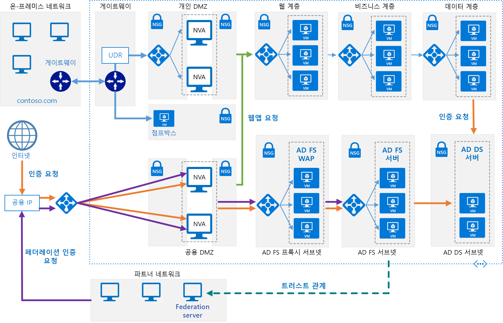

# <a name="extend-active-directory-federation-services-ad-fs-to-azure"></a><span data-ttu-id="97383-103">Azure로 AD FS(Active Directory Federation Services) 확장</span><span class="sxs-lookup"><span data-stu-id="97383-103">Extend Active Directory Federation Services (AD FS) to Azure</span></span>

<span data-ttu-id="97383-104">이 참조 아키텍처는 Azure로 온-프레미스 네트워크를 확장하는 보안 하이브리드 네트워크를 구현하고 [AD FS(Active Directory Federation Services)][active-directory-federation-services]를 사용하여 Azure에서 실행되는 구성 요소에 대한 페더레이션 인증 및 권한 부여를 수행합니다.</span><span class="sxs-lookup"><span data-stu-id="97383-104">This reference architecture implements a secure hybrid network that extends your on-premises network to Azure and uses [Active Directory Federation Services (AD FS)][active-directory-federation-services] to perform federated authentication and authorization for components running in Azure.</span></span> <span data-ttu-id="97383-105">[**이 솔루션을 배포합니다**](#deploy-the-solution).</span><span class="sxs-lookup"><span data-stu-id="97383-105">[**Deploy this solution**](#deploy-the-solution).</span></span>



<span data-ttu-id="97383-107">*이 아키텍처의 [Visio 파일][visio-download]을 다운로드합니다.*</span><span class="sxs-lookup"><span data-stu-id="97383-107">*Download a [Visio file][visio-download] of this architecture.*</span></span>

<span data-ttu-id="97383-108">AD FS는 온-프레미스에서 호스팅될 수 있지만 애플리케이션이 일부 부분이 Azure에서 구현되는 하이브리드인 경우 클라우드에서 AD FS를 복제하는 것이 더 효율적일 수 있습니다.</span><span class="sxs-lookup"><span data-stu-id="97383-108">AD FS can be hosted on-premises, but if your application is a hybrid in which some parts are implemented in Azure, it may be more efficient to replicate AD FS in the cloud.</span></span>

<span data-ttu-id="97383-109">다이어그램은 다음 시나리오를 보여 줍니다.</span><span class="sxs-lookup"><span data-stu-id="97383-109">The diagram shows the following scenarios:</span></span>

- <span data-ttu-id="97383-110">파트너 조직에서 애플리케이션 코드는 Azure VNet 내에서 호스팅되는 웹 애플리케이션에 액세스합니다.</span><span class="sxs-lookup"><span data-stu-id="97383-110">Application code from a partner organization accesses a web application hosted inside your Azure VNet.</span></span>
- <span data-ttu-id="97383-111">Active Directory DS(Domain Services) 내부에 저장된 자격 증명으로 등록된 외부 사용자는 Azure VNet 내에서 호스팅되는 웹 애플리케이션에 액세스합니다.</span><span class="sxs-lookup"><span data-stu-id="97383-111">An external, registered user with credentials stored inside Active Directory Domain Services (DS) accesses a web application hosted inside your Azure VNet.</span></span>
- <span data-ttu-id="97383-112">인증된 장치를 사용하여 VNet에 연결된 사용자는 Azure VNet 내에서 호스팅되는 웹 애플리케이션을 실행합니다.</span><span class="sxs-lookup"><span data-stu-id="97383-112">A user connected to your VNet using an authorized device executes a web application hosted inside your Azure VNet.</span></span>

<span data-ttu-id="97383-113">이 아키텍처의 일반적인 용도는 다음과 같습니다.</span><span class="sxs-lookup"><span data-stu-id="97383-113">Typical uses for this architecture include:</span></span>

- <span data-ttu-id="97383-114">작업이 부분적으로 온-프레미스 및 부분적으로 Azure에서 실행되는 하이브리드 애플리케이션</span><span class="sxs-lookup"><span data-stu-id="97383-114">Hybrid applications where workloads run partly on-premises and partly in Azure.</span></span>
- <span data-ttu-id="97383-115">페더레이션된 권한 부여를 사용하여 파트너 조직에 웹 애플리케이션을 노출하는 솔루션</span><span class="sxs-lookup"><span data-stu-id="97383-115">Solutions that use federated authorization to expose web applications to partner organizations.</span></span>
- <span data-ttu-id="97383-116">조직 방화벽 외부에서 실행되는 웹 브라우저에서 액세스를 지원하는 시스템</span><span class="sxs-lookup"><span data-stu-id="97383-116">Systems that support access from web browsers running outside of the organizational firewall.</span></span>
- <span data-ttu-id="97383-117">원격 컴퓨터, 노트북 및 다른 모바일 장치와 같은 승인된 외부 장치에서 연결하여 사용자가 웹 애플리케이션에 액세스할 수 있도록 하는 시스템</span><span class="sxs-lookup"><span data-stu-id="97383-117">Systems that enable users to access to web applications by connecting from authorized external devices such as remote computers, notebooks, and other mobile devices.</span></span>

<span data-ttu-id="97383-118">이 참조 아키텍처는 페더레이션 서버가 사용자를 인증하는 방법 및 시기를 결정하는 *수동 페더레이션*에 중점을 둡니다.</span><span class="sxs-lookup"><span data-stu-id="97383-118">This reference architecture focuses on *passive federation*, in which the federation servers decide how and when to authenticate a user.</span></span> <span data-ttu-id="97383-119">사용자는 애플리케이션이 시작될 때 로그인 정보를 제공합니다.</span><span class="sxs-lookup"><span data-stu-id="97383-119">The user provides sign in information when the application is started.</span></span> <span data-ttu-id="97383-120">이 메커니즘은 웹 브라우저에서 가장 일반적으로 사용되며 브라우저를 사용자가 인증하는 사이트로 리디렉션하는 프로토콜을 포함합니다.</span><span class="sxs-lookup"><span data-stu-id="97383-120">This mechanism is most commonly used by web browsers and involves a protocol that redirects the browser to a site where the user authenticates.</span></span> <span data-ttu-id="97383-121">AD FS는 또한 *활성 페더레이션*을 지원합니다. 여기서 애플리케이션은 추가 사용자 상호 작용 없이 자격 증명을 제공해야 하지만 해당 시나리오는 이 아키텍처의 범위를 벗어납니다.</span><span class="sxs-lookup"><span data-stu-id="97383-121">AD FS also supports *active federation*, where an application takes on responsibility for supplying credentials without further user interaction, but that scenario is outside the scope of this architecture.</span></span>

<span data-ttu-id="97383-122">추가 고려 사항은 [온-프레미스 Active Directory를 Azure와 통합하기 위한 솔루션 선택][considerations]을 참조하세요.</span><span class="sxs-lookup"><span data-stu-id="97383-122">For additional considerations, see [Choose a solution for integrating on-premises Active Directory with Azure][considerations].</span></span>

## <a name="architecture"></a><span data-ttu-id="97383-123">아키텍처</span><span class="sxs-lookup"><span data-stu-id="97383-123">Architecture</span></span>

<span data-ttu-id="97383-124">이 아키텍처는 [Azure로 AD DS 확장][extending-ad-to-azure]에 설명된 구현을 확장합니다.</span><span class="sxs-lookup"><span data-stu-id="97383-124">This architecture extends the implementation described in [Extending AD DS to Azure][extending-ad-to-azure].</span></span> <span data-ttu-id="97383-125">여기에는 다음 구성 요소가 포함됩니다.</span><span class="sxs-lookup"><span data-stu-id="97383-125">It contains the followign components.</span></span>

- <span data-ttu-id="97383-126">**AD DS 서브넷**</span><span class="sxs-lookup"><span data-stu-id="97383-126">**AD DS subnet**.</span></span> <span data-ttu-id="97383-127">AD DS 서버는 방화벽 역할을 하는 NSG(네트워크 보안 그룹) 규칙과 함께 자체의 서브넷에 포함됩니다.</span><span class="sxs-lookup"><span data-stu-id="97383-127">The AD DS servers are contained in their own subnet with network security group (NSG) rules acting as a firewall.</span></span>

- <span data-ttu-id="97383-128">**AD DS 서버**</span><span class="sxs-lookup"><span data-stu-id="97383-128">**AD DS servers**.</span></span> <span data-ttu-id="97383-129">Azure에서 VM으로 실행되는 도메인 컨트롤러</span><span class="sxs-lookup"><span data-stu-id="97383-129">Domain controllers running as VMs in Azure.</span></span> <span data-ttu-id="97383-130">이러한 서버는 도메인 내에서 로컬 ID의 인증을 제공합니다.</span><span class="sxs-lookup"><span data-stu-id="97383-130">These servers provide authentication of local identities within the domain.</span></span>

- <span data-ttu-id="97383-131">**AD FS 서브넷**</span><span class="sxs-lookup"><span data-stu-id="97383-131">**AD FS subnet**.</span></span> <span data-ttu-id="97383-132">AD FS 서버는 방화벽 역할을 하는 NSG 규칙과 함께 자체의 서브넷 내에 있습니다.</span><span class="sxs-lookup"><span data-stu-id="97383-132">The AD FS servers are located within their own subnet with NSG rules acting as a firewall.</span></span>

- <span data-ttu-id="97383-133">**AD FS 서버**</span><span class="sxs-lookup"><span data-stu-id="97383-133">**AD FS servers**.</span></span> <span data-ttu-id="97383-134">AD FS 서버는 페더레이션된 인증 및 권한 부여를 제공합니다.</span><span class="sxs-lookup"><span data-stu-id="97383-134">The AD FS servers provide federated authorization and authentication.</span></span> <span data-ttu-id="97383-135">이 아키텍처에서 다음 작업을 수행합니다.</span><span class="sxs-lookup"><span data-stu-id="97383-135">In this architecture, they perform the following tasks:</span></span>

  - <span data-ttu-id="97383-136">파트너 사용자를 대신하여 파트너 페더레이션 서버에서 만들어진 클레임을 포함하는 보안 토큰 받기</span><span class="sxs-lookup"><span data-stu-id="97383-136">Receiving security tokens containing claims made by a partner federation server on behalf of a partner user.</span></span> <span data-ttu-id="97383-137">AD FS는 요청에 권한을 부여하기 위해 Azure에서 실행되는 웹 애플리케이션에 클레임을 전달하기 전에 토큰이 유효한지 확인합니다.</span><span class="sxs-lookup"><span data-stu-id="97383-137">AD FS verifies that the tokens are valid before passing the claims to the web application running in Azure to authorize requests.</span></span>

    <span data-ttu-id="97383-138">Azure에서 실행되는 애플리케이션은 *신뢰 당사자*입니다.</span><span class="sxs-lookup"><span data-stu-id="97383-138">The application running in Azure is the *relying party*.</span></span> <span data-ttu-id="97383-139">파트너 페더레이션 서버는 웹 애플리케이션에서 인식할 수 있는 클레임을 발급해야 합니다.</span><span class="sxs-lookup"><span data-stu-id="97383-139">The partner federation server must issue claims that are understood by the web application.</span></span> <span data-ttu-id="97383-140">파트너 페더레이션 서버는 파트너 조직에서 인증된 계정을 대신하여 액세스 요청을 제출하기 때문에 *계정 파트너*라고 합니다.</span><span class="sxs-lookup"><span data-stu-id="97383-140">The partner federation servers are referred to as *account partners*, because they submit access requests on behalf of authenticated accounts in the partner organization.</span></span> <span data-ttu-id="97383-141">AD FS 서버는 리소스(웹 애플리케이션)에 대한 액세스를 제공하기 때문에 *리소스 파트너*라고 합니다.</span><span class="sxs-lookup"><span data-stu-id="97383-141">The AD FS servers are called *resource partners* because they provide access to resources (the web application).</span></span>

  - <span data-ttu-id="97383-142">AD DS 및 [Active Directory Device Registration Service][ADDRS]를 사용하여 웹 브라우저를 실행하는 외부 사용자 또는 웹 애플리케이션에 대한 액세스가 필요한 장치에서 들어오는 요청 인증 및 권한 부여</span><span class="sxs-lookup"><span data-stu-id="97383-142">Authenticating and authorizing incoming requests from external users running a web browser or device that needs access to web applications, by using AD DS and the [Active Directory Device Registration Service][ADDRS].</span></span>

  <span data-ttu-id="97383-143">AD FS 서버는 Azure 부하 분산 장치를 통해 액세스되는 팜으로 구성됩니다.</span><span class="sxs-lookup"><span data-stu-id="97383-143">The AD FS servers are configured as a farm accessed through an Azure load balancer.</span></span> <span data-ttu-id="97383-144">이 구현은 가용성과 확장성을 향상시킵니다.</span><span class="sxs-lookup"><span data-stu-id="97383-144">This implementation improves availability and scalability.</span></span> <span data-ttu-id="97383-145">AD FS 서버는 인터넷에 직접 노출되지 않습니다.</span><span class="sxs-lookup"><span data-stu-id="97383-145">The AD FS servers are not exposed directly to the Internet.</span></span> <span data-ttu-id="97383-146">모든 인터넷 트래픽은 AD FS 웹 애플리케이션 프록시 서버 및 DMZ(경계 네트워크라고도 함)를 통해 필터링됩니다.</span><span class="sxs-lookup"><span data-stu-id="97383-146">All Internet traffic is filtered through AD FS web application proxy servers and a DMZ (also referred to as a perimeter network).</span></span>

  <span data-ttu-id="97383-147">AD FS가 작동하는 방법에 대한 자세한 내용은 [Active Directory Federation Services 개요][active-directory-federation-services-overview]를 참조하세요.</span><span class="sxs-lookup"><span data-stu-id="97383-147">For more information about how AD FS works, see [Active Directory Federation Services Overview][active-directory-federation-services-overview].</span></span> <span data-ttu-id="97383-148">또한 [Azure에서 AD FS 배포][adfs-intro] 문서는 구현에 대한 자세한 단계별 소개를 포함합니다.</span><span class="sxs-lookup"><span data-stu-id="97383-148">Also, the article [AD FS deployment in Azure][adfs-intro] contains a detailed step-by-step introduction to implementation.</span></span>

- <span data-ttu-id="97383-149">**AD FS 프록시 서브넷**</span><span class="sxs-lookup"><span data-stu-id="97383-149">**AD FS proxy subnet**.</span></span> <span data-ttu-id="97383-150">AD FS 프록시 서버는 보호를 제공하는 NSG 규칙과 함께 자체의 서브넷 내에서 포함될 수 있습니다.</span><span class="sxs-lookup"><span data-stu-id="97383-150">The AD FS proxy servers can be contained within their own subnet, with NSG rules providing protection.</span></span> <span data-ttu-id="97383-151">이 서브넷의 서버는 Azure 가상 네트워크와 인터넷 간 방화벽을 제공하는 네트워크 가상 어플라이언스의 집합을 통해 인터넷에 노출됩니다.</span><span class="sxs-lookup"><span data-stu-id="97383-151">The servers in this subnet are exposed to the Internet through a set of network virtual appliances that provide a firewall between your Azure virtual network and the Internet.</span></span>

- <span data-ttu-id="97383-152">**AD FS WAP(웹 애플리케이션 프록시) 서버**</span><span class="sxs-lookup"><span data-stu-id="97383-152">**AD FS web application proxy (WAP) servers**.</span></span> <span data-ttu-id="97383-153">이러한 VM은 파트너 조직 및 외부 디바이스에서 들어오는 요청에 대한 AD FS 서버로 작동합니다.</span><span class="sxs-lookup"><span data-stu-id="97383-153">These VMs act as AD FS servers for incoming requests from partner organizations and external devices.</span></span> <span data-ttu-id="97383-154">WAP 서버는 AD FS 서버를 인터넷의 직접 액세스에서 보호하는 필터로 작동합니다.</span><span class="sxs-lookup"><span data-stu-id="97383-154">The WAP servers act as a filter, shielding the AD FS servers from direct access from the Internet.</span></span> <span data-ttu-id="97383-155">AD FS 서버와 마찬가지로 부하 분산으로 팜에서 WAP 서버를 배포하는 것은 독립 실행형 서버 컬렉션을 배포하는 것보다 더 큰 가용성 및 확장성을 제공합니다.</span><span class="sxs-lookup"><span data-stu-id="97383-155">As with the AD FS servers, deploying the WAP servers in a farm with load balancing gives you greater availability and scalability than deploying a collection of stand-alone servers.</span></span>

  > [!NOTE]
  > <span data-ttu-id="97383-156">WAP 서버 설치에 대한 자세한 내용은 [웹 애플리케이션 프록시 서버 설치 및 구성][install_and_configure_the_web_application_proxy_server]을 참조하세요.</span><span class="sxs-lookup"><span data-stu-id="97383-156">For detailed information about installing WAP servers, see [Install and Configure the Web Application Proxy Server][install_and_configure_the_web_application_proxy_server]</span></span>
  >

- <span data-ttu-id="97383-157">**파트너 조직**</span><span class="sxs-lookup"><span data-stu-id="97383-157">**Partner organization**.</span></span> <span data-ttu-id="97383-158">Azure에서 실행되는 웹 애플리케이션에 대한 액세스를 요청하는 웹 애플리케이션을 실행하는 파트너 조직</span><span class="sxs-lookup"><span data-stu-id="97383-158">A partner organization running a web application that requests access to a web application running in Azure.</span></span> <span data-ttu-id="97383-159">파트너 조직의 페더레이션 서버는 요청을 로컬로 인증하고 Azure에서 실행되는 AD FS에 대한 클레임을 포함하는 보안 토큰을 제출합니다.</span><span class="sxs-lookup"><span data-stu-id="97383-159">The federation server at the partner organization authenticates requests locally, and submits security tokens containing claims to AD FS running in Azure.</span></span> <span data-ttu-id="97383-160">Azure에서 AD FS는 보안 토큰의 유효성을 검사하고 유효한 경우 인증을 위해 Azure에서 실행되는 웹 애플리케이션에 클레임을 전달할 수 있습니다.</span><span class="sxs-lookup"><span data-stu-id="97383-160">AD FS in Azure validates the security tokens, and if valid can pass the claims to the web application running in Azure to authorize them.</span></span>

  > [!NOTE]
  > <span data-ttu-id="97383-161">또한 Azure 게이트웨이를 사용하여 신뢰할 수 있는 파트너에게 AD FS에 대한 직접 액세스를 제공하도록 VPN 터널을 구성할 수 있습니다.</span><span class="sxs-lookup"><span data-stu-id="97383-161">You can also configure a VPN tunnel using Azure gateway to provide direct access to AD FS for trusted partners.</span></span> <span data-ttu-id="97383-162">이러한 파트너에서 받은 요청은 WAP 서버를 통해 전달하지 마십시오.</span><span class="sxs-lookup"><span data-stu-id="97383-162">Requests received from these partners do not pass through the WAP servers.</span></span>
  >

## <a name="recommendations"></a><span data-ttu-id="97383-163">권장 사항</span><span class="sxs-lookup"><span data-stu-id="97383-163">Recommendations</span></span>

<span data-ttu-id="97383-164">대부분의 시나리오의 경우 다음 권장 사항을 적용합니다.</span><span class="sxs-lookup"><span data-stu-id="97383-164">The following recommendations apply for most scenarios.</span></span> <span data-ttu-id="97383-165">이러한 권장 사항을 재정의하라는 특정 요구 사항이 있는 경우가 아니면 따릅니다.</span><span class="sxs-lookup"><span data-stu-id="97383-165">Follow these recommendations unless you have a specific requirement that overrides them.</span></span>

### <a name="networking-recommendations"></a><span data-ttu-id="97383-166">네트워킹 권장 사항</span><span class="sxs-lookup"><span data-stu-id="97383-166">Networking recommendations</span></span>

<span data-ttu-id="97383-167">정적 개인 IP 주소로 AD FS 및 WAP 서버를 호스팅하는 각 VM에 대한 네트워크 인터페이스를 구성합니다.</span><span class="sxs-lookup"><span data-stu-id="97383-167">Configure the network interface for each of the VMs hosting AD FS and WAP servers with static private IP addresses.</span></span>

<span data-ttu-id="97383-168">AD FS VM에 공용 IP 주소를 제공하지 마십시오.</span><span class="sxs-lookup"><span data-stu-id="97383-168">Do not give the AD FS VMs public IP addresses.</span></span> <span data-ttu-id="97383-169">자세한 내용은 [보안 고려 사항](#security-considerations) 섹션을 참조하세요.</span><span class="sxs-lookup"><span data-stu-id="97383-169">For more information, see the [Security considerations](#security-considerations) section.</span></span>

<span data-ttu-id="97383-170">Active Directory DS VM을 참조하기 위해 각 AD FS 및 WAP VM의 네트워크 인터페이스에 대한 기본 및 보조 DNS(도메인 이름 서비스) 서버의 IP 주소를 설정합니다.</span><span class="sxs-lookup"><span data-stu-id="97383-170">Set the IP address of the preferred and secondary domain name service (DNS) servers for the network interfaces for each AD FS and WAP VM to reference the Active Directory DS VMs.</span></span> <span data-ttu-id="97383-171">Active Directory DS VM은 DNS를 실행해야 합니다.</span><span class="sxs-lookup"><span data-stu-id="97383-171">The Active Directory DS VMs should be running DNS.</span></span> <span data-ttu-id="97383-172">이 단계는 각 VM을 도메인에 조인하기 위해 필요합니다.</span><span class="sxs-lookup"><span data-stu-id="97383-172">This step is necessary to enable each VM to join the domain.</span></span>

### <a name="ad-fs-installation"></a><span data-ttu-id="97383-173">AD FS 설치</span><span class="sxs-lookup"><span data-stu-id="97383-173">AD FS installation</span></span>

<span data-ttu-id="97383-174">[페더레이션 서버 팜 배포][Deploying_a_federation_server_farm] 문서는 AD FS 설치 및 구성에 대한 자세한 지침을 제공합니다.</span><span class="sxs-lookup"><span data-stu-id="97383-174">The article [Deploying a Federation Server Farm][Deploying_a_federation_server_farm] provides detailed instructions for installing and configuring AD FS.</span></span> <span data-ttu-id="97383-175">팜의 첫 번째 AD FS 서버를 구성하기 전에 다음 작업을 수행합니다.</span><span class="sxs-lookup"><span data-stu-id="97383-175">Perform the following tasks before configuring the first AD FS server in the farm:</span></span>

1. <span data-ttu-id="97383-176">서버 인증을 수행하기 위해 공개적으로 신뢰할 수 있는 인증서를 가져옵니다.</span><span class="sxs-lookup"><span data-stu-id="97383-176">Obtain a publicly trusted certificate for performing server authentication.</span></span> <span data-ttu-id="97383-177">*주체 이름*은 페더레이션 서비스에 액세스하는 데 사용하는 이름 클라이언트를 포함해야 합니다.</span><span class="sxs-lookup"><span data-stu-id="97383-177">The *subject name* must contain the name clients use to access the federation service.</span></span> <span data-ttu-id="97383-178">부하 분산에 대해 등록된 DNS 이름일 수 있습니다(예: *adfs.contoso.com*). (보안상의 이유로 *.contoso.com*과 같은 와일드카드 이름 사용을 피합니다.)</span><span class="sxs-lookup"><span data-stu-id="97383-178">This can be the DNS name registered for the load balancer, for example, *adfs.contoso.com* (avoid using wildcard names such as \**.contoso.com*, for security reasons).</span></span> <span data-ttu-id="97383-179">모든 AD FS 서버 VM에 동일한 인증서를 사용합니다.</span><span class="sxs-lookup"><span data-stu-id="97383-179">Use the same certificate on all AD FS server VMs.</span></span> <span data-ttu-id="97383-180">신뢰할 수 있는 인증 기관에서 인증서를 구입할 수 있지만 조직에서 Active Directory Certificate Services를 사용하는 경우 직접 만들 수 있습니다.</span><span class="sxs-lookup"><span data-stu-id="97383-180">You can purchase a certificate from a trusted certification authority, but if your organization uses Active Directory Certificate Services you can create your own.</span></span>

    <span data-ttu-id="97383-181">*주체 대체 이름*은 외부 디바이스에서 액세스할 수 있도록 DRS(디바이스 등록 서비스)에서 사용됩니다.</span><span class="sxs-lookup"><span data-stu-id="97383-181">The *subject alternative name* is used by the device registration service (DRS) to enable access from external devices.</span></span> <span data-ttu-id="97383-182">*enterpriseregistration.contoso.com* 형식이어야 합니다.</span><span class="sxs-lookup"><span data-stu-id="97383-182">This should be of the form *enterpriseregistration.contoso.com*.</span></span>

    <span data-ttu-id="97383-183">자세한 내용은 [AD FS에 대한 SSL(Secure Sockets Layer) 인증서 가져오기 및 구성][adfs_certificates]을 참조하세요.</span><span class="sxs-lookup"><span data-stu-id="97383-183">For more information, see [Obtain and Configure a Secure Sockets Layer (SSL) Certificate for AD FS][adfs_certificates].</span></span>

2. <span data-ttu-id="97383-184">도메인 컨트롤러에서 키 배포 서비스에 대한 새 루트 키를 생성합니다.</span><span class="sxs-lookup"><span data-stu-id="97383-184">On the domain controller, generate a new root key for the Key Distribution Service.</span></span> <span data-ttu-id="97383-185">10시간을 뺀 현재 시간으로 유효한 시간을 설정합니다.(이 구성은 도메인에서 키 배포 및 동기화에서 발생할 수 있는 지연을 줄입니다.)</span><span class="sxs-lookup"><span data-stu-id="97383-185">Set the effective time to the current time minus 10 hours (this configuration reduces the delay that can occur in distributing and synchronizing keys across the domain).</span></span> <span data-ttu-id="97383-186">이 단계는 AD FS 서비스를 실행하는 데 사용되는 그룹 서비스 계정 만들기를 지원하는 데 필요합니다.</span><span class="sxs-lookup"><span data-stu-id="97383-186">This step is necessary to support creating the group service account that is used to run the AD FS service.</span></span> <span data-ttu-id="97383-187">다음 PowerShell 명령은 이 작업을 수행하는 방법의 예를 보여 줍니다.</span><span class="sxs-lookup"><span data-stu-id="97383-187">The following PowerShell command shows an example of how to do this:</span></span>

    ```powershell
    Add-KdsRootKey -EffectiveTime (Get-Date).AddHours(-10)
    ```

3. <span data-ttu-id="97383-188">각 AD FS 서버 VM을 도메인에 추가합니다.</span><span class="sxs-lookup"><span data-stu-id="97383-188">Add each AD FS server VM to the domain.</span></span>

> [!NOTE]
> <span data-ttu-id="97383-189">AD FS를 설치하려면 도메인에 대한 PDC(주 도메인 컨트롤러) 에뮬레이터 FSMO(유연한 단일 마스터 작업) 역할을 실행하는 도메인 컨트롤러는 AD FS VM에서 실행되고 액세스할 수 있어야 합니다.</span><span class="sxs-lookup"><span data-stu-id="97383-189">To install AD FS, the domain controller running the primary domain controller (PDC) emulator flexible single master operation (FSMO) role for the domain must be running and accessible from the AD FS VMs.</span></span> <span data-ttu-id="97383-190"><<RBC: 덜 반복적으로 만드는 방법이 있나요?>></span><span class="sxs-lookup"><span data-stu-id="97383-190"><<RBC: Is there a way to make this less repetitive?>></span></span>
>

### <a name="ad-fs-trust"></a><span data-ttu-id="97383-191">AD FS 신뢰</span><span class="sxs-lookup"><span data-stu-id="97383-191">AD FS trust</span></span>

<span data-ttu-id="97383-192">AD FS 설치 및 모든 파트너 조직의 페더레이션 서버 간에 페더레이션 트러스트를 설정합니다.</span><span class="sxs-lookup"><span data-stu-id="97383-192">Establish federation trust between your AD FS installation, and the federation servers of any partner organizations.</span></span> <span data-ttu-id="97383-193">필요한 클레임 필터링 및 매핑을 구성합니다.</span><span class="sxs-lookup"><span data-stu-id="97383-193">Configure any claims filtering and mapping required.</span></span>

- <span data-ttu-id="97383-194">각 파트너 조직의 DevOps 직원은 AD FS 서버를 통해 액세스할 수 있는 웹 애플리케이션에 대한 신뢰 당사자 트러스트를 추가해야 합니다.</span><span class="sxs-lookup"><span data-stu-id="97383-194">DevOps staff at each partner organization must add a relying party trust for the web applications accessible through your AD FS servers.</span></span>
- <span data-ttu-id="97383-195">조직의 DevOps 직원은 AD FS 서버가 파트너 조직에서 제공하는 클레임을 신뢰할 수 있도록 클레임 공급자 트러스트를 구성해야 합니다.</span><span class="sxs-lookup"><span data-stu-id="97383-195">DevOps staff in your organization must configure claims-provider trust to enable your AD FS servers to trust the claims that partner organizations provide.</span></span>
- <span data-ttu-id="97383-196">또한 조직의 DevOps 직원은 조직의 웹 애플리케이션에 클레임을 전달하도록 AD FS를 구성해야 합니다.</span><span class="sxs-lookup"><span data-stu-id="97383-196">DevOps staff in your organization must also configure AD FS to pass claims on to your organization's web applications.</span></span>

<span data-ttu-id="97383-197">자세한 내용은 [페더레이션 트러스트 설정][establishing-federation-trust]을 참조하세요.</span><span class="sxs-lookup"><span data-stu-id="97383-197">For more information, see [Establishing Federation Trust][establishing-federation-trust].</span></span>

<span data-ttu-id="97383-198">조직의 웹 애플리케이션을 게시하고 WAP 서버를 통해 사전 인증을 사용하여 외부 파트너에 사용할 수 있도록 합니다.</span><span class="sxs-lookup"><span data-stu-id="97383-198">Publish your organization's web applications and make them available to external partners by using preauthentication through the WAP servers.</span></span> <span data-ttu-id="97383-199">자세한 내용은 [AD FS 사전 인증을 사용하여 애플리케이션 게시][publish_applications_using_AD_FS_preauthentication]를 참조하세요.</span><span class="sxs-lookup"><span data-stu-id="97383-199">For more information, see [Publish Applications using AD FS Preauthentication][publish_applications_using_AD_FS_preauthentication]</span></span>

<span data-ttu-id="97383-200">AD FS는 토큰 변환 및 확대를 지원합니다.</span><span class="sxs-lookup"><span data-stu-id="97383-200">AD FS supports token transformation and augmentation.</span></span> <span data-ttu-id="97383-201">Azure Active Directory는 이 기능을 제공하지 않습니다.</span><span class="sxs-lookup"><span data-stu-id="97383-201">Azure Active Directory does not provide this feature.</span></span> <span data-ttu-id="97383-202">AD FS를 사용하여 트러스트 관계를 설정할 때 다음을 수행할 수 있습니다.</span><span class="sxs-lookup"><span data-stu-id="97383-202">With AD FS, when you set up the trust relationships, you can:</span></span>

- <span data-ttu-id="97383-203">권한 부여 규칙에 대한 클레임 변환을 구성합니다.</span><span class="sxs-lookup"><span data-stu-id="97383-203">Configure claim transformations for authorization rules.</span></span> <span data-ttu-id="97383-204">예를 들어 비 Microsoft 파트너 조직에서 사용되는 표현에서 조직에서 해당 Active Directory DS가 조직에서 권한을 부여할 수 있는 것으로 그룹 보안을 매핑할 수 있습니다.</span><span class="sxs-lookup"><span data-stu-id="97383-204">For example, you can map group security from a representation used by a non-Microsoft partner organization to something that that Active Directory DS can authorize in your organization.</span></span>
- <span data-ttu-id="97383-205">클레임을 한 형식에서 다른 형식으로 변환합니다.</span><span class="sxs-lookup"><span data-stu-id="97383-205">Transform claims from one format to another.</span></span> <span data-ttu-id="97383-206">예를 들어 애플리케이션이 SAML 1.1 클레임만을 지원하는 경우 SAML 2.0에서 SAML 1.1로 매핑할 수 있습니다.</span><span class="sxs-lookup"><span data-stu-id="97383-206">For example, you can map from SAML 2.0 to SAML 1.1 if your application only supports SAML 1.1 claims.</span></span>

### <a name="ad-fs-monitoring"></a><span data-ttu-id="97383-207">AD FS 모니터링</span><span class="sxs-lookup"><span data-stu-id="97383-207">AD FS monitoring</span></span>

<span data-ttu-id="97383-208">[Active Directory Federation Services 2012 R2용 Microsoft System Center 관리 팩][oms-adfs-pack]은 페더레이션 서버에 대한 AD FS 배포의 사전 예방적이며 반응적인 모니터링을 제공합니다.</span><span class="sxs-lookup"><span data-stu-id="97383-208">The [Microsoft System Center Management Pack for Active Directory Federation Services 2012 R2][oms-adfs-pack] provides both proactive and reactive monitoring of your AD FS deployment for the federation server.</span></span> <span data-ttu-id="97383-209">이 관리 팩은 다음을 모니터링합니다.</span><span class="sxs-lookup"><span data-stu-id="97383-209">This management pack monitors:</span></span>

- <span data-ttu-id="97383-210">AD FS 서비스가 해당 이벤트 로그에 기록하는 이벤트</span><span class="sxs-lookup"><span data-stu-id="97383-210">Events that the AD FS service records in its event logs.</span></span>
- <span data-ttu-id="97383-211">AD FS 성능 카운터가 수집하는 성능 데이터</span><span class="sxs-lookup"><span data-stu-id="97383-211">The performance data that the AD FS performance counters collect.</span></span>
- <span data-ttu-id="97383-212">AD FS 시스템 및 웹 애플리케이션(신뢰 당사자)의 전반적인 상태, 중요한 문제 및 경고에 대한 경고를 제공합니다.</span><span class="sxs-lookup"><span data-stu-id="97383-212">The overall health of the AD FS system and web applications (relying parties), and provides alerts for critical issues and warnings.</span></span>

## <a name="scalability-considerations"></a><span data-ttu-id="97383-213">확장성 고려 사항</span><span class="sxs-lookup"><span data-stu-id="97383-213">Scalability considerations</span></span>

<span data-ttu-id="97383-214">[AD FS 배포 계획][plan-your-adfs-deployment] 문서에서 요약된 다음 고려 사항은 AD FS 팜 크기 조정에 대한 시작 지점을 제공합니다.</span><span class="sxs-lookup"><span data-stu-id="97383-214">The following considerations, summarized from the article [Plan your AD FS deployment][plan-your-adfs-deployment], give a starting point for sizing AD FS farms:</span></span>

- <span data-ttu-id="97383-215">1000명의 사용자보다 적은 경우 전용 서버를 만들지 마십시오. 대신 클라우드의 각 Active Directory DS 서버에 AD FS를 설치합니다.</span><span class="sxs-lookup"><span data-stu-id="97383-215">If you have fewer than 1000 users, do not create dedicated servers, but instead install AD FS on each of the Active Directory DS servers in the cloud.</span></span> <span data-ttu-id="97383-216">가용성을 유지하기 위해 두 개 이상의 Active Directory DS 서버가 있는지 확인합니다.</span><span class="sxs-lookup"><span data-stu-id="97383-216">Make sure that you have at least two Active Directory DS servers to maintain availability.</span></span> <span data-ttu-id="97383-217">단일 WAP 서버를 만듭니다.</span><span class="sxs-lookup"><span data-stu-id="97383-217">Create a single WAP server.</span></span>
- <span data-ttu-id="97383-218">1000명에서 15000명 사이의 사용자가 있는 경우 두 개의 전용 AD FS 서버 및 두 개의 전용 WAP 서버를 만듭니다.</span><span class="sxs-lookup"><span data-stu-id="97383-218">If you have between 1000 and 15000 users, create two dedicated AD FS servers and two dedicated WAP servers.</span></span>
- <span data-ttu-id="97383-219">15000명에서 60000명 사이의 사용자가 있는 경우 세 개에서 다섯 개 사이의 전용 AD FS 서버 및 두 개 이상의 전용 WAP 서버를 만듭니다.</span><span class="sxs-lookup"><span data-stu-id="97383-219">If you have between 15000 and 60000 users, create between three and five dedicated AD FS servers and at least two dedicated WAP servers.</span></span>

<span data-ttu-id="97383-220">이러한 고려 사항은 Azure에서 듀얼 쿼드 코어 VM(표준 D4_v2 또는 그 이상) 크기를 사용하고 있다고 가정합니다.</span><span class="sxs-lookup"><span data-stu-id="97383-220">These considerations assume that you are using dual quad-core VM (Standard D4_v2, or better) sizes in Azure.</span></span>

<span data-ttu-id="97383-221">AD FS 구성 데이터를 저장하는 데 Windows 내부 데이터베이스를 사용하는 경우 팜에서 8개의 AD FS 서버로 제한됩니다.</span><span class="sxs-lookup"><span data-stu-id="97383-221">If you are using the Windows Internal Database to store AD FS configuration data, you are limited to eight AD FS servers in the farm.</span></span> <span data-ttu-id="97383-222">나중에 더 필요할 것이라고 예상하는 경우 SQL Server를 사용합니다.</span><span class="sxs-lookup"><span data-stu-id="97383-222">If you anticipate that you will need more in the future, use SQL Server.</span></span> <span data-ttu-id="97383-223">자세한 내용은 [AD FS 구성 데이터베이스의 역할][adfs-configuration-database]을 참조하세요.</span><span class="sxs-lookup"><span data-stu-id="97383-223">For more information, see [The Role of the AD FS Configuration Database][adfs-configuration-database].</span></span>

## <a name="availability-considerations"></a><span data-ttu-id="97383-224">가용성 고려 사항</span><span class="sxs-lookup"><span data-stu-id="97383-224">Availability considerations</span></span>

<span data-ttu-id="97383-225">서비스의 가용성 향상을 위해 두 개 이상의 서버와 함께 AD FS 팜을 만듭니다.</span><span class="sxs-lookup"><span data-stu-id="97383-225">Create an AD FS farm with at least two servers to increase availability of the service.</span></span> <span data-ttu-id="97383-226">팜의 각 AD FS VM에 대해 다른 저장소 계정을 사용합니다.</span><span class="sxs-lookup"><span data-stu-id="97383-226">Use different storage accounts for each AD FS VM in the farm.</span></span> <span data-ttu-id="97383-227">이 방법을 사용하면 단일 저장소 계정의 실패가 전체 팜을 액세스할 수 없도록 하지 않습니다.</span><span class="sxs-lookup"><span data-stu-id="97383-227">This approach helps to ensure that a failure in a single storage account does not make the entire farm inaccessible.</span></span>

<span data-ttu-id="97383-228">AD FS 및 WAP VM에 대한 별도 Azure 가용성 집합을 만듭니다.</span><span class="sxs-lookup"><span data-stu-id="97383-228">Create separate Azure availability sets for the AD FS and WAP VMs.</span></span> <span data-ttu-id="97383-229">각 집합에 두 개 이상의 VM이 있는지 확인합니다.</span><span class="sxs-lookup"><span data-stu-id="97383-229">Ensure that there are at least two VMs in each set.</span></span> <span data-ttu-id="97383-230">각 가용성 집합은 두 개 이상의 업데이트 도메인 및 두 개의 장애 도메인이 있어야 합니다.</span><span class="sxs-lookup"><span data-stu-id="97383-230">Each availability set must have at least two update domains and two fault domains.</span></span>

<span data-ttu-id="97383-231">다음과 같이 AD FS VM 및 WAP VM에 대한 부하 분산 장치를 구성합니다.</span><span class="sxs-lookup"><span data-stu-id="97383-231">Configure the load balancers for the AD FS VMs and WAP VMs as follows:</span></span>

- <span data-ttu-id="97383-232">WAP VM에 대한 외부 액세스를 제공하는 Azure 부하 분산 장치 및 팜의 AD FS 서버 간에 부하를 분산하는 내부 부하 분산 장치를 사용합니다.</span><span class="sxs-lookup"><span data-stu-id="97383-232">Use an Azure load balancer to provide external access to the WAP VMs, and an internal load balancer to distribute the load across the AD FS servers in the farm.</span></span>
- <span data-ttu-id="97383-233">포트 443(HTTPS)에 표시되는 트래픽을 AD FS/WAP 서버에 전달합니다.</span><span class="sxs-lookup"><span data-stu-id="97383-233">Only pass traffic appearing on port 443 (HTTPS) to the AD FS/WAP servers.</span></span>
- <span data-ttu-id="97383-234">부하 분산 장치에 고정 IP 주소를 지정합니다.</span><span class="sxs-lookup"><span data-stu-id="97383-234">Give the load balancer a static IP address.</span></span>
- <span data-ttu-id="97383-235">`/adfs/probe`에 대해 HTTP를 사용하여 상태 프로브를 만듭니다.</span><span class="sxs-lookup"><span data-stu-id="97383-235">Create a health probe using HTTP against `/adfs/probe`.</span></span> <span data-ttu-id="97383-236">자세한 내용은 [하드웨어 Load Balancer 상태 검사 및 웹 애플리케이션 프록시 / AD FS 2012 R2](https://blogs.technet.microsoft.com/applicationproxyblog/2014/10/17/hardware-load-balancer-health-checks-and-web-application-proxy-ad-fs-2012-r2/)를 참조합니다.</span><span class="sxs-lookup"><span data-stu-id="97383-236">For more information, see [Hardware Load Balancer Health Checks and Web Application Proxy / AD FS 2012 R2](https://blogs.technet.microsoft.com/applicationproxyblog/2014/10/17/hardware-load-balancer-health-checks-and-web-application-proxy-ad-fs-2012-r2/).</span></span>

  > [!NOTE]
  > <span data-ttu-id="97383-237">AD FS 서버는 SNI(서버 이름 표시) 프로토콜을 사용하므로 부하 분산 장치에서 HTTPS 엔드포인트를 사용하는 프로브에 대한 시도는 실패합니다.</span><span class="sxs-lookup"><span data-stu-id="97383-237">AD FS servers use the Server Name Indication (SNI) protocol, so attempting to probe using an HTTPS endpoint from the load balancer fails.</span></span>
  >

- <span data-ttu-id="97383-238">AD FS 부하 분산 장치에 대한 도메인에 DNS *A* 레코드를 추가합니다.</span><span class="sxs-lookup"><span data-stu-id="97383-238">Add a DNS *A* record to the domain for the AD FS load balancer.</span></span> <span data-ttu-id="97383-239">부하 분산 장치의 IP 주소를 지정하고 도메인의 이름을 지정합니다(예: adfs.contoso.com).</span><span class="sxs-lookup"><span data-stu-id="97383-239">Specify the IP address of the load balancer, and give it a name in the domain (such as adfs.contoso.com).</span></span> <span data-ttu-id="97383-240">이는 AD FS 서버 팜에 액세스하는 데 사용하는 이름 클라이언트 및 WAP 서버입니다.</span><span class="sxs-lookup"><span data-stu-id="97383-240">This is the name clients and the WAP servers use to access the AD FS server farm.</span></span>

<span data-ttu-id="97383-241">SQL Server 또는 Windows 내부 데이터베이스를 사용하여 AD FS 구성 정보를 보관할 수 있습니다.</span><span class="sxs-lookup"><span data-stu-id="97383-241">You can use either SQL Server or the Windows Internal Database to hold AD FS configuration information.</span></span> <span data-ttu-id="97383-242">Windows 내부 데이터베이스는 기본 중복성을 제공합니다.</span><span class="sxs-lookup"><span data-stu-id="97383-242">The Windows Internal Database provides basic redundancy.</span></span> <span data-ttu-id="97383-243">변경 내용은 AD FS 클러스터의 AD FS 데이터베이스 중 하나에 직접 기록되는 반면 다른 서버는 끌어오기 복제를 사용하여 해당 데이터베이스를 최신 상태로 유지합니다.</span><span class="sxs-lookup"><span data-stu-id="97383-243">Changes are written directly to only one of the AD FS databases in the AD FS cluster, while the other servers use pull replication to keep their databases up to date.</span></span> <span data-ttu-id="97383-244">SQL Server를 사용하면 장애 조치(failover) 클러스터링 또는 미러링을 사용하여 전체 데이터베이스 중복성 및 고가용성을 제공할 수 있습니다.</span><span class="sxs-lookup"><span data-stu-id="97383-244">Using SQL Server can provide full database redundancy and high availability using failover clustering or mirroring.</span></span>

## <a name="manageability-considerations"></a><span data-ttu-id="97383-245">관리 효율성 고려 사항</span><span class="sxs-lookup"><span data-stu-id="97383-245">Manageability considerations</span></span>

<span data-ttu-id="97383-246">DevOps 직원은 다음 작업을 수행할 준비가 되어 있어야 합니다.</span><span class="sxs-lookup"><span data-stu-id="97383-246">DevOps staff should be prepared to perform the following tasks:</span></span>

- <span data-ttu-id="97383-247">AD FS 팜 관리, 페더레이션 서버의 트러스트 정책 관리 및 페더레이션 서비스에서 사용되는 인증서 관리를 포함하는 페더레이션 서버 관리</span><span class="sxs-lookup"><span data-stu-id="97383-247">Managing the federation servers, including managing the AD FS farm, managing trust policy on the federation servers, and managing the certificates used by the federation services.</span></span>
- <span data-ttu-id="97383-248">WAP 팜 및 인증서 관리를 포함하는 WAP 서버 관리</span><span class="sxs-lookup"><span data-stu-id="97383-248">Managing the WAP servers including managing the WAP farm and certificates.</span></span>
- <span data-ttu-id="97383-249">신뢰 당사자, 인증 방법 및 클레임 매핑 구성을 포함하는 웹 애플리케이션 관리</span><span class="sxs-lookup"><span data-stu-id="97383-249">Managing web applications including configuring relying parties, authentication methods, and claims mappings.</span></span>
- <span data-ttu-id="97383-250">AD FS 구성 요소 백업</span><span class="sxs-lookup"><span data-stu-id="97383-250">Backing up AD FS components.</span></span>

## <a name="security-considerations"></a><span data-ttu-id="97383-251">보안 고려 사항</span><span class="sxs-lookup"><span data-stu-id="97383-251">Security considerations</span></span>

<span data-ttu-id="97383-252">AD FS는 HTTPS를 사용하므로 웹 계층 VM을 포함하는 서브넷에 대한 NSG 규칙이 HTTPS 요청을 허용하는지 확인합니다.</span><span class="sxs-lookup"><span data-stu-id="97383-252">AD FS uses HTTPS, so make sure that the NSG rules for the subnet containing the web tier VMs permit HTTPS requests.</span></span> <span data-ttu-id="97383-253">이러한 요청은 온-프레미스 네트워크, 웹 계층, 비즈니스 계층, 데이터 계층, 개인 DMZ, 공용 DMZ를 포함하는 서브넷 및 AD FS 서버를 포함하는 서브넷에서 발생할 수 있습니다.</span><span class="sxs-lookup"><span data-stu-id="97383-253">These requests can originate from the on-premises network, the subnets containing the web tier, business tier, data tier, private DMZ, public DMZ, and the subnet containing the AD FS servers.</span></span>

<span data-ttu-id="97383-254">인터넷에 대한 AD FS 서버의 직접 노출을 방지합니다.</span><span class="sxs-lookup"><span data-stu-id="97383-254">Prevent direct exposure of the AD FS servers to the Internet.</span></span> <span data-ttu-id="97383-255">AD FS 서버는 보안 토큰을 부여하는 완전한 권한이 있는 도메인에 가입된 컴퓨터입니다.</span><span class="sxs-lookup"><span data-stu-id="97383-255">AD FS servers are domain-joined computers that have full authorization to grant security tokens.</span></span> <span data-ttu-id="97383-256">서버가 손상되면 악의적인 사용자가 모든 웹 애플리케이션 및 AD FS로 보호되는 모든 페더레이션 서버에 전체 액세스 토큰을 발급할 수 있습니다.</span><span class="sxs-lookup"><span data-stu-id="97383-256">If a server is compromised, a malicious user can issue full access tokens to all web applications and to all federation servers that are protected by AD FS.</span></span> <span data-ttu-id="97383-257">시스템이 신뢰할 수 있는 파트너 사이트에서 연결하지 않은 외부 사용자의 요청을 처리해야 하는 경우 WAP 서버를 사용하여 이러한 요청을 처리합니다.</span><span class="sxs-lookup"><span data-stu-id="97383-257">If your system must handle requests from external users not connecting from trusted partner sites, use WAP servers to handle these requests.</span></span> <span data-ttu-id="97383-258">자세한 내용은 [페더레이션 서버 프록시를 배치할 위치][where-to-place-an-fs-proxy]를 참조하세요.</span><span class="sxs-lookup"><span data-stu-id="97383-258">For more information, see [Where to Place a Federation Server Proxy][where-to-place-an-fs-proxy].</span></span>

<span data-ttu-id="97383-259">AD FS 서버와 WAP 서버를 자체 방화벽이 있는 별도 서브넷에 배치합니다.</span><span class="sxs-lookup"><span data-stu-id="97383-259">Place AD FS servers and WAP servers in separate subnets with their own firewalls.</span></span> <span data-ttu-id="97383-260">NSG 규칙을 사용하여 방화벽 규칙을 정의할 수 있습니다.</span><span class="sxs-lookup"><span data-stu-id="97383-260">You can use NSG rules to define firewall rules.</span></span> <span data-ttu-id="97383-261">모든 방화벽은 포트 443(HTTPS)의 트래픽을 허용해야 합니다.</span><span class="sxs-lookup"><span data-stu-id="97383-261">All firewalls should allow traffic on port 443 (HTTPS).</span></span>

<span data-ttu-id="97383-262">AD FS 및 WAP 서버에 대한 직접 로그인 액세스를 제한합니다.</span><span class="sxs-lookup"><span data-stu-id="97383-262">Restrict direct sign in access to the AD FS and WAP servers.</span></span> <span data-ttu-id="97383-263">DevOps 직원만 연결할 수 있어야 합니다.</span><span class="sxs-lookup"><span data-stu-id="97383-263">Only DevOps staff should be able to connect.</span></span> <span data-ttu-id="97383-264">WAP 서버를 도메인에 조인하지 마십시오.</span><span class="sxs-lookup"><span data-stu-id="97383-264">Do not join the WAP servers to the domain.</span></span>

<span data-ttu-id="97383-265">감사를 목적으로 가상 네트워크의 에지를 탐색하는 트래픽의 자세한 정보를 기록하는 네트워크 가상 어플라이언스의 집합을 사용하는 것이 좋습니다.</span><span class="sxs-lookup"><span data-stu-id="97383-265">Consider using a set of network virtual appliances that logs detailed information on traffic traversing the edge of your virtual network for auditing purposes.</span></span>

## <a name="deploy-the-solution"></a><span data-ttu-id="97383-266">솔루션 배포</span><span class="sxs-lookup"><span data-stu-id="97383-266">Deploy the solution</span></span>

<span data-ttu-id="97383-267">이 아키텍처에 대한 배포는 [GitHub][github]에서 사용할 수 있습니다.</span><span class="sxs-lookup"><span data-stu-id="97383-267">A deployment for this architecture is available on [GitHub][github].</span></span> <span data-ttu-id="97383-268">전체 배포는 최대 2시간이 걸릴 수 있으며 VPN 게이트웨이 만들기 및 Active Directory 및 AD FS를 구성하는 스크립트 실행을 포함합니다.</span><span class="sxs-lookup"><span data-stu-id="97383-268">Note that the entire deployment can take up to two hours, which includes creating the VPN gateway and running the scripts that configure Active Directory and AD FS.</span></span>

### <a name="prerequisites"></a><span data-ttu-id="97383-269">필수 조건</span><span class="sxs-lookup"><span data-stu-id="97383-269">Prerequisites</span></span>

1. <span data-ttu-id="97383-270">[GitHub 리포지토리](https://github.com/mspnp/identity-reference-architectures)의 zip 파일을 복제, 포크 또는 다운로드합니다.</span><span class="sxs-lookup"><span data-stu-id="97383-270">Clone, fork, or download the zip file for the [GitHub repository](https://github.com/mspnp/identity-reference-architectures).</span></span>

1. <span data-ttu-id="97383-271">[Azure CLI 2.0](/cli/azure/install-azure-cli?view=azure-cli-latest)을 설치합니다.</span><span class="sxs-lookup"><span data-stu-id="97383-271">Install [Azure CLI 2.0](/cli/azure/install-azure-cli?view=azure-cli-latest).</span></span>

1. <span data-ttu-id="97383-272">[Azure 빌딩 블록](https://github.com/mspnp/template-building-blocks/wiki/Install-Azure-Building-Blocks) npm 패키지를 설치합니다.</span><span class="sxs-lookup"><span data-stu-id="97383-272">Install the [Azure building blocks](https://github.com/mspnp/template-building-blocks/wiki/Install-Azure-Building-Blocks) npm package.</span></span>

   ```bash
   npm install -g @mspnp/azure-building-blocks
   ```

1. <span data-ttu-id="97383-273">명령 프롬프트, bash 프롬프트 또는 PowerShell 프롬프트에서 다음과 같은 Azure 계정에 로그인합니다.</span><span class="sxs-lookup"><span data-stu-id="97383-273">From a command prompt, bash prompt, or PowerShell prompt, sign into your Azure account as follows:</span></span>

   ```bash
   az login
   ```

### <a name="deploy-the-simulated-on-premises-datacenter"></a><span data-ttu-id="97383-274">시뮬레이션된 온-프레미스 데이터 센터 배포</span><span class="sxs-lookup"><span data-stu-id="97383-274">Deploy the simulated on-premises datacenter</span></span>

1. <span data-ttu-id="97383-275">GitHub 리포지토리의 `adfs` 폴더로 이동합니다.</span><span class="sxs-lookup"><span data-stu-id="97383-275">Navigate to the `adfs` folder of the GitHub repository.</span></span>

1. <span data-ttu-id="97383-276">`onprem.json` 파일을 엽니다.</span><span class="sxs-lookup"><span data-stu-id="97383-276">Open the `onprem.json` file.</span></span> <span data-ttu-id="97383-277">`adminPassword`, `Password` 및 `SafeModeAdminPassword` 인스턴스를 검색하고 암호를 업데이트합니다.</span><span class="sxs-lookup"><span data-stu-id="97383-277">Search for instances of `adminPassword`, `Password`, and `SafeModeAdminPassword` and update the passwords.</span></span>

1. <span data-ttu-id="97383-278">다음 명령을 실행하고 배포가 끝나기를 기다립니다.</span><span class="sxs-lookup"><span data-stu-id="97383-278">Run the following command and wait for the deployment to finish:</span></span>

    ```bash
    azbb -s <subscription_id> -g <resource group> -l <location> -p onprem.json --deploy
    ```

### <a name="deploy-the-azure-infrastructure"></a><span data-ttu-id="97383-279">Azure 인프라 배포</span><span class="sxs-lookup"><span data-stu-id="97383-279">Deploy the Azure infrastructure</span></span>

1. <span data-ttu-id="97383-280">`azure.json` 파일을 엽니다.</span><span class="sxs-lookup"><span data-stu-id="97383-280">Open the `azure.json` file.</span></span>  <span data-ttu-id="97383-281">`adminPassword` 및 `Password` 인스턴스를 검색하고 암호 값을 추가합니다.</span><span class="sxs-lookup"><span data-stu-id="97383-281">Search for instances of `adminPassword` and `Password` and add values for the passwords.</span></span>

1. <span data-ttu-id="97383-282">다음 명령을 실행하고 배포가 끝나기를 기다립니다.</span><span class="sxs-lookup"><span data-stu-id="97383-282">Run the following command and wait for the deployment to finish:</span></span>

    ```bash
    azbb -s <subscription_id> -g <resource group> -l <location> -p azure.json --deploy
    ```

### <a name="set-up-the-ad-fs-farm"></a><span data-ttu-id="97383-283">AD FS 팜 설정</span><span class="sxs-lookup"><span data-stu-id="97383-283">Set up the AD FS farm</span></span>

1. <span data-ttu-id="97383-284">`adfs-farm-first.json` 파일을 엽니다.</span><span class="sxs-lookup"><span data-stu-id="97383-284">Open the `adfs-farm-first.json` file.</span></span>  <span data-ttu-id="97383-285">`AdminPassword`를 검색하고 기본 암호를 바꿉니다.</span><span class="sxs-lookup"><span data-stu-id="97383-285">Search for `AdminPassword` and replace the default password.</span></span>

1. <span data-ttu-id="97383-286">다음 명령 실행:</span><span class="sxs-lookup"><span data-stu-id="97383-286">Run the following command:</span></span>

    ```bash
    azbb -s <subscription_id> -g <resource group> -l <location> -p adfs-farm-first.json --deploy
    ```

1. <span data-ttu-id="97383-287">`adfs-farm-rest.json` 파일을 엽니다.</span><span class="sxs-lookup"><span data-stu-id="97383-287">Open the `adfs-farm-rest.json` file.</span></span>  <span data-ttu-id="97383-288">`AdminPassword`를 검색하고 기본 암호를 바꿉니다.</span><span class="sxs-lookup"><span data-stu-id="97383-288">Search for `AdminPassword` and replace the default password.</span></span>

1. <span data-ttu-id="97383-289">다음 명령을 실행하고 배포가 끝나기를 기다립니다.</span><span class="sxs-lookup"><span data-stu-id="97383-289">Run the following command and wait for the deployment to finish:</span></span>

    ```bash
    azbb -s <subscription_id> -g <resource group> -l <location> -p adfs-farm-rest.json --deploy
    ```

### <a name="configure-ad-fs-part-1"></a><span data-ttu-id="97383-290">AD FS 구성(1부)</span><span class="sxs-lookup"><span data-stu-id="97383-290">Configure AD FS (part 1)</span></span>

1. <span data-ttu-id="97383-291">`ra-adfs-jb-vm1`이라는 VM(jumpbox VM)에 원격 데스크톱 세션을 엽니다.</span><span class="sxs-lookup"><span data-stu-id="97383-291">Open a remote desktop session to the VM named `ra-adfs-jb-vm1`, which is the jumpbox VM.</span></span> <span data-ttu-id="97383-292">사용자 이름은 `testuser`입니다.</span><span class="sxs-lookup"><span data-stu-id="97383-292">The user name is `testuser`.</span></span>

1. <span data-ttu-id="97383-293">jumpbox에서 `ra-adfs-proxy-vm1`이라는 VM에 대한 원격 데스크톱 세션을 엽니다.</span><span class="sxs-lookup"><span data-stu-id="97383-293">From the jumpbox, open a remote desktop session to the VM named `ra-adfs-proxy-vm1`.</span></span> <span data-ttu-id="97383-294">사설 IP 주소는 10.0.6.4입니다.</span><span class="sxs-lookup"><span data-stu-id="97383-294">The private IP address is 10.0.6.4.</span></span>

1. <span data-ttu-id="97383-295">이 원격 데스크톱 세션에서 [PowerShell ISE](/powershell/scripting/components/ise/windows-powershell-integrated-scripting-environment--ise-)를 실행합니다.</span><span class="sxs-lookup"><span data-stu-id="97383-295">From this remote desktop session, run the [PowerShell ISE](/powershell/scripting/components/ise/windows-powershell-integrated-scripting-environment--ise-).</span></span>

1. <span data-ttu-id="97383-296">PowerShell에서 다음 디렉터리로 이동합니다.</span><span class="sxs-lookup"><span data-stu-id="97383-296">In PowerShell, navigate to the following directory:</span></span>

    ```powershell
    C:\Packages\Plugins\Microsoft.Powershell.DSC\2.77.0.0\DSCWork\adfs-v2.0
    ```

1. <span data-ttu-id="97383-297">다음 코드를 복사하여 스크립트 창에 붙여넣고 실행합니다.</span><span class="sxs-lookup"><span data-stu-id="97383-297">Paste the following code into a script pane and run it:</span></span>

    ```powershell
    . .\adfs-webproxy.ps1
    $cd = @{
        AllNodes = @(
            @{
                NodeName = 'localhost'
                PSDscAllowPlainTextPassword = $true
                PSDscAllowDomainUser = $true
            }
        )
    }

    $c1 = Get-Credential -UserName testuser -Message "Enter password"
    InstallWebProxyApp -DomainName contoso.com -FederationName adfs.contoso.com -WebApplicationProxyName "Contoso App" -AdminCreds $c1 -ConfigurationData $cd
    Start-DscConfiguration .\InstallWebProxyApp
    ```

    <span data-ttu-id="97383-298">`Get-Credential` 프롬프트에 배포 매개 변수 파일에 지정한 암호를 입력합니다.</span><span class="sxs-lookup"><span data-stu-id="97383-298">At the `Get-Credential` prompt, enter the password that you specified in the deployment parameter file.</span></span>

1. <span data-ttu-id="97383-299">[DSC](/powershell/dsc/overview/overview) 구성의 진행률을 모니터링하려면 다음 명령을 실행합니다.</span><span class="sxs-lookup"><span data-stu-id="97383-299">Run the following command to monitor the progress of the [DSC](/powershell/dsc/overview/overview) configuration:</span></span>

    ```powershell
    Get-DscConfigurationStatus
    ```

    <span data-ttu-id="97383-300">일관성을 구현하는 데 몇 분 정도 걸릴 수 있습니다.</span><span class="sxs-lookup"><span data-stu-id="97383-300">It can take several minutes to reach consistency.</span></span> <span data-ttu-id="97383-301">이때 명령에서 오류가 표시될 수 있습니다.</span><span class="sxs-lookup"><span data-stu-id="97383-301">During this time, you may see errors from the command.</span></span> <span data-ttu-id="97383-302">구성에 성공하면 다음과 비슷한 출력이 표시됩니다.</span><span class="sxs-lookup"><span data-stu-id="97383-302">When the configuration succeeds, the output should look similar to the following:</span></span>

    ```powershell
    PS C:\Packages\Plugins\Microsoft.Powershell.DSC\2.77.0.0\DSCWork\adfs-v2.0> Get-DscConfigurationStatus

    Status     StartDate                 Type            Mode  RebootRequested      NumberOfResources
    ------     ---------                 ----            ----  ---------------      -----------------
    Success    12/17/2018 8:21:09 PM     Consistency     PUSH  True                 4
    ```

### <a name="configure-ad-fs-part-2"></a><span data-ttu-id="97383-303">AD FS 구성(2부)</span><span class="sxs-lookup"><span data-stu-id="97383-303">Configure AD FS (part 2)</span></span>

1. <span data-ttu-id="97383-304">jumpbox에서 `ra-adfs-proxy-vm2`이라는 VM에 대한 원격 데스크톱 세션을 엽니다.</span><span class="sxs-lookup"><span data-stu-id="97383-304">From the jumpbox, open a remote desktop session to the VM named `ra-adfs-proxy-vm2`.</span></span> <span data-ttu-id="97383-305">사설 IP 주소는 10.0.6.5입니다.</span><span class="sxs-lookup"><span data-stu-id="97383-305">The private IP address is 10.0.6.5.</span></span>

1. <span data-ttu-id="97383-306">이 원격 데스크톱 세션에서 [PowerShell ISE](/powershell/scripting/components/ise/windows-powershell-integrated-scripting-environment--ise-)를 실행합니다.</span><span class="sxs-lookup"><span data-stu-id="97383-306">From this remote desktop session, run the [PowerShell ISE](/powershell/scripting/components/ise/windows-powershell-integrated-scripting-environment--ise-).</span></span>

1. <span data-ttu-id="97383-307">다음 디렉터리로 이동합니다.</span><span class="sxs-lookup"><span data-stu-id="97383-307">Navigate to the following directory:</span></span>

    ```powershell
    C:\Packages\Plugins\Microsoft.Powershell.DSC\2.77.0.0\DSCWork\adfs-v2.0
    ```

1. <span data-ttu-id="97383-308">스크립트 창에 다음을 전달하고 스크립트를 실행합니다.</span><span class="sxs-lookup"><span data-stu-id="97383-308">Past the following in a script pane and run the script:</span></span>

    ```powershell
    . .\adfs-webproxy-rest.ps1
    $cd = @{
        AllNodes = @(
            @{
                NodeName = 'localhost'
                PSDscAllowPlainTextPassword = $true
                PSDscAllowDomainUser = $true
            }
        )
    }

    $c1 = Get-Credential -UserName testuser -Message "Enter password"
    InstallWebProxy -DomainName contoso.com -FederationName adfs.contoso.com -WebApplicationProxyName "Contoso App" -AdminCreds $c1 -ConfigurationData $cd
    Start-DscConfiguration .\InstallWebProxy
    ```

    <span data-ttu-id="97383-309">`Get-Credential` 프롬프트에 배포 매개 변수 파일에 지정한 암호를 입력합니다.</span><span class="sxs-lookup"><span data-stu-id="97383-309">At the `Get-Credential` prompt, enter the password that you specified in the deployment parameter file.</span></span>

1. <span data-ttu-id="97383-310">DSC 구성의 진행률을 모니터링하려면 다음 명령을 실행합니다.</span><span class="sxs-lookup"><span data-stu-id="97383-310">Run the following command to monitor the progress of the DSC configuration:</span></span>

    ```powershell
    Get-DscConfigurationStatus
    ```

    <span data-ttu-id="97383-311">일관성을 구현하는 데 몇 분 정도 걸릴 수 있습니다.</span><span class="sxs-lookup"><span data-stu-id="97383-311">It can take several minutes to reach consistency.</span></span> <span data-ttu-id="97383-312">이때 명령에서 오류가 표시될 수 있습니다.</span><span class="sxs-lookup"><span data-stu-id="97383-312">During this time, you may see errors from the command.</span></span> <span data-ttu-id="97383-313">구성에 성공하면 다음과 비슷한 출력이 표시됩니다.</span><span class="sxs-lookup"><span data-stu-id="97383-313">When the configuration succeeds, the output should look similar to the following:</span></span>

    ```powershell
    PS C:\Packages\Plugins\Microsoft.Powershell.DSC\2.77.0.0\DSCWork\adfs-v2.0> Get-DscConfigurationStatus

    Status     StartDate                 Type            Mode  RebootRequested      NumberOfResources
    ------     ---------                 ----            ----  ---------------      -----------------
    Success    12/17/2018 8:21:09 PM     Consistency     PUSH  True                 4
    ```

    <span data-ttu-id="97383-314">이 DSC가 실패하는 경우도 있습니다.</span><span class="sxs-lookup"><span data-stu-id="97383-314">Sometimes this DSC fails.</span></span> <span data-ttu-id="97383-315">상태 확인 결과에 `Status=Failure` 및 `Type=Consistency`가 표시될 경우 4단계를 다시 실행해 보세요.</span><span class="sxs-lookup"><span data-stu-id="97383-315">If the status check shows `Status=Failure` and `Type=Consistency`, try re-running step 4.</span></span>

### <a name="sign-into-ad-fs"></a><span data-ttu-id="97383-316">AD FS에 로그인</span><span class="sxs-lookup"><span data-stu-id="97383-316">Sign into AD FS</span></span>

1. <span data-ttu-id="97383-317">jumpbox에서 `ra-adfs-adfs-vm1`이라는 VM에 대한 원격 데스크톱 세션을 엽니다.</span><span class="sxs-lookup"><span data-stu-id="97383-317">From the jumpbox, open a remote desktop session to the VM named `ra-adfs-adfs-vm1`.</span></span> <span data-ttu-id="97383-318">사설 IP 주소는 10.0.5.4입니다.</span><span class="sxs-lookup"><span data-stu-id="97383-318">The private IP address is 10.0.5.4.</span></span>

1. <span data-ttu-id="97383-319">로그온 페이지를 사용하려면 [Idp 시작 로그온 페이지 사용](/windows-server/identity/ad-fs/troubleshooting/ad-fs-tshoot-initiatedsignon#enable-the-idp-intiated-sign-on-page)의 단계를 따르세요.</span><span class="sxs-lookup"><span data-stu-id="97383-319">Follow the steps in [Enable the Idp-Intiated Sign on page](/windows-server/identity/ad-fs/troubleshooting/ad-fs-tshoot-initiatedsignon#enable-the-idp-intiated-sign-on-page) to enable the sign-on page.</span></span>

1. <span data-ttu-id="97383-320">jumpbox에서 `https://adfs.contoso.com/adfs/ls/idpinitiatedsignon.htm`으로 이동합니다.</span><span class="sxs-lookup"><span data-stu-id="97383-320">From the jump box, browse to `https://adfs.contoso.com/adfs/ls/idpinitiatedsignon.htm`.</span></span> <span data-ttu-id="97383-321">이 테스트에 대해 무시할 수 있는 인증서 경고가 표시될 수 있습니다.</span><span class="sxs-lookup"><span data-stu-id="97383-321">You may receive a certificate warning that you can ignore for this test.</span></span>

1. <span data-ttu-id="97383-322">Contoso Corporation 로그인 페이지가 표시되는지 확인합니다.</span><span class="sxs-lookup"><span data-stu-id="97383-322">Verify that the Contoso Corporation sign-in page appears.</span></span> <span data-ttu-id="97383-323">**contoso\testuser**로 로그인합니다.</span><span class="sxs-lookup"><span data-stu-id="97383-323">Sign in as **contoso\testuser**.</span></span>

<!-- links -->
[extending-ad-to-azure]: adds-extend-domain.md

[vm-recommendations]: ../virtual-machines-windows/single-vm.md
[implementing-a-secure-hybrid-network-architecture]: ../dmz/secure-vnet-hybrid.md
[implementing-a-secure-hybrid-network-architecture-with-internet-access]: ../dmz/secure-vnet-dmz.md
[hybrid-azure-on-prem-vpn]: ../hybrid-networking/vpn.md

[azure-cli]: /azure/azure-resource-manager/xplat-cli-azure-resource-manager
[DRS]: https://technet.microsoft.com/library/dn280945.aspx
[where-to-place-an-fs-proxy]: https://technet.microsoft.com/library/dd807048.aspx
[ADDRS]: https://technet.microsoft.com/library/dn486831.aspx
[plan-your-adfs-deployment]: https://msdn.microsoft.com/library/azure/dn151324.aspx
[ad_network_recommendations]: #network_configuration_recommendations_for_AD_DS_VMs
[adfs_certificates]: https://technet.microsoft.com/library/dn781428(v=ws.11).aspx
[create_service_account_for_adfs_farm]: https://technet.microsoft.com/library/dd807078.aspx
[adfs-configuration-database]: https://technet.microsoft.com/library/ee913581(v=ws.11).aspx
[active-directory-federation-services]: /windows-server/identity/active-directory-federation-services
[security-considerations]: #security-considerations
[recommendations]: #recommendations
[active-directory-federation-services-overview]: https://technet.microsoft.com/library/hh831502(v=ws.11).aspx
[establishing-federation-trust]: https://blogs.msdn.microsoft.com/alextch/2011/06/27/establishing-federation-trust/
[Deploying_a_federation_server_farm]:  /windows-server/identity/ad-fs/deployment/deploying-a-federation-server-farm
[install_and_configure_the_web_application_proxy_server]: https://technet.microsoft.com/library/dn383662.aspx
[publish_applications_using_AD_FS_preauthentication]: https://technet.microsoft.com/library/dn383640.aspx
[managing-adfs-components]: https://technet.microsoft.com/library/cc759026.aspx
[oms-adfs-pack]: https://www.microsoft.com/download/details.aspx?id=41184
[azure-powershell-download]: /powershell/azure/overview
[aad]: /azure/active-directory/
[aadb2c]: /azure/active-directory-b2c/
[adfs-intro]: /azure/active-directory/hybrid/whatis-hybrid-identity
[github]: https://github.com/mspnp/identity-reference-architectures/tree/master/adfs
[adfs_certificates]: https://technet.microsoft.com/library/dn781428(v=ws.11).aspx
[considerations]: ./considerations.md
[visio-download]: https://archcenter.blob.core.windows.net/cdn/identity-architectures.vsdx
