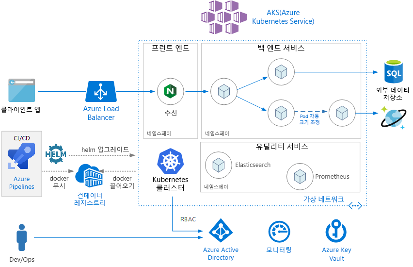
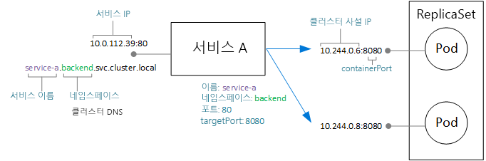
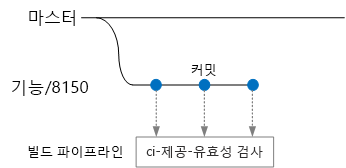
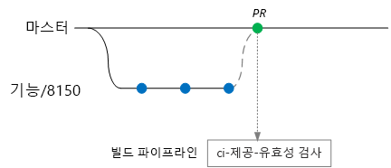
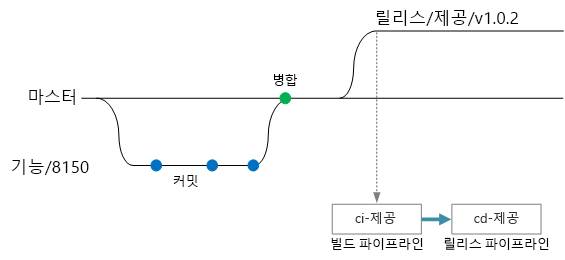

# <a name="microservices-architecture-on-azure-kubernetes-service-aks"></a>AKS(Azure Kubernetes Service)의 마이크로 서비스 아키텍처

이 참조 아키텍처는 AKS(Azure Kubernetes Service)에 배포된 마이크로 서비스 애플리케이션을 보여줍니다. 대부분의 배포에서 시작점으로 사용할 수 있는 기본 AKS 구성을 보여줍니다. 고급 네트워킹 옵션을 비롯한 고급 옵션은 별도의 참조 아키텍처에서 다룰 것입니다.

이 문서에서는 Kubernetes에 대한 기본 지식을 다룹니다. 이 문서는 AKS에서 마이크로 서비스 아키텍처를 실행하기 위한 인프라 및 DevOps 고려 사항에 중점을 둡니다. DDD(도메인 중심 디자인) 관점에서 마이크로 서비스를 디자인하는 방법에 대한 지침은 [Azure에서 마이크로 서비스 설계, 빌드 및 운영](/azure/architecture/microservices)을 참조하세요.

> [!NOTE]
> 이 문서와 함께 제공할 RI(참조 구현)를 현재 만드는 중이며, 2019년 초에 게시할 예정입니다. 이 문서는 이 RI의 추가 모범 사례를 포함하도록 업데이트될 것입니다.



## <a name="architecture"></a>아키텍처

이 아키텍처는 다음 구성 요소로 구성됩니다.

**AKS(Azure Kubernetes Service)**. AKS는 관리되는 Kubernetes 클러스터를 배포하는 Azure 서비스입니다. 

**Kubernetes 클러스터**. AKS는 Kubernetes 클러스터를 배포하고 Kubernetes 마스터를 관리하는 역할을 담당합니다. 고객은 에이전트 노드만 관리하면 됩니다.

**가상 네트워크**. 기본적으로 AKS는 에이전트 노드를 배포할 가상 네트워크를 만듭니다. 고급 시나리오에서는 먼저 가상 네트워크를 만들어서 서브넷 구성 방법, 온-프레미스 연결, IP 주소 지정 등을 제어할 수 있습니다. 자세한 내용은 [AKS(Azure Kubernetes Service)에서 고급 네트워킹 구성](/azure/aks/configure-advanced-networking)을 참조하세요.

**수신**. 수신은 클러스터 내부의 서비스에 대한 HTTP(S) 경로를 공개합니다. 자세한 내용은 아래의 [API 게이트웨이](#api-gateway)를 참조하세요.

**외부 데이터 저장소**. 마이크로 서비스는 일반적으로 상태 비저장이며 Azure SQL Database 또는 Cosmos DB 같은 외부 데이터 저장소에 상태를 씁니다.

**Azure Active Directory** AKS는 Azure AD(Azure Active Directory) ID를 사용하여 Azure 부하 분산 장치와 같은 다른 Azure 리소스를 만들고 관리합니다. 클라이언트 애플리케이션의 사용자 인증에도 Azure AD를 권장합니다.

**Azure Container Registry**. Container Registry를 사용하여 클러스터에 배포되는 비공개 Docker 이미지를 저장합니다. AKS는 Azure AD ID를 사용하여 Container Registry를 인증할 수 있습니다. AKS는 Azure Container Registry가 필요 없습니다. Docker 허브 같은 다른 컨테이너 레지스트리를 사용할 수 있습니다.

**Azure Pipelines**. 파이프라인은 Azure DevOps 서비스의 일부이며 자동화된 빌드, 테스트 및 배포를 실행합니다. Jenkins 같은 타사 CI/CD 솔루션도 사용할 수 있습니다. 

**Helm**. Helm은 Kubernetes용 패키지 관리자로써 Kubernetes 개체를 게시, 배포, 버전 관리 및 업데이트 가능한 단일 단위로 번들링하는 방법을 제공합니다.

**Azure Monitor** Azure Monitor는 솔루션 및 애플리케이션 원격 분석의 Azure 서비스에 대한 플랫폼 메트릭을 포함하여 메트릭 및 로그를 수집 및 저장합니다. 이 데이터를 사용하여 애플리케이션을 모니터링하고, 경고 및 대시보드를 설정하고, 오류의 근본 원인을 분석할 수 있습니다. Azure Monitor는 AKS와 통합되어 컨트롤러, 노드, 컨테이너의 메트릭뿐 아니라 컨테이너 로그와 마스터 노드 로그도 수집합니다.

## <a name="design-considerations"></a>디자인 고려 사항

AKS에서 실행되는 다른 워크로드에 적용되는 여러 권장 모범 사례가 있지만, 이 참조 아키텍처는 마이크로 서비스 아키텍처에 집중되어 있습니다.

### <a name="microservices"></a>마이크로 서비스

Kubernetes 서비스 개체는 Kubernetes에서 마이크로 서비스를 모델링하는 자연스러운 방법입니다. 마이크로 서비스는 느슨하게 결합되며, 독립적으로 배포 가능한 코드 단위입니다. 마이크로 서비스는 일반적으로 잘 정의된 API를 통해 통신하며, 특정 형태의 서비스 검색을 통해 검색할 수 있습니다. Kubernetes 서비스 개체는 이러한 요구 사항을 충족하는 기능 세트를 제공합니다.

- IP 주소입니다. 서비스 개체는 Pod 그룹(ReplicaSet)에 대한 고정 내부 IP 주소를 제공합니다. Pod가 만들어지거나 이동되면 이 내부 IP 주소에서 항상 서비스에 연결할 수 있습니다.

- 부하 분산 - 서비스의 IP 주소로 전송된 트래픽은 Pod에 부하 분산됩니다. 

- 서비스 검색. 서비스는 Kubernetes DNS 서비스를 통해 내부 DNS 항목에 할당됩니다. 즉, API 게이트웨이가 DNS 이름을 사용하여 백 엔드 서비스를 호출할 수 있습니다. 서비스 간 통신에도 동일한 메커니즘을 사용할 수 있습니다. DNS 항목은 네임스페이스를 기준으로 구성되므로 네임스페이스가 제한된 컨텍스트에 해당하는 경우 서비스의 DNS 이름이 자연스럽게 애플리케이션 도메인에 매핑됩니다.

다음 다이어그램은 서비스와 Pod 간의 개념적 관계를 보여줍니다. 엔드포인트 IP 주소 및 포트에 대한 실제 매핑은 Kubernetes 네트워크 프록시인 kube-proxy를 통해 수행됩니다.



### <a name="api-gateway"></a>API Gateway

*API 게이트웨이*는 외부 클라이언트와 마이크로 서비스 사이에 위치하는 게이트웨이입니다. 역방향 프록시로 작동하면서 클라이언트에서 마이크로 서비스로 요청을 라우팅합니다. 또한 인증, SSL 종료 및 속도 제한과 같은 다양한 교차 작업을 수행할 수도 있습니다. 

게이트웨이에서 제공하는 기능을 다음과 같이 그룹화할 수 있습니다.

- [게이트웨이 라우팅](../../patterns/gateway-routing.md): 클라이언트 요청을 적절한 백 엔드 서비스로 라우팅. 이렇게 하여 클라이언트용 단일 엔드포인트를 제공하고 서비스에서 클라이언트를 분리하는 데 도움을 줍니다.

- [게이트웨이 집계](../../patterns/gateway-aggregation.md): 여러 요청을 단일 요청으로 집계하여 클라이언트와 백 엔드 사이의 전송량을 줄입니다.

- [게이트웨이 오프로딩](../../patterns/gateway-offloading.md). 게이트웨이는 백 엔드 서비스에서 SSL 종료, 인증, IP 허용 목록 또는 클라이언트 속도 제한(제한) 등의 기능을 오프로드할 수 있습니다.

API 게이트웨이는 일반적인 [마이크로 서비스 설계 패턴](https://microservices.io/patterns/apigateway.html)입니다. 다양한 기술을 사용하여 구현할 수 있습니다. 아마도 가장 일반적인 구현은 에지 라우터 또는 Nginx, HAProxy, Traefik 같은 역방향 프록시를 클러스터 내부에 배포하는 것입니다. 

그 외에도 다음과 같은 옵션이 있습니다.

- Azure Application Gateway 및/또는 Azure API-Management - 둘 다 클러스터 외부에 상주하는 관리형 서비스입니다. Application Gateway 수신 컨트롤러는 현재 베타 버전입니다.

- Azure Functions 프록시. 프록시는 URL을 기반으로 요청 및 응답을 수정하고 요청을 라우팅할 수 있습니다.

리소스 종류 중 Kubernetes **수신**은 프록시 서버의 구성 설정을 추상화합니다. 수신 컨트롤러와 함께 작동하여 수신의 기본 구현을 제공합니다. Nginx, HAProxy, Traefik 및 Application Gateway(미리 보기)용 수신 컨트롤러가 있습니다.

수신 컨트롤러는 프록시 서버 구성을 처리합니다. 종종 복잡한 구성 파일이 필요하며, 전문가가 아니면 튜닝하기 쉽지 않으므로 수신 컨트롤러를 사용하면 편리합니다. 또한 수신 컨트롤러는 Kubernetes API에 액세스할 수 있으므로 라우팅 및 부하 분산에 대한 합리적인 의사 결정을 내릴 수 있습니다. 예를 들어 Nginx 수신 컨트롤러는 kube-proxy 네트워크 프록시를 우회합니다.

한편, 설정을 완전하게 제어해야 하는 경우 이 추상화를 우회하고 프록시 서버를 수동으로 구성하면 됩니다. 

역방향 프록시 서버는 잠재적인 병목 상태 또는 단일 실패 지점이므로 고가용성을 위해 항상 두 개 이상의 복제본을 배포해야 합니다.

### <a name="data-storage"></a>데이터 저장소

마이크로 서비스 아키텍처에서는 서비스가 데이터 스토리지를 공유하면 안 됩니다. 서비스 간에 숨겨진 종속성이 없도록 각 서비스는 별도의 논리 스토리지에 자체 비공개 데이터를 소유해야 합니다. 여러 서비스가 동일한 기본 데이터 스키마를 공유할 때 발생할 수 있는 서비스 간의 의도치 않은 결합을 방지하는 것이 목적입니다. 또한 서비스에서 자체 데이터 저장소를 관리하는 경우 특정 요구 사항에 적합한 데이터 저장소를 사용할 수 있습니다. 자세한 내용은 [마이크로 서비스 설계: 데이터 고려 사항](/azure/architecture/microservices/data-considerations)을 참조하세요.

로컬 클러스터 스토리지에 영구 데이터를 저장하지 마세요. 이렇게 하면 데이터가 노드에 연결됩니다. 대신, 

- Azure SQL Database나 Cosmos DB 같은 외부 서비스를 사용하거나 *또는*

- Azure Disks 또는 Azure Files를 사용하여 영구 볼륨을 탑재합니다. 동일한 볼륨을 여러 Pod가 공유해야 하는 경우 Azure Files를 사용합니다.

### <a name="namespaces"></a>네임스페이스

네임스페이스를 사용하여 클러스터 내에서 서비스 구성합니다. Kubernetes 클러스터의 모든 개체는 네임스페이스에 속합니다. 기본적으로 새 개체를 만들면 해당 개체는 `default` 네임스페이스로 이동합니다. 하지만 클러스터의 리소스를 구성하는 데 도움이 되도록 보다 구체적인 이름의 네임스페이스를 만드는 것이 좋습니다.

첫째, 네임스페이스는 이름 충돌을 방지하는 데 도움이 됩니다. 여러 팀이 동일한 클러스터에 수백 개의 마이크로 서비스를 배포하고 모든 마이크로 서비스가 동일한 네임스페이스로 이동하면 관리가 어렵습니다. 또한 네임스페이스를 통해 다음과 같은 일을 할 수 있습니다.

- 네임스페이스에 할당된 Pod의 전체 세트가 해당 네임스페이스의 리소스 할당량을 초과할 수 없도록 네임스페이스에 리소스 제약 조건을 적용합니다.

- 네임스페이스 수준에서 RBAC 및 보안 정책을 비롯한 정책을 적용합니다.

마이크로 서비스 아키텍처의 경우 마이크로 서비스를 제한된 컨텍스트로 구성하고 각각의 제한된 컨텍스트에 대한 네임스페이스를 만드는 방안을 고려합니다. 예를 들어 제한된 컨텍스트 "주문 이행"과 관련된 모든 마이크로 서비스가 동일한 네임스페이스로 이동할 수 있습니다. 또는 개발 팀마다 네임스페이스를 만듭니다.

각 개발 팀의 자체 별도 네임스페이스에 유틸리티 서비스를 배치합니다. 예를 들어 클러스터 모니터링용 Elasticsearch 또는 Prometheus를 배포하거나 Helm용 Tiller를 배포할 수 있습니다.

## <a name="scalability-considerations"></a>확장성 고려 사항

Kubernetes는 다음과 같은 두 수준에서 스케일 아웃을 지원합니다.

- 배포에 할당된 Pod 수를 조정합니다.
- 클러스터의 노드 수를 조정하여 클러스터에서 사용할 수 있는 총 계산 리소스를 늘립니다.

Pod 및 노드를 수동으로 스케일 아웃할 수 있지만, 고부하 시 서비스 리소스가 부족하지 않도록 자동 크기 조정을 사용하는 것이 좋습니다. 자동 크기 조정 전략은 Pod와 노드를 모두 고려해야 합니다. Pod만 스케일 아웃하면 결국 노드의 리소스 제한에 도달하게 됩니다. 

### <a name="pod-autoscaling"></a>Pod 자동 크기 조정

HPA(Horizontal Pod Autoscaler)는 관찰된 CPU, 메모리 또는 사용자 지정 메트릭에 따라 Pod를 조정합니다. 수평 Pod 크기 조정을 구성하려면 목표 메트릭(예: CPU의 70%)과 최소 및 최대 복제본 수를 지정합니다. 이러한 수치를 제공하려면 서비스 부하 테스트를 수행해야 합니다.

자동 크기 조정의 부작용으로 스케일 아웃 및 스케일 인 이벤트가 발생할 때 Pod가 좀 더 자주 생성 또는 제거될 수 있습니다. 이러한 부작용을 완화하려면:

- 새 Pod가 트래픽을 허용할 준비가 완료되면 준비 상태 프로브를 사용하여 Kubernetes에 그 사실을 알립니다.
- Pod 중단 예산을 사용하여 서비스에서 한 번에 제거할 수 있는 Pod 수를 제한합니다.

### <a name="cluster-autoscaling"></a>클러스터 자동 크기 조정

클러스터 자동 크기 조정기는 노드 수를 자동으로 조정합니다. 리소스 제약으로 인해 Pod를 예약할 수 없으면 클러스터 자동 크기 조정기가 추가 노드를 프로비전합니다.  (참고: AKS와 클러스터 자동 크기 조정기의 통합은 현재 미리 보기입니다.)

HPA는 사용된 실제 리소스 또는 실행 중인 Pod의 다른 메트릭을 살펴보는 반면, 클러스터 자동 크기 조정기는 아직 예약되지 않은 Pod의 노드를 프로비전합니다. 따라서 배포를 위한 Kubernetes Pod 사양에 지정된 대로, 요청된 리소스를 살펴봅니다. 부하 테스트를 사용하여 이러한 값을 미세 조정할 수 있습니다.

클러스터를 만든 후에는 VM 크기를 변경할 수 없으므로 클러스터를 만들 때 에이전트 노드에 적절한 VM 크기를 선택하려면 초기 용량 계획을 세워야 합니다. 

## <a name="availability-considerations"></a>가용성 고려 사항

### <a name="health-probes"></a>상태 프로브

Kubernetes는 Pod에서 공개할 수 있는 두 가지 유형의 상태 프로브를 정의합니다.

- 준비 상태 프로브: Pod가 요청을 수락할 준비가 완료되었는지 여부를 Kubernetes에 알려줍니다.

- 활동성 프로브: Pod를 제거하고 새 인스턴스를 시작해야 하는지 여부를 Kubernetes에 알려줍니다.

프로브에 대해 생각할 때 Kubernetes에서 서비스가 작동하는 방식을 떠올리면 도움이 됩니다. 서비스에는 Pod 세트(0개 이상)와 일치하는 레이블 선택기가 있습니다. Kubernetes는 선택기와 일치하는 Pod에 트래픽을 부하 분산합니다. 성공적으로 시작되고 상태가 정상인 Pod만 트래픽을 수신합니다. 컨테이너가 충돌하면 Kubernetes는 Pod를 종료하고 대체 Pod를 예약합니다.

Pod가 성공적으로 시작되더라도 트래픽을 받을 준비가 완료되지 않은 경우가 가끔 있습니다. 컨테이너에서 실행 중인 애플리케이션이 메모리에 무언가를 로드하거나 구성 데이터를 읽는 초기화 작업을 예로 들 수 있습니다. Pod가 정상이지만 트래픽을 받을 준비가 완료되지 않았음을 나타내려면 준비 상태 프로브를 정의합니다. 

활동성 프로브는 Pod가 여전히 실행 중이지만 정상 상태가 아니고 재활용해야 하는 상황을 처리합니다. 예를 들어 HTTP 요청을 처리하는 컨테이너가 어떤 이유로 중단되었다고 가정해 봅시다. 컨테이너는 충돌을 일으키지는 않지만 모든 요청 처리를 중단했습니다. HTTP 활동성 프로브를 정의하면 프로브가 응답을 중지할 경우 Kubernetes에 Pod를 다시 시작하라고 알립니다.

프로브를 설계할 때 몇 가지 사항을 고려해야 합니다.

- 코드의 시작 시간이 긴 경우 시작이 완료되기 전에 활동성 프로브가 실패를 보고할 위험이 있습니다. 이를 방지하려면 프로브 시작을 지연하는 initialDelaySeconds 설정을 사용하세요.

- Pod를 다시 시작하면 정상 상태로 복원되지 않는 한, 활동성 프로브는 도움이 되지 않습니다. 활동성 프로브를 사용하여 메모리 누수 또는 예기치 않은 교착 상태를 완화할 수 있지만, 즉시 다시 실패하는 Pod를 다시 시작해 봐야 아무 소용이 없습니다.

- 때때로 준비 상태 프로브는 종속 서비스를 확인하는 데 사용됩니다. 예를 들어 Pod가 데이터베이스에 종속된 경우 활동성 프로브가 데이터베이스 연결을 확인할 수 있습니다. 그러나 이 방법은 예기치 않은 문제를 일으킬 수 있습니다. 어떤 이유로 외부 서비스를 일시적으로 사용할 수 없게 될 수 있습니다. 그러면 서비스의 모든 Pod에 대해 준비 상태 프로브가 실패하고 모든 Pod가 부하 분산에서 제거되므로 연속 실패 업스트림이 발생합니다. 서비스가 일시적인 장애로부터 올바르게 복구될 수 있도록 서비스 내에서 재시도 처리를 구현하는 것이 더 좋은 방법입니다.

### <a name="resource-constraints"></a>리소스 제약 조건

리소스 경합은 서비스의 가용성에 영향을 줄 수 있습니다. 단일 컨테이너가 클러스터 리소스(메모리 및 CPU)를 모두 사용할 수 없도록 컨테이너에 대한 리소스 제약 조건을 정의합니다. 스레드 또는 네트워크 연결 같은 컨테이너 이외 리소스는 [격벽 패턴](/azure/architecture/patterns/bulkhead)을 사용하여 리소스를 격리하는 방안을 고려합니다.

리소스 할당량을 사용하여 네임스페이스에 허용되는 총 리소스를 제한합니다. 이렇게 하면 프런트 엔드가 리소스의 백 엔드 서비스를 고갈시킬 수 없으며 그 반대도 마찬가지입니다.

## <a name="security-considerations"></a>보안 고려 사항

### <a name="role-based-access-control-rbac"></a>RBAC(역할 기반 액세스 제어)

Kubernetes와 Azure 둘 다 RBAC(역할 기반 액세스 제어)에 대한 메커니즘을 갖고 있습니다.

- Azure RBAC는 새 Azure 리소스를 만드는 기능을 포함하여 Azure의 리소스에 대한 액세스를 제어합니다. 사용자, 그룹 또는 서비스 주체에 권한을 할당할 수 있습니다. (서비스 주체는 애플리케이션에서 사용하는 보안 ID입니다.)

- Kubernetes RBAC는 Kubernetes API 권한을 제어합니다. 예를 들어 Pod 만들기 및 Pod 나열은 RBAC를 통해 사용자에게 권한을 부여(또는 거부)할 수 있는 작업입니다. 사용자에게 Kubernetes 권한을 할당하려면 *역할* 및 *역할 바인딩*을 만듭니다.

  - 역할은 네임스페이스 내에서 적용되는 권한 세트입니다. 권한은 리소스(Pod, 배포 등)에 대한 동사(가져오기, 업데이트, 만들기, 삭제)로 정의됩니다.

  - RoleBinding은 사용자 또는 그룹을 역할에 할당합니다.

  - 역할과 비슷하지만 모든 네임스페이스에서 전체 클러스터에 적용되는 ClusterRole 개체도 있습니다. 사용자 또는 그룹을 ClusterRole에 할당하려면 ClusterRoleBinding를 만듭니다.

AKS는 이러한 두 가지 RBAC 메커니즘을 통합합니다. AKS 클러스터를 만들 때 사용자 인증에 Azure AD를 사용하도록 구성할 수 있습니다. 이렇게 설정하는 방법에 대한 자세한 내용은 [Azure Kubernetes Service와 Azure Active Directory 통합](/azure/aks/aad-integration)을 참조하세요.

이 구성을 마치면 Kubernetes API에 액세스하려는 사용자는(예: kubectl를 통해) Azure AD 자격 증명을 사용하여 로그인해야 합니다.

기본적으로 Azure AD 사용자는 클러스터에 액세스할 수 없습니다. 액세스 권한을 부여하려면 클러스터 관리자는 Azure AD 사용자 또는 그룹을 참조하는 RoleBindings를 만들어야 합니다. 사용자가 특정 작업에 대한 권한이 없는 경우 해당 작업이 실패합니다.

사용자가 기본적으로 액세스 권한이 없다면 클러스터 관리자는 어떻게 역할 바인딩을 만드는 권한을 갖게 되는 걸까요? AKS 클러스터에는 Kubernetes API 서버를 호출하는 두 가지 자격 증명이 있는데, 하나는 클러스터 사용자이고 다른 하나는 클러스터 관리자입니다. 클러스터 관리자 자격 증명은 클러스터에 대한 전체 액세스 권한을 부여합니다. Azure CLI 명령 `az aks get-credentials --admin`은 클러스터 관리자 자격 증명을 다운로드하여 kubeconfig 파일로 저장합니다. 클러스터 관리자는 이 kubeconfig 파일을 사용하여 역할 및 역할 바인딩을 만들 수 있습니다.

클러스터 관리자 자격 증명은 아주 강력하므로 Azure RBAC를 사용하여 액세스를 제한해야 합니다.

- "Azure Kubernetes 서비스 클러스터 관리자 역할"은 클러스터 관리자 자격 증명을 다운로드하는 권한을 갖고 있습니다. 클러스터 관리자에게만 이 역할을 할당해야 합니다.

- "Azure Kubernetes 서비스 클러스터 사용자 역할"은 클러스터 사용자 자격 증명을 다운로드하는 권한을 갖고 있습니다. 관리자가 아닌 사용자에게 이 역할을 할당할 수 있습니다. 이 역할은 클러스터 내부의 Kubernetes 리소스에 대한 특정 권한을 제공하지 않고, 사용자가 API 서버에 연결하는 것만 허용합니다. 

RBAC 정책을 정의할 때(Kubernetes 및 Azure 둘 다) 조직의 역할에 대해 고민해야 합니다.

- AKS 클러스터를 생성 또는 삭제하고 관리자 자격 증명을 다운로드할 수 있는 사람은 누구입니까?
- 클러스터를 관리할 수 있는 사람은 누구입니까?
- 네임스페이스 내에서 리소스를 만들고 업데이트할 수 있는 사람은 누구입니까?

ClusterRoles 및 ClusterRoleBindings보다는 역할 및 RoleBindings를 사용하여 네임스페이스별로 Kubernetes RBAC 권한 범위를 지정하는 것이 좋습니다.

마지막으로, AKS 클러스터가 부하 분산 장치, 네트워킹, 스토리지 등의 Azure 리소스를 만들고 관리하려면 어떤 권한이 필요한지 결정해야 합니다. 클러스터는 Azure API에 인증하기 위해 Azure AD 서비스 주체를 사용합니다. 클러스터를 만들 때 서비스 주체를 지정하지 않으면 자동으로 생성됩니다. 하지만 먼저 서비스 주체를 만든 후 최소한의 RBAC 권한을 할당하는 것이 보안상 좋은 방법입니다. 자세한 내용은 [Azure Kubernetes Service를 사용하는 서비스 주체](/azure/aks/kubernetes-service-principal)를 참조하세요.

### <a name="secrets-management-and-application-credentials"></a>비밀 관리 및 애플리케이션 자격 증명

애플리케이션 및 서비스가 Azure Storage 또는 SQL Database 같은 외부 서비스에 연결할 수 있는 자격 증명이 필요한 경우가 종종 있습니다. 문제는 이러한 자격 증명이 유출되지 않도록 안전하게 보호하는 것입니다. 

Azure 리소스의 경우 관리 ID를 사용하는 옵션이 있습니다. 애플리케이션 또는 서비스가 Azure AD에 ID를 저장하고, 이 ID를 사용하여 Azure 서비스를 인증한다는 것이 관리 ID의 개념입니다. 애플리케이션 또는 서비스는 생성한 서비스 주체를 Azure AD에 저장하고, OAuth 2.0 토큰을 사용하여 인증합니다. 실행 프로세스는 localhost 주소를 호출하여 토큰을 가져옵니다. 이 방식을 사용하면 암호 또는 연결 문자열을 저장할 필요가 없습니다. [aad-pod-identity](https://github.com/Azure/aad-pod-identity) 프로젝트를 사용하여 개별 Pod에 ID를 할당하면 AKS에서 관리 ID를 사용할 수 있습니다.

현재 일부 Azure 서비스는 관리 ID를 사용한 인증을 지원하지 않습니다. 목록은 [Azure AD 인증을 지원하는 Azure 서비스](/azure/active-directory/managed-identities-azure-resources/services-support-msi)를 참조하세요.

관리 ID를 사용하더라도 관리 ID를 지원하지 않는 Azure 서비스, 타사 서비스, API 키 등에 대한 일부 자격 증명 또는 기타 애플리케이션 비밀을 저장해야 합니다. 다음은 비밀을 안전하게 저장하기 위한 옵션입니다.

- Azure Key Vault. AKS에서는 Key Vault에서 하나 이상의 비밀을 볼륨으로 탑재할 수 있습니다. 볼륨은 Key Vault에서 비밀을 읽습니다. 그러면 Pod가 마치 정규 볼륨처럼 비밀을 읽을 수 있습니다. 자세한 내용은 GitHub의 [FlexVolume-KeyVault-Kubernetes](https://github.com/Azure/kubernetes-keyvault-flexvol) 프로젝트를 참조하세요.

    Pod는 위에서 설명한 Pod ID를 사용하거나 클라이언트 비밀과 함께 Azure AD 서비스 주체를 사용하여 자신을 인증합니다. 이 경우 클라이언트 비밀이 필요 없으므로 Pod ID를 사용하는 것이 좋습니다. 

- HashiCorp Vault. Kubernetes 애플리케이션은 Azure AD 관리 ID를 사용하여 HashiCorp Vault를 인증할 수 있습니다. [HashiCorp Vault에서 말하는 Azure Active Directory](https://open.microsoft.com/2018/04/10/scaling-tips-hashicorp-vault-azure-active-directory/)를 참조하세요. Vault 자체를 Kubernetes에 배포할 수는 있지만, 애플리케이션 클러스터에 준비된 별도의 전용 클러스터에서 실행하는 것이 좋습니다. 

- Kubernetes 비밀. 또 다른 옵션은 간단하게 Kubernetes 비밀을 사용하는 것입니다. 이 옵션은 구성 방법이 가장 간단하지만 몇 가지 문제가 있습니다. 분산 키-값 저장소인 etcd에 비밀이 저장됩니다. AKS가 [미사용 etcd를 암호화합니다](https://github.com/Azure/kubernetes-kms#azure-kubernetes-service-aks). Microsoft에서 암호화 키를 관리합니다.

HashiCorp Vault 또는 Azure Key Vault 같은 시스템을 사용하면 다음과 같은 장점이 있습니다.

- 비밀을 중앙에서 제어할 수 있습니다.
- 모든 미사용 비밀이 암호화됩니다.
- 키를 중앙에서 관리합니다.
- 비밀 액세스를 제어할 수 있습니다.
- 감사

### <a name="pod-and-container-security"></a>Pod 및 컨테이너 보안

이 목록은 물론 최종 목록이 아니지만, Pod 및 컨테이너를 보호하는 몇 가지 모범 사례를 제공합니다. 

컨테이너를 권한 있는 모드로 실행하지 마세요. 권한 있는 모드는 호스트의 모든 디바이스에 컨테이너 액세스를 제공합니다. 컨테이너를 권한 모드에서 실행하는 것을 허용하지 않는 Pod 보안 정책을 설정할 수 있습니다. 

되도록이면 프로세스를 컨테이너 내부에서 루트로 실행하지 마세요. 컨테이너는 보안의 관점에서 완전한 격리를 제공하지 않으므로 컨테이너 프로세스를 권한 없는 사용자로 실행하는 것이 좋습니다. 

Azure Container Registry 또는 Docker Trusted Registry 같은 신뢰할 수 있는 비공개 레지스트리에 이미지를 저장합니다. Pod가 신뢰할 수 있는 레지스트리의 이미지만 끌어오도록 유효성 검사 허가 webhook를 사용합니다.

Azure Marketplace를 통해 제공되는 Twistlock 및 Aqua 같은 검색 솔루션으로 이미지를 검사하여 알려진 취약성을 확인합니다.

Azure Container Registry의 기능인 ACR 작업을 사용하여 패치를 자동화합니다. 컨테이너 이미지는 레이어에서 빌드됩니다. 기본 레이어에는 ASP.NET Core 또는 Node.js 같은 OS 이미지 및 애플리케이션 프레임워크 이미지가 포함됩니다. 기본 이미지는 일반적으로 업스트림에서 애플리케이션 개발자가 생성하고, 다른 프로젝트 관리자가 유지 관리합니다. 이러한 이미지가 업스트림에서 패치될 때 알려진 보안 취약성이 남아 있지 않도록 이미지를 업데이트, 테스트 및 재배포해야 합니다. ACR 작업은 이 프로세스를 자동화하는 데 도움이 될 수 있습니다.

## <a name="deployment-cicd-considerations"></a>배포(CI/CD) 고려 사항

마이크로 서비스 아키텍처에 대한 강력한 CI/CD 프로세스의 목표는 다음과 같습니다.

- 각 팀은 다른 팀에 영향을 주거나 방해하지 않고 독립적으로 소유한 서비스를 빌드하여 배포할 수 있습니다.

- 새 버전의 서비스를 프로덕션 환경에 배포하기 전에 개발/테스트/QA 환경에 배포하여 유효성을 검사합니다. 각 단계에서 품질 게이트를 적용합니다.

- 새 버전의 서비스를 이전 버전과 함께 배포할 수 있습니다.

- 충분한 액세스 제어 정책을 적용합니다.

- 프로덕션 환경에 배포된 컨테이너 이미지를 신뢰할 수 있습니다.

### <a name="isolation-of-environments"></a>환경 격리

고객은 개발, 스모크 테스트, 통합 테스트, 부하 테스트 및 프로덕션 환경을 비롯한 여러 환경에 서비스를 배포할 것입니다. 이러한 환경에는 일정 수준의 격리가 필요합니다. Kubernetes에서는 물리적 격리와 논리적 격리 중에서 선택할 수 있습니다. 물리적 격리는 별도의 클러스터에 배포하는 것을 의미합니다. 논리적 격리는 앞에서 설명한 것처럼 네임스페이스와 정책을 사용합니다.

개발/테스트 환경에 사용할 별도의 클러스터와 함께 전용 프로덕션 클러스터를 만드는 방법을 권장합니다. 논리적 격리를 사용하여 개발/테스트 클러스터 내에서 별도의 환경을 격리하세요. 개발/테스트 클러스터에 배포된 서비스는 비즈니스 데이터를 보관하는 데이터 저장소에 절대로 액세스하면 안 됩니다. 

### <a name="helm"></a>Helm

Helm을 사용하여 서비스를 빌드하고 배포하는 방안을 고려해 보세요. 다음은 CI/CD를 도와주는 Helm의 기능입니다.

- 특정 마이크로 서비스의 모든 Kubernetes 개체를 단일 Helm 차트에 구성.
- 차트를 일련의 kubectl 명령이 아닌 단일 helm 명령으로 배포.
- 이전 버전으로 롤백하는 기능과 함께 의미 체계 버전 관리를 사용하여 업데이트 및 수정 버전 추적.
- 템플릿을 사용하여 여러 파일에서 레이블, 선택기 등의 정보가 중복되지 않도록 방지.
- 차트 간 종속성 관리.
- Azure Container Registry 같은 Helm 리포지토리에 차트를 게시하고 빌드 파이프라인과 통합.

Container Registry를 Helm 리포지토리로 사용하는 방법에 대한 자세한 내용은 [애플리케이션 차트용 Helm 리포지토리로 Azure Container Registry 사용](/azure/container-registry/container-registry-helm-repos)을 참조하세요.

### <a name="cicd-workflow"></a>CI/CD 워크플로

CI/CD 워크플로를 만들기 전에 코드 베이스가 구조화되고 관리되는 방법을 알아야 합니다.

- 팀이 별도의 리포지토리에서 작업합니까, 아니면 단일 리포지토리에서 작업합니까?
- 분기 전략은 무엇입니까?
- 프로덕션 환경에 코드를 푸시할 수 있는 사람은 누구입니까? 릴리스 관리자 역할이 있습니까?

단일 리포지토리 접근법이 지지를 받고 있지만 두 방식에는 모두 장단점이 있습니다.

| &nbsp; | 단일 리포지토리 | 다중 리포지토리 |
|--------|----------|----------------|
| **장점** | 코드 공유<br/>코드 및 도구 표준화 용이<br/>코드 리팩터링 용이<br/>검색 기능 - 코드의 단일 보기<br/> | 팀별로 명확한 소유권<br/>잠재적으로 더 적은 병합 충돌<br/>마이크로 서비스를 강제로 분리하는 데 유용 |
| **과제** | 공유 코드에 대한 변경 사항이 여러 마이크로 서비스에 영향을 줄 수 있음<br/>병합 충돌 가능성 증가<br/>대규모 코드 베이스에 맞게 도구를 확장해야 함<br/>Access Control<br/>더 복잡한 배포 프로세스 | 코드를 공유하기가 더 어려움<br/>코딩 표준을 적용하기가 더 어려움<br/>종속성 관리<br/>분산된 코드 베이스, 검색 기능 저하<br/>공유 인프라 결여

이 섹션에서는 다음과 같은 가정에 따라 가능한 CI/CD 워크플로를 제공합니다.

- 코드 리포지토리는 마이크로 서비스별로 정리된 폴더를 사용하는 단일 리포지토리입니다.
- 팀의 분기 전략이 [트렁크 기반 개발](https://trunkbaseddevelopment.com/)을 기반으로 합니다.
- 팀이 [Azure Pipelines](/azure/devops/pipelines)를 사용하여 CI/CD 프로세스를 실행합니다.
- 팀이 Azure Container Registry에서 [네임스페이스](/azure/container-registry/container-registry-best-practices#repository-namespaces)를 사용하여 아직 테스트 중인 이미지에서 프로덕션용으로 승인된 이미지를 분리합니다.

이 예에서는 개발자가 Delivery Service라는 마이크로 서비스를 작업합니다. (이 이름은 [여기](../../microservices/index.md#the-drone-delivery-application)에 설명된 참조 구현에서 따온 것입니다.) 개발자는 새 기능을 개발할 때 기능 분기에 코드를 체크 인합니다.



이 분기에 대한 커밋을 푸시하면 마이크로 서비스에 대한 CI 빌드가 트리거됩니다. 관례상 기능 분기는 `feature/*`로 명명합니다. [빌드 정의 파일](/azure/devops/pipelines/yaml-schema)에는 분기 이름과 원본 경로로 필터링되는 트리거가 포함되어 있습니다. 각 팀은 이러한 접근법을 사용하여 자체 빌드 파이프라인을 구축할 수 있습니다.

```yaml
trigger:
  batch: true
  branches:
    include:
    - master
    - feature/*

    exclude:
    - feature/experimental/*

  paths:
     include:
     - /src/shipping/delivery/
```

워크플로의 이 시점에서 CI 빌드는 최소한의 코드 확인을 실행합니다.

1. 코드 빌드
1. 단위 테스트 실행

개발자가 신속한 피드백을 얻을 수 있도록 빌드 시간을 짧게 유지하자는 것입니다. 기능을 마스터에 병합할 준비가 되면 개발자는 PR을 엽니다. 그러면 일부 추가 검사를 수행하는 다른 CI 빌드가 트리거됩니다.

1. 코드 빌드
1. 단위 테스트 실행
1. 런타임 컨테이너 이미지 빌드
1. 이미지에 대한 취약성 검사 실행



> [!NOTE]
> Azure Repos에서 분기를 보호하는 [정책](/azure/devops/repos/git/branch-policies)을 정의할 수 있습니다. 예를 들어 마스터에 병합하려면 정책에 승인자의 서명과 성공적인 CI 빌드가 필요할 수 있습니다.

어느 시점이 되면 팀은 새 버전의 Delivery Service를 배포할 수 있습니다. 이를 위해 릴리스 관리자는 `release/<microservice name>/<semver>`와 같은 명명 패턴을 사용하여 마스터에서 분기를 만듭니다. 예: `release/delivery/v1.0.2`
이는 이전의 모든 단계와 다음 작업을 실행하는 완전한 CI 빌드를 트리거합니다.

1. Azure Container Registry로 Docker 이미지를 푸시합니다. 분기 이름에서 가져온 버전 번호로 이미지에 태그가 지정됩니다.
2. `helm package`를 실행하여 Helm 차트 패키징
3. `az acr helm push`를 실행하여 Container Registry에 Helm 패키지를 푸시합니다.

이 빌드가 성공할 경우 Azure Pipelines [릴리스 파이프라인](/azure/devops/pipelines/release/what-is-release-management)을 사용하여 배포 프로세스가 트리거됩니다. 이 파이프라인

1. `helm upgrade`를 실행하여 QA 환경에 Helm 차트를 배포합니다.
1. 승인자가 서명한 후 패키지가 프로덕션 단계로 이동합니다. [승인을 통해 릴리스 배포 제어](/azure/devops/pipelines/release/approvals/approvals)를 참조하세요.
1. Azure Container Registry에서 프로덕션 네임스페이스용 Docker 이미지에 다시 태그를 지정합니다. 예를 들어 현재 태그가 `myrepo.azurecr.io/delivery:v1.0.2`라면 프로덕션 태그는 `reponame.azurecr.io/prod/delivery:v1.0.2`입니다.
1. `helm upgrade`를 실행하여 프로덕션 환경에 Helm 차트를 배포합니다.



팀이 빠른 개발속도로 배포할 수 있도록 단일 리포지토리에서도 이러한 작업의 범위를 개별 마이크로 서비스로 지정할 수 있다는 사실을 기억하는 것이 중요합니다. 이 프로세스에는 몇 가지 수동 단계가 있습니다. PR 승인, 릴리스 분기 만들기, 프로덕션 클러스터에 배포 승인. 이러한 단계는 정책에 따라 수동으로 실행합니다. 조직에서 선호하는 경우 이러한 단계를 완전히 자동화할 수 있습니다.
