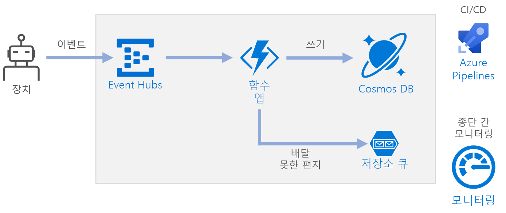

# <a name="serverless-event-processing-using-azure-functions"></a><span data-ttu-id="425ab-103">Azure Functions를 사용한 서버리스 이벤트 처리</span><span class="sxs-lookup"><span data-stu-id="425ab-103">Serverless event processing using Azure Functions</span></span>

<span data-ttu-id="425ab-104">이 참조 아키텍처에서는 데이터 스트림을 수집하고, 데이터를 처리하고, 결과를 백 엔드 데이터베이스에 기록하는 [서버리스](https://azure.microsoft.com/solutions/serverless/) 이벤트 구동 아키텍처를 보여줍니다.</span><span class="sxs-lookup"><span data-stu-id="425ab-104">This reference architecture shows a [serverless](https://azure.microsoft.com/solutions/serverless/), event-driven architecture that ingests a stream of data, processes the data, and writes the results to a back-end database.</span></span> <span data-ttu-id="425ab-105">이 아키텍처에 대한 참조 구현은 [GitHub][github]에서 사용할 수 있습니다.</span><span class="sxs-lookup"><span data-stu-id="425ab-105">A reference implementation for this architecture is available on [GitHub][github].</span></span>



## <a name="architecture"></a><span data-ttu-id="425ab-107">아키텍처</span><span class="sxs-lookup"><span data-stu-id="425ab-107">Architecture</span></span>

<span data-ttu-id="425ab-108">**Event Hubs**에서 데이터 스트림을 수집합니다.</span><span class="sxs-lookup"><span data-stu-id="425ab-108">**Event Hubs** ingests the data stream.</span></span> <span data-ttu-id="425ab-109">[Event Hubs][eh]는 높은 처리량 데이터 스트리밍 시나리오를 위해 설계되었습니다.</span><span class="sxs-lookup"><span data-stu-id="425ab-109">[Event Hubs][eh] is designed for high-throughput data streaming scenarios.</span></span>

> [!NOTE]
> <span data-ttu-id="425ab-110">IoT 시나리오의 경우 IoT Hub를 사용하는 것이 좋습니다.</span><span class="sxs-lookup"><span data-stu-id="425ab-110">For IoT scenarios, we recommend IoT Hub.</span></span> <span data-ttu-id="425ab-111">IoT Hub에는 Azure Event Hubs API와 호환되는 기본 제공 엔드포인트가 있으므로 이 아키텍처에서는 백 엔드 처리를 크게 변경하지 않고도 두 가지 서비스 중 하나를 사용할 수 있습니다.</span><span class="sxs-lookup"><span data-stu-id="425ab-111">IoT Hub has a built-in endpoint that’s compatible with the Azure Event Hubs API, so you can use either service in this architecture with no major changes in the backend processing.</span></span> <span data-ttu-id="425ab-112">자세한 내용은 [IoT 디바이스를 Azure에 연결: IoT Hub 및 Event Hubs][iot]를 참조하세요.</span><span class="sxs-lookup"><span data-stu-id="425ab-112">For more information, see [Connecting IoT Devices to Azure: IoT Hub and Event Hubs][iot].</span></span>

<span data-ttu-id="425ab-113">**함수 앱**.</span><span class="sxs-lookup"><span data-stu-id="425ab-113">**Function App**.</span></span> <span data-ttu-id="425ab-114">[Azure Functions][functions]는 서버리스 계산 옵션입니다.</span><span class="sxs-lookup"><span data-stu-id="425ab-114">[Azure Functions][functions] is a serverless compute option.</span></span> <span data-ttu-id="425ab-115">트리거를 통해 코드("함수")가 호출되는 이벤트 구동 모델을 사용합니다.</span><span class="sxs-lookup"><span data-stu-id="425ab-115">It uses an event-driven model, where a piece of code (a “function”) is invoked by a trigger.</span></span> <span data-ttu-id="425ab-116">이 아키텍처에서는 이벤트가 Event Hubs에 도착하면 이벤트를 처리하고 결과를 저장소에 쓰는 함수를 트리거합니다.</span><span class="sxs-lookup"><span data-stu-id="425ab-116">In this architecture, when events arrive at Event Hubs, they trigger a function that processes the events and writes the results to storage.</span></span>

<span data-ttu-id="425ab-117">함수 앱은 Event Hubs에서 개별 레코드를 처리하는 데 적합합니다.</span><span class="sxs-lookup"><span data-stu-id="425ab-117">Function Apps are suitable for processing individual records from Event Hubs.</span></span> <span data-ttu-id="425ab-118">더 복잡한 스트림 처리 시나리오의 경우 Azure Databricks 또는 Azure Stream Analytics를 사용하는 Apache Spark를 고려해 보세요.</span><span class="sxs-lookup"><span data-stu-id="425ab-118">For more complex stream processing scenarios, consider Apache Spark using Azure Databricks, or Azure Stream Analytics.</span></span>

<span data-ttu-id="425ab-119">**Cosmos DB**</span><span class="sxs-lookup"><span data-stu-id="425ab-119">**Cosmos DB**.</span></span> <span data-ttu-id="425ab-120">[Cosmos DB][cosmosdb]는 다중 모델 데이터베이스 서비스입니다.</span><span class="sxs-lookup"><span data-stu-id="425ab-120">[Cosmos DB][cosmosdb] is a multi-model database service.</span></span> <span data-ttu-id="425ab-121">이 시나리오의 경우 이벤트 처리 함수는 Cosmos DB [SQL API][cosmosdb-sql]를 사용하여 JSON 레코드를 저장합니다.</span><span class="sxs-lookup"><span data-stu-id="425ab-121">For this scenario, the event-processing function stores JSON records, using the Cosmos DB [SQL API][cosmosdb-sql].</span></span>

<span data-ttu-id="425ab-122">**Queue 저장소**.</span><span class="sxs-lookup"><span data-stu-id="425ab-122">**Queue storage**.</span></span> <span data-ttu-id="425ab-123">[Queue 저장소][queue]는 배달 못한 편지 메시지에 사용됩니다.</span><span class="sxs-lookup"><span data-stu-id="425ab-123">[Queue storage][queue] is used for dead letter messages.</span></span> <span data-ttu-id="425ab-124">이벤트를 처리하는 중에 오류가 발생하면 나중에 처리하기 위해 함수에서 이벤트 데이터를 배달 못한 편지 큐에 저장합니다.</span><span class="sxs-lookup"><span data-stu-id="425ab-124">If an error occurs while processing an event, the function stores the event data in a dead letter queue for later processing.</span></span> <span data-ttu-id="425ab-125">자세한 내용은 [복원력 고려 사항](#resiliency-considerations)을 참조하세요.</span><span class="sxs-lookup"><span data-stu-id="425ab-125">For more information, see [Resiliency Considerations](#resiliency-considerations).</span></span>

<span data-ttu-id="425ab-126">**Azure Monitor**</span><span class="sxs-lookup"><span data-stu-id="425ab-126">**Azure Monitor**.</span></span> <span data-ttu-id="425ab-127">[Monitor][monitor]는 솔루션에 배포된 Azure 서비스에 대한 성능 메트릭을 수집합니다.</span><span class="sxs-lookup"><span data-stu-id="425ab-127">[Monitor][monitor] collects performance metrics about the Azure services deployed in the solution.</span></span> <span data-ttu-id="425ab-128">이러한 메트릭을 대시보드에서 시각화하여 솔루션의 상태를 볼 수 있습니다.</span><span class="sxs-lookup"><span data-stu-id="425ab-128">By visualizing these in a dashboard, you can get visibility into the health of the solution.</span></span>

<span data-ttu-id="425ab-129">**Azure Pipelines**.</span><span class="sxs-lookup"><span data-stu-id="425ab-129">**Azure Pipelines**.</span></span> <span data-ttu-id="425ab-130">[Pipelines][pipelines]는 애플리케이션을 빌드, 테스트 및 배포하는 CI(지속적인 통합) 및 CD(지속적인 업데이트) 서비스입니다.</span><span class="sxs-lookup"><span data-stu-id="425ab-130">[Pipelines][pipelines] is a continuous integration (CI) and continuous delivery (CD) service that builds, tests, and deploys the application.</span></span>

## <a name="scalability-considerations"></a><span data-ttu-id="425ab-131">확장성 고려 사항</span><span class="sxs-lookup"><span data-stu-id="425ab-131">Scalability considerations</span></span>

### <a name="event-hubs"></a><span data-ttu-id="425ab-132">Event Hubs</span><span class="sxs-lookup"><span data-stu-id="425ab-132">Event Hubs</span></span>

<span data-ttu-id="425ab-133">Event Hubs의 처리 용량은 [처리량 단위][eh-throughput]로 측정됩니다.</span><span class="sxs-lookup"><span data-stu-id="425ab-133">The throughput capacity of Event Hubs is measured in [throughput units][eh-throughput].</span></span> <span data-ttu-id="425ab-134">[자동 확장][eh-autoscale]을 사용하도록 설정하여 이벤트 허브의 크기를 자동으로 조정할 수 있습니다. 그러면 트래픽에 따라 처리량 단위를 구성된 최댓값까지 자동으로 크기 조정합니다.</span><span class="sxs-lookup"><span data-stu-id="425ab-134">You can autoscale an event hub by enabling [auto-inflate][eh-autoscale], which automatically scales the throughput units based on traffic, up to a configured maximum.</span></span>

<span data-ttu-id="425ab-135">함수 앱의 [Event Hub 트리거][eh-trigger]는 이벤트 허브의 파티션 수에 따라 크기 조정됩니다.</span><span class="sxs-lookup"><span data-stu-id="425ab-135">The [Event Hub trigger][eh-trigger] in the function app scales according to the number of partitions in the event hub.</span></span> <span data-ttu-id="425ab-136">각 파티션에는 한 번에 하나의 함수 인스턴스가 할당됩니다.</span><span class="sxs-lookup"><span data-stu-id="425ab-136">Each partition is assigned one function instance at a time.</span></span> <span data-ttu-id="425ab-137">처리량을 최대화하려면 한 번에 하나씩이 아니라 일괄 처리 방식으로 이벤트를 받습니다.</span><span class="sxs-lookup"><span data-stu-id="425ab-137">To maximize throughput, receive the events in a batch, instead of one at a time.</span></span>

### <a name="cosmos-db"></a><span data-ttu-id="425ab-138">Cosmos DB</span><span class="sxs-lookup"><span data-stu-id="425ab-138">Cosmos DB</span></span>

<span data-ttu-id="425ab-139">Cosmos DB의 처리 용량은 [RU(요청 단위)][ru]로 측정됩니다.</span><span class="sxs-lookup"><span data-stu-id="425ab-139">Throughput capacity for Cosmos DB is measured in [Request Units][ru] (RU).</span></span> <span data-ttu-id="425ab-140">10,000RU를 초과하는 Cosmos DB 컨테이너의 크기를 조정하려면 컨테이너를 만들 때 [파티션 키][partition-key]를 지정하고, 만드는 모든 문서에 파티션 키가 포함되어야 합니다.</span><span class="sxs-lookup"><span data-stu-id="425ab-140">In order to scale a Cosmos DB container past 10,000 RU, you must specify a [partition key][partition-key] when you create the container, and include the partition key in every document that you create.</span></span>

<span data-ttu-id="425ab-141">적절한 파티션 키에 대한 몇 가지 특징은 다음과 같습니다.</span><span class="sxs-lookup"><span data-stu-id="425ab-141">Here are some characteristics of a good partition key:</span></span>

- <span data-ttu-id="425ab-142">키 값 공간이 큽니다.</span><span class="sxs-lookup"><span data-stu-id="425ab-142">The key value space is large.</span></span>
- <span data-ttu-id="425ab-143">바로 가기 키를 사용하지 않고도 값당 읽기/쓰기 수가 균등하게 분산됩니다.</span><span class="sxs-lookup"><span data-stu-id="425ab-143">There will be an even distribution of reads/writes per key value, avoiding hot keys.</span></span>
- <span data-ttu-id="425ab-144">단일 키 값에 저장되는 최대 데이터 크기는 최대 실제 파티션 크기(10GB)를 초과하지 않습니다.</span><span class="sxs-lookup"><span data-stu-id="425ab-144">The maximum data stored for any single key value will not exceed the maximum physical partition size (10 GB).</span></span>
- <span data-ttu-id="425ab-145">문서에 대한 파티션 키는 변경되지 않습니다.</span><span class="sxs-lookup"><span data-stu-id="425ab-145">The partition key for a document won't change.</span></span> <span data-ttu-id="425ab-146">기존 문서의 파티션 키는 업데이트할 수 없습니다.</span><span class="sxs-lookup"><span data-stu-id="425ab-146">You can't update the partition key on an existing document.</span></span>

<span data-ttu-id="425ab-147">이 참조 아키텍처에 대한 시나리오에서 함수는 정확히 데이터를 보내는 디바이스당 하나의 문서를 저장합니다.</span><span class="sxs-lookup"><span data-stu-id="425ab-147">In the scenario for this reference architecture, the function stores exactly one document per device that is sending data.</span></span> <span data-ttu-id="425ab-148">함수에서 지속적으로 upsert 작업을 사용하여 문서를 최신 디바이스 상태로 업데이트합니다.</span><span class="sxs-lookup"><span data-stu-id="425ab-148">The function continually updates the documents with latest device status, using an upsert operation.</span></span> <span data-ttu-id="425ab-149">쓰기가 키 전체에 균등하게 분산되므로 디바이스 ID가 이 시나리오에 적합한 파티션 키이며, 각 키 값에 대해 하나의 문서가 있으므로 각 파티션의 크기가 엄격하게 제한됩니다.</span><span class="sxs-lookup"><span data-stu-id="425ab-149">Device ID is a good partition key for this scenario, because writes will be evenly distributed across the keys, and the size of each partition will be strictly bounded, because there is a single document for each key value.</span></span> <span data-ttu-id="425ab-150">파티션 키에 대한 자세한 내용은 [Azure Cosmos DB의 파티션 및 확장][cosmosdb-scale]을 참조하세요.</span><span class="sxs-lookup"><span data-stu-id="425ab-150">For more information about partition keys, see [Partition and scale in Azure Cosmos DB][cosmosdb-scale].</span></span>

## <a name="resiliency-considerations"></a><span data-ttu-id="425ab-151">복원력 고려 사항</span><span class="sxs-lookup"><span data-stu-id="425ab-151">Resiliency considerations</span></span>

<span data-ttu-id="425ab-152">Functions에서 Event Hubs 트리거를 사용하는 경우 처리 루프 내에서 예외를 catch합니다.</span><span class="sxs-lookup"><span data-stu-id="425ab-152">When using the Event Hubs trigger with Functions, catch exceptions within your processing loop.</span></span> <span data-ttu-id="425ab-153">처리되지 않은 예외가 발생하면 Functions 런타임에서 메시지를 다시 시도하지 않습니다.</span><span class="sxs-lookup"><span data-stu-id="425ab-153">If an unhandled exception occurs, the Functions runtime does not retry the messages.</span></span> <span data-ttu-id="425ab-154">메시지를 처리할 수 없는 경우, 배달 못한 편지 큐에 메시지를 넣습니다.</span><span class="sxs-lookup"><span data-stu-id="425ab-154">If a message cannot be processed, put the message into a dead letter queue.</span></span> <span data-ttu-id="425ab-155">대역 외 프로세스를 사용하여 메시지를 검토하고 수정 작업을 결정합니다.</span><span class="sxs-lookup"><span data-stu-id="425ab-155">Use an out-of-band process to examine the messages and determine corrective action.</span></span>

<span data-ttu-id="425ab-156">다음 코드에서는 수집 함수에서 예외를 catch하고, 처리되지 않은 메시지를 배달 못한 편지 큐에 넣는 방법을 보여 줍니다.</span><span class="sxs-lookup"><span data-stu-id="425ab-156">The following code shows how the ingestion function catches exceptions and puts unprocessed messages onto a dead letter queue.</span></span>

```csharp
[FunctionName("RawTelemetryFunction")]
[StorageAccount("DeadLetterStorage")]
public static async Task RunAsync(
    [EventHubTrigger("%EventHubName%", Connection = "EventHubConnection", ConsumerGroup ="%EventHubConsumerGroup%")]EventData[] messages,
    [Queue("deadletterqueue")] IAsyncCollector<DeadLetterMessage> deadLetterMessages,
    ILogger logger)
{
    foreach (var message in messages)
    {
        DeviceState deviceState = null;

        try
        {
            deviceState = telemetryProcessor.Deserialize(message.Body.Array, logger);
        }
        catch (Exception ex)
        {
            logger.LogError(ex, "Error deserializing message", message.SystemProperties.PartitionKey, message.SystemProperties.SequenceNumber);
            await deadLetterMessages.AddAsync(new DeadLetterMessage { Issue = ex.Message, EventData = message });
        }

        try
        {
            await stateChangeProcessor.UpdateState(deviceState, logger);
        }
        catch (Exception ex)
        {
            logger.LogError(ex, "Error updating status document", deviceState);
            await deadLetterMessages.AddAsync(new DeadLetterMessage { Issue = ex.Message, EventData = message, DeviceState = deviceState });
        }
    }
}
```

<span data-ttu-id="425ab-157">이 함수는 [Queue 저장소 출력 바인딩][queue-binding]을 사용하여 항목을 큐에 넣습니다.</span><span class="sxs-lookup"><span data-stu-id="425ab-157">Notice that the function uses the [Queue storage output binding][queue-binding] to put items in the queue.</span></span>

<span data-ttu-id="425ab-158">위에 표시된 코드는 예외를 Application Insights에 기록합니다.</span><span class="sxs-lookup"><span data-stu-id="425ab-158">The code shown above also logs exceptions to Application Insights.</span></span> <span data-ttu-id="425ab-159">파티션 키와 시퀀스 번호를 사용하여 배달 못한 편지 메시지와 로그의 예외 사이의 상관 관계를 지정할 수 있습니다.</span><span class="sxs-lookup"><span data-stu-id="425ab-159">You can use the partition key and sequence number to correlate dead letter messages with the exceptions in the logs.</span></span>

<span data-ttu-id="425ab-160">배달 못한 편지 큐의 메시지에는 오류 컨텍스트를 이해할 수 있도록 충분한 정보가 있어야 합니다.</span><span class="sxs-lookup"><span data-stu-id="425ab-160">Messages in the dead letter queue should have enough information so that you can understand the context of error.</span></span> <span data-ttu-id="425ab-161">다음 예제에서 `DeadLetterMessage` 클래스에는 예외 메시지, 원래 이벤트 데이터 및 역렬화된 이벤트 메시지(사용 가능한 경우)가 포함됩니다.</span><span class="sxs-lookup"><span data-stu-id="425ab-161">In this example, the `DeadLetterMessage` class contains the exception message, the original event data, and the deserialized event message (if available).</span></span>

```csharp
public class DeadLetterMessage
{
    public string Issue { get; set; }
    public EventData EventData { get; set; }
    public DeviceState DeviceState { get; set; }
}
```

<span data-ttu-id="425ab-162">[Azure Monitor][monitor]를 사용하여 이벤트 허브를 모니터링합니다.</span><span class="sxs-lookup"><span data-stu-id="425ab-162">Use [Azure Monitor][monitor] to monitor the event hub.</span></span> <span data-ttu-id="425ab-163">입력은 있지만 출력이 없는 경우 메시지가 처리되고 있지 않음을 의미합니다.</span><span class="sxs-lookup"><span data-stu-id="425ab-163">If you see there is input but no output, it means that messages are not being processed.</span></span> <span data-ttu-id="425ab-164">이 경우 [Log Analytics][log-analytics]로 이동하여 예외 또는 다른 오류를 찾습니다.</span><span class="sxs-lookup"><span data-stu-id="425ab-164">In that case, go into [Log Analytics][log-analytics] and look for exceptions or other errors.</span></span>

## <a name="disaster-recovery-considerations"></a><span data-ttu-id="425ab-165">재해 복구 고려 사항</span><span class="sxs-lookup"><span data-stu-id="425ab-165">Disaster recovery considerations</span></span>

<span data-ttu-id="425ab-166">여기에 표시된 배포는 단일 Azure 지역에 있습니다.</span><span class="sxs-lookup"><span data-stu-id="425ab-166">The deployment shown here resides in a single Azure region.</span></span> <span data-ttu-id="425ab-167">재해 복구에 더 탄력적인 방법을 적용하려면 다양한 서비스의 지리적 배포 기능을 활용합니다.</span><span class="sxs-lookup"><span data-stu-id="425ab-167">For a more resilient approach to disaster-recovery, take advantage of geo-distribution features in the various services:</span></span>

- <span data-ttu-id="425ab-168">**Event Hubs**.</span><span class="sxs-lookup"><span data-stu-id="425ab-168">**Event Hubs**.</span></span> <span data-ttu-id="425ab-169">두 개의 Event Hubs 네임스페이스, 즉 기본(활성) 네임스페이스 및 보조(수동) 네임스페이스를 만듭니다.</span><span class="sxs-lookup"><span data-stu-id="425ab-169">Create two Event Hubs namespaces, a primary (active) namespace and a secondary (passive) namespace.</span></span> <span data-ttu-id="425ab-170">메시지는 보조 네임스페이스로 장애 조치하지 않는 한 자동으로 활성 네임스페이스로 라우팅됩니다.</span><span class="sxs-lookup"><span data-stu-id="425ab-170">Messages are automatically routed to the active namespace unless you fail over to the secondary namespace.</span></span> <span data-ttu-id="425ab-171">자세한 내용은 [Azure Event Hubs 지역 재해 복구][eh-dr]를 참조하세요.</span><span class="sxs-lookup"><span data-stu-id="425ab-171">For more information, see [Azure Event Hubs Geo-disaster recovery][eh-dr].</span></span>

- <span data-ttu-id="425ab-172">**함수 앱**.</span><span class="sxs-lookup"><span data-stu-id="425ab-172">**Function App**.</span></span> <span data-ttu-id="425ab-173">보조 Event Hubs 네임스페이스에서 읽기를 기다리는 두 번째 함수 앱을 배포합니다.</span><span class="sxs-lookup"><span data-stu-id="425ab-173">Deploy a second function app that is waiting to read from the secondary Event Hubs namespace.</span></span> <span data-ttu-id="425ab-174">이 함수는 배달 못한 편지 큐에 대한 보조 저장소 계정에 씁니다.</span><span class="sxs-lookup"><span data-stu-id="425ab-174">This function writes to a secondary storage account for dead letter queue.</span></span>

- <span data-ttu-id="425ab-175">**Cosmos DB**</span><span class="sxs-lookup"><span data-stu-id="425ab-175">**Cosmos DB**.</span></span> <span data-ttu-id="425ab-176">Cosmos DB는 [다중 마스터 지역][cosmosdb-geo]을 지원하므로 Cosmos DB 계정에 추가하는 모든 지역에 쓸 수 있습니다.</span><span class="sxs-lookup"><span data-stu-id="425ab-176">Cosmos DB supports [multiple master regions][cosmosdb-geo], which enables writes to any region that you add to your Cosmos DB account.</span></span> <span data-ttu-id="425ab-177">다중 마스터를 사용하도록 설정하지 않은 경우에도 주 쓰기 지역을 장애 조치할 수 있습니다.</span><span class="sxs-lookup"><span data-stu-id="425ab-177">If you don’t enable multi-master, you can still fail over the primary write region.</span></span> <span data-ttu-id="425ab-178">Cosmos DB 클라이언트 SDK 및 Azure Function 바인딩은 장애 조치를 자동으로 처리하므로 애플리케이션 구성 설정을 업데이트할 필요가 없습니다.</span><span class="sxs-lookup"><span data-stu-id="425ab-178">The Cosmos DB client SDKs and the Azure Function bindings automatically handle the failover, so you don’t need to update any application configuration settings.</span></span>

- <span data-ttu-id="425ab-179">**Azure Storage**.</span><span class="sxs-lookup"><span data-stu-id="425ab-179">**Azure Storage**.</span></span> <span data-ttu-id="425ab-180">배달 못한 편지 큐에 대해 [RA-GRS][ra-grs] 저장소를 사용합니다.</span><span class="sxs-lookup"><span data-stu-id="425ab-180">Use [RA-GRS][ra-grs] storage for the dead letter queue.</span></span> <span data-ttu-id="425ab-181">이렇게 하면 읽기 전용 복제본이 다른 지역에 만들어집니다.</span><span class="sxs-lookup"><span data-stu-id="425ab-181">This creates a read-only replica in another region.</span></span> <span data-ttu-id="425ab-182">주 지역을 사용할 수 없게 되면 현재 큐에 있는 항목을 읽을 수 있습니다.</span><span class="sxs-lookup"><span data-stu-id="425ab-182">If the primary region becomes unavailable, you can read the items currently in the queue.</span></span> <span data-ttu-id="425ab-183">또한 장애 조치 후에 함수에서 쓸 수 있는 다른 저장소 계정을 보조 지역에 프로비전합니다.</span><span class="sxs-lookup"><span data-stu-id="425ab-183">In addition, provision another storage account in the secondary region that the function can write to after a fail-over.</span></span>

## <a name="deploy-the-solution"></a><span data-ttu-id="425ab-184">솔루션 배포</span><span class="sxs-lookup"><span data-stu-id="425ab-184">Deploy the solution</span></span>

<span data-ttu-id="425ab-185">이 참조 아키텍처를 배포하기 위해 [GitHub 추가 정보][readme]를 확인합니다.</span><span class="sxs-lookup"><span data-stu-id="425ab-185">To deploy this reference architecture, view the [GitHub readme][readme].</span></span>

<!-- links -->

[cosmosdb]: /azure/cosmos-db/introduction
[cosmosdb-geo]: /azure/cosmos-db/distribute-data-globally
[cosmosdb-scale]: /azure/cosmos-db/partition-data
[cosmosdb-sql]: /azure/cosmos-db/sql-api-introduction
[eh]: /azure/event-hubs/
[eh-autoscale]: /azure/event-hubs/event-hubs-auto-inflate
[eh-dr]: /azure/event-hubs/event-hubs-geo-dr
[eh-throughput]: /azure/event-hubs/event-hubs-features#throughput-units
[eh-trigger]: /azure/azure-functions/functions-bindings-event-hubs
[functions]: /azure/azure-functions/functions-overview
[iot]: /azure/iot-hub/iot-hub-compare-event-hubs
[log-analytics]: /azure/log-analytics/log-analytics-queries
[monitor]: /azure/azure-monitor/overview
[partition-key]: /azure/cosmos-db/partition-data
[pipelines]: /azure/devops/pipelines/index
[queue]: /azure/storage/queues/storage-queues-introduction
[queue-binding]: /azure/azure-functions/functions-bindings-storage-queue#output
[ra-grs]: /azure/storage/common/storage-redundancy-grs
[ru]: /azure/cosmos-db/request-units

[github]: https://github.com/mspnp/serverless-reference-implementation
[readme]: https://github.com/mspnp/serverless-reference-implementation/blob/master/README.md
