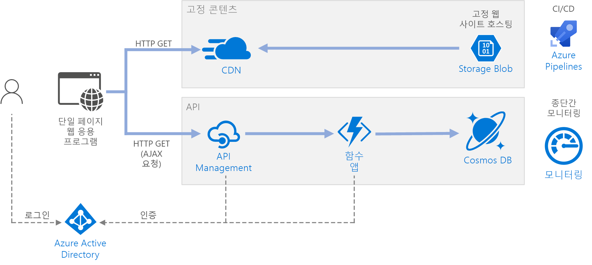

# <a name="serverless-web-application-on-azure"></a>Azure의 서버리스 웹 애플리케이션

이 참조 아키텍처에서는 [서버리스](https://azure.microsoft.com/solutions/serverless/) 웹 애플리케이션을 보여줍니다. 이 응용 프로그램은 Azure Blob Storage의 정적 콘텐츠를 제공하고 Azure Functions를 사용하여 API를 구현합니다. API는 Cosmos DB에서 데이터를 읽고 결과를 웹앱에 반환합니다. 이 아키텍처에 대한 참조 구현은 [GitHub][github]에서 사용할 수 있습니다.



'서버리스'라는 용어에는 별도의 관련된 두 가지 의미가 있습니다.

- **BaaS(Backend as a Service)**. 데이터베이스 및 저장소와 같은 백 엔드 클라우드 서비스는 클라이언트 응용 프로그램에서 이러한 서비스에 직접 연결할 수 있게 하는 API를 제공합니다.
- **FaaS(Functions as a Service)**. 이 모델에서 "함수"는 클라우드에 배포되고, 코드를 실행하는 서버를 완전히 추상화하는 호스팅 환경 내에서 실행되는 코드 조각입니다.

두 정의 모두에는 개발자와 DevOps 직원이 서버를 배포, 구성 또는 관리할 필요가 없다는 일반적인 개념이 있습니다. 이 참조 아키텍처는 Azure Functions를 사용하는 FaaS에 중점을 두고 있지만, Azure Blob Storage의 웹 콘텐츠를 제공하는 BaaS의 예입니다. FaaS에 대한 몇 가지 중요한 특징은 다음과 같습니다.

1. 계산 리소스는 필요에 따라 플랫폼별로 동적으로 할당됩니다.
1. 사용량 기반 가격 책정: 코드를 실행하는 데 사용된 계산 리소스에 대한 요금만 부과됩니다.
1. 계산 리소스는 트래픽 기반 요청에 따라 크기 조정되며, 개발자가 구성할 필요가 없습니다.

Functions는 HTTP 요청 또는 큐에 도착하는 메시지와 같은 외부 트리거가 발생하면 실행됩니다. 그러면 서버리스 아키텍처에서 [이벤트 구동 아키텍처 스타일][event-driven]이 자연스럽게 됩니다. 아키텍처에서 구성 요소 간의 작업을 조정하려면 메시지 broker 또는 pub/sub 패턴을 사용하는 것이 좋습니다. Azure에서 메시지 기술을 선택하는 데 도움이 필요하면[메시지를 배달하는 Azure 서비스 중에서 선택][azure-messaging]을 참조하세요.

## <a name="architecture"></a>아키텍처

이 아키텍처는 다음과 같은 구성 요소로 구성됩니다.

**Blob Storage** HTML, CSS 및 JavaScript 파일과 같은 정적 웹 콘텐츠는 Azure Blob Storage에 저장되며, [정적 웹 사이트 호스팅][static-hosting]을 사용하여 클라이언트에 제공됩니다. 모든 동적 상호 작용은 백 엔드 API를 호출하는 JavaScript 코드를 통해 수행됩니다. 웹 페이지를 렌더링하는 서버 쪽 코드는 없습니다. 정적 웹 사이트 호스팅은 인덱스 문서 및 404 사용자 지정 오류 페이지를 지원합니다.

> [!NOTE]
> 정적 웹 사이트 호스팅은 현재 [미리 보기][static-hosting-preview]로 있습니다.

**CDN**. HTTPS 엔드포인트를 제공할 뿐만 아니라 대기 시간을 줄이고 콘텐츠를 빠르게 전송하기 위해 콘텐츠를 캐시하려면 [Azure CDN(Content Delivery Network)][cdn]을 사용합니다.

**함수 앱**. [Azure Functions][functions]는 서버리스 계산 옵션입니다. 트리거를 통해 코드("함수")가 호출되는 이벤트 구동 모델을 사용합니다. 이 아키텍처에서 함수는 클라이언트에서 HTTP를 요청할 때 호출됩니다. 요청은 항상 아래에 설명된 API 게이트웨이를 통해 라우팅됩니다.

**API Management**. [API Management][apim]는 HTTP 함수 앞에 있는 API 게이트웨이를 제공합니다. API Management를 사용하여 클라이언트 응용 프로그램에서 사용하는 API를 게시하고 관리할 수 있습니다. 게이트웨이를 사용하면 프런트 엔드 응용 프로그램을 백 엔드 API에서 분리할 수 있습니다. 예를 들어 API Management는 URL을 다시 쓰거나, 백 엔드에 도달하기 전에 요청을 변환하거나, 요청 또는 응답 헤더를 설정하는 등의 작업을 수행할 수 있습니다.

API Management는 다음과 같은 교차 편집 문제를 구현하는 데에도 사용할 수 있습니다.

- 사용 할당량 및 속도 제한 적용
- 인증을 위한 OAuth 토큰 유효성 검사
- CORS(원본 간 요청) 사용
- 응답 캐싱
- 요청 모니터링 및 로깅

API Management에서 제공하는 기능 중 일부만 필요한 경우 다른 옵션으로 [Functions 프록시][functions-proxy]를 사용합니다. Azure Functions의 이 기능을 사용하면 백 엔드 함수에 대한 경로를 만들어 여러 함수 앱에 대해 단일 API 화면을 정의할 수 있습니다. Function 프록시는 HTTP 요청 및 응답에 대해 제한된 변환을 수행할 수도 있습니다. 그러나 API Management의 다양한 정책 기반 기능을 동일하게 제공하지는 않습니다.

**Cosmos DB** [Cosmos DB][cosmosdb]는 다중 모델 데이터베이스 서비스입니다. 이 시나리오의 경우 함수 응용 프로그램은 클라이언트의 HTTP GET 요청에 대한 응답으로 Cosmos DB에서 문서를 가져옵니다.

**Azure AD(Azure Active Directory)**. 사용자는 Azure AD 자격 증명을 사용하여 웹 응용 프로그램에 로그인합니다. Azure AD는 웹 응용 프로그램에서 API 요청을 인증하는 데 사용하는 API에 대한 액세스 토큰을 반환합니다([인증](#authentication) 참조).

**Azure Monitor** [Monitor][monitor]는 솔루션에 배포된 Azure 서비스에 대한 성능 메트릭을 수집합니다. 이러한 메트릭을 대시보드에서 시각화하여 솔루션의 상태를 볼 수 있습니다. 또한 응용 프로그램 로그도 수집합니다.

**Azure Pipelines**. [Pipelines][pipelines]는 응용 프로그램을 빌드, 테스트 및 배포하는 CI(지속적인 통합) 및 CD(지속적인 업데이트) 서비스입니다.

## <a name="recommendations"></a>권장 사항

### <a name="function-app-plans"></a>함수 앱 계획

Azure Functions는 두 가지 호스팅 모델을 지원합니다. **사용 계획**을 사용하면 코드가 실행될 때 계산 성능이 자동으로 할당됩니다.  **App Service** 계획을 사용하면 코드에 일단의 VM이 할당됩니다. App Service 계획은 VM의 수와 크기를 정의합니다.

위에서 설명한 정의에 따라 App Service 계획은 엄격히 *서버리스*가 아닙니다. 프로그래밍 모델은 동일하지만, 동일한 함수 코드가 사용 계획과 App Service 계획 모두에서 실행될 수 있습니다.

사용할 계획 유형을 선택할 때 고려해야 할 몇 가지 요소는 다음과 같습니다.

- **콜드 부팅**. 사용 계획에서 최근에 호출되지 않은 함수는 다음에 실행될 때 약간의 대기 시간이 추가로 발생합니다. 이 추가 대기 시간은 런타임 환경을 할당하고 준비하기 때문입니다. 일반적으로 초 단위이지만 로드해야 하는 종속성 수를 포함하여 몇 가지 요인에 따라 달라집니다. 자세한 내용은 [서버리스 콜드 부팅 이해][functions-cold-start]를 참조하세요. 추가 대기 시간은 사용자가 직접 관찰하므로 콜드 부팅은 일반적으로 비동기 메시지 구동 워크로드(큐 또는 이벤트 허브 트리거)보다 대화형 워크로드(HTTP 트리거)에서 더 큰 문제가 됩니다.
- **제한 시간**.  사용 계획에서 [구성 가능한][functions-timeout] 기간(최대 10분) 후에는 함수 실행 시간이 초과됩니다.
- **가상 네트워크 격리**. App Service 계획을 사용하면 격리된 전용 호스팅 환경인 [App Service Environment][ase] 내에서 함수가 실행될 수 있습니다.
- **가격 책정 모델**. 사용 계획은 실행 횟수와 리소스 사용량 따라 청구됩니다(메모리 &times; 실행 시간)에. App Service 계획은 VM 인스턴스 SKU에 따라 시간당 기준으로 청구됩니다. 사용하는 계산 리소스에 대해서만 비용을 지불하므로 사용 계획이 App Service 계획보다 저렴한 경우가 많습니다. 트래픽이 최고점 및 최저점에 있는 경우 특히 그렇습니다. 그러나 응용 프로그램에서 지속적으로 대량의 처리량이 발생하는 경우 App Service 계획이 사용 계획보다 비용이 저렴할 수 있습니다.
- **크기 조정**. 소비 모델의 큰 장점은 들어오는 트래픽을 기반으로 하여 필요에 따라 동적으로 크기가 조정된다는 것입니다. 이 크기 조정은 빠르게 수행되지만 램프 업(ramp-up) 기간이 여전히 있습니다. 일부 워크로드의 경우 VM을 의도적으로 과도하게 프로비전하여 램프 업 시간 없이 트래픽 급증을 처리할 수 있습니다. 이 경우 App Service 계획을 사용하는 것이 좋습니다.

### <a name="function-app-boundaries"></a>함수 앱 경계

*함수 앱*은 실행할 하나 이상의 *함수*를 호스팅합니다. 함수 앱을 사용하여 여러 함수를 논리적 단위로 그룹화할 수 있습니다. 함수 앱 내에서 함수는 동일한 응용 프로그램 설정, 호스팅 계획 및 배포 수명 주기를 공유합니다. 각 함수 앱에는 자체의 호스트 이름이 있습니다.

함수 앱을 사용하여 동일한 수명 주기와 설정을 공유하는 함수를 그룹화합니다. 동일한 수명 주기를 공유하지 않는 함수는 다른 함수 앱에서 호스팅해야 합니다.

마이크로 서비스 접근 방식을 사용하는 것이 좋습니다. 여기서는 각 함수 앱이 하나의 마이크로 서비스를 나타내며, 몇 가지 관련된 함수로 구성될 수 있습니다. 마이크로 서비스 아키텍처의 경우 서비스에는 느슨한 결합과 높은 기능적 응집력이 있어야 합니다. *느슨한 결합*은 다른 서비스를 동시에 업데이트하지 않고도 하나의 서비스를 변경할 수 있다는 것입니다. *응집력*은 서비스에 잘 정의된 단일 용도가 있다는 것입니다. 이러한 개념에 대한 자세한 내용은 [마이크로 서비스 설계: 도메인 분석][microservices-domain-analysis]을 참조하세요.

### <a name="function-bindings"></a>Functions 바인딩

가능한 경우 Functions [바인딩][functions-bindings]을 사용합니다. 바인딩은 코드를 데이터에 연결하고 다른 Azure 서비스와 통합하는 선언적 방법을 제공합니다. 입력 바인딩은 외부 데이터 원본의 입력 매개 변수를 채웁니다. 출력 바인딩은 함수의 반환 값을 큐 또는 데이터베이스와 같은 데이터 싱크로 보냅니다.

예를 들어 참조 구현의 `GetStatus` 함수는 Cosmos DB [입력 바인딩][cosmosdb-input-binding]을 사용합니다. 다음 바인딩은 HTTP 요청의 쿼리 문자열에서 가져온 쿼리 매개 변수를 사용하여 Cosmos DB에서 문서를 조회하도록 구성되어 있습니다. 문서가 있으면 매개 변수로 함수에 전달됩니다.

```csharp
[FunctionName("GetStatusFunction")]
public static Task<IActionResult> Run(
    [HttpTrigger(AuthorizationLevel.Function, "get", Route = null)] HttpRequest req,
    [CosmosDB(
        databaseName: "%COSMOSDB_DATABASE_NAME%",
        collectionName: "%COSMOSDB_DATABASE_COL%",
        ConnectionStringSetting = "COSMOSDB_CONNECTION_STRING",
        Id = "{Query.deviceId}",
        PartitionKey = "{Query.deviceId}")] dynamic deviceStatus,
    ILogger log)
{
    ...
}
```

바인딩을 사용하면 서비스와 직접 통신하는 코드를 작성할 필요가 없으므로 함수 코드가 더 간단해지고 데이터 원본 또는 싱크의 세부 정보가 추상화됩니다. 그러나 경우에 따라 바인딩에서 제공하는 것보다 더 복잡한 논리가 필요할 수도 있습니다. 이 경우 Azure 클라이언트 SDK를 직접 사용합니다.

## <a name="scalability-considerations"></a>확장성 고려 사항

**Functions**. 사용 계획의 경우 HTTP 트리거는 트래픽에 따라 크기 조정됩니다. 동시 함수 인스턴스의 수는 제한되지만, 각 인스턴스는 한 번에 둘 이상의 요청을 처리할 수 있습니다. App Service 계획의 경우 HTTP 트리거는 VM 인스턴스의 수에 따라 크기 조정됩니다. 즉 VM 인스턴스의 수가 고정된 값이거나 자동 크기 조정 규칙 집합을 기반으로 하여 자동으로 크기 조정될 수 있습니다. 자세한 내용은 [Azure Functions 크기 조정 및 호스팅][functions-scale]을 참조하세요.

**Cosmos DB** Cosmos DB의 처리 용량은 [RU(요청 단위)][ru]로 측정됩니다. 1RU 처리량은 1KB 문서를 가져오는 데 필요한 GET 처리량에 해당합니다. 10,000RU를 초과하는 Cosmos DB 컨테이너의 크기를 조정하려면 컨테이너를 만들 때 [파티션 키][partition-key]를 지정하고, 만드는 모든 문서에 파티션 키가 포함되어야 합니다. 파티션 키에 대한 자세한 내용은 [Azure Cosmos DB의 파티션 및 확장][cosmosdb-scale]을 참조하세요.

**API Management**. API Management는 규모를 확장하고 규칙 기반 자동 크기 조정을 지원할 수 있습니다. 크기 조정 프로세스에는 20분 이상이 걸립니다. 트래픽이 급증하면 예상되는 최대 버스트 트래픽을 제공해야 합니다. 그러나 자동 크기 조정은 시간별 또는 일별 트래픽 변동을 처리하는 데 유용합니다. 자세한 내용은 [Azure API Management 인스턴스자동 크기 조정][apim-scale]을 참조하세요.

## <a name="disaster-recovery-considerations"></a>재해 복구 고려 사항

여기에 표시된 배포는 단일 Azure 지역에 있습니다. 재해 복구에 더 탄력적인 방법을 적용하려면 다양한 서비스의 지리적 배포 기능을 활용합니다.

- API Management는 여러 Azure 지역에 걸쳐 단일 API Management 인스턴스를 배포하는 데 사용할 수 있는 다중 지역 배포를 지원합니다. 자세한 내용은 [여러 Azure 지역에 Azure API Management 서비스 인스턴스를 배포하는 방법][api-geo]을 참조하세요.

- [Traffic Manager][tm]를 사용하여 HTTP 요청을 주 지역으로 라우팅합니다. 해당 지역에서 실행하는 함수 앱을 사용할 수 없게 되면 Traffic Manager에서 보조 지역으로 조치 할 수 있습니다.

- Cosmos DB는 [다중 마스터 지역][cosmosdb-geo]을 지원하므로 Cosmos DB 계정에 추가하는 모든 지역에 쓸 수 있습니다. 다중 마스터를 사용하도록 설정하지 않은 경우에도 주 쓰기 지역을 장애 조치할 수 있습니다. Cosmos DB 클라이언트 SDK 및 Azure Function 바인딩은 장애 조치를 자동으로 처리하므로 응용 프로그램 구성 설정을 업데이트할 필요가 없습니다.

## <a name="security-considerations"></a>보안 고려 사항

### <a name="authentication"></a>인증

참조 구현의 `GetStatus` API는 Azure AD를 사용하여 요청을 인증합니다. Azure AD는 OAuth 2 프로토콜에 기반한 인증 프로토콜인 Open ID Connect 프로토콜을 지원합니다.

이 아키텍처에서 클라이언트 응용 프로그램은 브라우저에서 실행되는 SPA(단일 페이지 응용 프로그램)입니다. 이 유형의 클라이언트 응용 프로그램은 클라이언트 비밀 또는 권한 부여 코드를 숨길 수 없으므로 암시적 허용 흐름이 적절합니다. [어떤 OAuth 2.0 흐름을 사용해야 합니까?][oauth-flow]를 참조하세요. 전체 흐름은 다음과 같습니다.

1. 사용자가 웹 응용 프로그램에서 "로그인" 링크를 클릭합니다.
1. 브라우저가 Azure AD 로그인 페이지로 리디렉션됩니다.
1. 사용자가 로그인합니다.
1. Azure AD에서 URL 조각의 액세스 토큰을 포함하여 클라이언트 응용 프로그램으로 다시 리디렉션합니다.
1. 웹 응용 프로그램에서 API를 호출하면 인증 헤더에 액세스 토큰이 포함됩니다. 응용 프로그램 ID는 액세스 토큰의 대상 그룹('aud') 클레임으로 보내집니다.
1. 백 엔드 API에서 액세스 토큰의 유효성을 검사합니다.

인증을 구성하려면

- Azure AD 테넌트에 응용 프로그램을 등록합니다. 그러면 클라이언트에서 로그인 URL에 포함하는 응용 프로그램 ID가 생성됩니다.

- 함수 앱 내에서 Azure AD 인증을 사용하도록 설정합니다. 자세한 내용은 [Azure App Service의 인증 및 권한 부여][app-service-auth]를 참조하세요.

- 액세스 토큰의 유효성을 검사하여 요청을 사전 승인하는 [validate-jwt policy][apim-validate-jwt] 정책을 API Management에 추가합니다.

자세한 내용은 [GitHub 추가 정보][readme]를 참조하세요.

클라이언트 응용 프로그램 및 백 엔드 API의 경우 Azure AD에서 별도 앱 등록을 만드는 것이 좋습니다. 클라이언트 응용 프로그램에 API를 호출하는 권한을 부여합니다. 이 방법은 여러 API 및 클라이언트를 정의하고 각각에 대한 사용 권한을 제어할 유연성을 제공합니다.

API 내에서 [범위][scopes]를 사용하여 응용 프로그램이 사용자로부터 요청한 사용 권한을 세부적으로 제어할 수 있습니다. 예를 들어 API에는 `Read` 및 `Write` 범위가 포함될 수 있고, 특정 클라이언트 앱은 `Read` 권한만을 부여하도록 사용자에게 요청할 수 있습니다.

### <a name="authorization"></a>권한 부여

많은 응용 프로그램에서 백 엔드 API는 사용자에게 지정된 작업을 수행할 권한이 있는지 여부를 확인해야 합니다. [클레임 기반 권한 부여][claims]를 사용하는 것이 좋습니다. 여기서 사용자에 대한 정보는 ID 공급자(이 경우 Azure AD)에 전달되고 권한 부여를 결정하는 데 사용됩니다.

일부 클레임은 Azure AD에서 클라이언트에 반환하는 ID 토큰 내에 제공됩니다. 요청의 X-MS-CLIENT-PRINCIPAL 헤더를 검사하여 함수 앱 내에서 이러한 클레임을 가져올 수 있습니다. 다른 클레임의 경우 [Microsoft Graph][graph]를 사용하여 Azure AD를 쿼리합니다(로그인 중에 사용자 동의 필요).

예를 들어 Azure AD에서 응용 프로그램을 등록할 때 응용 프로그램 역할 집합을 응용 프로그램의 등록 매니페스트에 정의할 수 있습니다. 사용자가 응용 프로그램에 로그인하면 Azure AD에는 사용자가 부여한 각 역할에 대한 "역할" 클레임이 포함됩니다(그룹 멤버 자격을 통해 상속된 역할 포함).

참조 구현에서 함수는 인증된 사용자가 `GetStatus` 응용 프로그램 역할의 멤버인지 여부를 확인합니다. 그렇지 않은 경우 함수에서 HTTP 권한 없음(401) 응답을 반환합니다.

```csharp
[FunctionName("GetStatusFunction")]
public static Task<IActionResult> Run(
    [HttpTrigger(AuthorizationLevel.Function, "get", "post", Route = null)] HttpRequest req,
    [CosmosDB(
        databaseName: "%COSMOSDB_DATABASE_NAME%",
        collectionName: "%COSMOSDB_DATABASE_COL%",
        ConnectionStringSetting = "COSMOSDB_CONNECTION_STRING",
        Id = "{Query.deviceId}",
        PartitionKey = "{Query.deviceId}")] dynamic deviceStatus,
    ILogger log)
{
    log.LogInformation("Processing GetStatus request.");

    return req.HandleIfAuthorizedForRoles(new[] { GetDeviceStatusRoleName },
        async () =>
        {
            string deviceId = req.Query["deviceId"];
            if (deviceId == null)
            {
                return new BadRequestObjectResult("Missing DeviceId");
            }

            return await Task.FromResult<IActionResult>(deviceStatus != null
                    ? (ActionResult)new OkObjectResult(deviceStatus)
                    : new NotFoundResult());
        },
        log);
}
```

이 코드 예제에서 `HandleIfAuthorizedForRoles`는 역할 클레임을 확인하고, 해당 클레임이 없는 경우 HTTP 401을 반환하는 확장 메서드입니다. 소스 코드는 [여기][HttpRequestAuthorizationExtensions]서 찾을 수 있습니다. `HandleIfAuthorizedForRoles`에는 `ILogger` 매개 변수가 사용됩니다. 감사 추적을 수행하고 필요에 따라 문제를 진단할 수 있도록 권한이 없는 요청을 기록해야 합니다. 동시에 HTTP 401 응답 내에 자세한 정보가 누출되지 않도록 방지합니다.

### <a name="cors"></a>CORS

이 참조 아키텍처에서 웹 응용 프로그램과 API는 동일한 원본을 공유하지 않습니다. 즉 응용 프로그램이 API를 호출할 때의 원본 간 요청입니다. 브라우저 보안은 웹 페이지에서 다른 도메인으로 AJAX 요청을 수행하지 못하도록 방지합니다. 이 제한은 *동일 원본 정책*이라고 하며, 악성 사이트에서 다른 사이트의 중요한 데이터를 읽지 못하도록 차단합니다. 원본 간 요청을 사용하려면 CORS(원본 간 요청) [정책][cors-policy]을 API Management 게이트웨이에 추가합니다.

```xml
<cors allow-credentials="true">
    <allowed-origins>
        <origin>[Website URL]</origin>
    </allowed-origins>
    <allowed-methods>
        <method>GET</method>
    </allowed-methods>
    <allowed-headers>
        <header>*</header>
    </allowed-headers>
</cors>
```

이 예제에서 **allow-credentials** 특성은 **true**입니다. 그러면 요청과 함께 자격 증명(쿠키 포함)을 보낼 수 있는 권한을 브라우저에 부여합니다. 그렇지 않으면 브라우저에서 기본적으로 원본 간 요청을 사용하여 자격 증명을 보내지 않습니다.

> [!NOTE]
> **allow-credentials**는 매우 신중하게 **true**로 설정해야 합니다. 이렇게 하면 사용자가 알지 못하는 사이에 웹 사이트에서 해당 사용자를 대신하여 사용자의 자격 증명을 API로 보낼 수 있기 때문입니다. 허용된 원본을 신뢰해야 합니다.

### <a name="enforce-https"></a>HTTPS 적용

보안을 극대화하려면 요청 파이프라인 전체에 HTTPS가 필요합니다.

- **CDN**. Azure CDN은 기본적으로 `*.azureedge.net` 하위 도메인에서 HTTPS를 지원합니다. CDN의 사용자 지정 도메인 이름에 HTTPS를 사용하도록 설정하려면 [자습서: Azure CDN 사용자 지정 도메인에서 HTTPS 구성][cdn-https]을 참조하세요.

- **정적 웹 사이트 호스팅**. 저장소 계정에서 "[보안 전송 필요][storage-https]" 옵션을 사용하도록 설정합니다. 이 옵션을 사용하도록 설정하면 저장소 계정에서 보안 HTTPS 연결의 요청만 허용합니다.

- **API Management**. HTTPS 프로토콜만 사용하도록 API를 구성합니다. Azure Portal 또는 Resource Manager 템플릿을 통해 이를 구성할 수 있습니다.

    ```json
    {
        "apiVersion": "2018-01-01",
        "type": "apis",
        "name": "dronedeliveryapi",
        "dependsOn": [
            "[concat('Microsoft.ApiManagement/service/', variables('apiManagementServiceName'))]"
        ],
        "properties": {
            "displayName": "Drone Delivery API",
            "description": "Drone Delivery API",
            "path": "api",
            "protocols": [ "HTTPS" ]
        },
        ...
    }
    ```

- **Azure Functions**. "[HTTPS만][functions-https]" 설정을 사용하도록 설정합니다.

### <a name="lock-down-the-function-app"></a>함수 앱 잠금

모든 함수 호출은 API 게이트웨이를 통해 이동해야 합니다. 이 작업은 다음과 같이 수행할 수 있습니다.

- 함수 키를 요구하도록 함수 앱을 구성합니다. 함수 앱을 호출하면 API Management 게이트웨이에 함수 키가 포함됩니다. 이렇게 하면 클라이언트에서 게이트웨이를 무시하여 직접 함수를 호출하지 못하도록 차단합니다.

- API Management 게이트웨이에는 [고정 IP 주소][apim-ip]가 있습니다. Azure Function을 제한하여 고정 IP 주소의 호출만 허용합니다. 자세한 내용은 [Azure App Service 고정 IP 제한][app-service-ip-restrictions]을 참조하세요. 이 기능은 표준 계층 서비스에서만 사용할 수 있습니다.

### <a name="protect-application-secrets"></a>애플리케이션 비밀 보호

응용 프로그램 비밀(예: 데이터베이스 자격 증명)은 코드 또는 구성 파일에 저장하지 않습니다. 대신, Azure에서 암호화되어 저장되는 [앱 설정]을 사용합니다. 자세한 내용은 [Azure App Service 및 Azure Functions의 보안][app-service-security]을 참조하세요.

또는 Key Vault에 응용 프로그램 비밀을 저장할 수 있습니다. 이렇게 하면 비밀 저장소를 중앙 집중화하고, 해당 배포를 제어하며, 비밀에 액세스하는 방법과 시기를 모니터링할 수 있습니다. 자세한 내용은 [자습서: Key Vault에서 비밀을 읽도록 Azure 웹 응용 프로그램 구성][key-vault-web-app]을 참조하세요. 그러나 Functions 트리거와 바인딩은 앱 설정에서 해당 구성 설정을 로드합니다. Key Vault 비밀을 사용하도록 트리거와 바인딩을 구성하는 기본 제공 방법은 없습니다.

## <a name="devops-considerations"></a>DevOps 고려 사항

### <a name="deployment"></a>배포

함수 앱을 배포하려면 [패키지 파일][functions-run-from-package]("패키지에서 실행")을 사용하는 것이 좋습니다. 이 방법을 사용하면 Blob Storage 컨테이너에 zip 파일을 업로드하고, Functions 런타임은 읽기 전용 파일 시스템으로 zip 파일을 탑재합니다. 실패한 배포로 인해 응용 프로그램이 일관성이 없는 상태로 남겨질 가능성을 줄일 수 있는 원자성 조작입니다. 한 번에 모든 파일이 교환되기 때문에 특히 Node.js 앱의 경우 콜드 시작 시간을 개선할 수도 있습니다.

### <a name="api-versioning"></a>API 버전 관리

API는 서비스와 클라이언트 간의 계약입니다. 이 아키텍처에서 API 계약은 API Management 계층에서 정의됩니다. API Management는 각각 별개이지만 상호 보완 관계인 두 가지 [버전 관리 개념][apim-versioning]을 지원합니다.

- *버전*을 사용하면 API 소비자가 요구 사항에 따라 API 버전을 선택할 수 있습니다(예: v1 및 v2).

- *수정 버전*을 통해 API 관리자는 API에서 호환성이 손상되지 않는 변경 작업을 수행하고 변경 내용을 배포할 수 있으며, 변경 로그를 통해 API 소비자에게 변경 관련 정보를 제공할 수 있습니다.

API에서 호환성이 손상되는 변경을 수행하는 경우 API Management에서 새 버전을 게시합니다. 새 버전은 원래 버전과 함께 별도의 함수 앱에 배포됩니다. 이렇게 하면 클라이언트 응용 프로그램을 중단하지 않고 기존 클라이언트를 새 API로 마이그레이션할 수 있습니다. 결국에는 이전 버전을 더 이상 사용하지 않을 수 있습니다. API Management는 여러 [버전 관리 체계][apim-versioning-schemes]: URL 경로, HTTP 헤더 또는 쿼리 문자열을 지원합니다. 일반적인 API 버전 관리에 대한 자세한 내용은 [RESTful 웹 API 버전 관리][api-versioning]를 참조하세요.

API 변경을 차단하지 않는 업데이트의 경우 동일한 함수 앱의 스테이징 슬롯에 새 버전을 배포합니다. 배포가 성공했는지 확인한 다음, 준비된 버전을 프로덕션 버전으로 바꿉니다. API Management에서 수정 버전을 게시합니다.

## <a name="deploy-the-solution"></a>솔루션 배포

이 참조 아키텍처를 배포하기 위해 [GitHub 추가 정보][readme]를 확인합니다.

<!-- links -->

[api-versioning]: ../../best-practices/api-design.md#versioning-a-restful-web-api
[apim]: /azure/api-management/api-management-key-concepts
[apim-ip]: /azure/api-management/api-management-faq#is-the-api-management-gateway-ip-address-constant-can-i-use-it-in-firewall-rules
[api-geo]: /azure/api-management/api-management-howto-deploy-multi-region
[apim-scale]: /azure/api-management/api-management-howto-autoscale
[apim-validate-jwt]: /azure/api-management/api-management-access-restriction-policies#ValidateJWT
[apim-versioning]: /azure/api-management/api-management-get-started-publish-versions
[apim-versioning-schemes]: /azure/api-management/api-management-get-started-publish-versions#choose-a-versioning-scheme
[app-service-auth]: /azure/app-service/app-service-authentication-overview
[app-service-ip-restrictions]: /azure/app-service/app-service-ip-restrictions
[app-service-security]: /azure/app-service/app-service-security
[ase]: /azure/app-service/environment/intro
[azure-messaging]: /azure/event-grid/compare-messaging-services
[claims]: https://en.wikipedia.org/wiki/Claims-based_identity
[cdn]: https://azure.microsoft.com/services/cdn/
[cdn-https]: /azure/cdn/cdn-custom-ssl
[cors-policy]: /azure/api-management/api-management-cross-domain-policies
[cosmosdb]: /azure/cosmos-db/introduction
[cosmosdb-geo]: /azure/cosmos-db/distribute-data-globally
[cosmosdb-input-binding]: /azure/azure-functions/functions-bindings-cosmosdb-v2#input
[cosmosdb-scale]: /azure/cosmos-db/partition-data
[event-driven]: ../../guide/architecture-styles/event-driven.md
[functions]: /azure/azure-functions/functions-overview
[functions-bindings]: /azure/azure-functions/functions-triggers-bindings
[functions-cold-start]: https://blogs.msdn.microsoft.com/appserviceteam/2018/02/07/understanding-serverless-cold-start/
[functions-https]: /azure/app-service/app-service-web-tutorial-custom-ssl#enforce-https
[functions-proxy]: /azure/azure-functions/functions-proxies
[functions-run-from-package]: /azure/azure-functions/run-functions-from-deployment-package
[functions-scale]: /azure/azure-functions/functions-scale
[functions-timeout]: /azure/azure-functions/functions-scale#consumption-plan
[functions-zip-deploy]: /azure/azure-functions/deployment-zip-push
[graph]: https://developer.microsoft.com/graph/docs/concepts/overview
[key-vault-web-app]: /azure/key-vault/tutorial-web-application-keyvault
[microservices-domain-analysis]: ../../microservices/domain-analysis.md
[monitor]: /azure/azure-monitor/overview
[oauth-flow]: https://auth0.com/docs/api-auth/which-oauth-flow-to-use
[partition-key]: /azure/cosmos-db/partition-data
[pipelines]: /azure/devops/pipelines/index
[ru]: /azure/cosmos-db/request-units
[scopes]: /azure/active-directory/develop/v2-permissions-and-consent
[static-hosting]: /azure/storage/blobs/storage-blob-static-website
[static-hosting-preview]: https://azure.microsoft.com/blog/azure-storage-static-web-hosting-public-preview/
[storage-https]: /azure/storage/common/storage-require-secure-transfer
[tm]: /azure/traffic-manager/traffic-manager-overview

[github]: https://github.com/mspnp/serverless-reference-implementation
[HttpRequestAuthorizationExtensions]: https://github.com/mspnp/serverless-reference-implementation/blob/master/src/DroneStatus/dotnet/DroneStatusFunctionApp/HttpRequestAuthorizationExtensions.cs
[readme]: https://github.com/mspnp/serverless-reference-implementation/blob/master/README.md
